## Overview

This guide describes how to install and configure **Oracle APEX**, **Oracle REST Data Services (ORDS)**, and **Apache Tomcat** on an existing **Oracle Database 19c** environment running on **Microsoft Windows Server**.

ORDS is deployed to Apache Tomcat, which provides the web application environment for accessing Oracle APEX. The configuration also includes HTTPS/SSL to secure client connections.

The procedure covers:

- Downloading Oracle APEX
- Downloading Oracle REST Data Services
- Installing Oracle APEX
- Configuring Oracle APEX
- Installing and configuring ORDS
- Installing Apache Tomcat
- Deploying ORDS to Apache Tomcat
- Configuring APEX static resources
- Creating an Apache Tomcat Windows service
- Configuring SSL/TLS for Apache Tomcat
- Verifying HTTPS access to Oracle APEX

## Environment

The environment used in this guide consists of an existing Oracle Database 19c installation on Microsoft Windows Server.

| Component | Configuration |
| --- | --- |
| Operating System | Microsoft Windows Server |
| Database | Oracle Database 19c |
| Oracle APEX | `26.1` |
| ORDS | `26.2.2` |
| Apache Tomcat | `9.0.120` |
| Java | `JDK 21 LTS` |
| Database Name | `SHOPCDB` |
| PDB Name | `SALESPDB` |
| Tomcat HTTP Port | `8080` |
| Tomcat HTTPS Port | `8443` |

## Prerequisites

Before installing Oracle APEX, ORDS, and Apache Tomcat, verify that the existing Oracle Database 19c environment is available and that the required software prerequisites are satisfied.

Verify the following:

- Oracle Database 19c is installed and running.
- The target pluggable database is open.
- Oracle Database 19c is patched to **RU 19.32**. The minimum supported Oracle Database 19c Release Update for Oracle APEX 26.1 is **RU 19.18**.
- Database listener connectivity is available.
- Administrative database credentials are available.
- A Java version supported by the selected ORDS and Tomcat releases is installed (JDK 21 LTS).
- The required network ports are available.
- An SSL/TLS certificate is available for the HTTPS configuration.

### Verify Java

Verify that the required Java version is installed and available:

```cmd
C:\Users\oracle>java -version
java version "21.0.12" 2026-07-21 LTS
Java(TM) SE Runtime Environment (build 21.0.12+7-LTS-205)
Java HotSpot(TM) 64-Bit Server VM (build 21.0.12+7-LTS-205, mixed mode, sharing)
```

Verify the Java installation path and configure the required environment variables where applicable.

## Downloading the Required Software

Download the required Oracle APEX, Oracle REST Data Services, and Apache Tomcat software before starting the installation.

The environment used in this guide uses the following versions:

- Oracle APEX 26.1
- Oracle REST Data Services 26.2.2
- Apache Tomcat 9.0.120
- Oracle JDK 21 LTS

### Download Oracle APEX

Download **Oracle APEX 26.1** from Oracle and extract the archive while preserving the directory structure.

For this environment, the archive is extracted under:

```text
C:\oracle\apex_26.1
```

The Oracle APEX installation files are located under:

```text
C:\oracle\apex_26.1\apex
```

### Download Oracle REST Data Services

Download **Oracle REST Data Services 26.2.2** from Oracle and extract the archive to the selected software directory.

For this environment:

```text
C:\oracle\ords_26.2.2
```

The ORDS product installation and configuration directories will be kept separate. The ORDS configuration directory is created later during the ORDS configuration.

### Download Apache Tomcat

Download **Apache Tomcat 9.0.120** and extract it to the selected installation directory.

For this environment:

```text
C:\oracle\tomcat_9.0.120
```

### Verify Java

Verify that Java is installed and available from the command line:

```cmd
C:\Users\oracle>java -version
java version "21.0.12" 2026-07-21 LTS
Java(TM) SE Runtime Environment (build 21.0.12+7-LTS-205)
Java HotSpot(TM) 64-Bit Server VM (build 21.0.12+7-LTS-205, mixed mode, sharing)
```

## Installing Oracle APEX

Oracle APEX is installed in the `SALESPDB` pluggable database.

Before starting the installation, verify that the target PDB is open in read-write mode and ensure that the SQL*Plus session is connected to the correct container.

### Verify the Target Pluggable Database

Connect to Oracle Database as a privileged administrative user:

```cmd
C:\Users\oracle>sqlplus / as sysdba
```

Verify the available pluggable databases:

```sql
SQL> show pdbs

    CON_ID CON_NAME                       OPEN MODE  RESTRICTED
---------- ------------------------------ ---------- ----------
         2 PDB$SEED                       READ ONLY  NO
         3 SALESPDB                       READ WRITE NO
```

The target PDB `SALESPDB` is open in `READ WRITE` mode.

Change the current container to `SALESPDB`:

```sql
SQL> alter session set container=SALESPDB;

Session altered.
```

Verify the current container:

```sql
SQL> show con_name

CON_NAME
------------------------------
SALESPDB
```

### Create the APEX Tablespace

This environment uses a dedicated tablespace named `APEX_TS` for the Oracle APEX installation.

Create the tablespace while connected to `SALESPDB`:

```sql
SQL> create tablespace APEX_TS
  2  datafile size 500m
  3  autoextend on
  4  maxsize unlimited;

Tablespace created.
```

> The use of a dedicated `APEX_TS` tablespace is specific to this environment. Oracle APEX can also be installed using an existing suitable tablespace.

Exit SQL*Plus:

```sql
SQL> exit
```

### Install Oracle APEX

Change to the directory containing the extracted Oracle APEX installation files:

```cmd
C:\Users\oracle>cd C:\oracle\apex_26.1\apex
```

Start SQL*Plus:

```cmd
C:\oracle\apex_26.1\apex>sqlplus / as sysdba
```

Change the current container to `SALESPDB`:

```sql
SQL> alter session set container=SALESPDB;

Session altered.
```

Optionally verify the current container before starting the installation:

```sql
SQL> show con_name

CON_NAME
------------------------------
SALESPDB
```

Run the Oracle APEX installation:

```sql
SQL> @apexins.sql APEX_TS APEX_TS TEMP /i/
```

The `apexins.sql` parameters used in this environment are:

| Parameter | Value | Description |
| --- | --- | --- |
| APEX tablespace | `APEX_TS` | Tablespace used for the Oracle APEX application user |
| Files tablespace | `APEX_TS` | Tablespace used for the Oracle APEX files user |
| Temporary tablespace | `TEMP` | Temporary tablespace |
| Image prefix | `/i/` | Virtual path used for Oracle APEX static resources |

The installation can take several minutes to complete.

```cmd
.....

--application/shared_components/user_interface/templates/label/apex_5_0_optional_label
--application/shared_components/user_interface/templates/label/outline_label_required
--application/shared_components/user_interface/templates/breadcrumb/apex_5_0_breadcrumbs
--application/shared_components/user_interface/templates/popuplov/search_dialog
--application/shared_components/globalization/language
--application/shared_components/logic/build_options
--application/shared_components/globalization/messages
--application/shared_components/globalization/dyntranslations
--application/shared_components/security/authentications/internal_authentication
--application/user_interfaces/combined_files
--application/pages/page_00000
--application/pages/page_00001
--application/pages/page_00100
--application/pages/page_00200
--application/pages/page_00210
--application/pages/page_00230
--application/pages/page_00240
--application/pages/page_00250
--application/pages/page_00300
--application/pages/page_00310
--application/pages/page_00320
--application/pages/page_00330
--application/pages/page_00340
--application/pages/page_00400
--application/pages/page_00500
--application/pages/page_00510
--application/pages/page_00520
--application/pages/page_00530
--application/pages/page_00550
--application/pages/page_00560
--application/pages/page_00900
--application/pages/page_01000
--application/pages/page_01010
--application/pages/page_01020
--application/pages/page_01030
--application/pages/page_01100
--application/pages/page_01110
--application/pages/page_01120
--application/pages/page_01130
--application/pages/page_01140
--application/pages/page_01150
--application/pages/page_01160
--application/pages/page_01170
--application/pages/page_01180
--application/pages/page_02000
--application/pages/page_02200
--application/pages/page_02210
--application/pages/page_02600
--application/pages/page_02610
--application/pages/page_02620
--application/pages/page_02630
--application/shared_components/logic/component_groups/builder_shared_components
--application/deployment/definition
--application/deployment/checks
--application/deployment/buildoptions
--application/end_environment
... elapsed: 15.23 sec
...donee

....
....

timing for: Computing Pub Syn Dependents
Elapsed:    0.00

#
# Upgrade Hot Metadata and Switch Schemas
#

timing for: Upgrade Hot Metadata and Switch Schemas
Elapsed:    0.10

#
# Installing FLOWS_FILES Objects
#
...create flows_files
...trigger wwv_biu_flow_file_objects
No errors.

timing for: Installing FLOWS_FILES Objects
Elapsed:    0.00

#
# Installing APEX$SESSION Context
#

timing for: Installing APEX$SESSION Context
Elapsed:    0.00

#
# Recompiling APEX_260100
#
...reset_state_and_show_invalid.sql

timing for: Recompiling APEX_260100
Elapsed:    0.02

#
# Installing APEX REST Config
#
...gen_adm_pwd.sql
...null1.sql

timing for: Installing APEX REST Config
Elapsed:    0.00

#
# Set Loaded/Upgraded in Registry
#

timing for: Set Loaded/Upgraded in Registry
Elapsed:    0.00

#
# Removing Unused SYS Objects and Public Privs
#

timing for: Removing Unused SYS Objects and Public Privs
Elapsed:    0.00

#
# Validating Installation
#
...(14:41:30) Starting validate_apex for APEX_260100
...(14:41:30) Checking missing privileges for APEX_260100
...(14:41:31) Checking missing privileges for APEX_GRANTS_FOR_NEW_USERS_ROLE
...(14:41:31) Re-generating APEX_260100.wwv_flow_db_version
... wwv_flow_db_version is up to date
...(14:41:31) Checking for sys.wwv_flow_cu_constraints
...(14:41:31) Checking for the existence of APEX public synonyms
...(14:41:31) Checking invalid public synonyms
...(14:41:32) Key object existence check
...(14:41:32) Post-ORDS updates
...(14:41:32) calling wwv_util_apex_260100.post_ords_upgrade
...(14:41:32) Setting DBMS Registry for APEX to valid
...(14:41:32) Exiting validate_apex
JOB_QUEUE_PROCESSES: 120

timing for: Validating Installation
Elapsed:    0.03

#
# Actions in Phase 3:
#
    ok 1 - BEGIN                                                        |   0.00
    ok 2 - Updating DBA_REGISTRY                                        |   0.02
    ok 3 - Computing Pub Syn Dependents                                 |   0.00
    ok 4 - Upgrade Hot Metadata and Switch Schemas                      |   0.00
    ok 5 - Removing Jobs                                                |   0.00
    ok 6 - Creating Public Synonyms                                     |   0.02
    ok 7 - Granting Public Synonyms                                     |   0.07
    ok 8 - Granting to FLOWS_FILES                                      |   0.00
    ok 9 - Creating FLOWS_FILES grants and synonyms                     |   0.00
    ok 10 - Syncing ORDS Gateway Allow List                             |   0.02
    ok 11 - Creating Jobs                                               |   0.00
    ok 12 - Creating Dev Jobs                                           |   0.00
    ok 13 - Installing FLOWS_FILES Objects                              |   0.00
    ok 14 - Installing APEX$SESSION Context                             |   0.00
    ok 15 - Recompiling APEX_260100                                     |   0.02
    ok 16 - Installing APEX REST Config                                 |   0.00
    ok 17 - Set Loaded/Upgraded in Registry                             |   0.00
    ok 18 - Setting Patch Status: APPLIED                               |   0.00
    ok 19 - Removing Unused SYS Objects and Public Privs                |   0.00
    ok 20 - Validating Installation                                     |   0.03
ok 3 - 20 actions passed, 0 actions failed                              |   0.17
...
```

After the installation completes successfully, output similar to the following is displayed:

```text
Thank you for installing Oracle APEX 26.1.0

Oracle APEX is installed in the APEX_260100 schema.

The structure of the link to the Oracle APEX Administration Services is as follows:
http://host:port/ords/apex_admin

The structure of the link to the Oracle APEX development environment is as follows:
http://host:port/ords/apex
```

> The URLs displayed at the end of the APEX installation are not yet available at this stage. ORDS and Apache Tomcat are configured later in this guide to provide web access to Oracle APEX.


### Configure the APEX Administrator Account

Configure the Oracle APEX administrator account after the installation has completed.

```cmd
SQL> alter session set container=salespdb;

Session altered.

SQL> @apxchpwd.sql
...set_appun.sql
================================================================================
This script can be used to change the password of an Oracle APEX
instance administrator. If the user does not yet exist, a user record will be
created.
================================================================================
Enter the administrator's username [ADMIN] ADMIN
User "ADMIN" does not yet exist and will be created.
Enter ADMIN's email [ADMIN]
Enter ADMIN's password []
Created instance administrator ADMIN.

SQL>
```


## Configuring the APEX Administrator Account

After installing Oracle APEX, configure the APEX Instance Administrator account.

Ensure that the SQL*Plus session is connected to `SALESPDB`:

```sql
SQL> show con_name

CON_NAME
------------------------------
SALESPDB
```

Run the `apxchpwd.sql` script:

```sql
SQL> @apxchpwd.sql
```

Specify the administrator username, email address, and password when prompted.

Example:

```text
Enter the administrator's username [ADMIN] ADMIN
User "ADMIN" does not yet exist and will be created.
Enter ADMIN's email [ADMIN]
Enter ADMIN's password []
Created instance administrator ADMIN.
```

The APEX Instance Administrator account is used to access **Oracle APEX Administration Services** after ORDS and Apache Tomcat are configured.

## Configuring APEX REST Services

Configure the database accounts required for Oracle APEX REST services.

Ensure that the session is connected to `SALESPDB` and run:

```sql
SQL> @apex_rest_config.sql
```

The script prompts for passwords for the required accounts.

Example:

```text
Enter a password for the APEX_LISTENER user              []
Enter a password for the APEX_REST_PUBLIC_USER user      []
```

The script configures the required APEX REST-related database accounts and privileges.

Output similar to the following is displayed:

```text
...set_appun.sql
...setting session environment
...create APEX_LISTENER and APEX_REST_PUBLIC_USER users
...grants for APEX_LISTENER and ORDS_METADATA user
```

## Verifying the Oracle APEX Installation

After completing the APEX installation and configuration, verify the installed version and component status.

### Verify the APEX Version

Ensure that the session is connected to `SALESPDB`:

```sql
SQL> alter session set container=SALESPDB;

Session altered.
```

Query the installed Oracle APEX version:

```sql
SQL> select version_no from apex_release;

VERSION_NO
----------------
26.1.0
```

### Verify the APEX Component Status

Verify the Oracle APEX component status in the data dictionary:

```sql
SQL> select comp_id, version, status
     from dba_registry
     where comp_id = 'APEX';
```

The APEX component should report a status of `VALID`.

Example:

```text
COMP_ID    VERSION      STATUS
---------- ------------ -----------
APEX       26.1.0       VALID
```

At this point, the Oracle APEX database installation is complete.

The next step is to install and configure **Oracle REST Data Services (ORDS)** for the `SALESPDB` pluggable database.

## Installing and Configuring ORDS

Oracle REST Data Services (ORDS) provides the web application layer used to access Oracle APEX.

In this environment, ORDS is installed in the `SALESPDB` pluggable database and configured using a dedicated configuration directory.

ORDS Standalone mode is not configured because ORDS will be deployed to **Apache Tomcat** later in this guide.

The environment uses:

| Component | Configuration |
| --- | --- |
| ORDS Version | `26.2.2` |
| ORDS Home | `C:\oracle\ords_26.2.2` |
| ORDS Configuration | `C:\oracle\ords-config` |
| Database Connection | TNS |
| TNS Alias | `SALESPDB` |
| TNS Directory | `C:\app\oracle\product\19c\dbhome_1\network\admin` |
| ORDS Runtime User | `ORDS_PUBLIC_USER` |
| Target PDB | `SALESPDB` |

### Prepare the ORDS Configuration Directory

Create a dedicated directory for the ORDS configuration:

```cmd
C:\Users\oracle\Desktop>mkdir C:\oracle\ords-config
```

Keep the ORDS configuration directory separate from the ORDS product installation directory.

The directory layout used in this environment is:

```text
C:\oracle\ords_26.2.2
C:\oracle\ords-config
```

The first directory contains the ORDS software, while the second contains the ORDS configuration.

### Configure the ORDS Environment

Set the environment variables required for the ORDS and Apache Tomcat installation:

```cmd
C:\Users\oracle\Desktop>set ORDS_HOME=C:\oracle\ords_26.2.2
C:\Users\oracle\Desktop>set TOMCAT_HOME=C:\oracle\tomcat_9.0.120
C:\Users\oracle\Desktop>set ORDS_CONFIG=C:\oracle\ords-config
C:\Users\oracle\Desktop>set PATH=%ORDS_HOME%\bin;%TOMCAT_HOME%\bin;%PATH%
```

> These environment variables are set for the current Command Prompt session. They can be configured permanently later if required.

### Verify the ORDS Version

Verify that the ORDS command-line interface is available:

```cmd
C:\Users\oracle\Desktop>ords --version

ORDS: Release 26.2 Production on Wed Aug 12 21:58:14 2026

Copyright (c) 2010, 2026, Oracle.

Configuration:
  C:\oracle\ords-config

Oracle REST Data Services 26.2.2.r2041619
```

The output confirms the version of the ORDS (26.2.2) and that the configuration directory is:

```text
C:\oracle\ords-config
```

### Install ORDS

Run the ORDS interactive installation:

```cmd
C:\Users\oracle\Desktop>ords --config C:\oracle\ords-config install
```

Because the configuration directory is initially empty, ORDS reports:

```text
ORDS: Release 26.2 Production on Wed Aug 12 21:59:32 2026

Copyright (c) 2010, 2026, Oracle.

Configuration:
  C:\oracle\ords-config

The configuration folder C:\oracle\ords-config does not contain any configuration files.

Oracle REST Data Services - Interactive Install
```

ORDS reads the available Oracle Net service names from the existing `tnsnames.ora` file:

```text
Enter a number to select the TNS net service name to use from C:\app\oracle\product\19c\dbhome_1\network\admin\tnsnames.ora or specify the database connection
  [1] ORACLR_CONNECTION_DATA SID=CLRExtProc
  [2] SALESPDB     SERVICE_NAME=SALESPDB
  [3] SHOPCDB      SERVICE_NAME=SHOPCDB
  [S] Specify the database connection
Choose [1]: 2
```

Select `SALESPDB` because Oracle APEX was installed in this pluggable database.

ORDS then prompts for a database user with administrative privileges:

```text
Provide database user name with administrator privileges.
  Enter the administrator username: sys
Enter the database password for SYS AS SYSDBA:
```

After successful authentication, ORDS retrieves information from the target database and determines whether the ORDS database components are already installed:

```text
Retrieving information.
ORDS is not installed in the database. ORDS installation is required.
```

### Review the ORDS Installation Settings

ORDS displays the installation settings before making changes to the database.

The initial configuration is similar to the following:

```text
Enter a number to update the value or select option A to Accept and Continue
  [1] Connection Type: TNS
  [2] TNS Connection: TNS_NAME=SALESPDB TNS_FOLDER=C:\app\oracle\product\19c\dbhome_1\network\admin
         Administrator User: SYS AS SYSDBA
  [3] Database password for ORDS runtime user (ORDS_PUBLIC_USER): <generate>
  [4] ORDS runtime user and schema tablespaces: Default: SYSAUX Temporary TEMP
  [5] Additional Feature: Database Actions
  [6] Configure and start ORDS in Standalone Mode: Yes
  [7]    Protocol: HTTP
  [8]       HTTP Port: 8080
  [9]   APEX static resources location: null
  [A] Accept and Continue - Create configuration and Install ORDS in the database
  [Q] Quit - Do not proceed. No changes
```

### Disable ORDS Standalone Mode

Because ORDS will be deployed to **Apache Tomcat**, ORDS Standalone mode is not required.

Select option `6`:

```text
Choose [A]: 6
```

ORDS changes the setting to:

```text
[6] Configure and start ORDS in Standalone Mode: No
```

Review the resulting configuration:

```text
Enter a number to update the value or select option A to Accept and Continue
  [1] Connection Type: TNS
  [2] TNS Connection: TNS_NAME=SALESPDB TNS_FOLDER=C:\app\oracle\product\19c\dbhome_1\network\admin
         Administrator User: SYS AS SYSDBA
  [3] Database password for ORDS runtime user (ORDS_PUBLIC_USER): <generate>
  [4] ORDS runtime user and schema tablespaces: Default: SYSAUX Temporary TEMP
  [5] Additional Feature: Database Actions
  [6] Configure and start ORDS in Standalone Mode: No
  [A] Accept and Continue - Create configuration and Install ORDS in the database
  [Q] Quit - Do not proceed. No changes
```

Accept the configuration:

```text
Choose [A]: A
```

### Install the ORDS Database Components

ORDS creates the configuration and begins installing the required database components.

The configuration output is similar to the following:

```text
The setting named: db.connectionType was set to: tns in configuration: default
The setting named: db.tnsAliasName was set to: SALESPDB in configuration: default
The setting named: db.tnsDirectory was set to: C:\app\oracle\product\19c\dbhome_1\network\admin in configuration: default
The setting named: plsql.gateway.mode was set to: proxied in configuration: default
The setting named: db.username was set to: ORDS_PUBLIC_USER in configuration: default
The setting named: db.password was set to: ****** in configuration: default
The setting named: feature.sdw was set to: true in configuration: default
The global setting named: database.api.enabled was set to: true
The setting named: restEnabledSql.active was set to: true in configuration: default
The setting named: security.requestValidationFunction was set to: ords_util.authorize_plsql_gateway in configuration: default
```

ORDS then starts the database installation:

```text
Installing Oracle REST Data Services version 26.2.2.r2041619 in SALESPDB
------------------------------------------------------------
Date       : 12 Aug 2026 22:00:34
Release    : Oracle REST Data Services 26.2.2.r2041619
Type       : ORDS Install
Database   : Oracle Database 19c Standard Edition 2
DB Version : 19.32.0.0.0
------------------------------------------------------------
Container Name: SALESPDB
Executing scripts for core
------------------------------------------------------------

[*** script: ords_prereq_env.sql]

INFO: Checking prerequisites for Oracle REST Data Services

PL/SQL procedure successfully completed.
```

The output confirms that ORDS is being installed in the correct target PDB:

```text
Container Name: SALESPDB
```

It also confirms the database version used for this environment:

```text
DB Version : 19.32.0.0.0
```

### Verify the ORDS Configuration

After the installation completes, review the ORDS configuration:

```cmd
C:\Users\oracle\Desktop>C:\oracle\ords_26.2.2\bin\ords --config C:\oracle\ords-config config list
```

The output should display the `default` database pool and the configured database connection:

```text
ORDS: Release 26.2 Production on Wed Aug 12 22:02:37 2026

Copyright (c) 2010, 2026, Oracle.

Configuration:
  C:\oracle\ords-config

Database pool: default

Setting                              Value                                              Source
----------------------------------   ------------------------------------------------   -----------
database.api.enabled                 true                                               Global
db.connectionType                    tns                                                Pool
db.password                          ******                                             Pool Wallet
db.tnsAliasName                      SALESPDB                                           Pool
db.tnsDirectory                      C:\app\oracle\product\19c\dbhome_1\network\admin   Pool
db.username                          ORDS_PUBLIC_USER                                   Pool
feature.sdw                          true                                               Pool
plsql.gateway.mode                   proxied                                            Pool
restEnabledSql.active                true                                               Pool
security.requestValidationFunction   ords_util.authorize_plsql_gateway                  Pool
```

Verify the important settings:

| Setting | Expected Value |
| --- | --- |
| `db.connectionType` | `tns` |
| `db.tnsAliasName` | `SALESPDB` |
| `db.username` | `ORDS_PUBLIC_USER` |
| `plsql.gateway.mode` | `proxied` |
| `database.api.enabled` | `true` |

The ORDS configuration now points to the `SALESPDB` pluggable database where Oracle APEX was installed. The password for `ORDS_PUBLIC_USER` is stored securely in the ORDS pool wallet rather than displayed in the configuration output.

At this point, the ORDS database installation and configuration are complete.

The next step is to install and configure **Apache Tomcat**, deploy ORDS to Tomcat, and configure the Oracle APEX static resources.

## Installing and Configuring Apache Tomcat

Apache Tomcat is used as the Java application server for the ORDS deployment.

The environment used in this guide is:

| Component | Configuration |
| --- | --- |
| Apache Tomcat | `9.0.120` |
| Tomcat Home | `C:\oracle\tomcat_9.0.120` |
| Java | `JDK 21.0.12` |
| ORDS Configuration | `C:\oracle\ords-config` |
| HTTP Port | `8080` |
| ORDS Context Path | `/ords` |
| APEX Static Resources | `/i/` |

### Install Apache Tomcat

Extract Apache Tomcat to the selected installation directory.

For this environment:

```text
C:\oracle\tomcat_9.0.120
```

The extracted Tomcat installation contains the following main directories:

```text
bin
conf
lib
logs
temp
webapps
work
```

The `bin` directory contains the scripts and utilities used to start, stop, configure, and manage Apache Tomcat.

The `conf` directory contains the Tomcat configuration files.

The `webapps` directory is used to deploy web applications such as ORDS.

### Configure the Tomcat Environment

Create a `setenv.bat` file in the Tomcat `bin` directory:

```text
C:\oracle\tomcat_9.0.120\bin\setenv.bat
```

Add the following configuration:

```bat
@echo off

set "JAVA_HOME=C:\Program Files\Java\jdk-21.0.12"
set "CATALINA_HOME=C:\oracle\tomcat_9.0.120"
set "CATALINA_BASE=C:\oracle\tomcat_9.0.120"

set "JAVA_OPTS=-Xms512m -Xmx1024m"
```

The variables configure the Java and Tomcat runtime environment.

| Variable | Description |
| --- | --- |
| `JAVA_HOME` | Specifies the installed JDK location |
| `CATALINA_HOME` | Specifies the Apache Tomcat installation directory |
| `CATALINA_BASE` | Specifies the runtime configuration directory for the Tomcat instance |
| `JAVA_OPTS` | Specifies JVM options applied when Tomcat is started through the Tomcat scripts |

The following Java heap settings are used in this environment:

```text
-Xms512m
```

This sets the initial Java heap size to **512 MB**.

```text
-Xmx1024m
```

This sets the maximum Java heap size to **1024 MB**.

These values are suitable for this environment and should be adjusted according to the available system memory and workload requirements.

> The Tomcat Windows service is configured separately later in this guide. JVM options configured in `setenv.bat` should not be assumed to configure the Windows service automatically.

### Verify the Apache Tomcat Installation

Open a Command Prompt and change to the Tomcat `bin` directory:

```cmd
C:\Users\oracle>cd /d C:\oracle\tomcat_9.0.120\bin
```

Verify the Apache Tomcat installation:

```cmd
C:\oracle\tomcat_9.0.120\bin>version.bat
Using CATALINA_BASE:   "C:\oracle\tomcat_9.0.120"
Using CATALINA_HOME:   "C:\oracle\tomcat_9.0.120"
Using CATALINA_TMPDIR: "C:\oracle\tomcat_9.0.120\temp"
Using JRE_HOME:        "C:\Program Files\Java\jdk-21.0.12"
Using CLASSPATH:       "C:\oracle\tomcat_9.0.120\bin\bootstrap.jar;C:\oracle\tomcat_9.0.120\bin\tomcat-juli.jar"
Using CATALINA_OPTS:   ""
NOTE: Picked up JDK_JAVA_OPTIONS:  --add-opens=java.base/java.lang=ALL-UNNAMED --add-opens=java.base/java.lang.invoke=ALL-UNNAMED --add-opens=java.base/java.lang.reflect=ALL-UNNAMED --add-opens=java.base/java.io=ALL-UNNAMED --add-opens=java.base/java.util=ALL-UNNAMED --add-opens=java.base/java.util.concurrent=ALL-UNNAMED --add-opens=java.rmi/sun.rmi.transport=ALL-UNNAMED
Server version: Apache Tomcat/9.0.120
Server built:   Jul 3 2026 07:49:53 UTC
Server number:  9.0.120.0
OS Name:        Windows Server 2022
OS Version:     10.0
Architecture:   amd64
JVM Version:    21.0.12+7-LTS-205
JVM Vendor:     Oracle Corporation
APR loaded:     true
APR Version:    1.7.6
Tomcat Native:  1.3.8
OpenSSL (APR):  OpenSSL 3.0.21 9 Jun 2026

Third-party libraries:
  ecj-4.20.jar: 3.26.0.v20210609-0549
```

Verify that:

- Apache Tomcat reports version `9.0.120`.
- Java `21.0.12` is used.
- `CATALINA_HOME` points to `C:\oracle\tomcat_9.0.120`.
- `CATALINA_BASE` points to `C:\oracle\tomcat_9.0.120`.
- The operating system is detected correctly.

### Start Apache Tomcat

Before deploying ORDS, start Apache Tomcat to verify that the base installation is working correctly.

Change to the Tomcat `bin` directory:

```cmd
C:\Users\oracle>cd /d C:\oracle\tomcat_9.0.120\bin
```

Start Tomcat in the foreground:

```cmd
C:\oracle\tomcat_9.0.120\bin>catalina.bat run
```

Output similar to the following is displayed:

```text
Using CATALINA_BASE:   "C:\oracle\tomcat_9.0.120"
Using CATALINA_HOME:   "C:\oracle\tomcat_9.0.120"
Using CATALINA_TMPDIR: "C:\oracle\tomcat_9.0.120\temp"
Using JRE_HOME:        "C:\Program Files\Java\jdk-21.0.12"
Using CLASSPATH:       "C:\oracle\tomcat_9.0.120\bin\bootstrap.jar;C:\oracle\tomcat_9.0.120\bin\tomcat-juli.jar"
Using CATALINA_OPTS:   ""
NOTE: Picked up JDK_JAVA_OPTIONS:  --add-opens=java.base/java.lang=ALL-UNNAMED --add-opens=java.base/java.lang.invoke=ALL-UNNAMED --add-opens=java.base/java.lang.reflect=ALL-UNNAMED --add-opens=java.base/java.io=ALL-UNNAMED --add-opens=java.base/java.util=ALL-UNNAMED --add-opens=java.base/java.util.concurrent=ALL-UNNAMED --add-opens=java.rmi/sun.rmi.transport=ALL-UNNAMED
12-Aug-2026 15:19:03.603 INFO [main] org.apache.catalina.startup.VersionLoggerListener.log Server version name:   Apache Tomcat/9.0.120
12-Aug-2026 15:19:03.612 INFO [main] org.apache.catalina.startup.VersionLoggerListener.log Server built:          Jul 3 2026 07:49:53 UTC
12-Aug-2026 15:19:03.612 INFO [main] org.apache.catalina.startup.VersionLoggerListener.log Server version number: 9.0.120.0
12-Aug-2026 15:19:03.612 INFO [main] org.apache.catalina.startup.VersionLoggerListener.log OS Name:               Windows Server 2022
12-Aug-2026 15:19:03.612 INFO [main] org.apache.catalina.startup.VersionLoggerListener.log OS Version:            10.0
12-Aug-2026 15:19:03.612 INFO [main] org.apache.catalina.startup.VersionLoggerListener.log Architecture:          amd64
12-Aug-2026 15:19:03.615 INFO [main] org.apache.catalina.startup.VersionLoggerListener.log Java Home:             C:\Program Files\Java\jdk-21.0.12
...
...
```

### Verify Tomcat Connectivity

Open a browser on the Windows Server and access:

```text
http://localhost:8080/
```

The default Apache Tomcat page should be displayed.

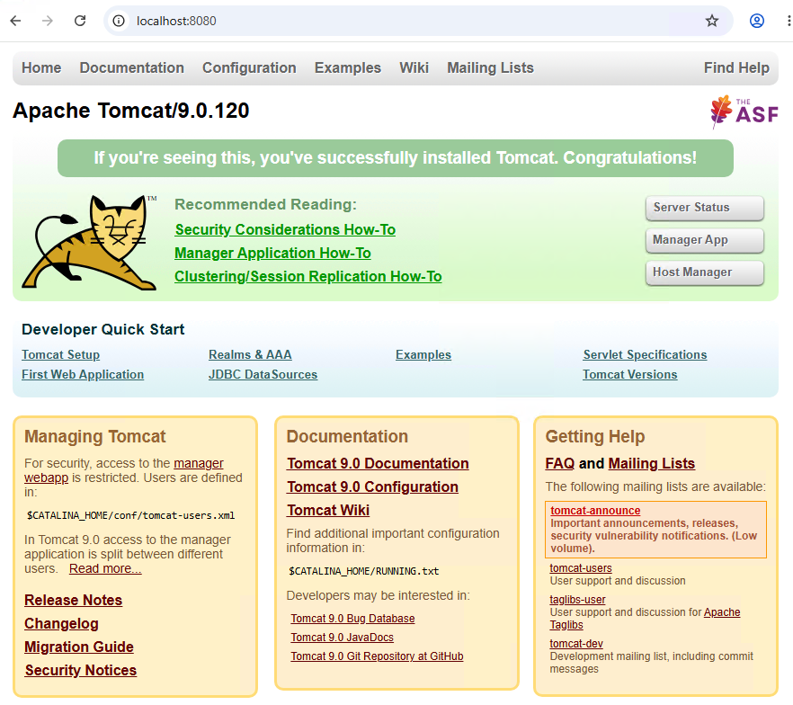

At this stage, the test verifies only the base Apache Tomcat installation.

Stop the foreground Tomcat process before proceeding with the ORDS deployment.

## Deploying ORDS to Apache Tomcat

ORDS is installed and configured for the `SALESPDB` pluggable database, and the Apache Tomcat installation has been verified.

The next step is to deploy the ORDS web application to Apache Tomcat.

### Deploy the ORDS Web Application

The ORDS distribution includes the `ords.war` web application archive.

For this environment, the supplied ORDS WAR file is located under:

```text
C:\oracle\ords_26.2.2\ords.war
```

Copy `ords.war` to the Apache Tomcat `webapps` directory:

```cmd
C:\Users\oracle>copy /Y C:\oracle\ords_26.2.2\ords.war C:\oracle\tomcat_9.0.120\webapps\ords.war
        1 file(s) copied.
```

Verify that the file is present:

```text
C:\oracle\tomcat_9.0.120\webapps\ords.war
```

Apache Tomcat determines the application context path from the WAR filename.

Because the WAR file is named:

```text
ords.war
```

the application is deployed under:

```text
/ords
```

> Oracle also supports generating a WAR file with the ORDS configuration directory embedded by using the `ords war` command. In this environment, the supplied `ords.war` file is used and the configuration location is provided to Tomcat through the `config.url` Java system property.

### Configure the ORDS Configuration Location

When ORDS is deployed to Apache Tomcat, the ORDS configuration directory must be made available to the ORDS web application.

The ORDS configuration used in this environment is:

```text
C:\oracle\ords-config
```

Configure the ORDS configuration location using the `config.url` Java system property.

Edit:

```text
C:\oracle\tomcat_9.0.120\bin\setenv.bat
```

Update `JAVA_OPTS` as follows:

```bat
@echo off

set "JAVA_HOME=C:\Program Files\Java\jdk-21.0.12"
set "CATALINA_HOME=C:\oracle\tomcat_9.0.120"
set "CATALINA_BASE=C:\oracle\tomcat_9.0.120"

set "JAVA_OPTS=-Xms512m -Xmx1024m -Dconfig.url=C:\oracle\ords-config"
```

The following Java system property specifies the ORDS configuration directory:

```text
-Dconfig.url=C:\oracle\ords-config
```

This allows the supplied `ords.war` application to use the ORDS configuration created earlier in this guide.

## Configuring APEX Static Resources

Oracle APEX requires static resources such as images, CSS, JavaScript, fonts, and other files used by the APEX user interface.

The static resources are located in the `images` directory of the extracted Oracle APEX software.

For this environment:

```text
C:\oracle\apex_26.1\apex\images
```

During the APEX installation, the `/i/` image prefix was specified:

```sql
@apexins.sql APEX_TS APEX_TS TEMP /i/
```

Therefore, the APEX static resources must be available to clients through the `/i/` URL path.

### Deploy the APEX Static Resources

Create an `i` directory under the Tomcat `webapps` directory:

```text
C:\Users\oracle> mkdir C:\oracle\tomcat_9.0.120\webapps\i
```

Copy the contents of the APEX `images` directory to the Tomcat `i` directory:

```cmd
C:\Users\oracle>xcopy C:\oracle\apex_26.1\apex\images C:\oracle\tomcat_9.0.120\webapps\i /E /I /Y
```

After the copy completes, the directory structure should be similar to:

```text
C:\oracle\tomcat_9.0.120\webapps\
├── ords.war
└── i\
```

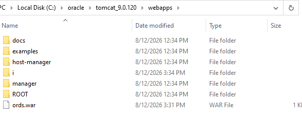

The `i` directory contains the Oracle APEX static resources.

> The APEX static resources must correspond to the Oracle APEX version installed in the database. Update the static resources when Oracle APEX is upgraded.

## Start Apache Tomcat

After deploying ORDS and the APEX static resources, start Apache Tomcat:

```cmd
C:\Users\oracle>cd /d C:\oracle\tomcat_9.0.120\bin
```

Start Tomcat in the foreground:

```cmd
C:\oracle\tomcat_9.0.120\bin>catalina.bat run
Using CATALINA_BASE:   "C:\oracle\tomcat_9.0.120"
Using CATALINA_HOME:   "C:\oracle\tomcat_9.0.120"
Using CATALINA_TMPDIR: "C:\oracle\tomcat_9.0.120\temp"
Using JRE_HOME:        "C:\Program Files\Java\jdk-21.0.12"
Using CLASSPATH:       "C:\oracle\tomcat_9.0.120\bin\bootstrap.jar;C:\oracle\tomcat_9.0.120\bin\tomcat-juli.jar"
Using CATALINA_OPTS:   ""
NOTE: Picked up JDK_JAVA_OPTIONS:  --add-opens=java.base/java.lang=ALL-UNNAMED --add-opens=java.base/java.lang.invoke=ALL-UNNAMED --add-opens=java.base/java.lang.reflect=ALL-UNNAMED --add-opens=java.base/java.io=ALL-UNNAMED --add-opens=java.base/java.util=ALL-UNNAMED --add-opens=java.base/java.util.concurrent=ALL-UNNAMED --add-opens=java.rmi/sun.rmi.transport=ALL-UNNAMED
12-Aug-2026 15:36:22.016 INFO [main] org.apache.catalina.startup.VersionLoggerListener.log Server version name:   Apache Tomcat/9.0.120
12-Aug-2026 15:36:22.021 INFO [main] org.apache.catalina.startup.VersionLoggerListener.log Server built:          Jul 3 2026 07:49:53 UTC
12-Aug-2026 15:36:22.021 INFO [main] org.apache.catalina.startup.VersionLoggerListener.log Server version number: 9.0.120.0
12-Aug-2026 15:36:22.021 INFO [main] org.apache.catalina.startup.VersionLoggerListener.log OS Name:               Windows Server 2022
12-Aug-2026 15:36:22.021 INFO [main] org.apache.catalina.startup.VersionLoggerListener.log OS Version:            10.0
12-Aug-2026 15:36:22.021 INFO [main] org.apache.catalina.startup.VersionLoggerListener.log Architecture:          amd64
12-Aug-2026 15:36:22.021 INFO [main] org.apache.catalina.startup.VersionLoggerListener.log Java Home:             C:\Program Files\Java\jdk-21.0.12
12-Aug-2026 15:36:22.021 INFO [main] org.apache.catalina.startup.VersionLoggerListener.log JVM Version:           21.0.12+7-LTS-205
12-Aug-2026 15:36:22.021 INFO [main] org.apache.catalina.startup.VersionLoggerListener.log JVM Vendor:            Oracle Corporation
12-Aug-2026 15:36:22.021 INFO [main] org.apache.catalina.startup.VersionLoggerListener.log CATALINA_BASE:         C:\oracle\tomcat_9.0.120
12-Aug-2026 15:36:22.021 INFO [main] org.apache.catalina.startup.VersionLoggerListener.log CATALINA_HOME:         C:\oracle\tomcat_9.0.120
12-Aug-2026 15:36:22.030 INFO [main] org.apache.catalina.startup.VersionLoggerListener.log Command line argument: -Xms512m
12-Aug-2026 15:36:22.030 INFO [main] org.apache.catalina.startup.VersionLoggerListener.log Command line argument: -Xmx1024m
12-Aug-2026 15:36:22.030 INFO [main] org.apache.catalina.startup.VersionLoggerListener.log Command line argument: -Dconfig.url=C:\oracle\ords-config
...
...
```

The following line confirms that Tomcat received the ORDS configuration location:

```text
Command line argument: -Dconfig.url=C:\oracle\ords-config
```

Apache Tomcat detects `ords.war` in the `webapps` directory and deploys the ORDS application.

During deployment, Tomcat creates the expanded application directory:

```text
C:\oracle\tomcat_9.0.120\webapps\ords
```

## Verify the ORDS Deployment

Review the Tomcat console output for ORDS deployment errors.

Also review the Tomcat logs under:

```text
C:\oracle\tomcat_9.0.120\logs
```

Verify that ORDS is accessible:

```text
http://localhost:8080/ords/
```
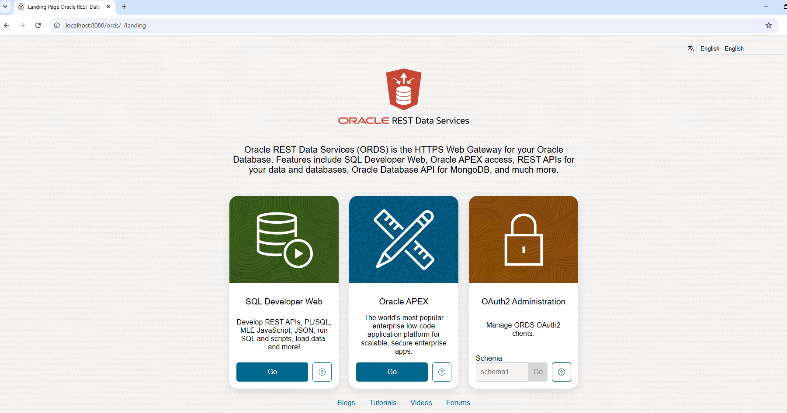

Verify that:

- Apache Tomcat is running.
- The `ords` application is deployed.
- ORDS uses the configuration under `C:\oracle\ords-config`.
- ORDS can connect to the `SALESPDB` pluggable database.
- No ORDS database pool errors are reported.

## Verify the APEX Static Resources

Verify that the APEX static resources are available through the `/i/` context path.

A useful validation is the APEX version file:

```text
http://localhost:8080/i/apex_version.txt
```

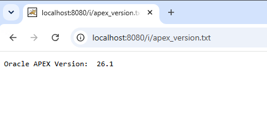

The returned version should correspond to the Oracle APEX version installed in the database.

If the file returns `404 Not Found`, verify that the contents of the APEX `images` directory were copied to:

```text
C:\oracle\tomcat_9.0.120\webapps\i
```

## Verify Oracle APEX

Access Oracle APEX through ORDS:

```text
http://localhost:8080/ords/
```

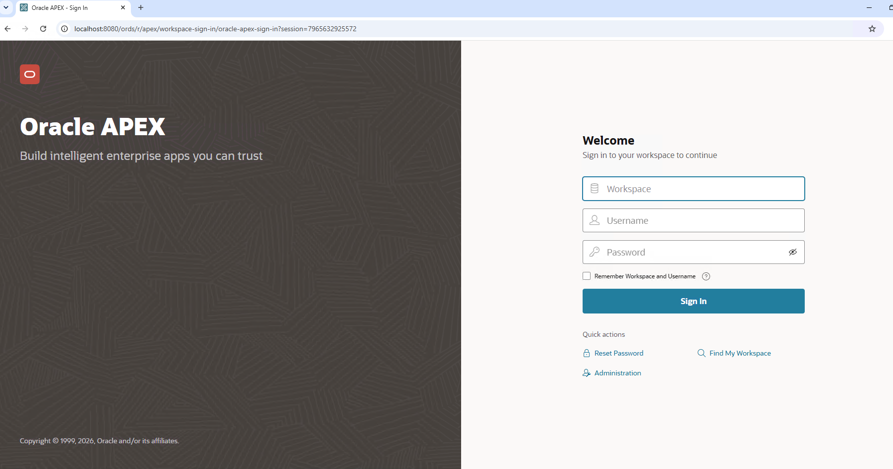

Verify that:

- The Oracle APEX page is displayed.
- ORDS connects successfully to `SALESPDB`.
- APEX static resources are loaded correctly.
- The page is displayed with the expected styling.
- No missing CSS, JavaScript, image, or font resources are reported.

At this point, Oracle APEX is accessible through ORDS deployed on Apache Tomcat.

The next step is to configure **Apache Tomcat as a Windows service** so that Tomcat and ORDS can be managed through the Windows Service Control Manager and started automatically when Windows Server starts.


## Configuring Apache Tomcat as a Windows Service

Apache Tomcat includes a Windows service wrapper that allows Tomcat to run as a Windows service.

Running Tomcat as a service removes the requirement to start `catalina.bat` manually and allows the Tomcat instance to start automatically with Windows Server.

### Install the Tomcat Windows Service

Open a Command Prompt with administrative privileges.

Change to the Tomcat `bin` directory:

```cmd
C:\Windows\System32>cd /d C:\oracle\tomcat_9.0.120\bin
```

Install the Tomcat service:

```cmd
C:\oracle\tomcat_9.0.120\bin>service.bat install
Neither the JAVA_HOME nor the JRE_HOME environment variable is defined
Service will try to guess them from the registry.
Installing the service 'Tomcat9' ...
Using CATALINA_HOME:    "C:\oracle\tomcat_9.0.120"
Using CATALINA_BASE:    "C:\oracle\tomcat_9.0.120"
Using JAVA_HOME:        ""
Using JRE_HOME:         ""
Warning: Neither 'server' nor 'client' jvm.dll was found at JRE_HOME.
Using JVM:              "auto"
The service 'Tomcat9' has been installed.
```

The service installation utility creates the Apache Tomcat Windows service.

### Verify the Tomcat Windows Service

Open the Windows Services console:

```text
services.msc
```

Locate the Apache Tomcat service and verify that it has been created successfully.

Alternatively, verify the service from the command line:

```cmd
C:\oracle\tomcat_9.0.120\bin>sc query Tomcat9

SERVICE_NAME: Tomcat9
        TYPE               : 10  WIN32_OWN_PROCESS
        STATE              : 1  STOPPED
        WIN32_EXIT_CODE    : 1077  (0x435)
        SERVICE_EXIT_CODE  : 0  (0x0)
        CHECKPOINT         : 0x0
        WAIT_HINT          : 0x0

```

### Configure the Tomcat Windows Service

Tomcat provides a graphical service configuration utility.

Run:

```cmd
C:\oracle\tomcat_9.0.120\bin>tomcat9w.exe //ES//Tomcat9
```

Use the service configuration utility to review and configure:

- Java Virtual Machine
- Java classpath
- Initial memory pool
- Maximum memory pool
- Java options
- Service startup mode
- Service account

Ensure that the Java configuration corresponds to the JDK used by this environment:

```text
C:\Program Files\Java\jdk-21.0.12
```

Configure the memory settings consistently with the values previously used for the command-line Tomcat instance.

For this environment:

```text
Initial memory pool: 512 MB
Maximum memory pool: 1024 MB
```

If the ORDS configuration location is not embedded in `ords.war`, add the following Java system property to the service Java options:

```text
-Dconfig.url=C:\oracle\ords-config
```

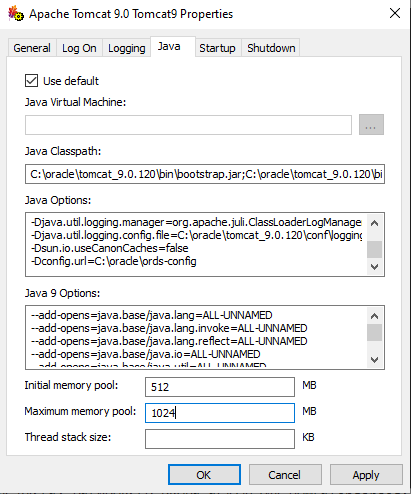

> The Tomcat Windows service uses the Windows service wrapper configuration. Do not rely on `setenv.bat` to configure JVM options for the Windows service.

### Configure Automatic Startup

Configure the Apache Tomcat service startup type as:

```text
Automatic
```

This ensures that Apache Tomcat starts automatically when Windows Server starts.

### Start the Tomcat Windows Service

Start the service from the Windows Services console or from an administrative Command Prompt.

For example:

```cmd
C:\Windows\system32>net start Tomcat9
The Apache Tomcat 9.0 Tomcat9 service is starting.
The Apache Tomcat 9.0 Tomcat9 service was started successfully.
```

### Verify the Tomcat Windows Service

Verify that the service is running:

```cmd
C:\Windows\system32>sc query Tomcat9

SERVICE_NAME: Tomcat9
        TYPE               : 10  WIN32_OWN_PROCESS
        STATE              : 4  RUNNING
                                (STOPPABLE, NOT_PAUSABLE, ACCEPTS_SHUTDOWN)
        WIN32_EXIT_CODE    : 0  (0x0)
        SERVICE_EXIT_CODE  : 0  (0x0)
        CHECKPOINT         : 0x0
        WAIT_HINT          : 0x0
```

The service should report:

```text
STATE              : 4  RUNNING
```

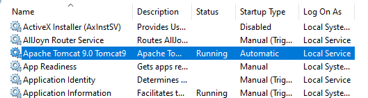

Verify that ORDS remains accessible:

```text
http://localhost:8080/ords/
```

Verify that Oracle APEX remains accessible through ORDS.

At this point, Apache Tomcat and ORDS are running as a Windows service.

The next step is to configure **HTTPS/TLS for Apache Tomcat**.

## Configuring SSL for Apache Tomcat

Apache Tomcat is currently configured to provide access to ORDS and Oracle APEX over HTTP.

The next step is to configure SSL/TLS so that Oracle APEX can be accessed through HTTPS.

For this environment, a self-signed certificate is created and stored in a PKCS#12 keystore.

The SSL/TLS configuration used in this guide is:

| Component | Configuration |
| --- | --- |
| HTTPS Port | `8443` |
| Hostname | `apex.lab.local` |
| Keystore Type | `PKCS12` |
| Keystore | `C:\oracle\ssl\tomcat.p12` |
| Certificate Alias | `tomcat` |
| Key Algorithm | `RSA` |
| Key Size | `3072` bits |
| Certificate | Self-signed |

### Prepare the SSL/TLS Certificate

Create a directory for the Tomcat SSL/TLS configuration:

```cmd
C:\Users\oracle>mkdir C:\oracle\ssl
```

Use the Java `keytool` utility to create a PKCS#12 keystore containing the private key and self-signed certificate:

```cmd
C:\Users\oracle>"C:\Program Files\Java\jdk-21.0.12\bin\keytool.exe" -genkeypair ^
 -alias tomcat ^
 -keyalg RSA ^
 -keysize 3072 ^
 -validity 825 ^
 -storetype PKCS12 ^
 -keystore C:\oracle\ssl\tomcat.p12 ^
 -dname "CN=apex.lab.local, OU=IT, O=Lab, L=Wiener Neustadt, C=AT" ^
 -ext "SAN=dns:apex.lab.local,dns:localhost,ip:127.0.0.1"
Enter keystore password:
Re-enter new password:
Generating 3,072 bit RSA key pair and self-signed certificate (SHA384withRSA) with a validity of 825 days
        for: CN=apex.lab.local, OU=IT, O=Lab, L=Wiener Neustadt, C=AT
```

The command creates the following PKCS#12 keystore:

```text
C:\oracle\ssl\tomcat.p12
```

The certificate is created for:

```text
CN=apex.lab.local
```

The following Subject Alternative Names (SANs) are included:

```text
DNS: apex.lab.local
DNS: localhost
IP:  127.0.0.1
```

The certificate alias used in the keystore is:

```text
tomcat
```

### Verify the Tomcat Keystore

Verify the contents of the PKCS#12 keystore:

```cmd
C:\Users\oracle>"C:\Program Files\Java\jdk-21.0.12\bin\keytool.exe" -list -v -keystore C:\oracle\ssl\tomcat.p12
Enter keystore password:
Keystore type: PKCS12
Keystore provider: SUN

Your keystore contains 1 entry

Alias name: tomcat
Creation date: Aug 12, 2026
Entry type: PrivateKeyEntry
Certificate chain length: 1
Certificate[1]:
Owner: CN=apex.lab.local, OU=IT, O=Lab, L=Wiener Neustadt, C=AT
Issuer: CN=apex.lab.local, OU=IT, O=Lab, L=Wiener Neustadt, C=AT
Serial number: 1f91e8ebe06c435a
Valid from: Wed Aug 12 17:34:21 PDT 2026 until: Tue Nov 14 16:34:21 PST 2028
Certificate fingerprints:
         SHA1: DD:01:83:C0:27:88:F9:C0:3C:43:E0:69:62:F0:BC:C9:1A:57:26:70
         SHA256: 32:47:63:13:9C:26:A1:5E:72:CE:62:DC:52:55:9F:60:A9:D0:C6:2D:38:7D:A6:59:00:4A:C9:F0:9B:9F:0E:57
Signature algorithm name: SHA384withRSA
Subject Public Key Algorithm: 3072-bit RSA key
Version: 3

Extensions:

#1: ObjectId: 2.5.29.17 Criticality=false
SubjectAlternativeName [
  DNSName: apex.lab.local
  DNSName: localhost
  IPAddress: 127.0.0.1
]

#2: ObjectId: 2.5.29.14 Criticality=false
SubjectKeyIdentifier [
KeyIdentifier [
0000: 8A 4D 9A DF 0F 39 AC 88   B4 5B 50 40 A9 92 97 E0  .M...9...[P@....
0010: 5F A5 DC EA                                        _...
]
]

*******************************************
*******************************************
```

Verify that:

- The keystore type is `PKCS12`.
- The alias is `tomcat`.
- The entry type is `PrivateKeyEntry`.
- The certificate owner is `CN=apex.lab.local`.
- The certificate contains `apex.lab.local` in the Subject Alternative Name extension.
- The certificate is within its validity period.

Because the certificate is self-signed, the certificate `Owner` and `Issuer` are identical.

## Configuring the Tomcat HTTPS Connector

Configure the HTTPS connector in the Apache Tomcat `server.xml` configuration file.

The configuration file is located under:

```text
C:\oracle\tomcat_9.0.120\conf\server.xml
```

### Back Up the Tomcat Configuration

Before modifying `server.xml`, create a backup of the existing configuration:

```cmd
C:\Users\oracle>copy C:\oracle\tomcat_9.0.120\conf\server.xml C:\oracle\tomcat_9.0.120\conf\server.xml.bak
        1 file(s) copied.
```

### Configure the HTTPS Connector

Open the Tomcat configuration file:

```cmd
C:\Users\oracle>notepad C:\oracle\tomcat_9.0.120\conf\server.xml
```

Locate the following section:

```xml
<Service name="Catalina">
```

Add the HTTPS connector inside the `Catalina` service:

```xml
<Service name="Catalina">

    <Connector port="8443"
               protocol="org.apache.coyote.http11.Http11NioProtocol"
               maxThreads="150"
               SSLEnabled="true"
               maxParameterCount="1000">

        <SSLHostConfig>
            <Certificate
                certificateKeystoreFile="C:\oracle\ssl\tomcat.p12"
                certificateKeystorePassword="<keystore-password>"
                certificateKeystoreType="PKCS12"
                certificateKeyAlias="tomcat"
                type="RSA" />
        </SSLHostConfig>
    </Connector>

    ...
</Service>
```

Replace:

```text
<keystore-password>
```

with the password used when the PKCS#12 keystore was created.

The HTTPS connector uses the following configuration:

| Setting | Value |
| --- | --- |
| HTTPS Port | `8443` |
| Protocol | `org.apache.coyote.http11.Http11NioProtocol` |
| SSL Enabled | `true` |
| Keystore | `C:\oracle\ssl\tomcat.p12` |
| Keystore Type | `PKCS12` |
| Certificate Alias | `tomcat` |
| Certificate Type | `RSA` |

Save the changes to `server.xml`.

## Configuring Local Name Resolution

The certificate was created for the following hostname:

```text
apex.lab.local
```

Because the environment is accessed locally, configure the Windows `hosts` file so that `apex.lab.local` resolves to the local system.

The Windows `hosts` file is located under:

```text
C:\Windows\System32\drivers\etc\hosts
```

Open the file with administrative privileges and add:

```text
127.0.0.1 apex.lab.local
```

Save the file.

Verify that the hostname resolves correctly:

```cmd
C:\Users\oracle>ping apex.lab.local
```

The hostname should resolve to:

```text
Pinging apex.lab.local [127.0.0.1] with 32 bytes of data:
Reply from 127.0.0.1: bytes=32 time<1ms TTL=128
Reply from 127.0.0.1: bytes=32 time<1ms TTL=128
Reply from 127.0.0.1: bytes=32 time<1ms TTL=128
```

## Restarting Apache Tomcat

If Apache Tomcat has already been configured as a Windows service, restart the service instead:

```cmd
C:\Users\Administrator>net stop Tomcat9
```

Start the service:

```cmd
C:\Users\Administrator>net start Tomcat9
```

## Verifying the SSL Configuration

After restarting Apache Tomcat, verify that the HTTPS connector starts successfully.

### Review the Tomcat Logs

Review the Tomcat console output for SSL/TLS-related errors.

The Tomcat logs are located under:

```text
C:\oracle\tomcat_9.0.120\logs
```

Verify that:

- Apache Tomcat starts successfully.
- The HTTPS connector initializes successfully.
- The PKCS#12 keystore is loaded successfully.
- ORDS is deployed successfully.
- ORDS connects successfully to `SALESPDB`.

### Verify the HTTPS Port

Verify that Tomcat is listening on port `8443`:

```cmd
C:\Users\oracle>netstat -ano | findstr :8443
```

### Verify HTTPS Connectivity

Open a browser and access ORDS using the HTTPS endpoint:

```text
https://apex.lab.local:8443/ords/
```

Because this environment uses a self-signed certificate, the browser displays a certificate trust warning.

This behavior is expected.

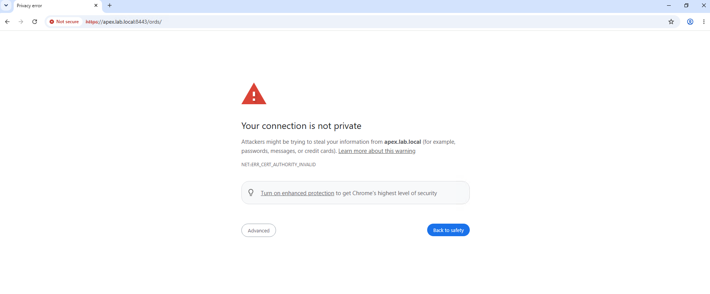

Proceed to the site to verify the HTTPS configuration.

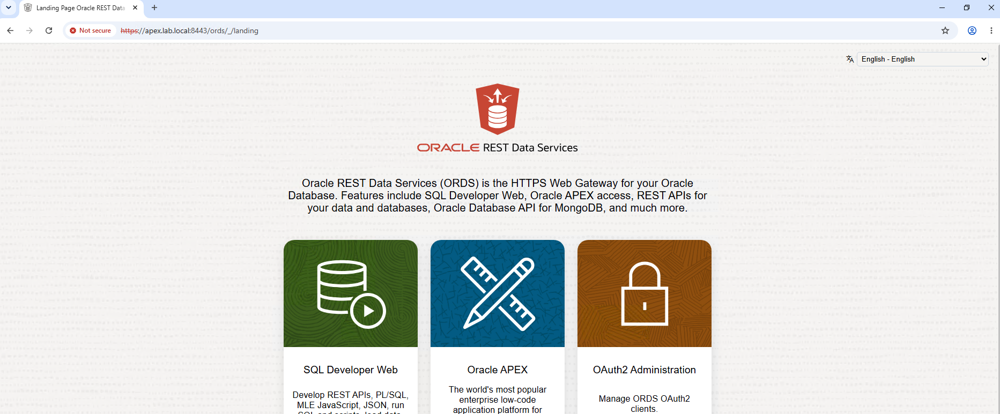

### Verify the Certificate

Review the certificate presented by Apache Tomcat.

Verify that the certificate contains:

```text
CN=apex.lab.local
```

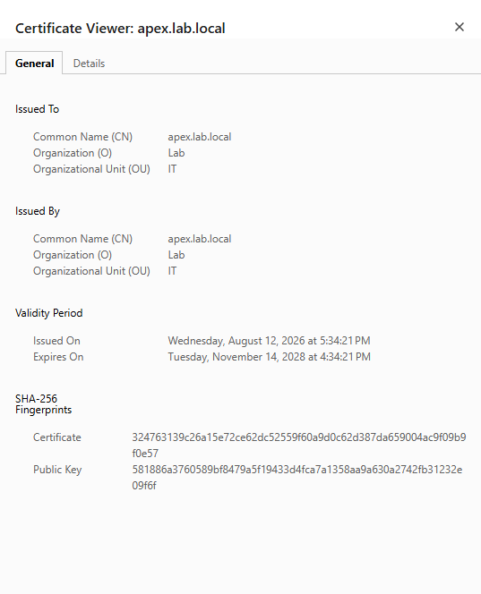

The certificate should correspond to the certificate stored in:

```text
C:\oracle\ssl\tomcat.p12
```

## Verifying Oracle APEX over HTTPS

Access Oracle APEX through ORDS using:

```text
https://apex.lab.local:8443/ords/
```

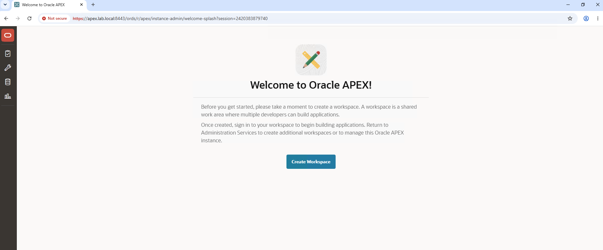

Verify that:

- The connection uses HTTPS.
- Apache Tomcat presents the expected self-signed certificate.
- ORDS loads successfully.
- ORDS connects successfully to `SALESPDB`.
- The Oracle APEX login page is displayed.
- The APEX static resources load correctly.
- No missing CSS, JavaScript, image, or font resources are reported.

At this point, Oracle APEX is accessible through ORDS and Apache Tomcat using HTTPS.

### Verify the SSL/TLS Certificate

Verify the certificate presented by the HTTPS endpoint.

Confirm the following:

- Certificate subject
- Certificate issuer
- Certificate validity period
- Subject Alternative Name (SAN)
- Certificate chain
- Hostname validation

## Final Verification

Verify the completed environment:

- Oracle Database 19c is running.
- The target PDB is open.
- Oracle APEX is installed successfully.
- ORDS database components are installed.
- ORDS can connect to the target database.
- Apache Tomcat is installed and configured.
- ORDS is deployed to Apache Tomcat.
- APEX static resources are available.
- Apache Tomcat is configured as a Windows service.
- The Tomcat service starts automatically.
- The HTTP endpoint is available as required.
- The HTTPS endpoint is available.
- The SSL/TLS certificate is valid.
- Oracle APEX is accessible through the HTTPS ORDS endpoint.

## Conclusion

Oracle APEX and Oracle REST Data Services are now installed and configured on the existing Oracle Database 19c environment.

ORDS is deployed to Apache Tomcat, and Tomcat is configured as a Windows service for operating system-level service management and automatic startup.

The HTTPS configuration secures client connections to the Oracle APEX environment using the configured SSL/TLS certificate.