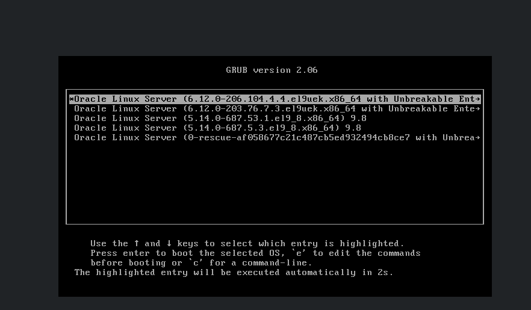
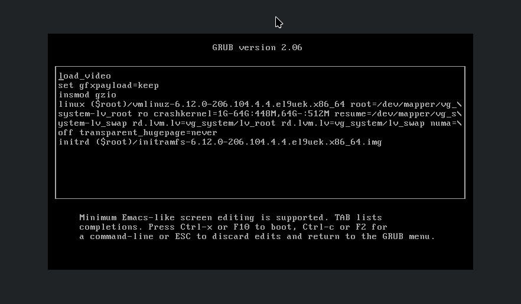
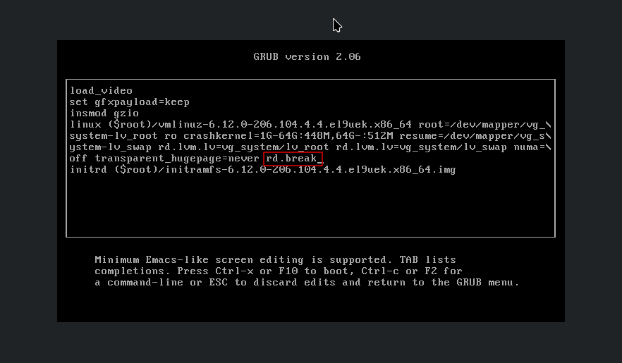
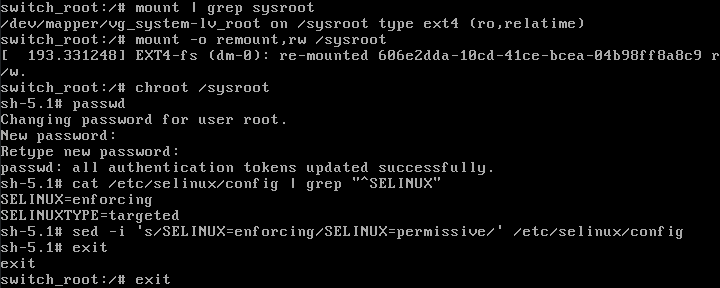
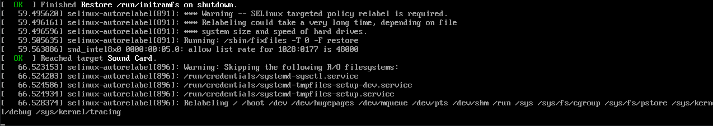

This guide demonstrates how to reset a forgotten `root` password on **Oracle Linux 7, 8, and 9** using the GRUB 2 bootloader and the `rd.break` kernel parameter.

The recovery procedure is based on the Oracle Linux / Red Hat Enterprise Linux boot process. The screenshots were captured on **Oracle Linux 9**. While the general approach applies to the other listed versions, bootloader syntax and security configuration can differ, verify the procedure in your environment.

## Prerequisites

The following requirements apply:

- Authorized access to the physical or virtual machine console.
- Permission to reboot the server and interrupt the boot process.
- Access to edit the GRUB boot entry, if it is not protected by a password.
- Any credentials needed to unlock encrypted storage.

**This procedure must be performed through the system console, not an SSH session.** The `rd.break` parameter interrupts startup in the initial RAM filesystem, before the normal operating system and its SSH service are running. Use the hypervisor console, physical console, or an out-of-band management interface such as Oracle ILOM, iLO, or iDRAC.

Plan for downtime. A full SELinux filesystem relabel, if required, can take a considerable amount of time.

## Access the GRUB 2 Boot Menu

Restart the server and open the console. When the GRUB 2 menu appears, select the normal Oracle Linux kernel and press `e` to edit its boot entry.



Locate the kernel command line. Depending on the operating system version and boot mode, it may begin with `linux`, `linux16`, or `linuxefi`.



Append the following parameter to the end of the kernel command line, separated from the preceding parameter by a space:

```text
rd.break
```



The `rd.break` parameter tells the `dracut` initial RAM filesystem to stop before switching to the installed operating system's root filesystem. This provides an emergency shell for recovery.

Press `Ctrl+x` to boot with the edited parameters. The edit is temporary and does not permanently change the GRUB configuration.

## Mount the Root Filesystem

After the boot process stops, a prompt similar to the following appears:

```text
switch_root:/#
```

The installed system's root filesystem is typically mounted under `/sysroot` in read-only mode. Check the mount options:

```bash
switch_root:/# mount | grep sysroot
```

Example output from the test environment:

```text
/dev/mapper/vg_system-lv_root on /sysroot type ext4 (ro,relatime)
```

The `ro` mount option means **read-only**. The filesystem device and type depend on your installation; an Oracle Linux system may use XFS or ext4 and different LVM names.

Remount the installed root filesystem with write permissions:

```bash
switch_root:/# mount -o remount,rw /sysroot
```

- `mount` manages mounted filesystems.
- `-o remount,rw` changes the existing mount to read/write mode.
- `/sysroot` is the mounted root filesystem of the installed Oracle Linux system.

Write access is necessary because the password change updates `/etc/shadow`.

## Change the Root Password

Enter the installed operating system using `chroot`:

```bash
switch_root:/# chroot /sysroot
```

The `chroot` command changes the apparent root directory for the shell to `/sysroot`, so commands now operate on the installed system. The prompt may change to something similar to:

```text
sh-5.1#
```

Reset the `root` password:

```bash
sh-5.1# passwd root
```

The command `passwd root` changes the password for the `root` account. Since the recovery shell is already running as root, `passwd` without a username also works.

Enter and confirm the new password when prompted:

```text
Changing password for user root.
New password:
Retype new password:
passwd: all authentication tokens updated successfully.
```

The success message confirms that the password update was written to the installed system.

The following console screenshot shows the password reset and SELinux configuration commands used during the test:



## Configure SELinux After the Password Reset

SELinux assigns security contexts to files, including `/etc/shadow`. Changing the root password from the recovery environment may leave that file with an incorrect security context, potentially preventing authentication when SELinux is enforcing.

### Standard Relabeling Method

A commonly documented recovery step is to create a relabel marker **inside the installed system's root directory**, while still in the `chroot` environment:

```bash
sh-5.1# touch /.autorelabel
```

The absolute path `/.autorelabel` is important. The relative path `./autorelabel` is not the same file, and `./.autorelabel` only points to the intended location if the current directory is `/`.

The marker requests an SELinux filesystem relabel during the next boot. The relabeling operation can take time depending on filesystem size and storage speed.

**In my test environment, this method did not work as expected.** The exact reason was not determined, so the result should not be interpreted as a general failure of `touch /.autorelabel` on Oracle Linux.

### Recovery Approach Used in This Test

In the tested environment, I changed SELinux from enforcing to permissive mode before continuing the boot process.

First, inspect the configuration:

```bash
sh-5.1# grep '^SELINUX' /etc/selinux/config
```

Example output:

```text
SELINUX=enforcing
SELINUXTYPE=targeted
```

Temporarily change the configured SELinux mode:

```bash
sh-5.1# sed -i 's/SELINUX=enforcing/SELINUX=permissive/' /etc/selinux/config
```

The command uses:

- `sed`: a stream editor for text substitutions.
- `-i`: edit the specified file in place.
- `s/SELINUX=enforcing/SELINUX=permissive/`: replace the exact setting.
- `/etc/selinux/config`: the persistent SELinux configuration file.

In permissive mode, SELinux logs policy violations but does not enforce access denials. **This reduces protection and is a temporary troubleshooting measure, not the preferred permanent configuration.** Changing this setting alone does not request or guarantee a filesystem relabel.

Exit the installed-system shell and then the recovery shell:

```bash
sh-5.1# exit
switch_root:/# exit
```

The system continues the boot process.

## SELinux Relabeling During Boot

During the test, the console displayed SELinux relabeling messages:



Example messages:

```text
SELinux targeted policy relabel is required.
Relabeling could take a very long time, depending on file
system size and speed of hard drives.
Relabeling /
```

This shows that a relabel operation was running. **The screenshot does not establish what triggered it.** In particular, setting `SELINUX=permissive` does not itself initiate a relabel. A pre-existing relabel request or another startup condition may have caused the operation.

The relabeling process restores file security contexts according to the installed SELinux policy. Monitor the operation through the console and do not interrupt it. Depending on the startup path, the system may reboot after relabeling.

## Verify the Password and Restore SELinux Enforcing Mode

After the system starts, sign in through the console with the new root password. Verify the account:

```bash
[root@server ~]# whoami
root
```

Check the configured SELinux mode:

```bash
[root@server ~]# grep '^SELINUX' /etc/selinux/config
```

If permissive mode was used only for recovery, restore the original enforcing configuration **after checking and correcting SELinux labels**:

```bash
[root@server ~]# sed -i 's/SELINUX=permissive/SELINUX=enforcing/' /etc/selinux/config
```

The `sed` command changes the persistent configuration back to enforcing. It does **not** immediately change the active mode. Check the current mode:

```bash
[root@server ~]# getenforce
Permissive
```

After confirming that the required contexts and policies are correct, activate enforcing mode for the running system:

```bash
[root@server ~]# setenforce 1
[root@server ~]# getenforce
Enforcing
```

`setenforce 1` switches the active SELinux mode to enforcing without a reboot. If SELinux reports denials or authentication fails, investigate the audit logs and correct the underlying labels or policy issues rather than leaving the system permanently in permissive mode.

## Oracle Linux Version Differences

The recovery steps are broadly similar across Oracle Linux 7, 8, and 9. The GRUB entry syntax depends on the release, firmware mode, and installed bootloader configuration.

| Version | Typical GRUB kernel command | Recovery parameter |
| --- | --- | --- |
| Oracle Linux 7 | `linux16` or `linuxefi` on many systems | `rd.break` |
| Oracle Linux 8 | `linux` on many systems | `rd.break` |
| Oracle Linux 9 | `linux` on many systems | `rd.break` |

Use the command line actually displayed in GRUB rather than assuming a particular prefix. These screenshots document a test on Oracle Linux 9; the complete sequence was not independently tested here on every listed release.

## Important Notes

- This procedure requires authorized console and GRUB access. GRUB protection, disk encryption, and other security controls may prevent access without additional credentials.
- The new root password does not automatically enable password-based root SSH login. That is controlled separately by SSH configuration and authentication policy.
- A full SELinux relabel may take a  time, allow it to finish before restarting the system.
- Avoid leaving SELinux in permissive mode after troubleshooting. Restore enforcing mode after resolving any labeling problems.

## References

- [Oracle Linux Documentation](https://docs.oracle.com/en/operating-systems/oracle-linux/)
- [Oracle Linux 9 – Managing Kernels and System Boot](https://docs.oracle.com/en/operating-systems/oracle-linux/9/boot/)

