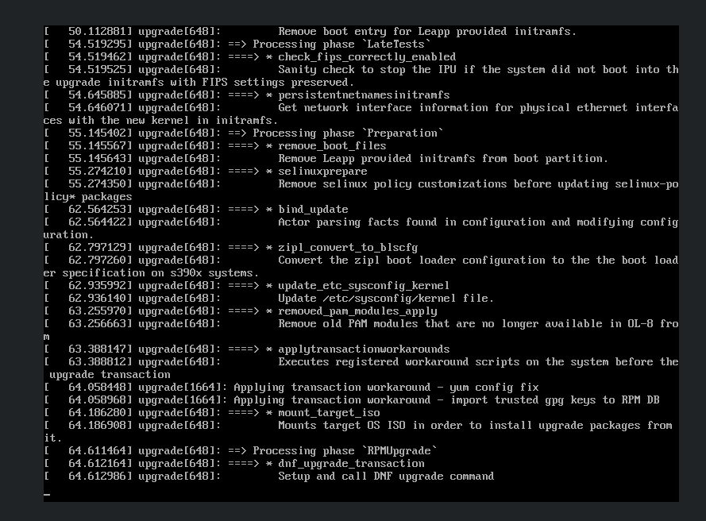
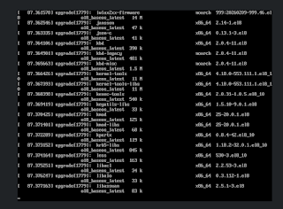
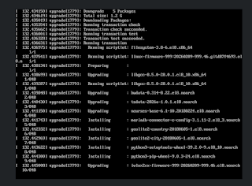
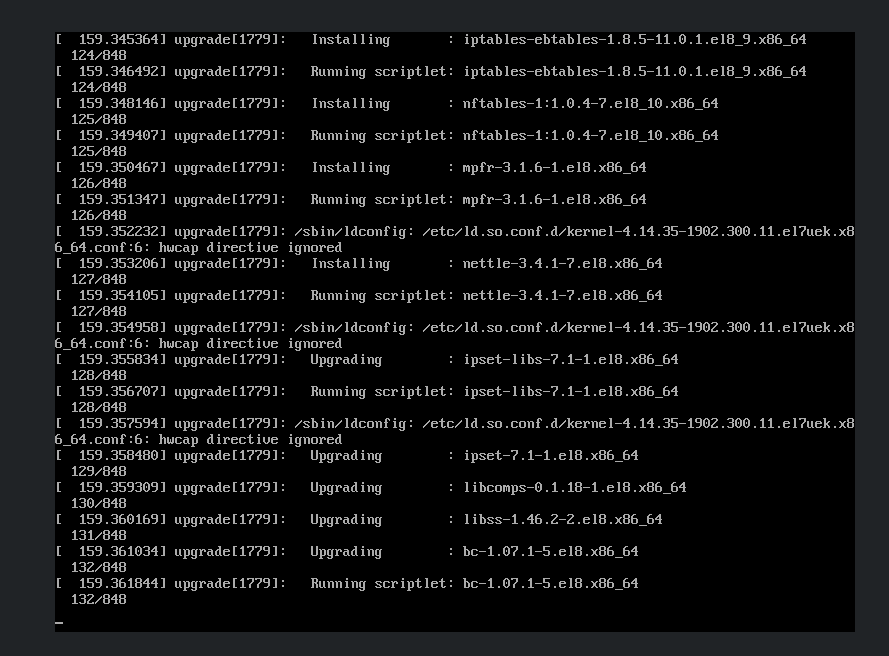
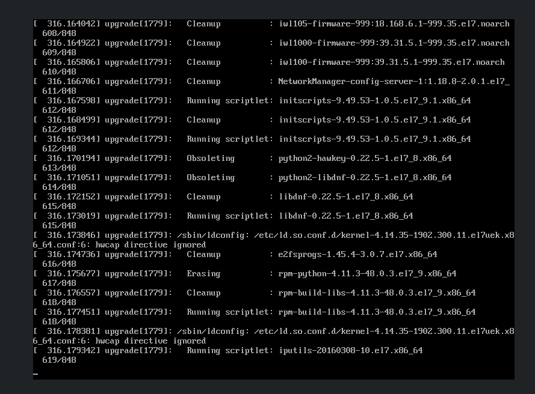
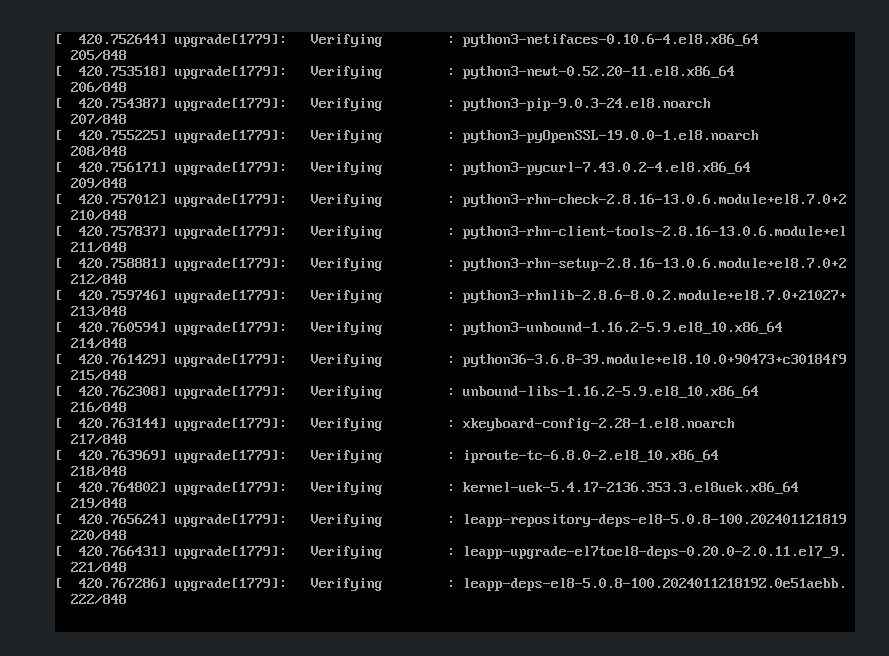
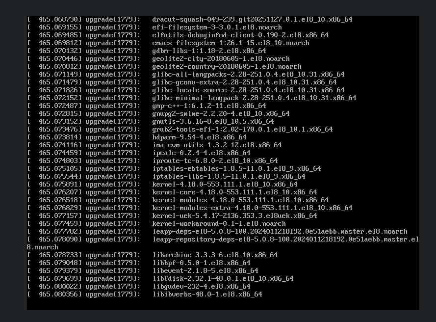
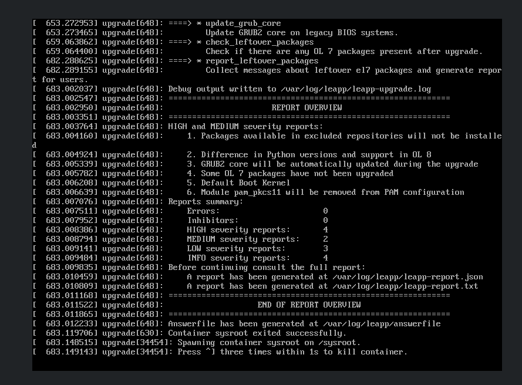

Oracle Linux provides the **Leapp** utility for performing in-place upgrades between supported major Oracle Linux releases.

An in-place upgrade allows an existing Oracle Linux installation to be upgraded while retaining much of the existing system configuration, applications, and data. This can reduce the amount of work required compared with deploying a new operating system and migrating workloads manually.

This guide demonstrates how to perform an in-place upgrade from **Oracle Linux 7 to Oracle Linux 8** using Leapp.

The procedure covers:

- Reviewing upgrade prerequisites
- Preparing the Oracle Linux 7 system
- Updating the source system to Oracle Linux 7.9
- Installing Leapp
- Running a Leapp pre-upgrade assessment
- Reviewing and resolving upgrade inhibitors
- Performing the in-place upgrade
- Validating Oracle Linux 8 after the upgrade
- Performing post-upgrade cleanup

> An in-place operating system upgrade makes significant changes to installed packages, repositories, the kernel, boot configuration, and other system components. 
> Create and verify a complete system backup before beginning the upgrade.

For production systems, review the Oracle Linux documentation and the applicable Oracle Linux support policies before proceeding.

## Prerequisites

Before starting the upgrade, verify that the system meets the requirements for an Oracle Linux 7 to Oracle Linux 8 in-place upgrade.

### Review the Oracle Linux Documentation

Before performing the upgrade, consider the following:

- Review the official Oracle Linux documentation and supported upgrade path before starting the upgrade.
- Create and verify a complete system backup. Because this is an in-place upgrade, a working backup provides a recovery option if the upgrade cannot be completed successfully.
- Evaluate whether an in-place upgrade or a clean installation is more appropriate for the environment. Although deploying a new Oracle Linux 8 system provides a clean starting point, migrating the existing configuration, applications, and workloads can require significantly more time and effort.
- Review application and third-party software compatibility with Oracle Linux 8 before proceeding.
- Plan an appropriate maintenance window for the upgrade.

### Disable Secure Boot

Secure Boot must be disabled before performing the upgrade.

Verify the current Secure Boot status:

```bash
bootctl status
```

### Verify ULN Registration

If the system is registered with the **Unbreakable Linux Network (ULN)**, unregister the system before proceeding with the upgrade.

### Enable Root Login Access

Ensure that root login access is enabled before starting the upgrade.

Verify the current SSH configuration:

```bash
[root@vm01 ~]# grep -i root /etc/ssh/sshd_config
PermitRootLogin yes
# the setting of "PermitRootLogin without-password".
#ChrootDirectory none
```

### Prepare KVM Hosts
If the system is a KVM host, shut down all running virtual machines before starting the upgrade.
If another KVM host is available, migrate the running virtual machines to that host instead.

### Configure Proxy Settings

If the system requires a proxy to access the configured repositories, configure the proxy settings in:

```text
/etc/yum.conf
```

### Remove Package Version Locks

If the `yum-plugin-versionlock` package is installed, remove any existing package version locks before proceeding with the upgrade.

## Pre-Upgrade Tasks

Before performing the in-place upgrade, update the Oracle Linux 7 system to the latest available Oracle Linux 7 release and ensure that all required packages are current.

### Verify the Current Oracle Linux Version

Verify the currently installed Oracle Linux release:

```bash
[root@vm01 ~]# cat /etc/os-release
NAME="Oracle Linux Server"
VERSION="7.8"
ID="ol"
ID_LIKE="fedora"
VARIANT="Server"
VARIANT_ID="server"
VERSION_ID="7.8"
PRETTY_NAME="Oracle Linux Server 7.8"
ANSI_COLOR="0;31"
CPE_NAME="cpe:/o:oracle:linux:7:8:server"
HOME_URL="https://linux.oracle.com/"
BUG_REPORT_URL="https://bugzilla.oracle.com/"
ORACLE_BUGZILLA_PRODUCT="Oracle Linux 7"
ORACLE_BUGZILLA_PRODUCT_VERSION=7.8
ORACLE_SUPPORT_PRODUCT="Oracle Linux"
ORACLE_SUPPORT_PRODUCT_VERSION=7.8
```

In this example, the system is running **Oracle Linux 7.8**.

### Update Oracle Linux 7

Update all installed packages to the latest versions available from the configured Oracle Linux 7 repositories:

```bash
[root@vm01 ~]# yum update -y
Loaded plugins: ulninfo
ol7_UEKR5                                                                                                                                                                                                            | 3.0 kB  00:00:00     
ol7_latest                                                                                                                                                                                                           | 3.6 kB  00:00:00     
(1/5): ol7_latest/x86_64/group_gz                                                                                                                                                                                    | 136 kB  00:00:00     
(2/5): ol7_UEKR5/x86_64/updateinfo                                                                                                                                                                                   | 520 kB  00:00:00     
(3/5): ol7_latest/x86_64/updateinfo                                                                                                                                                                                  | 4.5 MB  00:00:00     
(4/5): ol7_latest/x86_64/primary_db                                                                                                                                                                                  |  54 MB  00:00:01     
(5/5): ol7_UEKR5/x86_64/primary_db                                                                                                                                                                                   |  87 MB  00:00:02     
Resolving Dependencies
--> Running transaction check
---> Package NetworkManager.x86_64 1:1.18.4-3.el7 will be updated
---> Package NetworkManager.x86_64 1:1.18.8-2.0.1.el7_9 will be an update
---> Package NetworkManager-config-server.noarch 1:1.18.4-3.el7 will be updated
---> Package NetworkManager-config-server.noarch 1:1.18.8-2.0.1.el7_9 will be an update
---> Package NetworkManager-libnm.x86_64 1:1.18.4-3.el7 will be updated
---> Package NetworkManager-libnm.x86_64 1:1.18.8-2.0.1.el7_9 will be an update
---> Package NetworkManager-team.x86_64 1:1.18.4-3.el7 will be updated
---> Package NetworkManager-team.x86_64 1:1.18.8-2.0.1.el7_9 will be an update
---> Package NetworkManager-tui.x86_64 1:1.18.4-3.el7 will be updated
---> Package NetworkManager-tui.x86_64 1:1.18.8-2.0.1.el7_9 will be an update
---> Package bash.x86_64 0:4.2.46-34.el7 will be updated
---> Package bash.x86_64 0:4.2.46-35.el7_9 will be an update
---> Package bind-export-libs.x86_64 32:9.11.4-16.P2.el7 will be updated
---> Package bind-export-libs.x86_64 32:9.11.4-26.0.1.P2.el7_9.16 will be an update
---> Package binutils.x86_64 0:2.27-43.base.0.1.el7 will be updated
---> Package binutils.x86_64 0:2.27-44.base.0.3.el7_9.1 will be an update
---> Package biosdevname.x86_64 0:0.7.3-2.el7 will be updated
---> Package biosdevname.x86_64 0:0.7.3-2.0.1.el7 will be an update
---> Package btrfs-progs.x86_64 0:4.9.1-1.0.2.el7 will be updated
---> Package btrfs-progs.x86_64 0:5.12.1-1.el7 will be an update
--> Processing Dependency: libzstd.so.1()(64bit) for package: btrfs-progs-5.12.1-1.el7.x86_64
---> Package ca-certificates.noarch 0:2019.2.32-76.el7_7 will be updated
---> Package ca-certificates.noarch 0:2024.2.69_v8.0.303-71.0.1.el7_9 will be an update
---> Package chkconfig.x86_64 0:1.7.4-1.el7 will be updated
---> Package chkconfig.x86_64 0:1.7.6-1.0.3.el7 will be an update
---> Package coreutils.x86_64 0:8.22-24.0.1.el7 will be updated
---> Package coreutils.x86_64 0:8.22-24.0.1.el7_9.2 will be an update
---> Package cpio.x86_64 0:2.11-27.el7 will be updated
---> Package cpio.x86_64 0:2.11-28.el7 will be an update
---> Package cronie.x86_64 0:1.4.11-23.el7 will be updated
---> Package cronie.x86_64 0:1.4.11-25.el7_9 will be an update
---> Package cronie-anacron.x86_64 0:1.4.11-23.el7 will be updated
---> Package cronie-anacron.x86_64 0:1.4.11-25.el7_9 will be an update
---> Package curl.x86_64 0:7.29.0-57.0.1.el7 will be updated
---> Package curl.x86_64 0:7.29.0-59.0.3.el7_9.2 will be an update
---> Package cyrus-sasl-lib.x86_64 0:2.1.26-23.el7 will be updated
---> Package cyrus-sasl-lib.x86_64 0:2.1.26-24.0.1.el7_9 will be an update
---> Package dbus.x86_64 1:1.10.24-13.0.1.el7_6 will be updated
---> Package dbus.x86_64 1:1.10.24-15.0.1.el7 will be an update
---> Package dbus-libs.x86_64 1:1.10.24-13.0.1.el7_6 will be updated
---> Package dbus-libs.x86_64 1:1.10.24-15.0.1.el7 will be an update
---> Package device-mapper.x86_64 7:1.02.164-7.0.1.el7 will be updated
---> Package device-mapper.x86_64 7:1.02.170-6.0.5.el7_9.5 will be an update
---> Package device-mapper-event.x86_64 7:1.02.164-7.0.1.el7 will be updated
---> Package device-mapper-event.x86_64 7:1.02.170-6.0.5.el7_9.5 will be an update
---> Package device-mapper-event-libs.x86_64 7:1.02.164-7.0.1.el7 will be updated
---> Package device-mapper-event-libs.x86_64 7:1.02.170-6.0.5.el7_9.5 will be an update
---> Package device-mapper-libs.x86_64 7:1.02.164-7.0.1.el7 will be updated
---> Package device-mapper-libs.x86_64 7:1.02.170-6.0.5.el7_9.5 will be an update
---> Package device-mapper-persistent-data.x86_64 0:0.8.5-2.el7 will be updated
---> Package device-mapper-persistent-data.x86_64 0:0.8.5-3.el7_9.2 will be an update
---> Package dhclient.x86_64 12:4.2.5-79.0.1.el7 will be updated
---> Package dhclient.x86_64 12:4.2.5-83.0.3.el7_9.2 will be an update
---> Package dhcp-common.x86_64 12:4.2.5-79.0.1.el7 will be updated
---> Package dhcp-common.x86_64 12:4.2.5-83.0.3.el7_9.2 will be an update
---> Package dhcp-libs.x86_64 12:4.2.5-79.0.1.el7 will be updated
---> Package dhcp-libs.x86_64 12:4.2.5-83.0.3.el7_9.2 will be an update
---> Package diffutils.x86_64 0:3.3-5.el7 will be updated
---> Package diffutils.x86_64 0:3.3-6.el7_9 will be an update
---> Package dmidecode.x86_64 1:3.2-3.el7 will be updated
---> Package dmidecode.x86_64 1:3.2-5.0.1.el7_9.1 will be an update
---> Package dracut.x86_64 0:033-568.0.1.el7 will be updated
---> Package dracut.x86_64 0:033-572.0.13.el7 will be an update
---> Package dracut-config-rescue.x86_64 0:033-568.0.1.el7 will be updated
---> Package dracut-config-rescue.x86_64 0:033-572.0.13.el7 will be an update
---> Package dracut-network.x86_64 0:033-568.0.1.el7 will be updated
---> Package dracut-network.x86_64 0:033-572.0.13.el7 will be an update
---> Package e2fsprogs.x86_64 0:1.42.9-17.el7 will be updated
---> Package e2fsprogs.x86_64 0:1.45.4-3.0.7.el7 will be an update
--> Processing Dependency: libfuse.so.2(FUSE_2.5)(64bit) for package: e2fsprogs-1.45.4-3.0.7.el7.x86_64
--> Processing Dependency: libfuse.so.2(FUSE_2.6)(64bit) for package: e2fsprogs-1.45.4-3.0.7.el7.x86_64
--> Processing Dependency: libfuse.so.2(FUSE_2.8)(64bit) for package: e2fsprogs-1.45.4-3.0.7.el7.x86_64
--> Processing Dependency: libfuse.so.2()(64bit) for package: e2fsprogs-1.45.4-3.0.7.el7.x86_64
---> Package e2fsprogs-libs.x86_64 0:1.42.9-17.el7 will be updated
---> Package e2fsprogs-libs.x86_64 0:1.45.4-3.0.7.el7 will be an update
---> Package elfutils-default-yama-scope.noarch 0:0.176-4.el7 will be updated
---> Package elfutils-default-yama-scope.noarch 0:0.176-5.el7 will be an update
---> Package elfutils-libelf.x86_64 0:0.176-4.el7 will be updated
---> Package elfutils-libelf.x86_64 0:0.176-5.el7 will be an update
---> Package elfutils-libs.x86_64 0:0.176-4.el7 will be updated
---> Package elfutils-libs.x86_64 0:0.176-5.el7 will be an update
---> Package expat.x86_64 0:2.1.0-11.el7 will be updated
---> Package expat.x86_64 0:2.1.0-15.0.1.el7_9 will be an update
---> Package file.x86_64 0:5.11-36.el7 will be updated
---> Package file.x86_64 0:5.11-37.el7 will be an update
---> Package file-libs.x86_64 0:5.11-36.el7 will be updated
---> Package file-libs.x86_64 0:5.11-37.el7 will be an update
---> Package firewalld.noarch 0:0.6.3-8.0.1.el7 will be updated
---> Package firewalld.noarch 0:0.6.3-13.0.1.el7_9 will be an update
---> Package firewalld-filesystem.noarch 0:0.6.3-8.0.1.el7 will be updated
---> Package firewalld-filesystem.noarch 0:0.6.3-13.0.1.el7_9 will be an update
---> Package freetype.x86_64 0:2.8-14.el7 will be updated
---> Package freetype.x86_64 0:2.8-14.el7_9.1 will be an update
---> Package gettext.x86_64 0:0.19.8.1-3.el7 will be updated
---> Package gettext.x86_64 0:0.19.8.1-3.el7_9 will be an update
---> Package gettext-libs.x86_64 0:0.19.8.1-3.el7 will be updated
---> Package gettext-libs.x86_64 0:0.19.8.1-3.el7_9 will be an update
---> Package glib2.x86_64 0:2.56.1-5.el7 will be updated
---> Package glib2.x86_64 0:2.56.1-9.el7_9 will be an update
---> Package glibc.x86_64 0:2.17-307.0.1.el7.1 will be updated
---> Package glibc.x86_64 0:2.17-326.0.9.el7_9.3 will be an update
---> Package glibc-common.x86_64 0:2.17-307.0.1.el7.1 will be updated
---> Package glibc-common.x86_64 0:2.17-326.0.9.el7_9.3 will be an update
---> Package grub2.x86_64 1:2.02-0.81.0.1.el7 will be updated
---> Package grub2.x86_64 1:2.02-0.87.0.26.el7_9.14 will be an update
---> Package grub2-common.noarch 1:2.02-0.81.0.1.el7 will be updated
---> Package grub2-common.noarch 1:2.02-0.87.0.26.el7_9.14 will be an update
---> Package grub2-pc.x86_64 1:2.02-0.81.0.1.el7 will be updated
---> Package grub2-pc.x86_64 1:2.02-0.87.0.26.el7_9.14 will be an update
---> Package grub2-pc-modules.noarch 1:2.02-0.81.0.1.el7 will be updated
---> Package grub2-pc-modules.noarch 1:2.02-0.87.0.26.el7_9.14 will be an update
---> Package grub2-tools.x86_64 1:2.02-0.81.0.1.el7 will be updated
---> Package grub2-tools.x86_64 1:2.02-0.87.0.26.el7_9.14 will be an update
---> Package grub2-tools-extra.x86_64 1:2.02-0.81.0.1.el7 will be updated
---> Package grub2-tools-extra.x86_64 1:2.02-0.87.0.26.el7_9.14 will be an update
---> Package grub2-tools-minimal.x86_64 1:2.02-0.81.0.1.el7 will be updated
---> Package grub2-tools-minimal.x86_64 1:2.02-0.87.0.26.el7_9.14 will be an update
---> Package grubby.x86_64 0:8.28-26.0.1.el7 will be updated
---> Package grubby.x86_64 0:8.28-26.0.9.el7 will be an update
---> Package gzip.x86_64 0:1.5-10.el7 will be updated
---> Package gzip.x86_64 0:1.5-11.el7_9 will be an update
---> Package hwdata.x86_64 0:0.252-9.5.el7 will be updated
---> Package hwdata.x86_64 0:0.252-9.7.0.1.el7 will be an update
---> Package initscripts.x86_64 0:9.49.49-1.0.7.el7 will be updated
---> Package initscripts.x86_64 0:9.49.53-1.0.5.el7_9.1 will be an update
--> Processing Dependency: bc for package: initscripts-9.49.53-1.0.5.el7_9.1.x86_64
---> Package iproute.x86_64 0:4.11.0-25.el7_7.2 will be updated
---> Package iproute.x86_64 0:5.4.0-1.0.3.el7 will be an update
---> Package iprutils.x86_64 0:2.4.17.1-3.el7 will be updated
---> Package iprutils.x86_64 0:2.4.17.1-3.el7_7 will be an update
---> Package iptables.x86_64 0:1.4.21-34.el7 will be updated
---> Package iptables.x86_64 0:1.4.21-35.0.3.el7 will be an update
---> Package irqbalance.x86_64 3:1.0.8-2.el7 will be updated
---> Package irqbalance.x86_64 3:1.0.8-3.0.1.el7 will be an update
---> Package iwl100-firmware.noarch 999:39.31.5.1-999.4.el7 will be updated
---> Package iwl100-firmware.noarch 999:39.31.5.1-999.35.el7 will be an update
---> Package iwl1000-firmware.noarch 999:39.31.5.1-999.4.el7 will be updated
---> Package iwl1000-firmware.noarch 999:39.31.5.1-999.35.el7 will be an update
---> Package iwl105-firmware.noarch 999:18.168.6.1-999.4.el7 will be updated
---> Package iwl105-firmware.noarch 999:18.168.6.1-999.35.el7 will be an update
---> Package iwl135-firmware.noarch 999:18.168.6.1-999.4.el7 will be updated
---> Package iwl135-firmware.noarch 999:18.168.6.1-999.35.el7 will be an update
---> Package iwl2000-firmware.noarch 999:18.168.6.1-999.4.el7 will be updated
---> Package iwl2000-firmware.noarch 999:18.168.6.1-999.35.el7 will be an update
---> Package iwl2030-firmware.noarch 999:18.168.6.1-999.4.el7 will be updated
---> Package iwl2030-firmware.noarch 999:18.168.6.1-999.35.el7 will be an update
---> Package iwl3160-firmware.noarch 999:22.0.7.0-999.4.el7 will be updated
---> Package iwl3160-firmware.noarch 999:22.0.7.0-999.35.el7 will be an update
---> Package iwl3945-firmware.noarch 999:15.32.2.9-999.4.el7 will be updated
---> Package iwl3945-firmware.noarch 999:15.32.2.9-999.35.el7 will be an update
---> Package iwl4965-firmware.noarch 999:228.61.2.24-999.4.el7 will be updated
---> Package iwl4965-firmware.noarch 999:228.61.2.24-999.35.el7 will be an update
---> Package iwl5000-firmware.noarch 999:8.83.5.1_1-999.4.el7 will be updated
---> Package iwl5000-firmware.noarch 999:8.83.5.1_1-999.35.el7 will be an update
---> Package iwl5150-firmware.noarch 999:8.24.2.2-999.4.el7 will be updated
---> Package iwl5150-firmware.noarch 999:8.24.2.2-999.35.el7 will be an update
---> Package iwl6000-firmware.noarch 999:9.221.4.1-999.4.el7 will be updated
---> Package iwl6000-firmware.noarch 999:9.221.4.1-999.35.el7 will be an update
---> Package iwl6000g2a-firmware.noarch 999:17.168.5.3-999.4.el7 will be updated
---> Package iwl6000g2a-firmware.noarch 999:17.168.5.3-999.35.el7 will be an update
---> Package iwl6000g2b-firmware.noarch 999:17.168.5.2-999.4.el7 will be updated
---> Package iwl6000g2b-firmware.noarch 999:17.168.5.2-999.35.el7 will be an update
---> Package iwl6050-firmware.noarch 999:41.28.5.1-999.4.el7 will be updated
---> Package iwl6050-firmware.noarch 999:41.28.5.1-999.35.el7 will be an update
---> Package iwl7260-firmware.noarch 999:22.0.7.0-999.4.el7 will be updated
---> Package iwl7260-firmware.noarch 999:22.0.7.0-999.35.el7 will be an update
--> Processing Dependency: iwlax2xx-firmware for package: 999:iwl7260-firmware-22.0.7.0-999.35.el7.noarch
---> Package kbd.x86_64 0:1.15.5-15.el7 will be updated
---> Package kbd.x86_64 0:1.15.5-16.el7_9 will be an update
---> Package kbd-legacy.noarch 0:1.15.5-15.el7 will be updated
---> Package kbd-legacy.noarch 0:1.15.5-16.el7_9 will be an update
---> Package kbd-misc.noarch 0:1.15.5-15.el7 will be updated
---> Package kbd-misc.noarch 0:1.15.5-16.el7_9 will be an update
---> Package kernel.x86_64 0:3.10.0-1160.119.1.0.5.el7 will be installed
---> Package kernel-tools.x86_64 0:3.10.0-1127.el7 will be updated
---> Package kernel-tools.x86_64 0:3.10.0-1160.119.1.0.5.el7 will be an update
---> Package kernel-tools-libs.x86_64 0:3.10.0-1127.el7 will be updated
---> Package kernel-tools-libs.x86_64 0:3.10.0-1160.119.1.0.5.el7 will be an update
---> Package kernel-uek.x86_64 0:4.14.35-2047.543.3.1.el7uek will be installed
---> Package kexec-tools.x86_64 0:2.0.15-43.0.3.el7 will be updated
---> Package kexec-tools.x86_64 0:2.0.15-51.0.5.el7_9.3 will be an update
---> Package kmod.x86_64 0:20-28.0.1.el7 will be updated
---> Package kmod.x86_64 0:20-28.0.3.el7 will be an update
---> Package kmod-libs.x86_64 0:20-28.0.1.el7 will be updated
---> Package kmod-libs.x86_64 0:20-28.0.3.el7 will be an update
---> Package kpartx.x86_64 0:0.4.9-131.0.1.el7 will be updated
---> Package kpartx.x86_64 0:0.4.9-136.0.5.el7_9 will be an update
---> Package krb5-libs.x86_64 0:1.15.1-46.el7 will be updated
---> Package krb5-libs.x86_64 0:1.15.1-55.0.7.el7_9 will be an update
---> Package less.x86_64 0:458-9.el7 will be updated
---> Package less.x86_64 0:458-10.el7_9 will be an update
---> Package libblkid.x86_64 0:2.23.2-63.el7 will be updated
---> Package libblkid.x86_64 0:2.23.2-65.0.4.el7_9.1 will be an update
---> Package libcom_err.x86_64 0:1.42.9-17.el7 will be updated
---> Package libcom_err.x86_64 0:1.45.4-3.0.7.el7 will be an update
---> Package libcroco.x86_64 0:0.6.12-4.el7 will be updated
---> Package libcroco.x86_64 0:0.6.12-6.el7_9 will be an update
---> Package libcurl.x86_64 0:7.29.0-57.0.1.el7 will be updated
---> Package libcurl.x86_64 0:7.29.0-59.0.3.el7_9.2 will be an update
---> Package libgcc.x86_64 0:4.8.5-39.0.3.el7 will be updated
---> Package libgcc.x86_64 0:4.8.5-44.0.3.el7 will be an update
---> Package libgomp.x86_64 0:4.8.5-39.0.3.el7 will be updated
---> Package libgomp.x86_64 0:4.8.5-44.0.3.el7 will be an update
---> Package libgudev1.x86_64 0:219-73.0.1.el7.1 will be updated
---> Package libgudev1.x86_64 0:219-78.0.17.el7_9.9 will be an update
---> Package libmount.x86_64 0:2.23.2-63.el7 will be updated
---> Package libmount.x86_64 0:2.23.2-65.0.4.el7_9.1 will be an update
---> Package libndp.x86_64 0:1.2-9.el7 will be updated
---> Package libndp.x86_64 0:1.2-10.0.1.el7_9 will be an update
---> Package libpng.x86_64 2:1.5.13-7.el7_2 will be updated
---> Package libpng.x86_64 2:1.5.13-8.el7 will be an update
---> Package libsmartcols.x86_64 0:2.23.2-63.el7 will be updated
---> Package libsmartcols.x86_64 0:2.23.2-65.0.4.el7_9.1 will be an update
---> Package libss.x86_64 0:1.42.9-17.el7 will be updated
---> Package libss.x86_64 0:1.45.4-3.0.7.el7 will be an update
---> Package libssh2.x86_64 0:1.8.0-3.el7 will be updated
---> Package libssh2.x86_64 0:1.8.0-4.el7_9.1 will be an update
---> Package libstdc++.x86_64 0:4.8.5-39.0.3.el7 will be updated
---> Package libstdc++.x86_64 0:4.8.5-44.0.3.el7 will be an update
---> Package libteam.x86_64 0:1.29-1.el7 will be updated
---> Package libteam.x86_64 0:1.29-3.el7 will be an update
---> Package libuuid.x86_64 0:2.23.2-63.el7 will be updated
---> Package libuuid.x86_64 0:2.23.2-65.0.4.el7_9.1 will be an update
---> Package libxml2.x86_64 0:2.9.1-6.0.1.el7.4 will be updated
---> Package libxml2.x86_64 0:2.9.1-6.0.3.el7_9.6 will be an update
---> Package libxml2-python.x86_64 0:2.9.1-6.0.1.el7.4 will be updated
---> Package libxml2-python.x86_64 0:2.9.1-6.0.3.el7_9.6 will be an update
---> Package linux-firmware.noarch 999:20200124-999.4.git1eb2408c.el7 will be updated
---> Package linux-firmware.noarch 999:20241003-999.35.git95bfe086.el7 will be an update
---> Package lshw.x86_64 0:B.02.18-14.el7 will be updated
---> Package lshw.x86_64 0:B.02.18-17.el7 will be an update
---> Package lvm2.x86_64 7:2.02.186-7.0.1.el7 will be updated
---> Package lvm2.x86_64 7:2.02.187-6.0.5.el7_9.5 will be an update
---> Package lvm2-libs.x86_64 7:2.02.186-7.0.1.el7 will be updated
---> Package lvm2-libs.x86_64 7:2.02.187-6.0.5.el7_9.5 will be an update
---> Package lz4.x86_64 0:1.7.5-3.el7 will be updated
---> Package lz4.x86_64 0:1.8.3-1.el7 will be an update
---> Package mariadb-libs.x86_64 1:5.5.65-1.el7 will be updated
---> Package mariadb-libs.x86_64 1:5.5.68-1.el7 will be an update
---> Package microcode_ctl.x86_64 2:2.1-61.0.1.el7 will be updated
---> Package microcode_ctl.x86_64 2:2.1-73.20.0.1.el7_9 will be an update
---> Package nspr.x86_64 0:4.21.0-1.el7 will be updated
---> Package nspr.x86_64 0:4.35.0-1.el7_9 will be an update
---> Package nss.x86_64 0:3.44.0-7.el7_7 will be updated
---> Package nss.x86_64 0:3.90.0-2.el7_9 will be an update
---> Package nss-pem.x86_64 0:1.0.3-7.el7 will be updated
---> Package nss-pem.x86_64 0:1.0.3-7.el7_9.1 will be an update
---> Package nss-softokn.x86_64 0:3.44.0-8.0.1.el7_7 will be updated
---> Package nss-softokn.x86_64 0:3.90.0-6.0.1.el7_9 will be an update
---> Package nss-softokn-freebl.x86_64 0:3.44.0-8.0.1.el7_7 will be updated
---> Package nss-softokn-freebl.x86_64 0:3.90.0-6.0.1.el7_9 will be an update
---> Package nss-sysinit.x86_64 0:3.44.0-7.el7_7 will be updated
---> Package nss-sysinit.x86_64 0:3.90.0-2.el7_9 will be an update
---> Package nss-tools.x86_64 0:3.44.0-7.el7_7 will be updated
---> Package nss-tools.x86_64 0:3.90.0-2.el7_9 will be an update
---> Package nss-util.x86_64 0:3.44.0-4.el7_7 will be updated
---> Package nss-util.x86_64 0:3.90.0-1.el7_9 will be an update
---> Package numactl-libs.x86_64 0:2.0.12-5.el7 will be updated
---> Package numactl-libs.x86_64 0:2.0.12-5.0.3.el7 will be an update
---> Package openldap.x86_64 0:2.4.44-21.el7_6 will be updated
---> Package openldap.x86_64 0:2.4.44-25.el7_9 will be an update
---> Package openssh.x86_64 0:7.4p1-21.0.1.el7 will be updated
---> Package openssh.x86_64 0:7.4p1-23.0.3.el7_9 will be an update
---> Package openssh-clients.x86_64 0:7.4p1-21.0.1.el7 will be updated
---> Package openssh-clients.x86_64 0:7.4p1-23.0.3.el7_9 will be an update
---> Package openssh-server.x86_64 0:7.4p1-21.0.1.el7 will be updated
---> Package openssh-server.x86_64 0:7.4p1-23.0.3.el7_9 will be an update
---> Package openssl.x86_64 1:1.0.2k-19.0.1.el7 will be updated
---> Package openssl.x86_64 1:1.0.2k-26.el7_9 will be an update
---> Package openssl-libs.x86_64 1:1.0.2k-19.0.1.el7 will be updated
---> Package openssl-libs.x86_64 1:1.0.2k-26.el7_9 will be an update
---> Package oracle-logos.noarch 0:70.7.0-1.0.5.el7 will be updated
---> Package oracle-logos.noarch 0:70.7.0-1.0.7.el7 will be an update
---> Package oraclelinux-release.x86_64 7:7.8-1.0.7.el7 will be updated
---> Package oraclelinux-release.x86_64 7:7.9-1.0.13.el7 will be an update
---> Package oraclelinux-release-el7.x86_64 0:1.0-11.el7 will be updated
---> Package oraclelinux-release-el7.x86_64 0:1.0-17.el7 will be an update
---> Package pam.x86_64 0:1.1.8-23.el7 will be updated
---> Package pam.x86_64 0:1.1.8-23.0.1.el7 will be an update
---> Package pciutils.x86_64 0:3.5.1-3.el7 will be updated
---> Package pciutils.x86_64 0:3.5.1-3.0.1.el7 will be an update
---> Package pciutils-libs.x86_64 0:3.5.1-3.el7 will be updated
---> Package pciutils-libs.x86_64 0:3.5.1-3.0.1.el7 will be an update
---> Package plymouth.x86_64 0:0.8.9-0.33.20140113.0.1.el7 will be updated
---> Package plymouth.x86_64 0:0.8.9-0.34.20140113.0.1.el7 will be an update
---> Package plymouth-core-libs.x86_64 0:0.8.9-0.33.20140113.0.1.el7 will be updated
---> Package plymouth-core-libs.x86_64 0:0.8.9-0.34.20140113.0.1.el7 will be an update
---> Package plymouth-scripts.x86_64 0:0.8.9-0.33.20140113.0.1.el7 will be updated
---> Package plymouth-scripts.x86_64 0:0.8.9-0.34.20140113.0.1.el7 will be an update
---> Package polkit.x86_64 0:0.112-26.0.1.el7 will be updated
---> Package polkit.x86_64 0:0.112-26.0.1.el7_9.1 will be an update
---> Package procps-ng.x86_64 0:3.3.10-27.el7 will be updated
---> Package procps-ng.x86_64 0:3.3.10-28.0.1.el7 will be an update
---> Package python.x86_64 0:2.7.5-88.0.1.el7 will be updated
---> Package python.x86_64 0:2.7.5-94.0.1.el7_9 will be an update
---> Package python-firewall.noarch 0:0.6.3-8.0.1.el7 will be updated
---> Package python-firewall.noarch 0:0.6.3-13.0.1.el7_9 will be an update
---> Package python-libs.x86_64 0:2.7.5-88.0.1.el7 will be updated
---> Package python-libs.x86_64 0:2.7.5-94.0.1.el7_9 will be an update
---> Package python-perf.x86_64 0:3.10.0-1127.el7 will be updated
---> Package python-perf.x86_64 0:3.10.0-1160.119.1.0.5.el7 will be an update
---> Package redhat-release-server.x86_64 1:7.8-2.0.1.el7 will be updated
---> Package redhat-release-server.x86_64 1:7.9-6.0.1.el7_9 will be an update
---> Package rhn-check.x86_64 0:2.0.2-24.0.7.el7 will be updated
---> Package rhn-check.x86_64 0:2.0.2-24.0.11.el7 will be an update
---> Package rhn-client-tools.x86_64 0:2.0.2-24.0.7.el7 will be updated
---> Package rhn-client-tools.x86_64 0:2.0.2-24.0.11.el7 will be an update
---> Package rhn-setup.x86_64 0:2.0.2-24.0.7.el7 will be updated
---> Package rhn-setup.x86_64 0:2.0.2-24.0.11.el7 will be an update
---> Package rhnlib.noarch 0:2.5.65-8.0.1.el7 will be updated
---> Package rhnlib.noarch 0:2.5.65-8.0.5.el7 will be an update
---> Package rpm.x86_64 0:4.11.3-43.el7 will be updated
---> Package rpm.x86_64 0:4.11.3-48.0.3.el7_9 will be an update
---> Package rpm-build-libs.x86_64 0:4.11.3-43.el7 will be updated
---> Package rpm-build-libs.x86_64 0:4.11.3-48.0.3.el7_9 will be an update
---> Package rpm-libs.x86_64 0:4.11.3-43.el7 will be updated
---> Package rpm-libs.x86_64 0:4.11.3-48.0.3.el7_9 will be an update
---> Package rpm-python.x86_64 0:4.11.3-43.el7 will be updated
---> Package rpm-python.x86_64 0:4.11.3-48.0.3.el7_9 will be an update
---> Package rsyslog.x86_64 0:8.24.0-52.el7 will be updated
---> Package rsyslog.x86_64 0:8.24.0-57.0.3.el7_9.3 will be an update
---> Package sed.x86_64 0:4.2.2-6.el7 will be updated
---> Package sed.x86_64 0:4.2.2-7.el7 will be an update
---> Package selinux-policy.noarch 0:3.13.1-266.0.1.el7 will be updated
---> Package selinux-policy.noarch 0:3.13.1-268.0.25.el7_9.2 will be an update
---> Package selinux-policy-targeted.noarch 0:3.13.1-266.0.1.el7 will be updated
---> Package selinux-policy-targeted.noarch 0:3.13.1-268.0.25.el7_9.2 will be an update
---> Package sudo.x86_64 0:1.8.23-9.el7 will be updated
---> Package sudo.x86_64 0:1.8.23-10.el7_9.3 will be an update
---> Package systemd.x86_64 0:219-73.0.1.el7.1 will be updated
---> Package systemd.x86_64 0:219-78.0.17.el7_9.9 will be an update
---> Package systemd-libs.x86_64 0:219-73.0.1.el7.1 will be updated
---> Package systemd-libs.x86_64 0:219-78.0.17.el7_9.9 will be an update
---> Package systemd-sysv.x86_64 0:219-73.0.1.el7.1 will be updated
---> Package systemd-sysv.x86_64 0:219-78.0.17.el7_9.9 will be an update
---> Package teamd.x86_64 0:1.29-1.el7 will be updated
---> Package teamd.x86_64 0:1.29-3.el7 will be an update
---> Package tuned.noarch 0:2.11.0-8.0.1.el7 will be updated
---> Package tuned.noarch 0:2.11.0-12.0.3.el7_9 will be an update
---> Package tzdata.noarch 0:2019c-1.el7 will be updated
---> Package tzdata.noarch 0:2024b-2.el7 will be an update
---> Package util-linux.x86_64 0:2.23.2-63.el7 will be updated
---> Package util-linux.x86_64 0:2.23.2-65.0.4.el7_9.1 will be an update
---> Package vim-minimal.x86_64 2:7.4.629-6.0.1.el7 will be updated
---> Package vim-minimal.x86_64 2:7.4.629-8.0.1.el7_9 will be an update
---> Package virt-what.x86_64 0:1.18-4.el7 will be updated
---> Package virt-what.x86_64 0:1.18-4.el7_9.1 will be an update
---> Package wpa_supplicant.x86_64 1:2.6-12.el7 will be updated
---> Package wpa_supplicant.x86_64 1:2.6-12.el7_9.2 will be an update
---> Package xfsprogs.x86_64 0:4.5.0-20.0.1.el7 will be updated
---> Package xfsprogs.x86_64 0:4.15-7.0.2.el7 will be an update
---> Package xz.x86_64 0:5.2.2-1.el7 will be updated
---> Package xz.x86_64 0:5.2.2-2.el7_9 will be an update
---> Package xz-libs.x86_64 0:5.2.2-1.el7 will be updated
---> Package xz-libs.x86_64 0:5.2.2-2.el7_9 will be an update
---> Package yum.noarch 0:3.4.3-167.0.1.el7 will be updated
---> Package yum.noarch 0:3.4.3-168.0.5.el7 will be an update
---> Package yum-utils.noarch 0:1.1.31-53.0.1.el7 will be updated
---> Package yum-utils.noarch 0:1.1.31-54.0.1.el7_8 will be an update
---> Package zlib.x86_64 0:1.2.7-18.el7 will be updated
---> Package zlib.x86_64 0:1.2.7-21.el7_9 will be an update
--> Running transaction check
---> Package bc.x86_64 0:1.06.95-13.el7 will be installed
---> Package fuse-libs.x86_64 0:2.9.4-1.0.9.el7 will be installed
---> Package iwlax2xx-firmware.noarch 999:20241003-999.35.el7 will be installed
---> Package libzstd.x86_64 0:1.4.4-1.el7 will be installed
--> Finished Dependency Resolution

Dependencies Resolved

============================================================================================================================================================================================================================================
 Package                                                           Arch                                       Version                                                                  Repository                                      Size
============================================================================================================================================================================================================================================
Installing:
 kernel                                                            x86_64                                     3.10.0-1160.119.1.0.5.el7                                                ol7_latest                                      52 M
 kernel-uek                                                        x86_64                                     4.14.35-2047.543.3.1.el7uek                                              ol7_UEKR5                                       55 M
Updating:
 NetworkManager                                                    x86_64                                     1:1.18.8-2.0.1.el7_9                                                     ol7_latest                                     1.9 M
 NetworkManager-config-server                                      noarch                                     1:1.18.8-2.0.1.el7_9                                                     ol7_latest                                     151 k
 NetworkManager-libnm                                              x86_64                                     1:1.18.8-2.0.1.el7_9                                                     ol7_latest                                     1.7 M
 NetworkManager-team                                               x86_64                                     1:1.18.8-2.0.1.el7_9                                                     ol7_latest                                     165 k
 NetworkManager-tui                                                x86_64                                     1:1.18.8-2.0.1.el7_9                                                     ol7_latest                                     329 k
 bash                                                              x86_64                                     4.2.46-35.el7_9                                                          ol7_latest                                     1.0 M
 bind-export-libs                                                  x86_64                                     32:9.11.4-26.0.1.P2.el7_9.16                                             ol7_latest                                     1.1 M
 binutils                                                          x86_64                                     2.27-44.base.0.3.el7_9.1                                                 ol7_latest                                     5.4 M
 biosdevname                                                       x86_64                                     0.7.3-2.0.1.el7                                                          ol7_latest                                      38 k
 btrfs-progs                                                       x86_64                                     5.12.1-1.el7                                                             ol7_UEKR5                                      833 k
 ca-certificates                                                   noarch                                     2024.2.69_v8.0.303-71.0.1.el7_9                                          ol7_latest                                     973 k
 chkconfig                                                         x86_64                                     1.7.6-1.0.3.el7                                                          ol7_latest                                     182 k
 coreutils                                                         x86_64                                     8.22-24.0.1.el7_9.2                                                      ol7_latest                                     3.3 M
 cpio                                                              x86_64                                     2.11-28.el7                                                              ol7_latest                                     211 k
 cronie                                                            x86_64                                     1.4.11-25.el7_9                                                          ol7_latest                                      92 k
 cronie-anacron                                                    x86_64                                     1.4.11-25.el7_9                                                          ol7_latest                                      36 k
 curl                                                              x86_64                                     7.29.0-59.0.3.el7_9.2                                                    ol7_latest                                     272 k
 cyrus-sasl-lib                                                    x86_64                                     2.1.26-24.0.1.el7_9                                                      ol7_latest                                     155 k
 dbus                                                              x86_64                                     1:1.10.24-15.0.1.el7                                                     ol7_latest                                     245 k
 dbus-libs                                                         x86_64                                     1:1.10.24-15.0.1.el7                                                     ol7_latest                                     169 k
 device-mapper                                                     x86_64                                     7:1.02.170-6.0.5.el7_9.5                                                 ol7_latest                                     297 k
 device-mapper-event                                               x86_64                                     7:1.02.170-6.0.5.el7_9.5                                                 ol7_latest                                     192 k
 device-mapper-event-libs                                          x86_64                                     7:1.02.170-6.0.5.el7_9.5                                                 ol7_latest                                     192 k
 device-mapper-libs                                                x86_64                                     7:1.02.170-6.0.5.el7_9.5                                                 ol7_latest                                     325 k
 device-mapper-persistent-data                                     x86_64                                     0.8.5-3.el7_9.2                                                          ol7_latest                                     422 k
 dhclient                                                          x86_64                                     12:4.2.5-83.0.3.el7_9.2                                                  ol7_latest                                     286 k
 dhcp-common                                                       x86_64                                     12:4.2.5-83.0.3.el7_9.2                                                  ol7_latest                                     176 k
 dhcp-libs                                                         x86_64                                     12:4.2.5-83.0.3.el7_9.2                                                  ol7_latest                                     133 k
 diffutils                                                         x86_64                                     3.3-6.el7_9                                                              ol7_latest                                     322 k
 dmidecode                                                         x86_64                                     1:3.2-5.0.1.el7_9.1                                                      ol7_latest                                      82 k
 dracut                                                            x86_64                                     033-572.0.13.el7                                                         ol7_latest                                     331 k
 dracut-config-rescue                                              x86_64                                     033-572.0.13.el7                                                         ol7_latest                                      63 k
 dracut-network                                                    x86_64                                     033-572.0.13.el7                                                         ol7_latest                                     107 k
 e2fsprogs                                                         x86_64                                     1.45.4-3.0.7.el7                                                         ol7_UEKR5                                      1.0 M
 e2fsprogs-libs                                                    x86_64                                     1.45.4-3.0.7.el7                                                         ol7_UEKR5                                      222 k
 elfutils-default-yama-scope                                       noarch                                     0.176-5.el7                                                              ol7_latest                                      32 k
 elfutils-libelf                                                   x86_64                                     0.176-5.el7                                                              ol7_latest                                     194 k
 elfutils-libs                                                     x86_64                                     0.176-5.el7                                                              ol7_latest                                     290 k
 expat                                                             x86_64                                     2.1.0-15.0.1.el7_9                                                       ol7_latest                                      82 k
 file                                                              x86_64                                     5.11-37.el7                                                              ol7_latest                                      56 k
 file-libs                                                         x86_64                                     5.11-37.el7                                                              ol7_latest                                     340 k
 firewalld                                                         noarch                                     0.6.3-13.0.1.el7_9                                                       ol7_latest                                     449 k
 firewalld-filesystem                                              noarch                                     0.6.3-13.0.1.el7_9                                                       ol7_latest                                      51 k
 freetype                                                          x86_64                                     2.8-14.el7_9.1                                                           ol7_latest                                     380 k
 gettext                                                           x86_64                                     0.19.8.1-3.el7_9                                                         ol7_latest                                     1.0 M
 gettext-libs                                                      x86_64                                     0.19.8.1-3.el7_9                                                         ol7_latest                                     500 k
 glib2                                                             x86_64                                     2.56.1-9.el7_9                                                           ol7_latest                                     2.5 M
 glibc                                                             x86_64                                     2.17-326.0.9.el7_9.3                                                     ol7_latest                                     3.6 M
 glibc-common                                                      x86_64                                     2.17-326.0.9.el7_9.3                                                     ol7_latest                                      12 M
 grub2                                                             x86_64                                     1:2.02-0.87.0.26.el7_9.14                                                ol7_latest                                      36 k
 grub2-common                                                      noarch                                     1:2.02-0.87.0.26.el7_9.14                                                ol7_latest                                     734 k
 grub2-pc                                                          x86_64                                     1:2.02-0.87.0.26.el7_9.14                                                ol7_latest                                      36 k
 grub2-pc-modules                                                  noarch                                     1:2.02-0.87.0.26.el7_9.14                                                ol7_latest                                     863 k
 grub2-tools                                                       x86_64                                     1:2.02-0.87.0.26.el7_9.14                                                ol7_latest                                     1.8 M
 grub2-tools-extra                                                 x86_64                                     1:2.02-0.87.0.26.el7_9.14                                                ol7_latest                                     1.0 M
 grub2-tools-minimal                                               x86_64                                     1:2.02-0.87.0.26.el7_9.14                                                ol7_latest                                     179 k
 grubby                                                            x86_64                                     8.28-26.0.9.el7                                                          ol7_latest                                      72 k
 gzip                                                              x86_64                                     1.5-11.el7_9                                                             ol7_latest                                     129 k
 hwdata                                                            x86_64                                     0.252-9.7.0.1.el7                                                        ol7_latest                                     2.5 M
 initscripts                                                       x86_64                                     9.49.53-1.0.5.el7_9.1                                                    ol7_latest                                     443 k
 iproute                                                           x86_64                                     5.4.0-1.0.3.el7                                                          ol7_UEKR5                                      619 k
 iprutils                                                          x86_64                                     2.4.17.1-3.el7_7                                                         ol7_latest                                     242 k
 iptables                                                          x86_64                                     1.4.21-35.0.3.el7                                                        ol7_latest                                     432 k
 irqbalance                                                        x86_64                                     3:1.0.8-3.0.1.el7                                                        ol7_latest                                      45 k
 iwl100-firmware                                                   noarch                                     999:39.31.5.1-999.35.el7                                                 ol7_latest                                     164 k
 iwl1000-firmware                                                  noarch                                     999:39.31.5.1-999.35.el7                                                 ol7_latest                                     164 k
 iwl105-firmware                                                   noarch                                     999:18.168.6.1-999.35.el7                                                ol7_latest                                     249 k
 iwl135-firmware                                                   noarch                                     999:18.168.6.1-999.35.el7                                                ol7_latest                                     258 k
 iwl2000-firmware                                                  noarch                                     999:18.168.6.1-999.35.el7                                                ol7_latest                                     251 k
 iwl2030-firmware                                                  noarch                                     999:18.168.6.1-999.35.el7                                                ol7_latest                                     260 k
 iwl3160-firmware                                                  noarch                                     999:22.0.7.0-999.35.el7                                                  ol7_latest                                     492 k
 iwl3945-firmware                                                  noarch                                     999:15.32.2.9-999.35.el7                                                 ol7_latest                                     103 k
 iwl4965-firmware                                                  noarch                                     999:228.61.2.24-999.35.el7                                               ol7_latest                                     116 k
 iwl5000-firmware                                                  noarch                                     999:8.83.5.1_1-999.35.el7                                                ol7_latest                                     162 k
 iwl5150-firmware                                                  noarch                                     999:8.24.2.2-999.35.el7                                                  ol7_latest                                     161 k
 iwl6000-firmware                                                  noarch                                     999:9.221.4.1-999.35.el7                                                 ol7_latest                                     181 k
 iwl6000g2a-firmware                                               noarch                                     999:17.168.5.3-999.35.el7                                                ol7_latest                                     234 k
 iwl6000g2b-firmware                                               noarch                                     999:17.168.5.2-999.35.el7                                                ol7_latest                                     236 k
 iwl6050-firmware                                                  noarch                                     999:41.28.5.1-999.35.el7                                                 ol7_latest                                     189 k
 iwl7260-firmware                                                  noarch                                     999:22.0.7.0-999.35.el7                                                  ol7_latest                                     4.5 M
 kbd                                                               x86_64                                     1.15.5-16.el7_9                                                          ol7_latest                                     347 k
 kbd-legacy                                                        noarch                                     1.15.5-16.el7_9                                                          ol7_latest                                     465 k
 kbd-misc                                                          noarch                                     1.15.5-16.el7_9                                                          ol7_latest                                     1.4 M
 kernel-tools                                                      x86_64                                     3.10.0-1160.119.1.0.5.el7                                                ol7_latest                                     8.2 M
 kernel-tools-libs                                                 x86_64                                     3.10.0-1160.119.1.0.5.el7                                                ol7_latest                                     8.1 M
 kexec-tools                                                       x86_64                                     2.0.15-51.0.5.el7_9.3                                                    ol7_latest                                     356 k
 kmod                                                              x86_64                                     20-28.0.3.el7                                                            ol7_latest                                     125 k
 kmod-libs                                                         x86_64                                     20-28.0.3.el7                                                            ol7_latest                                      53 k
 kpartx                                                            x86_64                                     0.4.9-136.0.5.el7_9                                                      ol7_latest                                      81 k
 krb5-libs                                                         x86_64                                     1.15.1-55.0.7.el7_9                                                      ol7_latest                                     811 k
 less                                                              x86_64                                     458-10.el7_9                                                             ol7_latest                                     119 k
 libblkid                                                          x86_64                                     2.23.2-65.0.4.el7_9.1                                                    ol7_latest                                     183 k
 libcom_err                                                        x86_64                                     1.45.4-3.0.7.el7                                                         ol7_UEKR5                                       44 k
 libcroco                                                          x86_64                                     0.6.12-6.el7_9                                                           ol7_latest                                     105 k
 libcurl                                                           x86_64                                     7.29.0-59.0.3.el7_9.2                                                    ol7_latest                                     224 k
 libgcc                                                            x86_64                                     4.8.5-44.0.3.el7                                                         ol7_latest                                     103 k
 libgomp                                                           x86_64                                     4.8.5-44.0.3.el7                                                         ol7_latest                                     159 k
 libgudev1                                                         x86_64                                     219-78.0.17.el7_9.9                                                      ol7_latest                                     112 k
 libmount                                                          x86_64                                     2.23.2-65.0.4.el7_9.1                                                    ol7_latest                                     185 k
 libndp                                                            x86_64                                     1.2-10.0.1.el7_9                                                         ol7_latest                                      32 k
 libpng                                                            x86_64                                     2:1.5.13-8.el7                                                           ol7_latest                                     212 k
 libsmartcols                                                      x86_64                                     2.23.2-65.0.4.el7_9.1                                                    ol7_latest                                     143 k
 libss                                                             x86_64                                     1.45.4-3.0.7.el7                                                         ol7_UEKR5                                       48 k
 libssh2                                                           x86_64                                     1.8.0-4.el7_9.1                                                          ol7_latest                                      87 k
 libstdc++                                                         x86_64                                     4.8.5-44.0.3.el7                                                         ol7_latest                                     306 k
 libteam                                                           x86_64                                     1.29-3.el7                                                               ol7_latest                                      50 k
 libuuid                                                           x86_64                                     2.23.2-65.0.4.el7_9.1                                                    ol7_latest                                      84 k
 libxml2                                                           x86_64                                     2.9.1-6.0.3.el7_9.6                                                      ol7_latest                                     668 k
 libxml2-python                                                    x86_64                                     2.9.1-6.0.3.el7_9.6                                                      ol7_latest                                     247 k
 linux-firmware                                                    noarch                                     999:20241003-999.35.git95bfe086.el7                                      ol7_latest                                     382 M
 lshw                                                              x86_64                                     B.02.18-17.el7                                                           ol7_latest                                     323 k
 lvm2                                                              x86_64                                     7:2.02.187-6.0.5.el7_9.5                                                 ol7_latest                                     1.3 M
 lvm2-libs                                                         x86_64                                     7:2.02.187-6.0.5.el7_9.5                                                 ol7_latest                                     1.1 M
 lz4                                                               x86_64                                     1.8.3-1.el7                                                              ol7_latest                                      84 k
 mariadb-libs                                                      x86_64                                     1:5.5.68-1.el7                                                           ol7_latest                                     760 k
 microcode_ctl                                                     x86_64                                     2:2.1-73.20.0.1.el7_9                                                    ol7_latest                                     6.7 M
 nspr                                                              x86_64                                     4.35.0-1.el7_9                                                           ol7_latest                                     127 k
 nss                                                               x86_64                                     3.90.0-2.el7_9                                                           ol7_latest                                     904 k
 nss-pem                                                           x86_64                                     1.0.3-7.el7_9.1                                                          ol7_latest                                      74 k
 nss-softokn                                                       x86_64                                     3.90.0-6.0.1.el7_9                                                       ol7_latest                                     383 k
 nss-softokn-freebl                                                x86_64                                     3.90.0-6.0.1.el7_9                                                       ol7_latest                                     321 k
 nss-sysinit                                                       x86_64                                     3.90.0-2.el7_9                                                           ol7_latest                                      66 k
 nss-tools                                                         x86_64                                     3.90.0-2.el7_9                                                           ol7_latest                                     556 k
 nss-util                                                          x86_64                                     3.90.0-1.el7_9                                                           ol7_latest                                      80 k
 numactl-libs                                                      x86_64                                     2.0.12-5.0.3.el7                                                         ol7_latest                                      30 k
 openldap                                                          x86_64                                     2.4.44-25.el7_9                                                          ol7_latest                                     356 k
 openssh                                                           x86_64                                     7.4p1-23.0.3.el7_9                                                       ol7_latest                                     485 k
 openssh-clients                                                   x86_64                                     7.4p1-23.0.3.el7_9                                                       ol7_latest                                     655 k
 openssh-server                                                    x86_64                                     7.4p1-23.0.3.el7_9                                                       ol7_latest                                     460 k
 openssl                                                           x86_64                                     1:1.0.2k-26.el7_9                                                        ol7_latest                                     494 k
 openssl-libs                                                      x86_64                                     1:1.0.2k-26.el7_9                                                        ol7_latest                                     1.2 M
 oracle-logos                                                      noarch                                     70.7.0-1.0.7.el7                                                         ol7_latest                                     4.7 M
 oraclelinux-release                                               x86_64                                     7:7.9-1.0.13.el7                                                         ol7_latest                                      64 k
 oraclelinux-release-el7                                           x86_64                                     1.0-17.el7                                                               ol7_latest                                      22 k
 pam                                                               x86_64                                     1.1.8-23.0.1.el7                                                         ol7_latest                                     720 k
 pciutils                                                          x86_64                                     3.5.1-3.0.1.el7                                                          ol7_latest                                      94 k
 pciutils-libs                                                     x86_64                                     3.5.1-3.0.1.el7                                                          ol7_latest                                      46 k
 plymouth                                                          x86_64                                     0.8.9-0.34.20140113.0.1.el7                                              ol7_latest                                     115 k
 plymouth-core-libs                                                x86_64                                     0.8.9-0.34.20140113.0.1.el7                                              ol7_latest                                     107 k
 plymouth-scripts                                                  x86_64                                     0.8.9-0.34.20140113.0.1.el7                                              ol7_latest                                      38 k
 polkit                                                            x86_64                                     0.112-26.0.1.el7_9.1                                                     ol7_latest                                     170 k
 procps-ng                                                         x86_64                                     3.3.10-28.0.1.el7                                                        ol7_latest                                     291 k
 python                                                            x86_64                                     2.7.5-94.0.1.el7_9                                                       ol7_latest                                      96 k
 python-firewall                                                   noarch                                     0.6.3-13.0.1.el7_9                                                       ol7_latest                                     355 k
 python-libs                                                       x86_64                                     2.7.5-94.0.1.el7_9                                                       ol7_latest                                     5.6 M
 python-perf                                                       x86_64                                     3.10.0-1160.119.1.0.5.el7                                                ol7_latest                                     8.2 M
 redhat-release-server                                             x86_64                                     1:7.9-6.0.1.el7_9                                                        ol7_latest                                      12 k
 rhn-check                                                         x86_64                                     2.0.2-24.0.11.el7                                                        ol7_latest                                      58 k
 rhn-client-tools                                                  x86_64                                     2.0.2-24.0.11.el7                                                        ol7_latest                                     422 k
 rhn-setup                                                         x86_64                                     2.0.2-24.0.11.el7                                                        ol7_latest                                      94 k
 rhnlib                                                            noarch                                     2.5.65-8.0.5.el7                                                         ol7_latest                                      66 k
 rpm                                                               x86_64                                     4.11.3-48.0.3.el7_9                                                      ol7_latest                                     1.2 M
 rpm-build-libs                                                    x86_64                                     4.11.3-48.0.3.el7_9                                                      ol7_latest                                     107 k
 rpm-libs                                                          x86_64                                     4.11.3-48.0.3.el7_9                                                      ol7_latest                                     279 k
 rpm-python                                                        x86_64                                     4.11.3-48.0.3.el7_9                                                      ol7_latest                                      84 k
 rsyslog                                                           x86_64                                     8.24.0-57.0.3.el7_9.3                                                    ol7_latest                                     622 k
 sed                                                               x86_64                                     4.2.2-7.el7                                                              ol7_latest                                     231 k
 selinux-policy                                                    noarch                                     3.13.1-268.0.25.el7_9.2                                                  ol7_latest                                     500 k
 selinux-policy-targeted                                           noarch                                     3.13.1-268.0.25.el7_9.2                                                  ol7_latest                                     7.2 M
 sudo                                                              x86_64                                     1.8.23-10.el7_9.3                                                        ol7_latest                                     843 k
 systemd                                                           x86_64                                     219-78.0.17.el7_9.9                                                      ol7_latest                                     5.1 M
 systemd-libs                                                      x86_64                                     219-78.0.17.el7_9.9                                                      ol7_latest                                     421 k
 systemd-sysv                                                      x86_64                                     219-78.0.17.el7_9.9                                                      ol7_latest                                      99 k
 teamd                                                             x86_64                                     1.29-3.el7                                                               ol7_latest                                     115 k
 tuned                                                             noarch                                     2.11.0-12.0.3.el7_9                                                      ol7_latest                                     271 k
 tzdata                                                            noarch                                     2024b-2.el7                                                              ol7_latest                                     501 k
 util-linux                                                        x86_64                                     2.23.2-65.0.4.el7_9.1                                                    ol7_latest                                     2.0 M
 vim-minimal                                                       x86_64                                     2:7.4.629-8.0.1.el7_9                                                    ol7_latest                                     443 k
 virt-what                                                         x86_64                                     1.18-4.el7_9.1                                                           ol7_latest                                      29 k
 wpa_supplicant                                                    x86_64                                     1:2.6-12.el7_9.2                                                         ol7_latest                                     1.2 M
 xfsprogs                                                          x86_64                                     4.15-7.0.2.el7                                                           ol7_UEKR5                                      1.0 M
 xz                                                                x86_64                                     5.2.2-2.el7_9                                                            ol7_latest                                     228 k
 xz-libs                                                           x86_64                                     5.2.2-2.el7_9                                                            ol7_latest                                     103 k
 yum                                                               noarch                                     3.4.3-168.0.5.el7                                                        ol7_latest                                     1.2 M
 yum-utils                                                         noarch                                     1.1.31-54.0.1.el7_8                                                      ol7_latest                                     122 k
 zlib                                                              x86_64                                     1.2.7-21.el7_9                                                           ol7_latest                                      90 k
Installing for dependencies:
 bc                                                                x86_64                                     1.06.95-13.el7                                                           ol7_latest                                     114 k
 fuse-libs                                                         x86_64                                     2.9.4-1.0.9.el7                                                          ol7_latest                                      97 k
 iwlax2xx-firmware                                                 noarch                                     999:20241003-999.35.el7                                                  ol7_latest                                      28 M
 libzstd                                                           x86_64                                     1.4.4-1.el7                                                              ol7_UEKR5                                      259 k

Transaction Summary
============================================================================================================================================================================================================================================
Install    2 Packages (+4 Dependent packages)
Upgrade  176 Packages

Total download size: 660 M
Downloading packages:
Delta RPMs disabled because /usr/bin/applydeltarpm not installed.
warning: /var/cache/yum/x86_64/7Server/ol7_latest/packages/NetworkManager-config-server-1.18.8-2.0.1.el7_9.noarch.rpm: Header V3 RSA/SHA256 Signature, key ID ec551f03: NOKEY                             ]  0.0 B/s |    0 B  --:--:-- ETA 
Public key for NetworkManager-config-server-1.18.8-2.0.1.el7_9.noarch.rpm is not installed
(1/182): NetworkManager-config-server-1.18.8-2.0.1.el7_9.noarch.rpm                                                                                                                                                  | 151 kB  00:00:02     
(2/182): NetworkManager-1.18.8-2.0.1.el7_9.x86_64.rpm                                                                                                                                                                | 1.9 MB  00:00:02     
(3/182): NetworkManager-team-1.18.8-2.0.1.el7_9.x86_64.rpm                                                                                                                                                           | 165 kB  00:00:00     
(4/182): NetworkManager-tui-1.18.8-2.0.1.el7_9.x86_64.rpm                                                                                                                                                            | 329 kB  00:00:00     
(5/182): NetworkManager-libnm-1.18.8-2.0.1.el7_9.x86_64.rpm                                                                                                                                                          | 1.7 MB  00:00:00     
(6/182): bash-4.2.46-35.el7_9.x86_64.rpm                                                                                                                                                                             | 1.0 MB  00:00:00     
(7/182): bc-1.06.95-13.el7.x86_64.rpm                                                                                                                                                                                | 114 kB  00:00:00     
(8/182): bind-export-libs-9.11.4-26.0.1.P2.el7_9.16.x86_64.rpm                                                                                                                                                       | 1.1 MB  00:00:00     
(9/182): biosdevname-0.7.3-2.0.1.el7.x86_64.rpm                                                                                                                                                                      |  38 kB  00:00:00     
(10/182): ca-certificates-2024.2.69_v8.0.303-71.0.1.el7_9.noarch.rpm                                                                                                                                                 | 973 kB  00:00:00     
(11/182): binutils-2.27-44.base.0.3.el7_9.1.x86_64.rpm                                                                                                                                                               | 5.4 MB  00:00:00     
(12/182): chkconfig-1.7.6-1.0.3.el7.x86_64.rpm                                                                                                                                                                       | 182 kB  00:00:00     
(13/182): cpio-2.11-28.el7.x86_64.rpm                                                                                                                                                                                | 211 kB  00:00:00     
(14/182): cronie-1.4.11-25.el7_9.x86_64.rpm                                                                                                                                                                          |  92 kB  00:00:00     
(15/182): cronie-anacron-1.4.11-25.el7_9.x86_64.rpm                                                                                                                                                                  |  36 kB  00:00:00     
(16/182): coreutils-8.22-24.0.1.el7_9.2.x86_64.rpm                                                                                                                                                                   | 3.3 MB  00:00:00     
(17/182): curl-7.29.0-59.0.3.el7_9.2.x86_64.rpm                                                                                                                                                                      | 272 kB  00:00:00     
(18/182): cyrus-sasl-lib-2.1.26-24.0.1.el7_9.x86_64.rpm                                                                                                                                                              | 155 kB  00:00:00     
(19/182): dbus-1.10.24-15.0.1.el7.x86_64.rpm                                                                                                                                                                         | 245 kB  00:00:00     
(20/182): dbus-libs-1.10.24-15.0.1.el7.x86_64.rpm                                                                                                                                                                    | 169 kB  00:00:00     
(21/182): device-mapper-1.02.170-6.0.5.el7_9.5.x86_64.rpm                                                                                                                                                            | 297 kB  00:00:00     
(22/182): device-mapper-event-1.02.170-6.0.5.el7_9.5.x86_64.rpm                                                                                                                                                      | 192 kB  00:00:00     
(23/182): device-mapper-event-libs-1.02.170-6.0.5.el7_9.5.x86_64.rpm                                                                                                                                                 | 192 kB  00:00:00     
(24/182): device-mapper-libs-1.02.170-6.0.5.el7_9.5.x86_64.rpm                                                                                                                                                       | 325 kB  00:00:00     
(25/182): device-mapper-persistent-data-0.8.5-3.el7_9.2.x86_64.rpm                                                                                                                                                   | 422 kB  00:00:00     
(26/182): dhclient-4.2.5-83.0.3.el7_9.2.x86_64.rpm                                                                                                                                                                   | 286 kB  00:00:00     
(27/182): dhcp-common-4.2.5-83.0.3.el7_9.2.x86_64.rpm                                                                                                                                                                | 176 kB  00:00:00     
(28/182): dhcp-libs-4.2.5-83.0.3.el7_9.2.x86_64.rpm                                                                                                                                                                  | 133 kB  00:00:00     
(29/182): diffutils-3.3-6.el7_9.x86_64.rpm                                                                                                                                                                           | 322 kB  00:00:00     
(30/182): dmidecode-3.2-5.0.1.el7_9.1.x86_64.rpm                                                                                                                                                                     |  82 kB  00:00:00     
(31/182): dracut-033-572.0.13.el7.x86_64.rpm                                                                                                                                                                         | 331 kB  00:00:00     
(32/182): dracut-config-rescue-033-572.0.13.el7.x86_64.rpm                                                                                                                                                           |  63 kB  00:00:00     
(33/182): dracut-network-033-572.0.13.el7.x86_64.rpm                                                                                                                                                                 | 107 kB  00:00:00     
Public key for btrfs-progs-5.12.1-1.el7.x86_64.rpm is not installed
(34/182): btrfs-progs-5.12.1-1.el7.x86_64.rpm                                                                                                                                                                        | 833 kB  00:00:00     
(35/182): e2fsprogs-libs-1.45.4-3.0.7.el7.x86_64.rpm                                                                                                                                                                 | 222 kB  00:00:00     
(36/182): elfutils-default-yama-scope-0.176-5.el7.noarch.rpm                                                                                                                                                         |  32 kB  00:00:00     
(37/182): elfutils-libelf-0.176-5.el7.x86_64.rpm                                                                                                                                                                     | 194 kB  00:00:00     
(38/182): e2fsprogs-1.45.4-3.0.7.el7.x86_64.rpm                                                                                                                                                                      | 1.0 MB  00:00:00     
(39/182): expat-2.1.0-15.0.1.el7_9.x86_64.rpm                                                                                                                                                                        |  82 kB  00:00:00     
(40/182): elfutils-libs-0.176-5.el7.x86_64.rpm                                                                                                                                                                       | 290 kB  00:00:00     
(41/182): file-5.11-37.el7.x86_64.rpm                                                                                                                                                                                |  56 kB  00:00:00     
(42/182): file-libs-5.11-37.el7.x86_64.rpm                                                                                                                                                                           | 340 kB  00:00:00     
(43/182): firewalld-filesystem-0.6.3-13.0.1.el7_9.noarch.rpm                                                                                                                                                         |  51 kB  00:00:00     
(44/182): firewalld-0.6.3-13.0.1.el7_9.noarch.rpm                                                                                                                                                                    | 449 kB  00:00:00     
(45/182): freetype-2.8-14.el7_9.1.x86_64.rpm                                                                                                                                                                         | 380 kB  00:00:00     
(46/182): fuse-libs-2.9.4-1.0.9.el7.x86_64.rpm                                                                                                                                                                       |  97 kB  00:00:00     
(47/182): gettext-0.19.8.1-3.el7_9.x86_64.rpm                                                                                                                                                                        | 1.0 MB  00:00:00     
(48/182): gettext-libs-0.19.8.1-3.el7_9.x86_64.rpm                                                                                                                                                                   | 500 kB  00:00:00     
(49/182): glib2-2.56.1-9.el7_9.x86_64.rpm                                                                                                                                                                            | 2.5 MB  00:00:00     
(50/182): glibc-2.17-326.0.9.el7_9.3.x86_64.rpm                                                                                                                                                                      | 3.6 MB  00:00:00     
(51/182): grub2-2.02-0.87.0.26.el7_9.14.x86_64.rpm                                                                                                                                                                   |  36 kB  00:00:00     
(52/182): grub2-common-2.02-0.87.0.26.el7_9.14.noarch.rpm                                                                                                                                                            | 734 kB  00:00:00     
(53/182): grub2-pc-2.02-0.87.0.26.el7_9.14.x86_64.rpm                                                                                                                                                                |  36 kB  00:00:00     
(54/182): glibc-common-2.17-326.0.9.el7_9.3.x86_64.rpm                                                                                                                                                               |  12 MB  00:00:00     
(55/182): grub2-pc-modules-2.02-0.87.0.26.el7_9.14.noarch.rpm                                                                                                                                                        | 863 kB  00:00:00     
(56/182): grub2-tools-2.02-0.87.0.26.el7_9.14.x86_64.rpm                                                                                                                                                             | 1.8 MB  00:00:00     
(57/182): grub2-tools-minimal-2.02-0.87.0.26.el7_9.14.x86_64.rpm                                                                                                                                                     | 179 kB  00:00:00     
(58/182): grubby-8.28-26.0.9.el7.x86_64.rpm                                                                                                                                                                          |  72 kB  00:00:00     
(59/182): gzip-1.5-11.el7_9.x86_64.rpm                                                                                                                                                                               | 129 kB  00:00:00     
(60/182): grub2-tools-extra-2.02-0.87.0.26.el7_9.14.x86_64.rpm                                                                                                                                                       | 1.0 MB  00:00:00     
(61/182): initscripts-9.49.53-1.0.5.el7_9.1.x86_64.rpm                                                                                                                                                               | 443 kB  00:00:00     
(62/182): hwdata-0.252-9.7.0.1.el7.x86_64.rpm                                                                                                                                                                        | 2.5 MB  00:00:00     
(63/182): iprutils-2.4.17.1-3.el7_7.x86_64.rpm                                                                                                                                                                       | 242 kB  00:00:00     
(64/182): irqbalance-1.0.8-3.0.1.el7.x86_64.rpm                                                                                                                                                                      |  45 kB  00:00:00     
(65/182): iptables-1.4.21-35.0.3.el7.x86_64.rpm                                                                                                                                                                      | 432 kB  00:00:00     
(66/182): iwl1000-firmware-39.31.5.1-999.35.el7.noarch.rpm                                                                                                                                                           | 164 kB  00:00:00     
(67/182): iwl100-firmware-39.31.5.1-999.35.el7.noarch.rpm                                                                                                                                                            | 164 kB  00:00:00     
(68/182): iwl105-firmware-18.168.6.1-999.35.el7.noarch.rpm                                                                                                                                                           | 249 kB  00:00:00     
(69/182): iwl135-firmware-18.168.6.1-999.35.el7.noarch.rpm                                                                                                                                                           | 258 kB  00:00:00     
(70/182): iwl2000-firmware-18.168.6.1-999.35.el7.noarch.rpm                                                                                                                                                          | 251 kB  00:00:00     
(71/182): iwl2030-firmware-18.168.6.1-999.35.el7.noarch.rpm                                                                                                                                                          | 260 kB  00:00:00     
(72/182): iwl3160-firmware-22.0.7.0-999.35.el7.noarch.rpm                                                                                                                                                            | 492 kB  00:00:00     
(73/182): iwl4965-firmware-228.61.2.24-999.35.el7.noarch.rpm                                                                                                                                                         | 116 kB  00:00:00     
(74/182): iwl5000-firmware-8.83.5.1_1-999.35.el7.noarch.rpm                                                                                                                                                          | 162 kB  00:00:00     
(75/182): iwl5150-firmware-8.24.2.2-999.35.el7.noarch.rpm                                                                                                                                                            | 161 kB  00:00:00     
(76/182): iwl3945-firmware-15.32.2.9-999.35.el7.noarch.rpm                                                                                                                                                           | 103 kB  00:00:00     
(77/182): iwl6000-firmware-9.221.4.1-999.35.el7.noarch.rpm                                                                                                                                                           | 181 kB  00:00:00     
(78/182): iwl6000g2b-firmware-17.168.5.2-999.35.el7.noarch.rpm                                                                                                                                                       | 236 kB  00:00:00     
(79/182): iwl6000g2a-firmware-17.168.5.3-999.35.el7.noarch.rpm                                                                                                                                                       | 234 kB  00:00:00     
(80/182): iwl6050-firmware-41.28.5.1-999.35.el7.noarch.rpm                                                                                                                                                           | 189 kB  00:00:00     
(81/182): iproute-5.4.0-1.0.3.el7.x86_64.rpm                                                                                                                                                                         | 619 kB  00:00:00     
(82/182): iwl7260-firmware-22.0.7.0-999.35.el7.noarch.rpm                                                                                                                                                            | 4.5 MB  00:00:00     
(83/182): kbd-1.15.5-16.el7_9.x86_64.rpm                                                                                                                                                                             | 347 kB  00:00:00     
(84/182): kbd-legacy-1.15.5-16.el7_9.noarch.rpm                                                                                                                                                                      | 465 kB  00:00:00     
(85/182): kbd-misc-1.15.5-16.el7_9.noarch.rpm                                                                                                                                                                        | 1.4 MB  00:00:00     
(86/182): iwlax2xx-firmware-20241003-999.35.el7.noarch.rpm                                                                                                                                                           |  28 MB  00:00:00     
(87/182): kernel-tools-3.10.0-1160.119.1.0.5.el7.x86_64.rpm                                                                                                                                                          | 8.2 MB  00:00:00     
(88/182): kernel-tools-libs-3.10.0-1160.119.1.0.5.el7.x86_64.rpm                                                                                                                                                     | 8.1 MB  00:00:00     
(89/182): kexec-tools-2.0.15-51.0.5.el7_9.3.x86_64.rpm                                                                                                                                                               | 356 kB  00:00:00     
(90/182): kmod-20-28.0.3.el7.x86_64.rpm                                                                                                                                                                              | 125 kB  00:00:00     
(91/182): kmod-libs-20-28.0.3.el7.x86_64.rpm                                                                                                                                                                         |  53 kB  00:00:00     
(92/182): kpartx-0.4.9-136.0.5.el7_9.x86_64.rpm                                                                                                                                                                      |  81 kB  00:00:00     
(93/182): krb5-libs-1.15.1-55.0.7.el7_9.x86_64.rpm                                                                                                                                                                   | 811 kB  00:00:00     
(94/182): less-458-10.el7_9.x86_64.rpm                                                                                                                                                                               | 119 kB  00:00:00     
(95/182): libblkid-2.23.2-65.0.4.el7_9.1.x86_64.rpm                                                                                                                                                                  | 183 kB  00:00:00     
(96/182): libcroco-0.6.12-6.el7_9.x86_64.rpm                                                                                                                                                                         | 105 kB  00:00:00     
(97/182): libcurl-7.29.0-59.0.3.el7_9.2.x86_64.rpm                                                                                                                                                                   | 224 kB  00:00:00     
(98/182): libgcc-4.8.5-44.0.3.el7.x86_64.rpm                                                                                                                                                                         | 103 kB  00:00:00     
(99/182): libgomp-4.8.5-44.0.3.el7.x86_64.rpm                                                                                                                                                                        | 159 kB  00:00:00     
(100/182): libgudev1-219-78.0.17.el7_9.9.x86_64.rpm                                                                                                                                                                  | 112 kB  00:00:00     
(101/182): libmount-2.23.2-65.0.4.el7_9.1.x86_64.rpm                                                                                                                                                                 | 185 kB  00:00:00     
(102/182): libndp-1.2-10.0.1.el7_9.x86_64.rpm                                                                                                                                                                        |  32 kB  00:00:00     
(103/182): libpng-1.5.13-8.el7.x86_64.rpm                                                                                                                                                                            | 212 kB  00:00:00     
(104/182): libsmartcols-2.23.2-65.0.4.el7_9.1.x86_64.rpm                                                                                                                                                             | 143 kB  00:00:00     
(105/182): libcom_err-1.45.4-3.0.7.el7.x86_64.rpm                                                                                                                                                                    |  44 kB  00:00:00     
(106/182): libss-1.45.4-3.0.7.el7.x86_64.rpm                                                                                                                                                                         |  48 kB  00:00:00     
(107/182): libssh2-1.8.0-4.el7_9.1.x86_64.rpm                                                                                                                                                                        |  87 kB  00:00:00     
(108/182): libstdc++-4.8.5-44.0.3.el7.x86_64.rpm                                                                                                                                                                     | 306 kB  00:00:00     
(109/182): libteam-1.29-3.el7.x86_64.rpm                                                                                                                                                                             |  50 kB  00:00:00     
(110/182): libuuid-2.23.2-65.0.4.el7_9.1.x86_64.rpm                                                                                                                                                                  |  84 kB  00:00:00     
(111/182): libxml2-2.9.1-6.0.3.el7_9.6.x86_64.rpm                                                                                                                                                                    | 668 kB  00:00:00     
(112/182): libxml2-python-2.9.1-6.0.3.el7_9.6.x86_64.rpm                                                                                                                                                             | 247 kB  00:00:00     
(113/182): libzstd-1.4.4-1.el7.x86_64.rpm                                                                                                                                                                            | 259 kB  00:00:00     
(114/182): kernel-3.10.0-1160.119.1.0.5.el7.x86_64.rpm                                                                                                                                                               |  52 MB  00:00:01     
(115/182): lshw-B.02.18-17.el7.x86_64.rpm                                                                                                                                                                            | 323 kB  00:00:00     
(116/182): lvm2-2.02.187-6.0.5.el7_9.5.x86_64.rpm                                                                                                                                                                    | 1.3 MB  00:00:00     
(117/182): lvm2-libs-2.02.187-6.0.5.el7_9.5.x86_64.rpm                                                                                                                                                               | 1.1 MB  00:00:00     
(118/182): lz4-1.8.3-1.el7.x86_64.rpm                                                                                                                                                                                |  84 kB  00:00:00     
(119/182): mariadb-libs-5.5.68-1.el7.x86_64.rpm                                                                                                                                                                      | 760 kB  00:00:00     
(120/182): microcode_ctl-2.1-73.20.0.1.el7_9.x86_64.rpm                                                                                                                                                              | 6.7 MB  00:00:00     
(121/182): nspr-4.35.0-1.el7_9.x86_64.rpm                                                                                                                                                                            | 127 kB  00:00:00     
(122/182): nss-3.90.0-2.el7_9.x86_64.rpm                                                                                                                                                                             | 904 kB  00:00:00     
(123/182): nss-pem-1.0.3-7.el7_9.1.x86_64.rpm                                                                                                                                                                        |  74 kB  00:00:00     
(124/182): nss-softokn-3.90.0-6.0.1.el7_9.x86_64.rpm                                                                                                                                                                 | 383 kB  00:00:00     
(125/182): nss-softokn-freebl-3.90.0-6.0.1.el7_9.x86_64.rpm                                                                                                                                                          | 321 kB  00:00:00     
(126/182): nss-sysinit-3.90.0-2.el7_9.x86_64.rpm                                                                                                                                                                     |  66 kB  00:00:00     
(127/182): nss-tools-3.90.0-2.el7_9.x86_64.rpm                                                                                                                                                                       | 556 kB  00:00:00     
(128/182): nss-util-3.90.0-1.el7_9.x86_64.rpm                                                                                                                                                                        |  80 kB  00:00:00     
(129/182): numactl-libs-2.0.12-5.0.3.el7.x86_64.rpm                                                                                                                                                                  |  30 kB  00:00:00     
(130/182): openldap-2.4.44-25.el7_9.x86_64.rpm                                                                                                                                                                       | 356 kB  00:00:00     
(131/182): openssh-7.4p1-23.0.3.el7_9.x86_64.rpm                                                                                                                                                                     | 485 kB  00:00:00     
(132/182): openssh-clients-7.4p1-23.0.3.el7_9.x86_64.rpm                                                                                                                                                             | 655 kB  00:00:00     
(133/182): openssh-server-7.4p1-23.0.3.el7_9.x86_64.rpm                                                                                                                                                              | 460 kB  00:00:00     
(134/182): openssl-1.0.2k-26.el7_9.x86_64.rpm                                                                                                                                                                        | 494 kB  00:00:00     
(135/182): openssl-libs-1.0.2k-26.el7_9.x86_64.rpm                                                                                                                                                                   | 1.2 MB  00:00:00     
(136/182): kernel-uek-4.14.35-2047.543.3.1.el7uek.x86_64.rpm                                                                                                                                                         |  55 MB  00:00:02     
(137/182): oracle-logos-70.7.0-1.0.7.el7.noarch.rpm                                                                                                                                                                  | 4.7 MB  00:00:00     
(138/182): oraclelinux-release-7.9-1.0.13.el7.x86_64.rpm                                                                                                                                                             |  64 kB  00:00:00     
(139/182): oraclelinux-release-el7-1.0-17.el7.x86_64.rpm                                                                                                                                                             |  22 kB  00:00:00     
(140/182): pam-1.1.8-23.0.1.el7.x86_64.rpm                                                                                                                                                                           | 720 kB  00:00:00     
(141/182): pciutils-3.5.1-3.0.1.el7.x86_64.rpm                                                                                                                                                                       |  94 kB  00:00:00     
(142/182): pciutils-libs-3.5.1-3.0.1.el7.x86_64.rpm                                                                                                                                                                  |  46 kB  00:00:00     
(143/182): plymouth-0.8.9-0.34.20140113.0.1.el7.x86_64.rpm                                                                                                                                                           | 115 kB  00:00:00     
(144/182): plymouth-core-libs-0.8.9-0.34.20140113.0.1.el7.x86_64.rpm                                                                                                                                                 | 107 kB  00:00:00     
(145/182): plymouth-scripts-0.8.9-0.34.20140113.0.1.el7.x86_64.rpm                                                                                                                                                   |  38 kB  00:00:00     
(146/182): polkit-0.112-26.0.1.el7_9.1.x86_64.rpm                                                                                                                                                                    | 170 kB  00:00:00     
(147/182): procps-ng-3.3.10-28.0.1.el7.x86_64.rpm                                                                                                                                                                    | 291 kB  00:00:00     
(148/182): python-2.7.5-94.0.1.el7_9.x86_64.rpm                                                                                                                                                                      |  96 kB  00:00:00     
(149/182): python-firewall-0.6.3-13.0.1.el7_9.noarch.rpm                                                                                                                                                             | 355 kB  00:00:00     
(150/182): python-libs-2.7.5-94.0.1.el7_9.x86_64.rpm                                                                                                                                                                 | 5.6 MB  00:00:00     
(151/182): python-perf-3.10.0-1160.119.1.0.5.el7.x86_64.rpm                                                                                                                                                          | 8.2 MB  00:00:00     
(152/182): redhat-release-server-7.9-6.0.1.el7_9.x86_64.rpm                                                                                                                                                          |  12 kB  00:00:00     
(153/182): rhn-check-2.0.2-24.0.11.el7.x86_64.rpm                                                                                                                                                                    |  58 kB  00:00:00     
(154/182): rhn-client-tools-2.0.2-24.0.11.el7.x86_64.rpm                                                                                                                                                             | 422 kB  00:00:00     
(155/182): rhn-setup-2.0.2-24.0.11.el7.x86_64.rpm                                                                                                                                                                    |  94 kB  00:00:00     
(156/182): rhnlib-2.5.65-8.0.5.el7.noarch.rpm                                                                                                                                                                        |  66 kB  00:00:00     
(157/182): rpm-4.11.3-48.0.3.el7_9.x86_64.rpm                                                                                                                                                                        | 1.2 MB  00:00:00     
(158/182): rpm-build-libs-4.11.3-48.0.3.el7_9.x86_64.rpm                                                                                                                                                             | 107 kB  00:00:00     
(159/182): rpm-libs-4.11.3-48.0.3.el7_9.x86_64.rpm                                                                                                                                                                   | 279 kB  00:00:00     
(160/182): rpm-python-4.11.3-48.0.3.el7_9.x86_64.rpm                                                                                                                                                                 |  84 kB  00:00:00     
(161/182): rsyslog-8.24.0-57.0.3.el7_9.3.x86_64.rpm                                                                                                                                                                  | 622 kB  00:00:00     
(162/182): sed-4.2.2-7.el7.x86_64.rpm                                                                                                                                                                                | 231 kB  00:00:00     
(163/182): selinux-policy-3.13.1-268.0.25.el7_9.2.noarch.rpm                                                                                                                                                         | 500 kB  00:00:00     
(164/182): selinux-policy-targeted-3.13.1-268.0.25.el7_9.2.noarch.rpm                                                                                                                                                | 7.2 MB  00:00:00     
(165/182): sudo-1.8.23-10.el7_9.3.x86_64.rpm                                                                                                                                                                         | 843 kB  00:00:00     
(166/182): systemd-219-78.0.17.el7_9.9.x86_64.rpm                                                                                                                                                                    | 5.1 MB  00:00:00     
(167/182): systemd-libs-219-78.0.17.el7_9.9.x86_64.rpm                                                                                                                                                               | 421 kB  00:00:00     
(168/182): systemd-sysv-219-78.0.17.el7_9.9.x86_64.rpm                                                                                                                                                               |  99 kB  00:00:00     
(169/182): teamd-1.29-3.el7.x86_64.rpm                                                                                                                                                                               | 115 kB  00:00:00     
(170/182): tuned-2.11.0-12.0.3.el7_9.noarch.rpm                                                                                                                                                                      | 271 kB  00:00:00     
(171/182): tzdata-2024b-2.el7.noarch.rpm                                                                                                                                                                             | 501 kB  00:00:00     
(172/182): util-linux-2.23.2-65.0.4.el7_9.1.x86_64.rpm                                                                                                                                                               | 2.0 MB  00:00:00     
(173/182): vim-minimal-7.4.629-8.0.1.el7_9.x86_64.rpm                                                                                                                                                                | 443 kB  00:00:00     
(174/182): virt-what-1.18-4.el7_9.1.x86_64.rpm                                                                                                                                                                       |  29 kB  00:00:00     
(175/182): wpa_supplicant-2.6-12.el7_9.2.x86_64.rpm                                                                                                                                                                  | 1.2 MB  00:00:00     
(176/182): xz-5.2.2-2.el7_9.x86_64.rpm                                                                                                                                                                               | 228 kB  00:00:00     
(177/182): xz-libs-5.2.2-2.el7_9.x86_64.rpm                                                                                                                                                                          | 103 kB  00:00:00     
(178/182): yum-3.4.3-168.0.5.el7.noarch.rpm                                                                                                                                                                          | 1.2 MB  00:00:00     
(179/182): yum-utils-1.1.31-54.0.1.el7_8.noarch.rpm                                                                                                                                                                  | 122 kB  00:00:00     
(180/182): xfsprogs-4.15-7.0.2.el7.x86_64.rpm                                                                                                                                                                        | 1.0 MB  00:00:00     
(181/182): zlib-1.2.7-21.el7_9.x86_64.rpm                                                                                                                                                                            |  90 kB  00:00:00     
(182/182): linux-firmware-20241003-999.35.git95bfe086.el7.noarch.rpm                                                                                                                                                 | 382 MB  00:00:06     
--------------------------------------------------------------------------------------------------------------------------------------------------------------------------------------------------------------------------------------------
Total                                                                                                                                                                                                        56 MB/s | 660 MB  00:00:11     
Retrieving key from file:///etc/pki/rpm-gpg/RPM-GPG-KEY-oracle
Importing GPG key 0xEC551F03:
 Userid     : "Oracle OSS group (Open Source Software group) "
 Fingerprint: 4214 4123 fecf c55b 9086 313d 72f9 7b74 ec55 1f03
 Package    : 7:oraclelinux-release-7.8-1.0.7.el7.x86_64 (@anaconda/7.8)
 From       : /etc/pki/rpm-gpg/RPM-GPG-KEY-oracle
Running transaction check
Running transaction test
Transaction test succeeded
Running transaction
  Updating   : libgcc-4.8.5-44.0.3.el7.x86_64                                                                                                                                                                                         1/358 
  Updating   : 1:grub2-common-2.02-0.87.0.26.el7_9.14.noarch                                                                                                                                                                          2/358 
  Updating   : 1:redhat-release-server-7.9-6.0.1.el7_9.x86_64                                                                                                                                                                         3/358 
  Updating   : 1:grub2-pc-modules-2.02-0.87.0.26.el7_9.14.noarch                                                                                                                                                                      4/358 
  Updating   : kbd-misc-1.15.5-16.el7_9.noarch                                                                                                                                                                                        5/358 
  Updating   : firewalld-filesystem-0.6.3-13.0.1.el7_9.noarch                                                                                                                                                                         6/358 
  Installing : 999:iwlax2xx-firmware-20241003-999.35.el7.noarch                                                                                                                                                                       7/358 
  Updating   : kbd-legacy-1.15.5-16.el7_9.noarch                                                                                                                                                                                      8/358 
  Updating   : tzdata-2024b-2.el7.noarch                                                                                                                                                                                              9/358 
  Updating   : bash-4.2.46-35.el7_9.x86_64                                                                                                                                                                                           10/358 
  Updating   : nss-softokn-freebl-3.90.0-6.0.1.el7_9.x86_64                                                                                                                                                                          11/358 
  Updating   : glibc-common-2.17-326.0.9.el7_9.3.x86_64                                                                                                                                                                              12/358 
  Updating   : glibc-2.17-326.0.9.el7_9.3.x86_64                                                                                                                                                                                     13/358 
  Updating   : nspr-4.35.0-1.el7_9.x86_64                                                                                                                                                                                            14/358 
  Updating   : nss-util-3.90.0-1.el7_9.x86_64                                                                                                                                                                                        15/358 
  Updating   : zlib-1.2.7-21.el7_9.x86_64                                                                                                                                                                                            16/358 
  Updating   : xz-libs-5.2.2-2.el7_9.x86_64                                                                                                                                                                                          17/358 
  Updating   : libcom_err-1.45.4-3.0.7.el7.x86_64                                                                                                                                                                                    18/358 
  Updating   : libuuid-2.23.2-65.0.4.el7_9.1.x86_64                                                                                                                                                                                  19/358 
  Updating   : sed-4.2.2-7.el7.x86_64                                                                                                                                                                                                20/358 
  Updating   : elfutils-libelf-0.176-5.el7.x86_64                                                                                                                                                                                    21/358 
  Updating   : cpio-2.11-28.el7.x86_64                                                                                                                                                                                               22/358 
  Updating   : 7:oraclelinux-release-7.9-1.0.13.el7.x86_64                                                                                                                                                                           23/358 
  Updating   : libxml2-2.9.1-6.0.3.el7_9.6.x86_64                                                                                                                                                                                    24/358 
  Updating   : libstdc++-4.8.5-44.0.3.el7.x86_64                                                                                                                                                                                     25/358 
  Updating   : expat-2.1.0-15.0.1.el7_9.x86_64                                                                                                                                                                                       26/358 
  Updating   : chkconfig-1.7.6-1.0.3.el7.x86_64                                                                                                                                                                                      27/358 
  Updating   : iproute-5.4.0-1.0.3.el7.x86_64                                                                                                                                                                                        28/358 
  Updating   : file-libs-5.11-37.el7.x86_64                                                                                                                                                                                          29/358 
  Updating   : file-5.11-37.el7.x86_64                                                                                                                                                                                               30/358 
  Updating   : pciutils-libs-3.5.1-3.0.1.el7.x86_64                                                                                                                                                                                  31/358 
  Updating   : diffutils-3.3-6.el7_9.x86_64                                                                                                                                                                                          32/358 
  Updating   : numactl-libs-2.0.12-5.0.3.el7.x86_64                                                                                                                                                                                  33/358 
  Updating   : e2fsprogs-libs-1.45.4-3.0.7.el7.x86_64                                                                                                                                                                                34/358 
  Updating   : xz-5.2.2-2.el7_9.x86_64                                                                                                                                                                                               35/358 
  Updating   : nss-softokn-3.90.0-6.0.1.el7_9.x86_64                                                                                                                                                                                 36/358 
  Updating   : libgomp-4.8.5-44.0.3.el7.x86_64                                                                                                                                                                                       37/358 
  Updating   : lz4-1.8.3-1.el7.x86_64                                                                                                                                                                                                38/358 
  Installing : fuse-libs-2.9.4-1.0.9.el7.x86_64                                                                                                                                                                                      39/358 
  Updating   : device-mapper-persistent-data-0.8.5-3.el7_9.2.x86_64                                                                                                                                                                  40/358 
  Updating   : libss-1.45.4-3.0.7.el7.x86_64                                                                                                                                                                                         41/358 
  Updating   : 2:libpng-1.5.13-8.el7.x86_64                                                                                                                                                                                          42/358 
  Updating   : freetype-2.8-14.el7_9.1.x86_64                                                                                                                                                                                        43/358 
  Installing : libzstd-1.4.4-1.el7.x86_64                                                                                                                                                                                            44/358 
  Updating   : libsmartcols-2.23.2-65.0.4.el7_9.1.x86_64                                                                                                                                                                             45/358 
  Installing : bc-1.06.95-13.el7.x86_64                                                                                                                                                                                              46/358 
  Updating   : libteam-1.29-3.el7.x86_64                                                                                                                                                                                             47/358 
  Updating   : 2:vim-minimal-7.4.629-8.0.1.el7_9.x86_64                                                                                                                                                                              48/358 
  Updating   : iptables-1.4.21-35.0.3.el7.x86_64                                                                                                                                                                                     49/358 
  Updating   : 1:dmidecode-3.2-5.0.1.el7_9.1.x86_64                                                                                                                                                                                  50/358 
  Updating   : libndp-1.2-10.0.1.el7_9.x86_64                                                                                                                                                                                        51/358 
  Updating   : kernel-tools-libs-3.10.0-1160.119.1.0.5.el7.x86_64                                                                                                                                                                    52/358 
  Updating   : ca-certificates-2024.2.69_v8.0.303-71.0.1.el7_9.noarch                                                                                                                                                                53/358 
  Updating   : coreutils-8.22-24.0.1.el7_9.2.x86_64                                                                                                                                                                                  54/358 
  Updating   : 1:openssl-libs-1.0.2k-26.el7_9.x86_64                                                                                                                                                                                 55/358 
  Updating   : krb5-libs-1.15.1-55.0.7.el7_9.x86_64                                                                                                                                                                                  56/358 
  Updating   : libblkid-2.23.2-65.0.4.el7_9.1.x86_64                                                                                                                                                                                 57/358 
  Updating   : pam-1.1.8-23.0.1.el7.x86_64                                                                                                                                                                                           58/358 
  Updating   : python-libs-2.7.5-94.0.1.el7_9.x86_64                                                                                                                                                                                 59/358 
  Updating   : python-2.7.5-94.0.1.el7_9.x86_64                                                                                                                                                                                      60/358 
  Updating   : libmount-2.23.2-65.0.4.el7_9.1.x86_64                                                                                                                                                                                 61/358 
  Updating   : glib2-2.56.1-9.el7_9.x86_64                                                                                                                                                                                           62/358 
  Updating   : gzip-1.5-11.el7_9.x86_64                                                                                                                                                                                              63/358 
  Updating   : libcroco-0.6.12-6.el7_9.x86_64                                                                                                                                                                                        64/358 
  Updating   : grubby-8.28-26.0.9.el7.x86_64                                                                                                                                                                                         65/358 
  Updating   : kmod-libs-20-28.0.3.el7.x86_64                                                                                                                                                                                        66/358 
  Updating   : oracle-logos-70.7.0-1.0.7.el7.noarch                                                                                                                                                                                  67/358 
  Updating   : 999:linux-firmware-20241003-999.35.git95bfe086.el7.noarch                                                                                                                                                             68/358 
  Updating   : gettext-libs-0.19.8.1-3.el7_9.x86_64                                                                                                                                                                                  69/358 
  Updating   : gettext-0.19.8.1-3.el7_9.x86_64                                                                                                                                                                                       70/358 
  Updating   : libxml2-python-2.9.1-6.0.3.el7_9.6.x86_64                                                                                                                                                                             71/358 
  Updating   : python-firewall-0.6.3-13.0.1.el7_9.noarch                                                                                                                                                                             72/358 
  Updating   : python-perf-3.10.0-1160.119.1.0.5.el7.x86_64                                                                                                                                                                          73/358 
  Updating   : rhnlib-2.5.65-8.0.5.el7.noarch                                                                                                                                                                                        74/358 
  Updating   : cyrus-sasl-lib-2.1.26-24.0.1.el7_9.x86_64                                                                                                                                                                             75/358 
  Updating   : 32:bind-export-libs-9.11.4-26.0.1.P2.el7_9.16.x86_64                                                                                                                                                                  76/358 
  Updating   : libssh2-1.8.0-4.el7_9.1.x86_64                                                                                                                                                                                        77/358 
  Updating   : nss-pem-1.0.3-7.el7_9.1.x86_64                                                                                                                                                                                        78/358 
  Updating   : nss-3.90.0-2.el7_9.x86_64                                                                                                                                                                                             79/358 
  Updating   : nss-sysinit-3.90.0-2.el7_9.x86_64                                                                                                                                                                                     80/358 
  Updating   : nss-tools-3.90.0-2.el7_9.x86_64                                                                                                                                                                                       81/358 
  Updating   : libcurl-7.29.0-59.0.3.el7_9.2.x86_64                                                                                                                                                                                  82/358 
  Updating   : curl-7.29.0-59.0.3.el7_9.2.x86_64                                                                                                                                                                                     83/358 
  Updating   : rpm-libs-4.11.3-48.0.3.el7_9.x86_64                                                                                                                                                                                   84/358 
  Updating   : rpm-4.11.3-48.0.3.el7_9.x86_64                                                                                                                                                                                        85/358 
  Updating   : openldap-2.4.44-25.el7_9.x86_64                                                                                                                                                                                       86/358 
  Updating   : rpm-build-libs-4.11.3-48.0.3.el7_9.x86_64                                                                                                                                                                             87/358 
  Updating   : rpm-python-4.11.3-48.0.3.el7_9.x86_64                                                                                                                                                                                 88/358 
  Updating   : yum-3.4.3-168.0.5.el7.noarch                                                                                                                                                                                          89/358 
  Updating   : yum-utils-1.1.31-54.0.1.el7_8.noarch                                                                                                                                                                                  90/358 
  Updating   : oraclelinux-release-el7-1.0-17.el7.x86_64                                                                                                                                                                             91/358 
  Updating   : rhn-client-tools-2.0.2-24.0.11.el7.x86_64                                                                                                                                                                             92/358 
  Updating   : selinux-policy-3.13.1-268.0.25.el7_9.2.noarch                                                                                                                                                                         93/358 
  Updating   : binutils-2.27-44.base.0.3.el7_9.1.x86_64                                                                                                                                                                              94/358 
  Updating   : 7:device-mapper-1.02.170-6.0.5.el7_9.5.x86_64                                                                                                                                                                         95/358 
  Updating   : 7:device-mapper-libs-1.02.170-6.0.5.el7_9.5.x86_64                                                                                                                                                                    96/358 
  Updating   : kpartx-0.4.9-136.0.5.el7_9.x86_64                                                                                                                                                                                     97/358 
  Updating   : procps-ng-3.3.10-28.0.1.el7.x86_64                                                                                                                                                                                    98/358 
  Updating   : util-linux-2.23.2-65.0.4.el7_9.1.x86_64                                                                                                                                                                               99/358 
  Updating   : dracut-033-572.0.13.el7.x86_64                                                                                                                                                                                       100/358 
  Updating   : kmod-20-28.0.3.el7.x86_64                                                                                                                                                                                            101/358 
  Updating   : elfutils-libs-0.176-5.el7.x86_64                                                                                                                                                                                     102/358 
  Updating   : systemd-libs-219-78.0.17.el7_9.9.x86_64                                                                                                                                                                              103/358 
  Updating   : 1:dbus-libs-1.10.24-15.0.1.el7.x86_64                                                                                                                                                                                104/358 
  Updating   : systemd-219-78.0.17.el7_9.9.x86_64                                                                                                                                                                                   105/358 
  Updating   : 1:dbus-1.10.24-15.0.1.el7.x86_64                                                                                                                                                                                     106/358 
  Updating   : elfutils-default-yama-scope-0.176-5.el7.noarch                                                                                                                                                                       107/358 
  Updating   : initscripts-9.49.53-1.0.5.el7_9.1.x86_64                                                                                                                                                                             108/358 
  Updating   : 1:grub2-tools-minimal-2.02-0.87.0.26.el7_9.14.x86_64                                                                                                                                                                 109/358 
  Updating   : 7:device-mapper-event-libs-1.02.170-6.0.5.el7_9.5.x86_64                                                                                                                                                             110/358 
  Updating   : 1:grub2-tools-2.02-0.87.0.26.el7_9.14.x86_64                                                                                                                                                                         111/358 
  Updating   : polkit-0.112-26.0.1.el7_9.1.x86_64                                                                                                                                                                                   112/358 
  Updating   : hwdata-0.252-9.7.0.1.el7.x86_64                                                                                                                                                                                      113/358 
  Updating   : 1:NetworkManager-libnm-1.18.8-2.0.1.el7_9.x86_64                                                                                                                                                                     114/358 
  Updating   : 12:dhcp-libs-4.2.5-83.0.3.el7_9.2.x86_64                                                                                                                                                                             115/358 
  Updating   : openssh-7.4p1-23.0.3.el7_9.x86_64                                                                                                                                                                                    116/358 
  Updating   : virt-what-1.18-4.el7_9.1.x86_64                                                                                                                                                                                      117/358 
  Updating   : 12:dhcp-common-4.2.5-83.0.3.el7_9.2.x86_64                                                                                                                                                                           118/358 
  Updating   : 12:dhclient-4.2.5-83.0.3.el7_9.2.x86_64                                                                                                                                                                              119/358 
  Updating   : dracut-network-033-572.0.13.el7.x86_64                                                                                                                                                                               120/358 
  Updating   : 1:grub2-tools-extra-2.02-0.87.0.26.el7_9.14.x86_64                                                                                                                                                                   121/358 
  Updating   : 1:grub2-pc-2.02-0.87.0.26.el7_9.14.x86_64                                                                                                                                                                            122/358 
  Updating   : 7:device-mapper-event-1.02.170-6.0.5.el7_9.5.x86_64                                                                                                                                                                  123/358 
  Updating   : 7:lvm2-libs-2.02.187-6.0.5.el7_9.5.x86_64                                                                                                                                                                            124/358 
  Updating   : cronie-anacron-1.4.11-25.el7_9.x86_64                                                                                                                                                                                125/358 
  Updating   : cronie-1.4.11-25.el7_9.x86_64                                                                                                                                                                                        126/358 
  Updating   : systemd-sysv-219-78.0.17.el7_9.9.x86_64                                                                                                                                                                              127/358 
  Updating   : 1:wpa_supplicant-2.6-12.el7_9.2.x86_64                                                                                                                                                                               128/358 
  Updating   : 1:NetworkManager-1.18.8-2.0.1.el7_9.x86_64                                                                                                                                                                           129/358 
  Updating   : teamd-1.29-3.el7.x86_64                                                                                                                                                                                              130/358 
  Updating   : plymouth-core-libs-0.8.9-0.34.20140113.0.1.el7.x86_64                                                                                                                                                                131/358 
  Updating   : plymouth-scripts-0.8.9-0.34.20140113.0.1.el7.x86_64                                                                                                                                                                  132/358 
  Updating   : plymouth-0.8.9-0.34.20140113.0.1.el7.x86_64                                                                                                                                                                          133/358 
  Updating   : 1:NetworkManager-team-1.18.8-2.0.1.el7_9.x86_64                                                                                                                                                                      134/358 
  Updating   : 1:NetworkManager-tui-1.18.8-2.0.1.el7_9.x86_64                                                                                                                                                                       135/358 
  Updating   : 7:lvm2-2.02.187-6.0.5.el7_9.5.x86_64                                                                                                                                                                                 136/358 
  Updating   : 1:grub2-2.02-0.87.0.26.el7_9.14.x86_64                                                                                                                                                                               137/358 
  Updating   : kexec-tools-2.0.15-51.0.5.el7_9.3.x86_64                                                                                                                                                                             138/358 
  Updating   : tuned-2.11.0-12.0.3.el7_9.noarch                                                                                                                                                                                     139/358 
  Updating   : openssh-server-7.4p1-23.0.3.el7_9.x86_64                                                                                                                                                                             140/358 
  Updating   : openssh-clients-7.4p1-23.0.3.el7_9.x86_64                                                                                                                                                                            141/358 
  Updating   : pciutils-3.5.1-3.0.1.el7.x86_64                                                                                                                                                                                      142/358 
  Updating   : lshw-B.02.18-17.el7.x86_64                                                                                                                                                                                           143/358 
  Installing : kernel-uek-4.14.35-2047.543.3.1.el7uek.x86_64                                                                                                                                                                        144/358 
  Updating   : kbd-1.15.5-16.el7_9.x86_64                                                                                                                                                                                           145/358 
  Installing : kernel-3.10.0-1160.119.1.0.5.el7.x86_64                                                                                                                                                                              146/358 
  Updating   : firewalld-0.6.3-13.0.1.el7_9.noarch                                                                                                                                                                                  147/358 
  Updating   : biosdevname-0.7.3-2.0.1.el7.x86_64                                                                                                                                                                                   148/358 
  Updating   : 2:microcode_ctl-2.1-73.20.0.1.el7_9.x86_64                                                                                                                                                                           149/358 
  Updating   : rsyslog-8.24.0-57.0.3.el7_9.3.x86_64                                                                                                                                                                                 150/358 
  Updating   : 3:irqbalance-1.0.8-3.0.1.el7.x86_64                                                                                                                                                                                  151/358 
  Updating   : libgudev1-219-78.0.17.el7_9.9.x86_64                                                                                                                                                                                 152/358 
  Updating   : dracut-config-rescue-033-572.0.13.el7.x86_64                                                                                                                                                                         153/358 
  Updating   : xfsprogs-4.15-7.0.2.el7.x86_64                                                                                                                                                                                       154/358 
  Updating   : selinux-policy-targeted-3.13.1-268.0.25.el7_9.2.noarch                                                                                                                                                               155/358 
  Updating   : rhn-setup-2.0.2-24.0.11.el7.x86_64                                                                                                                                                                                   156/358 
  Updating   : rhn-check-2.0.2-24.0.11.el7.x86_64                                                                                                                                                                                   157/358 
  Updating   : sudo-1.8.23-10.el7_9.3.x86_64                                                                                                                                                                                        158/358 
  Updating   : btrfs-progs-5.12.1-1.el7.x86_64                                                                                                                                                                                      159/358 
  Updating   : e2fsprogs-1.45.4-3.0.7.el7.x86_64                                                                                                                                                                                    160/358 
  Updating   : 1:openssl-1.0.2k-26.el7_9.x86_64                                                                                                                                                                                     161/358 
  Updating   : 1:mariadb-libs-5.5.68-1.el7.x86_64                                                                                                                                                                                   162/358 
  Updating   : kernel-tools-3.10.0-1160.119.1.0.5.el7.x86_64                                                                                                                                                                        163/358 
  Updating   : iprutils-2.4.17.1-3.el7_7.x86_64                                                                                                                                                                                     164/358 
  Updating   : less-458-10.el7_9.x86_64                                                                                                                                                                                             165/358 
  Updating   : 999:iwl7260-firmware-22.0.7.0-999.35.el7.noarch                                                                                                                                                                      166/358 
  Updating   : 999:iwl5000-firmware-8.83.5.1_1-999.35.el7.noarch                                                                                                                                                                    167/358 
  Updating   : 999:iwl6000-firmware-9.221.4.1-999.35.el7.noarch                                                                                                                                                                     168/358 
  Updating   : 999:iwl6050-firmware-41.28.5.1-999.35.el7.noarch                                                                                                                                                                     169/358 
  Updating   : 999:iwl2030-firmware-18.168.6.1-999.35.el7.noarch                                                                                                                                                                    170/358 
  Updating   : 999:iwl4965-firmware-228.61.2.24-999.35.el7.noarch                                                                                                                                                                   171/358 
  Updating   : 999:iwl5150-firmware-8.24.2.2-999.35.el7.noarch                                                                                                                                                                      172/358 
  Updating   : 999:iwl100-firmware-39.31.5.1-999.35.el7.noarch                                                                                                                                                                      173/358 
  Updating   : 999:iwl1000-firmware-39.31.5.1-999.35.el7.noarch                                                                                                                                                                     174/358 
  Updating   : 999:iwl105-firmware-18.168.6.1-999.35.el7.noarch                                                                                                                                                                     175/358 
  Updating   : 999:iwl2000-firmware-18.168.6.1-999.35.el7.noarch                                                                                                                                                                    176/358 
  Updating   : 999:iwl6000g2b-firmware-17.168.5.2-999.35.el7.noarch                                                                                                                                                                 177/358 
  Updating   : 999:iwl6000g2a-firmware-17.168.5.3-999.35.el7.noarch                                                                                                                                                                 178/358 
  Updating   : 999:iwl3945-firmware-15.32.2.9-999.35.el7.noarch                                                                                                                                                                     179/358 
  Updating   : 999:iwl3160-firmware-22.0.7.0-999.35.el7.noarch                                                                                                                                                                      180/358 
  Updating   : 1:NetworkManager-config-server-1.18.8-2.0.1.el7_9.noarch                                                                                                                                                             181/358 
  Updating   : 999:iwl135-firmware-18.168.6.1-999.35.el7.noarch                                                                                                                                                                     182/358 
  Cleanup    : openssh-server-7.4p1-21.0.1.el7.x86_64                                                                                                                                                                               183/358 
  Cleanup    : kexec-tools-2.0.15-43.0.3.el7.x86_64                                                                                                                                                                                 184/358 
  Cleanup    : 1:NetworkManager-tui-1.18.4-3.el7.x86_64                                                                                                                                                                             185/358 
  Cleanup    : 7:lvm2-2.02.186-7.0.1.el7.x86_64                                                                                                                                                                                     186/358 
  Cleanup    : openssh-clients-7.4p1-21.0.1.el7.x86_64                                                                                                                                                                              187/358 
  Cleanup    : 1:openssl-1.0.2k-19.0.1.el7.x86_64                                                                                                                                                                                   188/358 
  Cleanup    : tuned-2.11.0-8.0.1.el7.noarch                                                                                                                                                                                        189/358 
  Cleanup    : btrfs-progs-4.9.1-1.0.2.el7.x86_64                                                                                                                                                                                   190/358 
  Cleanup    : openssh-7.4p1-21.0.1.el7.x86_64                                                                                                                                                                                      191/358 
  Cleanup    : 7:lvm2-libs-2.02.186-7.0.1.el7.x86_64                                                                                                                                                                                192/358 
  Cleanup    : 7:device-mapper-event-1.02.164-7.0.1.el7.x86_64                                                                                                                                                                      193/358 
  Cleanup    : libgudev1-219-73.0.1.el7.1.x86_64                                                                                                                                                                                    194/358 
  Cleanup    : rsyslog-8.24.0-52.el7.x86_64                                                                                                                                                                                         195/358 
  Cleanup    : sudo-1.8.23-9.el7.x86_64                                                                                                                                                                                             196/358 
  Cleanup    : plymouth-0.8.9-0.33.20140113.0.1.el7.x86_64                                                                                                                                                                          197/358 
  Cleanup    : plymouth-scripts-0.8.9-0.33.20140113.0.1.el7.x86_64                                                                                                                                                                  198/358 
  Cleanup    : firewalld-0.6.3-8.0.1.el7.noarch                                                                                                                                                                                     199/358 
  Cleanup    : dracut-network-033-568.0.1.el7.x86_64                                                                                                                                                                                200/358 
  Cleanup    : 12:dhclient-4.2.5-79.0.1.el7.x86_64                                                                                                                                                                                  201/358 
  Cleanup    : selinux-policy-targeted-3.13.1-266.0.1.el7.noarch                                                                                                                                                                    202/358 
  Cleanup    : 2:microcode_ctl-2.1-61.0.1.el7.x86_64                                                                                                                                                                                203/358 
  Cleanup    : selinux-policy-3.13.1-266.0.1.el7.noarch                                                                                                                                                                             204/358 
  Cleanup    : 999:linux-firmware-20200124-999.4.git1eb2408c.el7.noarch                                                                                                                                                             205/358 
  Cleanup    : dracut-config-rescue-033-568.0.1.el7.x86_64                                                                                                                                                                          206/358 
  Cleanup    : 1:grub2-2.02-0.81.0.1.el7.x86_64                                                                                                                                                                                     207/358 
  Cleanup    : 1:grub2-pc-2.02-0.81.0.1.el7.x86_64                                                                                                                                                                                  208/358 
  Cleanup    : rhn-check-2.0.2-24.0.7.el7.x86_64                                                                                                                                                                                    209/358 
  Cleanup    : rhn-setup-2.0.2-24.0.7.el7.x86_64                                                                                                                                                                                    210/358 
  Cleanup    : rhn-client-tools-2.0.2-24.0.7.el7.x86_64                                                                                                                                                                             211/358 
  Cleanup    : oraclelinux-release-el7-1.0-11.el7.x86_64                                                                                                                                                                            212/358 
  Cleanup    : yum-utils-1.1.31-53.0.1.el7.noarch                                                                                                                                                                                   213/358 
  Cleanup    : yum-3.4.3-167.0.1.el7.noarch                                                                                                                                                                                         214/358 
  Cleanup    : oracle-logos-70.7.0-1.0.5.el7.noarch                                                                                                                                                                                 215/358 
  Cleanup    : rhnlib-2.5.65-8.0.1.el7.noarch                                                                                                                                                                                       216/358 
  Cleanup    : 1:grub2-pc-modules-2.02-0.81.0.1.el7.noarch                                                                                                                                                                          217/358 
  Cleanup    : 12:dhcp-common-4.2.5-79.0.1.el7.x86_64                                                                                                                                                                               218/358 
  Cleanup    : 12:dhcp-libs-4.2.5-79.0.1.el7.x86_64                                                                                                                                                                                 219/358 
  Cleanup    : python-firewall-0.6.3-8.0.1.el7.noarch                                                                                                                                                                               220/358 
  Cleanup    : firewalld-filesystem-0.6.3-8.0.1.el7.noarch                                                                                                                                                                          221/358 
  Cleanup    : 999:iwl5000-firmware-8.83.5.1_1-999.4.el7.noarch                                                                                                                                                                     222/358 
  Cleanup    : 999:iwl6000-firmware-9.221.4.1-999.4.el7.noarch                                                                                                                                                                      223/358 
  Cleanup    : 999:iwl6050-firmware-41.28.5.1-999.4.el7.noarch                                                                                                                                                                      224/358 
  Cleanup    : 999:iwl2030-firmware-18.168.6.1-999.4.el7.noarch                                                                                                                                                                     225/358 
  Cleanup    : 999:iwl4965-firmware-228.61.2.24-999.4.el7.noarch                                                                                                                                                                    226/358 
  Cleanup    : 999:iwl5150-firmware-8.24.2.2-999.4.el7.noarch                                                                                                                                                                       227/358 
  Cleanup    : 999:iwl100-firmware-39.31.5.1-999.4.el7.noarch                                                                                                                                                                       228/358 
  Cleanup    : 999:iwl1000-firmware-39.31.5.1-999.4.el7.noarch                                                                                                                                                                      229/358 
  Cleanup    : 999:iwl105-firmware-18.168.6.1-999.4.el7.noarch                                                                                                                                                                      230/358 
  Cleanup    : 999:iwl2000-firmware-18.168.6.1-999.4.el7.noarch                                                                                                                                                                     231/358 
  Cleanup    : 999:iwl6000g2b-firmware-17.168.5.2-999.4.el7.noarch                                                                                                                                                                  232/358 
  Cleanup    : 999:iwl6000g2a-firmware-17.168.5.3-999.4.el7.noarch                                                                                                                                                                  233/358 
  Cleanup    : 999:iwl3945-firmware-15.32.2.9-999.4.el7.noarch                                                                                                                                                                      234/358 
  Cleanup    : 999:iwl7260-firmware-22.0.7.0-999.4.el7.noarch                                                                                                                                                                       235/358 
  Cleanup    : 999:iwl3160-firmware-22.0.7.0-999.4.el7.noarch                                                                                                                                                                       236/358 
  Cleanup    : 1:NetworkManager-config-server-1.18.4-3.el7.noarch                                                                                                                                                                   237/358 
  Cleanup    : 999:iwl135-firmware-18.168.6.1-999.4.el7.noarch                                                                                                                                                                      238/358 
  Cleanup    : rpm-python-4.11.3-43.el7.x86_64                                                                                                                                                                                      239/358 
  Cleanup    : rpm-build-libs-4.11.3-43.el7.x86_64                                                                                                                                                                                  240/358 
  Cleanup    : 1:grub2-tools-extra-2.02-0.81.0.1.el7.x86_64                                                                                                                                                                         241/358 
  Cleanup    : 1:grub2-tools-2.02-0.81.0.1.el7.x86_64                                                                                                                                                                               242/358 
  Cleanup    : libxml2-python-2.9.1-6.0.1.el7.4.x86_64                                                                                                                                                                              243/358 
  Cleanup    : cronie-anacron-1.4.11-23.el7.x86_64                                                                                                                                                                                  244/358 
  Cleanup    : cronie-1.4.11-23.el7.x86_64                                                                                                                                                                                          245/358 
  Cleanup    : e2fsprogs-1.42.9-17.el7.x86_64                                                                                                                                                                                       246/358 
  Cleanup    : 1:grub2-tools-minimal-2.02-0.81.0.1.el7.x86_64                                                                                                                                                                       247/358 
  Cleanup    : gettext-0.19.8.1-3.el7.x86_64                                                                                                                                                                                        248/358 
  Cleanup    : gettext-libs-0.19.8.1-3.el7.x86_64                                                                                                                                                                                   249/358 
  Cleanup    : device-mapper-persistent-data-0.8.5-2.el7.x86_64                                                                                                                                                                     250/358 
  Cleanup    : kbd-1.15.5-15.el7.x86_64                                                                                                                                                                                             251/358 
  Cleanup    : initscripts-9.49.49-1.0.7.el7.x86_64                                                                                                                                                                                 252/358 
  Cleanup    : kernel-tools-3.10.0-1127.el7.x86_64                                                                                                                                                                                  253/358 
  Cleanup    : 3:irqbalance-1.0.8-2.el7.x86_64                                                                                                                                                                                      254/358 
  Cleanup    : 1:NetworkManager-team-1.18.4-3.el7.x86_64                                                                                                                                                                            255/358 
  Cleanup    : 1:NetworkManager-1.18.4-3.el7.x86_64                                                                                                                                                                                 256/358 
  Cleanup    : 1:NetworkManager-libnm-1.18.4-3.el7.x86_64                                                                                                                                                                           257/358 
  Cleanup    : polkit-0.112-26.0.1.el7.x86_64                                                                                                                                                                                       258/358 
  Cleanup    : 1:wpa_supplicant-2.6-12.el7.x86_64                                                                                                                                                                                   259/358 
  Cleanup    : 1:mariadb-libs-5.5.65-1.el7.x86_64                                                                                                                                                                                   260/358 
  Cleanup    : pciutils-3.5.1-3.el7.x86_64                                                                                                                                                                                          261/358 
  Cleanup    : xfsprogs-4.5.0-20.0.1.el7.x86_64                                                                                                                                                                                     262/358 
  Cleanup    : teamd-1.29-1.el7.x86_64                                                                                                                                                                                              263/358 
  Cleanup    : file-5.11-36.el7.x86_64                                                                                                                                                                                              264/358 
  Cleanup    : freetype-2.8-14.el7.x86_64                                                                                                                                                                                           265/358 
  Cleanup    : 32:bind-export-libs-9.11.4-16.P2.el7.x86_64                                                                                                                                                                          266/358 
  Cleanup    : lshw-B.02.18-14.el7.x86_64                                                                                                                                                                                           267/358 
  Cleanup    : biosdevname-0.7.3-2.el7.x86_64                                                                                                                                                                                       268/358 
  Cleanup    : iproute-4.11.0-25.el7_7.2.x86_64                                                                                                                                                                                     269/358 
  Cleanup    : libcroco-0.6.12-4.el7.x86_64                                                                                                                                                                                         270/358 
  Cleanup    : glib2-2.56.1-5.el7.x86_64                                                                                                                                                                                            271/358 
  Cleanup    : libxml2-2.9.1-6.0.1.el7.4.x86_64                                                                                                                                                                                     272/358 
  Cleanup    : python-perf-3.10.0-1127.el7.x86_64                                                                                                                                                                                   273/358 
  Cleanup    : virt-what-1.18-4.el7.x86_64                                                                                                                                                                                          274/358 
  Cleanup    : iprutils-2.4.17.1-3.el7.x86_64                                                                                                                                                                                       275/358 
  Cleanup    : grubby-8.28-26.0.1.el7.x86_64                                                                                                                                                                                        276/358 
  Cleanup    : libstdc++-4.8.5-39.0.3.el7.x86_64                                                                                                                                                                                    277/358 
  Cleanup    : 2:libpng-1.5.13-7.el7_2.x86_64                                                                                                                                                                                       278/358 
  Cleanup    : file-libs-5.11-36.el7.x86_64                                                                                                                                                                                         279/358 
  Cleanup    : numactl-libs-2.0.12-5.el7.x86_64                                                                                                                                                                                     280/358 
  Cleanup    : e2fsprogs-libs-1.42.9-17.el7.x86_64                                                                                                                                                                                  281/358 
  Cleanup    : libss-1.42.9-17.el7.x86_64                                                                                                                                                                                           282/358 
  Cleanup    : plymouth-core-libs-0.8.9-0.33.20140113.0.1.el7.x86_64                                                                                                                                                                283/358 
  Cleanup    : 7:device-mapper-event-libs-1.02.164-7.0.1.el7.x86_64                                                                                                                                                                 284/358 
  Cleanup    : 7:oraclelinux-release-7.8-1.0.7.el7.x86_64                                                                                                                                                                           285/358 
  Cleanup    : hwdata-0.252-9.5.el7.x86_64                                                                                                                                                                                          286/358 
  Cleanup    : systemd-sysv-219-73.0.1.el7.1.x86_64                                                                                                                                                                                 287/358 
  Cleanup    : 1:dbus-libs-1.10.24-13.0.1.el7_6.x86_64                                                                                                                                                                              288/358 
  Cleanup    : procps-ng-3.3.10-27.el7.x86_64                                                                                                                                                                                       289/358 
  Cleanup    : util-linux-2.23.2-63.el7.x86_64                                                                                                                                                                                      290/358 
  Cleanup    : kpartx-0.4.9-131.0.1.el7.x86_64                                                                                                                                                                                      291/358 
  Cleanup    : systemd-libs-219-73.0.1.el7.1.x86_64                                                                                                                                                                                 292/358 
  Cleanup    : 7:device-mapper-libs-1.02.164-7.0.1.el7.x86_64                                                                                                                                                                       293/358 
  Cleanup    : 7:device-mapper-1.02.164-7.0.1.el7.x86_64                                                                                                                                                                            294/358 
  Cleanup    : kmod-20-28.0.1.el7.x86_64                                                                                                                                                                                            295/358 
  Cleanup    : dracut-033-568.0.1.el7.x86_64                                                                                                                                                                                        296/358 
  Cleanup    : elfutils-libs-0.176-4.el7.x86_64                                                                                                                                                                                     297/358 
  Cleanup    : elfutils-default-yama-scope-0.176-4.el7.noarch                                                                                                                                                                       298/358 
  Cleanup    : 1:dbus-1.10.24-13.0.1.el7_6.x86_64                                                                                                                                                                                   299/358 
  Cleanup    : systemd-219-73.0.1.el7.1.x86_64                                                                                                                                                                                      300/358 
  Cleanup    : libcurl-7.29.0-57.0.1.el7.x86_64                                                                                                                                                                                     301/358 
  Cleanup    : openldap-2.4.44-21.el7_6.x86_64                                                                                                                                                                                      302/358 
  Cleanup    : curl-7.29.0-57.0.1.el7.x86_64                                                                                                                                                                                        303/358 
  Cleanup    : rpm-libs-4.11.3-43.el7.x86_64                                                                                                                                                                                        304/358 
  Cleanup    : rpm-4.11.3-43.el7.x86_64                                                                                                                                                                                             305/358 
  Cleanup    : nss-tools-3.44.0-7.el7_7.x86_64                                                                                                                                                                                      306/358 
  Cleanup    : nss-pem-1.0.3-7.el7.x86_64                                                                                                                                                                                           307/358 
  Cleanup    : nss-sysinit-3.44.0-7.el7_7.x86_64                                                                                                                                                                                    308/358 
  Cleanup    : nss-3.44.0-7.el7_7.x86_64                                                                                                                                                                                            309/358 
  Cleanup    : nss-softokn-3.44.0-8.0.1.el7_7.x86_64                                                                                                                                                                                310/358 
  Cleanup    : binutils-2.27-43.base.0.1.el7.x86_64                                                                                                                                                                                 311/358 
  Cleanup    : cyrus-sasl-lib-2.1.26-23.el7.x86_64                                                                                                                                                                                  312/358 
  Cleanup    : kmod-libs-20-28.0.1.el7.x86_64                                                                                                                                                                                       313/358 
  Cleanup    : libmount-2.23.2-63.el7.x86_64                                                                                                                                                                                        314/358 
  Cleanup    : libblkid-2.23.2-63.el7.x86_64                                                                                                                                                                                        315/358 
  Cleanup    : xz-5.2.2-1.el7.x86_64                                                                                                                                                                                                316/358 
  Cleanup    : python-2.7.5-88.0.1.el7.x86_64                                                                                                                                                                                       317/358 
  Cleanup    : python-libs-2.7.5-88.0.1.el7.x86_64                                                                                                                                                                                  318/358 
  Cleanup    : libssh2-1.8.0-3.el7.x86_64                                                                                                                                                                                           319/358 
  Cleanup    : pam-1.1.8-23.el7.x86_64                                                                                                                                                                                              320/358 
  Cleanup    : elfutils-libelf-0.176-4.el7.x86_64                                                                                                                                                                                   321/358 
  Cleanup    : gzip-1.5-10.el7.x86_64                                                                                                                                                                                               322/358 
  Cleanup    : krb5-libs-1.15.1-46.el7.x86_64                                                                                                                                                                                       323/358 
  Cleanup    : coreutils-8.22-24.0.1.el7.x86_64                                                                                                                                                                                     324/358 
  Cleanup    : 1:openssl-libs-1.0.2k-19.0.1.el7.x86_64                                                                                                                                                                              325/358 
  Cleanup    : sed-4.2.2-6.el7.x86_64                                                                                                                                                                                               326/358 
  Cleanup    : chkconfig-1.7.4-1.el7.x86_64                                                                                                                                                                                         327/358 
  Cleanup    : diffutils-3.3-5.el7.x86_64                                                                                                                                                                                           328/358 
  Cleanup    : cpio-2.11-27.el7.x86_64                                                                                                                                                                                              329/358 
  Cleanup    : iptables-1.4.21-34.el7.x86_64                                                                                                                                                                                        330/358 
  Cleanup    : libgomp-4.8.5-39.0.3.el7.x86_64                                                                                                                                                                                      331/358 
  Cleanup    : less-458-9.el7.x86_64                                                                                                                                                                                                332/358 
  Cleanup    : ca-certificates-2019.2.32-76.el7_7.noarch                                                                                                                                                                            333/358 
  Cleanup    : libcom_err-1.42.9-17.el7.x86_64                                                                                                                                                                                      334/358 
  Cleanup    : zlib-1.2.7-18.el7.x86_64                                                                                                                                                                                             335/358 
  Cleanup    : expat-2.1.0-11.el7.x86_64                                                                                                                                                                                            336/358 
  Cleanup    : xz-libs-5.2.2-1.el7.x86_64                                                                                                                                                                                           337/358 
  Cleanup    : libuuid-2.23.2-63.el7.x86_64                                                                                                                                                                                         338/358 
  Cleanup    : lz4-1.7.5-3.el7.x86_64                                                                                                                                                                                               339/358 
  Cleanup    : libsmartcols-2.23.2-63.el7.x86_64                                                                                                                                                                                    340/358 
  Cleanup    : 1:dmidecode-3.2-3.el7.x86_64                                                                                                                                                                                         341/358 
  Cleanup    : pciutils-libs-3.5.1-3.el7.x86_64                                                                                                                                                                                     342/358 
  Cleanup    : libteam-1.29-1.el7.x86_64                                                                                                                                                                                            343/358 
  Cleanup    : libndp-1.2-9.el7.x86_64                                                                                                                                                                                              344/358 
  Cleanup    : kernel-tools-libs-3.10.0-1127.el7.x86_64                                                                                                                                                                             345/358 
  Cleanup    : 2:vim-minimal-7.4.629-6.0.1.el7.x86_64                                                                                                                                                                               346/358 
  Cleanup    : 1:redhat-release-server-7.8-2.0.1.el7.x86_64                                                                                                                                                                         347/358 
  Cleanup    : kbd-legacy-1.15.5-15.el7.noarch                                                                                                                                                                                      348/358 
  Cleanup    : kbd-misc-1.15.5-15.el7.noarch                                                                                                                                                                                        349/358 
  Cleanup    : 1:grub2-common-2.02-0.81.0.1.el7.noarch                                                                                                                                                                              350/358 
  Cleanup    : glibc-common-2.17-307.0.1.el7.1.x86_64                                                                                                                                                                               351/358 
  Cleanup    : bash-4.2.46-34.el7.x86_64                                                                                                                                                                                            352/358 
  Cleanup    : nspr-4.21.0-1.el7.x86_64                                                                                                                                                                                             353/358 
  Cleanup    : nss-util-3.44.0-4.el7_7.x86_64                                                                                                                                                                                       354/358 
  Cleanup    : nss-softokn-freebl-3.44.0-8.0.1.el7_7.x86_64                                                                                                                                                                         355/358 
  Cleanup    : glibc-2.17-307.0.1.el7.1.x86_64                                                                                                                                                                                      356/358 
  Cleanup    : tzdata-2019c-1.el7.noarch                                                                                                                                                                                            357/358 
  Cleanup    : libgcc-4.8.5-39.0.3.el7.x86_64                                                                                                                                                                                       358/358 
  Verifying  : sudo-1.8.23-10.el7_9.3.x86_64                                                                                                                                                                                          1/358 
  Verifying  : libuuid-2.23.2-65.0.4.el7_9.1.x86_64                                                                                                                                                                                   2/358 
  Verifying  : tzdata-2024b-2.el7.noarch                                                                                                                                                                                              3/358 
  Verifying  : firewalld-0.6.3-13.0.1.el7_9.noarch                                                                                                                                                                                    4/358 
  Verifying  : kbd-legacy-1.15.5-16.el7_9.noarch                                                                                                                                                                                      5/358 
  Verifying  : freetype-2.8-14.el7_9.1.x86_64                                                                                                                                                                                         6/358 
  Verifying  : libxml2-python-2.9.1-6.0.3.el7_9.6.x86_64                                                                                                                                                                              7/358 
  Verifying  : 999:iwl135-firmware-18.168.6.1-999.35.el7.noarch                                                                                                                                                                       8/358 
  Verifying  : openssh-server-7.4p1-23.0.3.el7_9.x86_64                                                                                                                                                                               9/358 
  Verifying  : 1:dbus-libs-1.10.24-15.0.1.el7.x86_64                                                                                                                                                                                 10/358 
  Verifying  : oraclelinux-release-el7-1.0-17.el7.x86_64                                                                                                                                                                             11/358 
  Verifying  : libgomp-4.8.5-44.0.3.el7.x86_64                                                                                                                                                                                       12/358 
  Verifying  : libcom_err-1.45.4-3.0.7.el7.x86_64                                                                                                                                                                                    13/358 
  Verifying  : polkit-0.112-26.0.1.el7_9.1.x86_64                                                                                                                                                                                    14/358 
  Verifying  : openssh-7.4p1-23.0.3.el7_9.x86_64                                                                                                                                                                                     15/358 
  Verifying  : cronie-1.4.11-25.el7_9.x86_64                                                                                                                                                                                         16/358 
  Verifying  : rhn-client-tools-2.0.2-24.0.11.el7.x86_64                                                                                                                                                                             17/358 
  Verifying  : nss-tools-3.90.0-2.el7_9.x86_64                                                                                                                                                                                       18/358 
  Verifying  : libblkid-2.23.2-65.0.4.el7_9.1.x86_64                                                                                                                                                                                 19/358 
  Verifying  : e2fsprogs-libs-1.45.4-3.0.7.el7.x86_64                                                                                                                                                                                20/358 
  Verifying  : teamd-1.29-3.el7.x86_64                                                                                                                                                                                               21/358 
  Verifying  : elfutils-libelf-0.176-5.el7.x86_64                                                                                                                                                                                    22/358 
  Verifying  : curl-7.29.0-59.0.3.el7_9.2.x86_64                                                                                                                                                                                     23/358 
  Verifying  : procps-ng-3.3.10-28.0.1.el7.x86_64                                                                                                                                                                                    24/358 
  Verifying  : 7:oraclelinux-release-7.9-1.0.13.el7.x86_64                                                                                                                                                                           25/358 
  Verifying  : gettext-0.19.8.1-3.el7_9.x86_64                                                                                                                                                                                       26/358 
  Verifying  : libss-1.45.4-3.0.7.el7.x86_64                                                                                                                                                                                         27/358 
  Verifying  : biosdevname-0.7.3-2.0.1.el7.x86_64                                                                                                                                                                                    28/358 
  Verifying  : kmod-20-28.0.3.el7.x86_64                                                                                                                                                                                             29/358 
  Verifying  : kpartx-0.4.9-136.0.5.el7_9.x86_64                                                                                                                                                                                     30/358 
  Verifying  : pciutils-libs-3.5.1-3.0.1.el7.x86_64                                                                                                                                                                                  31/358 
  Verifying  : oracle-logos-70.7.0-1.0.7.el7.noarch                                                                                                                                                                                  32/358 
  Verifying  : 999:iwlax2xx-firmware-20241003-999.35.el7.noarch                                                                                                                                                                      33/358 
  Verifying  : python-2.7.5-94.0.1.el7_9.x86_64                                                                                                                                                                                      34/358 
  Verifying  : 1:grub2-tools-minimal-2.02-0.87.0.26.el7_9.14.x86_64                                                                                                                                                                  35/358 
  Verifying  : rhn-setup-2.0.2-24.0.11.el7.x86_64                                                                                                                                                                                    36/358 
  Verifying  : 1:NetworkManager-config-server-1.18.8-2.0.1.el7_9.noarch                                                                                                                                                              37/358 
  Verifying  : 999:iwl3160-firmware-22.0.7.0-999.35.el7.noarch                                                                                                                                                                       38/358 
  Verifying  : iproute-5.4.0-1.0.3.el7.x86_64                                                                                                                                                                                        39/358 
  Verifying  : python-firewall-0.6.3-13.0.1.el7_9.noarch                                                                                                                                                                             40/358 
  Verifying  : 7:lvm2-2.02.187-6.0.5.el7_9.5.x86_64                                                                                                                                                                                  41/358 
  Verifying  : dracut-033-572.0.13.el7.x86_64                                                                                                                                                                                        42/358 
  Verifying  : systemd-libs-219-78.0.17.el7_9.9.x86_64                                                                                                                                                                               43/358 
  Verifying  : 2:microcode_ctl-2.1-73.20.0.1.el7_9.x86_64                                                                                                                                                                            44/358 
  Verifying  : grubby-8.28-26.0.9.el7.x86_64                                                                                                                                                                                         45/358 
  Verifying  : 1:mariadb-libs-5.5.68-1.el7.x86_64                                                                                                                                                                                    46/358 
  Verifying  : 999:iwl7260-firmware-22.0.7.0-999.35.el7.noarch                                                                                                                                                                       47/358 
  Verifying  : kexec-tools-2.0.15-51.0.5.el7_9.3.x86_64                                                                                                                                                                              48/358 
  Verifying  : cronie-anacron-1.4.11-25.el7_9.x86_64                                                                                                                                                                                 49/358 
  Verifying  : rsyslog-8.24.0-57.0.3.el7_9.3.x86_64                                                                                                                                                                                  50/358 
  Verifying  : nss-softokn-freebl-3.90.0-6.0.1.el7_9.x86_64                                                                                                                                                                          51/358 
  Verifying  : elfutils-default-yama-scope-0.176-5.el7.noarch                                                                                                                                                                        52/358 
  Verifying  : libzstd-1.4.4-1.el7.x86_64                                                                                                                                                                                            53/358 
  Verifying  : libgudev1-219-78.0.17.el7_9.9.x86_64                                                                                                                                                                                  54/358 
  Verifying  : libssh2-1.8.0-4.el7_9.1.x86_64                                                                                                                                                                                        55/358 
  Verifying  : 1:grub2-tools-extra-2.02-0.87.0.26.el7_9.14.x86_64                                                                                                                                                                    56/358 
  Verifying  : cyrus-sasl-lib-2.1.26-24.0.1.el7_9.x86_64                                                                                                                                                                             57/358 
  Verifying  : libstdc++-4.8.5-44.0.3.el7.x86_64                                                                                                                                                                                     58/358 
  Verifying  : libsmartcols-2.23.2-65.0.4.el7_9.1.x86_64                                                                                                                                                                             59/358 
  Verifying  : systemd-sysv-219-78.0.17.el7_9.9.x86_64                                                                                                                                                                               60/358 
  Verifying  : yum-utils-1.1.31-54.0.1.el7_8.noarch                                                                                                                                                                                  61/358 
  Verifying  : nss-sysinit-3.90.0-2.el7_9.x86_64                                                                                                                                                                                     62/358 
  Verifying  : 999:iwl3945-firmware-15.32.2.9-999.35.el7.noarch                                                                                                                                                                      63/358 
  Verifying  : xfsprogs-4.15-7.0.2.el7.x86_64                                                                                                                                                                                        64/358 
  Verifying  : 7:device-mapper-event-libs-1.02.170-6.0.5.el7_9.5.x86_64                                                                                                                                                              65/358 
  Verifying  : plymouth-core-libs-0.8.9-0.34.20140113.0.1.el7.x86_64                                                                                                                                                                 66/358 
  Verifying  : bc-1.06.95-13.el7.x86_64                                                                                                                                                                                              67/358 
  Verifying  : 1:NetworkManager-1.18.8-2.0.1.el7_9.x86_64                                                                                                                                                                            68/358 
  Verifying  : plymouth-scripts-0.8.9-0.34.20140113.0.1.el7.x86_64                                                                                                                                                                   69/358 
  Verifying  : 7:device-mapper-libs-1.02.170-6.0.5.el7_9.5.x86_64                                                                                                                                                                    70/358 
  Verifying  : gettext-libs-0.19.8.1-3.el7_9.x86_64                                                                                                                                                                                  71/358 
  Verifying  : 1:NetworkManager-libnm-1.18.8-2.0.1.el7_9.x86_64                                                                                                                                                                      72/358 
  Verifying  : rhn-check-2.0.2-24.0.11.el7.x86_64                                                                                                                                                                                    73/358 
  Verifying  : rpm-build-libs-4.11.3-48.0.3.el7_9.x86_64                                                                                                                                                                             74/358 
  Verifying  : libgcc-4.8.5-44.0.3.el7.x86_64                                                                                                                                                                                        75/358 
  Verifying  : diffutils-3.3-6.el7_9.x86_64                                                                                                                                                                                          76/358 
  Verifying  : util-linux-2.23.2-65.0.4.el7_9.1.x86_64                                                                                                                                                                               77/358 
  Verifying  : python-perf-3.10.0-1160.119.1.0.5.el7.x86_64                                                                                                                                                                          78/358 
  Verifying  : firewalld-filesystem-0.6.3-13.0.1.el7_9.noarch                                                                                                                                                                        79/358 
  Verifying  : 1:dbus-1.10.24-15.0.1.el7.x86_64                                                                                                                                                                                      80/358 
  Verifying  : 999:iwl6000g2a-firmware-17.168.5.3-999.35.el7.noarch                                                                                                                                                                  81/358 
  Verifying  : xz-libs-5.2.2-2.el7_9.x86_64                                                                                                                                                                                          82/358 
  Verifying  : 1:grub2-pc-modules-2.02-0.87.0.26.el7_9.14.noarch                                                                                                                                                                     83/358 
  Verifying  : libteam-1.29-3.el7.x86_64                                                                                                                                                                                             84/358 
  Verifying  : kernel-uek-4.14.35-2047.543.3.1.el7uek.x86_64                                                                                                                                                                         85/358 
  Verifying  : libcurl-7.29.0-59.0.3.el7_9.2.x86_64                                                                                                                                                                                  86/358 
  Verifying  : pciutils-3.5.1-3.0.1.el7.x86_64                                                                                                                                                                                       87/358 
  Verifying  : 2:vim-minimal-7.4.629-8.0.1.el7_9.x86_64                                                                                                                                                                              88/358 
  Verifying  : 1:grub2-2.02-0.87.0.26.el7_9.14.x86_64                                                                                                                                                                                89/358 
  Verifying  : 1:NetworkManager-team-1.18.8-2.0.1.el7_9.x86_64                                                                                                                                                                       90/358 
  Verifying  : openssh-clients-7.4p1-23.0.3.el7_9.x86_64                                                                                                                                                                             91/358 
  Verifying  : nspr-4.35.0-1.el7_9.x86_64                                                                                                                                                                                            92/358 
  Verifying  : rpm-python-4.11.3-48.0.3.el7_9.x86_64                                                                                                                                                                                 93/358 
  Verifying  : 999:iwl6000g2b-firmware-17.168.5.2-999.35.el7.noarch                                                                                                                                                                  94/358 
  Verifying  : 999:iwl2000-firmware-18.168.6.1-999.35.el7.noarch                                                                                                                                                                     95/358 
  Verifying  : 1:openssl-1.0.2k-26.el7_9.x86_64                                                                                                                                                                                      96/358 
  Verifying  : 999:iwl105-firmware-18.168.6.1-999.35.el7.noarch                                                                                                                                                                      97/358 
  Verifying  : dracut-config-rescue-033-572.0.13.el7.x86_64                                                                                                                                                                          98/358 
  Verifying  : openldap-2.4.44-25.el7_9.x86_64                                                                                                                                                                                       99/358 
  Verifying  : 999:iwl1000-firmware-39.31.5.1-999.35.el7.noarch                                                                                                                                                                     100/358 
  Verifying  : iptables-1.4.21-35.0.3.el7.x86_64                                                                                                                                                                                    101/358 
  Verifying  : 3:irqbalance-1.0.8-3.0.1.el7.x86_64                                                                                                                                                                                  102/358 
  Verifying  : 7:device-mapper-1.02.170-6.0.5.el7_9.5.x86_64                                                                                                                                                                        103/358 
  Verifying  : nss-pem-1.0.3-7.el7_9.1.x86_64                                                                                                                                                                                       104/358 
  Verifying  : rpm-libs-4.11.3-48.0.3.el7_9.x86_64                                                                                                                                                                                  105/358 
  Verifying  : 12:dhcp-libs-4.2.5-83.0.3.el7_9.2.x86_64                                                                                                                                                                             106/358 
  Verifying  : ca-certificates-2024.2.69_v8.0.303-71.0.1.el7_9.noarch                                                                                                                                                               107/358 
  Verifying  : pam-1.1.8-23.0.1.el7.x86_64                                                                                                                                                                                          108/358 
  Verifying  : bash-4.2.46-35.el7_9.x86_64                                                                                                                                                                                          109/358 
  Verifying  : iprutils-2.4.17.1-3.el7_7.x86_64                                                                                                                                                                                     110/358 
  Verifying  : 999:iwl100-firmware-39.31.5.1-999.35.el7.noarch                                                                                                                                                                      111/358 
  Verifying  : 999:iwl5150-firmware-8.24.2.2-999.35.el7.noarch                                                                                                                                                                      112/358 
  Verifying  : systemd-219-78.0.17.el7_9.9.x86_64                                                                                                                                                                                   113/358 
  Verifying  : coreutils-8.22-24.0.1.el7_9.2.x86_64                                                                                                                                                                                 114/358 
  Verifying  : fuse-libs-2.9.4-1.0.9.el7.x86_64                                                                                                                                                                                     115/358 
  Verifying  : 12:dhcp-common-4.2.5-83.0.3.el7_9.2.x86_64                                                                                                                                                                           116/358 
  Verifying  : 1:grub2-common-2.02-0.87.0.26.el7_9.14.noarch                                                                                                                                                                        117/358 
  Verifying  : 1:wpa_supplicant-2.6-12.el7_9.2.x86_64                                                                                                                                                                               118/358 
  Verifying  : rhnlib-2.5.65-8.0.5.el7.noarch                                                                                                                                                                                       119/358 
  Verifying  : nss-util-3.90.0-1.el7_9.x86_64                                                                                                                                                                                       120/358 
  Verifying  : virt-what-1.18-4.el7_9.1.x86_64                                                                                                                                                                                      121/358 
  Verifying  : 1:dmidecode-3.2-5.0.1.el7_9.1.x86_64                                                                                                                                                                                 122/358 
  Verifying  : expat-2.1.0-15.0.1.el7_9.x86_64                                                                                                                                                                                      123/358 
  Verifying  : numactl-libs-2.0.12-5.0.3.el7.x86_64                                                                                                                                                                                 124/358 
  Verifying  : glib2-2.56.1-9.el7_9.x86_64                                                                                                                                                                                          125/358 
  Verifying  : 1:grub2-pc-2.02-0.87.0.26.el7_9.14.x86_64                                                                                                                                                                            126/358 
  Verifying  : selinux-policy-3.13.1-268.0.25.el7_9.2.noarch                                                                                                                                                                        127/358 
  Verifying  : dracut-network-033-572.0.13.el7.x86_64                                                                                                                                                                               128/358 
  Verifying  : 7:device-mapper-event-1.02.170-6.0.5.el7_9.5.x86_64                                                                                                                                                                  129/358 
  Verifying  : 999:iwl4965-firmware-228.61.2.24-999.35.el7.noarch                                                                                                                                                                   130/358 
  Verifying  : kernel-tools-3.10.0-1160.119.1.0.5.el7.x86_64                                                                                                                                                                        131/358 
  Verifying  : sed-4.2.2-7.el7.x86_64                                                                                                                                                                                               132/358 
  Verifying  : cpio-2.11-28.el7.x86_64                                                                                                                                                                                              133/358 
  Verifying  : plymouth-0.8.9-0.34.20140113.0.1.el7.x86_64                                                                                                                                                                          134/358 
  Verifying  : rpm-4.11.3-48.0.3.el7_9.x86_64                                                                                                                                                                                       135/358 
  Verifying  : gzip-1.5-11.el7_9.x86_64                                                                                                                                                                                             136/358 
  Verifying  : glibc-common-2.17-326.0.9.el7_9.3.x86_64                                                                                                                                                                             137/358 
  Verifying  : initscripts-9.49.53-1.0.5.el7_9.1.x86_64                                                                                                                                                                             138/358 
  Verifying  : xz-5.2.2-2.el7_9.x86_64                                                                                                                                                                                              139/358 
  Verifying  : python-libs-2.7.5-94.0.1.el7_9.x86_64                                                                                                                                                                                140/358 
  Verifying  : tuned-2.11.0-12.0.3.el7_9.noarch                                                                                                                                                                                     141/358 
  Verifying  : yum-3.4.3-168.0.5.el7.noarch                                                                                                                                                                                         142/358 
  Verifying  : libmount-2.23.2-65.0.4.el7_9.1.x86_64                                                                                                                                                                                143/358 
  Verifying  : glibc-2.17-326.0.9.el7_9.3.x86_64                                                                                                                                                                                    144/358 
  Verifying  : libndp-1.2-10.0.1.el7_9.x86_64                                                                                                                                                                                       145/358 
  Verifying  : 999:iwl2030-firmware-18.168.6.1-999.35.el7.noarch                                                                                                                                                                    146/358 
  Verifying  : 999:iwl6050-firmware-41.28.5.1-999.35.el7.noarch                                                                                                                                                                     147/358 
  Verifying  : nss-softokn-3.90.0-6.0.1.el7_9.x86_64                                                                                                                                                                                148/358 
  Verifying  : kbd-1.15.5-16.el7_9.x86_64                                                                                                                                                                                           149/358 
  Verifying  : 999:linux-firmware-20241003-999.35.git95bfe086.el7.noarch                                                                                                                                                            150/358 
  Verifying  : file-5.11-37.el7.x86_64                                                                                                                                                                                              151/358 
  Verifying  : 999:iwl6000-firmware-9.221.4.1-999.35.el7.noarch                                                                                                                                                                     152/358 
  Verifying  : btrfs-progs-5.12.1-1.el7.x86_64                                                                                                                                                                                      153/358 
  Verifying  : 32:bind-export-libs-9.11.4-26.0.1.P2.el7_9.16.x86_64                                                                                                                                                                 154/358 
  Verifying  : zlib-1.2.7-21.el7_9.x86_64                                                                                                                                                                                           155/358 
  Verifying  : binutils-2.27-44.base.0.3.el7_9.1.x86_64                                                                                                                                                                             156/358 
  Verifying  : 1:openssl-libs-1.0.2k-26.el7_9.x86_64                                                                                                                                                                                157/358 
  Verifying  : chkconfig-1.7.6-1.0.3.el7.x86_64                                                                                                                                                                                     158/358 
  Verifying  : less-458-10.el7_9.x86_64                                                                                                                                                                                             159/358 
  Verifying  : 1:NetworkManager-tui-1.18.8-2.0.1.el7_9.x86_64                                                                                                                                                                       160/358 
  Verifying  : hwdata-0.252-9.7.0.1.el7.x86_64                                                                                                                                                                                      161/358 
  Verifying  : 7:lvm2-libs-2.02.187-6.0.5.el7_9.5.x86_64                                                                                                                                                                            162/358 
  Verifying  : libxml2-2.9.1-6.0.3.el7_9.6.x86_64                                                                                                                                                                                   163/358 
  Verifying  : 1:redhat-release-server-7.9-6.0.1.el7_9.x86_64                                                                                                                                                                       164/358 
  Verifying  : e2fsprogs-1.45.4-3.0.7.el7.x86_64                                                                                                                                                                                    165/358 
  Verifying  : 1:grub2-tools-2.02-0.87.0.26.el7_9.14.x86_64                                                                                                                                                                         166/358 
  Verifying  : kernel-tools-libs-3.10.0-1160.119.1.0.5.el7.x86_64                                                                                                                                                                   167/358 
  Verifying  : file-libs-5.11-37.el7.x86_64                                                                                                                                                                                         168/358 
  Verifying  : 12:dhclient-4.2.5-83.0.3.el7_9.2.x86_64                                                                                                                                                                              169/358 
  Verifying  : device-mapper-persistent-data-0.8.5-3.el7_9.2.x86_64                                                                                                                                                                 170/358 
  Verifying  : nss-3.90.0-2.el7_9.x86_64                                                                                                                                                                                            171/358 
  Verifying  : lz4-1.8.3-1.el7.x86_64                                                                                                                                                                                               172/358 
  Verifying  : kbd-misc-1.15.5-16.el7_9.noarch                                                                                                                                                                                      173/358 
  Verifying  : kernel-3.10.0-1160.119.1.0.5.el7.x86_64                                                                                                                                                                              174/358 
  Verifying  : 999:iwl5000-firmware-8.83.5.1_1-999.35.el7.noarch                                                                                                                                                                    175/358 
  Verifying  : kmod-libs-20-28.0.3.el7.x86_64                                                                                                                                                                                       176/358 
  Verifying  : libcroco-0.6.12-6.el7_9.x86_64                                                                                                                                                                                       177/358 
  Verifying  : krb5-libs-1.15.1-55.0.7.el7_9.x86_64                                                                                                                                                                                 178/358 
  Verifying  : selinux-policy-targeted-3.13.1-268.0.25.el7_9.2.noarch                                                                                                                                                               179/358 
  Verifying  : elfutils-libs-0.176-5.el7.x86_64                                                                                                                                                                                     180/358 
  Verifying  : lshw-B.02.18-17.el7.x86_64                                                                                                                                                                                           181/358 
  Verifying  : 2:libpng-1.5.13-8.el7.x86_64                                                                                                                                                                                         182/358 
  Verifying  : nss-3.44.0-7.el7_7.x86_64                                                                                                                                                                                            183/358 
  Verifying  : libssh2-1.8.0-3.el7.x86_64                                                                                                                                                                                           184/358 
  Verifying  : openssh-7.4p1-21.0.1.el7.x86_64                                                                                                                                                                                      185/358 
  Verifying  : systemd-219-73.0.1.el7.1.x86_64                                                                                                                                                                                      186/358 
  Verifying  : gettext-0.19.8.1-3.el7.x86_64                                                                                                                                                                                        187/358 
  Verifying  : kmod-libs-20-28.0.1.el7.x86_64                                                                                                                                                                                       188/358 
  Verifying  : 999:iwl5150-firmware-8.24.2.2-999.4.el7.noarch                                                                                                                                                                       189/358 
  Verifying  : 999:iwl100-firmware-39.31.5.1-999.4.el7.noarch                                                                                                                                                                       190/358 
  Verifying  : oraclelinux-release-el7-1.0-11.el7.x86_64                                                                                                                                                                            191/358 
  Verifying  : 3:irqbalance-1.0.8-2.el7.x86_64                                                                                                                                                                                      192/358 
  Verifying  : coreutils-8.22-24.0.1.el7.x86_64                                                                                                                                                                                     193/358 
  Verifying  : iprutils-2.4.17.1-3.el7.x86_64                                                                                                                                                                                       194/358 
  Verifying  : 999:iwl135-firmware-18.168.6.1-999.4.el7.noarch                                                                                                                                                                      195/358 
  Verifying  : nspr-4.21.0-1.el7.x86_64                                                                                                                                                                                             196/358 
  Verifying  : openssh-server-7.4p1-21.0.1.el7.x86_64                                                                                                                                                                               197/358 
  Verifying  : gzip-1.5-10.el7.x86_64                                                                                                                                                                                               198/358 
  Verifying  : cpio-2.11-27.el7.x86_64                                                                                                                                                                                              199/358 
  Verifying  : procps-ng-3.3.10-27.el7.x86_64                                                                                                                                                                                       200/358 
  Verifying  : 999:iwl2000-firmware-18.168.6.1-999.4.el7.noarch                                                                                                                                                                     201/358 
  Verifying  : e2fsprogs-1.42.9-17.el7.x86_64                                                                                                                                                                                       202/358 
  Verifying  : 7:device-mapper-event-1.02.164-7.0.1.el7.x86_64                                                                                                                                                                      203/358 
  Verifying  : kexec-tools-2.0.15-43.0.3.el7.x86_64                                                                                                                                                                                 204/358 
  Verifying  : cronie-1.4.11-23.el7.x86_64                                                                                                                                                                                          205/358 
  Verifying  : kbd-legacy-1.15.5-15.el7.noarch                                                                                                                                                                                      206/358 
  Verifying  : rpm-4.11.3-43.el7.x86_64                                                                                                                                                                                             207/358 
  Verifying  : 999:linux-firmware-20200124-999.4.git1eb2408c.el7.noarch                                                                                                                                                             208/358 
  Verifying  : polkit-0.112-26.0.1.el7.x86_64                                                                                                                                                                                       209/358 
  Verifying  : 1:grub2-pc-modules-2.02-0.81.0.1.el7.noarch                                                                                                                                                                          210/358 
  Verifying  : xz-libs-5.2.2-1.el7.x86_64                                                                                                                                                                                           211/358 
  Verifying  : 1:NetworkManager-team-1.18.4-3.el7.x86_64                                                                                                                                                                            212/358 
  Verifying  : rhn-check-2.0.2-24.0.7.el7.x86_64                                                                                                                                                                                    213/358 
  Verifying  : file-5.11-36.el7.x86_64                                                                                                                                                                                              214/358 
  Verifying  : krb5-libs-1.15.1-46.el7.x86_64                                                                                                                                                                                       215/358 
  Verifying  : python-libs-2.7.5-88.0.1.el7.x86_64                                                                                                                                                                                  216/358 
  Verifying  : 999:iwl6000-firmware-9.221.4.1-999.4.el7.noarch                                                                                                                                                                      217/358 
  Verifying  : 1:grub2-tools-minimal-2.02-0.81.0.1.el7.x86_64                                                                                                                                                                       218/358 
  Verifying  : libndp-1.2-9.el7.x86_64                                                                                                                                                                                              219/358 
  Verifying  : libss-1.42.9-17.el7.x86_64                                                                                                                                                                                           220/358 
  Verifying  : 999:iwl7260-firmware-22.0.7.0-999.4.el7.noarch                                                                                                                                                                       221/358 
  Verifying  : systemd-sysv-219-73.0.1.el7.1.x86_64                                                                                                                                                                                 222/358 
  Verifying  : 7:device-mapper-libs-1.02.164-7.0.1.el7.x86_64                                                                                                                                                                       223/358 
  Verifying  : nss-util-3.44.0-4.el7_7.x86_64                                                                                                                                                                                       224/358 
  Verifying  : python-2.7.5-88.0.1.el7.x86_64                                                                                                                                                                                       225/358 
  Verifying  : tzdata-2019c-1.el7.noarch                                                                                                                                                                                            226/358 
  Verifying  : 2:libpng-1.5.13-7.el7_2.x86_64                                                                                                                                                                                       227/358 
  Verifying  : freetype-2.8-14.el7.x86_64                                                                                                                                                                                           228/358 
  Verifying  : yum-3.4.3-167.0.1.el7.noarch                                                                                                                                                                                         229/358 
  Verifying  : zlib-1.2.7-18.el7.x86_64                                                                                                                                                                                             230/358 
  Verifying  : 7:lvm2-libs-2.02.186-7.0.1.el7.x86_64                                                                                                                                                                                231/358 
  Verifying  : ca-certificates-2019.2.32-76.el7_7.noarch                                                                                                                                                                            232/358 
  Verifying  : nss-pem-1.0.3-7.el7.x86_64                                                                                                                                                                                           233/358 
  Verifying  : python-firewall-0.6.3-8.0.1.el7.noarch                                                                                                                                                                               234/358 
  Verifying  : curl-7.29.0-57.0.1.el7.x86_64                                                                                                                                                                                        235/358 
  Verifying  : 7:oraclelinux-release-7.8-1.0.7.el7.x86_64                                                                                                                                                                           236/358 
  Verifying  : python-perf-3.10.0-1127.el7.x86_64                                                                                                                                                                                   237/358 
  Verifying  : libsmartcols-2.23.2-63.el7.x86_64                                                                                                                                                                                    238/358 
  Verifying  : chkconfig-1.7.4-1.el7.x86_64                                                                                                                                                                                         239/358 
  Verifying  : pciutils-3.5.1-3.el7.x86_64                                                                                                                                                                                          240/358 
  Verifying  : e2fsprogs-libs-1.42.9-17.el7.x86_64                                                                                                                                                                                  241/358 
  Verifying  : libxml2-2.9.1-6.0.1.el7.4.x86_64                                                                                                                                                                                     242/358 
  Verifying  : plymouth-scripts-0.8.9-0.33.20140113.0.1.el7.x86_64                                                                                                                                                                  243/358 
  Verifying  : rhn-client-tools-2.0.2-24.0.7.el7.x86_64                                                                                                                                                                             244/358 
  Verifying  : 999:iwl5000-firmware-8.83.5.1_1-999.4.el7.noarch                                                                                                                                                                     245/358 
  Verifying  : rpm-python-4.11.3-43.el7.x86_64                                                                                                                                                                                      246/358 
  Verifying  : glibc-common-2.17-307.0.1.el7.1.x86_64                                                                                                                                                                               247/358 
  Verifying  : libxml2-python-2.9.1-6.0.1.el7.4.x86_64                                                                                                                                                                              248/358 
  Verifying  : openldap-2.4.44-21.el7_6.x86_64                                                                                                                                                                                      249/358 
  Verifying  : 7:device-mapper-event-libs-1.02.164-7.0.1.el7.x86_64                                                                                                                                                                 250/358 
  Verifying  : 999:iwl6050-firmware-41.28.5.1-999.4.el7.noarch                                                                                                                                                                      251/358 
  Verifying  : libgcc-4.8.5-39.0.3.el7.x86_64                                                                                                                                                                                       252/358 
  Verifying  : 1:dmidecode-3.2-3.el7.x86_64                                                                                                                                                                                         253/358 
  Verifying  : nss-softokn-3.44.0-8.0.1.el7_7.x86_64                                                                                                                                                                                254/358 
  Verifying  : dracut-network-033-568.0.1.el7.x86_64                                                                                                                                                                                255/358 
  Verifying  : 1:NetworkManager-tui-1.18.4-3.el7.x86_64                                                                                                                                                                             256/358 
  Verifying  : libblkid-2.23.2-63.el7.x86_64                                                                                                                                                                                        257/358 
  Verifying  : kbd-1.15.5-15.el7.x86_64                                                                                                                                                                                             258/358 
  Verifying  : rpm-libs-4.11.3-43.el7.x86_64                                                                                                                                                                                        259/358 
  Verifying  : selinux-policy-targeted-3.13.1-266.0.1.el7.noarch                                                                                                                                                                    260/358 
  Verifying  : 12:dhcp-common-4.2.5-79.0.1.el7.x86_64                                                                                                                                                                               261/358 
  Verifying  : pciutils-libs-3.5.1-3.el7.x86_64                                                                                                                                                                                     262/358 
  Verifying  : 1:NetworkManager-1.18.4-3.el7.x86_64                                                                                                                                                                                 263/358 
  Verifying  : 32:bind-export-libs-9.11.4-16.P2.el7.x86_64                                                                                                                                                                          264/358 
  Verifying  : nss-softokn-freebl-3.44.0-8.0.1.el7_7.x86_64                                                                                                                                                                         265/358 
  Verifying  : 1:grub2-tools-extra-2.02-0.81.0.1.el7.x86_64                                                                                                                                                                         266/358 
  Verifying  : sudo-1.8.23-9.el7.x86_64                                                                                                                                                                                             267/358 
  Verifying  : numactl-libs-2.0.12-5.el7.x86_64                                                                                                                                                                                     268/358 
  Verifying  : cyrus-sasl-lib-2.1.26-23.el7.x86_64                                                                                                                                                                                  269/358 
  Verifying  : 7:lvm2-2.02.186-7.0.1.el7.x86_64                                                                                                                                                                                     270/358 
  Verifying  : 7:device-mapper-1.02.164-7.0.1.el7.x86_64                                                                                                                                                                            271/358 
  Verifying  : libmount-2.23.2-63.el7.x86_64                                                                                                                                                                                        272/358 
  Verifying  : util-linux-2.23.2-63.el7.x86_64                                                                                                                                                                                      273/358 
  Verifying  : libgomp-4.8.5-39.0.3.el7.x86_64                                                                                                                                                                                      274/358 
  Verifying  : sed-4.2.2-6.el7.x86_64                                                                                                                                                                                               275/358 
  Verifying  : binutils-2.27-43.base.0.1.el7.x86_64                                                                                                                                                                                 276/358 
  Verifying  : elfutils-libs-0.176-4.el7.x86_64                                                                                                                                                                                     277/358 
  Verifying  : 1:NetworkManager-config-server-1.18.4-3.el7.noarch                                                                                                                                                                   278/358 
  Verifying  : kernel-tools-libs-3.10.0-1127.el7.x86_64                                                                                                                                                                             279/358 
  Verifying  : openssh-clients-7.4p1-21.0.1.el7.x86_64                                                                                                                                                                              280/358 
  Verifying  : 1:dbus-libs-1.10.24-13.0.1.el7_6.x86_64                                                                                                                                                                              281/358 
  Verifying  : dracut-033-568.0.1.el7.x86_64                                                                                                                                                                                        282/358 
  Verifying  : 1:wpa_supplicant-2.6-12.el7.x86_64                                                                                                                                                                                   283/358 
  Verifying  : gettext-libs-0.19.8.1-3.el7.x86_64                                                                                                                                                                                   284/358 
  Verifying  : elfutils-default-yama-scope-0.176-4.el7.noarch                                                                                                                                                                       285/358 
  Verifying  : iproute-4.11.0-25.el7_7.2.x86_64                                                                                                                                                                                     286/358 
  Verifying  : 1:grub2-tools-2.02-0.81.0.1.el7.x86_64                                                                                                                                                                               287/358 
  Verifying  : nss-sysinit-3.44.0-7.el7_7.x86_64                                                                                                                                                                                    288/358 
  Verifying  : firewalld-filesystem-0.6.3-8.0.1.el7.noarch                                                                                                                                                                          289/358 
  Verifying  : 999:iwl2030-firmware-18.168.6.1-999.4.el7.noarch                                                                                                                                                                     290/358 
  Verifying  : 999:iwl105-firmware-18.168.6.1-999.4.el7.noarch                                                                                                                                                                      291/358 
  Verifying  : libgudev1-219-73.0.1.el7.1.x86_64                                                                                                                                                                                    292/358 
  Verifying  : 2:vim-minimal-7.4.629-6.0.1.el7.x86_64                                                                                                                                                                               293/358 
  Verifying  : 1:openssl-libs-1.0.2k-19.0.1.el7.x86_64                                                                                                                                                                              294/358 
  Verifying  : 12:dhclient-4.2.5-79.0.1.el7.x86_64                                                                                                                                                                                  295/358 
  Verifying  : tuned-2.11.0-8.0.1.el7.noarch                                                                                                                                                                                        296/358 
  Verifying  : 999:iwl3945-firmware-15.32.2.9-999.4.el7.noarch                                                                                                                                                                      297/358 
  Verifying  : diffutils-3.3-5.el7.x86_64                                                                                                                                                                                           298/358 
  Verifying  : 1:openssl-1.0.2k-19.0.1.el7.x86_64                                                                                                                                                                                   299/358 
  Verifying  : 999:iwl3160-firmware-22.0.7.0-999.4.el7.noarch                                                                                                                                                                       300/358 
  Verifying  : grubby-8.28-26.0.1.el7.x86_64                                                                                                                                                                                        301/358 
  Verifying  : btrfs-progs-4.9.1-1.0.2.el7.x86_64                                                                                                                                                                                   302/358 
  Verifying  : rhnlib-2.5.65-8.0.1.el7.noarch                                                                                                                                                                                       303/358 
  Verifying  : 999:iwl6000g2a-firmware-17.168.5.3-999.4.el7.noarch                                                                                                                                                                  304/358 
  Verifying  : systemd-libs-219-73.0.1.el7.1.x86_64                                                                                                                                                                                 305/358 
  Verifying  : kernel-tools-3.10.0-1127.el7.x86_64                                                                                                                                                                                  306/358 
  Verifying  : lshw-B.02.18-14.el7.x86_64                                                                                                                                                                                           307/358 
  Verifying  : initscripts-9.49.49-1.0.7.el7.x86_64                                                                                                                                                                                 308/358 
  Verifying  : expat-2.1.0-11.el7.x86_64                                                                                                                                                                                            309/358 
  Verifying  : glibc-2.17-307.0.1.el7.1.x86_64                                                                                                                                                                                      310/358 
  Verifying  : rhn-setup-2.0.2-24.0.7.el7.x86_64                                                                                                                                                                                    311/358 
  Verifying  : virt-what-1.18-4.el7.x86_64                                                                                                                                                                                          312/358 
  Verifying  : libstdc++-4.8.5-39.0.3.el7.x86_64                                                                                                                                                                                    313/358 
  Verifying  : 999:iwl4965-firmware-228.61.2.24-999.4.el7.noarch                                                                                                                                                                    314/358 
  Verifying  : dracut-config-rescue-033-568.0.1.el7.x86_64                                                                                                                                                                          315/358 
  Verifying  : lz4-1.7.5-3.el7.x86_64                                                                                                                                                                                               316/358 
  Verifying  : nss-tools-3.44.0-7.el7_7.x86_64                                                                                                                                                                                      317/358 
  Verifying  : pam-1.1.8-23.el7.x86_64                                                                                                                                                                                              318/358 
  Verifying  : kbd-misc-1.15.5-15.el7.noarch                                                                                                                                                                                        319/358 
  Verifying  : kpartx-0.4.9-131.0.1.el7.x86_64                                                                                                                                                                                      320/358 
  Verifying  : glib2-2.56.1-5.el7.x86_64                                                                                                                                                                                            321/358 
  Verifying  : libteam-1.29-1.el7.x86_64                                                                                                                                                                                            322/358 
  Verifying  : 1:grub2-pc-2.02-0.81.0.1.el7.x86_64                                                                                                                                                                                  323/358 
  Verifying  : 1:grub2-2.02-0.81.0.1.el7.x86_64                                                                                                                                                                                     324/358 
  Verifying  : 1:NetworkManager-libnm-1.18.4-3.el7.x86_64                                                                                                                                                                           325/358 
  Verifying  : elfutils-libelf-0.176-4.el7.x86_64                                                                                                                                                                                   326/358 
  Verifying  : libcroco-0.6.12-4.el7.x86_64                                                                                                                                                                                         327/358 
  Verifying  : libcurl-7.29.0-57.0.1.el7.x86_64                                                                                                                                                                                     328/358 
  Verifying  : bash-4.2.46-34.el7.x86_64                                                                                                                                                                                            329/358 
  Verifying  : cronie-anacron-1.4.11-23.el7.x86_64                                                                                                                                                                                  330/358 
  Verifying  : rsyslog-8.24.0-52.el7.x86_64                                                                                                                                                                                         331/358 
  Verifying  : 999:iwl6000g2b-firmware-17.168.5.2-999.4.el7.noarch                                                                                                                                                                  332/358 
  Verifying  : biosdevname-0.7.3-2.el7.x86_64                                                                                                                                                                                       333/358 
  Verifying  : 2:microcode_ctl-2.1-61.0.1.el7.x86_64                                                                                                                                                                                334/358 
  Verifying  : libcom_err-1.42.9-17.el7.x86_64                                                                                                                                                                                      335/358 
  Verifying  : firewalld-0.6.3-8.0.1.el7.noarch                                                                                                                                                                                     336/358 
  Verifying  : xfsprogs-4.5.0-20.0.1.el7.x86_64                                                                                                                                                                                     337/358 
  Verifying  : yum-utils-1.1.31-53.0.1.el7.noarch                                                                                                                                                                                   338/358 
  Verifying  : file-libs-5.11-36.el7.x86_64                                                                                                                                                                                         339/358 
  Verifying  : device-mapper-persistent-data-0.8.5-2.el7.x86_64                                                                                                                                                                     340/358 
  Verifying  : iptables-1.4.21-34.el7.x86_64                                                                                                                                                                                        341/358 
  Verifying  : 1:redhat-release-server-7.8-2.0.1.el7.x86_64                                                                                                                                                                         342/358 
  Verifying  : plymouth-core-libs-0.8.9-0.33.20140113.0.1.el7.x86_64                                                                                                                                                                343/358 
  Verifying  : plymouth-0.8.9-0.33.20140113.0.1.el7.x86_64                                                                                                                                                                          344/358 
  Verifying  : 1:mariadb-libs-5.5.65-1.el7.x86_64                                                                                                                                                                                   345/358 
  Verifying  : less-458-9.el7.x86_64                                                                                                                                                                                                346/358 
  Verifying  : 12:dhcp-libs-4.2.5-79.0.1.el7.x86_64                                                                                                                                                                                 347/358 
  Verifying  : oracle-logos-70.7.0-1.0.5.el7.noarch                                                                                                                                                                                 348/358 
  Verifying  : 1:grub2-common-2.02-0.81.0.1.el7.noarch                                                                                                                                                                              349/358 
  Verifying  : 1:dbus-1.10.24-13.0.1.el7_6.x86_64                                                                                                                                                                                   350/358 
  Verifying  : selinux-policy-3.13.1-266.0.1.el7.noarch                                                                                                                                                                             351/358 
  Verifying  : rpm-build-libs-4.11.3-43.el7.x86_64                                                                                                                                                                                  352/358 
  Verifying  : hwdata-0.252-9.5.el7.x86_64                                                                                                                                                                                          353/358 
  Verifying  : 999:iwl1000-firmware-39.31.5.1-999.4.el7.noarch                                                                                                                                                                      354/358 
  Verifying  : xz-5.2.2-1.el7.x86_64                                                                                                                                                                                                355/358 
  Verifying  : kmod-20-28.0.1.el7.x86_64                                                                                                                                                                                            356/358 
  Verifying  : libuuid-2.23.2-63.el7.x86_64                                                                                                                                                                                         357/358 
  Verifying  : teamd-1.29-1.el7.x86_64                                                                                                                                                                                              358/358 

Installed:
  kernel.x86_64 0:3.10.0-1160.119.1.0.5.el7                                                                         kernel-uek.x86_64 0:4.14.35-2047.543.3.1.el7uek                                                                        

Dependency Installed:
  bc.x86_64 0:1.06.95-13.el7                        fuse-libs.x86_64 0:2.9.4-1.0.9.el7                        iwlax2xx-firmware.noarch 999:20241003-999.35.el7                        libzstd.x86_64 0:1.4.4-1.el7                       

Updated:
  NetworkManager.x86_64 1:1.18.8-2.0.1.el7_9               NetworkManager-config-server.noarch 1:1.18.8-2.0.1.el7_9    NetworkManager-libnm.x86_64 1:1.18.8-2.0.1.el7_9           NetworkManager-team.x86_64 1:1.18.8-2.0.1.el7_9        
  NetworkManager-tui.x86_64 1:1.18.8-2.0.1.el7_9           bash.x86_64 0:4.2.46-35.el7_9                               bind-export-libs.x86_64 32:9.11.4-26.0.1.P2.el7_9.16       binutils.x86_64 0:2.27-44.base.0.3.el7_9.1             
  biosdevname.x86_64 0:0.7.3-2.0.1.el7                     btrfs-progs.x86_64 0:5.12.1-1.el7                           ca-certificates.noarch 0:2024.2.69_v8.0.303-71.0.1.el7_9   chkconfig.x86_64 0:1.7.6-1.0.3.el7                     
  coreutils.x86_64 0:8.22-24.0.1.el7_9.2                   cpio.x86_64 0:2.11-28.el7                                   cronie.x86_64 0:1.4.11-25.el7_9                            cronie-anacron.x86_64 0:1.4.11-25.el7_9                
  curl.x86_64 0:7.29.0-59.0.3.el7_9.2                      cyrus-sasl-lib.x86_64 0:2.1.26-24.0.1.el7_9                 dbus.x86_64 1:1.10.24-15.0.1.el7                           dbus-libs.x86_64 1:1.10.24-15.0.1.el7                  
  device-mapper.x86_64 7:1.02.170-6.0.5.el7_9.5            device-mapper-event.x86_64 7:1.02.170-6.0.5.el7_9.5         device-mapper-event-libs.x86_64 7:1.02.170-6.0.5.el7_9.5   device-mapper-libs.x86_64 7:1.02.170-6.0.5.el7_9.5     
  device-mapper-persistent-data.x86_64 0:0.8.5-3.el7_9.2   dhclient.x86_64 12:4.2.5-83.0.3.el7_9.2                     dhcp-common.x86_64 12:4.2.5-83.0.3.el7_9.2                 dhcp-libs.x86_64 12:4.2.5-83.0.3.el7_9.2               
  diffutils.x86_64 0:3.3-6.el7_9                           dmidecode.x86_64 1:3.2-5.0.1.el7_9.1                        dracut.x86_64 0:033-572.0.13.el7                           dracut-config-rescue.x86_64 0:033-572.0.13.el7         
  dracut-network.x86_64 0:033-572.0.13.el7                 e2fsprogs.x86_64 0:1.45.4-3.0.7.el7                         e2fsprogs-libs.x86_64 0:1.45.4-3.0.7.el7                   elfutils-default-yama-scope.noarch 0:0.176-5.el7       
  elfutils-libelf.x86_64 0:0.176-5.el7                     elfutils-libs.x86_64 0:0.176-5.el7                          expat.x86_64 0:2.1.0-15.0.1.el7_9                          file.x86_64 0:5.11-37.el7                              
  file-libs.x86_64 0:5.11-37.el7                           firewalld.noarch 0:0.6.3-13.0.1.el7_9                       firewalld-filesystem.noarch 0:0.6.3-13.0.1.el7_9           freetype.x86_64 0:2.8-14.el7_9.1                       
  gettext.x86_64 0:0.19.8.1-3.el7_9                        gettext-libs.x86_64 0:0.19.8.1-3.el7_9                      glib2.x86_64 0:2.56.1-9.el7_9                              glibc.x86_64 0:2.17-326.0.9.el7_9.3                    
  glibc-common.x86_64 0:2.17-326.0.9.el7_9.3               grub2.x86_64 1:2.02-0.87.0.26.el7_9.14                      grub2-common.noarch 1:2.02-0.87.0.26.el7_9.14              grub2-pc.x86_64 1:2.02-0.87.0.26.el7_9.14              
  grub2-pc-modules.noarch 1:2.02-0.87.0.26.el7_9.14        grub2-tools.x86_64 1:2.02-0.87.0.26.el7_9.14                grub2-tools-extra.x86_64 1:2.02-0.87.0.26.el7_9.14         grub2-tools-minimal.x86_64 1:2.02-0.87.0.26.el7_9.14   
  grubby.x86_64 0:8.28-26.0.9.el7                          gzip.x86_64 0:1.5-11.el7_9                                  hwdata.x86_64 0:0.252-9.7.0.1.el7                          initscripts.x86_64 0:9.49.53-1.0.5.el7_9.1             
  iproute.x86_64 0:5.4.0-1.0.3.el7                         iprutils.x86_64 0:2.4.17.1-3.el7_7                          iptables.x86_64 0:1.4.21-35.0.3.el7                        irqbalance.x86_64 3:1.0.8-3.0.1.el7                    
  iwl100-firmware.noarch 999:39.31.5.1-999.35.el7          iwl1000-firmware.noarch 999:39.31.5.1-999.35.el7            iwl105-firmware.noarch 999:18.168.6.1-999.35.el7           iwl135-firmware.noarch 999:18.168.6.1-999.35.el7       
  iwl2000-firmware.noarch 999:18.168.6.1-999.35.el7        iwl2030-firmware.noarch 999:18.168.6.1-999.35.el7           iwl3160-firmware.noarch 999:22.0.7.0-999.35.el7            iwl3945-firmware.noarch 999:15.32.2.9-999.35.el7       
  iwl4965-firmware.noarch 999:228.61.2.24-999.35.el7       iwl5000-firmware.noarch 999:8.83.5.1_1-999.35.el7           iwl5150-firmware.noarch 999:8.24.2.2-999.35.el7            iwl6000-firmware.noarch 999:9.221.4.1-999.35.el7       
  iwl6000g2a-firmware.noarch 999:17.168.5.3-999.35.el7     iwl6000g2b-firmware.noarch 999:17.168.5.2-999.35.el7        iwl6050-firmware.noarch 999:41.28.5.1-999.35.el7           iwl7260-firmware.noarch 999:22.0.7.0-999.35.el7        
  kbd.x86_64 0:1.15.5-16.el7_9                             kbd-legacy.noarch 0:1.15.5-16.el7_9                         kbd-misc.noarch 0:1.15.5-16.el7_9                          kernel-tools.x86_64 0:3.10.0-1160.119.1.0.5.el7        
  kernel-tools-libs.x86_64 0:3.10.0-1160.119.1.0.5.el7     kexec-tools.x86_64 0:2.0.15-51.0.5.el7_9.3                  kmod.x86_64 0:20-28.0.3.el7                                kmod-libs.x86_64 0:20-28.0.3.el7                       
  kpartx.x86_64 0:0.4.9-136.0.5.el7_9                      krb5-libs.x86_64 0:1.15.1-55.0.7.el7_9                      less.x86_64 0:458-10.el7_9                                 libblkid.x86_64 0:2.23.2-65.0.4.el7_9.1                
  libcom_err.x86_64 0:1.45.4-3.0.7.el7                     libcroco.x86_64 0:0.6.12-6.el7_9                            libcurl.x86_64 0:7.29.0-59.0.3.el7_9.2                     libgcc.x86_64 0:4.8.5-44.0.3.el7                       
  libgomp.x86_64 0:4.8.5-44.0.3.el7                        libgudev1.x86_64 0:219-78.0.17.el7_9.9                      libmount.x86_64 0:2.23.2-65.0.4.el7_9.1                    libndp.x86_64 0:1.2-10.0.1.el7_9                       
  libpng.x86_64 2:1.5.13-8.el7                             libsmartcols.x86_64 0:2.23.2-65.0.4.el7_9.1                 libss.x86_64 0:1.45.4-3.0.7.el7                            libssh2.x86_64 0:1.8.0-4.el7_9.1                       
  libstdc++.x86_64 0:4.8.5-44.0.3.el7                      libteam.x86_64 0:1.29-3.el7                                 libuuid.x86_64 0:2.23.2-65.0.4.el7_9.1                     libxml2.x86_64 0:2.9.1-6.0.3.el7_9.6                   
  libxml2-python.x86_64 0:2.9.1-6.0.3.el7_9.6              linux-firmware.noarch 999:20241003-999.35.git95bfe086.el7   lshw.x86_64 0:B.02.18-17.el7                               lvm2.x86_64 7:2.02.187-6.0.5.el7_9.5                   
  lvm2-libs.x86_64 7:2.02.187-6.0.5.el7_9.5                lz4.x86_64 0:1.8.3-1.el7                                    mariadb-libs.x86_64 1:5.5.68-1.el7                         microcode_ctl.x86_64 2:2.1-73.20.0.1.el7_9             
  nspr.x86_64 0:4.35.0-1.el7_9                             nss.x86_64 0:3.90.0-2.el7_9                                 nss-pem.x86_64 0:1.0.3-7.el7_9.1                           nss-softokn.x86_64 0:3.90.0-6.0.1.el7_9                
  nss-softokn-freebl.x86_64 0:3.90.0-6.0.1.el7_9           nss-sysinit.x86_64 0:3.90.0-2.el7_9                         nss-tools.x86_64 0:3.90.0-2.el7_9                          nss-util.x86_64 0:3.90.0-1.el7_9                       
  numactl-libs.x86_64 0:2.0.12-5.0.3.el7                   openldap.x86_64 0:2.4.44-25.el7_9                           openssh.x86_64 0:7.4p1-23.0.3.el7_9                        openssh-clients.x86_64 0:7.4p1-23.0.3.el7_9            
  openssh-server.x86_64 0:7.4p1-23.0.3.el7_9               openssl.x86_64 1:1.0.2k-26.el7_9                            openssl-libs.x86_64 1:1.0.2k-26.el7_9                      oracle-logos.noarch 0:70.7.0-1.0.7.el7                 
  oraclelinux-release.x86_64 7:7.9-1.0.13.el7              oraclelinux-release-el7.x86_64 0:1.0-17.el7                 pam.x86_64 0:1.1.8-23.0.1.el7                              pciutils.x86_64 0:3.5.1-3.0.1.el7                      
  pciutils-libs.x86_64 0:3.5.1-3.0.1.el7                   plymouth.x86_64 0:0.8.9-0.34.20140113.0.1.el7               plymouth-core-libs.x86_64 0:0.8.9-0.34.20140113.0.1.el7    plymouth-scripts.x86_64 0:0.8.9-0.34.20140113.0.1.el7  
  polkit.x86_64 0:0.112-26.0.1.el7_9.1                     procps-ng.x86_64 0:3.3.10-28.0.1.el7                        python.x86_64 0:2.7.5-94.0.1.el7_9                         python-firewall.noarch 0:0.6.3-13.0.1.el7_9            
  python-libs.x86_64 0:2.7.5-94.0.1.el7_9                  python-perf.x86_64 0:3.10.0-1160.119.1.0.5.el7              redhat-release-server.x86_64 1:7.9-6.0.1.el7_9             rhn-check.x86_64 0:2.0.2-24.0.11.el7                   
  rhn-client-tools.x86_64 0:2.0.2-24.0.11.el7              rhn-setup.x86_64 0:2.0.2-24.0.11.el7                        rhnlib.noarch 0:2.5.65-8.0.5.el7                           rpm.x86_64 0:4.11.3-48.0.3.el7_9                       
  rpm-build-libs.x86_64 0:4.11.3-48.0.3.el7_9              rpm-libs.x86_64 0:4.11.3-48.0.3.el7_9                       rpm-python.x86_64 0:4.11.3-48.0.3.el7_9                    rsyslog.x86_64 0:8.24.0-57.0.3.el7_9.3                 
  sed.x86_64 0:4.2.2-7.el7                                 selinux-policy.noarch 0:3.13.1-268.0.25.el7_9.2             selinux-policy-targeted.noarch 0:3.13.1-268.0.25.el7_9.2   sudo.x86_64 0:1.8.23-10.el7_9.3                        
  systemd.x86_64 0:219-78.0.17.el7_9.9                     systemd-libs.x86_64 0:219-78.0.17.el7_9.9                   systemd-sysv.x86_64 0:219-78.0.17.el7_9.9                  teamd.x86_64 0:1.29-3.el7                              
  tuned.noarch 0:2.11.0-12.0.3.el7_9                       tzdata.noarch 0:2024b-2.el7                                 util-linux.x86_64 0:2.23.2-65.0.4.el7_9.1                  vim-minimal.x86_64 2:7.4.629-8.0.1.el7_9               
  virt-what.x86_64 0:1.18-4.el7_9.1                        wpa_supplicant.x86_64 1:2.6-12.el7_9.2                      xfsprogs.x86_64 0:4.15-7.0.2.el7                           xz.x86_64 0:5.2.2-2.el7_9                              
  xz-libs.x86_64 0:5.2.2-2.el7_9                           yum.noarch 0:3.4.3-168.0.5.el7   

  Complete!
```

### Verify the Updated Oracle Linux Version

After the update completes, verify that the system is running the latest Oracle Linux 7 release:

```bash
[root@vm01 ~]# cat /etc/os-release
NAME="Oracle Linux Server"
VERSION="7.9"
ID="ol"
ID_LIKE="fedora"
VARIANT="Server"
VARIANT_ID="server"
VERSION_ID="7.9"
PRETTY_NAME="Oracle Linux Server 7.9"
ANSI_COLOR="0;31"
CPE_NAME="cpe:/o:oracle:linux:7:9:server"
HOME_URL="https://linux.oracle.com/"
BUG_REPORT_URL="https://github.com/oracle/oracle-linux"
ORACLE_BUGZILLA_PRODUCT="Oracle Linux 7"
ORACLE_BUGZILLA_PRODUCT_VERSION=7.9
ORACLE_SUPPORT_PRODUCT="Oracle Linux"
ORACLE_SUPPORT_PRODUCT_VERSION=7.9
```

Verify that `VERSION_ID` reports `7.9` before proceeding with the in-place upgrade.

### Reboot the System

Reboot the system to ensure that the updated kernel and system components are loaded:

```bash
[root@vm01 ~]# reboot
```

After the system restarts, reconnect to the server and continue with the Leapp upgrade preparation.

### Install the Leapp Upgrade Utility

After updating the system to **Oracle Linux 7.9** and rebooting it, install the Leapp packages required to perform the in-place upgrade to Oracle Linux 8.

Enable the `ol7_leapp` and `ol7_latest` repositories for the installation and install the `leapp-upgrade` package:

```bash
Loaded plugins: ulninfo
ol7_leapp                                                                                                                                                                                                            | 3.0 kB  00:00:00     
(1/2): ol7_leapp/x86_64/updateinfo                                                                                                                                                                                   |  47 kB  00:00:00     
(2/2): ol7_leapp/x86_64/primary_db                                                                                                                                                                                   |  44 kB  00:00:00     
Resolving Dependencies
--> Running transaction check
---> Package leapp-upgrade-el7toel8.noarch 0:0.20.0-2.0.11.el7_9 will be installed
--> Processing Dependency: leapp-repository-dependencies = 10 for package: leapp-upgrade-el7toel8-0.20.0-2.0.11.el7_9.noarch
--> Processing Dependency: leapp-framework >= 5.0 for package: leapp-upgrade-el7toel8-0.20.0-2.0.11.el7_9.noarch
--> Processing Dependency: leapp for package: leapp-upgrade-el7toel8-0.20.0-2.0.11.el7_9.noarch
--> Processing Dependency: python2-leapp for package: leapp-upgrade-el7toel8-0.20.0-2.0.11.el7_9.noarch
--> Running transaction check
---> Package leapp.noarch 0:0.17.0-1.0.2.el7_9 will be installed
---> Package leapp-upgrade-el7toel8-deps.noarch 0:0.20.0-2.0.11.el7_9 will be installed
--> Processing Dependency: dnf >= 4 for package: leapp-upgrade-el7toel8-deps-0.20.0-2.0.11.el7_9.noarch
--> Processing Dependency: policycoreutils-python for package: leapp-upgrade-el7toel8-deps-0.20.0-2.0.11.el7_9.noarch
--> Processing Dependency: python-requests for package: leapp-upgrade-el7toel8-deps-0.20.0-2.0.11.el7_9.noarch
---> Package python2-leapp.noarch 0:0.17.0-1.0.2.el7_9 will be installed
--> Processing Dependency: leapp-framework-dependencies = 5 for package: python2-leapp-0.17.0-1.0.2.el7_9.noarch
--> Running transaction check
---> Package dnf.noarch 0:4.0.9.2-1.el7_6 will be installed
--> Processing Dependency: python2-dnf = 4.0.9.2-1.el7_6 for package: dnf-4.0.9.2-1.el7_6.noarch
---> Package leapp-deps.noarch 0:0.17.0-1.0.2.el7_9 will be installed
--> Processing Dependency: python-six for package: leapp-deps-0.17.0-1.0.2.el7_9.noarch
--> Processing Dependency: python-setuptools for package: leapp-deps-0.17.0-1.0.2.el7_9.noarch
---> Package policycoreutils-python.x86_64 0:2.5-34.0.1.el7 will be installed
--> Processing Dependency: audit-libs-python >= 2.1.3-4 for package: policycoreutils-python-2.5-34.0.1.el7.x86_64
--> Processing Dependency: libsemanage-python >= 2.5-14 for package: policycoreutils-python-2.5-34.0.1.el7.x86_64
--> Processing Dependency: setools-libs >= 3.3.8-4 for package: policycoreutils-python-2.5-34.0.1.el7.x86_64
--> Processing Dependency: checkpolicy for package: policycoreutils-python-2.5-34.0.1.el7.x86_64
--> Processing Dependency: libapol.so.4(VERS_4.0)(64bit) for package: policycoreutils-python-2.5-34.0.1.el7.x86_64
--> Processing Dependency: libcgroup for package: policycoreutils-python-2.5-34.0.1.el7.x86_64
--> Processing Dependency: libqpol.so.1(VERS_1.2)(64bit) for package: policycoreutils-python-2.5-34.0.1.el7.x86_64
--> Processing Dependency: libqpol.so.1(VERS_1.4)(64bit) for package: policycoreutils-python-2.5-34.0.1.el7.x86_64
--> Processing Dependency: python-IPy for package: policycoreutils-python-2.5-34.0.1.el7.x86_64
--> Processing Dependency: libapol.so.4()(64bit) for package: policycoreutils-python-2.5-34.0.1.el7.x86_64
--> Processing Dependency: libqpol.so.1()(64bit) for package: policycoreutils-python-2.5-34.0.1.el7.x86_64
---> Package python-requests.noarch 0:2.6.0-10.el7 will be installed
--> Processing Dependency: python-urllib3 >= 1.10.2-1 for package: python-requests-2.6.0-10.el7.noarch
--> Running transaction check
---> Package audit-libs-python.x86_64 0:2.8.5-4.el7 will be installed
---> Package checkpolicy.x86_64 0:2.5-8.el7 will be installed
---> Package libcgroup.x86_64 0:0.41-21.el7 will be installed
---> Package libsemanage-python.x86_64 0:2.5-14.el7 will be installed
---> Package python-IPy.noarch 0:0.75-6.el7 will be installed
---> Package python-setuptools.noarch 0:0.9.8-7.0.1.el7 will be installed
--> Processing Dependency: python-backports-ssl_match_hostname for package: python-setuptools-0.9.8-7.0.1.el7.noarch
---> Package python-six.noarch 0:1.9.0-2.el7 will be installed
---> Package python-urllib3.noarch 0:1.10.2-7.0.1.el7 will be installed
--> Processing Dependency: python-ipaddress for package: python-urllib3-1.10.2-7.0.1.el7.noarch
---> Package python2-dnf.noarch 0:4.0.9.2-1.el7_6 will be installed
--> Processing Dependency: dnf-data = 4.0.9.2-1.el7_6 for package: python2-dnf-4.0.9.2-1.el7_6.noarch
--> Processing Dependency: libmodulemd >= 1.4.0 for package: python2-dnf-4.0.9.2-1.el7_6.noarch
--> Processing Dependency: python2-hawkey >= 0.22.5 for package: python2-dnf-4.0.9.2-1.el7_6.noarch
--> Processing Dependency: python2-libcomps >= 0.1.8 for package: python2-dnf-4.0.9.2-1.el7_6.noarch
--> Processing Dependency: python2-libdnf >= 0.22.5 for package: python2-dnf-4.0.9.2-1.el7_6.noarch
--> Processing Dependency: python-enum34 for package: python2-dnf-4.0.9.2-1.el7_6.noarch
--> Processing Dependency: python2-libdnf for package: python2-dnf-4.0.9.2-1.el7_6.noarch
---> Package setools-libs.x86_64 0:3.3.8-4.el7 will be installed
--> Running transaction check
---> Package dnf-data.noarch 0:4.0.9.2-1.el7_6 will be installed
--> Processing Dependency: libreport-filesystem for package: dnf-data-4.0.9.2-1.el7_6.noarch
---> Package libmodulemd.x86_64 0:1.6.3-1.el7 will be installed
--> Processing Dependency: libyaml-0.so.2()(64bit) for package: libmodulemd-1.6.3-1.el7.x86_64
---> Package python-backports-ssl_match_hostname.noarch 0:3.5.0.1-1.el7 will be installed
--> Processing Dependency: python-backports for package: python-backports-ssl_match_hostname-3.5.0.1-1.el7.noarch
---> Package python-enum34.noarch 0:1.0.4-1.el7 will be installed
---> Package python-ipaddress.noarch 0:1.0.16-2.el7 will be installed
---> Package python2-hawkey.x86_64 0:0.22.5-1.el7_8 will be installed
--> Processing Dependency: libdnf(x86-64) = 0.22.5-1.el7_8 for package: python2-hawkey-0.22.5-1.el7_8.x86_64
--> Processing Dependency: libsolv.so.0(SOLV_1.0)(64bit) for package: python2-hawkey-0.22.5-1.el7_8.x86_64
--> Processing Dependency: libsolvext.so.0(SOLV_1.0)(64bit) for package: python2-hawkey-0.22.5-1.el7_8.x86_64
--> Processing Dependency: libdnf.so.2()(64bit) for package: python2-hawkey-0.22.5-1.el7_8.x86_64
--> Processing Dependency: librepo.so.0()(64bit) for package: python2-hawkey-0.22.5-1.el7_8.x86_64
--> Processing Dependency: libsolv.so.0()(64bit) for package: python2-hawkey-0.22.5-1.el7_8.x86_64
--> Processing Dependency: libsolvext.so.0()(64bit) for package: python2-hawkey-0.22.5-1.el7_8.x86_64
---> Package python2-libcomps.x86_64 0:0.1.8-14.el7 will be installed
--> Processing Dependency: libcomps(x86-64) = 0.1.8-14.el7 for package: python2-libcomps-0.1.8-14.el7.x86_64
--> Processing Dependency: libcomps.so.0.1.6()(64bit) for package: python2-libcomps-0.1.8-14.el7.x86_64
---> Package python2-libdnf.x86_64 0:0.22.5-1.el7_8 will be installed
--> Running transaction check
---> Package libcomps.x86_64 0:0.1.8-14.el7 will be installed
---> Package libdnf.x86_64 0:0.22.5-1.el7_8 will be installed
---> Package librepo.x86_64 0:1.8.1-8.el7_9 will be installed
---> Package libreport-filesystem.x86_64 0:2.1.11-53.0.3.el7 will be installed
---> Package libsolv.x86_64 0:0.6.34-4.el7 will be installed
---> Package libyaml.x86_64 0:0.1.4-11.el7_0 will be installed
---> Package python-backports.x86_64 0:1.0-8.el7 will be installed
--> Finished Dependency Resolution

Dependencies Resolved

============================================================================================================================================================================================================================================
 Package                                                                   Arch                                         Version                                                      Repository                                        Size
============================================================================================================================================================================================================================================
Installing:
 leapp-upgrade-el7toel8                                                    noarch                                       0.20.0-2.0.11.el7_9                                          ol7_leapp                                        1.1 M
Installing for dependencies:
 audit-libs-python                                                         x86_64                                       2.8.5-4.el7                                                  ol7_latest                                        76 k
 checkpolicy                                                               x86_64                                       2.5-8.el7                                                    ol7_latest                                       294 k
 dnf                                                                       noarch                                       4.0.9.2-1.el7_6                                              ol7_leapp                                        356 k
 dnf-data                                                                  noarch                                       4.0.9.2-1.el7_6                                              ol7_leapp                                         50 k
 leapp                                                                     noarch                                       0.17.0-1.0.2.el7_9                                           ol7_leapp                                         29 k
 leapp-deps                                                                noarch                                       0.17.0-1.0.2.el7_9                                           ol7_leapp                                         11 k
 leapp-upgrade-el7toel8-deps                                               noarch                                       0.20.0-2.0.11.el7_9                                          ol7_leapp                                         39 k
 libcgroup                                                                 x86_64                                       0.41-21.el7                                                  ol7_latest                                        66 k
 libcomps                                                                  x86_64                                       0.1.8-14.el7                                                 ol7_leapp                                         74 k
 libdnf                                                                    x86_64                                       0.22.5-1.el7_8                                               ol7_leapp                                        532 k
 libmodulemd                                                               x86_64                                       1.6.3-1.el7                                                  ol7_leapp                                        141 k
 librepo                                                                   x86_64                                       1.8.1-8.el7_9                                                ol7_latest                                        81 k
 libreport-filesystem                                                      x86_64                                       2.1.11-53.0.3.el7                                            ol7_latest                                        41 k
 libsemanage-python                                                        x86_64                                       2.5-14.el7                                                   ol7_latest                                       112 k
 libsolv                                                                   x86_64                                       0.6.34-4.el7                                                 ol7_latest                                       328 k
 libyaml                                                                   x86_64                                       0.1.4-11.el7_0                                               ol7_latest                                        54 k
 policycoreutils-python                                                    x86_64                                       2.5-34.0.1.el7                                               ol7_latest                                       457 k
 python-IPy                                                                noarch                                       0.75-6.el7                                                   ol7_latest                                        32 k
 python-backports                                                          x86_64                                       1.0-8.el7                                                    ol7_latest                                       5.2 k
 python-backports-ssl_match_hostname                                       noarch                                       3.5.0.1-1.el7                                                ol7_latest                                        12 k
 python-enum34                                                             noarch                                       1.0.4-1.el7                                                  ol7_latest                                        52 k
 python-ipaddress                                                          noarch                                       1.0.16-2.el7                                                 ol7_latest                                        34 k
 python-requests                                                           noarch                                       2.6.0-10.el7                                                 ol7_latest                                        95 k
 python-setuptools                                                         noarch                                       0.9.8-7.0.1.el7                                              ol7_latest                                       397 k
 python-six                                                                noarch                                       1.9.0-2.el7                                                  ol7_latest                                        28 k
 python-urllib3                                                            noarch                                       1.10.2-7.0.1.el7                                             ol7_latest                                       102 k
 python2-dnf                                                               noarch                                       4.0.9.2-1.el7_6                                              ol7_leapp                                        413 k
 python2-hawkey                                                            x86_64                                       0.22.5-1.el7_8                                               ol7_leapp                                         68 k
 python2-leapp                                                             noarch                                       0.17.0-1.0.2.el7_9                                           ol7_leapp                                        178 k
 python2-libcomps                                                          x86_64                                       0.1.8-14.el7                                                 ol7_leapp                                         46 k
 python2-libdnf                                                            x86_64                                       0.22.5-1.el7_8                                               ol7_leapp                                        608 k
 setools-libs                                                              x86_64                                       3.3.8-4.el7                                                  ol7_latest                                       620 k

Transaction Summary
============================================================================================================================================================================================================================================
Install  1 Package (+32 Dependent packages)

Total download size: 6.4 M
Installed size: 26 M
Downloading packages:
(1/33): audit-libs-python-2.8.5-4.el7.x86_64.rpm                                                                                                                                                                     |  76 kB  00:00:00     
(2/33): dnf-data-4.0.9.2-1.el7_6.noarch.rpm                                                                                                                                                                          |  50 kB  00:00:00     
(3/33): leapp-0.17.0-1.0.2.el7_9.noarch.rpm                                                                                                                                                                          |  29 kB  00:00:00     
(4/33): leapp-deps-0.17.0-1.0.2.el7_9.noarch.rpm                                                                                                                                                                     |  11 kB  00:00:00     
(5/33): checkpolicy-2.5-8.el7.x86_64.rpm                                                                                                                                                                             | 294 kB  00:00:00     
(6/33): dnf-4.0.9.2-1.el7_6.noarch.rpm                                                                                                                                                                               | 356 kB  00:00:00     
(7/33): leapp-upgrade-el7toel8-deps-0.20.0-2.0.11.el7_9.noarch.rpm                                                                                                                                                   |  39 kB  00:00:00     
(8/33): leapp-upgrade-el7toel8-0.20.0-2.0.11.el7_9.noarch.rpm                                                                                                                                                        | 1.1 MB  00:00:00     
(9/33): libcomps-0.1.8-14.el7.x86_64.rpm                                                                                                                                                                             |  74 kB  00:00:00     
(10/33): libmodulemd-1.6.3-1.el7.x86_64.rpm                                                                                                                                                                          | 141 kB  00:00:00     
(11/33): libdnf-0.22.5-1.el7_8.x86_64.rpm                                                                                                                                                                            | 532 kB  00:00:00     
(12/33): libcgroup-0.41-21.el7.x86_64.rpm                                                                                                                                                                            |  66 kB  00:00:00     
(13/33): libreport-filesystem-2.1.11-53.0.3.el7.x86_64.rpm                                                                                                                                                           |  41 kB  00:00:00     
(14/33): librepo-1.8.1-8.el7_9.x86_64.rpm                                                                                                                                                                            |  81 kB  00:00:00     
(15/33): libsemanage-python-2.5-14.el7.x86_64.rpm                                                                                                                                                                    | 112 kB  00:00:00     
(16/33): libsolv-0.6.34-4.el7.x86_64.rpm                                                                                                                                                                             | 328 kB  00:00:00     
(17/33): libyaml-0.1.4-11.el7_0.x86_64.rpm                                                                                                                                                                           |  54 kB  00:00:00     
(18/33): python-IPy-0.75-6.el7.noarch.rpm                                                                                                                                                                            |  32 kB  00:00:00     
(19/33): python-backports-1.0-8.el7.x86_64.rpm                                                                                                                                                                       | 5.2 kB  00:00:00     
(20/33): python-backports-ssl_match_hostname-3.5.0.1-1.el7.noarch.rpm                                                                                                                                                |  12 kB  00:00:00     
(21/33): policycoreutils-python-2.5-34.0.1.el7.x86_64.rpm                                                                                                                                                            | 457 kB  00:00:00     
(22/33): python-enum34-1.0.4-1.el7.noarch.rpm                                                                                                                                                                        |  52 kB  00:00:00     
(23/33): python-ipaddress-1.0.16-2.el7.noarch.rpm                                                                                                                                                                    |  34 kB  00:00:00     
(24/33): python-requests-2.6.0-10.el7.noarch.rpm                                                                                                                                                                     |  95 kB  00:00:00     
(25/33): python-setuptools-0.9.8-7.0.1.el7.noarch.rpm                                                                                                                                                                | 397 kB  00:00:00     
(26/33): python-six-1.9.0-2.el7.noarch.rpm                                                                                                                                                                           |  28 kB  00:00:00     
(27/33): python-urllib3-1.10.2-7.0.1.el7.noarch.rpm                                                                                                                                                                  | 102 kB  00:00:00     
(28/33): python2-dnf-4.0.9.2-1.el7_6.noarch.rpm                                                                                                                                                                      | 413 kB  00:00:00     
(29/33): python2-hawkey-0.22.5-1.el7_8.x86_64.rpm                                                                                                                                                                    |  68 kB  00:00:00     
(30/33): python2-libcomps-0.1.8-14.el7.x86_64.rpm                                                                                                                                                                    |  46 kB  00:00:00     
(31/33): python2-leapp-0.17.0-1.0.2.el7_9.noarch.rpm                                                                                                                                                                 | 178 kB  00:00:00     
(32/33): python2-libdnf-0.22.5-1.el7_8.x86_64.rpm                                                                                                                                                                    | 608 kB  00:00:00     
(33/33): setools-libs-3.3.8-4.el7.x86_64.rpm                                                                                                                                                                         | 620 kB  00:00:00     
--------------------------------------------------------------------------------------------------------------------------------------------------------------------------------------------------------------------------------------------
Total                                                                                                                                                                                                       6.9 MB/s | 6.4 MB  00:00:00     
Running transaction check
Running transaction test
Transaction test succeeded
Running transaction
  Installing : libsolv-0.6.34-4.el7.x86_64                                                                                                                                                                                             1/33 
  Installing : librepo-1.8.1-8.el7_9.x86_64                                                                                                                                                                                            2/33 
  Installing : python-ipaddress-1.0.16-2.el7.noarch                                                                                                                                                                                    3/33 
  Installing : python-six-1.9.0-2.el7.noarch                                                                                                                                                                                           4/33 
  Installing : libcgroup-0.41-21.el7.x86_64                                                                                                                                                                                            5/33 
  Installing : libreport-filesystem-2.1.11-53.0.3.el7.x86_64                                                                                                                                                                           6/33 
  Installing : dnf-data-4.0.9.2-1.el7_6.noarch                                                                                                                                                                                         7/33 
  Installing : libyaml-0.1.4-11.el7_0.x86_64                                                                                                                                                                                           8/33 
  Installing : libmodulemd-1.6.3-1.el7.x86_64                                                                                                                                                                                          9/33 
  Installing : libdnf-0.22.5-1.el7_8.x86_64                                                                                                                                                                                           10/33 
  Installing : python2-libdnf-0.22.5-1.el7_8.x86_64                                                                                                                                                                                   11/33 
  Installing : python2-hawkey-0.22.5-1.el7_8.x86_64                                                                                                                                                                                   12/33 
  Installing : audit-libs-python-2.8.5-4.el7.x86_64                                                                                                                                                                                   13/33 
  Installing : python-backports-1.0-8.el7.x86_64                                                                                                                                                                                      14/33 
  Installing : python-backports-ssl_match_hostname-3.5.0.1-1.el7.noarch                                                                                                                                                               15/33 
  Installing : python-setuptools-0.9.8-7.0.1.el7.noarch                                                                                                                                                                               16/33 
  Installing : python-urllib3-1.10.2-7.0.1.el7.noarch                                                                                                                                                                                 17/33 
  Installing : python-requests-2.6.0-10.el7.noarch                                                                                                                                                                                    18/33 
  Installing : leapp-deps-0.17.0-1.0.2.el7_9.noarch                                                                                                                                                                                   19/33 
  Installing : python2-leapp-0.17.0-1.0.2.el7_9.noarch                                                                                                                                                                                20/33 
  Installing : libsemanage-python-2.5-14.el7.x86_64                                                                                                                                                                                   21/33 
  Installing : setools-libs-3.3.8-4.el7.x86_64                                                                                                                                                                                        22/33 
  Installing : libcomps-0.1.8-14.el7.x86_64                                                                                                                                                                                           23/33 
  Installing : python2-libcomps-0.1.8-14.el7.x86_64                                                                                                                                                                                   24/33 
  Installing : python-IPy-0.75-6.el7.noarch                                                                                                                                                                                           25/33 
  Installing : checkpolicy-2.5-8.el7.x86_64                                                                                                                                                                                           26/33 
  Installing : policycoreutils-python-2.5-34.0.1.el7.x86_64                                                                                                                                                                           27/33 
  Installing : python-enum34-1.0.4-1.el7.noarch                                                                                                                                                                                       28/33 
  Installing : python2-dnf-4.0.9.2-1.el7_6.noarch                                                                                                                                                                                     29/33 
  Installing : dnf-4.0.9.2-1.el7_6.noarch                                                                                                                                                                                             30/33 
  Installing : leapp-upgrade-el7toel8-deps-0.20.0-2.0.11.el7_9.noarch                                                                                                                                                                 31/33 
  Installing : leapp-0.17.0-1.0.2.el7_9.noarch                                                                                                                                                                                        32/33 
  Installing : leapp-upgrade-el7toel8-0.20.0-2.0.11.el7_9.noarch                                                                                                                                                                      33/33 
  Verifying  : python-backports-ssl_match_hostname-3.5.0.1-1.el7.noarch                                                                                                                                                                1/33 
  Verifying  : leapp-upgrade-el7toel8-0.20.0-2.0.11.el7_9.noarch                                                                                                                                                                       2/33 
  Verifying  : python-enum34-1.0.4-1.el7.noarch                                                                                                                                                                                        3/33 
  Verifying  : python2-leapp-0.17.0-1.0.2.el7_9.noarch                                                                                                                                                                                 4/33 
  Verifying  : dnf-4.0.9.2-1.el7_6.noarch                                                                                                                                                                                              5/33 
  Verifying  : checkpolicy-2.5-8.el7.x86_64                                                                                                                                                                                            6/33 
  Verifying  : policycoreutils-python-2.5-34.0.1.el7.x86_64                                                                                                                                                                            7/33 
  Verifying  : librepo-1.8.1-8.el7_9.x86_64                                                                                                                                                                                            8/33 
  Verifying  : libmodulemd-1.6.3-1.el7.x86_64                                                                                                                                                                                          9/33 
  Verifying  : python-IPy-0.75-6.el7.noarch                                                                                                                                                                                           10/33 
  Verifying  : python-six-1.9.0-2.el7.noarch                                                                                                                                                                                          11/33 
  Verifying  : libcomps-0.1.8-14.el7.x86_64                                                                                                                                                                                           12/33 
  Verifying  : setools-libs-3.3.8-4.el7.x86_64                                                                                                                                                                                        13/33 
  Verifying  : python-setuptools-0.9.8-7.0.1.el7.noarch                                                                                                                                                                               14/33 
  Verifying  : python-urllib3-1.10.2-7.0.1.el7.noarch                                                                                                                                                                                 15/33 
  Verifying  : libsemanage-python-2.5-14.el7.x86_64                                                                                                                                                                                   16/33 
  Verifying  : dnf-data-4.0.9.2-1.el7_6.noarch                                                                                                                                                                                        17/33 
  Verifying  : python-backports-1.0-8.el7.x86_64                                                                                                                                                                                      18/33 
  Verifying  : leapp-0.17.0-1.0.2.el7_9.noarch                                                                                                                                                                                        19/33 
  Verifying  : python2-libdnf-0.22.5-1.el7_8.x86_64                                                                                                                                                                                   20/33 
  Verifying  : audit-libs-python-2.8.5-4.el7.x86_64                                                                                                                                                                                   21/33 
  Verifying  : libyaml-0.1.4-11.el7_0.x86_64                                                                                                                                                                                          22/33 
  Verifying  : python2-libcomps-0.1.8-14.el7.x86_64                                                                                                                                                                                   23/33 
  Verifying  : python-requests-2.6.0-10.el7.noarch                                                                                                                                                                                    24/33 
  Verifying  : python2-hawkey-0.22.5-1.el7_8.x86_64                                                                                                                                                                                   25/33 
  Verifying  : libreport-filesystem-2.1.11-53.0.3.el7.x86_64                                                                                                                                                                          26/33 
  Verifying  : leapp-deps-0.17.0-1.0.2.el7_9.noarch                                                                                                                                                                                   27/33 
  Verifying  : libsolv-0.6.34-4.el7.x86_64                                                                                                                                                                                            28/33 
  Verifying  : python-ipaddress-1.0.16-2.el7.noarch                                                                                                                                                                                   29/33 
  Verifying  : python2-dnf-4.0.9.2-1.el7_6.noarch                                                                                                                                                                                     30/33 
  Verifying  : libdnf-0.22.5-1.el7_8.x86_64                                                                                                                                                                                           31/33 
  Verifying  : leapp-upgrade-el7toel8-deps-0.20.0-2.0.11.el7_9.noarch                                                                                                                                                                 32/33 
  Verifying  : libcgroup-0.41-21.el7.x86_64                                                                                                                                                                                           33/33 

Installed:
  leapp-upgrade-el7toel8.noarch 0:0.20.0-2.0.11.el7_9                                                                                                                                                                                       

Dependency Installed:
  audit-libs-python.x86_64 0:2.8.5-4.el7                 checkpolicy.x86_64 0:2.5-8.el7                  dnf.noarch 0:4.0.9.2-1.el7_6                                    dnf-data.noarch 0:4.0.9.2-1.el7_6                                
  leapp.noarch 0:0.17.0-1.0.2.el7_9                      leapp-deps.noarch 0:0.17.0-1.0.2.el7_9          leapp-upgrade-el7toel8-deps.noarch 0:0.20.0-2.0.11.el7_9        libcgroup.x86_64 0:0.41-21.el7                                   
  libcomps.x86_64 0:0.1.8-14.el7                         libdnf.x86_64 0:0.22.5-1.el7_8                  libmodulemd.x86_64 0:1.6.3-1.el7                                librepo.x86_64 0:1.8.1-8.el7_9                                   
  libreport-filesystem.x86_64 0:2.1.11-53.0.3.el7        libsemanage-python.x86_64 0:2.5-14.el7          libsolv.x86_64 0:0.6.34-4.el7                                   libyaml.x86_64 0:0.1.4-11.el7_0                                  
  policycoreutils-python.x86_64 0:2.5-34.0.1.el7         python-IPy.noarch 0:0.75-6.el7                  python-backports.x86_64 0:1.0-8.el7                             python-backports-ssl_match_hostname.noarch 0:3.5.0.1-1.el7       
  python-enum34.noarch 0:1.0.4-1.el7                     python-ipaddress.noarch 0:1.0.16-2.el7          python-requests.noarch 0:2.6.0-10.el7                           python-setuptools.noarch 0:0.9.8-7.0.1.el7                       
  python-six.noarch 0:1.9.0-2.el7                        python-urllib3.noarch 0:1.10.2-7.0.1.el7        python2-dnf.noarch 0:4.0.9.2-1.el7_6                            python2-hawkey.x86_64 0:0.22.5-1.el7_8                           
  python2-leapp.noarch 0:0.17.0-1.0.2.el7_9              python2-libcomps.x86_64 0:0.1.8-14.el7          python2-libdnf.x86_64 0:0.22.5-1.el7_8                          setools-libs.x86_64 0:3.3.8-4.el7                                

Complete!
```

The command installs the Leapp upgrade package and its required dependencies from the Oracle Linux repositories. 

The installation should complete successfully:

```text
Installed:
  leapp-upgrade-el7toel8.noarch 0:0.20.0-2.0.11.el7_9

Complete!
```

### Verify the Leapp Installation

After the installation completes, verify that the `leapp` command is available:

```bash
[root@vm01 ~]# leapp --version
leapp version 0.17.0
```

In this environment, Leapp version `0.17.0` is installed successfully. 

The system is now ready to run the Leapp pre-upgrade assessment.

## Leapp Pre-Upgrade Assessment

Before performing the in-place upgrade, run a **Leapp pre-upgrade assessment**.

The pre-upgrade assessment analyzes the Oracle Linux 7 system and identifies configuration issues, unsupported components, required user actions, and other conditions that could prevent a successful upgrade.

Use the command appropriate for the environment.

### On-Premises or Other Cloud Environments

For an on-premises system or a system running outside Oracle Cloud Infrastructure (OCI), run:

```bash
leapp preupgrade --oraclelinux
```

### Oracle Cloud Infrastructure

For a system running on Oracle Cloud Infrastructure, run:

```bash
leapp preupgrade --oci
```

In this example, the Oracle Linux system is running as a VirtualBox virtual machine. Therefore, use the `--oraclelinux` option:

```bash
[root@vm01 ~]# leapp preupgrade --oraclelinux
==> Processing phase `configuration_phase`
====> * ipu_workflow_config
        IPU workflow config actor
==> Processing phase `FactsCollection`
====> * transaction_workarounds
        Provides additional RPM transaction tasks based on bundled RPM packages.
====> * pam_modules_scanner
        Scan the pam directory for services and modules used in them
====> * persistentnetnames
        Get network interface information for physical ethernet interfaces of the original system.
====> * scanmemory
        Scan Memory of the machine.
====> * tcp_wrappers_config_read
        Parse tcp_wrappers configuration files /etc/hosts.{allow,deny}.
====> * scanzfcp
        In case of s390x architecture, check whether ZFCP is used.
====> * persistentnetnamesdisable
        Disable systemd-udevd persistent network naming on machine with single eth0 NIC
====> * network_manager_read_config
        Provides data about NetworkManager configuration.
====> * scan_pkg_manager
        Provides data about package manager (yum/dnf)
====> * repository_mapping
        Produces message containing repository mapping based on provided file.
====> * scan_grub_device_name
        Find the name of the block devices where GRUB is located
====> * scan_source_files
        Scan files (explicitly specified) of the source system.
====> * firewalld_facts_actor
        Provide data about firewalld
====> * scan_target_os_image
        Scans the provided target OS ISO image to use as a content source for the IPU, if any.
====> * get_enabled_modules
        Provides data about which module streams are enabled on the source system.
====> * i686inhibit
        Checks for problematic i686 rpms that will cause a dependency related failure on upgrade.
====> * biosdevname
        Enable biosdevname on the target OL system if all interfaces on the source OL
====> * system_facts
        Provides data about many facts from system.
====> * scan_subscription_manager_info
        Scans the current system for subscription manager information
====> * copy_dnf_conf_into_target_userspace
        Copy dnf.conf into target userspace
====> * storage_scanner
        Provides data about storage settings.
====> * scan_sap_hana
        Gathers information related to SAP HANA instances on the system.
====> * authselect_scanner
        Detect what authselect configuration should be suggested to administrator.
====> * root_scanner
        Scan the system root directory and produce a message containing
====> * scanclienablerepo
        Produce CustomTargetRepository based on the LEAPP_ENABLE_REPOS in config.
====> * common_leapp_dracut_modules
        Influences the generation of the initram disk
====> * scan_kernel_cmdline
        No documentation has been provided for the scan_kernel_cmdline actor.
====> * selinuxcontentscanner
        Scan the system for any SELinux customizations
====> * scan_grub_config
        Scan grub configuration files for errors.
====> * udevadm_info
        Produces data exported by the "udevadm info" command.
====> * scan_custom_repofile
        Scan the custom /etc/leapp/files/leapp_upgrade_repositories.repo repo file.
====> * scan_custom_modifications_actor
        Collects information about files in leapp directories that have been modified or newly added.
====> * load_device_driver_deprecation_data
        Loads deprecation data for drivers and devices (PCI & CPU)
====> * rpm_scanner
        Provides data about installed RPM Packages.
====> * scandasd
        In case of s390x architecture, check whether DASD is used.
====> * RDMA_upgrade_check
        Report if RDMA package is present, and if it is, add libfabric to to_remove
====> * register_yum_adjustment
        Registers a workaround which will adjust the yum directories during the upgrade.
====> * sssd_facts
        Check SSSD configuration for changes in OL8 and report them in model.
====> * read_openssh_config
        Collect information about the OpenSSH configuration.
====> * scan_files_for_target_userspace
        Scan the source system and identify files that will be copied into the target userspace when it is created.
====> * source_boot_loader_scanner
        Scans the boot loader configuration on the source system.
====> * scan_systemd_source
        Provides info about systemd on the source system
====> * scan_fips
        Determine whether the source system has FIPS enabled.
====> * removed_pam_modules_scanner
        Scan PAM configuration for modules that are not available in OL-8.
====> * trusted_gpg_keys_scanner
        Scan for trusted GPG keys.
====> * sctp_read_status
        Determines whether or not the SCTP kernel module might be wanted.
====> * xfs_info_scanner
        This actor scans all mounted mountpoints for XFS information
====> * OCI_NM_install_check
        Check if we are upgrading OCI instance, and if yes, allow installing NetworkManager
====> * check_kde_apps
        Actor checks which KDE apps are installed.
====> * get_installed_desktops
        Actor checks if kde or gnome desktop environments
====> * OLCNE_upgrade_check
        Report if oracle-olcne-release-el7 package is present, and if it is, add oracle-olcne-release-el8 to to_install
====> * distribution_signed_rpm_scanner
        Provide data about distribution signed & unsigned RPM packages.
====> * cups_scanner
        Gather facts about CUPS features which needs to be migrated
====> * scancpu
        Scan CPUs of the machine.
====> * ipa_scanner
        Scan system for ipa-client and ipa-server status
====> * remove_obsolete_gpg_keys
        Remove obsoleted RPM GPG keys.
====> * repositories_blacklist
        Exclude target repositories provided by Oracle without support.
====> * satellite_upgrade_facts
        Report which Satellite packages require updates and how to handle PostgreSQL data
====> * detect_kernel_drivers
        Matches all currently loaded kernel drivers against known deprecated and removed drivers.
====> * rpm_transaction_config_tasks_collector
        Provides additional RPM transaction tasks from /etc/leapp/transaction.
====> * multipath_conf_read
        Read multipath configuration files and extract the necessary information
====> * quagga_daemons
        Active quagga daemons check.
====> * used_repository_scanner
        Scan used enabled repositories
====> * pes_events_scanner
        Provides data about package events from Package Evolution Service.
====> * scan_source_kernel
        Scan the source system kernel.
====> * vsftpd_config_read
        Reads vsftpd configuration files (/etc/vsftpd/*.conf) and extracts necessary information.
====> * spamassassin_config_read
        Reads spamc configuration (/etc/mail/spamassassin/spamc.conf), the
====> * scan_dynamic_linker_configuration
        Scan the dynamic linker configuration and find modifications.
====> * setuptargetrepos
        Produces list of repositories that should be available to be used by Upgrade process.
==> Processing phase `Checks`
====> * check_ofed
        Check if any OFED packages are installed and inhibit the upgrade
====> * spamassassin_config_check
        Reports changes in spamassassin between OL-7 and OL-8
====> * check_olm
        Check if connected to OLM and both client and server
====> * osmspreprepos
        Perform preparational work for managed instance upgrade
====> * cups_check
        Reports changes in configuration between CUPS 1.6.3 and 2.2.6
====> * check_osmh
        Check if OS Management Hub (OSMH) is configured and active. If yes, inhibit the upgrade process.
====> * check_osms
        Check if OS Management Service (OSMS) is configured and active. If yes, inhibit the upgrade process.
====> * check_postfix
        Check if postfix is installed, check whether configuration update is needed.
====> * check_removed_envvars
        Check for usage of removed environment variables and inhibit the upgrade
====> * osms_check
        Check with user that they understand limitations of manage instance upgrade.
====> * check_sendmail
        Check if sendmail is installed, check whether configuration update is needed, inhibit upgrade if TCP wrappers
====> * removed_pam_modules
        Check for modules that are not available in OL 8 anymore
====> * vsftpd_config_check
        Checks whether the vsftpd configuration is supported in OL8. Namely checks that
====> * check_wireshark
        Report a couple of changes in tshark usage
====> * sssd_check
        Check SSSD configuration for changes in OL8 and report them.
====> * instantclient_check
        Checks with user that they understand Instantclient packages pre-version 21 will not be upgraded and must be manually installed following upgrade, as they are not supported.
====> * tcp_wrappers_check
        Check the list of packages previously compiled with TCP wrappers support
====> * enable_device_cio_free_service
        Enables device_cio_free.service systemd service on s390x
====> * multipath_conf_check
        Checks whether the multipath configuration can be updated to OL-8 and
====> * cephvolumescan
        Retrieves the list of encrypted Ceph OSD
====> * check_installed_debug_kernels
        Inhibit IPU (in-place upgrade) when multiple debug kernels are installed.
====> * check_systemd_broken_symlinks
        Check whether some systemd symlinks are broken
====> * osmhpreprepos
        Perform preparational work for managed instance upgrade
====> * check_installed_devel_kernels
        Inhibit IPU (in-place upgrade) when multiple devel kernels are installed.
====> * satellite_upgrade_check
        Check state of Satellite system before upgrade
====> * checkfstabxfsoptions
        Check the FSTAB file for the deprecated / removed XFS mount options.
====> * check_openssl_conf
        Check whether the openssl configuration and openssl-IBMCA.
====> * zipl_check_boot_entries
        Inhibits the upgrade if a problematic Zipl configuration is detected on the system.
====> * unsupported_upgrade_check
        Checks environment variables and produces a warning report if the upgrade is unsupported.
====> * open_ssh_algorithms
        OpenSSH configuration does not contain any unsupported cryptographic algorithms.
====> * open_ssh_deprecated_directives_check
        Check for any deprecated directives in the OpenSSH configuration.
====> * open_ssh_protocol
        Protocol configuration option was removed.
====> * check_custom_modifications_actor
        Checks CustomModifications messages and produces a report about files in leapp directories that have been
====> * check_firewalld
        Check for certain firewalld configuration that may prevent an upgrade.
====> * osmh_check
        Check with user that they understand limitations of managed instance upgrade.
====> * check_bind
        Actor parsing BIND configuration and checking for known issues in it.
====> * authselect_check
        Confirm suggested authselect call from AuthselectScanner.
====> * sctp_checks
        Parses collected SCTP information and take necessary actions.
====> * checkacpid
        Check if acpid is installed. If yes, write information about non-compatible changes.
====> * check_glusterfs6
        Check if GlusterFS 6 rpm packages are installed in this server
====> * postgresql_check
        Actor checking for presence of PostgreSQL installation.
====> * check_brltty
        Check if brltty is installed, check whether configuration update is needed.
====> * alx_osmh_check
        Check with user that they understand limitations of managed instance upgrade.
====> * check_target_iso
        Check that the provided target ISO is a valid ISO image and is located on a persistent partition.
====> * check_chrony
        Check for incompatible changes in chrony configuration.
====> * check_ha_cluster
        Check if HA Cluster is in use. If yes, inhibit the upgrade process.
====> * checkdosfstools
        Check if dosfstools is installed. If yes, write information about non-compatible changes.
====> * check_glusterfs8
        Check if GlusterFS 8 is installed and ensure ol8_gluster_appstream repository is enabled
====> * check_kvm
        Check if Oracle KVM is installed and ensure ol8_kvm_appstream is enabled
====> * checkgrep
        Check if Grep is installed. If yes, write information about non-compatible changes.
====> * check_kde_gnome
        Checks whether KDE is installed
====> * check_ntp
        Check if ntp and/or ntpdate configuration needs to be migrated.
====> * checkirssi
        Check if irssi is installed. If yes, write information about non-compatible changes.
====> * check_boot_avail_space
        Check if at least 100Mib of available space on /boot. If not, inhibit the upgrade process.
====> * python_inform_user
        This actor informs the user of differences in Python version and support in OL 8.
====> * check_btrfs
        Check if Btrfs filesystem is in use. If yes, inhibit the upgrade process.
====> * bacula_check
        Actor checking for presence of Bacula installation.
====> * check_lvm2_cluster
        Check if Oracle lvm2-cluster package is installed and inhibit upgrade
====> * check_memcached
        Check for incompatible changes in memcached configuration.
====> * check_rpm_transaction_events
        Filter RPM transaction events based on installed RPM packages
====> * check_oci-ruby-sdk
        Check if oci-ruby-sdk package is installed and suggest proper steps to perform upgrade
====> * multiple_package_versions
        Check for problematic 32bit packages installed together with 64bit ones.
====> * check_nfs
        Check if NFS filesystem is in use. If yes, inhibit the upgrade process.
====> * check_fstab_mount_order
        Checks order of entries in /etc/fstab based on their mount point and inhibits upgrade if overshadowing is detected.
====> * check_ipa_server
        Check for ipa-server and inhibit upgrade
====> * checkmemory
        The actor check the size of RAM against OL8 minimal hardware requirements
====> * check_consumed_assets
        Check whether Leapp is using correct data assets.
====> * efi_check_boot
        Adjust EFI boot entry for first reboot
====> * check_fips
        Inhibit upgrade if FIPS is detected as enabled.
====> * check_grub_core
        Check whether we are on legacy (BIOS) system and instruct Leapp to upgrade GRUB core
====> * check_yum_plugins_enabled
        Checks that the required yum plugins are enabled.
====> * check_ocibm
        Check if the system is an OCI BM shape. If yes, inhibit the upgrade process.
====> * powertop
        Check if PowerTOP is installed. If yes, write information about non-compatible changes.
====> * check_dynamic_linker_configuration
        Check for customization of dynamic linker configuration.
====> * check_mount_options
        Check for mount options preventing the upgrade.
====> * check_system_arch
        Check if system is running at a supported architecture. If no, inhibit the upgrade process.
====> * check_btrfs_raid
        Check if Btrfs RAID is in use. If yes, inhibit the upgrade process.
====> * check_installed_kernels
        Inhibit IPU (in-place upgrade) when installed kernels conflict with a safe upgrade.
====> * check_docker
        Checks if Docker is installed and warns about its deprecation in Oracle Linux 8.
====> * quagga_report
        Checking for babeld on OL-7.
====> * checkhybridimage
        Check if the system is using Azure hybrid image.
====> * checktargetrepos
        Check whether target yum repositories are specified.
====> * openssh_permit_root_login
        OpenSSH no longer allows root logins with password.
====> * check_oracle_enabled_repos
        Check repos enabled on the leapp command line.
====> * open_ssh_use_privilege_separation
        UsePrivilegeSeparation configuration option was removed.
====> * oracle_signed_rpm_check
        Check if there are packages not signed by Oracle in use. If yes, warn user about it.
====> * check_luks_and_inhibit
        Check if any encrypted partitions is in use. If yes, inhibit the upgrade process.
====> * check_os_release
        Check if the current OL minor version is supported. If not, inhibit the upgrade process.
====> * detect_grub_config_error
        Check grub configuration for various errors.
====> * check_etc_releasever
        Check releasever info and provide a guidance based on the facts
====> * check_cifs
        Check if CIFS filesystem is in use. If yes, inhibit the upgrade process.
====> * check_detected_devices_and_drivers
        Checks whether or not detected devices and drivers are usable on the target system.
====> * check_root_symlinks
        Check if the symlinks /bin and /lib are relative, not absolute.
====> * check_skipped_repositories
        Produces a report if any repositories enabled on the system are going to be skipped.
====> * check_se_linux
        Check SELinux status and produce decision messages for further action.
====> * check_sap_hana
        If SAP HANA has been detected, several checks are performed to ensure a successful upgrade.
====> * removed_pam_modules_check
        Check if it is all right to disable PAM modules that are not in OL-8.
====> * check_persistent_mounts
        Check if mounts required to be persistent are mounted in persistent fashion.
====> * CheckDefaultBootKernel
        Check the default boot kernel, set to UEK if BTRFS is detected.
====> * check_skip_phase
        Skip all the subsequent phases until the report phase.
==> Processing phase `TargetTransactionFactsCollection`
====> * create_iso_repofile
        Create custom repofile containing information about repositories found in target OS installation ISO, if used.
====> * target_userspace_creator
        Initializes a directory to be populated as a minimal environment to run binaries from the target system.
Latest Unbreakable Enterprise Kernel Release 6   59 MB/s | 140 MB     00:02    
Oracle Linux 8 Application Stream (x86_64)       54 MB/s |  79 MB     00:01    
Oracle Linux 8 BaseOS Latest (x86_64)            56 MB/s | 135 MB     00:02    
Last metadata expiration check: 0:00:13 ago on Wed Mar 25 22:53:58 2026.
Dependencies resolved.
================================================================================
 Package              Arch   Version                    Repository         Size
================================================================================
Installing:
 dnf                  noarch 4.7.0-21.0.1.el8_10        ol8_baseos_latest 542 k
 dnf-plugins-core     noarch 4.0.21-25.0.1.el8          ol8_baseos_latest  76 k
 util-linux           x86_64 2.32.1-48.0.1.el8_10       ol8_baseos_latest 2.5 M
Installing dependencies:
 libcom_err           x86_64 1.46.2-2.el8               ol8_UEKR6          51 k
 python3-systemd      x86_64 234-8.el8                  ol8_appstream      81 k
 unbound-libs         x86_64 1.16.2-5.9.el8_10          ol8_appstream     577 k
 xkeyboard-config     noarch 2.28-1.el8                 ol8_appstream     782 k
 acl                  x86_64 2.2.53-3.el8               ol8_baseos_latest  80 k
 audit-libs           x86_64 3.1.2-1.0.1.el8_10.1       ol8_baseos_latest 124 k
 basesystem           noarch 11-5.el8                   ol8_baseos_latest  10 k
 bash                 x86_64 4.4.20-6.el8_10            ol8_baseos_latest 1.5 M
 brotli               x86_64 1.0.6-4.el8_10             ol8_baseos_latest 322 k
 bzip2-libs           x86_64 1.0.6-28.el8_10            ol8_baseos_latest  47 k
 ca-certificates      noarch 2025.2.80_v9.0.304-80.2.el8_10
                                                        ol8_baseos_latest 1.0 M
 chkconfig            x86_64 1.19.2-1.0.2.el8           ol8_baseos_latest 198 k
 coreutils            x86_64 8.30-17.0.1.el8_10         ol8_baseos_latest 1.2 M
 coreutils-common     x86_64 8.30-17.0.1.el8_10         ol8_baseos_latest 2.0 M
 cpio                 x86_64 2.12-11.el8                ol8_baseos_latest 266 k
 cracklib             x86_64 2.9.6-15.el8               ol8_baseos_latest  93 k
 cracklib-dicts       x86_64 2.9.6-15.el8               ol8_baseos_latest 4.0 M
 crypto-policies      noarch 20230731-1.git3177e06.el8  ol8_baseos_latest  64 k
 cryptsetup-libs      x86_64 2.3.7-7.el8                ol8_baseos_latest 489 k
 curl                 x86_64 7.61.1-34.el8_10.11        ol8_baseos_latest 354 k
 cyrus-sasl-lib       x86_64 2.1.27-6.el8_5             ol8_baseos_latest 123 k
 dbus                 x86_64 1:1.12.8-27.0.1.el8_10     ol8_baseos_latest  41 k
 dbus-common          noarch 1:1.12.8-27.0.1.el8_10     ol8_baseos_latest  46 k
 dbus-daemon          x86_64 1:1.12.8-27.0.1.el8_10     ol8_baseos_latest 241 k
 dbus-glib            x86_64 0.110-2.el8                ol8_baseos_latest 127 k
 dbus-libs            x86_64 1:1.12.8-27.0.1.el8_10     ol8_baseos_latest 184 k
 dbus-tools           x86_64 1:1.12.8-27.0.1.el8_10     ol8_baseos_latest  86 k
 device-mapper        x86_64 8:1.02.181-15.0.2.el8_10.3 ol8_baseos_latest 379 k
 device-mapper-event  x86_64 8:1.02.181-15.0.2.el8_10.3 ol8_baseos_latest 274 k
 device-mapper-event-libs
                      x86_64 8:1.02.181-15.0.2.el8_10.3 ol8_baseos_latest 271 k
 device-mapper-libs   x86_64 8:1.02.181-15.0.2.el8_10.3 ol8_baseos_latest 411 k
 device-mapper-multipath
                      x86_64 0.8.4-42.el8_10            ol8_baseos_latest 209 k
 device-mapper-multipath-libs
                      x86_64 0.8.4-42.el8_10            ol8_baseos_latest 334 k
 device-mapper-persistent-data
                      x86_64 0.9.0-7.el8                ol8_baseos_latest 937 k
 dnf-data             noarch 4.7.0-21.0.1.el8_10        ol8_baseos_latest 157 k
 dracut               x86_64 049-239.git20251127.0.1.el8_10
                                                        ol8_baseos_latest 382 k
 elfutils-default-yama-scope
                      noarch 0.190-2.el8                ol8_baseos_latest  51 k
 elfutils-libelf      x86_64 0.190-2.el8                ol8_baseos_latest 231 k
 elfutils-libs        x86_64 0.190-2.el8                ol8_baseos_latest 304 k
 expat                x86_64 2.5.0-1.el8_10             ol8_baseos_latest 131 k
 file                 x86_64 5.33-27.el8_10             ol8_baseos_latest  76 k
 file-libs            x86_64 5.33-27.el8_10             ol8_baseos_latest 543 k
 filesystem           x86_64 3.8-6.el8                  ol8_baseos_latest 1.1 M
 findutils            x86_64 1:4.6.0-24.el8_10          ol8_baseos_latest 526 k
 gawk                 x86_64 4.2.1-4.el8                ol8_baseos_latest 1.1 M
 gdbm                 x86_64 1:1.18-2.el8               ol8_baseos_latest 130 k
 gdbm-libs            x86_64 1:1.18-2.el8               ol8_baseos_latest  60 k
 gettext              x86_64 0.19.8.1-17.el8            ol8_baseos_latest 1.1 M
 gettext-libs         x86_64 0.19.8.1-17.el8            ol8_baseos_latest 312 k
 glib2                x86_64 2.56.4-168.el8_10          ol8_baseos_latest 2.5 M
 glibc                x86_64 2.28-251.0.4.el8_10.31     ol8_baseos_latest 2.2 M
 glibc-all-langpacks  x86_64 2.28-251.0.4.el8_10.31     ol8_baseos_latest  26 M
 glibc-common         x86_64 2.28-251.0.4.el8_10.31     ol8_baseos_latest 1.0 M
 gmp                  x86_64 1:6.1.2-11.el8             ol8_baseos_latest 317 k
 gnupg2               x86_64 2.2.20-4.el8_10            ol8_baseos_latest 2.4 M
 gnutls               x86_64 3.6.16-8.el8_10.5          ol8_baseos_latest 1.0 M
 gpgme                x86_64 1.13.1-12.el8              ol8_baseos_latest 335 k
 grep                 x86_64 3.1-6.el8                  ol8_baseos_latest 274 k
 grub2-common         noarch 1:2.02-170.0.1.el8_10.1    ol8_baseos_latest 900 k
 grub2-tools          x86_64 1:2.02-170.0.1.el8_10.1    ol8_baseos_latest 2.0 M
 grub2-tools-minimal  x86_64 1:2.02-170.0.1.el8_10.1    ol8_baseos_latest 219 k
 gzip                 x86_64 1.9-13.el8_5               ol8_baseos_latest 167 k
 ima-evm-utils        x86_64 1.3.2-12.el8               ol8_baseos_latest  64 k
 info                 x86_64 6.5-7.el8                  ol8_baseos_latest 198 k
 json-c               x86_64 0.13.1-3.el8               ol8_baseos_latest  41 k
 kbd-legacy           noarch 2.0.4-11.el8               ol8_baseos_latest 481 k
 kbd-misc             noarch 2.0.4-11.el8               ol8_baseos_latest 1.5 M
 keyutils-libs        x86_64 1.5.10-9.0.1.el8           ol8_baseos_latest  33 k
 kmod                 x86_64 25-20.0.1.el8              ol8_baseos_latest 125 k
 kmod-libs            x86_64 25-20.0.1.el8              ol8_baseos_latest  68 k
 kpartx               x86_64 0.8.4-42.el8_10            ol8_baseos_latest 119 k
 krb5-libs            x86_64 1.18.2-32.0.1.el8_10       ol8_baseos_latest 845 k
 libacl               x86_64 2.2.53-3.el8               ol8_baseos_latest  34 k
 libaio               x86_64 0.3.112-1.el8              ol8_baseos_latest  33 k
 libarchive           x86_64 3.3.3-6.el8_10             ol8_baseos_latest 359 k
 libassuan            x86_64 2.5.1-3.el8                ol8_baseos_latest  83 k
 libattr              x86_64 2.4.48-3.el8               ol8_baseos_latest  27 k
 libblkid             x86_64 2.32.1-48.0.1.el8_10       ol8_baseos_latest 220 k
 libcap               x86_64 2.48-6.el8_9               ol8_baseos_latest  73 k
 libcap-ng            x86_64 0.7.11-1.el8               ol8_baseos_latest  33 k
 libcomps             x86_64 0.1.18-1.el8               ol8_baseos_latest  82 k
 libcroco             x86_64 0.6.12-4.el8_2.1           ol8_baseos_latest 113 k
 libcurl              x86_64 7.61.1-34.el8_10.11        ol8_baseos_latest 307 k
 libdb                x86_64 5.3.28-42.0.1.el8_4        ol8_baseos_latest 751 k
 libdb-utils          x86_64 5.3.28-42.0.1.el8_4        ol8_baseos_latest 149 k
 libdnf               x86_64 0.63.0-21.0.1.el8_10       ol8_baseos_latest 712 k
 libedit              x86_64 3.1-23.20170329cvs.el8     ol8_baseos_latest 102 k
 libevent             x86_64 2.1.8-5.el8                ol8_baseos_latest 253 k
 libfdisk             x86_64 2.32.1-48.0.1.el8_10       ol8_baseos_latest 253 k
 libffi               x86_64 3.1-24.el8                 ol8_baseos_latest  38 k
 libgcc               x86_64 8.5.0-28.0.1.el8_10        ol8_baseos_latest  94 k
 libgcrypt            x86_64 1.8.5-7.el8_6              ol8_baseos_latest 463 k
 libgomp              x86_64 8.5.0-28.0.1.el8_10        ol8_baseos_latest 219 k
 libgpg-error         x86_64 1.31-1.el8                 ol8_baseos_latest 242 k
 libidn2              x86_64 2.2.0-1.el8                ol8_baseos_latest  94 k
 libkcapi             x86_64 1.4.0-2.0.1.el8            ol8_baseos_latest  52 k
 libkcapi-hmaccalc    x86_64 1.4.0-2.0.1.el8            ol8_baseos_latest  31 k
 libksba              x86_64 1.3.5-9.el8_7              ol8_baseos_latest 134 k
 libmodulemd          x86_64 2.13.0-1.el8               ol8_baseos_latest 233 k
 libmount             x86_64 2.32.1-48.0.1.el8_10       ol8_baseos_latest 236 k
 libnghttp2           x86_64 1.33.0-6.el8_10.1          ol8_baseos_latest  77 k
 libnsl2              x86_64 1.2.0-2.20180605git4a062cf.el8
                                                        ol8_baseos_latest  58 k
 libpsl               x86_64 0.20.2-6.el8               ol8_baseos_latest  61 k
 libpwquality         x86_64 1.4.4-6.el8                ol8_baseos_latest 107 k
 librepo              x86_64 1.14.2-5.el8               ol8_baseos_latest  92 k
 libreport-filesystem x86_64 2.9.5-15.0.4.el8           ol8_baseos_latest  22 k
 libseccomp           x86_64 2.5.2-1.el8                ol8_baseos_latest  71 k
 libsecret            x86_64 0.18.6-1.el8               ol8_baseos_latest 163 k
 libselinux           x86_64 2.9-11.el8_10              ol8_baseos_latest 165 k
 libsemanage          x86_64 2.9-12.el8_10              ol8_baseos_latest 168 k
 libsepol             x86_64 2.9-3.el8                  ol8_baseos_latest 340 k
 libsigsegv           x86_64 2.11-5.el8                 ol8_baseos_latest  30 k
 libsmartcols         x86_64 2.32.1-48.0.1.el8_10       ol8_baseos_latest 179 k
 libsolv              x86_64 0.7.20-6.el8               ol8_baseos_latest 376 k
 libssh               x86_64 0.9.6-16.el8_10            ol8_baseos_latest 219 k
 libssh-config        noarch 0.9.6-16.el8_10            ol8_baseos_latest  20 k
 libstdc++            x86_64 8.5.0-28.0.1.el8_10        ol8_baseos_latest 484 k
 libtasn1             x86_64 4.13-5.el8_10              ol8_baseos_latest  76 k
 libtirpc             x86_64 1.1.4-12.el8_10            ol8_baseos_latest 113 k
 libunistring         x86_64 0.9.9-3.el8                ol8_baseos_latest 422 k
 libusbx              x86_64 1.0.23-4.el8               ol8_baseos_latest  74 k
 libutempter          x86_64 1.1.6-14.el8               ol8_baseos_latest  32 k
 libuuid              x86_64 2.32.1-48.0.1.el8_10       ol8_baseos_latest  99 k
 libverto             x86_64 0.3.2-2.el8                ol8_baseos_latest  24 k
 libxcrypt            x86_64 4.1.1-6.el8                ol8_baseos_latest  73 k
 libxml2              x86_64 2.9.7-21.el8_10.3          ol8_baseos_latest 697 k
 libyaml              x86_64 0.1.7-5.el8                ol8_baseos_latest  61 k
 libzstd              x86_64 1.4.4-1.0.1.el8            ol8_baseos_latest 266 k
 lua-libs             x86_64 5.3.4-12.el8               ol8_baseos_latest 118 k
 lvm2                 x86_64 8:2.03.14-15.0.2.el8_10.3  ol8_baseos_latest 1.7 M
 lvm2-libs            x86_64 8:2.03.14-15.0.2.el8_10.3  ol8_baseos_latest 1.2 M
 lz4-libs             x86_64 1.8.3-5.el8_10             ol8_baseos_latest  65 k
 mpfr                 x86_64 3.1.6-1.el8                ol8_baseos_latest 221 k
 ncurses              x86_64 6.1-10.20180224.el8        ol8_baseos_latest 387 k
 ncurses-base         noarch 6.1-10.20180224.el8        ol8_baseos_latest  81 k
 ncurses-libs         x86_64 6.1-10.20180224.el8        ol8_baseos_latest 334 k
 nettle               x86_64 3.4.1-7.el8                ol8_baseos_latest 301 k
 npth                 x86_64 1.5-4.el8                  ol8_baseos_latest  26 k
 openldap             x86_64 2.4.46-21.el8_10           ol8_baseos_latest 352 k
 openssl              x86_64 1:1.1.1k-15.el8_6          ol8_baseos_latest 710 k
 openssl-libs         x86_64 1:1.1.1k-15.el8_6          ol8_baseos_latest 1.5 M
 oraclelinux-release  x86_64 8:8.10-1.0.7.el8           ol8_baseos_latest 8.9 M
 os-prober            x86_64 1.74-11.0.1.el8_10         ol8_baseos_latest  51 k
 p11-kit              x86_64 0.23.22-2.el8              ol8_baseos_latest 326 k
 p11-kit-trust        x86_64 0.23.22-2.el8              ol8_baseos_latest 137 k
 pam                  x86_64 1.3.1-39.0.1.el8_10        ol8_baseos_latest 749 k
 pcre                 x86_64 8.42-6.el8                 ol8_baseos_latest 211 k
 pcre2                x86_64 10.32-3.el8_6              ol8_baseos_latest 247 k
 platform-python      x86_64 3.6.8-74.0.1.el8_10        ol8_baseos_latest  88 k
 platform-python-setuptools
                      noarch 39.2.0-9.el8_10            ol8_baseos_latest 630 k
 popt                 x86_64 1.18-1.el8                 ol8_baseos_latest  61 k
 procps-ng            x86_64 3.3.15-14.0.1.el8          ol8_baseos_latest 331 k
 publicsuffix-list-dafsa
                      noarch 20180723-1.el8             ol8_baseos_latest  56 k
 python3-dateutil     noarch 1:2.6.1-6.el8              ol8_baseos_latest 251 k
 python3-dbus         x86_64 1.2.4-15.el8               ol8_baseos_latest 134 k
 python3-dnf          noarch 4.7.0-21.0.1.el8_10        ol8_baseos_latest 550 k
 python3-dnf-plugins-core
                      noarch 4.0.21-25.0.1.el8          ol8_baseos_latest 263 k
 python3-gpg          x86_64 1.13.1-12.el8              ol8_baseos_latest 243 k
 python3-hawkey       x86_64 0.63.0-21.0.1.el8_10       ol8_baseos_latest 118 k
 python3-libcomps     x86_64 0.1.18-1.el8               ol8_baseos_latest  52 k
 python3-libdnf       x86_64 0.63.0-21.0.1.el8_10       ol8_baseos_latest 780 k
 python3-libs         x86_64 3.6.8-74.0.1.el8_10        ol8_baseos_latest 7.9 M
 python3-pip-wheel    noarch 9.0.3-24.el8               ol8_baseos_latest 864 k
 python3-rpm          x86_64 4.14.3-32.0.1.el8_10       ol8_baseos_latest 155 k
 python3-setuptools-wheel
                      noarch 39.2.0-9.el8_10            ol8_baseos_latest 286 k
 python3-six          noarch 1.11.0-8.el8               ol8_baseos_latest  38 k
 readline             x86_64 7.0-10.el8                 ol8_baseos_latest 199 k
 redhat-release       x86_64 2:8.10-0.2.0.1.el8         ol8_baseos_latest  19 k
 rpm                  x86_64 4.14.3-32.0.1.el8_10       ol8_baseos_latest 544 k
 rpm-build-libs       x86_64 4.14.3-32.0.1.el8_10       ol8_baseos_latest 157 k
 rpm-libs             x86_64 4.14.3-32.0.1.el8_10       ol8_baseos_latest 348 k
 sed                  x86_64 4.5-5.el8                  ol8_baseos_latest 298 k
 setup                noarch 2.12.2-9.el8               ol8_baseos_latest 181 k
 shadow-utils         x86_64 2:4.6-23.el8_10            ol8_baseos_latest 1.2 M
 sqlite-libs          x86_64 3.26.0-20.el8_10           ol8_baseos_latest 580 k
 systemd-libs         x86_64 239-82.0.9.el8_10.15       ol8_baseos_latest 1.1 M
 systemd-pam          x86_64 239-82.0.9.el8_10.15       ol8_baseos_latest 521 k
 systemd-udev         x86_64 239-82.0.9.el8_10.15       ol8_baseos_latest 1.6 M
 tpm2-tss             x86_64 2.3.2-6.el8                ol8_baseos_latest 274 k
 trousers-lib         x86_64 0.3.15-2.el8               ol8_baseos_latest 166 k
 tzdata               noarch 2026a-1.0.1.el8            ol8_baseos_latest 549 k
 userspace-rcu        x86_64 0.10.1-4.el8               ol8_baseos_latest 101 k
 which                x86_64 2.21-21.el8_10             ol8_baseos_latest  49 k
 xz                   x86_64 5.2.4-4.el8_6              ol8_baseos_latest 153 k
 xz-libs              x86_64 5.2.4-4.el8_6              ol8_baseos_latest  94 k
 zlib                 x86_64 1.2.11-25.el8              ol8_baseos_latest 102 k
Installing weak dependencies:
 libxkbcommon         x86_64 0.9.1-1.el8                ol8_appstream     116 k
 pinentry             x86_64 1.1.0-2.el8                ol8_appstream     100 k
 python3-unbound      x86_64 1.16.2-5.9.el8_10          ol8_appstream     129 k
 crypto-policies-scripts
                      noarch 20230731-1.git3177e06.el8  ol8_baseos_latest  84 k
 diffutils            x86_64 3.6-6.el8                  ol8_baseos_latest 361 k
 elfutils-debuginfod-client
                      x86_64 0.190-2.el8                ol8_baseos_latest  75 k
 glibc-gconv-extra    x86_64 2.28-251.0.4.el8_10.31     ol8_baseos_latest 1.6 M
 gnupg2-smime         x86_64 2.2.20-4.el8_10            ol8_baseos_latest 282 k
 grubby               x86_64 8.40-49.0.2.el8            ol8_baseos_latest  50 k
 hardlink             x86_64 1:1.3-6.el8                ol8_baseos_latest  29 k
 kbd                  x86_64 2.0.4-11.el8               ol8_baseos_latest 390 k
 memstrack            x86_64 0.2.5-2.el8                ol8_baseos_latest  51 k
 openssl-pkcs11       x86_64 0.4.10-3.el8               ol8_baseos_latest  66 k
 pigz                 x86_64 2.4-4.el8                  ol8_baseos_latest  80 k
 platform-python-pip  noarch 9.0.3-24.el8               ol8_baseos_latest 1.6 M
 rpm-plugin-systemd-inhibit
                      x86_64 4.14.3-32.0.1.el8_10       ol8_baseos_latest  79 k
 shared-mime-info     x86_64 1.9-4.el8                  ol8_baseos_latest 328 k
 systemd              x86_64 239-82.0.9.el8_10.15       ol8_baseos_latest 3.7 M
 trousers             x86_64 0.3.15-2.el8               ol8_baseos_latest 151 k

Transaction Summary
================================================================================
Install  208 Packages

Total download size: 125 M
Installed size: 728 M
Downloading Packages:
(1/208): libcom_err-1.46.2-2.el8.x86_64.rpm      26 kB/s |  51 kB     00:01    
(2/208): libxkbcommon-0.9.1-1.el8.x86_64.rpm     59 kB/s | 116 kB     00:01    
(3/208): pinentry-1.1.0-2.el8.x86_64.rpm         50 kB/s | 100 kB     00:01    
(4/208): python3-systemd-234-8.el8.x86_64.rpm   3.0 MB/s |  81 kB     00:00    
(5/208): python3-unbound-1.16.2-5.9.el8_10.x86_ 5.8 MB/s | 129 kB     00:00    
(6/208): acl-2.2.53-3.el8.x86_64.rpm            6.1 MB/s |  80 kB     00:00    
(7/208): audit-libs-3.1.2-1.0.1.el8_10.1.x86_64 6.6 MB/s | 124 kB     00:00    
(8/208): unbound-libs-1.16.2-5.9.el8_10.x86_64.  11 MB/s | 577 kB     00:00    
(9/208): basesystem-11-5.el8.noarch.rpm         1.1 MB/s |  10 kB     00:00    
(10/208): xkeyboard-config-2.28-1.el8.noarch.rp  13 MB/s | 782 kB     00:00    
(11/208): brotli-1.0.6-4.el8_10.x86_64.rpm       13 MB/s | 322 kB     00:00    
(12/208): bzip2-libs-1.0.6-28.el8_10.x86_64.rpm 2.1 MB/s |  47 kB     00:00    
(13/208): chkconfig-1.19.2-1.0.2.el8.x86_64.rpm  10 MB/s | 198 kB     00:00    
(14/208): bash-4.4.20-6.el8_10.x86_64.rpm        25 MB/s | 1.5 MB     00:00    
(15/208): ca-certificates-2025.2.80_v9.0.304-80  24 MB/s | 1.0 MB     00:00    
(16/208): cpio-2.12-11.el8.x86_64.rpm            11 MB/s | 266 kB     00:00    
(17/208): coreutils-8.30-17.0.1.el8_10.x86_64.r  21 MB/s | 1.2 MB     00:00    
(18/208): cracklib-2.9.6-15.el8.x86_64.rpm      6.1 MB/s |  93 kB     00:00    
(19/208): coreutils-common-8.30-17.0.1.el8_10.x  35 MB/s | 2.0 MB     00:00    
(20/208): crypto-policies-20230731-1.git3177e06 6.7 MB/s |  64 kB     00:00    
(21/208): crypto-policies-scripts-20230731-1.gi 6.2 MB/s |  84 kB     00:00    
(22/208): cryptsetup-libs-2.3.7-7.el8.x86_64.rp  20 MB/s | 489 kB     00:00    
(23/208): curl-7.61.1-34.el8_10.11.x86_64.rpm    12 MB/s | 354 kB     00:00    
(24/208): cyrus-sasl-lib-2.1.27-6.el8_5.x86_64. 5.6 MB/s | 123 kB     00:00    
(25/208): dbus-1.12.8-27.0.1.el8_10.x86_64.rpm  3.5 MB/s |  41 kB     00:00    
(26/208): dbus-common-1.12.8-27.0.1.el8_10.noar 3.1 MB/s |  46 kB     00:00    
(27/208): dbus-daemon-1.12.8-27.0.1.el8_10.x86_  12 MB/s | 241 kB     00:00    
(28/208): cracklib-dicts-2.9.6-15.el8.x86_64.rp  45 MB/s | 4.0 MB     00:00    
(29/208): dbus-glib-0.110-2.el8.x86_64.rpm      7.9 MB/s | 127 kB     00:00    
(30/208): dbus-libs-1.12.8-27.0.1.el8_10.x86_64 9.4 MB/s | 184 kB     00:00    
(31/208): dbus-tools-1.12.8-27.0.1.el8_10.x86_6 6.2 MB/s |  86 kB     00:00    
(32/208): device-mapper-1.02.181-15.0.2.el8_10.  18 MB/s | 379 kB     00:00    
(33/208): device-mapper-event-1.02.181-15.0.2.e  14 MB/s | 274 kB     00:00    
(34/208): device-mapper-event-libs-1.02.181-15.  14 MB/s | 271 kB     00:00    
(35/208): device-mapper-libs-1.02.181-15.0.2.el  19 MB/s | 411 kB     00:00    
(36/208): device-mapper-multipath-0.8.4-42.el8_  12 MB/s | 209 kB     00:00    
(37/208): device-mapper-multipath-libs-0.8.4-42  14 MB/s | 334 kB     00:00    
(38/208): diffutils-3.6-6.el8.x86_64.rpm         15 MB/s | 361 kB     00:00    
(39/208): dnf-4.7.0-21.0.1.el8_10.noarch.rpm     24 MB/s | 542 kB     00:00    
(40/208): device-mapper-persistent-data-0.9.0-7  25 MB/s | 937 kB     00:00    
(41/208): dnf-plugins-core-4.0.21-25.0.1.el8.no 5.8 MB/s |  76 kB     00:00    
(42/208): dnf-data-4.7.0-21.0.1.el8_10.noarch.r 7.3 MB/s | 157 kB     00:00    
(43/208): dracut-049-239.git20251127.0.1.el8_10  17 MB/s | 382 kB     00:00    
(44/208): elfutils-default-yama-scope-0.190-2.e 4.2 MB/s |  51 kB     00:00    
(45/208): elfutils-debuginfod-client-0.190-2.el 5.1 MB/s |  75 kB     00:00    
(46/208): expat-2.5.0-1.el8_10.x86_64.rpm       7.7 MB/s | 131 kB     00:00    
(47/208): elfutils-libelf-0.190-2.el8.x86_64.rp  12 MB/s | 231 kB     00:00    
(48/208): elfutils-libs-0.190-2.el8.x86_64.rpm   14 MB/s | 304 kB     00:00    
(49/208): file-5.33-27.el8_10.x86_64.rpm        4.2 MB/s |  76 kB     00:00    
(50/208): file-libs-5.33-27.el8_10.x86_64.rpm    18 MB/s | 543 kB     00:00    
(51/208): filesystem-3.8-6.el8.x86_64.rpm        32 MB/s | 1.1 MB     00:00    
(52/208): findutils-4.6.0-24.el8_10.x86_64.rpm   21 MB/s | 526 kB     00:00    
(53/208): gdbm-1.18-2.el8.x86_64.rpm             12 MB/s | 130 kB     00:00    
(54/208): gawk-4.2.1-4.el8.x86_64.rpm            36 MB/s | 1.1 MB     00:00    
(55/208): gdbm-libs-1.18-2.el8.x86_64.rpm       2.8 MB/s |  60 kB     00:00    
(56/208): gettext-libs-0.19.8.1-17.el8.x86_64.r  18 MB/s | 312 kB     00:00    
(57/208): gettext-0.19.8.1-17.el8.x86_64.rpm     31 MB/s | 1.1 MB     00:00    
(58/208): glibc-2.28-251.0.4.el8_10.31.x86_64.r  22 MB/s | 2.2 MB     00:00    
(59/208): glibc-common-2.28-251.0.4.el8_10.31.x  24 MB/s | 1.0 MB     00:00    
(60/208): glib2-2.56.4-168.el8_10.x86_64.rpm     12 MB/s | 2.5 MB     00:00    
(61/208): glibc-gconv-extra-2.28-251.0.4.el8_10  30 MB/s | 1.6 MB     00:00    
(62/208): gmp-6.1.2-11.el8.x86_64.rpm           6.2 MB/s | 317 kB     00:00    
(63/208): gnupg2-smime-2.2.20-4.el8_10.x86_64.r 3.5 MB/s | 282 kB     00:00    
(64/208): gnupg2-2.2.20-4.el8_10.x86_64.rpm      19 MB/s | 2.4 MB     00:00    
(65/208): gpgme-1.13.1-12.el8.x86_64.rpm        4.1 MB/s | 335 kB     00:00    
(66/208): grep-3.1-6.el8.x86_64.rpm              10 MB/s | 274 kB     00:00    
(67/208): gnutls-3.6.16-8.el8_10.5.x86_64.rpm   8.3 MB/s | 1.0 MB     00:00    
(68/208): grub2-common-2.02-170.0.1.el8_10.1.no  12 MB/s | 900 kB     00:00    
(69/208): grub2-tools-minimal-2.02-170.0.1.el8_  14 MB/s | 219 kB     00:00    
(70/208): grubby-8.40-49.0.2.el8.x86_64.rpm     3.9 MB/s |  50 kB     00:00    
(71/208): glibc-all-langpacks-2.28-251.0.4.el8_  46 MB/s |  26 MB     00:00    
(72/208): gzip-1.9-13.el8_5.x86_64.rpm          6.0 MB/s | 167 kB     00:00    
(73/208): hardlink-1.3-6.el8.x86_64.rpm         2.5 MB/s |  29 kB     00:00    
(74/208): grub2-tools-2.02-170.0.1.el8_10.1.x86  13 MB/s | 2.0 MB     00:00    
(75/208): ima-evm-utils-1.3.2-12.el8.x86_64.rpm 1.8 MB/s |  64 kB     00:00    
(76/208): info-6.5-7.el8.x86_64.rpm             6.9 MB/s | 198 kB     00:00    
(77/208): json-c-0.13.1-3.el8.x86_64.rpm        3.0 MB/s |  41 kB     00:00    
(78/208): kbd-2.0.4-11.el8.x86_64.rpm            21 MB/s | 390 kB     00:00    
(79/208): kbd-legacy-2.0.4-11.el8.noarch.rpm     23 MB/s | 481 kB     00:00    
(80/208): keyutils-libs-1.5.10-9.0.1.el8.x86_64 3.3 MB/s |  33 kB     00:00    
(81/208): kmod-25-20.0.1.el8.x86_64.rpm         4.3 MB/s | 125 kB     00:00    
(82/208): kmod-libs-25-20.0.1.el8.x86_64.rpm    2.7 MB/s |  68 kB     00:00    
(83/208): kpartx-0.8.4-42.el8_10.x86_64.rpm      12 MB/s | 119 kB     00:00    
(84/208): libacl-2.2.53-3.el8.x86_64.rpm        2.4 MB/s |  34 kB     00:00    
(85/208): krb5-libs-1.18.2-32.0.1.el8_10.x86_64  32 MB/s | 845 kB     00:00    
(86/208): libaio-0.3.112-1.el8.x86_64.rpm       2.6 MB/s |  33 kB     00:00    
(87/208): libarchive-3.3.3-6.el8_10.x86_64.rpm   21 MB/s | 359 kB     00:00    
(88/208): kbd-misc-2.0.4-11.el8.noarch.rpm       16 MB/s | 1.5 MB     00:00    
(89/208): libassuan-2.5.1-3.el8.x86_64.rpm      5.1 MB/s |  83 kB     00:00    
(90/208): libattr-2.4.48-3.el8.x86_64.rpm       1.7 MB/s |  27 kB     00:00    
(91/208): libcap-2.48-6.el8_9.x86_64.rpm        5.7 MB/s |  73 kB     00:00    
(92/208): libblkid-2.32.1-48.0.1.el8_10.x86_64. 9.0 MB/s | 220 kB     00:00    
(93/208): libcap-ng-0.7.11-1.el8.x86_64.rpm     2.1 MB/s |  33 kB     00:00    
(94/208): libcomps-0.1.18-1.el8.x86_64.rpm      6.6 MB/s |  82 kB     00:00    
(95/208): libcroco-0.6.12-4.el8_2.1.x86_64.rpm  5.7 MB/s | 113 kB     00:00    
(96/208): libcurl-7.61.1-34.el8_10.11.x86_64.rp  12 MB/s | 307 kB     00:00    
(97/208): libdb-5.3.28-42.0.1.el8_4.x86_64.rpm   24 MB/s | 751 kB     00:00    
(98/208): libdb-utils-5.3.28-42.0.1.el8_4.x86_6 6.5 MB/s | 149 kB     00:00    
(99/208): libdnf-0.63.0-21.0.1.el8_10.x86_64.rp  24 MB/s | 712 kB     00:00    
(100/208): libedit-3.1-23.20170329cvs.el8.x86_6 4.4 MB/s | 102 kB     00:00    
(101/208): libevent-2.1.8-5.el8.x86_64.rpm      9.7 MB/s | 253 kB     00:00    
(102/208): libffi-3.1-24.el8.x86_64.rpm         2.7 MB/s |  38 kB     00:00    
(103/208): libfdisk-2.32.1-48.0.1.el8_10.x86_64  10 MB/s | 253 kB     00:00    
(104/208): libgcc-8.5.0-28.0.1.el8_10.x86_64.rp 5.0 MB/s |  94 kB     00:00    
(105/208): libgcrypt-1.8.5-7.el8_6.x86_64.rpm    25 MB/s | 463 kB     00:00    
(106/208): libgomp-8.5.0-28.0.1.el8_10.x86_64.r  12 MB/s | 219 kB     00:00    
(107/208): libidn2-2.2.0-1.el8.x86_64.rpm       6.3 MB/s |  94 kB     00:00    
(108/208): libgpg-error-1.31-1.el8.x86_64.rpm    11 MB/s | 242 kB     00:00    
(109/208): libkcapi-1.4.0-2.0.1.el8.x86_64.rpm  4.0 MB/s |  52 kB     00:00    
(110/208): libkcapi-hmaccalc-1.4.0-2.0.1.el8.x8 1.9 MB/s |  31 kB     00:00    
(111/208): libksba-1.3.5-9.el8_7.x86_64.rpm     7.8 MB/s | 134 kB     00:00    
(112/208): libmodulemd-2.13.0-1.el8.x86_64.rpm   13 MB/s | 233 kB     00:00    
(113/208): libmount-2.32.1-48.0.1.el8_10.x86_64  14 MB/s | 236 kB     00:00    
(114/208): libnghttp2-1.33.0-6.el8_10.1.x86_64. 4.0 MB/s |  77 kB     00:00    
(115/208): libnsl2-1.2.0-2.20180605git4a062cf.e 2.8 MB/s |  58 kB     00:00    
(116/208): libpsl-0.20.2-6.el8.x86_64.rpm       2.9 MB/s |  61 kB     00:00    
(117/208): librepo-1.14.2-5.el8.x86_64.rpm      7.3 MB/s |  92 kB     00:00    
(118/208): libpwquality-1.4.4-6.el8.x86_64.rpm  3.8 MB/s | 107 kB     00:00    
(119/208): libreport-filesystem-2.9.5-15.0.4.el 1.3 MB/s |  22 kB     00:00    
(120/208): libseccomp-2.5.2-1.el8.x86_64.rpm    4.8 MB/s |  71 kB     00:00    
(121/208): libsemanage-2.9-12.el8_10.x86_64.rpm  11 MB/s | 168 kB     00:00    
(122/208): libselinux-2.9-11.el8_10.x86_64.rpm  8.9 MB/s | 165 kB     00:00    
(123/208): libsecret-0.18.6-1.el8.x86_64.rpm    7.7 MB/s | 163 kB     00:00    
(124/208): libsigsegv-2.11-5.el8.x86_64.rpm     2.3 MB/s |  30 kB     00:00    
(125/208): libsepol-2.9-3.el8.x86_64.rpm         20 MB/s | 340 kB     00:00    
(126/208): libsmartcols-2.32.1-48.0.1.el8_10.x8 7.7 MB/s | 179 kB     00:00    
(127/208): libsolv-0.7.20-6.el8.x86_64.rpm       21 MB/s | 376 kB     00:00    
(128/208): libssh-0.9.6-16.el8_10.x86_64.rpm     11 MB/s | 219 kB     00:00    
(129/208): libssh-config-0.9.6-16.el8_10.noarch 1.6 MB/s |  20 kB     00:00    
(130/208): libtasn1-4.13-5.el8_10.x86_64.rpm    4.9 MB/s |  76 kB     00:00    
(131/208): libstdc++-8.5.0-28.0.1.el8_10.x86_64  21 MB/s | 484 kB     00:00    
(132/208): libtirpc-1.1.4-12.el8_10.x86_64.rpm  5.8 MB/s | 113 kB     00:00    
(133/208): libusbx-1.0.23-4.el8.x86_64.rpm      4.1 MB/s |  74 kB     00:00    
(134/208): libutempter-1.1.6-14.el8.x86_64.rpm  2.0 MB/s |  32 kB     00:00    
(135/208): libunistring-0.9.9-3.el8.x86_64.rpm   12 MB/s | 422 kB     00:00    
(136/208): libuuid-2.32.1-48.0.1.el8_10.x86_64. 6.2 MB/s |  99 kB     00:00    
(137/208): libverto-0.3.2-2.el8.x86_64.rpm      1.3 MB/s |  24 kB     00:00    
(138/208): libxcrypt-4.1.1-6.el8.x86_64.rpm     5.1 MB/s |  73 kB     00:00    
(139/208): libyaml-0.1.7-5.el8.x86_64.rpm       3.5 MB/s |  61 kB     00:00    
(140/208): libxml2-2.9.7-21.el8_10.3.x86_64.rpm  31 MB/s | 697 kB     00:00    
(141/208): libzstd-1.4.4-1.0.1.el8.x86_64.rpm    11 MB/s | 266 kB     00:00    
(142/208): lua-libs-5.3.4-12.el8.x86_64.rpm     5.4 MB/s | 118 kB     00:00    
(143/208): lz4-libs-1.8.3-5.el8_10.x86_64.rpm   3.9 MB/s |  65 kB     00:00    
(144/208): lvm2-2.03.14-15.0.2.el8_10.3.x86_64.  40 MB/s | 1.7 MB     00:00    
(145/208): memstrack-0.2.5-2.el8.x86_64.rpm     5.2 MB/s |  51 kB     00:00    
(146/208): mpfr-3.1.6-1.el8.x86_64.rpm           14 MB/s | 221 kB     00:00    
(147/208): lvm2-libs-2.03.14-15.0.2.el8_10.3.x8  21 MB/s | 1.2 MB     00:00    
(148/208): ncurses-6.1-10.20180224.el8.x86_64.r  15 MB/s | 387 kB     00:00    
(149/208): ncurses-base-6.1-10.20180224.el8.noa 5.1 MB/s |  81 kB     00:00    
(150/208): npth-1.5-4.el8.x86_64.rpm            1.7 MB/s |  26 kB     00:00    
(151/208): ncurses-libs-6.1-10.20180224.el8.x86  16 MB/s | 334 kB     00:00    
(152/208): nettle-3.4.1-7.el8.x86_64.rpm        9.2 MB/s | 301 kB     00:00    
(153/208): openldap-2.4.46-21.el8_10.x86_64.rpm  22 MB/s | 352 kB     00:00    
(154/208): openssl-pkcs11-0.4.10-3.el8.x86_64.r 6.5 MB/s |  66 kB     00:00    
(155/208): openssl-1.1.1k-15.el8_6.x86_64.rpm    17 MB/s | 710 kB     00:00    
(156/208): os-prober-1.74-11.0.1.el8_10.x86_64. 2.0 MB/s |  51 kB     00:00    
(157/208): p11-kit-0.23.22-2.el8.x86_64.rpm      10 MB/s | 326 kB     00:00    
(158/208): p11-kit-trust-0.23.22-2.el8.x86_64.r 8.4 MB/s | 137 kB     00:00    
(159/208): openssl-libs-1.1.1k-15.el8_6.x86_64.  14 MB/s | 1.5 MB     00:00    
(160/208): pcre-8.42-6.el8.x86_64.rpm           4.8 MB/s | 211 kB     00:00    
(161/208): pam-1.3.1-39.0.1.el8_10.x86_64.rpm    10 MB/s | 749 kB     00:00    
(162/208): oraclelinux-release-8.10-1.0.7.el8.x  52 MB/s | 8.9 MB     00:00    
(163/208): pcre2-10.32-3.el8_6.x86_64.rpm       6.9 MB/s | 247 kB     00:00    
(164/208): pigz-2.4-4.el8.x86_64.rpm            5.5 MB/s |  80 kB     00:00    
(165/208): platform-python-3.6.8-74.0.1.el8_10. 5.6 MB/s |  88 kB     00:00    
(166/208): popt-1.18-1.el8.x86_64.rpm           3.5 MB/s |  61 kB     00:00    
(167/208): platform-python-setuptools-39.2.0-9.  18 MB/s | 630 kB     00:00    
(168/208): publicsuffix-list-dafsa-20180723-1.e 5.8 MB/s |  56 kB     00:00    
(169/208): procps-ng-3.3.15-14.0.1.el8.x86_64.r  20 MB/s | 331 kB     00:00    
(170/208): python3-dbus-1.2.4-15.el8.x86_64.rpm 7.6 MB/s | 134 kB     00:00    
(171/208): python3-dateutil-2.6.1-6.el8.noarch. 9.3 MB/s | 251 kB     00:00    
(172/208): python3-dnf-4.7.0-21.0.1.el8_10.noar  30 MB/s | 550 kB     00:00    
(173/208): python3-dnf-plugins-core-4.0.21-25.0  10 MB/s | 263 kB     00:00    
(174/208): python3-gpg-1.13.1-12.el8.x86_64.rpm  16 MB/s | 243 kB     00:00    
(175/208): platform-python-pip-9.0.3-24.el8.noa  14 MB/s | 1.6 MB     00:00    
(176/208): python3-libcomps-0.1.18-1.el8.x86_64 3.6 MB/s |  52 kB     00:00    
(177/208): python3-hawkey-0.63.0-21.0.1.el8_10. 6.8 MB/s | 118 kB     00:00    
(178/208): python3-libdnf-0.63.0-21.0.1.el8_10.  12 MB/s | 780 kB     00:00    
(179/208): python3-pip-wheel-9.0.3-24.el8.noarc  13 MB/s | 864 kB     00:00    
(180/208): python3-rpm-4.14.3-32.0.1.el8_10.x86 6.0 MB/s | 155 kB     00:00    
(181/208): python3-setuptools-wheel-39.2.0-9.el  11 MB/s | 286 kB     00:00    
(182/208): python3-six-1.11.0-8.el8.noarch.rpm  2.9 MB/s |  38 kB     00:00    
(183/208): readline-7.0-10.el8.x86_64.rpm        12 MB/s | 199 kB     00:00    
(184/208): redhat-release-8.10-0.2.0.1.el8.x86_ 2.2 MB/s |  19 kB     00:00    
(185/208): rpm-build-libs-4.14.3-32.0.1.el8_10. 8.7 MB/s | 157 kB     00:00    
(186/208): rpm-4.14.3-32.0.1.el8_10.x86_64.rpm   14 MB/s | 544 kB     00:00    
(187/208): python3-libs-3.6.8-74.0.1.el8_10.x86  51 MB/s | 7.9 MB     00:00    
(188/208): rpm-libs-4.14.3-32.0.1.el8_10.x86_64  12 MB/s | 348 kB     00:00    
(189/208): rpm-plugin-systemd-inhibit-4.14.3-32 5.4 MB/s |  79 kB     00:00    
(190/208): sed-4.5-5.el8.x86_64.rpm              12 MB/s | 298 kB     00:00    
(191/208): setup-2.12.2-9.el8.noarch.rpm        8.9 MB/s | 181 kB     00:00    
(192/208): shared-mime-info-1.9-4.el8.x86_64.rp  17 MB/s | 328 kB     00:00    
(193/208): sqlite-libs-3.26.0-20.el8_10.x86_64.  11 MB/s | 580 kB     00:00    
(194/208): shadow-utils-4.6-23.el8_10.x86_64.rp  16 MB/s | 1.2 MB     00:00    
(195/208): systemd-pam-239-82.0.9.el8_10.15.x86  13 MB/s | 521 kB     00:00    
(196/208): systemd-239-82.0.9.el8_10.15.x86_64.  43 MB/s | 3.7 MB     00:00    
(197/208): tpm2-tss-2.3.2-6.el8.x86_64.rpm       14 MB/s | 274 kB     00:00    
(198/208): trousers-0.3.15-2.el8.x86_64.rpm      11 MB/s | 151 kB     00:00    
(199/208): systemd-libs-239-82.0.9.el8_10.15.x8  14 MB/s | 1.1 MB     00:00    
(200/208): trousers-lib-0.3.15-2.el8.x86_64.rpm  12 MB/s | 166 kB     00:00    
(201/208): systemd-udev-239-82.0.9.el8_10.15.x8  21 MB/s | 1.6 MB     00:00    
(202/208): userspace-rcu-0.10.1-4.el8.x86_64.rp 4.1 MB/s | 101 kB     00:00    
(203/208): tzdata-2026a-1.0.1.el8.noarch.rpm     12 MB/s | 549 kB     00:00    
(204/208): which-2.21-21.el8_10.x86_64.rpm      3.5 MB/s |  49 kB     00:00    
(205/208): xz-libs-5.2.4-4.el8_6.x86_64.rpm     6.9 MB/s |  94 kB     00:00    
(206/208): xz-5.2.4-4.el8_6.x86_64.rpm          6.9 MB/s | 153 kB     00:00    
(207/208): zlib-1.2.11-25.el8.x86_64.rpm        5.7 MB/s | 102 kB     00:00    
(208/208): util-linux-2.32.1-48.0.1.el8_10.x86_  23 MB/s | 2.5 MB     00:00    
--------------------------------------------------------------------------------
Total                                            29 MB/s | 125 MB     00:04     
Running transaction check
Transaction check succeeded.
Running transaction test
Transaction test succeeded.
Running transaction
  Running scriptlet: filesystem-3.8-6.el8.x86_64                            1/1 
  Preparing        :                                                        1/1 
  Installing       : libgcc-8.5.0-28.0.1.el8_10.x86_64                    1/208 
  Running scriptlet: libgcc-8.5.0-28.0.1.el8_10.x86_64                    1/208 
  Installing       : crypto-policies-20230731-1.git3177e06.el8.noarch     2/208 
  Running scriptlet: crypto-policies-20230731-1.git3177e06.el8.noarch     2/208 
  Installing       : tzdata-2026a-1.0.1.el8.noarch                        3/208 
  Installing       : python3-setuptools-wheel-39.2.0-9.el8_10.noarch      4/208 
  Installing       : python3-pip-wheel-9.0.3-24.el8.noarch                5/208 
  Installing       : redhat-release-2:8.10-0.2.0.1.el8.x86_64             6/208 
  Installing       : publicsuffix-list-dafsa-20180723-1.el8.noarch        7/208 
  Installing       : ncurses-base-6.1-10.20180224.el8.noarch              8/208 
  Installing       : pcre2-10.32-3.el8_6.x86_64                           9/208 
  Installing       : oraclelinux-release-8:8.10-1.0.7.el8.x86_64         10/208 
  Installing       : setup-2.12.2-9.el8.noarch                           11/208 
  Running scriptlet: setup-2.12.2-9.el8.noarch                           11/208 
  Installing       : filesystem-3.8-6.el8.x86_64                         12/208 
  Installing       : basesystem-11-5.el8.noarch                          13/208 
  Installing       : ncurses-libs-6.1-10.20180224.el8.x86_64             14/208 
  Installing       : libselinux-2.9-11.el8_10.x86_64                     15/208 
  Installing       : bash-4.4.20-6.el8_10.x86_64                         16/208 
  Running scriptlet: bash-4.4.20-6.el8_10.x86_64                         16/208 
  Installing       : glibc-all-langpacks-2.28-251.0.4.el8_10.31.x86_6    17/208 
  Installing       : glibc-common-2.28-251.0.4.el8_10.31.x86_64          18/208 
  Running scriptlet: glibc-2.28-251.0.4.el8_10.31.x86_64                 19/208 
  Installing       : glibc-2.28-251.0.4.el8_10.31.x86_64                 19/208 
  Running scriptlet: glibc-2.28-251.0.4.el8_10.31.x86_64                 19/208 
  Installing       : libsepol-2.9-3.el8.x86_64                           20/208 
  Running scriptlet: libsepol-2.9-3.el8.x86_64                           20/208 
  Installing       : zlib-1.2.11-25.el8.x86_64                           21/208 
  Installing       : xz-libs-5.2.4-4.el8_6.x86_64                        22/208 
  Installing       : bzip2-libs-1.0.6-28.el8_10.x86_64                   23/208 
  Installing       : libgpg-error-1.31-1.el8.x86_64                      24/208 
  Installing       : info-6.5-7.el8.x86_64                               25/208 
  Installing       : sqlite-libs-3.26.0-20.el8_10.x86_64                 26/208 
  Installing       : libxml2-2.9.7-21.el8_10.3.x86_64                    27/208 
  Installing       : libcap-2.48-6.el8_9.x86_64                          28/208 
  Installing       : libzstd-1.4.4-1.0.1.el8.x86_64                      29/208 
  Installing       : elfutils-libelf-0.190-2.el8.x86_64                  30/208 
  Installing       : readline-7.0-10.el8.x86_64                          31/208 
  Running scriptlet: readline-7.0-10.el8.x86_64                          31/208 
install-info: No such file or directory for /dev/null
install-info: No such file or directory for /dev/null

  Installing       : expat-2.5.0-1.el8_10.x86_64                         32/208 
  Installing       : libxcrypt-4.1.1-6.el8.x86_64                        33/208 
  Installing       : popt-1.18-1.el8.x86_64                              34/208 
  Installing       : libunistring-0.9.9-3.el8.x86_64                     35/208 
  Installing       : libgcrypt-1.8.5-7.el8_6.x86_64                      36/208 
  Running scriptlet: libgcrypt-1.8.5-7.el8_6.x86_64                      36/208 
  Installing       : libcom_err-1.46.2-2.el8.x86_64                      37/208 
  Installing       : gmp-1:6.1.2-11.el8.x86_64                           38/208 
  Running scriptlet: gmp-1:6.1.2-11.el8.x86_64                           38/208 
  Installing       : libstdc++-8.5.0-28.0.1.el8_10.x86_64                39/208 
  Running scriptlet: libstdc++-8.5.0-28.0.1.el8_10.x86_64                39/208 
  Installing       : libuuid-2.32.1-48.0.1.el8_10.x86_64                 40/208 
  Running scriptlet: libuuid-2.32.1-48.0.1.el8_10.x86_64                 40/208 
  Installing       : lua-libs-5.3.4-12.el8.x86_64                        41/208 
  Installing       : libidn2-2.2.0-1.el8.x86_64                          42/208 
  Installing       : chkconfig-1.19.2-1.0.2.el8.x86_64                   43/208 
  Installing       : libassuan-2.5.1-3.el8.x86_64                        44/208 
  Installing       : file-libs-5.33-27.el8_10.x86_64                     45/208 
  Installing       : json-c-0.13.1-3.el8.x86_64                          46/208 
  Installing       : libaio-0.3.112-1.el8.x86_64                         47/208 
  Installing       : libattr-2.4.48-3.el8.x86_64                         48/208 
  Installing       : libacl-2.2.53-3.el8.x86_64                          49/208 
  Installing       : sed-4.5-5.el8.x86_64                                50/208 
  Running scriptlet: sed-4.5-5.el8.x86_64                                50/208 
install-info: No such file or directory for /dev/null

  Installing       : libsmartcols-2.32.1-48.0.1.el8_10.x86_64            51/208 
  Running scriptlet: libsmartcols-2.32.1-48.0.1.el8_10.x86_64            51/208 
  Installing       : libcap-ng-0.7.11-1.el8.x86_64                       52/208 
  Installing       : audit-libs-3.1.2-1.0.1.el8_10.1.x86_64              53/208 
  Installing       : libffi-3.1-24.el8.x86_64                            54/208 
  Installing       : p11-kit-0.23.22-2.el8.x86_64                        55/208 
  Installing       : lz4-libs-1.8.3-5.el8_10.x86_64                      56/208 
  Installing       : userspace-rcu-0.10.1-4.el8.x86_64                   57/208 
  Running scriptlet: userspace-rcu-0.10.1-4.el8.x86_64                   57/208 
  Installing       : device-mapper-persistent-data-0.9.0-7.el8.x86_64    58/208 
  Installing       : findutils-1:4.6.0-24.el8_10.x86_64                  59/208 
  Running scriptlet: findutils-1:4.6.0-24.el8_10.x86_64                  59/208 
  Installing       : libgomp-8.5.0-28.0.1.el8_10.x86_64                  60/208 
  Running scriptlet: libgomp-8.5.0-28.0.1.el8_10.x86_64                  60/208 
  Installing       : libksba-1.3.5-9.el8_7.x86_64                        61/208 
  Installing       : gdbm-libs-1:1.18-2.el8.x86_64                       62/208 
  Installing       : keyutils-libs-1.5.10-9.0.1.el8.x86_64               63/208 
  Installing       : libtasn1-4.13-5.el8_10.x86_64                       64/208 
  Running scriptlet: libtasn1-4.13-5.el8_10.x86_64                       64/208 
  Installing       : p11-kit-trust-0.23.22-2.el8.x86_64                  65/208 
  Running scriptlet: p11-kit-trust-0.23.22-2.el8.x86_64                  65/208 
  Installing       : pcre-8.42-6.el8.x86_64                              66/208 
  Installing       : grep-3.1-6.el8.x86_64                               67/208 
  Running scriptlet: grep-3.1-6.el8.x86_64                               67/208 
  Installing       : grub2-common-1:2.02-170.0.1.el8_10.1.noarch         68/208 
  Installing       : xz-5.2.4-4.el8_6.x86_64                             69/208 
  Installing       : gdbm-1:1.18-2.el8.x86_64                            70/208 
  Installing       : libsemanage-2.9-12.el8_10.x86_64                    71/208 
  Installing       : acl-2.2.53-3.el8.x86_64                             72/208 
  Installing       : file-5.33-27.el8_10.x86_64                          73/208 
  Installing       : libpsl-0.20.2-6.el8.x86_64                          74/208 
  Installing       : mpfr-3.1.6-1.el8.x86_64                             75/208 
  Running scriptlet: mpfr-3.1.6-1.el8.x86_64                             75/208 
  Installing       : nettle-3.4.1-7.el8.x86_64                           76/208 
  Running scriptlet: nettle-3.4.1-7.el8.x86_64                           76/208 
  Installing       : gnutls-3.6.16-8.el8_10.5.x86_64                     77/208 
  Installing       : libcomps-0.1.18-1.el8.x86_64                        78/208 
  Installing       : coreutils-common-8.30-17.0.1.el8_10.x86_64          79/208 
  Running scriptlet: coreutils-common-8.30-17.0.1.el8_10.x86_64          79/208 
  Installing       : brotli-1.0.6-4.el8_10.x86_64                        80/208 
  Installing       : cpio-2.12-11.el8.x86_64                             81/208 
  Installing       : libedit-3.1-23.20170329cvs.el8.x86_64               82/208 
  Installing       : libnghttp2-1.33.0-6.el8_10.1.x86_64                 83/208 
  Installing       : libseccomp-2.5.2-1.el8.x86_64                       84/208 
  Running scriptlet: libseccomp-2.5.2-1.el8.x86_64                       84/208 
  Installing       : libsigsegv-2.11-5.el8.x86_64                        85/208 
  Installing       : gawk-4.2.1-4.el8.x86_64                             86/208 
  Installing       : libverto-0.3.2-2.el8.x86_64                         87/208 
  Installing       : libyaml-0.1.7-5.el8.x86_64                          88/208 
  Installing       : ncurses-6.1-10.20180224.el8.x86_64                  89/208 
  Installing       : openssl-libs-1:1.1.1k-15.el8_6.x86_64               90/208 
  Running scriptlet: openssl-libs-1:1.1.1k-15.el8_6.x86_64               90/208 
  Installing       : coreutils-8.30-17.0.1.el8_10.x86_64                 91/208 
  Running scriptlet: ca-certificates-2025.2.80_v9.0.304-80.2.el8_10.n    92/208 
  Installing       : ca-certificates-2025.2.80_v9.0.304-80.2.el8_10.n    92/208 
  Running scriptlet: ca-certificates-2025.2.80_v9.0.304-80.2.el8_10.n    92/208 
  Installing       : libblkid-2.32.1-48.0.1.el8_10.x86_64                93/208 
  Running scriptlet: libblkid-2.32.1-48.0.1.el8_10.x86_64                93/208 
  Installing       : libdb-5.3.28-42.0.1.el8_4.x86_64                    94/208 
  Running scriptlet: libdb-5.3.28-42.0.1.el8_4.x86_64                    94/208 
  Installing       : shadow-utils-2:4.6-23.el8_10.x86_64                 95/208 
  Installing       : libmount-2.32.1-48.0.1.el8_10.x86_64                96/208 
  Running scriptlet: libmount-2.32.1-48.0.1.el8_10.x86_64                96/208 
  Installing       : systemd-libs-239-82.0.9.el8_10.15.x86_64            97/208 
  Running scriptlet: systemd-libs-239-82.0.9.el8_10.15.x86_64            97/208 
  Installing       : glib2-2.56.4-168.el8_10.x86_64                      98/208 
  Installing       : dbus-libs-1:1.12.8-27.0.1.el8_10.x86_64             99/208 
  Running scriptlet: dbus-libs-1:1.12.8-27.0.1.el8_10.x86_64             99/208 
  Installing       : krb5-libs-1.18.2-32.0.1.el8_10.x86_64              100/208 
  Installing       : kmod-25-20.0.1.el8.x86_64                          101/208 
  Installing       : libtirpc-1.1.4-12.el8_10.x86_64                    102/208 
  Running scriptlet: libtirpc-1.1.4-12.el8_10.x86_64                    102/208 
  Installing       : kmod-libs-25-20.0.1.el8.x86_64                     103/208 
  Running scriptlet: kmod-libs-25-20.0.1.el8.x86_64                     103/208 
  Installing       : libnsl2-1.2.0-2.20180605git4a062cf.el8.x86_64      104/208 
  Running scriptlet: libnsl2-1.2.0-2.20180605git4a062cf.el8.x86_64      104/208 
  Installing       : platform-python-setuptools-39.2.0-9.el8_10.noarc   105/208 
  Installing       : platform-python-3.6.8-74.0.1.el8_10.x86_64         106/208 
  Running scriptlet: platform-python-3.6.8-74.0.1.el8_10.x86_64         106/208 
  Installing       : python3-libs-3.6.8-74.0.1.el8_10.x86_64            107/208 
  Installing       : libcroco-0.6.12-4.el8_2.1.x86_64                   108/208 
  Running scriptlet: libcroco-0.6.12-4.el8_2.1.x86_64                   108/208 
  Installing       : gzip-1.9-13.el8_5.x86_64                           109/208 
  Running scriptlet: gzip-1.9-13.el8_5.x86_64                           109/208 
  Installing       : cracklib-2.9.6-15.el8.x86_64                       110/208 
  Installing       : libevent-2.1.8-5.el8.x86_64                        111/208 
  Installing       : cracklib-dicts-2.9.6-15.el8.x86_64                 112/208 
  Installing       : libpwquality-1.4.4-6.el8.x86_64                    113/208 
  Installing       : pam-1.3.1-39.0.1.el8_10.x86_64                     114/208 
  Running scriptlet: pam-1.3.1-39.0.1.el8_10.x86_64                     114/208 
  Installing       : gettext-libs-0.19.8.1-17.el8.x86_64                115/208 
  Installing       : gettext-0.19.8.1-17.el8.x86_64                     116/208 
  Running scriptlet: gettext-0.19.8.1-17.el8.x86_64                     116/208 
  Installing       : python3-systemd-234-8.el8.x86_64                   117/208 
  Installing       : python3-libcomps-0.1.18-1.el8.x86_64               118/208 
  Installing       : python3-six-1.11.0-8.el8.noarch                    119/208 
  Installing       : python3-dateutil-1:2.6.1-6.el8.noarch              120/208 
  Installing       : cyrus-sasl-lib-2.1.27-6.el8_5.x86_64               121/208 
  Running scriptlet: cyrus-sasl-lib-2.1.27-6.el8_5.x86_64               121/208 
  Installing       : openldap-2.4.46-21.el8_10.x86_64                   122/208 
  Installing       : dbus-glib-0.110-2.el8.x86_64                       123/208 
  Running scriptlet: dbus-glib-0.110-2.el8.x86_64                       123/208 
  Installing       : python3-dbus-1.2.4-15.el8.x86_64                   124/208 
  Installing       : dbus-tools-1:1.12.8-27.0.1.el8_10.x86_64           125/208 
  Installing       : libsecret-0.18.6-1.el8.x86_64                      126/208 
  Installing       : libusbx-1.0.23-4.el8.x86_64                        127/208 
  Installing       : procps-ng-3.3.15-14.0.1.el8.x86_64                 128/208 
  Running scriptlet: libutempter-1.1.6-14.el8.x86_64                    129/208 
  Installing       : libutempter-1.1.6-14.el8.x86_64                    129/208 
  Running scriptlet: tpm2-tss-2.3.2-6.el8.x86_64                        130/208 
  Installing       : tpm2-tss-2.3.2-6.el8.x86_64                        130/208 
  Running scriptlet: tpm2-tss-2.3.2-6.el8.x86_64                        130/208 
  Installing       : ima-evm-utils-1.3.2-12.el8.x86_64                  131/208 
  Installing       : libdb-utils-5.3.28-42.0.1.el8_4.x86_64             132/208 
  Installing       : libfdisk-2.32.1-48.0.1.el8_10.x86_64               133/208 
  Running scriptlet: libfdisk-2.32.1-48.0.1.el8_10.x86_64               133/208 
  Installing       : util-linux-2.32.1-48.0.1.el8_10.x86_64             134/208 
  Running scriptlet: util-linux-2.32.1-48.0.1.el8_10.x86_64             134/208 
  Installing       : openssl-1:1.1.1k-15.el8_6.x86_64                   135/208 
  Installing       : which-2.21-21.el8_10.x86_64                        136/208 
  Installing       : libarchive-3.3.3-6.el8_10.x86_64                   137/208 
  Installing       : trousers-lib-0.3.15-2.el8.x86_64                   138/208 
  Running scriptlet: trousers-lib-0.3.15-2.el8.x86_64                   138/208 
  Installing       : npth-1.5-4.el8.x86_64                              139/208 
  Installing       : gnupg2-2.2.20-4.el8_10.x86_64                      140/208 
  Installing       : gpgme-1.13.1-12.el8.x86_64                         141/208 
  Installing       : python3-gpg-1.13.1-12.el8.x86_64                   142/208 
  Installing       : elfutils-default-yama-scope-0.190-2.el8.noarch     143/208 
  Running scriptlet: elfutils-default-yama-scope-0.190-2.el8.noarch     143/208 
  Installing       : elfutils-libs-0.190-2.el8.x86_64                   144/208 
  Installing       : dbus-common-1:1.12.8-27.0.1.el8_10.noarch          145/208 
  Running scriptlet: dbus-daemon-1:1.12.8-27.0.1.el8_10.x86_64          146/208 
  Installing       : dbus-daemon-1:1.12.8-27.0.1.el8_10.x86_64          146/208 
  Running scriptlet: dbus-daemon-1:1.12.8-27.0.1.el8_10.x86_64          146/208 
  Installing       : cryptsetup-libs-2.3.7-7.el8.x86_64                 147/208 
  Running scriptlet: cryptsetup-libs-2.3.7-7.el8.x86_64                 147/208 
  Installing       : systemd-pam-239-82.0.9.el8_10.15.x86_64            148/208 
  Installing       : device-mapper-event-libs-8:1.02.181-15.0.2.el8_1   149/208 
  Installing       : device-mapper-multipath-libs-0.8.4-42.el8_10.x86   150/208 
  Running scriptlet: device-mapper-multipath-libs-0.8.4-42.el8_10.x86   150/208 
  Installing       : kpartx-0.8.4-42.el8_10.x86_64                      151/208 
  Installing       : device-mapper-libs-8:1.02.181-15.0.2.el8_10.3.x8   152/208 
  Installing       : device-mapper-8:1.02.181-15.0.2.el8_10.3.x86_64    153/208 
  Installing       : lvm2-libs-8:2.03.14-15.0.2.el8_10.3.x86_64         154/208 
  Running scriptlet: systemd-239-82.0.9.el8_10.15.x86_64                155/208 
  Installing       : systemd-239-82.0.9.el8_10.15.x86_64                155/208 
  Running scriptlet: systemd-239-82.0.9.el8_10.15.x86_64                155/208 
  Installing       : device-mapper-event-8:1.02.181-15.0.2.el8_10.3.x   156/208 
  Running scriptlet: device-mapper-event-8:1.02.181-15.0.2.el8_10.3.x   156/208 
  Installing       : dbus-1:1.12.8-27.0.1.el8_10.x86_64                 157/208 
  Installing       : device-mapper-multipath-0.8.4-42.el8_10.x86_64     158/208 
  Running scriptlet: device-mapper-multipath-0.8.4-42.el8_10.x86_64     158/208 
  Installing       : lvm2-8:2.03.14-15.0.2.el8_10.3.x86_64              159/208 
  Running scriptlet: lvm2-8:2.03.14-15.0.2.el8_10.3.x86_64              159/208 
  Installing       : systemd-udev-239-82.0.9.el8_10.15.x86_64           160/208 
  Running scriptlet: systemd-udev-239-82.0.9.el8_10.15.x86_64           160/208 
Failed to open /dev/urandom: No such file or directory

  Installing       : os-prober-1.74-11.0.1.el8_10.x86_64                161/208 
  Running scriptlet: unbound-libs-1.16.2-5.9.el8_10.x86_64              162/208 
  Installing       : unbound-libs-1.16.2-5.9.el8_10.x86_64              162/208 
  Running scriptlet: unbound-libs-1.16.2-5.9.el8_10.x86_64              162/208 
  Installing       : libkcapi-1.4.0-2.0.1.el8.x86_64                    163/208 
  Installing       : libkcapi-hmaccalc-1.4.0-2.0.1.el8.x86_64           164/208 
  Installing       : dracut-049-239.git20251127.0.1.el8_10.x86_64       165/208 
  Installing       : grub2-tools-minimal-1:2.02-170.0.1.el8_10.1.x86_   166/208 
  Installing       : libssh-config-0.9.6-16.el8_10.noarch               167/208 
  Installing       : libssh-0.9.6-16.el8_10.x86_64                      168/208 
  Installing       : libcurl-7.61.1-34.el8_10.11.x86_64                 169/208 
  Installing       : librepo-1.14.2-5.el8.x86_64                        170/208 
  Installing       : curl-7.61.1-34.el8_10.11.x86_64                    171/208 
  Installing       : rpm-libs-4.14.3-32.0.1.el8_10.x86_64               172/208 
  Running scriptlet: rpm-libs-4.14.3-32.0.1.el8_10.x86_64               172/208 
  Installing       : rpm-4.14.3-32.0.1.el8_10.x86_64                    173/208 
  Installing       : libmodulemd-2.13.0-1.el8.x86_64                    174/208 
  Installing       : libsolv-0.7.20-6.el8.x86_64                        175/208 
  Installing       : libdnf-0.63.0-21.0.1.el8_10.x86_64                 176/208 
  Installing       : python3-libdnf-0.63.0-21.0.1.el8_10.x86_64         177/208 
  Installing       : python3-hawkey-0.63.0-21.0.1.el8_10.x86_64         178/208 
  Running scriptlet: grub2-tools-1:2.02-170.0.1.el8_10.1.x86_64         179/208 
  Installing       : grub2-tools-1:2.02-170.0.1.el8_10.1.x86_64         179/208 
  Running scriptlet: grub2-tools-1:2.02-170.0.1.el8_10.1.x86_64         179/208 
  Installing       : rpm-build-libs-4.14.3-32.0.1.el8_10.x86_64         180/208 
  Running scriptlet: rpm-build-libs-4.14.3-32.0.1.el8_10.x86_64         180/208 
  Installing       : python3-rpm-4.14.3-32.0.1.el8_10.x86_64            181/208 
  Installing       : libreport-filesystem-2.9.5-15.0.4.el8.x86_64       182/208 
  Installing       : dnf-data-4.7.0-21.0.1.el8_10.noarch                183/208 
  Installing       : python3-dnf-4.7.0-21.0.1.el8_10.noarch             184/208 
  Installing       : python3-dnf-plugins-core-4.0.21-25.0.1.el8.noarc   185/208 
  Installing       : kbd-misc-2.0.4-11.el8.noarch                       186/208 
  Installing       : kbd-legacy-2.0.4-11.el8.noarch                     187/208 
  Installing       : xkeyboard-config-2.28-1.el8.noarch                 188/208 
  Installing       : libxkbcommon-0.9.1-1.el8.x86_64                    189/208 
  Installing       : kbd-2.0.4-11.el8.x86_64                            190/208 
  Installing       : dnf-plugins-core-4.0.21-25.0.1.el8.noarch          191/208 
  Installing       : dnf-4.7.0-21.0.1.el8_10.noarch                     192/208 
  Running scriptlet: dnf-4.7.0-21.0.1.el8_10.noarch                     192/208 
  Installing       : grubby-8.40-49.0.2.el8.x86_64                      193/208 
  Installing       : rpm-plugin-systemd-inhibit-4.14.3-32.0.1.el8_10.   194/208 
  Installing       : elfutils-debuginfod-client-0.190-2.el8.x86_64      195/208 
  Installing       : python3-unbound-1.16.2-5.9.el8_10.x86_64           196/208 
  Running scriptlet: trousers-0.3.15-2.el8.x86_64                       197/208 
  Installing       : trousers-0.3.15-2.el8.x86_64                       197/208 
  Running scriptlet: trousers-0.3.15-2.el8.x86_64                       197/208 
  Installing       : gnupg2-smime-2.2.20-4.el8_10.x86_64                198/208 
  Installing       : openssl-pkcs11-0.4.10-3.el8.x86_64                 199/208 
  Installing       : pinentry-1.1.0-2.el8.x86_64                        200/208 
  Running scriptlet: pinentry-1.1.0-2.el8.x86_64                        200/208 
  Installing       : crypto-policies-scripts-20230731-1.git3177e06.el   201/208 
  Installing       : platform-python-pip-9.0.3-24.el8.noarch            202/208 
  Installing       : shared-mime-info-1.9-4.el8.x86_64                  203/208 
  Running scriptlet: shared-mime-info-1.9-4.el8.x86_64                  203/208 
  Installing       : diffutils-3.6-6.el8.x86_64                         204/208 
  Running scriptlet: diffutils-3.6-6.el8.x86_64                         204/208 
  Installing       : pigz-2.4-4.el8.x86_64                              205/208 
  Installing       : glibc-gconv-extra-2.28-251.0.4.el8_10.31.x86_64    206/208 
  Running scriptlet: glibc-gconv-extra-2.28-251.0.4.el8_10.31.x86_64    206/208 
  Installing       : hardlink-1:1.3-6.el8.x86_64                        207/208 
  Installing       : memstrack-0.2.5-2.el8.x86_64                       208/208 
  Running scriptlet: filesystem-3.8-6.el8.x86_64                        208/208 
  Running scriptlet: glibc-all-langpacks-2.28-251.0.4.el8_10.31.x86_6   208/208 
  Running scriptlet: grub2-common-1:2.02-170.0.1.el8_10.1.noarch        208/208 
  Running scriptlet: ca-certificates-2025.2.80_v9.0.304-80.2.el8_10.n   208/208 
  Running scriptlet: systemd-239-82.0.9.el8_10.15.x86_64                208/208 
System has not been booted with systemd as init system (PID 1). Can't operate.
Failed to connect to bus: Host is down

  Running scriptlet: crypto-policies-scripts-20230731-1.git3177e06.el   208/208 
  Verifying        : libcom_err-1.46.2-2.el8.x86_64                       1/208 
  Verifying        : libxkbcommon-0.9.1-1.el8.x86_64                      2/208 
  Verifying        : pinentry-1.1.0-2.el8.x86_64                          3/208 
  Verifying        : python3-systemd-234-8.el8.x86_64                     4/208 
  Verifying        : python3-unbound-1.16.2-5.9.el8_10.x86_64             5/208 
  Verifying        : unbound-libs-1.16.2-5.9.el8_10.x86_64                6/208 
  Verifying        : xkeyboard-config-2.28-1.el8.noarch                   7/208 
  Verifying        : acl-2.2.53-3.el8.x86_64                              8/208 
  Verifying        : audit-libs-3.1.2-1.0.1.el8_10.1.x86_64               9/208 
  Verifying        : basesystem-11-5.el8.noarch                          10/208 
  Verifying        : bash-4.4.20-6.el8_10.x86_64                         11/208 
  Verifying        : brotli-1.0.6-4.el8_10.x86_64                        12/208 
  Verifying        : bzip2-libs-1.0.6-28.el8_10.x86_64                   13/208 
  Verifying        : ca-certificates-2025.2.80_v9.0.304-80.2.el8_10.n    14/208 
  Verifying        : chkconfig-1.19.2-1.0.2.el8.x86_64                   15/208 
  Verifying        : coreutils-8.30-17.0.1.el8_10.x86_64                 16/208 
  Verifying        : coreutils-common-8.30-17.0.1.el8_10.x86_64          17/208 
  Verifying        : cpio-2.12-11.el8.x86_64                             18/208 
  Verifying        : cracklib-2.9.6-15.el8.x86_64                        19/208 
  Verifying        : cracklib-dicts-2.9.6-15.el8.x86_64                  20/208 
  Verifying        : crypto-policies-20230731-1.git3177e06.el8.noarch    21/208 
  Verifying        : crypto-policies-scripts-20230731-1.git3177e06.el    22/208 
  Verifying        : cryptsetup-libs-2.3.7-7.el8.x86_64                  23/208 
  Verifying        : curl-7.61.1-34.el8_10.11.x86_64                     24/208 
  Verifying        : cyrus-sasl-lib-2.1.27-6.el8_5.x86_64                25/208 
  Verifying        : dbus-1:1.12.8-27.0.1.el8_10.x86_64                  26/208 
  Verifying        : dbus-common-1:1.12.8-27.0.1.el8_10.noarch           27/208 
  Verifying        : dbus-daemon-1:1.12.8-27.0.1.el8_10.x86_64           28/208 
  Verifying        : dbus-glib-0.110-2.el8.x86_64                        29/208 
  Verifying        : dbus-libs-1:1.12.8-27.0.1.el8_10.x86_64             30/208 
  Verifying        : dbus-tools-1:1.12.8-27.0.1.el8_10.x86_64            31/208 
  Verifying        : device-mapper-8:1.02.181-15.0.2.el8_10.3.x86_64     32/208 
  Verifying        : device-mapper-event-8:1.02.181-15.0.2.el8_10.3.x    33/208 
  Verifying        : device-mapper-event-libs-8:1.02.181-15.0.2.el8_1    34/208 
  Verifying        : device-mapper-libs-8:1.02.181-15.0.2.el8_10.3.x8    35/208 
  Verifying        : device-mapper-multipath-0.8.4-42.el8_10.x86_64      36/208 
  Verifying        : device-mapper-multipath-libs-0.8.4-42.el8_10.x86    37/208 
  Verifying        : device-mapper-persistent-data-0.9.0-7.el8.x86_64    38/208 
  Verifying        : diffutils-3.6-6.el8.x86_64                          39/208 
  Verifying        : dnf-4.7.0-21.0.1.el8_10.noarch                      40/208 
  Verifying        : dnf-data-4.7.0-21.0.1.el8_10.noarch                 41/208 
  Verifying        : dnf-plugins-core-4.0.21-25.0.1.el8.noarch           42/208 
  Verifying        : dracut-049-239.git20251127.0.1.el8_10.x86_64        43/208 
  Verifying        : elfutils-debuginfod-client-0.190-2.el8.x86_64       44/208 
  Verifying        : elfutils-default-yama-scope-0.190-2.el8.noarch      45/208 
  Verifying        : elfutils-libelf-0.190-2.el8.x86_64                  46/208 
  Verifying        : elfutils-libs-0.190-2.el8.x86_64                    47/208 
  Verifying        : expat-2.5.0-1.el8_10.x86_64                         48/208 
  Verifying        : file-5.33-27.el8_10.x86_64                          49/208 
  Verifying        : file-libs-5.33-27.el8_10.x86_64                     50/208 
  Verifying        : filesystem-3.8-6.el8.x86_64                         51/208 
  Verifying        : findutils-1:4.6.0-24.el8_10.x86_64                  52/208 
  Verifying        : gawk-4.2.1-4.el8.x86_64                             53/208 
  Verifying        : gdbm-1:1.18-2.el8.x86_64                            54/208 
  Verifying        : gdbm-libs-1:1.18-2.el8.x86_64                       55/208 
  Verifying        : gettext-0.19.8.1-17.el8.x86_64                      56/208 
  Verifying        : gettext-libs-0.19.8.1-17.el8.x86_64                 57/208 
  Verifying        : glib2-2.56.4-168.el8_10.x86_64                      58/208 
  Verifying        : glibc-2.28-251.0.4.el8_10.31.x86_64                 59/208 
  Verifying        : glibc-all-langpacks-2.28-251.0.4.el8_10.31.x86_6    60/208 
  Verifying        : glibc-common-2.28-251.0.4.el8_10.31.x86_64          61/208 
  Verifying        : glibc-gconv-extra-2.28-251.0.4.el8_10.31.x86_64     62/208 
  Verifying        : gmp-1:6.1.2-11.el8.x86_64                           63/208 
  Verifying        : gnupg2-2.2.20-4.el8_10.x86_64                       64/208 
  Verifying        : gnupg2-smime-2.2.20-4.el8_10.x86_64                 65/208 
  Verifying        : gnutls-3.6.16-8.el8_10.5.x86_64                     66/208 
  Verifying        : gpgme-1.13.1-12.el8.x86_64                          67/208 
  Verifying        : grep-3.1-6.el8.x86_64                               68/208 
  Verifying        : grub2-common-1:2.02-170.0.1.el8_10.1.noarch         69/208 
  Verifying        : grub2-tools-1:2.02-170.0.1.el8_10.1.x86_64          70/208 
  Verifying        : grub2-tools-minimal-1:2.02-170.0.1.el8_10.1.x86_    71/208 
  Verifying        : grubby-8.40-49.0.2.el8.x86_64                       72/208 
  Verifying        : gzip-1.9-13.el8_5.x86_64                            73/208 
  Verifying        : hardlink-1:1.3-6.el8.x86_64                         74/208 
  Verifying        : ima-evm-utils-1.3.2-12.el8.x86_64                   75/208 
  Verifying        : info-6.5-7.el8.x86_64                               76/208 
  Verifying        : json-c-0.13.1-3.el8.x86_64                          77/208 
  Verifying        : kbd-2.0.4-11.el8.x86_64                             78/208 
  Verifying        : kbd-legacy-2.0.4-11.el8.noarch                      79/208 
  Verifying        : kbd-misc-2.0.4-11.el8.noarch                        80/208 
  Verifying        : keyutils-libs-1.5.10-9.0.1.el8.x86_64               81/208 
  Verifying        : kmod-25-20.0.1.el8.x86_64                           82/208 
  Verifying        : kmod-libs-25-20.0.1.el8.x86_64                      83/208 
  Verifying        : kpartx-0.8.4-42.el8_10.x86_64                       84/208 
  Verifying        : krb5-libs-1.18.2-32.0.1.el8_10.x86_64               85/208 
  Verifying        : libacl-2.2.53-3.el8.x86_64                          86/208 
  Verifying        : libaio-0.3.112-1.el8.x86_64                         87/208 
  Verifying        : libarchive-3.3.3-6.el8_10.x86_64                    88/208 
  Verifying        : libassuan-2.5.1-3.el8.x86_64                        89/208 
  Verifying        : libattr-2.4.48-3.el8.x86_64                         90/208 
  Verifying        : libblkid-2.32.1-48.0.1.el8_10.x86_64                91/208 
  Verifying        : libcap-2.48-6.el8_9.x86_64                          92/208 
  Verifying        : libcap-ng-0.7.11-1.el8.x86_64                       93/208 
  Verifying        : libcomps-0.1.18-1.el8.x86_64                        94/208 
  Verifying        : libcroco-0.6.12-4.el8_2.1.x86_64                    95/208 
  Verifying        : libcurl-7.61.1-34.el8_10.11.x86_64                  96/208 
  Verifying        : libdb-5.3.28-42.0.1.el8_4.x86_64                    97/208 
  Verifying        : libdb-utils-5.3.28-42.0.1.el8_4.x86_64              98/208 
  Verifying        : libdnf-0.63.0-21.0.1.el8_10.x86_64                  99/208 
  Verifying        : libedit-3.1-23.20170329cvs.el8.x86_64              100/208 
  Verifying        : libevent-2.1.8-5.el8.x86_64                        101/208 
  Verifying        : libfdisk-2.32.1-48.0.1.el8_10.x86_64               102/208 
  Verifying        : libffi-3.1-24.el8.x86_64                           103/208 
  Verifying        : libgcc-8.5.0-28.0.1.el8_10.x86_64                  104/208 
  Verifying        : libgcrypt-1.8.5-7.el8_6.x86_64                     105/208 
  Verifying        : libgomp-8.5.0-28.0.1.el8_10.x86_64                 106/208 
  Verifying        : libgpg-error-1.31-1.el8.x86_64                     107/208 
  Verifying        : libidn2-2.2.0-1.el8.x86_64                         108/208 
  Verifying        : libkcapi-1.4.0-2.0.1.el8.x86_64                    109/208 
  Verifying        : libkcapi-hmaccalc-1.4.0-2.0.1.el8.x86_64           110/208 
  Verifying        : libksba-1.3.5-9.el8_7.x86_64                       111/208 
  Verifying        : libmodulemd-2.13.0-1.el8.x86_64                    112/208 
  Verifying        : libmount-2.32.1-48.0.1.el8_10.x86_64               113/208 
  Verifying        : libnghttp2-1.33.0-6.el8_10.1.x86_64                114/208 
  Verifying        : libnsl2-1.2.0-2.20180605git4a062cf.el8.x86_64      115/208 
  Verifying        : libpsl-0.20.2-6.el8.x86_64                         116/208 
  Verifying        : libpwquality-1.4.4-6.el8.x86_64                    117/208 
  Verifying        : librepo-1.14.2-5.el8.x86_64                        118/208 
  Verifying        : libreport-filesystem-2.9.5-15.0.4.el8.x86_64       119/208 
  Verifying        : libseccomp-2.5.2-1.el8.x86_64                      120/208 
  Verifying        : libsecret-0.18.6-1.el8.x86_64                      121/208 
  Verifying        : libselinux-2.9-11.el8_10.x86_64                    122/208 
  Verifying        : libsemanage-2.9-12.el8_10.x86_64                   123/208 
  Verifying        : libsepol-2.9-3.el8.x86_64                          124/208 
  Verifying        : libsigsegv-2.11-5.el8.x86_64                       125/208 
  Verifying        : libsmartcols-2.32.1-48.0.1.el8_10.x86_64           126/208 
  Verifying        : libsolv-0.7.20-6.el8.x86_64                        127/208 
  Verifying        : libssh-0.9.6-16.el8_10.x86_64                      128/208 
  Verifying        : libssh-config-0.9.6-16.el8_10.noarch               129/208 
  Verifying        : libstdc++-8.5.0-28.0.1.el8_10.x86_64               130/208 
  Verifying        : libtasn1-4.13-5.el8_10.x86_64                      131/208 
  Verifying        : libtirpc-1.1.4-12.el8_10.x86_64                    132/208 
  Verifying        : libunistring-0.9.9-3.el8.x86_64                    133/208 
  Verifying        : libusbx-1.0.23-4.el8.x86_64                        134/208 
  Verifying        : libutempter-1.1.6-14.el8.x86_64                    135/208 
  Verifying        : libuuid-2.32.1-48.0.1.el8_10.x86_64                136/208 
  Verifying        : libverto-0.3.2-2.el8.x86_64                        137/208 
  Verifying        : libxcrypt-4.1.1-6.el8.x86_64                       138/208 
  Verifying        : libxml2-2.9.7-21.el8_10.3.x86_64                   139/208 
  Verifying        : libyaml-0.1.7-5.el8.x86_64                         140/208 
  Verifying        : libzstd-1.4.4-1.0.1.el8.x86_64                     141/208 
  Verifying        : lua-libs-5.3.4-12.el8.x86_64                       142/208 
  Verifying        : lvm2-8:2.03.14-15.0.2.el8_10.3.x86_64              143/208 
  Verifying        : lvm2-libs-8:2.03.14-15.0.2.el8_10.3.x86_64         144/208 
  Verifying        : lz4-libs-1.8.3-5.el8_10.x86_64                     145/208 
  Verifying        : memstrack-0.2.5-2.el8.x86_64                       146/208 
  Verifying        : mpfr-3.1.6-1.el8.x86_64                            147/208 
  Verifying        : ncurses-6.1-10.20180224.el8.x86_64                 148/208 
  Verifying        : ncurses-base-6.1-10.20180224.el8.noarch            149/208 
  Verifying        : ncurses-libs-6.1-10.20180224.el8.x86_64            150/208 
  Verifying        : nettle-3.4.1-7.el8.x86_64                          151/208 
  Verifying        : npth-1.5-4.el8.x86_64                              152/208 
  Verifying        : openldap-2.4.46-21.el8_10.x86_64                   153/208 
  Verifying        : openssl-1:1.1.1k-15.el8_6.x86_64                   154/208 
  Verifying        : openssl-libs-1:1.1.1k-15.el8_6.x86_64              155/208 
  Verifying        : openssl-pkcs11-0.4.10-3.el8.x86_64                 156/208 
  Verifying        : oraclelinux-release-8:8.10-1.0.7.el8.x86_64        157/208 
  Verifying        : os-prober-1.74-11.0.1.el8_10.x86_64                158/208 
  Verifying        : p11-kit-0.23.22-2.el8.x86_64                       159/208 
  Verifying        : p11-kit-trust-0.23.22-2.el8.x86_64                 160/208 
  Verifying        : pam-1.3.1-39.0.1.el8_10.x86_64                     161/208 
  Verifying        : pcre-8.42-6.el8.x86_64                             162/208 
  Verifying        : pcre2-10.32-3.el8_6.x86_64                         163/208 
  Verifying        : pigz-2.4-4.el8.x86_64                              164/208 
  Verifying        : platform-python-3.6.8-74.0.1.el8_10.x86_64         165/208 
  Verifying        : platform-python-pip-9.0.3-24.el8.noarch            166/208 
  Verifying        : platform-python-setuptools-39.2.0-9.el8_10.noarc   167/208 
  Verifying        : popt-1.18-1.el8.x86_64                             168/208 
  Verifying        : procps-ng-3.3.15-14.0.1.el8.x86_64                 169/208 
  Verifying        : publicsuffix-list-dafsa-20180723-1.el8.noarch      170/208 
  Verifying        : python3-dateutil-1:2.6.1-6.el8.noarch              171/208 
  Verifying        : python3-dbus-1.2.4-15.el8.x86_64                   172/208 
  Verifying        : python3-dnf-4.7.0-21.0.1.el8_10.noarch             173/208 
  Verifying        : python3-dnf-plugins-core-4.0.21-25.0.1.el8.noarc   174/208 
  Verifying        : python3-gpg-1.13.1-12.el8.x86_64                   175/208 
  Verifying        : python3-hawkey-0.63.0-21.0.1.el8_10.x86_64         176/208 
  Verifying        : python3-libcomps-0.1.18-1.el8.x86_64               177/208 
  Verifying        : python3-libdnf-0.63.0-21.0.1.el8_10.x86_64         178/208 
  Verifying        : python3-libs-3.6.8-74.0.1.el8_10.x86_64            179/208 
  Verifying        : python3-pip-wheel-9.0.3-24.el8.noarch              180/208 
  Verifying        : python3-rpm-4.14.3-32.0.1.el8_10.x86_64            181/208 
  Verifying        : python3-setuptools-wheel-39.2.0-9.el8_10.noarch    182/208 
  Verifying        : python3-six-1.11.0-8.el8.noarch                    183/208 
  Verifying        : readline-7.0-10.el8.x86_64                         184/208 
  Verifying        : redhat-release-2:8.10-0.2.0.1.el8.x86_64           185/208 
  Verifying        : rpm-4.14.3-32.0.1.el8_10.x86_64                    186/208 
  Verifying        : rpm-build-libs-4.14.3-32.0.1.el8_10.x86_64         187/208 
  Verifying        : rpm-libs-4.14.3-32.0.1.el8_10.x86_64               188/208 
  Verifying        : rpm-plugin-systemd-inhibit-4.14.3-32.0.1.el8_10.   189/208 
  Verifying        : sed-4.5-5.el8.x86_64                               190/208 
  Verifying        : setup-2.12.2-9.el8.noarch                          191/208 
  Verifying        : shadow-utils-2:4.6-23.el8_10.x86_64                192/208 
  Verifying        : shared-mime-info-1.9-4.el8.x86_64                  193/208 
  Verifying        : sqlite-libs-3.26.0-20.el8_10.x86_64                194/208 
  Verifying        : systemd-239-82.0.9.el8_10.15.x86_64                195/208 
  Verifying        : systemd-libs-239-82.0.9.el8_10.15.x86_64           196/208 
  Verifying        : systemd-pam-239-82.0.9.el8_10.15.x86_64            197/208 
  Verifying        : systemd-udev-239-82.0.9.el8_10.15.x86_64           198/208 
  Verifying        : tpm2-tss-2.3.2-6.el8.x86_64                        199/208 
  Verifying        : trousers-0.3.15-2.el8.x86_64                       200/208 
  Verifying        : trousers-lib-0.3.15-2.el8.x86_64                   201/208 
  Verifying        : tzdata-2026a-1.0.1.el8.noarch                      202/208 
  Verifying        : userspace-rcu-0.10.1-4.el8.x86_64                  203/208 
  Verifying        : util-linux-2.32.1-48.0.1.el8_10.x86_64             204/208 
  Verifying        : which-2.21-21.el8_10.x86_64                        205/208 
  Verifying        : xz-5.2.4-4.el8_6.x86_64                            206/208 
  Verifying        : xz-libs-5.2.4-4.el8_6.x86_64                       207/208 
  Verifying        : zlib-1.2.11-25.el8.x86_64                          208/208 

Installed:
  dnf-4.7.0-21.0.1.el8_10.noarch                                                
  dnf-plugins-core-4.0.21-25.0.1.el8.noarch                                     
  util-linux-2.32.1-48.0.1.el8_10.x86_64                                        
  libxkbcommon-0.9.1-1.el8.x86_64                                               
  pinentry-1.1.0-2.el8.x86_64                                                   
  python3-unbound-1.16.2-5.9.el8_10.x86_64                                      
  crypto-policies-scripts-20230731-1.git3177e06.el8.noarch                      
  diffutils-3.6-6.el8.x86_64                                                    
  elfutils-debuginfod-client-0.190-2.el8.x86_64                                 
  glibc-gconv-extra-2.28-251.0.4.el8_10.31.x86_64                               
  gnupg2-smime-2.2.20-4.el8_10.x86_64                                           
  grubby-8.40-49.0.2.el8.x86_64                                                 
  hardlink-1:1.3-6.el8.x86_64                                                   
  kbd-2.0.4-11.el8.x86_64                                                       
  memstrack-0.2.5-2.el8.x86_64                                                  
  openssl-pkcs11-0.4.10-3.el8.x86_64                                            
  pigz-2.4-4.el8.x86_64                                                         
  platform-python-pip-9.0.3-24.el8.noarch                                       
  rpm-plugin-systemd-inhibit-4.14.3-32.0.1.el8_10.x86_64                        
  shared-mime-info-1.9-4.el8.x86_64                                             
  systemd-239-82.0.9.el8_10.15.x86_64                                           
  trousers-0.3.15-2.el8.x86_64                                                  
  libcom_err-1.46.2-2.el8.x86_64                                                
  python3-systemd-234-8.el8.x86_64                                              
  unbound-libs-1.16.2-5.9.el8_10.x86_64                                         
  xkeyboard-config-2.28-1.el8.noarch                                            
  acl-2.2.53-3.el8.x86_64                                                       
  audit-libs-3.1.2-1.0.1.el8_10.1.x86_64                                        
  basesystem-11-5.el8.noarch                                                    
  bash-4.4.20-6.el8_10.x86_64                                                   
  brotli-1.0.6-4.el8_10.x86_64                                                  
  bzip2-libs-1.0.6-28.el8_10.x86_64                                             
  ca-certificates-2025.2.80_v9.0.304-80.2.el8_10.noarch                         
  chkconfig-1.19.2-1.0.2.el8.x86_64                                             
  coreutils-8.30-17.0.1.el8_10.x86_64                                           
  coreutils-common-8.30-17.0.1.el8_10.x86_64                                    
  cpio-2.12-11.el8.x86_64                                                       
  cracklib-2.9.6-15.el8.x86_64                                                  
  cracklib-dicts-2.9.6-15.el8.x86_64                                            
  crypto-policies-20230731-1.git3177e06.el8.noarch                              
  cryptsetup-libs-2.3.7-7.el8.x86_64                                            
  curl-7.61.1-34.el8_10.11.x86_64                                               
  cyrus-sasl-lib-2.1.27-6.el8_5.x86_64                                          
  dbus-1:1.12.8-27.0.1.el8_10.x86_64                                            
  dbus-common-1:1.12.8-27.0.1.el8_10.noarch                                     
  dbus-daemon-1:1.12.8-27.0.1.el8_10.x86_64                                     
  dbus-glib-0.110-2.el8.x86_64                                                  
  dbus-libs-1:1.12.8-27.0.1.el8_10.x86_64                                       
  dbus-tools-1:1.12.8-27.0.1.el8_10.x86_64                                      
  device-mapper-8:1.02.181-15.0.2.el8_10.3.x86_64                               
  device-mapper-event-8:1.02.181-15.0.2.el8_10.3.x86_64                         
  device-mapper-event-libs-8:1.02.181-15.0.2.el8_10.3.x86_64                    
  device-mapper-libs-8:1.02.181-15.0.2.el8_10.3.x86_64                          
  device-mapper-multipath-0.8.4-42.el8_10.x86_64                                
  device-mapper-multipath-libs-0.8.4-42.el8_10.x86_64                           
  device-mapper-persistent-data-0.9.0-7.el8.x86_64                              
  dnf-data-4.7.0-21.0.1.el8_10.noarch                                           
  dracut-049-239.git20251127.0.1.el8_10.x86_64                                  
  elfutils-default-yama-scope-0.190-2.el8.noarch                                
  elfutils-libelf-0.190-2.el8.x86_64                                            
  elfutils-libs-0.190-2.el8.x86_64                                              
  expat-2.5.0-1.el8_10.x86_64                                                   
  file-5.33-27.el8_10.x86_64                                                    
  file-libs-5.33-27.el8_10.x86_64                                               
  filesystem-3.8-6.el8.x86_64                                                   
  findutils-1:4.6.0-24.el8_10.x86_64                                            
  gawk-4.2.1-4.el8.x86_64                                                       
  gdbm-1:1.18-2.el8.x86_64                                                      
  gdbm-libs-1:1.18-2.el8.x86_64                                                 
  gettext-0.19.8.1-17.el8.x86_64                                                
  gettext-libs-0.19.8.1-17.el8.x86_64                                           
  glib2-2.56.4-168.el8_10.x86_64                                                
  glibc-2.28-251.0.4.el8_10.31.x86_64                                           
  glibc-all-langpacks-2.28-251.0.4.el8_10.31.x86_64                             
  glibc-common-2.28-251.0.4.el8_10.31.x86_64                                    
  gmp-1:6.1.2-11.el8.x86_64                                                     
  gnupg2-2.2.20-4.el8_10.x86_64                                                 
  gnutls-3.6.16-8.el8_10.5.x86_64                                               
  gpgme-1.13.1-12.el8.x86_64                                                    
  grep-3.1-6.el8.x86_64                                                         
  grub2-common-1:2.02-170.0.1.el8_10.1.noarch                                   
  grub2-tools-1:2.02-170.0.1.el8_10.1.x86_64                                    
  grub2-tools-minimal-1:2.02-170.0.1.el8_10.1.x86_64                            
  gzip-1.9-13.el8_5.x86_64                                                      
  ima-evm-utils-1.3.2-12.el8.x86_64                                             
  info-6.5-7.el8.x86_64                                                         
  json-c-0.13.1-3.el8.x86_64                                                    
  kbd-legacy-2.0.4-11.el8.noarch                                                
  kbd-misc-2.0.4-11.el8.noarch                                                  
  keyutils-libs-1.5.10-9.0.1.el8.x86_64                                         
  kmod-25-20.0.1.el8.x86_64                                                     
  kmod-libs-25-20.0.1.el8.x86_64                                                
  kpartx-0.8.4-42.el8_10.x86_64                                                 
  krb5-libs-1.18.2-32.0.1.el8_10.x86_64                                         
  libacl-2.2.53-3.el8.x86_64                                                    
  libaio-0.3.112-1.el8.x86_64                                                   
  libarchive-3.3.3-6.el8_10.x86_64                                              
  libassuan-2.5.1-3.el8.x86_64                                                  
  libattr-2.4.48-3.el8.x86_64                                                   
  libblkid-2.32.1-48.0.1.el8_10.x86_64                                          
  libcap-2.48-6.el8_9.x86_64                                                    
  libcap-ng-0.7.11-1.el8.x86_64                                                 
  libcomps-0.1.18-1.el8.x86_64                                                  
  libcroco-0.6.12-4.el8_2.1.x86_64                                              
  libcurl-7.61.1-34.el8_10.11.x86_64                                            
  libdb-5.3.28-42.0.1.el8_4.x86_64                                              
  libdb-utils-5.3.28-42.0.1.el8_4.x86_64                                        
  libdnf-0.63.0-21.0.1.el8_10.x86_64                                            
  libedit-3.1-23.20170329cvs.el8.x86_64                                         
  libevent-2.1.8-5.el8.x86_64                                                   
  libfdisk-2.32.1-48.0.1.el8_10.x86_64                                          
  libffi-3.1-24.el8.x86_64                                                      
  libgcc-8.5.0-28.0.1.el8_10.x86_64                                             
  libgcrypt-1.8.5-7.el8_6.x86_64                                                
  libgomp-8.5.0-28.0.1.el8_10.x86_64                                            
  libgpg-error-1.31-1.el8.x86_64                                                
  libidn2-2.2.0-1.el8.x86_64                                                    
  libkcapi-1.4.0-2.0.1.el8.x86_64                                               
  libkcapi-hmaccalc-1.4.0-2.0.1.el8.x86_64                                      
  libksba-1.3.5-9.el8_7.x86_64                                                  
  libmodulemd-2.13.0-1.el8.x86_64                                               
  libmount-2.32.1-48.0.1.el8_10.x86_64                                          
  libnghttp2-1.33.0-6.el8_10.1.x86_64                                           
  libnsl2-1.2.0-2.20180605git4a062cf.el8.x86_64                                 
  libpsl-0.20.2-6.el8.x86_64                                                    
  libpwquality-1.4.4-6.el8.x86_64                                               
  librepo-1.14.2-5.el8.x86_64                                                   
  libreport-filesystem-2.9.5-15.0.4.el8.x86_64                                  
  libseccomp-2.5.2-1.el8.x86_64                                                 
  libsecret-0.18.6-1.el8.x86_64                                                 
  libselinux-2.9-11.el8_10.x86_64                                               
  libsemanage-2.9-12.el8_10.x86_64                                              
  libsepol-2.9-3.el8.x86_64                                                     
  libsigsegv-2.11-5.el8.x86_64                                                  
  libsmartcols-2.32.1-48.0.1.el8_10.x86_64                                      
  libsolv-0.7.20-6.el8.x86_64                                                   
  libssh-0.9.6-16.el8_10.x86_64                                                 
  libssh-config-0.9.6-16.el8_10.noarch                                          
  libstdc++-8.5.0-28.0.1.el8_10.x86_64                                          
  libtasn1-4.13-5.el8_10.x86_64                                                 
  libtirpc-1.1.4-12.el8_10.x86_64                                               
  libunistring-0.9.9-3.el8.x86_64                                               
  libusbx-1.0.23-4.el8.x86_64                                                   
  libutempter-1.1.6-14.el8.x86_64                                               
  libuuid-2.32.1-48.0.1.el8_10.x86_64                                           
  libverto-0.3.2-2.el8.x86_64                                                   
  libxcrypt-4.1.1-6.el8.x86_64                                                  
  libxml2-2.9.7-21.el8_10.3.x86_64                                              
  libyaml-0.1.7-5.el8.x86_64                                                    
  libzstd-1.4.4-1.0.1.el8.x86_64                                                
  lua-libs-5.3.4-12.el8.x86_64                                                  
  lvm2-8:2.03.14-15.0.2.el8_10.3.x86_64                                         
  lvm2-libs-8:2.03.14-15.0.2.el8_10.3.x86_64                                    
  lz4-libs-1.8.3-5.el8_10.x86_64                                                
  mpfr-3.1.6-1.el8.x86_64                                                       
  ncurses-6.1-10.20180224.el8.x86_64                                            
  ncurses-base-6.1-10.20180224.el8.noarch                                       
  ncurses-libs-6.1-10.20180224.el8.x86_64                                       
  nettle-3.4.1-7.el8.x86_64                                                     
  npth-1.5-4.el8.x86_64                                                         
  openldap-2.4.46-21.el8_10.x86_64                                              
  openssl-1:1.1.1k-15.el8_6.x86_64                                              
  openssl-libs-1:1.1.1k-15.el8_6.x86_64                                         
  oraclelinux-release-8:8.10-1.0.7.el8.x86_64                                   
  os-prober-1.74-11.0.1.el8_10.x86_64                                           
  p11-kit-0.23.22-2.el8.x86_64                                                  
  p11-kit-trust-0.23.22-2.el8.x86_64                                            
  pam-1.3.1-39.0.1.el8_10.x86_64                                                
  pcre-8.42-6.el8.x86_64                                                        
  pcre2-10.32-3.el8_6.x86_64                                                    
  platform-python-3.6.8-74.0.1.el8_10.x86_64                                    
  platform-python-setuptools-39.2.0-9.el8_10.noarch                             
  popt-1.18-1.el8.x86_64                                                        
  procps-ng-3.3.15-14.0.1.el8.x86_64                                            
  publicsuffix-list-dafsa-20180723-1.el8.noarch                                 
  python3-dateutil-1:2.6.1-6.el8.noarch                                         
  python3-dbus-1.2.4-15.el8.x86_64                                              
  python3-dnf-4.7.0-21.0.1.el8_10.noarch                                        
  python3-dnf-plugins-core-4.0.21-25.0.1.el8.noarch                             
  python3-gpg-1.13.1-12.el8.x86_64                                              
  python3-hawkey-0.63.0-21.0.1.el8_10.x86_64                                    
  python3-libcomps-0.1.18-1.el8.x86_64                                          
  python3-libdnf-0.63.0-21.0.1.el8_10.x86_64                                    
  python3-libs-3.6.8-74.0.1.el8_10.x86_64                                       
  python3-pip-wheel-9.0.3-24.el8.noarch                                         
  python3-rpm-4.14.3-32.0.1.el8_10.x86_64                                       
  python3-setuptools-wheel-39.2.0-9.el8_10.noarch                               
  python3-six-1.11.0-8.el8.noarch                                               
  readline-7.0-10.el8.x86_64                                                    
  redhat-release-2:8.10-0.2.0.1.el8.x86_64                                      
  rpm-4.14.3-32.0.1.el8_10.x86_64                                               
  rpm-build-libs-4.14.3-32.0.1.el8_10.x86_64                                    
  rpm-libs-4.14.3-32.0.1.el8_10.x86_64                                          
  sed-4.5-5.el8.x86_64                                                          
  setup-2.12.2-9.el8.noarch                                                     
  shadow-utils-2:4.6-23.el8_10.x86_64                                           
  sqlite-libs-3.26.0-20.el8_10.x86_64                                           
  systemd-libs-239-82.0.9.el8_10.15.x86_64                                      
  systemd-pam-239-82.0.9.el8_10.15.x86_64                                       
  systemd-udev-239-82.0.9.el8_10.15.x86_64                                      
  tpm2-tss-2.3.2-6.el8.x86_64                                                   
  trousers-lib-0.3.15-2.el8.x86_64                                              
  tzdata-2026a-1.0.1.el8.noarch                                                 
  userspace-rcu-0.10.1-4.el8.x86_64                                             
  which-2.21-21.el8_10.x86_64                                                   
  xz-5.2.4-4.el8_6.x86_64                                                       
  xz-libs-5.2.4-4.el8_6.x86_64                                                  
  zlib-1.2.11-25.el8.x86_64                                                     

Complete!
==> Processing phase `TargetTransactionCheck`
====> * check_systemd_services_tasks
        Inhibit the upgrade if SystemdServicesTasks tasks are in conflict
====> * missing_gpg_keys_inhibitor
        Check if all used target repositories have signing gpg keys
====> * adjust_local_repos
        Adjust local repositories to the target user-space container.
====> * tmp_actor_to_satisfy_sanity_checks
        The actor does NOTHING but satisfy static sanity checks
====> * dnf_transaction_check
        This actor tries to solve the RPM transaction to verify the all package dependencies can be successfully resolved.
Applying transaction workaround - yum config fix

Applying transaction workaround - import trusted gpg keys to RPM DB

Last metadata expiration check: 0:02:12 ago on Wed Mar 25 22:53:58 2026.
=======================================================================================================================
 Package                                Arch    Version                                        Repository          Size
=======================================================================================================================
Installing:
 authselect-compat                      x86_64  1.2.6-2.el8                                    ol8_appstream       38 k
     replacing  authconfig.x86_64 6.2.8-30.el7
 coreutils-common                       x86_64  8.30-17.0.1.el8_10                             ol8_baseos_latest  2.0 M
 dbus-common                            noarch  1:1.12.8-27.0.1.el8_10                         ol8_baseos_latest   46 k
 dbus-daemon                            x86_64  1:1.12.8-27.0.1.el8_10                         ol8_baseos_latest  241 k
 dbus-tools                             x86_64  1:1.12.8-27.0.1.el8_10                         ol8_baseos_latest   86 k
 dhcp-client                            x86_64  12:4.3.6-50.el8_10                             ol8_baseos_latest  317 k
     replacing  dhclient.x86_64 12:4.2.5-83.0.3.el7_9.2
 dnf-plugin-spacewalk                   noarch  2.8.5-11.0.3.module+el8.3.0+20070+f5719e00     ol8_appstream       24 k
 dracut-live                            x86_64  049-239.git20251127.0.1.el8_10                 ol8_baseos_latest   75 k
 dracut-squash                          x86_64  049-239.git20251127.0.1.el8_10                 ol8_baseos_latest   65 k
 efi-filesystem                         noarch  3-3.0.1.el8                                    ol8_baseos_latest  9.1 k
 gdbm-libs                              x86_64  1:1.18-2.el8                                   ol8_baseos_latest   60 k
 glibc-all-langpacks                    x86_64  2.28-251.0.4.el8_10.31                         ol8_baseos_latest   26 M
 glibc-locale-source                    x86_64  2.28-251.0.4.el8_10.31                         ol8_baseos_latest  4.2 M
 glibc-minimal-langpack                 x86_64  2.28-251.0.4.el8_10.31                         ol8_baseos_latest   78 k
 gmp-c++                                x86_64  1:6.1.2-11.el8                                 ol8_baseos_latest   32 k
 grub2-tools-efi                        x86_64  1:2.02-170.0.1.el8_10.1                        ol8_baseos_latest  489 k
 iproute-tc                             x86_64  6.8.0-2.el8_10                                 ol8_UEKR6          451 k
 iptables-ebtables                      x86_64  1.8.5-11.0.1.el8_9                             ol8_baseos_latest   73 k
     replacing  ebtables.x86_64 2.0.10-16.el7
 iptables-libs                          x86_64  1.8.5-11.0.1.el8_9                             ol8_baseos_latest  102 k
 kernel                                 x86_64  4.18.0-553.111.1.el8_10                        ol8_baseos_latest   11 M
 kernel-core                            x86_64  4.18.0-553.111.1.el8_10                        ol8_baseos_latest   44 M
 kernel-modules                         x86_64  4.18.0-553.111.1.el8_10                        ol8_baseos_latest   36 M
 kernel-modules-extra                   x86_64  4.18.0-553.111.1.el8_10                        ol8_baseos_latest   11 M
 kernel-uek                             x86_64  5.4.17-2136.353.3.el8uek                       ol8_UEKR6          119 M
 kernel-workaround                      noarch  0.1-1.el8                                      @commandline       2.2 k
 leapp-deps-el8                         noarch  5.0.8-100.202401121819Z.0e51aebb.master.el8    @commandline       6.7 k
     replacing  leapp-deps.noarch 0.17.0-1.0.2.el7_9
 leapp-repository-deps-el8              noarch  5.0.8-100.202401121819Z.0e51aebb.master.el8    @commandline       6.8 k
     replacing  leapp-upgrade-el7toel8-deps.noarch 0.20.0-2.0.11.el7_9
 libgudev                               x86_64  232-4.el8                                      ol8_baseos_latest   33 k
     replacing  libgudev1.x86_64 219-78.0.17.el7_9.9
 libnsl                                 x86_64  2.28-251.0.4.el8_10.31                         ol8_baseos_latest  118 k
 libxcrypt                              x86_64  4.1.1-6.el8                                    ol8_baseos_latest   73 k
 lua-libs                               x86_64  5.3.4-12.el8                                   ol8_baseos_latest  118 k
 lz4-libs                               x86_64  1.8.3-5.el8_10                                 ol8_baseos_latest   65 k
 make-devel                             x86_64  1:4.2.1-11.el8                                 ol8_baseos_latest   22 k
 mariadb-common                         x86_64  3:10.3.39-2.0.1.module+el8.10.0+90769+0aa21600 ol8_appstream       64 k
     replacing  mariadb-libs.x86_64 1:5.5.68-1.el7
 ncurses-c++-libs                       x86_64  6.1-10.20180224.el8                            ol8_baseos_latest   58 k
 ncurses-compat-libs                    x86_64  6.1-10.20180224.el8                            ol8_baseos_latest  328 k
 network-scripts-team                   x86_64  1.31-4.el8                                     ol8_baseos_latest   28 k
 npth                                   x86_64  1.5-4.el8                                      ol8_baseos_latest   26 k
 nss_db                                 x86_64  2.28-251.0.4.el8_10.31                         ol8_baseos_latest   90 k
 oraclelinux-release-el8                x86_64  1.0-38.el8                                     ol8_baseos_latest   21 k
 pcre-cpp                               x86_64  8.42-6.el8                                     ol8_baseos_latest   47 k
 pcre-utf16                             x86_64  8.42-6.el8                                     ol8_baseos_latest  195 k
 pcre-utf32                             x86_64  8.42-6.el8                                     ol8_baseos_latest  186 k
 pkgconf-m4                             noarch  1.4.2-1.el8                                    ol8_baseos_latest   17 k
     replacing  pkgconfig.x86_64 1:0.27.1-4.el7
 pkgconf-pkg-config                     x86_64  1.4.2-1.el8                                    ol8_baseos_latest   15 k
     replacing  pkgconfig.x86_64 1:0.27.1-4.el7
 platform-python                        x86_64  3.6.8-74.0.1.el8_10                            ol8_baseos_latest   88 k
 platform-python-setuptools             noarch  39.2.0-9.el8_10                                ol8_baseos_latest  630 k
 policycoreutils-python-utils           noarch  2.9-26.0.1.el8_10                              ol8_baseos_latest  253 k
 polkit-libs                            x86_64  0.115-15.0.1.el8_10.2                          ol8_baseos_latest   76 k
 postfix-mysql                          x86_64  2:3.5.8-7.el8                                  ol8_appstream       55 k
 python2-backports                      x86_64  1.0-16.module+el8.9.0+90013+b7cb8eec           ol8_appstream       10 k
 python2-backports-ssl_match_hostname   noarch  3.5.0.1-12.module+el8.9.0+90013+b7cb8eec       ol8_appstream       17 k
 python2-chardet                        noarch  3.0.4-10.module+el8.9.0+90013+b7cb8eec         ol8_appstream      188 k
 python2-ipaddress                      noarch  1.0.18-6.module+el8.9.0+90013+b7cb8eec         ol8_appstream       39 k
 python2-libs                           x86_64  2.7.18-17.0.1.module+el8.10.0+90286+7c291053   ol8_appstream      6.0 M
 python2-requests                       noarch  2.20.0-4.module+el8.9.0+90013+b7cb8eec         ol8_appstream      124 k
 python2-setuptools                     noarch  39.0.1-14.module+el8.10.0+90286+7c291053       ol8_appstream      641 k
 python2-six                            noarch  1.11.0-6.module+el8.9.0+90013+b7cb8eec         ol8_appstream       37 k
 python2-urllib3                        noarch  1.24.2-4.module+el8.10.0+90286+7c291053        ol8_appstream      168 k
 python3-chardet                        noarch  3.0.4-7.el8                                    ol8_baseos_latest  195 k
 python3-configobj                      noarch  5.0.6-11.el8                                   ol8_baseos_latest   68 k
 python3-dbus                           x86_64  1.2.4-15.el8                                   ol8_baseos_latest  134 k
 python3-decorator                      noarch  4.2.1-2.el8                                    ol8_baseos_latest   27 k
 python3-dmidecode                      x86_64  3.12.3-2.el8                                   ol8_baseos_latest  101 k
 python3-dnf                            noarch  4.7.0-21.0.1.el8_10                            ol8_baseos_latest  550 k
 python3-ethtool                        x86_64  0.14-5.el8                                     ol8_baseos_latest   45 k
 python3-gobject-base                   x86_64  3.28.3-2.el8                                   ol8_baseos_latest  313 k
 python3-hawkey                         x86_64  0.63.0-21.0.1.el8_10                           ol8_baseos_latest  118 k
 python3-hwdata                         noarch  2.3.6-3.el8                                    ol8_appstream       39 k
 python3-iniparse                       noarch  0.4-31.el8                                     ol8_baseos_latest   49 k
 python3-libs                           x86_64  3.6.8-74.0.1.el8_10                            ol8_baseos_latest  7.9 M
 python3-libselinux                     x86_64  2.9-11.el8_10                                  ol8_baseos_latest  283 k
 python3-libsemanage                    x86_64  2.9-12.el8_10                                  ol8_baseos_latest  128 k
 python3-libxml2                        x86_64  2.9.7-21.el8_10.3                              ol8_baseos_latest  237 k
 python3-linux-procfs                   noarch  0.7.3-1.el8                                    ol8_baseos_latest   35 k
 python3-newt                           x86_64  0.52.20-11.el8                                 ol8_appstream       64 k
 python3-perf                           x86_64  4.18.0-553.111.1.el8_10                        ol8_baseos_latest   11 M
 python3-policycoreutils                noarch  2.9-26.0.1.el8_10                              ol8_baseos_latest  2.3 M
 python3-pyOpenSSL                      noarch  19.0.0-1.el8                                   ol8_appstream      103 k
 python3-pycurl                         x86_64  7.43.0.2-4.el8                                 ol8_appstream      227 k
 python3-pyudev                         noarch  0.21.0-7.el8                                   ol8_baseos_latest   84 k
 python3-requests                       noarch  2.20.0-6.el8_10                                ol8_baseos_latest  125 k
 python3-rpm                            x86_64  4.14.3-32.0.1.el8_10                           ol8_baseos_latest  155 k
 python3-schedutils                     x86_64  0.6-6.el8                                      ol8_baseos_latest   29 k
 python3-setools                        x86_64  4.3.0-5.el8                                    ol8_baseos_latest  626 k
     replacing  setools-libs.x86_64 3.3.8-4.el7
 python3-setuptools                     noarch  39.2.0-9.el8_10                                ol8_baseos_latest  162 k
 python3-six                            noarch  1.11.0-8.el8                                   ol8_baseos_latest   38 k
 python3-slip                           noarch  0.6.4-13.el8                                   ol8_baseos_latest   39 k
 python3-slip-dbus                      noarch  0.6.4-13.el8                                   ol8_baseos_latest   39 k
 python3-urllib3                        noarch  1.24.2-9.el8_10                                ol8_baseos_latest  180 k
 redhat-release                         x86_64  2:8.10-0.2.0.1.el8                             ol8_baseos_latest   19 k
     replacing  redhat-release-server.x86_64 1:7.9-6.0.1.el7_9
 systemd-container                      x86_64  239-82.0.9.el8_10.15                           ol8_baseos_latest  790 k
 systemd-pam                            x86_64  239-82.0.9.el8_10.15                           ol8_baseos_latest  521 k
 systemd-udev                           x86_64  239-82.0.9.el8_10.15                           ol8_baseos_latest  1.6 M
 timedatex                              x86_64  0.5-3.el8                                      ol8_baseos_latest   32 k
 util-linux-user                        x86_64  2.32.1-48.0.1.el8_10                           ol8_baseos_latest  102 k
Upgrading:
 NetworkManager                         x86_64  1:1.40.16-20.0.1.el8_10                        ol8_baseos_latest  2.3 M
 NetworkManager-config-server           noarch  1:1.40.16-20.0.1.el8_10                        ol8_baseos_latest  143 k
 NetworkManager-libnm                   x86_64  1:1.40.16-20.0.1.el8_10                        ol8_baseos_latest  1.9 M
 NetworkManager-team                    x86_64  1:1.40.16-20.0.1.el8_10                        ol8_baseos_latest  161 k
 NetworkManager-tui                     x86_64  1:1.40.16-20.0.1.el8_10                        ol8_baseos_latest  356 k
 acl                                    x86_64  2.2.53-3.el8                                   ol8_baseos_latest   80 k
 alsa-firmware                          noarch  1.0.29-6.el8                                   ol8_appstream      3.2 M
 alsa-lib                               x86_64  1.2.10-2.el8                                   ol8_appstream      500 k
 alsa-tools-firmware                    x86_64  1.1.6-1.el8                                    ol8_appstream       43 k
 audit                                  x86_64  3.1.2-1.0.1.el8_10.1                           ol8_baseos_latest  265 k
 audit-libs                             x86_64  3.1.2-1.0.1.el8_10.1                           ol8_baseos_latest  124 k
 basesystem                             noarch  11-5.el8                                       ol8_baseos_latest   10 k
 bash                                   x86_64  4.4.20-6.el8_10                                ol8_baseos_latest  1.5 M
 bc                                     x86_64  1.07.1-5.el8                                   ol8_baseos_latest  129 k
 bind-export-libs                       x86_64  32:9.11.36-16.el8_10.6                         ol8_baseos_latest  1.1 M
 binutils                               x86_64  2.30-128.0.1.el8_10                            ol8_baseos_latest  5.9 M
 biosdevname                            x86_64  0.7.3-2.0.2.el8                                ol8_baseos_latest   45 k
 btrfs-progs                            x86_64  5.15.1-1.el8                                   ol8_baseos_latest  864 k
 bzip2-libs                             x86_64  1.0.6-28.el8_10                                ol8_baseos_latest   47 k
 ca-certificates                        noarch  2025.2.80_v9.0.304-80.2.el8_10                 ol8_baseos_latest  1.0 M
 checkpolicy                            x86_64  2.9-1.el8                                      ol8_baseos_latest  346 k
 chkconfig                              x86_64  1.19.2-1.0.2.el8                               ol8_baseos_latest  198 k
 coreutils                              x86_64  8.30-17.0.1.el8_10                             ol8_baseos_latest  1.2 M
 cpio                                   x86_64  2.12-11.el8                                    ol8_baseos_latest  266 k
 cracklib                               x86_64  2.9.6-15.el8                                   ol8_baseos_latest   93 k
 cracklib-dicts                         x86_64  2.9.6-15.el8                                   ol8_baseos_latest  4.0 M
 cronie                                 x86_64  1.5.2-10.el8                                   ol8_baseos_latest  118 k
 cronie-anacron                         x86_64  1.5.2-10.el8                                   ol8_baseos_latest   41 k
 crontabs                               noarch  1.11-17.20190603git.el8                        ol8_baseos_latest   25 k
 cryptsetup-libs                        x86_64  2.3.7-7.el8                                    ol8_baseos_latest  489 k
 curl                                   x86_64  7.61.1-34.el8_10.11                            ol8_baseos_latest  354 k
 cyrus-sasl-lib                         x86_64  2.1.27-6.el8_5                                 ol8_baseos_latest  123 k
 dbus                                   x86_64  1:1.12.8-27.0.1.el8_10                         ol8_baseos_latest   41 k
 dbus-glib                              x86_64  0.110-2.el8                                    ol8_baseos_latest  127 k
 dbus-libs                              x86_64  1:1.12.8-27.0.1.el8_10                         ol8_baseos_latest  184 k
 device-mapper                          x86_64  8:1.02.181-15.0.2.el8_10.3                     ol8_baseos_latest  379 k
 device-mapper-event                    x86_64  8:1.02.181-15.0.2.el8_10.3                     ol8_baseos_latest  274 k
 device-mapper-event-libs               x86_64  8:1.02.181-15.0.2.el8_10.3                     ol8_baseos_latest  271 k
 device-mapper-libs                     x86_64  8:1.02.181-15.0.2.el8_10.3                     ol8_baseos_latest  411 k
 device-mapper-persistent-data          x86_64  0.9.0-7.el8                                    ol8_baseos_latest  937 k
 dhcp-common                            noarch  12:4.3.6-50.el8_10                             ol8_baseos_latest  207 k
 dhcp-libs                              x86_64  12:4.3.6-50.el8_10                             ol8_baseos_latest  147 k
 diffutils                              x86_64  3.6-6.el8                                      ol8_baseos_latest  361 k
 dmidecode                              x86_64  1:3.5-1.el8                                    ol8_baseos_latest   98 k
 dnf                                    noarch  4.7.0-21.0.1.el8_10                            ol8_baseos_latest  542 k
 dnf-data                               noarch  4.7.0-21.0.1.el8_10                            ol8_baseos_latest  157 k
 dracut                                 x86_64  049-239.git20251127.0.1.el8_10                 ol8_baseos_latest  382 k
 dracut-config-rescue                   x86_64  049-239.git20251127.0.1.el8_10                 ol8_baseos_latest   66 k
 dracut-network                         x86_64  049-239.git20251127.0.1.el8_10                 ol8_baseos_latest  114 k
 e2fsprogs                              x86_64  1.46.2-2.el8                                   ol8_UEKR6          1.0 M
 e2fsprogs-libs                         x86_64  1.46.2-2.el8                                   ol8_UEKR6          242 k
 elfutils-default-yama-scope            noarch  0.190-2.el8                                    ol8_baseos_latest   51 k
 elfutils-libelf                        x86_64  0.190-2.el8                                    ol8_baseos_latest  231 k
 elfutils-libs                          x86_64  0.190-2.el8                                    ol8_baseos_latest  304 k
 ethtool                                x86_64  2:5.13-2.el8                                   ol8_baseos_latest  221 k
 expat                                  x86_64  2.5.0-1.el8_10                                 ol8_baseos_latest  131 k
 file                                   x86_64  5.33-27.el8_10                                 ol8_baseos_latest   76 k
 file-libs                              x86_64  5.33-27.el8_10                                 ol8_baseos_latest  543 k
 filesystem                             x86_64  3.8-6.el8                                      ol8_baseos_latest  1.1 M
 findutils                              x86_64  1:4.6.0-24.el8_10                              ol8_baseos_latest  526 k
 fipscheck                              x86_64  1.5.0-4.el8                                    ol8_baseos_latest   27 k
 fipscheck-lib                          x86_64  1.5.0-4.el8                                    ol8_baseos_latest   15 k
 firewalld                              noarch  0.9.11-10.0.1.el8_10                           ol8_baseos_latest  510 k
 firewalld-filesystem                   noarch  0.9.11-10.0.1.el8_10                           ol8_baseos_latest   78 k
 freetype                               x86_64  2.9.1-10.el8_10                                ol8_baseos_latest  393 k
 fuse-libs                              x86_64  2.9.7-19.0.1.el8                               ol8_baseos_latest  102 k
 fxload                                 x86_64  2008_10_13-10.el8                              ol8_baseos_latest   32 k
 gawk                                   x86_64  4.2.1-4.el8                                    ol8_baseos_latest  1.1 M
 gdbm                                   x86_64  1:1.18-2.el8                                   ol8_baseos_latest  130 k
 gettext                                x86_64  0.19.8.1-17.el8                                ol8_baseos_latest  1.1 M
 gettext-libs                           x86_64  0.19.8.1-17.el8                                ol8_baseos_latest  312 k
 glib2                                  x86_64  2.56.4-168.el8_10                              ol8_baseos_latest  2.5 M
 glibc                                  x86_64  2.28-251.0.4.el8_10.31                         ol8_baseos_latest  2.2 M
 glibc-common                           x86_64  2.28-251.0.4.el8_10.31                         ol8_baseos_latest  1.0 M
 gmp                                    x86_64  1:6.1.2-11.el8                                 ol8_baseos_latest  317 k
 gnupg2                                 x86_64  2.2.20-4.el8_10                                ol8_baseos_latest  2.4 M
 gobject-introspection                  x86_64  1.56.1-1.el8                                   ol8_baseos_latest  255 k
 gpgme                                  x86_64  1.13.1-12.el8                                  ol8_baseos_latest  335 k
 grep                                   x86_64  3.1-6.el8                                      ol8_baseos_latest  274 k
 groff-base                             x86_64  1.22.3-18.el8                                  ol8_baseos_latest  1.0 M
 grub2-common                           noarch  1:2.02-170.0.1.el8_10.1                        ol8_baseos_latest  900 k
 grub2-pc                               x86_64  1:2.02-170.0.1.el8_10.1                        ol8_baseos_latest   50 k
     replacing  grub2.x86_64 1:2.02-0.87.0.26.el7_9.14
 grub2-pc-modules                       noarch  1:2.02-170.0.1.el8_10.1                        ol8_baseos_latest  936 k
 grub2-tools                            x86_64  1:2.02-170.0.1.el8_10.1                        ol8_baseos_latest  2.0 M
 grub2-tools-extra                      x86_64  1:2.02-170.0.1.el8_10.1                        ol8_baseos_latest  1.1 M
 grub2-tools-minimal                    x86_64  1:2.02-170.0.1.el8_10.1                        ol8_baseos_latest  219 k
 grubby                                 x86_64  8.40-49.0.2.el8                                ol8_baseos_latest   50 k
 gzip                                   x86_64  1.9-13.el8_5                                   ol8_baseos_latest  167 k
 hardlink                               x86_64  1:1.3-6.el8                                    ol8_baseos_latest   29 k
 hostname                               x86_64  3.20-6.el8                                     ol8_baseos_latest   32 k
 hwdata                                 noarch  0.314-8.22.el8                                 ol8_baseos_latest  1.8 M
 info                                   x86_64  6.5-7.el8                                      ol8_baseos_latest  198 k
 initscripts                            x86_64  10.00.19-1.0.1.el8_10                          ol8_baseos_latest  339 k
 iproute                                x86_64  6.8.0-2.el8_10                                 ol8_UEKR6          873 k
 iprutils                               x86_64  2.4.19-1.el8                                   ol8_baseos_latest  255 k
 ipset                                  x86_64  7.1-1.el8                                      ol8_baseos_latest   45 k
 ipset-libs                             x86_64  7.1-1.el8                                      ol8_baseos_latest   71 k
 iptables                               x86_64  1.8.5-11.0.1.el8_9                             ol8_baseos_latest  591 k
 iputils                                x86_64  20180629-11.el8                                ol8_baseos_latest  149 k
 iwl100-firmware                        noarch  999:39.31.5.1-999.46.el8                       ol8_baseos_latest   55 k
 iwl1000-firmware                       noarch  999:39.31.5.1-999.46.el8                       ol8_baseos_latest   55 k
 iwl105-firmware                        noarch  999:18.168.6.1-999.46.el8                      ol8_baseos_latest   55 k
 iwl135-firmware                        noarch  999:18.168.6.1-999.46.el8                      ol8_baseos_latest   55 k
 iwl2000-firmware                       noarch  999:18.168.6.1-999.46.el8                      ol8_baseos_latest   55 k
 iwl2030-firmware                       noarch  999:18.168.6.1-999.46.el8                      ol8_baseos_latest   55 k
 iwl3160-firmware                       noarch  999:25.30.13.0-999.46.el8                      ol8_baseos_latest   55 k
 iwl3945-firmware                       noarch  999:15.32.2.9-999.46.el8                       ol8_baseos_latest   55 k
 iwl4965-firmware                       noarch  999:228.61.2.24-999.46.el8                     ol8_baseos_latest   55 k
 iwl5000-firmware                       noarch  999:8.83.5.1_1-999.46.el8                      ol8_baseos_latest   55 k
 iwl5150-firmware                       noarch  999:8.24.2.2-999.46.el8                        ol8_baseos_latest   55 k
 iwl6000-firmware                       noarch  999:9.221.4.1-999.46.el8                       ol8_baseos_latest   55 k
 iwl6000g2a-firmware                    noarch  999:18.168.6.1-999.46.el8                      ol8_baseos_latest   55 k
 iwl6000g2b-firmware                    noarch  999:18.168.6.1-999.46.el8                      ol8_baseos_latest   55 k
 iwl6050-firmware                       noarch  999:41.28.5.1-999.46.el8                       ol8_baseos_latest   55 k
 iwl7260-firmware                       noarch  999:25.30.13.0-999.46.el8                      ol8_baseos_latest  1.1 M
 iwlax2xx-firmware                      noarch  999:20260209-999.46.el8                        ol8_baseos_latest   14 M
 jansson                                x86_64  2.14-1.el8                                     ol8_baseos_latest   47 k
 json-c                                 x86_64  0.13.1-3.el8                                   ol8_baseos_latest   41 k
 kbd                                    x86_64  2.0.4-11.el8                                   ol8_baseos_latest  390 k
 kbd-legacy                             noarch  2.0.4-11.el8                                   ol8_baseos_latest  481 k
 kbd-misc                               noarch  2.0.4-11.el8                                   ol8_baseos_latest  1.5 M
 kernel-tools                           x86_64  4.18.0-553.111.1.el8_10                        ol8_baseos_latest   11 M
 kernel-tools-libs                      x86_64  4.18.0-553.111.1.el8_10                        ol8_baseos_latest   11 M
 kexec-tools                            x86_64  2.0.31-1.0.5.el8_10                            ol8_baseos_latest  540 k
 keyutils-libs                          x86_64  1.5.10-9.0.1.el8                               ol8_baseos_latest   33 k
 kmod                                   x86_64  25-20.0.1.el8                                  ol8_baseos_latest  125 k
 kmod-libs                              x86_64  25-20.0.1.el8                                  ol8_baseos_latest   68 k
 kpartx                                 x86_64  0.8.4-42.el8_10                                ol8_baseos_latest  119 k
 krb5-libs                              x86_64  1.18.2-32.0.1.el8_10                           ol8_baseos_latest  845 k
 less                                   x86_64  530-3.el8_10                                   ol8_baseos_latest  163 k
 libacl                                 x86_64  2.2.53-3.el8                                   ol8_baseos_latest   34 k
 libaio                                 x86_64  0.3.112-1.el8                                  ol8_baseos_latest   33 k
 libassuan                              x86_64  2.5.1-3.el8                                    ol8_baseos_latest   83 k
 libattr                                x86_64  2.4.48-3.el8                                   ol8_baseos_latest   27 k
 libblkid                               x86_64  2.32.1-48.0.1.el8_10                           ol8_baseos_latest  220 k
 libcap                                 x86_64  2.48-6.el8_9                                   ol8_baseos_latest   73 k
 libcap-ng                              x86_64  0.7.11-1.el8                                   ol8_baseos_latest   33 k
 libcom_err                             x86_64  1.46.2-2.el8                                   ol8_UEKR6           51 k
 libcomps                               x86_64  0.1.18-1.el8                                   ol8_baseos_latest   82 k
 libcurl                                x86_64  7.61.1-34.el8_10.11                            ol8_baseos_latest  307 k
 libdaemon                              x86_64  0.14-15.el8                                    ol8_baseos_latest   36 k
 libdb                                  x86_64  5.3.28-42.0.1.el8_4                            ol8_baseos_latest  751 k
 libdb-utils                            x86_64  5.3.28-42.0.1.el8_4                            ol8_baseos_latest  149 k
 libdnf                                 x86_64  0.63.0-21.0.1.el8_10                           ol8_baseos_latest  712 k
     replacing  python2-hawkey.x86_64 0.22.5-1.el7_8
     replacing  python2-libdnf.x86_64 0.22.5-1.el7_8
 libdrm                                 x86_64  2.4.115-2.el8                                  ol8_appstream      164 k
 libedit                                x86_64  3.1-23.20170329cvs.el8                         ol8_baseos_latest  102 k
 libestr                                x86_64  0.1.10-3.el8                                   ol8_appstream       28 k
 libfastjson                            x86_64  0.99.9-2.el8                                   ol8_appstream       38 k
 libffi                                 x86_64  3.1-24.el8                                     ol8_baseos_latest   38 k
 libgcc                                 x86_64  8.5.0-28.0.1.el8_10                            ol8_baseos_latest   94 k
 libgcrypt                              x86_64  1.8.5-7.el8_6                                  ol8_baseos_latest  463 k
 libgomp                                x86_64  8.5.0-28.0.1.el8_10                            ol8_baseos_latest  219 k
 libgpg-error                           x86_64  1.31-1.el8                                     ol8_baseos_latest  242 k
 libidn                                 x86_64  1.34-5.el8                                     ol8_appstream      239 k
 libmnl                                 x86_64  1.0.4-6.el8                                    ol8_baseos_latest   30 k
 libmodulemd                            x86_64  2.13.0-1.el8                                   ol8_baseos_latest  233 k
 libmount                               x86_64  2.32.1-48.0.1.el8_10                           ol8_baseos_latest  236 k
 libndp                                 x86_64  1.7-7.el8_10                                   ol8_baseos_latest   39 k
 libnetfilter_conntrack                 x86_64  1.0.6-5.el8                                    ol8_baseos_latest   65 k
 libnfnetlink                           x86_64  1.0.1-13.el8                                   ol8_baseos_latest   33 k
 libnl3                                 x86_64  3.7.0-1.el8                                    ol8_baseos_latest  337 k
 libnl3-cli                             x86_64  3.7.0-1.el8                                    ol8_baseos_latest  194 k
 libpciaccess                           x86_64  0.14-1.el8                                     ol8_baseos_latest   32 k
 libpipeline                            x86_64  1.5.0-2.el8                                    ol8_baseos_latest   54 k
 libpng                                 x86_64  2:1.6.34-10.el8_10                             ol8_baseos_latest  126 k
 libpwquality                           x86_64  1.4.4-6.el8                                    ol8_baseos_latest  107 k
 librepo                                x86_64  1.14.2-5.el8                                   ol8_baseos_latest   92 k
 libreport-filesystem                   x86_64  2.9.5-15.0.4.el8                               ol8_baseos_latest   22 k
 libselinux                             x86_64  2.9-11.el8_10                                  ol8_baseos_latest  165 k
 libselinux-utils                       x86_64  2.9-11.el8_10                                  ol8_baseos_latest  242 k
 libsemanage                            x86_64  2.9-12.el8_10                                  ol8_baseos_latest  168 k
 libsepol                               x86_64  2.9-3.el8                                      ol8_baseos_latest  340 k
 libsmartcols                           x86_64  2.32.1-48.0.1.el8_10                           ol8_baseos_latest  179 k
 libsolv                                x86_64  0.7.20-6.el8                                   ol8_baseos_latest  376 k
 libss                                  x86_64  1.46.2-2.el8                                   ol8_UEKR6           55 k
 libstdc++                              x86_64  8.5.0-28.0.1.el8_10                            ol8_baseos_latest  484 k
 libsysfs                               x86_64  2.1.0-25.el8                                   ol8_baseos_latest   53 k
 libtasn1                               x86_64  4.13-5.el8_10                                  ol8_baseos_latest   76 k
 libteam                                x86_64  1.31-4.el8                                     ol8_baseos_latest   65 k
 libunistring                           x86_64  0.9.9-3.el8                                    ol8_baseos_latest  422 k
 libuser                                x86_64  0.62-26.el8_10                                 ol8_baseos_latest  413 k
 libutempter                            x86_64  1.1.6-14.el8                                   ol8_baseos_latest   32 k
 libuuid                                x86_64  2.32.1-48.0.1.el8_10                           ol8_baseos_latest   99 k
 libverto                               x86_64  0.3.2-2.el8                                    ol8_baseos_latest   24 k
 libxml2                                x86_64  2.9.7-21.el8_10.3                              ol8_baseos_latest  697 k
 libyaml                                x86_64  0.1.7-5.el8                                    ol8_baseos_latest   61 k
 libzstd                                x86_64  1.4.4-1.0.1.el8                                ol8_baseos_latest  266 k
 linux-firmware                         noarch  999:20260209-999.46.gitd87f4693.el8            ol8_baseos_latest  649 M
 logrotate                              x86_64  3.14.0-6.el8                                   ol8_baseos_latest   86 k
 lshw                                   x86_64  B.02.19.2-6.el8_10.1                           ol8_baseos_latest  341 k
 lsscsi                                 x86_64  0.32-3.el8                                     ol8_baseos_latest   71 k
 lua                                    x86_64  5.3.4-12.el8                                   ol8_appstream      192 k
 lvm2                                   x86_64  8:2.03.14-15.0.2.el8_10.3                      ol8_baseos_latest  1.7 M
 lvm2-libs                              x86_64  8:2.03.14-15.0.2.el8_10.3                      ol8_baseos_latest  1.2 M
 lz4                                    x86_64  1.8.3-5.el8_10                                 ol8_baseos_latest  103 k
 lzo                                    x86_64  2.08-14.el8                                    ol8_baseos_latest   69 k
 make                                   x86_64  1:4.2.1-11.el8                                 ol8_baseos_latest  498 k
 man-db                                 x86_64  2.7.6.1-18.el8                                 ol8_baseos_latest  887 k
 microcode_ctl                          x86_64  4:20251111-1.0.1.el8_10                        ol8_baseos_latest   17 M
 ncurses                                x86_64  6.1-10.20180224.el8                            ol8_baseos_latest  387 k
 ncurses-base                           noarch  6.1-10.20180224.el8                            ol8_baseos_latest   81 k
 ncurses-libs                           x86_64  6.1-10.20180224.el8                            ol8_baseos_latest  334 k
 newt                                   x86_64  0.52.20-11.el8                                 ol8_baseos_latest  122 k
 nspr                                   x86_64  4.36.0-2.el8_10                                ol8_appstream      142 k
 nss                                    x86_64  3.112.0-4.el8_10                               ol8_appstream      771 k
 nss-softokn                            x86_64  3.112.0-4.el8_10                               ol8_appstream      540 k
 nss-softokn-freebl                     x86_64  3.112.0-4.el8_10                               ol8_appstream      482 k
 nss-sysinit                            x86_64  3.112.0-4.el8_10                               ol8_appstream       76 k
 nss-tools                              x86_64  3.112.0-4.el8_10                               ol8_appstream      599 k
 nss-util                               x86_64  3.112.0-4.el8_10                               ol8_appstream      142 k
 numactl-libs                           x86_64  2.0.16-4.el8                                   ol8_baseos_latest   36 k
 openldap                               x86_64  2.4.46-21.el8_10                               ol8_baseos_latest  352 k
 openssh                                x86_64  8.0p1-27.0.1.el8_10                            ol8_baseos_latest  525 k
 openssh-clients                        x86_64  8.0p1-27.0.1.el8_10                            ol8_baseos_latest  646 k
 openssh-server                         x86_64  8.0p1-27.0.1.el8_10                            ol8_baseos_latest  494 k
 openssl                                x86_64  1:1.1.1k-15.el8_6                              ol8_baseos_latest  710 k
 openssl-libs                           x86_64  1:1.1.1k-15.el8_6                              ol8_baseos_latest  1.5 M
 oracle-logos                           x86_64  84.5-1.0.2.el8                                 ol8_baseos_latest  1.4 M
 oraclelinux-release                    x86_64  8:8.10-1.0.7.el8                               ol8_baseos_latest  8.9 M
 os-prober                              x86_64  1.74-11.0.1.el8_10                             ol8_baseos_latest   51 k
 p11-kit                                x86_64  0.23.22-2.el8                                  ol8_baseos_latest  326 k
 p11-kit-trust                          x86_64  0.23.22-2.el8                                  ol8_baseos_latest  137 k
 pam                                    x86_64  1.3.1-39.0.1.el8_10                            ol8_baseos_latest  749 k
 parted                                 x86_64  3.2-39.0.2.el8                                 ol8_baseos_latest  555 k
 passwd                                 x86_64  0.80-4.el8                                     ol8_baseos_latest  115 k
 pciutils                               x86_64  3.7.0-3.el8                                    ol8_baseos_latest  105 k
 pciutils-libs                          x86_64  3.7.0-3.el8                                    ol8_baseos_latest   54 k
 pcre                                   x86_64  8.42-6.el8                                     ol8_baseos_latest  211 k
 pinentry                               x86_64  1.1.0-2.el8                                    ol8_appstream      100 k
 plymouth                               x86_64  0.9.4-12.20200615git1e36e30.0.1.el8_10         ol8_appstream      126 k
 plymouth-core-libs                     x86_64  0.9.4-12.20200615git1e36e30.0.1.el8_10         ol8_appstream      121 k
 plymouth-scripts                       x86_64  0.9.4-12.20200615git1e36e30.0.1.el8_10         ol8_appstream       43 k
 policycoreutils                        x86_64  2.9-26.0.1.el8_10                              ol8_baseos_latest  376 k
 polkit                                 x86_64  0.115-15.0.1.el8_10.2                          ol8_baseos_latest  154 k
 polkit-pkla-compat                     x86_64  0.1-12.el8                                     ol8_baseos_latest   46 k
 popt                                   x86_64  1.18-1.el8                                     ol8_baseos_latest   61 k
 postfix                                x86_64  2:3.5.8-7.el8                                  ol8_baseos_latest  1.5 M
 procps-ng                              x86_64  3.3.15-14.0.1.el8                              ol8_baseos_latest  331 k
 pygobject2                             x86_64  2.28.7-5.module+el8.10.0+90497+ae78887f        ol8_appstream      235 k
 qemu-guest-agent                       x86_64  15:6.2.0-53.module+el8.10.0+90780+01092f9b.6   ol8_appstream      372 k
 qrencode-libs                          x86_64  3.4.4-5.el8                                    ol8_appstream       59 k
 readline                               x86_64  7.0-10.el8                                     ol8_baseos_latest  199 k
 rhn-check                              x86_64  2.8.16-13.0.6.module+el8.7.0+21032+057d0dfe    ol8_appstream       26 k
 rhn-client-tools                       x86_64  2.8.16-13.0.6.module+el8.7.0+21032+057d0dfe    ol8_appstream      394 k
 rhn-setup                              x86_64  2.8.16-13.0.6.module+el8.7.0+21032+057d0dfe    ol8_appstream       32 k
 rhnlib                                 noarch  2.8.6-8.0.2.module+el8.7.0+21027+f0093b7a      ol8_appstream       18 k
 rhnsd                                  x86_64  5.0.35-3.0.2.module+el8.10.0+90373+b70ceaf0    ol8_appstream       50 k
 rootfiles                              noarch  8.1-22.el8                                     ol8_baseos_latest   13 k
 rpm                                    x86_64  4.14.3-32.0.1.el8_10                           ol8_baseos_latest  544 k
 rpm-build-libs                         x86_64  4.14.3-32.0.1.el8_10                           ol8_baseos_latest  157 k
 rpm-libs                               x86_64  4.14.3-32.0.1.el8_10                           ol8_baseos_latest  348 k
 rsyslog                                x86_64  8.2102.0-15.0.1.el8_10.1                       ol8_appstream      754 k
 sed                                    x86_64  4.5-5.el8                                      ol8_baseos_latest  298 k
 selinux-policy                         noarch  3.14.3-139.0.2.el8_10.2                        ol8_baseos_latest  671 k
 selinux-policy-targeted                noarch  3.14.3-139.0.2.el8_10.2                        ol8_baseos_latest   15 M
 setup                                  noarch  2.12.2-9.el8                                   ol8_baseos_latest  181 k
 shadow-utils                           x86_64  2:4.6-23.el8_10                                ol8_baseos_latest  1.2 M
 shared-mime-info                       x86_64  1.9-4.el8                                      ol8_baseos_latest  328 k
 slang                                  x86_64  2.3.2-3.el8                                    ol8_baseos_latest  368 k
 snappy                                 x86_64  1.1.8-3.el8                                    ol8_baseos_latest   37 k
 sqlite                                 x86_64  3.26.0-20.el8_10                               ol8_baseos_latest  668 k
 sudo                                   x86_64  1.9.5p2-1.0.1.el8_10.3                         ol8_baseos_latest  1.0 M
 systemd                                x86_64  239-82.0.9.el8_10.15                           ol8_baseos_latest  3.7 M
 systemd-libs                           x86_64  239-82.0.9.el8_10.15                           ol8_baseos_latest  1.1 M
 tar                                    x86_64  2:1.30-11.el8_10                               ol8_baseos_latest  838 k
 teamd                                  x86_64  1.31-4.el8                                     ol8_baseos_latest  130 k
 tuned                                  noarch  2.22.1-6.0.1.el8_10                            ol8_baseos_latest  369 k
 tzdata                                 noarch  2026a-1.0.1.el8                                ol8_baseos_latest  549 k
 usermode                               x86_64  1.113-2.el8                                    ol8_baseos_latest  202 k
 util-linux                             x86_64  2.32.1-48.0.1.el8_10                           ol8_baseos_latest  2.5 M
 vim-minimal                            x86_64  2:8.0.1763-22.0.1.el8_10                       ol8_baseos_latest  574 k
 virt-what                              x86_64  1.25-4.el8                                     ol8_baseos_latest   38 k
 which                                  x86_64  2.21-21.el8_10                                 ol8_baseos_latest   49 k
 wpa_supplicant                         x86_64  1:2.10-1.el8                                   ol8_baseos_latest  2.1 M
 xfsprogs                               x86_64  5.15.0-1.0.6.el8                               ol8_UEKR6          1.2 M
 xz                                     x86_64  5.2.4-4.el8_6                                  ol8_baseos_latest  153 k
 xz-libs                                x86_64  5.2.4-4.el8_6                                  ol8_baseos_latest   94 k
 yum                                    noarch  4.7.0-21.0.1.el8_10                            ol8_baseos_latest  205 k
 yum-utils                              noarch  4.0.21-25.0.1.el8                              ol8_baseos_latest   75 k
 zlib                                   x86_64  1.2.11-25.el8                                  ol8_baseos_latest  102 k
Installing dependencies:
 NetworkManager-initscripts-updown      noarch  1:1.40.16-20.0.1.el8_10                        ol8_baseos_latest  144 k
 authselect                             x86_64  1.2.6-2.el8                                    ol8_baseos_latest  147 k
 authselect-libs                        x86_64  1.2.6-2.el8                                    ol8_baseos_latest  244 k
 brotli                                 x86_64  1.0.6-4.el8_10                                 ol8_baseos_latest  322 k
 crypto-policies                        noarch  20230731-1.git3177e06.el8                      ol8_baseos_latest   64 k
 crypto-policies-scripts                noarch  20230731-1.git3177e06.el8                      ol8_baseos_latest   84 k
 device-mapper-multipath                x86_64  0.8.4-42.el8_10                                ol8_baseos_latest  209 k
 device-mapper-multipath-libs           x86_64  0.8.4-42.el8_10                                ol8_baseos_latest  334 k
 dnf-plugins-core                       noarch  4.0.21-25.0.1.el8                              ol8_baseos_latest   76 k
 emacs-filesystem                       noarch  1:26.1-15.el8_10                               ol8_baseos_latest   70 k
 gnutls                                 x86_64  3.6.16-8.el8_10.5                              ol8_baseos_latest  1.0 M
 hdparm                                 x86_64  9.54-4.el8                                     ol8_baseos_latest  100 k
 ima-evm-utils                          x86_64  1.3.2-12.el8                                   ol8_baseos_latest   64 k
 ipcalc                                 x86_64  0.2.4-4.el8                                    ol8_baseos_latest   38 k
 libarchive                             x86_64  3.3.3-6.el8_10                                 ol8_baseos_latest  359 k
 libbpf                                 x86_64  0.5.0-1.el8                                    ol8_baseos_latest  137 k
 libevent                               x86_64  2.1.8-5.el8                                    ol8_baseos_latest  253 k
 libfdisk                               x86_64  2.32.1-48.0.1.el8_10                           ol8_baseos_latest  253 k
 libibverbs                             x86_64  48.0-1.el8                                     ol8_baseos_latest  402 k
 libicu                                 x86_64  60.3-2.el8_1                                   ol8_baseos_latest  8.8 M
 libidn2                                x86_64  2.2.0-1.el8                                    ol8_baseos_latest   94 k
 libkcapi                               x86_64  1.4.0-2.0.1.el8                                ol8_baseos_latest   52 k
 libkcapi-hmaccalc                      x86_64  1.4.0-2.0.1.el8                                ol8_baseos_latest   31 k
 libksba                                x86_64  1.3.5-9.el8_7                                  ol8_baseos_latest  134 k
 libnftnl                               x86_64  1.2.2-3.el8                                    ol8_baseos_latest   87 k
 libnghttp2                             x86_64  1.33.0-6.el8_10.1                              ol8_baseos_latest   77 k
 libnsl2                                x86_64  1.2.0-2.20180605git4a062cf.el8                 ol8_baseos_latest   58 k
 libpcap                                x86_64  14:1.9.1-5.el8                                 ol8_baseos_latest  169 k
 libpkgconf                             x86_64  1.4.2-1.el8                                    ol8_baseos_latest   35 k
 libpsl                                 x86_64  0.20.2-6.el8                                   ol8_baseos_latest   61 k
 libseccomp                             x86_64  2.5.2-1.el8                                    ol8_baseos_latest   71 k
 libsecret                              x86_64  0.18.6-1.el8                                   ol8_baseos_latest  163 k
 libsigsegv                             x86_64  2.11-5.el8                                     ol8_baseos_latest   30 k
 libssh                                 x86_64  0.9.6-16.el8_10                                ol8_baseos_latest  219 k
 libssh-config                          noarch  0.9.6-16.el8_10                                ol8_baseos_latest   20 k
 libtirpc                               x86_64  1.1.4-12.el8_10                                ol8_baseos_latest  113 k
 libusbx                                x86_64  1.0.23-4.el8                                   ol8_baseos_latest   74 k
 linux-firmware-core                    noarch  999:20260209-999.46.gitd87f4693.el8            ol8_baseos_latest  2.0 M
 mariadb-connector-c                    x86_64  3.1.11-2.el8_3                                 ol8_appstream      200 k
 mariadb-connector-c-config             noarch  3.1.11-2.el8_3                                 ol8_appstream       15 k
 mozjs60                                x86_64  60.9.0-4.0.2.el8                               ol8_baseos_latest  6.6 M
 mpfr                                   x86_64  3.1.6-1.el8                                    ol8_baseos_latest  221 k
 netconsole-service                     noarch  10.00.19-1.0.1.el8_10                          ol8_baseos_latest  149 k
 nettle                                 x86_64  3.4.1-7.el8                                    ol8_baseos_latest  301 k
 network-scripts                        x86_64  10.00.19-1.0.1.el8_10                          ol8_baseos_latest  196 k
 nftables                               x86_64  1:1.0.4-7.el8_10                               ol8_baseos_latest  381 k
 oddjob                                 x86_64  0.34.7-3.el8                                   ol8_appstream       80 k
 pcre2                                  x86_64  10.32-3.el8_6                                  ol8_baseos_latest  247 k
 pkgconf                                x86_64  1.4.2-1.el8                                    ol8_baseos_latest   38 k
 platform-python-pip                    noarch  9.0.3-24.el8                                   ol8_baseos_latest  1.6 M
 psmisc                                 x86_64  23.1-5.el8                                     ol8_baseos_latest  151 k
 publicsuffix-list-dafsa                noarch  20180723-1.el8                                 ol8_baseos_latest   56 k
 python2                                x86_64  2.7.18-17.0.1.module+el8.10.0+90286+7c291053   ol8_appstream      110 k
 python2-idna                           noarch  2.5-7.module+el8.9.0+90013+b7cb8eec            ol8_appstream       98 k
 python2-pip-wheel                      noarch  9.0.3-19.module+el8.9.0+90013+b7cb8eec         ol8_appstream      892 k
 python2-pysocks                        noarch  1.6.8-6.module+el8.9.0+90013+b7cb8eec          ol8_appstream       33 k
 python2-setuptools-wheel               noarch  39.0.1-14.module+el8.10.0+90286+7c291053       ol8_appstream      286 k
 python3-audit                          x86_64  3.1.2-1.0.1.el8_10.1                           ol8_baseos_latest   87 k
 python3-cffi                           x86_64  1.11.5-6.el8                                   ol8_baseos_latest  238 k
 python3-cryptography                   x86_64  3.2.1-8.el8_10                                 ol8_baseos_latest  558 k
 python3-dateutil                       noarch  1:2.6.1-6.el8                                  ol8_baseos_latest  251 k
 python3-dnf-plugin-spacewalk           noarch  2.8.5-11.0.3.module+el8.3.0+20070+f5719e00     ol8_appstream       31 k
 python3-dnf-plugin-ulninfo             noarch  0.3-3.module+el8.10.0+90380+96a02ce9           ol8_appstream       11 k
 python3-dnf-plugins-core               noarch  4.0.21-25.0.1.el8                              ol8_baseos_latest  263 k
 python3-firewall                       noarch  0.9.11-10.0.1.el8_10                           ol8_baseos_latest  437 k
 python3-gpg                            x86_64  1.13.1-12.el8                                  ol8_baseos_latest  243 k
 python3-idna                           noarch  2.5-7.el8_10                                   ol8_baseos_latest  101 k
 python3-libcomps                       x86_64  0.1.18-1.el8                                   ol8_baseos_latest   52 k
 python3-libdnf                         x86_64  0.63.0-21.0.1.el8_10                           ol8_baseos_latest  780 k
 python3-librepo                        x86_64  1.14.2-5.el8                                   ol8_baseos_latest   53 k
 python3-netifaces                      x86_64  0.10.6-4.el8                                   ol8_appstream       25 k
 python3-nftables                       x86_64  1:1.0.4-7.el8_10                               ol8_baseos_latest   31 k
 python3-pip                            noarch  9.0.3-24.el8                                   ol8_appstream       19 k
 python3-pip-wheel                      noarch  9.0.3-24.el8                                   ol8_baseos_latest  864 k
 python3-ply                            noarch  3.9-9.el8                                      ol8_baseos_latest  111 k
 python3-pycparser                      noarch  2.14-14.el8                                    ol8_baseos_latest  109 k
 python3-pysocks                        noarch  1.6.8-3.el8                                    ol8_baseos_latest   34 k
 python3-rhn-check                      x86_64  2.8.16-13.0.6.module+el8.7.0+21032+057d0dfe    ol8_appstream       39 k
 python3-rhn-client-tools               x86_64  2.8.16-13.0.6.module+el8.7.0+21032+057d0dfe    ol8_appstream      110 k
 python3-rhn-setup                      x86_64  2.8.16-13.0.6.module+el8.7.0+21032+057d0dfe    ol8_appstream       71 k
 python3-rhnlib                         noarch  2.8.6-8.0.2.module+el8.7.0+21027+f0093b7a      ol8_appstream       77 k
 python3-setuptools-wheel               noarch  39.2.0-9.el8_10                                ol8_baseos_latest  286 k
 python3-systemd                        x86_64  234-8.el8                                      ol8_baseos_latest   81 k
 python36                               x86_64  3.6.8-39.module+el8.10.0+90473+c30184f9        ol8_appstream       18 k
 readonly-root                          noarch  10.00.19-1.0.1.el8_10                          ol8_baseos_latest  150 k
 rpm-plugin-selinux                     x86_64  4.14.3-32.0.1.el8_10                           ol8_baseos_latest   78 k
 sqlite-libs                            x86_64  3.26.0-20.el8_10                               ol8_baseos_latest  580 k
 squashfs-tools                         x86_64  4.3-21.el8                                     ol8_baseos_latest  164 k
 tpm2-tss                               x86_64  2.3.2-6.el8                                    ol8_baseos_latest  274 k
 trousers-lib                           x86_64  0.3.15-2.el8                                   ol8_baseos_latest  166 k
 unbound-libs                           x86_64  1.16.2-5.9.el8_10                              ol8_appstream      577 k
 userspace-rcu                          x86_64  0.10.1-4.el8                                   ol8_baseos_latest  101 k
 xkeyboard-config                       noarch  2.28-1.el8                                     ol8_appstream      782 k
Installing weak dependencies:
 elfutils-debuginfod-client             x86_64  0.190-2.el8                                    ol8_baseos_latest   75 k
 geolite2-city                          noarch  20180605-1.el8                                 ol8_appstream       19 M
 geolite2-country                       noarch  20180605-1.el8                                 ol8_appstream      1.0 M
 glibc-gconv-extra                      x86_64  2.28-251.0.4.el8_10.31                         ol8_baseos_latest  1.6 M
 gnupg2-smime                           x86_64  2.2.20-4.el8_10                                ol8_baseos_latest  282 k
 libmaxminddb                           x86_64  1.2.0-10.el8_9.1                               ol8_appstream       32 k
 libxkbcommon                           x86_64  0.9.1-1.el8                                    ol8_appstream      116 k
 memstrack                              x86_64  0.2.5-2.el8                                    ol8_baseos_latest   51 k
 oddjob-mkhomedir                       x86_64  0.34.7-3.el8                                   ol8_appstream       50 k
 openssl-pkcs11                         x86_64  0.4.10-3.el8                                   ol8_baseos_latest   66 k
 pigz                                   x86_64  2.4-4.el8                                      ol8_baseos_latest   80 k
 python2-pip                            noarch  9.0.3-19.module+el8.9.0+90013+b7cb8eec         ol8_appstream      1.6 M
 python3-unbound                        x86_64  1.16.2-5.9.el8_10                              ol8_appstream      129 k
 rpm-plugin-systemd-inhibit             x86_64  4.14.3-32.0.1.el8_10                           ol8_baseos_latest   79 k
 trousers                               x86_64  0.3.15-2.el8                                   ol8_baseos_latest  151 k
Removing:
 aic94xx-firmware                       noarch  30-6.el7                                       @System             30 k
 audit-libs-python                      x86_64  2.8.5-4.el7                                    @System            316 k
 dbus-python                            x86_64  1.1.1-9.el7                                    @System            828 k
 ivtv-firmware                          noarch  2:20080701-26.el7                              @System            837 k
 libnl                                  x86_64  1.1.4-3.el7                                    @System            356 k
 libselinux-python                      x86_64  2.5-15.el7                                     @System            589 k
 libsemanage-python                     x86_64  2.5-14.el7                                     @System            441 k
 libssh2                                x86_64  1.8.0-4.el7_9.1                                @System            187 k
 libxml2-python                         x86_64  2.9.1-6.0.3.el7_9.6                            @System            1.4 M
 m2crypto                               x86_64  0.21.1-17.el7                                  @System            1.9 M
 mozjs17                                x86_64  17.0.0-20.el7                                  @System            3.9 M
 newt-python                            x86_64  0.52.15-4.el7                                  @System            114 k
 nss-pem                                x86_64  1.0.3-7.el7_9.1                                @System            205 k
 oraclelinux-release-el7                x86_64  1.0-17.el7                                     @System             30 k
 policycoreutils-python                 x86_64  2.5-34.0.1.el7                                 @System            1.2 M
 pth                                    x86_64  2.0.7-23.el7                                   @System            262 k
 pyOpenSSL                              x86_64  0.13.1-4.el7                                   @System            630 k
 pygpgme                                x86_64  0.3-9.el7                                      @System            189 k
 pyliblzma                              x86_64  0.5.3-11.el7                                   @System            186 k
 python                                 x86_64  2.7.5-94.0.1.el7_9                             @System             79 k
 python-IPy                             noarch  0.75-6.el7                                     @System            119 k
 python-backports                       x86_64  1.0-8.el7                                      @System            638  
 python-backports-ssl_match_hostname    noarch  3.5.0.1-1.el7                                  @System             18 k
 python-chardet                         noarch  2.2.1-3.el7                                    @System            1.1 M
 python-configobj                       noarch  4.7.2-7.el7                                    @System            598 k
 python-decorator                       noarch  3.4.0-3.el7                                    @System             71 k
 python-dmidecode                       x86_64  3.12.2-4.el7                                   @System            261 k
 python-enum34                          noarch  1.0.4-1.el7                                    @System            322 k
 python-ethtool                         x86_64  0.8-8.el7                                      @System             74 k
 python-gobject-base                    x86_64  3.22.0-1.el7_4.1                               @System            1.1 M
 python-gudev                           x86_64  147.2-7.el7                                    @System             45 k
 python-hwdata                          noarch  1.7.3-4.el7                                    @System            172 k
 python-iniparse                        noarch  0.4-9.el7                                      @System            112 k
 python-ipaddress                       noarch  1.0.16-2.el7                                   @System            227 k
 python-kitchen                         noarch  1.1.1-5.el7                                    @System            1.4 M
 python-libs                            x86_64  2.7.5-94.0.1.el7_9                             @System             24 M
 python-linux-procfs                    noarch  0.4.11-4.el7                                   @System             95 k
 python-perf                            x86_64  3.10.0-1160.119.1.0.5.el7                      @System            336 k
 python-pycurl                          x86_64  7.19.0-19.el7                                  @System            236 k
 python-pyudev                          noarch  0.15-9.el7                                     @System            236 k
 python-requests                        noarch  2.6.0-10.el7                                   @System            344 k
 python-schedutils                      x86_64  0.4-6.el7                                      @System             42 k
 python-setuptools                      noarch  0.9.8-7.0.1.el7                                @System            1.9 M
 python-six                             noarch  1.9.0-2.el7                                    @System             97 k
 python-slip                            noarch  0.4.0-4.el7                                    @System             60 k
 python-slip-dbus                       noarch  0.4.0-4.el7                                    @System             75 k
 python-urlgrabber                      noarch  3.10-10.el7                                    @System            492 k
 python-urllib3                         noarch  1.10.2-7.0.1.el7                               @System            380 k
 pyxattr                                x86_64  0.5.1-5.el7                                    @System             62 k
 rpm-python                             x86_64  4.11.3-48.0.3.el7_9                            @System            146 k
 systemd-sysv                           x86_64  219-78.0.17.el7_9.9                            @System            3.9 k
 sysvinit-tools                         x86_64  2.88-14.dsf.el7                                @System            107 k
 tcp_wrappers-libs                      x86_64  7.6-77.el7                                     @System            131 k
 uname26                                x86_64  1.0-1.el7                                      @System            7.1 k
 ustr                                   x86_64  1.0.4-16.el7                                   @System            272 k
 yum-metadata-parser                    x86_64  1.1.4-10.el7                                   @System             53 k
 yum-plugin-ulninfo                     noarch  0.2-13.el7                                     @System             22 k
 yum-rhn-plugin                         noarch  2.0.1-10.0.1.el7                               @System            203 k
Removing dependent packages:
 python-firewall                        noarch  0.6.3-13.0.1.el7_9                             @System            1.9 M
 python2-dnf                            noarch  4.0.9.2-1.el7_6                                @System            1.9 M
 python2-libcomps                       x86_64  0.1.8-14.el7                                   @System            140 k
Downgrading:
 irqbalance                             x86_64  2:1.9.2-1.el8                                  ol8_baseos_latest   72 k
 libcgroup                              x86_64  0.41-19.el8                                    ol8_baseos_latest   70 k
 libcroco                               x86_64  0.6.12-4.el8_2.1                               ol8_baseos_latest  113 k
 sg3_utils                              x86_64  1.44-6.el8                                     ol8_baseos_latest  918 k
 sg3_utils-libs                         x86_64  1.44-6.el8                                     ol8_baseos_latest   99 k
Enabling module streams:
 gimp                                           2.8                                                                    
 mariadb                                        10.3                                                                   
 python27                                       2.7                                                                    
 python36                                       3.6                                                                    
 satellite-5-client                             1.0                                                                    
 virt                                           ol                                                                     

Transaction Summary
=======================================================================================================================
Install    204 Packages
Upgrade    280 Packages
Remove      61 Packages
Downgrade    5 Packages

Total size: 1.2 G
Total download size: 1.0 G
Downloading Packages:
Check completed.
====> * check_initramfs_tasks
        Inhibit the upgrade if conflicting "initramfs" tasks are detected
==> Processing phase `Reports`
====> * verify_check_results
        Check all dialogs and notify that user needs to make some choices.
====> * verify_check_results
        Check all generated results messages and notify user about them.

Debug output written to /var/log/leapp/leapp-preupgrade.log

============================================================
                      REPORT OVERVIEW                       
============================================================

Upgrade has been inhibited due to the following problems:
    1. Missing required answers in the answer file

HIGH and MEDIUM severity reports:
    1. Packages available in excluded repositories will not be installed
    2. Difference in Python versions and support in OL 8
    3. GRUB2 core will be automatically updated during the upgrade
    4. Default Boot Kernel

Reports summary:
    Errors:                      0
    Inhibitors:                  1
    HIGH severity reports:       3
    MEDIUM severity reports:     1
    LOW severity reports:        3
    INFO severity reports:       3

Before continuing consult the full report:
    A report has been generated at /var/log/leapp/leapp-report.json
    A report has been generated at /var/log/leapp/leapp-report.txt

============================================================
                   END OF REPORT OVERVIEW                   
============================================================

Answerfile has been generated at /var/log/leapp/answerfile
```

> The `leapp preupgrade` command does **not** perform the operating system upgrade. It evaluates the system and generates a report containing issues that should be reviewed or resolved before running the actual upgrade.


### Review and Resolve Leapp Pre-Upgrade Risks

The **`/var/log/leapp/leapp-report.txt`** file contains the results of the Leapp pre-upgrade assessment and identifies potential risks that could affect the upgrade.

Leapp classifies findings by severity, including **high**, **medium**, and **low** risk. Issues that prevent the upgrade from proceeding are explicitly marked as **inhibitors**.

The report also provides a description of each finding and, where applicable, recommended remediation steps.

Review the report carefully and resolve all applicable issues before proceeding. In particular, **all inhibitors must be resolved before the upgrade can continue**.

Review the generated Leapp files:

```bash
[root@vm01 ~]# cd /var/log/leapp/
[root@vm01 leapp]# ls
answerfile  answerfile.userchoices  archive  dnf-plugin-data.txt  leapp-preupgrade.log  leapp-report.json  leapp-report.txt
```

Review the pre-upgrade report:

```bash
[root@vm01 leapp]# more leapp-report.txt
Risk Factor: high (inhibitor)
Title: Missing required answers in the answer file
Summary: One or more sections in answerfile are missing user choices: remove_pam_pkcs11_module_check.confirm
For more information consult https://docs.oracle.com/en/operating-systems/oracle-linux/8/leapp/leapp-UpgradingtheSystem.html#preupgrade-report.
Remediation: [hint] Please register user choices with leapp answer cli command or by manually editing the answerfile.
[command] leapp answer --section remove_pam_pkcs11_module_check.confirm=True
Key: d35f6c6b1b1fa6924ef442e3670d90fa92f0d54b
----------------------------------------
Risk Factor: high
Title: Packages available in excluded repositories will not be installed
Summary: 2 packages will be skipped because they are available only in target system repositories that are intentionally excluded from the list of repositories used during the upgrade. See the report message titled "Excluded target system repositories" for details.
The list of these packages:
- python3-pyxattr (repoid: ol8_codeready_builder)
- rpcgen (repoid: ol8_codeready_builder)
Key: 2437e204808f987477c0e9be8e4c95b3a87a9f3e
----------------------------------------
Risk Factor: high
Title: Difference in Python versions and support in OL 8
Summary: In OL 8, there is no 'python' command. Python 3 (backward incompatible) is the primary Python version and Python 2 is available with limited support and limited set of packages. If you no longer require Python 2 packages following the upgrade, please remove them.
Related links:
    - Difference in Python versions and support in OL 8: https://docs.oracle.com/en/operating-systems/oracle-linux/8/python/
Remediation: [hint] Please run "alternatives --set python /usr/bin/python3" after upgrade
Key: 2f3a43f4f448995eec953217d54f388ed94838b2
```

The report may provide a specific command or configuration change required to resolve a finding.

Not every **high-risk** finding is an inhibitor. Some high-risk findings are informational or require remediation after the operating system upgrade. These findings should still be reviewed carefully, but they do not necessarily prevent Leapp from proceeding.

The critical distinction is whether the finding is marked as:

```text
Risk Factor: high (inhibitor)
```

An inhibitor **must be resolved before the upgrade can proceed**.

### Resolve the PAM PKCS#11 Inhibitor

In this example, Leapp reports the following inhibitor:

```text
Risk Factor: high (inhibitor)
Title: Missing required answers in the answer file
```

The report indicates that confirmation is required for the following section:

```text
remove_pam_pkcs11_module_check.confirm
```

Leapp also provides the command required to register the answer.

Run:

```bash
[root@vm01 ~]# leapp answer --section remove_pam_pkcs11_module_check.confirm=True
```

This records the required confirmation in the Leapp answer file.

### Run the Pre-Upgrade Assessment Again

After resolving the inhibitor, run the pre-upgrade assessment again:

```bash
[root@vm01 ~]# leapp preupgrade --oraclelinux
==> Processing phase `configuration_phase`
====> * ipu_workflow_config
        IPU workflow config actor
==> Processing phase `FactsCollection`
....
....
....
Debug output written to /var/log/leapp/leapp-preupgrade.log

============================================================
                      REPORT OVERVIEW                       
============================================================

HIGH and MEDIUM severity reports:
    1. Packages available in excluded repositories will not be installed
    2. GRUB2 core will be automatically updated during the upgrade
    3. Difference in Python versions and support in OL 8
    4. Default Boot Kernel
    5. Module pam_pkcs11 will be removed from PAM configuration

Reports summary:
    Errors:                      0
    Inhibitors:                  0
    HIGH severity reports:       3
    MEDIUM severity reports:     2
    LOW severity reports:        3
    INFO severity reports:       3

Before continuing consult the full report:
    A report has been generated at /var/log/leapp/leapp-report.json
    A report has been generated at /var/log/leapp/leapp-report.txt

============================================================
                   END OF REPORT OVERVIEW                   
============================================================

Answerfile has been generated at /var/log/leapp/answerfile
```

## Perform the In-Place Upgrade

After reviewing the Leapp pre-upgrade report and resolving all reported inhibitors, you can proceed with the Oracle Linux 7 to Oracle Linux 8 in-place upgrade.

Before starting the upgrade, verify the following:

- The Leapp pre-upgrade assessment has completed successfully.
- All findings in `/var/log/leapp/leapp-report.txt` have been reviewed.
- No unresolved **inhibitors** remain.
- All required responses have been recorded in `/var/log/leapp/answerfile`.
- A current and verified system backup is available.
- Console access to the system is available.

> **Important:** Do not proceed with the upgrade while unresolved inhibitors are present in the Leapp report.

### Ensure Console Access Is Available

If the system is being administered through SSH, ensure that you also have access to the system console before starting the upgrade.

The system must reboot as part of the in-place upgrade process, which terminates the existing SSH session. Console access enables you to monitor the system while the Leapp upgrade environment is running and troubleshoot any boot-related problems if necessary.

> **Warning:** Verify that a reliable and recoverable backup of the system exists before starting the upgrade.

### Start the Upgrade

Run the following command to begin the in-place upgrade:

```bash
[root@vm01 ~]# leapp upgrade --oraclelinux
==> Processing phase `configuration_phase`
====> * ipu_workflow_config
        IPU workflow config actor
==> Processing phase `FactsCollection`
====> * network_manager_read_config
        Provides data about NetworkManager configuration.
====> * register_yum_adjustment
        Registers a workaround which will adjust the yum directories during the upgrade.
====> * repository_mapping
        Produces message containing repository mapping based on provided file.
====> * source_boot_loader_scanner
        Scans the boot loader configuration on the source system.
====> * common_leapp_dracut_modules
        Influences the generation of the initram disk
====> * scan_target_os_image
        Scans the provided target OS ISO image to use as a content source for the IPU, if any.
====> * removed_pam_modules_scanner
        Scan PAM configuration for modules that are not available in OL-8.
====> * scanclienablerepo
        Produce CustomTargetRepository based on the LEAPP_ENABLE_REPOS in config.
====> * storage_scanner
        Provides data about storage settings.
====> * rpm_scanner
        Provides data about installed RPM Packages.
====> * scan_systemd_source
        Provides info about systemd on the source system
====> * transaction_workarounds
        Provides additional RPM transaction tasks based on bundled RPM packages.
====> * scan_grub_config
        Scan grub configuration files for errors.
====> * udevadm_info
        Produces data exported by the "udevadm info" command.
====> * scan_custom_modifications_actor
        Collects information about files in leapp directories that have been modified or newly added.
====> * firewalld_facts_actor
        Provide data about firewalld
====> * load_device_driver_deprecation_data
        Loads deprecation data for drivers and devices (PCI & CPU)
====> * scandasd
        In case of s390x architecture, check whether DASD is used.
====> * RDMA_upgrade_check
        Report if RDMA package is present, and if it is, add libfabric to to_remove
====> * authselect_scanner
        Detect what authselect configuration should be suggested to administrator.
====> * i686inhibit
        Checks for problematic i686 rpms that will cause a dependency related failure on upgrade.
====> * read_openssh_config
        Collect information about the OpenSSH configuration.
====> * scan_sap_hana
        Gathers information related to SAP HANA instances on the system.
====> * OCI_NM_install_check
        Check if we are upgrading OCI instance, and if yes, allow installing NetworkManager
====> * pam_modules_scanner
        Scan the pam directory for services and modules used in them
====> * copy_dnf_conf_into_target_userspace
        Copy dnf.conf into target userspace
====> * xfs_info_scanner
        This actor scans all mounted mountpoints for XFS information
====> * distribution_signed_rpm_scanner
        Provide data about distribution signed & unsigned RPM packages.
====> * sssd_facts
        Check SSSD configuration for changes in OL8 and report them in model.
====> * trusted_gpg_keys_scanner
        Scan for trusted GPG keys.
====> * persistentnetnames
        Get network interface information for physical ethernet interfaces of the original system.
====> * root_scanner
        Scan the system root directory and produce a message containing
====> * scan_pkg_manager
        Provides data about package manager (yum/dnf)
====> * scan_grub_device_name
        Find the name of the block devices where GRUB is located
====> * tcp_wrappers_config_read
        Parse tcp_wrappers configuration files /etc/hosts.{allow,deny}.
====> * persistentnetnamesdisable
        Disable systemd-udevd persistent network naming on machine with single eth0 NIC
====> * scan_files_for_target_userspace
        Scan the source system and identify files that will be copied into the target userspace when it is created.
====> * scanzfcp
        In case of s390x architecture, check whether ZFCP is used.
====> * scan_source_kernel
        Scan the source system kernel.
====> * scan_subscription_manager_info
        Scans the current system for subscription manager information
====> * system_facts
        Provides data about many facts from system.
====> * vsftpd_config_read
        Reads vsftpd configuration files (/etc/vsftpd/*.conf) and extracts necessary information.
====> * selinuxcontentscanner
        Scan the system for any SELinux customizations
====> * quagga_daemons
        Active quagga daemons check.
====> * cups_scanner
        Gather facts about CUPS features which needs to be migrated
====> * scanmemory
        Scan Memory of the machine.
====> * scan_source_files
        Scan files (explicitly specified) of the source system.
====> * get_installed_desktops
        Actor checks if kde or gnome desktop environments
====> * satellite_upgrade_facts
        Report which Satellite packages require updates and how to handle PostgreSQL data
====> * get_enabled_modules
        Provides data about which module streams are enabled on the source system.
====> * multipath_conf_read
        Read multipath configuration files and extract the necessary information
====> * ipa_scanner
        Scan system for ipa-client and ipa-server status
====> * scan_custom_repofile
        Scan the custom /etc/leapp/files/leapp_upgrade_repositories.repo repo file.
====> * remove_obsolete_gpg_keys
        Remove obsoleted RPM GPG keys.
====> * used_repository_scanner
        Scan used enabled repositories
====> * scancpu
        Scan CPUs of the machine.
====> * scan_kernel_cmdline
        No documentation has been provided for the scan_kernel_cmdline actor.
====> * check_kde_apps
        Actor checks which KDE apps are installed.
====> * repositories_blacklist
        Exclude target repositories provided by Oracle without support.
====> * OLCNE_upgrade_check
        Report if oracle-olcne-release-el7 package is present, and if it is, add oracle-olcne-release-el8 to to_install
====> * spamassassin_config_read
        Reads spamc configuration (/etc/mail/spamassassin/spamc.conf), the
====> * rpm_transaction_config_tasks_collector
        Provides additional RPM transaction tasks from /etc/leapp/transaction.
====> * biosdevname
        Enable biosdevname on the target OL system if all interfaces on the source OL
====> * sctp_read_status
        Determines whether or not the SCTP kernel module might be wanted.
====> * detect_kernel_drivers
        Matches all currently loaded kernel drivers against known deprecated and removed drivers.
====> * scan_dynamic_linker_configuration
        Scan the dynamic linker configuration and find modifications.
====> * pes_events_scanner
        Provides data about package events from Package Evolution Service.
====> * scan_fips
        Determine whether the source system has FIPS enabled.
====> * setuptargetrepos
        Produces list of repositories that should be available to be used by Upgrade process.
==> Processing phase `Checks`
====> * multipath_conf_check
        Checks whether the multipath configuration can be updated to OL-8 and
====> * osmhpreprepos
        Perform preparational work for managed instance upgrade
====> * unsupported_upgrade_check
        Checks environment variables and produces a warning report if the upgrade is unsupported.
====> * open_ssh_algorithms
        OpenSSH configuration does not contain any unsupported cryptographic algorithms.
====> * satellite_upgrade_check
        Check state of Satellite system before upgrade
====> * check_openssl_conf
        Check whether the openssl configuration and openssl-IBMCA.
====> * open_ssh_deprecated_directives_check
        Check for any deprecated directives in the OpenSSH configuration.
====> * open_ssh_protocol
        Protocol configuration option was removed.
====> * open_ssh_use_privilege_separation
        UsePrivilegeSeparation configuration option was removed.
====> * checkdosfstools
        Check if dosfstools is installed. If yes, write information about non-compatible changes.
====> * check_bind
        Actor parsing BIND configuration and checking for known issues in it.
====> * authselect_check
        Confirm suggested authselect call from AuthselectScanner.
====> * check_installed_kernels
        Inhibit IPU (in-place upgrade) when installed kernels conflict with a safe upgrade.
====> * alx_osmh_check
        Check with user that they understand limitations of managed instance upgrade.
====> * check_glusterfs8
        Check if GlusterFS 8 is installed and ensure ol8_gluster_appstream repository is enabled
====> * oracle_signed_rpm_check
        Check if there are packages not signed by Oracle in use. If yes, warn user about it.
====> * check_brltty
        Check if brltty is installed, check whether configuration update is needed.
====> * check_glusterfs6
        Check if GlusterFS 6 rpm packages are installed in this server
====> * check_chrony
        Check for incompatible changes in chrony configuration.
====> * check_docker
        Checks if Docker is installed and warns about its deprecation in Oracle Linux 8.
====> * check_ha_cluster
        Check if HA Cluster is in use. If yes, inhibit the upgrade process.
====> * check_firewalld
        Check for certain firewalld configuration that may prevent an upgrade.
====> * sctp_checks
        Parses collected SCTP information and take necessary actions.
====> * checkfstabxfsoptions
        Check the FSTAB file for the deprecated / removed XFS mount options.
====> * check_kvm
        Check if Oracle KVM is installed and ensure ol8_kvm_appstream is enabled
====> * checkgrep
        Check if Grep is installed. If yes, write information about non-compatible changes.
====> * check_kde_gnome
        Checks whether KDE is installed
====> * check_oci-ruby-sdk
        Check if oci-ruby-sdk package is installed and suggest proper steps to perform upgrade
====> * checkirssi
        Check if irssi is installed. If yes, write information about non-compatible changes.
====> * osmspreprepos
        Perform preparational work for managed instance upgrade
====> * quagga_report
        Checking for babeld on OL-7.
====> * postgresql_check
        Actor checking for presence of PostgreSQL installation.
====> * check_lvm2_cluster
        Check if Oracle lvm2-cluster package is installed and inhibit upgrade
====> * check_memcached
        Check for incompatible changes in memcached configuration.
====> * check_ofed
        Check if any OFED packages are installed and inhibit the upgrade
====> * check_ntp
        Check if ntp and/or ntpdate configuration needs to be migrated.
====> * multiple_package_versions
        Check for problematic 32bit packages installed together with 64bit ones.
====> * cups_check
        Reports changes in configuration between CUPS 1.6.3 and 2.2.6
====> * check_olm
        Check if connected to OLM and both client and server
====> * vsftpd_config_check
        Checks whether the vsftpd configuration is supported in OL8. Namely checks that
====> * check_osmh
        Check if OS Management Hub (OSMH) is configured and active. If yes, inhibit the upgrade process.
====> * check_osms
        Check if OS Management Service (OSMS) is configured and active. If yes, inhibit the upgrade process.
====> * python_inform_user
        This actor informs the user of differences in Python version and support in OL 8.
====> * check_postfix
        Check if postfix is installed, check whether configuration update is needed.
====> * check_removed_envvars
        Check for usage of removed environment variables and inhibit the upgrade
====> * check_sendmail
        Check if sendmail is installed, check whether configuration update is needed, inhibit upgrade if TCP wrappers
====> * removed_pam_modules
        Check for modules that are not available in OL 8 anymore
====> * check_wireshark
        Report a couple of changes in tshark usage
====> * sssd_check
        Check SSSD configuration for changes in OL8 and report them.
====> * instantclient_check
        Checks with user that they understand Instantclient packages pre-version 21 will not be upgraded and must be manually installed following upgrade, as they are not supported.
====> * tcp_wrappers_check
        Check the list of packages previously compiled with TCP wrappers support
====> * enable_device_cio_free_service
        Enables device_cio_free.service systemd service on s390x
====> * check_installed_devel_kernels
        Inhibit IPU (in-place upgrade) when multiple devel kernels are installed.
====> * check_installed_debug_kernels
        Inhibit IPU (in-place upgrade) when multiple debug kernels are installed.
====> * check_cifs
        Check if CIFS filesystem is in use. If yes, inhibit the upgrade process.
====> * powertop
        Check if PowerTOP is installed. If yes, write information about non-compatible changes.
====> * bacula_check
        Actor checking for presence of Bacula installation.
====> * check_boot_avail_space
        Check if at least 100Mib of available space on /boot. If not, inhibit the upgrade process.
====> * check_btrfs_raid
        Check if Btrfs RAID is in use. If yes, inhibit the upgrade process.
====> * check_detected_devices_and_drivers
        Checks whether or not detected devices and drivers are usable on the target system.
====> * check_btrfs
        Check if Btrfs filesystem is in use. If yes, inhibit the upgrade process.
====> * cephvolumescan
        Retrieves the list of encrypted Ceph OSD
====> * check_consumed_assets
        Check whether Leapp is using correct data assets.
====> * check_custom_modifications_actor
        Checks CustomModifications messages and produces a report about files in leapp directories that have been
====> * CheckDefaultBootKernel
        Check the default boot kernel, set to UEK if BTRFS is detected.
====> * check_fstab_mount_order
        Checks order of entries in /etc/fstab based on their mount point and inhibits upgrade if overshadowing is detected.
====> * check_dynamic_linker_configuration
        Check for customization of dynamic linker configuration.
====> * check_etc_releasever
        Check releasever info and provide a guidance based on the facts
====> * check_fips
        Inhibit upgrade if FIPS is detected as enabled.
====> * check_ipa_server
        Check for ipa-server and inhibit upgrade
====> * check_grub_core
        Check whether we are on legacy (BIOS) system and instruct Leapp to upgrade GRUB core
====> * openssh_permit_root_login
        OpenSSH no longer allows root logins with password.
====> * check_nfs
        Check if NFS filesystem is in use. If yes, inhibit the upgrade process.
====> * check_ocibm
        Check if the system is an OCI BM shape. If yes, inhibit the upgrade process.
====> * checkmemory
        The actor check the size of RAM against OL8 minimal hardware requirements
====> * check_mount_options
        Check for mount options preventing the upgrade.
====> * check_oracle_enabled_repos
        Check repos enabled on the leapp command line.
====> * check_system_arch
        Check if system is running at a supported architecture. If no, inhibit the upgrade process.
====> * check_os_release
        Check if the current OL minor version is supported. If not, inhibit the upgrade process.
====> * check_se_linux
        Check SELinux status and produce decision messages for further action.
====> * check_root_symlinks
        Check if the symlinks /bin and /lib are relative, not absolute.
====> * check_persistent_mounts
        Check if mounts required to be persistent are mounted in persistent fashion.
====> * check_skipped_repositories
        Produces a report if any repositories enabled on the system are going to be skipped.
====> * check_sap_hana
        If SAP HANA has been detected, several checks are performed to ensure a successful upgrade.
====> * check_yum_plugins_enabled
        Checks that the required yum plugins are enabled.
====> * check_target_iso
        Check that the provided target ISO is a valid ISO image and is located on a persistent partition.
====> * checktargetrepos
        Check whether target yum repositories are specified.
====> * checkhybridimage
        Check if the system is using Azure hybrid image.
====> * spamassassin_config_check
        Reports changes in spamassassin between OL-7 and OL-8
====> * detect_grub_config_error
        Check grub configuration for various errors.
====> * osmh_check
        Check with user that they understand limitations of managed instance upgrade.
====> * removed_pam_modules_check
        Check if it is all right to disable PAM modules that are not in OL-8.
====> * zipl_check_boot_entries
        Inhibits the upgrade if a problematic Zipl configuration is detected on the system.
====> * efi_check_boot
        Adjust EFI boot entry for first reboot
====> * checkacpid
        Check if acpid is installed. If yes, write information about non-compatible changes.
====> * check_rpm_transaction_events
        Filter RPM transaction events based on installed RPM packages
====> * check_systemd_broken_symlinks
        Check whether some systemd symlinks are broken
====> * check_luks_and_inhibit
        Check if any encrypted partitions is in use. If yes, inhibit the upgrade process.
====> * osms_check
        Check with user that they understand limitations of manage instance upgrade.
====> * check_skip_phase
        Skip all the subsequent phases until the report phase.
==> Processing phase `TargetTransactionFactsCollection`
====> * create_iso_repofile
        Create custom repofile containing information about repositories found in target OS installation ISO, if used.
====> * target_userspace_creator
        Initializes a directory to be populated as a minimal environment to run binaries from the target system.
Latest Unbreakable Enterprise Kernel Release 6   62 MB/s | 140 MB     00:02    
Oracle Linux 8 Application Stream (x86_64)       58 MB/s |  79 MB     00:01    
Oracle Linux 8 BaseOS Latest (x86_64)            28 MB/s | 135 MB     00:04    
Last metadata expiration check: 0:00:13 ago on Wed Mar 25 23:26:11 2026.
Dependencies resolved.
================================================================================
 Package              Arch   Version                    Repository         Size
================================================================================
Installing:
 dnf                  noarch 4.7.0-21.0.1.el8_10        ol8_baseos_latest 542 k
 dnf-plugins-core     noarch 4.0.21-25.0.1.el8          ol8_baseos_latest  76 k
 util-linux           x86_64 2.32.1-48.0.1.el8_10       ol8_baseos_latest 2.5 M
Installing dependencies:
 libcom_err           x86_64 1.46.2-2.el8               ol8_UEKR6          51 k
 python3-systemd      x86_64 234-8.el8                  ol8_appstream      81 k
 unbound-libs         x86_64 1.16.2-5.9.el8_10          ol8_appstream     577 k
 xkeyboard-config     noarch 2.28-1.el8                 ol8_appstream     782 k
 acl                  x86_64 2.2.53-3.el8               ol8_baseos_latest  80 k
 audit-libs           x86_64 3.1.2-1.0.1.el8_10.1       ol8_baseos_latest 124 k
 basesystem           noarch 11-5.el8                   ol8_baseos_latest  10 k
 bash                 x86_64 4.4.20-6.el8_10            ol8_baseos_latest 1.5 M
 brotli               x86_64 1.0.6-4.el8_10             ol8_baseos_latest 322 k
 bzip2-libs           x86_64 1.0.6-28.el8_10            ol8_baseos_latest  47 k
 ca-certificates      noarch 2025.2.80_v9.0.304-80.2.el8_10
                                                        ol8_baseos_latest 1.0 M
 chkconfig            x86_64 1.19.2-1.0.2.el8           ol8_baseos_latest 198 k
 coreutils            x86_64 8.30-17.0.1.el8_10         ol8_baseos_latest 1.2 M
 coreutils-common     x86_64 8.30-17.0.1.el8_10         ol8_baseos_latest 2.0 M
 cpio                 x86_64 2.12-11.el8                ol8_baseos_latest 266 k
 cracklib             x86_64 2.9.6-15.el8               ol8_baseos_latest  93 k
 cracklib-dicts       x86_64 2.9.6-15.el8               ol8_baseos_latest 4.0 M
 crypto-policies      noarch 20230731-1.git3177e06.el8  ol8_baseos_latest  64 k
 cryptsetup-libs      x86_64 2.3.7-7.el8                ol8_baseos_latest 489 k
 curl                 x86_64 7.61.1-34.el8_10.11        ol8_baseos_latest 354 k
 cyrus-sasl-lib       x86_64 2.1.27-6.el8_5             ol8_baseos_latest 123 k
 dbus                 x86_64 1:1.12.8-27.0.1.el8_10     ol8_baseos_latest  41 k
 dbus-common          noarch 1:1.12.8-27.0.1.el8_10     ol8_baseos_latest  46 k
 dbus-daemon          x86_64 1:1.12.8-27.0.1.el8_10     ol8_baseos_latest 241 k
 dbus-glib            x86_64 0.110-2.el8                ol8_baseos_latest 127 k
 dbus-libs            x86_64 1:1.12.8-27.0.1.el8_10     ol8_baseos_latest 184 k
 dbus-tools           x86_64 1:1.12.8-27.0.1.el8_10     ol8_baseos_latest  86 k
 device-mapper        x86_64 8:1.02.181-15.0.2.el8_10.3 ol8_baseos_latest 379 k
 device-mapper-event  x86_64 8:1.02.181-15.0.2.el8_10.3 ol8_baseos_latest 274 k
 device-mapper-event-libs
                      x86_64 8:1.02.181-15.0.2.el8_10.3 ol8_baseos_latest 271 k
 device-mapper-libs   x86_64 8:1.02.181-15.0.2.el8_10.3 ol8_baseos_latest 411 k
 device-mapper-multipath
                      x86_64 0.8.4-42.el8_10            ol8_baseos_latest 209 k
 device-mapper-multipath-libs
                      x86_64 0.8.4-42.el8_10            ol8_baseos_latest 334 k
 device-mapper-persistent-data
                      x86_64 0.9.0-7.el8                ol8_baseos_latest 937 k
 dnf-data             noarch 4.7.0-21.0.1.el8_10        ol8_baseos_latest 157 k
 dracut               x86_64 049-239.git20251127.0.1.el8_10
                                                        ol8_baseos_latest 382 k
 elfutils-default-yama-scope
                      noarch 0.190-2.el8                ol8_baseos_latest  51 k
 elfutils-libelf      x86_64 0.190-2.el8                ol8_baseos_latest 231 k
 elfutils-libs        x86_64 0.190-2.el8                ol8_baseos_latest 304 k
 expat                x86_64 2.5.0-1.el8_10             ol8_baseos_latest 131 k
 file                 x86_64 5.33-27.el8_10             ol8_baseos_latest  76 k
 file-libs            x86_64 5.33-27.el8_10             ol8_baseos_latest 543 k
 filesystem           x86_64 3.8-6.el8                  ol8_baseos_latest 1.1 M
 findutils            x86_64 1:4.6.0-24.el8_10          ol8_baseos_latest 526 k
 gawk                 x86_64 4.2.1-4.el8                ol8_baseos_latest 1.1 M
 gdbm                 x86_64 1:1.18-2.el8               ol8_baseos_latest 130 k
 gdbm-libs            x86_64 1:1.18-2.el8               ol8_baseos_latest  60 k
 gettext              x86_64 0.19.8.1-17.el8            ol8_baseos_latest 1.1 M
 gettext-libs         x86_64 0.19.8.1-17.el8            ol8_baseos_latest 312 k
 glib2                x86_64 2.56.4-168.el8_10          ol8_baseos_latest 2.5 M
 glibc                x86_64 2.28-251.0.4.el8_10.31     ol8_baseos_latest 2.2 M
 glibc-all-langpacks  x86_64 2.28-251.0.4.el8_10.31     ol8_baseos_latest  26 M
 glibc-common         x86_64 2.28-251.0.4.el8_10.31     ol8_baseos_latest 1.0 M
 gmp                  x86_64 1:6.1.2-11.el8             ol8_baseos_latest 317 k
 gnupg2               x86_64 2.2.20-4.el8_10            ol8_baseos_latest 2.4 M
 gnutls               x86_64 3.6.16-8.el8_10.5          ol8_baseos_latest 1.0 M
 gpgme                x86_64 1.13.1-12.el8              ol8_baseos_latest 335 k
 grep                 x86_64 3.1-6.el8                  ol8_baseos_latest 274 k
 grub2-common         noarch 1:2.02-170.0.1.el8_10.1    ol8_baseos_latest 900 k
 grub2-tools          x86_64 1:2.02-170.0.1.el8_10.1    ol8_baseos_latest 2.0 M
 grub2-tools-minimal  x86_64 1:2.02-170.0.1.el8_10.1    ol8_baseos_latest 219 k
 gzip                 x86_64 1.9-13.el8_5               ol8_baseos_latest 167 k
 ima-evm-utils        x86_64 1.3.2-12.el8               ol8_baseos_latest  64 k
 info                 x86_64 6.5-7.el8                  ol8_baseos_latest 198 k
 json-c               x86_64 0.13.1-3.el8               ol8_baseos_latest  41 k
 kbd-legacy           noarch 2.0.4-11.el8               ol8_baseos_latest 481 k
 kbd-misc             noarch 2.0.4-11.el8               ol8_baseos_latest 1.5 M
 keyutils-libs        x86_64 1.5.10-9.0.1.el8           ol8_baseos_latest  33 k
 kmod                 x86_64 25-20.0.1.el8              ol8_baseos_latest 125 k
 kmod-libs            x86_64 25-20.0.1.el8              ol8_baseos_latest  68 k
 kpartx               x86_64 0.8.4-42.el8_10            ol8_baseos_latest 119 k
 krb5-libs            x86_64 1.18.2-32.0.1.el8_10       ol8_baseos_latest 845 k
 libacl               x86_64 2.2.53-3.el8               ol8_baseos_latest  34 k
 libaio               x86_64 0.3.112-1.el8              ol8_baseos_latest  33 k
 libarchive           x86_64 3.3.3-6.el8_10             ol8_baseos_latest 359 k
 libassuan            x86_64 2.5.1-3.el8                ol8_baseos_latest  83 k
 libattr              x86_64 2.4.48-3.el8               ol8_baseos_latest  27 k
 libblkid             x86_64 2.32.1-48.0.1.el8_10       ol8_baseos_latest 220 k
 libcap               x86_64 2.48-6.el8_9               ol8_baseos_latest  73 k
 libcap-ng            x86_64 0.7.11-1.el8               ol8_baseos_latest  33 k
 libcomps             x86_64 0.1.18-1.el8               ol8_baseos_latest  82 k
 libcroco             x86_64 0.6.12-4.el8_2.1           ol8_baseos_latest 113 k
 libcurl              x86_64 7.61.1-34.el8_10.11        ol8_baseos_latest 307 k
 libdb                x86_64 5.3.28-42.0.1.el8_4        ol8_baseos_latest 751 k
 libdb-utils          x86_64 5.3.28-42.0.1.el8_4        ol8_baseos_latest 149 k
 libdnf               x86_64 0.63.0-21.0.1.el8_10       ol8_baseos_latest 712 k
 libedit              x86_64 3.1-23.20170329cvs.el8     ol8_baseos_latest 102 k
 libevent             x86_64 2.1.8-5.el8                ol8_baseos_latest 253 k
 libfdisk             x86_64 2.32.1-48.0.1.el8_10       ol8_baseos_latest 253 k
 libffi               x86_64 3.1-24.el8                 ol8_baseos_latest  38 k
 libgcc               x86_64 8.5.0-28.0.1.el8_10        ol8_baseos_latest  94 k
 libgcrypt            x86_64 1.8.5-7.el8_6              ol8_baseos_latest 463 k
 libgomp              x86_64 8.5.0-28.0.1.el8_10        ol8_baseos_latest 219 k
 libgpg-error         x86_64 1.31-1.el8                 ol8_baseos_latest 242 k
 libidn2              x86_64 2.2.0-1.el8                ol8_baseos_latest  94 k
 libkcapi             x86_64 1.4.0-2.0.1.el8            ol8_baseos_latest  52 k
 libkcapi-hmaccalc    x86_64 1.4.0-2.0.1.el8            ol8_baseos_latest  31 k
 libksba              x86_64 1.3.5-9.el8_7              ol8_baseos_latest 134 k
 libmodulemd          x86_64 2.13.0-1.el8               ol8_baseos_latest 233 k
 libmount             x86_64 2.32.1-48.0.1.el8_10       ol8_baseos_latest 236 k
 libnghttp2           x86_64 1.33.0-6.el8_10.1          ol8_baseos_latest  77 k
 libnsl2              x86_64 1.2.0-2.20180605git4a062cf.el8
                                                        ol8_baseos_latest  58 k
 libpsl               x86_64 0.20.2-6.el8               ol8_baseos_latest  61 k
 libpwquality         x86_64 1.4.4-6.el8                ol8_baseos_latest 107 k
 librepo              x86_64 1.14.2-5.el8               ol8_baseos_latest  92 k
 libreport-filesystem x86_64 2.9.5-15.0.4.el8           ol8_baseos_latest  22 k
 libseccomp           x86_64 2.5.2-1.el8                ol8_baseos_latest  71 k
 libsecret            x86_64 0.18.6-1.el8               ol8_baseos_latest 163 k
 libselinux           x86_64 2.9-11.el8_10              ol8_baseos_latest 165 k
 libsemanage          x86_64 2.9-12.el8_10              ol8_baseos_latest 168 k
 libsepol             x86_64 2.9-3.el8                  ol8_baseos_latest 340 k
 libsigsegv           x86_64 2.11-5.el8                 ol8_baseos_latest  30 k
 libsmartcols         x86_64 2.32.1-48.0.1.el8_10       ol8_baseos_latest 179 k
 libsolv              x86_64 0.7.20-6.el8               ol8_baseos_latest 376 k
 libssh               x86_64 0.9.6-16.el8_10            ol8_baseos_latest 219 k
 libssh-config        noarch 0.9.6-16.el8_10            ol8_baseos_latest  20 k
 libstdc++            x86_64 8.5.0-28.0.1.el8_10        ol8_baseos_latest 484 k
 libtasn1             x86_64 4.13-5.el8_10              ol8_baseos_latest  76 k
 libtirpc             x86_64 1.1.4-12.el8_10            ol8_baseos_latest 113 k
 libunistring         x86_64 0.9.9-3.el8                ol8_baseos_latest 422 k
 libusbx              x86_64 1.0.23-4.el8               ol8_baseos_latest  74 k
 libutempter          x86_64 1.1.6-14.el8               ol8_baseos_latest  32 k
 libuuid              x86_64 2.32.1-48.0.1.el8_10       ol8_baseos_latest  99 k
 libverto             x86_64 0.3.2-2.el8                ol8_baseos_latest  24 k
 libxcrypt            x86_64 4.1.1-6.el8                ol8_baseos_latest  73 k
 libxml2              x86_64 2.9.7-21.el8_10.3          ol8_baseos_latest 697 k
 libyaml              x86_64 0.1.7-5.el8                ol8_baseos_latest  61 k
 libzstd              x86_64 1.4.4-1.0.1.el8            ol8_baseos_latest 266 k
 lua-libs             x86_64 5.3.4-12.el8               ol8_baseos_latest 118 k
 lvm2                 x86_64 8:2.03.14-15.0.2.el8_10.3  ol8_baseos_latest 1.7 M
 lvm2-libs            x86_64 8:2.03.14-15.0.2.el8_10.3  ol8_baseos_latest 1.2 M
 lz4-libs             x86_64 1.8.3-5.el8_10             ol8_baseos_latest  65 k
 mpfr                 x86_64 3.1.6-1.el8                ol8_baseos_latest 221 k
 ncurses              x86_64 6.1-10.20180224.el8        ol8_baseos_latest 387 k
 ncurses-base         noarch 6.1-10.20180224.el8        ol8_baseos_latest  81 k
 ncurses-libs         x86_64 6.1-10.20180224.el8        ol8_baseos_latest 334 k
 nettle               x86_64 3.4.1-7.el8                ol8_baseos_latest 301 k
 npth                 x86_64 1.5-4.el8                  ol8_baseos_latest  26 k
 openldap             x86_64 2.4.46-21.el8_10           ol8_baseos_latest 352 k
 openssl              x86_64 1:1.1.1k-15.el8_6          ol8_baseos_latest 710 k
 openssl-libs         x86_64 1:1.1.1k-15.el8_6          ol8_baseos_latest 1.5 M
 oraclelinux-release  x86_64 8:8.10-1.0.7.el8           ol8_baseos_latest 8.9 M
 os-prober            x86_64 1.74-11.0.1.el8_10         ol8_baseos_latest  51 k
 p11-kit              x86_64 0.23.22-2.el8              ol8_baseos_latest 326 k
 p11-kit-trust        x86_64 0.23.22-2.el8              ol8_baseos_latest 137 k
 pam                  x86_64 1.3.1-39.0.1.el8_10        ol8_baseos_latest 749 k
 pcre                 x86_64 8.42-6.el8                 ol8_baseos_latest 211 k
 pcre2                x86_64 10.32-3.el8_6              ol8_baseos_latest 247 k
 platform-python      x86_64 3.6.8-74.0.1.el8_10        ol8_baseos_latest  88 k
 platform-python-setuptools
                      noarch 39.2.0-9.el8_10            ol8_baseos_latest 630 k
 popt                 x86_64 1.18-1.el8                 ol8_baseos_latest  61 k
 procps-ng            x86_64 3.3.15-14.0.1.el8          ol8_baseos_latest 331 k
 publicsuffix-list-dafsa
                      noarch 20180723-1.el8             ol8_baseos_latest  56 k
 python3-dateutil     noarch 1:2.6.1-6.el8              ol8_baseos_latest 251 k
 python3-dbus         x86_64 1.2.4-15.el8               ol8_baseos_latest 134 k
 python3-dnf          noarch 4.7.0-21.0.1.el8_10        ol8_baseos_latest 550 k
 python3-dnf-plugins-core
                      noarch 4.0.21-25.0.1.el8          ol8_baseos_latest 263 k
 python3-gpg          x86_64 1.13.1-12.el8              ol8_baseos_latest 243 k
 python3-hawkey       x86_64 0.63.0-21.0.1.el8_10       ol8_baseos_latest 118 k
 python3-libcomps     x86_64 0.1.18-1.el8               ol8_baseos_latest  52 k
 python3-libdnf       x86_64 0.63.0-21.0.1.el8_10       ol8_baseos_latest 780 k
 python3-libs         x86_64 3.6.8-74.0.1.el8_10        ol8_baseos_latest 7.9 M
 python3-pip-wheel    noarch 9.0.3-24.el8               ol8_baseos_latest 864 k
 python3-rpm          x86_64 4.14.3-32.0.1.el8_10       ol8_baseos_latest 155 k
 python3-setuptools-wheel
                      noarch 39.2.0-9.el8_10            ol8_baseos_latest 286 k
 python3-six          noarch 1.11.0-8.el8               ol8_baseos_latest  38 k
 readline             x86_64 7.0-10.el8                 ol8_baseos_latest 199 k
 redhat-release       x86_64 2:8.10-0.2.0.1.el8         ol8_baseos_latest  19 k
 rpm                  x86_64 4.14.3-32.0.1.el8_10       ol8_baseos_latest 544 k
 rpm-build-libs       x86_64 4.14.3-32.0.1.el8_10       ol8_baseos_latest 157 k
 rpm-libs             x86_64 4.14.3-32.0.1.el8_10       ol8_baseos_latest 348 k
 sed                  x86_64 4.5-5.el8                  ol8_baseos_latest 298 k
 setup                noarch 2.12.2-9.el8               ol8_baseos_latest 181 k
 shadow-utils         x86_64 2:4.6-23.el8_10            ol8_baseos_latest 1.2 M
 sqlite-libs          x86_64 3.26.0-20.el8_10           ol8_baseos_latest 580 k
 systemd-libs         x86_64 239-82.0.9.el8_10.15       ol8_baseos_latest 1.1 M
 systemd-pam          x86_64 239-82.0.9.el8_10.15       ol8_baseos_latest 521 k
 systemd-udev         x86_64 239-82.0.9.el8_10.15       ol8_baseos_latest 1.6 M
 tpm2-tss             x86_64 2.3.2-6.el8                ol8_baseos_latest 274 k
 trousers-lib         x86_64 0.3.15-2.el8               ol8_baseos_latest 166 k
 tzdata               noarch 2026a-1.0.1.el8            ol8_baseos_latest 549 k
 userspace-rcu        x86_64 0.10.1-4.el8               ol8_baseos_latest 101 k
 which                x86_64 2.21-21.el8_10             ol8_baseos_latest  49 k
 xz                   x86_64 5.2.4-4.el8_6              ol8_baseos_latest 153 k
 xz-libs              x86_64 5.2.4-4.el8_6              ol8_baseos_latest  94 k
 zlib                 x86_64 1.2.11-25.el8              ol8_baseos_latest 102 k
Installing weak dependencies:
 libxkbcommon         x86_64 0.9.1-1.el8                ol8_appstream     116 k
 pinentry             x86_64 1.1.0-2.el8                ol8_appstream     100 k
 python3-unbound      x86_64 1.16.2-5.9.el8_10          ol8_appstream     129 k
 crypto-policies-scripts
                      noarch 20230731-1.git3177e06.el8  ol8_baseos_latest  84 k
 diffutils            x86_64 3.6-6.el8                  ol8_baseos_latest 361 k
 elfutils-debuginfod-client
                      x86_64 0.190-2.el8                ol8_baseos_latest  75 k
 glibc-gconv-extra    x86_64 2.28-251.0.4.el8_10.31     ol8_baseos_latest 1.6 M
 gnupg2-smime         x86_64 2.2.20-4.el8_10            ol8_baseos_latest 282 k
 grubby               x86_64 8.40-49.0.2.el8            ol8_baseos_latest  50 k
 hardlink             x86_64 1:1.3-6.el8                ol8_baseos_latest  29 k
 kbd                  x86_64 2.0.4-11.el8               ol8_baseos_latest 390 k
 memstrack            x86_64 0.2.5-2.el8                ol8_baseos_latest  51 k
 openssl-pkcs11       x86_64 0.4.10-3.el8               ol8_baseos_latest  66 k
 pigz                 x86_64 2.4-4.el8                  ol8_baseos_latest  80 k
 platform-python-pip  noarch 9.0.3-24.el8               ol8_baseos_latest 1.6 M
 rpm-plugin-systemd-inhibit
                      x86_64 4.14.3-32.0.1.el8_10       ol8_baseos_latest  79 k
 shared-mime-info     x86_64 1.9-4.el8                  ol8_baseos_latest 328 k
 systemd              x86_64 239-82.0.9.el8_10.15       ol8_baseos_latest 3.7 M
 trousers             x86_64 0.3.15-2.el8               ol8_baseos_latest 151 k

Transaction Summary
================================================================================
Install  208 Packages

Total download size: 125 M
Installed size: 728 M
Downloading Packages:
(1/208): libcom_err-1.46.2-2.el8.x86_64.rpm     674 kB/s |  51 kB     00:00    
(2/208): pinentry-1.1.0-2.el8.x86_64.rpm        1.1 MB/s | 100 kB     00:00    
(3/208): python3-systemd-234-8.el8.x86_64.rpm   3.6 MB/s |  81 kB     00:00    
(4/208): libxkbcommon-0.9.1-1.el8.x86_64.rpm    1.1 MB/s | 116 kB     00:00    
(5/208): python3-unbound-1.16.2-5.9.el8_10.x86_ 3.9 MB/s | 129 kB     00:00    
(6/208): acl-2.2.53-3.el8.x86_64.rpm            4.9 MB/s |  80 kB     00:00    
(7/208): unbound-libs-1.16.2-5.9.el8_10.x86_64.  12 MB/s | 577 kB     00:00    
(8/208): audit-libs-3.1.2-1.0.1.el8_10.1.x86_64 9.7 MB/s | 124 kB     00:00    
(9/208): basesystem-11-5.el8.noarch.rpm         844 kB/s |  10 kB     00:00    
(10/208): xkeyboard-config-2.28-1.el8.noarch.rp  13 MB/s | 782 kB     00:00    
(11/208): brotli-1.0.6-4.el8_10.x86_64.rpm       15 MB/s | 322 kB     00:00    
(12/208): bzip2-libs-1.0.6-28.el8_10.x86_64.rpm 3.4 MB/s |  47 kB     00:00    
(13/208): chkconfig-1.19.2-1.0.2.el8.x86_64.rpm  11 MB/s | 198 kB     00:00    
(14/208): ca-certificates-2025.2.80_v9.0.304-80  24 MB/s | 1.0 MB     00:00    
(15/208): bash-4.4.20-6.el8_10.x86_64.rpm        23 MB/s | 1.5 MB     00:00    
(16/208): cpio-2.12-11.el8.x86_64.rpm            12 MB/s | 266 kB     00:00    
(17/208): coreutils-8.30-17.0.1.el8_10.x86_64.r  21 MB/s | 1.2 MB     00:00    
(18/208): cracklib-2.9.6-15.el8.x86_64.rpm      4.4 MB/s |  93 kB     00:00    
(19/208): coreutils-common-8.30-17.0.1.el8_10.x  34 MB/s | 2.0 MB     00:00    
(20/208): crypto-policies-20230731-1.git3177e06 5.0 MB/s |  64 kB     00:00    
(21/208): crypto-policies-scripts-20230731-1.gi 4.1 MB/s |  84 kB     00:00    
(22/208): cryptsetup-libs-2.3.7-7.el8.x86_64.rp  20 MB/s | 489 kB     00:00    
(23/208): curl-7.61.1-34.el8_10.11.x86_64.rpm    13 MB/s | 354 kB     00:00    
(24/208): cyrus-sasl-lib-2.1.27-6.el8_5.x86_64. 5.3 MB/s | 123 kB     00:00    
(25/208): cracklib-dicts-2.9.6-15.el8.x86_64.rp  48 MB/s | 4.0 MB     00:00    
(26/208): dbus-1.12.8-27.0.1.el8_10.x86_64.rpm  1.9 MB/s |  41 kB     00:00    
(27/208): dbus-common-1.12.8-27.0.1.el8_10.noar 2.1 MB/s |  46 kB     00:00    
(28/208): dbus-daemon-1.12.8-27.0.1.el8_10.x86_  12 MB/s | 241 kB     00:00    
(29/208): dbus-glib-0.110-2.el8.x86_64.rpm      9.9 MB/s | 127 kB     00:00    
(30/208): dbus-libs-1.12.8-27.0.1.el8_10.x86_64 8.6 MB/s | 184 kB     00:00    
(31/208): dbus-tools-1.12.8-27.0.1.el8_10.x86_6 6.1 MB/s |  86 kB     00:00    
(32/208): device-mapper-1.02.181-15.0.2.el8_10.  19 MB/s | 379 kB     00:00    
(33/208): device-mapper-event-1.02.181-15.0.2.e  20 MB/s | 274 kB     00:00    
(34/208): device-mapper-event-libs-1.02.181-15.  15 MB/s | 271 kB     00:00    
(35/208): device-mapper-multipath-0.8.4-42.el8_  13 MB/s | 209 kB     00:00    
(36/208): device-mapper-libs-1.02.181-15.0.2.el  16 MB/s | 411 kB     00:00    
(37/208): device-mapper-multipath-libs-0.8.4-42  15 MB/s | 334 kB     00:00    
(38/208): diffutils-3.6-6.el8.x86_64.rpm         18 MB/s | 361 kB     00:00    
(39/208): device-mapper-persistent-data-0.9.0-7  30 MB/s | 937 kB     00:00    
(40/208): dnf-4.7.0-21.0.1.el8_10.noarch.rpm     23 MB/s | 542 kB     00:00    
(41/208): dnf-plugins-core-4.0.21-25.0.1.el8.no 7.1 MB/s |  76 kB     00:00    
(42/208): dnf-data-4.7.0-21.0.1.el8_10.noarch.r 7.4 MB/s | 157 kB     00:00    
(43/208): elfutils-debuginfod-client-0.190-2.el 7.4 MB/s |  75 kB     00:00    
(44/208): dracut-049-239.git20251127.0.1.el8_10  19 MB/s | 382 kB     00:00    
(45/208): elfutils-default-yama-scope-0.190-2.e 3.8 MB/s |  51 kB     00:00    
(46/208): elfutils-libelf-0.190-2.el8.x86_64.rp  10 MB/s | 231 kB     00:00    
(47/208): expat-2.5.0-1.el8_10.x86_64.rpm       8.1 MB/s | 131 kB     00:00    
(48/208): elfutils-libs-0.190-2.el8.x86_64.rpm   12 MB/s | 304 kB     00:00    
(49/208): file-5.33-27.el8_10.x86_64.rpm        5.5 MB/s |  76 kB     00:00    
(50/208): file-libs-5.33-27.el8_10.x86_64.rpm    30 MB/s | 543 kB     00:00    
(51/208): findutils-4.6.0-24.el8_10.x86_64.rpm   24 MB/s | 526 kB     00:00    
(52/208): filesystem-3.8-6.el8.x86_64.rpm        26 MB/s | 1.1 MB     00:00    
(53/208): gdbm-1.18-2.el8.x86_64.rpm            5.5 MB/s | 130 kB     00:00    
(54/208): gawk-4.2.1-4.el8.x86_64.rpm            29 MB/s | 1.1 MB     00:00    
(55/208): gdbm-libs-1.18-2.el8.x86_64.rpm       3.1 MB/s |  60 kB     00:00    
(56/208): gettext-libs-0.19.8.1-17.el8.x86_64.r  19 MB/s | 312 kB     00:00    
(57/208): gettext-0.19.8.1-17.el8.x86_64.rpm     27 MB/s | 1.1 MB     00:00    
(58/208): glibc-2.28-251.0.4.el8_10.31.x86_64.r  21 MB/s | 2.2 MB     00:00    
(59/208): glib2-2.56.4-168.el8_10.x86_64.rpm     17 MB/s | 2.5 MB     00:00    
(60/208): glibc-common-2.28-251.0.4.el8_10.31.x  25 MB/s | 1.0 MB     00:00    
(61/208): gmp-6.1.2-11.el8.x86_64.rpm            12 MB/s | 317 kB     00:00    
(62/208): glibc-gconv-extra-2.28-251.0.4.el8_10  11 MB/s | 1.6 MB     00:00    
(63/208): gnupg2-2.2.20-4.el8_10.x86_64.rpm      19 MB/s | 2.4 MB     00:00    
(64/208): gnupg2-smime-2.2.20-4.el8_10.x86_64.r 9.1 MB/s | 282 kB     00:00    
(65/208): gnutls-3.6.16-8.el8_10.5.x86_64.rpm    29 MB/s | 1.0 MB     00:00    
(66/208): grep-3.1-6.el8.x86_64.rpm             8.7 MB/s | 274 kB     00:00    
(67/208): gpgme-1.13.1-12.el8.x86_64.rpm        4.6 MB/s | 335 kB     00:00    
(68/208): grub2-common-2.02-170.0.1.el8_10.1.no  24 MB/s | 900 kB     00:00    
(69/208): grub2-tools-minimal-2.02-170.0.1.el8_ 3.1 MB/s | 219 kB     00:00    
(70/208): grubby-8.40-49.0.2.el8.x86_64.rpm     2.8 MB/s |  50 kB     00:00    
(71/208): grub2-tools-2.02-170.0.1.el8_10.1.x86  15 MB/s | 2.0 MB     00:00    
(72/208): gzip-1.9-13.el8_5.x86_64.rpm          5.9 MB/s | 167 kB     00:00    
(73/208): hardlink-1.3-6.el8.x86_64.rpm         1.7 MB/s |  29 kB     00:00    
(74/208): ima-evm-utils-1.3.2-12.el8.x86_64.rpm 3.9 MB/s |  64 kB     00:00    
(75/208): info-6.5-7.el8.x86_64.rpm              11 MB/s | 198 kB     00:00    
(76/208): json-c-0.13.1-3.el8.x86_64.rpm        1.2 MB/s |  41 kB     00:00    
(77/208): kbd-2.0.4-11.el8.x86_64.rpm            15 MB/s | 390 kB     00:00    
(78/208): kbd-legacy-2.0.4-11.el8.noarch.rpm     24 MB/s | 481 kB     00:00    
(79/208): glibc-all-langpacks-2.28-251.0.4.el8_  43 MB/s |  26 MB     00:00    
(80/208): keyutils-libs-1.5.10-9.0.1.el8.x86_64 1.0 MB/s |  33 kB     00:00    
(81/208): kmod-libs-25-20.0.1.el8.x86_64.rpm    5.7 MB/s |  68 kB     00:00    
(82/208): kmod-25-20.0.1.el8.x86_64.rpm         8.5 MB/s | 125 kB     00:00    
(83/208): kpartx-0.8.4-42.el8_10.x86_64.rpm     6.5 MB/s | 119 kB     00:00    
(84/208): krb5-libs-1.18.2-32.0.1.el8_10.x86_64  28 MB/s | 845 kB     00:00    
(85/208): libacl-2.2.53-3.el8.x86_64.rpm        2.4 MB/s |  34 kB     00:00    
(86/208): kbd-misc-2.0.4-11.el8.noarch.rpm       15 MB/s | 1.5 MB     00:00    
(87/208): libaio-0.3.112-1.el8.x86_64.rpm       2.7 MB/s |  33 kB     00:00    
(88/208): libarchive-3.3.3-6.el8_10.x86_64.rpm   19 MB/s | 359 kB     00:00    
(89/208): libassuan-2.5.1-3.el8.x86_64.rpm      6.7 MB/s |  83 kB     00:00    
(90/208): libattr-2.4.48-3.el8.x86_64.rpm       1.5 MB/s |  27 kB     00:00    
(91/208): libblkid-2.32.1-48.0.1.el8_10.x86_64.  14 MB/s | 220 kB     00:00    
(92/208): libcap-2.48-6.el8_9.x86_64.rpm        3.2 MB/s |  73 kB     00:00    
(93/208): libcap-ng-0.7.11-1.el8.x86_64.rpm     2.0 MB/s |  33 kB     00:00    
(94/208): libcomps-0.1.18-1.el8.x86_64.rpm      4.1 MB/s |  82 kB     00:00    
(95/208): libcroco-0.6.12-4.el8_2.1.x86_64.rpm  7.3 MB/s | 113 kB     00:00    
(96/208): libcurl-7.61.1-34.el8_10.11.x86_64.rp  13 MB/s | 307 kB     00:00    
(97/208): libdb-utils-5.3.28-42.0.1.el8_4.x86_6 7.9 MB/s | 149 kB     00:00    
(98/208): libdb-5.3.28-42.0.1.el8_4.x86_64.rpm   25 MB/s | 751 kB     00:00    
(99/208): libdnf-0.63.0-21.0.1.el8_10.x86_64.rp  31 MB/s | 712 kB     00:00    
(100/208): libedit-3.1-23.20170329cvs.el8.x86_6 6.1 MB/s | 102 kB     00:00    
(101/208): libevent-2.1.8-5.el8.x86_64.rpm       15 MB/s | 253 kB     00:00    
(102/208): libfdisk-2.32.1-48.0.1.el8_10.x86_64  11 MB/s | 253 kB     00:00    
(103/208): libffi-3.1-24.el8.x86_64.rpm         1.7 MB/s |  38 kB     00:00    
(104/208): libgcc-8.5.0-28.0.1.el8_10.x86_64.rp 6.1 MB/s |  94 kB     00:00    
(105/208): libgpg-error-1.31-1.el8.x86_64.rpm    15 MB/s | 242 kB     00:00    
(106/208): libgomp-8.5.0-28.0.1.el8_10.x86_64.r  11 MB/s | 219 kB     00:00    
(107/208): libgcrypt-1.8.5-7.el8_6.x86_64.rpm    16 MB/s | 463 kB     00:00    
(108/208): libkcapi-1.4.0-2.0.1.el8.x86_64.rpm  5.9 MB/s |  52 kB     00:00    
(109/208): libidn2-2.2.0-1.el8.x86_64.rpm       4.4 MB/s |  94 kB     00:00    
(110/208): libkcapi-hmaccalc-1.4.0-2.0.1.el8.x8 2.5 MB/s |  31 kB     00:00    
(111/208): libksba-1.3.5-9.el8_7.x86_64.rpm     6.9 MB/s | 134 kB     00:00    
(112/208): libmount-2.32.1-48.0.1.el8_10.x86_64  17 MB/s | 236 kB     00:00    
(113/208): libmodulemd-2.13.0-1.el8.x86_64.rpm  9.2 MB/s | 233 kB     00:00    
(114/208): libnsl2-1.2.0-2.20180605git4a062cf.e 5.0 MB/s |  58 kB     00:00    
(115/208): libnghttp2-1.33.0-6.el8_10.1.x86_64. 3.0 MB/s |  77 kB     00:00    
(116/208): libpsl-0.20.2-6.el8.x86_64.rpm       4.6 MB/s |  61 kB     00:00    
(117/208): libpwquality-1.4.4-6.el8.x86_64.rpm  7.9 MB/s | 107 kB     00:00    
(118/208): libreport-filesystem-2.9.5-15.0.4.el 1.8 MB/s |  22 kB     00:00    
(119/208): libseccomp-2.5.2-1.el8.x86_64.rpm    6.0 MB/s |  71 kB     00:00    
(120/208): librepo-1.14.2-5.el8.x86_64.rpm      3.9 MB/s |  92 kB     00:00    
(121/208): libsecret-0.18.6-1.el8.x86_64.rpm     15 MB/s | 163 kB     00:00    
(122/208): libselinux-2.9-11.el8_10.x86_64.rpm  9.2 MB/s | 165 kB     00:00    
(123/208): libsemanage-2.9-12.el8_10.x86_64.rpm 8.9 MB/s | 168 kB     00:00    
(124/208): libsepol-2.9-3.el8.x86_64.rpm         15 MB/s | 340 kB     00:00    
(125/208): libsigsegv-2.11-5.el8.x86_64.rpm     1.7 MB/s |  30 kB     00:00    
(126/208): libsmartcols-2.32.1-48.0.1.el8_10.x8  11 MB/s | 179 kB     00:00    
(127/208): libsolv-0.7.20-6.el8.x86_64.rpm       23 MB/s | 376 kB     00:00    
(128/208): libssh-0.9.6-16.el8_10.x86_64.rpm     12 MB/s | 219 kB     00:00    
(129/208): libssh-config-0.9.6-16.el8_10.noarch 1.2 MB/s |  20 kB     00:00    
(130/208): libtasn1-4.13-5.el8_10.x86_64.rpm    5.9 MB/s |  76 kB     00:00    
(131/208): libtirpc-1.1.4-12.el8_10.x86_64.rpm  5.9 MB/s | 113 kB     00:00    
(132/208): libstdc++-8.5.0-28.0.1.el8_10.x86_64  15 MB/s | 484 kB     00:00    
(133/208): libunistring-0.9.9-3.el8.x86_64.rpm   17 MB/s | 422 kB     00:00    
(134/208): libutempter-1.1.6-14.el8.x86_64.rpm  2.9 MB/s |  32 kB     00:00    
(135/208): libusbx-1.0.23-4.el8.x86_64.rpm      3.5 MB/s |  74 kB     00:00    
(136/208): libuuid-2.32.1-48.0.1.el8_10.x86_64. 7.4 MB/s |  99 kB     00:00    
(137/208): libverto-0.3.2-2.el8.x86_64.rpm      1.1 MB/s |  24 kB     00:00    
(138/208): libxcrypt-4.1.1-6.el8.x86_64.rpm     3.2 MB/s |  73 kB     00:00    
(139/208): libxml2-2.9.7-21.el8_10.3.x86_64.rpm  29 MB/s | 697 kB     00:00    
(140/208): libyaml-0.1.7-5.el8.x86_64.rpm       3.5 MB/s |  61 kB     00:00    
(141/208): lua-libs-5.3.4-12.el8.x86_64.rpm     9.8 MB/s | 118 kB     00:00    
(142/208): libzstd-1.4.4-1.0.1.el8.x86_64.rpm    13 MB/s | 266 kB     00:00    
(143/208): lz4-libs-1.8.3-5.el8_10.x86_64.rpm   2.8 MB/s |  65 kB     00:00    
(144/208): lvm2-libs-2.03.14-15.0.2.el8_10.3.x8  40 MB/s | 1.2 MB     00:00    
(145/208): memstrack-0.2.5-2.el8.x86_64.rpm     5.1 MB/s |  51 kB     00:00    
(146/208): mpfr-3.1.6-1.el8.x86_64.rpm           16 MB/s | 221 kB     00:00    
(147/208): ncurses-base-6.1-10.20180224.el8.noa 4.8 MB/s |  81 kB     00:00    
(148/208): ncurses-6.1-10.20180224.el8.x86_64.r  14 MB/s | 387 kB     00:00    
(149/208): lvm2-2.03.14-15.0.2.el8_10.3.x86_64.  22 MB/s | 1.7 MB     00:00    
(150/208): ncurses-libs-6.1-10.20180224.el8.x86  17 MB/s | 334 kB     00:00    
(151/208): npth-1.5-4.el8.x86_64.rpm            1.7 MB/s |  26 kB     00:00    
(152/208): nettle-3.4.1-7.el8.x86_64.rpm        7.6 MB/s | 301 kB     00:00    
(153/208): openldap-2.4.46-21.el8_10.x86_64.rpm  14 MB/s | 352 kB     00:00    
(154/208): openssl-pkcs11-0.4.10-3.el8.x86_64.r 5.9 MB/s |  66 kB     00:00    
(155/208): openssl-1.1.1k-15.el8_6.x86_64.rpm    18 MB/s | 710 kB     00:00    
(156/208): os-prober-1.74-11.0.1.el8_10.x86_64. 4.5 MB/s |  51 kB     00:00    
(157/208): p11-kit-0.23.22-2.el8.x86_64.rpm     8.2 MB/s | 326 kB     00:00    
(158/208): p11-kit-trust-0.23.22-2.el8.x86_64.r 8.6 MB/s | 137 kB     00:00    
(159/208): openssl-libs-1.1.1k-15.el8_6.x86_64.  13 MB/s | 1.5 MB     00:00    
(160/208): pam-1.3.1-39.0.1.el8_10.x86_64.rpm    14 MB/s | 749 kB     00:00    
(161/208): pcre-8.42-6.el8.x86_64.rpm           7.1 MB/s | 211 kB     00:00    
(162/208): pcre2-10.32-3.el8_6.x86_64.rpm       8.2 MB/s | 247 kB     00:00    
(163/208): pigz-2.4-4.el8.x86_64.rpm            3.2 MB/s |  80 kB     00:00    
(164/208): platform-python-3.6.8-74.0.1.el8_10.  13 MB/s |  88 kB     00:00    
(165/208): oraclelinux-release-8.10-1.0.7.el8.x  51 MB/s | 8.9 MB     00:00    
(166/208): popt-1.18-1.el8.x86_64.rpm           4.4 MB/s |  61 kB     00:00    
(167/208): procps-ng-3.3.15-14.0.1.el8.x86_64.r  20 MB/s | 331 kB     00:00    
(168/208): platform-python-setuptools-39.2.0-9.  14 MB/s | 630 kB     00:00    
(169/208): publicsuffix-list-dafsa-20180723-1.e 4.9 MB/s |  56 kB     00:00    
(170/208): python3-dateutil-2.6.1-6.el8.noarch.  11 MB/s | 251 kB     00:00    
(171/208): python3-dbus-1.2.4-15.el8.x86_64.rpm  10 MB/s | 134 kB     00:00    
(172/208): platform-python-pip-9.0.3-24.el8.noa  18 MB/s | 1.6 MB     00:00    
(173/208): python3-dnf-plugins-core-4.0.21-25.0  15 MB/s | 263 kB     00:00    
(174/208): python3-hawkey-0.63.0-21.0.1.el8_10. 9.7 MB/s | 118 kB     00:00    
(175/208): python3-dnf-4.7.0-21.0.1.el8_10.noar  17 MB/s | 550 kB     00:00    
(176/208): python3-gpg-1.13.1-12.el8.x86_64.rpm 9.8 MB/s | 243 kB     00:00    
(177/208): python3-libcomps-0.1.18-1.el8.x86_64 5.0 MB/s |  52 kB     00:00    
(178/208): python3-libdnf-0.63.0-21.0.1.el8_10.  17 MB/s | 780 kB     00:00    
(179/208): python3-pip-wheel-9.0.3-24.el8.noarc  22 MB/s | 864 kB     00:00    
(180/208): python3-rpm-4.14.3-32.0.1.el8_10.x86 8.8 MB/s | 155 kB     00:00    
(181/208): python3-setuptools-wheel-39.2.0-9.el  15 MB/s | 286 kB     00:00    
(182/208): python3-six-1.11.0-8.el8.noarch.rpm  3.4 MB/s |  38 kB     00:00    
(183/208): readline-7.0-10.el8.x86_64.rpm        19 MB/s | 199 kB     00:00    
(184/208): redhat-release-8.10-0.2.0.1.el8.x86_ 1.5 MB/s |  19 kB     00:00    
(185/208): rpm-4.14.3-32.0.1.el8_10.x86_64.rpm   33 MB/s | 544 kB     00:00    
(186/208): rpm-build-libs-4.14.3-32.0.1.el8_10.  10 MB/s | 157 kB     00:00    
(187/208): rpm-libs-4.14.3-32.0.1.el8_10.x86_64  20 MB/s | 348 kB     00:00    
(188/208): rpm-plugin-systemd-inhibit-4.14.3-32 7.6 MB/s |  79 kB     00:00    
(189/208): sed-4.5-5.el8.x86_64.rpm              19 MB/s | 298 kB     00:00    
(190/208): setup-2.12.2-9.el8.noarch.rpm        9.8 MB/s | 181 kB     00:00    
(191/208): shadow-utils-4.6-23.el8_10.x86_64.rp  30 MB/s | 1.2 MB     00:00    
(192/208): shared-mime-info-1.9-4.el8.x86_64.rp 8.0 MB/s | 328 kB     00:00    
(193/208): sqlite-libs-3.26.0-20.el8_10.x86_64.  23 MB/s | 580 kB     00:00    
(194/208): systemd-libs-239-82.0.9.el8_10.15.x8  28 MB/s | 1.1 MB     00:00    
(195/208): systemd-pam-239-82.0.9.el8_10.15.x86  18 MB/s | 521 kB     00:00    
(196/208): python3-libs-3.6.8-74.0.1.el8_10.x86  28 MB/s | 7.9 MB     00:00    
(197/208): tpm2-tss-2.3.2-6.el8.x86_64.rpm       11 MB/s | 274 kB     00:00    
(198/208): systemd-udev-239-82.0.9.el8_10.15.x8  30 MB/s | 1.6 MB     00:00    
(199/208): trousers-lib-0.3.15-2.el8.x86_64.rpm  16 MB/s | 166 kB     00:00    
(200/208): trousers-0.3.15-2.el8.x86_64.rpm      11 MB/s | 151 kB     00:00    
(201/208): userspace-rcu-0.10.1-4.el8.x86_64.rp 6.4 MB/s | 101 kB     00:00    
(202/208): tzdata-2026a-1.0.1.el8.noarch.rpm     24 MB/s | 549 kB     00:00    
(203/208): systemd-239-82.0.9.el8_10.15.x86_64.  20 MB/s | 3.7 MB     00:00    
(204/208): which-2.21-21.el8_10.x86_64.rpm      3.8 MB/s |  49 kB     00:00    
(205/208): xz-libs-5.2.4-4.el8_6.x86_64.rpm     7.5 MB/s |  94 kB     00:00    
(206/208): xz-5.2.4-4.el8_6.x86_64.rpm          7.8 MB/s | 153 kB     00:00    
(207/208): zlib-1.2.11-25.el8.x86_64.rpm        8.6 MB/s | 102 kB     00:00    
(208/208): util-linux-2.32.1-48.0.1.el8_10.x86_  32 MB/s | 2.5 MB     00:00    
--------------------------------------------------------------------------------
Total                                            53 MB/s | 125 MB     00:02     
Running transaction check
Transaction check succeeded.
Running transaction test
Transaction test succeeded.
Running transaction
  Running scriptlet: filesystem-3.8-6.el8.x86_64                            1/1 
  Preparing        :                                                        1/1 
  Installing       : libgcc-8.5.0-28.0.1.el8_10.x86_64                    1/208 
  Running scriptlet: libgcc-8.5.0-28.0.1.el8_10.x86_64                    1/208 
  Installing       : crypto-policies-20230731-1.git3177e06.el8.noarch     2/208 
  Running scriptlet: crypto-policies-20230731-1.git3177e06.el8.noarch     2/208 
  Installing       : tzdata-2026a-1.0.1.el8.noarch                        3/208 
  Installing       : python3-setuptools-wheel-39.2.0-9.el8_10.noarch      4/208 
  Installing       : python3-pip-wheel-9.0.3-24.el8.noarch                5/208 
  Installing       : redhat-release-2:8.10-0.2.0.1.el8.x86_64             6/208 
  Installing       : publicsuffix-list-dafsa-20180723-1.el8.noarch        7/208 
  Installing       : ncurses-base-6.1-10.20180224.el8.noarch              8/208 
  Installing       : pcre2-10.32-3.el8_6.x86_64                           9/208 
  Installing       : oraclelinux-release-8:8.10-1.0.7.el8.x86_64         10/208 
  Installing       : setup-2.12.2-9.el8.noarch                           11/208 
  Running scriptlet: setup-2.12.2-9.el8.noarch                           11/208 
  Installing       : filesystem-3.8-6.el8.x86_64                         12/208 
  Installing       : basesystem-11-5.el8.noarch                          13/208 
  Installing       : ncurses-libs-6.1-10.20180224.el8.x86_64             14/208 
  Installing       : libselinux-2.9-11.el8_10.x86_64                     15/208 
  Installing       : bash-4.4.20-6.el8_10.x86_64                         16/208 
  Running scriptlet: bash-4.4.20-6.el8_10.x86_64                         16/208 
  Installing       : glibc-all-langpacks-2.28-251.0.4.el8_10.31.x86_6    17/208 
  Installing       : glibc-common-2.28-251.0.4.el8_10.31.x86_64          18/208 
  Running scriptlet: glibc-2.28-251.0.4.el8_10.31.x86_64                 19/208 
  Installing       : glibc-2.28-251.0.4.el8_10.31.x86_64                 19/208 
  Running scriptlet: glibc-2.28-251.0.4.el8_10.31.x86_64                 19/208 
  Installing       : libsepol-2.9-3.el8.x86_64                           20/208 
  Running scriptlet: libsepol-2.9-3.el8.x86_64                           20/208 
  Installing       : zlib-1.2.11-25.el8.x86_64                           21/208 
  Installing       : xz-libs-5.2.4-4.el8_6.x86_64                        22/208 
  Installing       : bzip2-libs-1.0.6-28.el8_10.x86_64                   23/208 
  Installing       : libgpg-error-1.31-1.el8.x86_64                      24/208 
  Installing       : info-6.5-7.el8.x86_64                               25/208 
  Installing       : sqlite-libs-3.26.0-20.el8_10.x86_64                 26/208 
  Installing       : libxml2-2.9.7-21.el8_10.3.x86_64                    27/208 
  Installing       : libcap-2.48-6.el8_9.x86_64                          28/208 
  Installing       : libzstd-1.4.4-1.0.1.el8.x86_64                      29/208 
  Installing       : elfutils-libelf-0.190-2.el8.x86_64                  30/208 
  Installing       : readline-7.0-10.el8.x86_64                          31/208 
  Running scriptlet: readline-7.0-10.el8.x86_64                          31/208 
install-info: No such file or directory for /dev/null
install-info: No such file or directory for /dev/null

  Installing       : expat-2.5.0-1.el8_10.x86_64                         32/208 
  Installing       : libxcrypt-4.1.1-6.el8.x86_64                        33/208 
  Installing       : popt-1.18-1.el8.x86_64                              34/208 
  Installing       : libunistring-0.9.9-3.el8.x86_64                     35/208 
  Installing       : libgcrypt-1.8.5-7.el8_6.x86_64                      36/208 
  Running scriptlet: libgcrypt-1.8.5-7.el8_6.x86_64                      36/208 
  Installing       : libcom_err-1.46.2-2.el8.x86_64                      37/208 
  Installing       : gmp-1:6.1.2-11.el8.x86_64                           38/208 
  Running scriptlet: gmp-1:6.1.2-11.el8.x86_64                           38/208 
  Installing       : libstdc++-8.5.0-28.0.1.el8_10.x86_64                39/208 
  Running scriptlet: libstdc++-8.5.0-28.0.1.el8_10.x86_64                39/208 
  Installing       : libuuid-2.32.1-48.0.1.el8_10.x86_64                 40/208 
  Running scriptlet: libuuid-2.32.1-48.0.1.el8_10.x86_64                 40/208 
  Installing       : lua-libs-5.3.4-12.el8.x86_64                        41/208 
  Installing       : libidn2-2.2.0-1.el8.x86_64                          42/208 
  Installing       : chkconfig-1.19.2-1.0.2.el8.x86_64                   43/208 
  Installing       : libassuan-2.5.1-3.el8.x86_64                        44/208 
  Installing       : file-libs-5.33-27.el8_10.x86_64                     45/208 
  Installing       : json-c-0.13.1-3.el8.x86_64                          46/208 
  Installing       : libaio-0.3.112-1.el8.x86_64                         47/208 
  Installing       : libattr-2.4.48-3.el8.x86_64                         48/208 
  Installing       : libacl-2.2.53-3.el8.x86_64                          49/208 
  Installing       : sed-4.5-5.el8.x86_64                                50/208 
  Running scriptlet: sed-4.5-5.el8.x86_64                                50/208 
install-info: No such file or directory for /dev/null

  Installing       : libsmartcols-2.32.1-48.0.1.el8_10.x86_64            51/208 
  Running scriptlet: libsmartcols-2.32.1-48.0.1.el8_10.x86_64            51/208 
  Installing       : libcap-ng-0.7.11-1.el8.x86_64                       52/208 
  Installing       : audit-libs-3.1.2-1.0.1.el8_10.1.x86_64              53/208 
  Installing       : libffi-3.1-24.el8.x86_64                            54/208 
  Installing       : p11-kit-0.23.22-2.el8.x86_64                        55/208 
  Installing       : lz4-libs-1.8.3-5.el8_10.x86_64                      56/208 
  Installing       : userspace-rcu-0.10.1-4.el8.x86_64                   57/208 
  Running scriptlet: userspace-rcu-0.10.1-4.el8.x86_64                   57/208 
  Installing       : device-mapper-persistent-data-0.9.0-7.el8.x86_64    58/208 
  Installing       : findutils-1:4.6.0-24.el8_10.x86_64                  59/208 
  Running scriptlet: findutils-1:4.6.0-24.el8_10.x86_64                  59/208 
  Installing       : libgomp-8.5.0-28.0.1.el8_10.x86_64                  60/208 
  Running scriptlet: libgomp-8.5.0-28.0.1.el8_10.x86_64                  60/208 
  Installing       : libksba-1.3.5-9.el8_7.x86_64                        61/208 
  Installing       : gdbm-libs-1:1.18-2.el8.x86_64                       62/208 
  Installing       : keyutils-libs-1.5.10-9.0.1.el8.x86_64               63/208 
  Installing       : libtasn1-4.13-5.el8_10.x86_64                       64/208 
  Running scriptlet: libtasn1-4.13-5.el8_10.x86_64                       64/208 
  Installing       : p11-kit-trust-0.23.22-2.el8.x86_64                  65/208 
  Running scriptlet: p11-kit-trust-0.23.22-2.el8.x86_64                  65/208 
  Installing       : pcre-8.42-6.el8.x86_64                              66/208 
  Installing       : grep-3.1-6.el8.x86_64                               67/208 
  Running scriptlet: grep-3.1-6.el8.x86_64                               67/208 
  Installing       : grub2-common-1:2.02-170.0.1.el8_10.1.noarch         68/208 
  Installing       : xz-5.2.4-4.el8_6.x86_64                             69/208 
  Installing       : gdbm-1:1.18-2.el8.x86_64                            70/208 
  Installing       : libsemanage-2.9-12.el8_10.x86_64                    71/208 
  Installing       : acl-2.2.53-3.el8.x86_64                             72/208 
  Installing       : file-5.33-27.el8_10.x86_64                          73/208 
  Installing       : libpsl-0.20.2-6.el8.x86_64                          74/208 
  Installing       : mpfr-3.1.6-1.el8.x86_64                             75/208 
  Running scriptlet: mpfr-3.1.6-1.el8.x86_64                             75/208 
  Installing       : nettle-3.4.1-7.el8.x86_64                           76/208 
  Running scriptlet: nettle-3.4.1-7.el8.x86_64                           76/208 
  Installing       : gnutls-3.6.16-8.el8_10.5.x86_64                     77/208 
  Installing       : libcomps-0.1.18-1.el8.x86_64                        78/208 
  Installing       : coreutils-common-8.30-17.0.1.el8_10.x86_64          79/208 
  Running scriptlet: coreutils-common-8.30-17.0.1.el8_10.x86_64          79/208 
  Installing       : brotli-1.0.6-4.el8_10.x86_64                        80/208 
  Installing       : cpio-2.12-11.el8.x86_64                             81/208 
  Installing       : libedit-3.1-23.20170329cvs.el8.x86_64               82/208 
  Installing       : libnghttp2-1.33.0-6.el8_10.1.x86_64                 83/208 
  Installing       : libseccomp-2.5.2-1.el8.x86_64                       84/208 
  Running scriptlet: libseccomp-2.5.2-1.el8.x86_64                       84/208 
  Installing       : libsigsegv-2.11-5.el8.x86_64                        85/208 
  Installing       : gawk-4.2.1-4.el8.x86_64                             86/208 
  Installing       : libverto-0.3.2-2.el8.x86_64                         87/208 
  Installing       : libyaml-0.1.7-5.el8.x86_64                          88/208 
  Installing       : ncurses-6.1-10.20180224.el8.x86_64                  89/208 
  Installing       : openssl-libs-1:1.1.1k-15.el8_6.x86_64               90/208 
  Running scriptlet: openssl-libs-1:1.1.1k-15.el8_6.x86_64               90/208 
  Installing       : coreutils-8.30-17.0.1.el8_10.x86_64                 91/208 
  Running scriptlet: ca-certificates-2025.2.80_v9.0.304-80.2.el8_10.n    92/208 
  Installing       : ca-certificates-2025.2.80_v9.0.304-80.2.el8_10.n    92/208 
  Running scriptlet: ca-certificates-2025.2.80_v9.0.304-80.2.el8_10.n    92/208 
  Installing       : libblkid-2.32.1-48.0.1.el8_10.x86_64                93/208 
  Running scriptlet: libblkid-2.32.1-48.0.1.el8_10.x86_64                93/208 
  Installing       : libdb-5.3.28-42.0.1.el8_4.x86_64                    94/208 
  Running scriptlet: libdb-5.3.28-42.0.1.el8_4.x86_64                    94/208 
  Installing       : shadow-utils-2:4.6-23.el8_10.x86_64                 95/208 
  Installing       : libmount-2.32.1-48.0.1.el8_10.x86_64                96/208 
  Running scriptlet: libmount-2.32.1-48.0.1.el8_10.x86_64                96/208 
  Installing       : systemd-libs-239-82.0.9.el8_10.15.x86_64            97/208 
  Running scriptlet: systemd-libs-239-82.0.9.el8_10.15.x86_64            97/208 
  Installing       : glib2-2.56.4-168.el8_10.x86_64                      98/208 
  Installing       : dbus-libs-1:1.12.8-27.0.1.el8_10.x86_64             99/208 
  Running scriptlet: dbus-libs-1:1.12.8-27.0.1.el8_10.x86_64             99/208 
  Installing       : krb5-libs-1.18.2-32.0.1.el8_10.x86_64              100/208 
  Installing       : kmod-25-20.0.1.el8.x86_64                          101/208 
  Installing       : libtirpc-1.1.4-12.el8_10.x86_64                    102/208 
  Running scriptlet: libtirpc-1.1.4-12.el8_10.x86_64                    102/208 
  Installing       : kmod-libs-25-20.0.1.el8.x86_64                     103/208 
  Running scriptlet: kmod-libs-25-20.0.1.el8.x86_64                     103/208 
  Installing       : libnsl2-1.2.0-2.20180605git4a062cf.el8.x86_64      104/208 
  Running scriptlet: libnsl2-1.2.0-2.20180605git4a062cf.el8.x86_64      104/208 
  Installing       : platform-python-setuptools-39.2.0-9.el8_10.noarc   105/208 
  Installing       : platform-python-3.6.8-74.0.1.el8_10.x86_64         106/208 
  Running scriptlet: platform-python-3.6.8-74.0.1.el8_10.x86_64         106/208 
  Installing       : python3-libs-3.6.8-74.0.1.el8_10.x86_64            107/208 
  Installing       : libcroco-0.6.12-4.el8_2.1.x86_64                   108/208 
  Running scriptlet: libcroco-0.6.12-4.el8_2.1.x86_64                   108/208 
  Installing       : gzip-1.9-13.el8_5.x86_64                           109/208 
  Running scriptlet: gzip-1.9-13.el8_5.x86_64                           109/208 
  Installing       : cracklib-2.9.6-15.el8.x86_64                       110/208 
  Installing       : libevent-2.1.8-5.el8.x86_64                        111/208 
  Installing       : cracklib-dicts-2.9.6-15.el8.x86_64                 112/208 
  Installing       : libpwquality-1.4.4-6.el8.x86_64                    113/208 
  Installing       : pam-1.3.1-39.0.1.el8_10.x86_64                     114/208 
  Running scriptlet: pam-1.3.1-39.0.1.el8_10.x86_64                     114/208 
  Installing       : gettext-libs-0.19.8.1-17.el8.x86_64                115/208 
  Installing       : gettext-0.19.8.1-17.el8.x86_64                     116/208 
  Running scriptlet: gettext-0.19.8.1-17.el8.x86_64                     116/208 
  Installing       : python3-systemd-234-8.el8.x86_64                   117/208 
  Installing       : python3-libcomps-0.1.18-1.el8.x86_64               118/208 
  Installing       : python3-six-1.11.0-8.el8.noarch                    119/208 
  Installing       : python3-dateutil-1:2.6.1-6.el8.noarch              120/208 
  Installing       : cyrus-sasl-lib-2.1.27-6.el8_5.x86_64               121/208 
  Running scriptlet: cyrus-sasl-lib-2.1.27-6.el8_5.x86_64               121/208 
  Installing       : openldap-2.4.46-21.el8_10.x86_64                   122/208 
  Installing       : dbus-glib-0.110-2.el8.x86_64                       123/208 
  Running scriptlet: dbus-glib-0.110-2.el8.x86_64                       123/208 
  Installing       : python3-dbus-1.2.4-15.el8.x86_64                   124/208 
  Installing       : dbus-tools-1:1.12.8-27.0.1.el8_10.x86_64           125/208 
  Installing       : libsecret-0.18.6-1.el8.x86_64                      126/208 
  Installing       : libusbx-1.0.23-4.el8.x86_64                        127/208 
  Installing       : procps-ng-3.3.15-14.0.1.el8.x86_64                 128/208 
  Running scriptlet: libutempter-1.1.6-14.el8.x86_64                    129/208 
  Installing       : libutempter-1.1.6-14.el8.x86_64                    129/208 
  Running scriptlet: tpm2-tss-2.3.2-6.el8.x86_64                        130/208 
  Installing       : tpm2-tss-2.3.2-6.el8.x86_64                        130/208 
  Running scriptlet: tpm2-tss-2.3.2-6.el8.x86_64                        130/208 
  Installing       : ima-evm-utils-1.3.2-12.el8.x86_64                  131/208 
  Installing       : libdb-utils-5.3.28-42.0.1.el8_4.x86_64             132/208 
  Installing       : libfdisk-2.32.1-48.0.1.el8_10.x86_64               133/208 
  Running scriptlet: libfdisk-2.32.1-48.0.1.el8_10.x86_64               133/208 
  Installing       : util-linux-2.32.1-48.0.1.el8_10.x86_64             134/208 
  Running scriptlet: util-linux-2.32.1-48.0.1.el8_10.x86_64             134/208 
  Installing       : openssl-1:1.1.1k-15.el8_6.x86_64                   135/208 
  Installing       : which-2.21-21.el8_10.x86_64                        136/208 
  Installing       : libarchive-3.3.3-6.el8_10.x86_64                   137/208 
  Installing       : trousers-lib-0.3.15-2.el8.x86_64                   138/208 
  Running scriptlet: trousers-lib-0.3.15-2.el8.x86_64                   138/208 
  Installing       : npth-1.5-4.el8.x86_64                              139/208 
  Installing       : gnupg2-2.2.20-4.el8_10.x86_64                      140/208 
  Installing       : gpgme-1.13.1-12.el8.x86_64                         141/208 
  Installing       : python3-gpg-1.13.1-12.el8.x86_64                   142/208 
  Installing       : elfutils-default-yama-scope-0.190-2.el8.noarch     143/208 
  Running scriptlet: elfutils-default-yama-scope-0.190-2.el8.noarch     143/208 
  Installing       : elfutils-libs-0.190-2.el8.x86_64                   144/208 
  Installing       : dbus-common-1:1.12.8-27.0.1.el8_10.noarch          145/208 
  Running scriptlet: dbus-daemon-1:1.12.8-27.0.1.el8_10.x86_64          146/208 
  Installing       : dbus-daemon-1:1.12.8-27.0.1.el8_10.x86_64          146/208 
  Running scriptlet: dbus-daemon-1:1.12.8-27.0.1.el8_10.x86_64          146/208 
  Installing       : cryptsetup-libs-2.3.7-7.el8.x86_64                 147/208 
  Running scriptlet: cryptsetup-libs-2.3.7-7.el8.x86_64                 147/208 
  Installing       : systemd-pam-239-82.0.9.el8_10.15.x86_64            148/208 
  Installing       : device-mapper-event-libs-8:1.02.181-15.0.2.el8_1   149/208 
  Installing       : device-mapper-multipath-libs-0.8.4-42.el8_10.x86   150/208 
  Running scriptlet: device-mapper-multipath-libs-0.8.4-42.el8_10.x86   150/208 
  Installing       : kpartx-0.8.4-42.el8_10.x86_64                      151/208 
  Installing       : device-mapper-libs-8:1.02.181-15.0.2.el8_10.3.x8   152/208 
  Installing       : device-mapper-8:1.02.181-15.0.2.el8_10.3.x86_64    153/208 
  Installing       : lvm2-libs-8:2.03.14-15.0.2.el8_10.3.x86_64         154/208 
  Running scriptlet: systemd-239-82.0.9.el8_10.15.x86_64                155/208 
  Installing       : systemd-239-82.0.9.el8_10.15.x86_64                155/208 
  Running scriptlet: systemd-239-82.0.9.el8_10.15.x86_64                155/208 
  Installing       : device-mapper-event-8:1.02.181-15.0.2.el8_10.3.x   156/208 
  Running scriptlet: device-mapper-event-8:1.02.181-15.0.2.el8_10.3.x   156/208 
  Installing       : dbus-1:1.12.8-27.0.1.el8_10.x86_64                 157/208 
  Installing       : device-mapper-multipath-0.8.4-42.el8_10.x86_64     158/208 
  Running scriptlet: device-mapper-multipath-0.8.4-42.el8_10.x86_64     158/208 
  Installing       : lvm2-8:2.03.14-15.0.2.el8_10.3.x86_64              159/208 
  Running scriptlet: lvm2-8:2.03.14-15.0.2.el8_10.3.x86_64              159/208 
  Installing       : systemd-udev-239-82.0.9.el8_10.15.x86_64           160/208 
  Running scriptlet: systemd-udev-239-82.0.9.el8_10.15.x86_64           160/208 
Failed to open /dev/urandom: No such file or directory

  Installing       : os-prober-1.74-11.0.1.el8_10.x86_64                161/208 
  Running scriptlet: unbound-libs-1.16.2-5.9.el8_10.x86_64              162/208 
  Installing       : unbound-libs-1.16.2-5.9.el8_10.x86_64              162/208 
  Running scriptlet: unbound-libs-1.16.2-5.9.el8_10.x86_64              162/208 
  Installing       : libkcapi-1.4.0-2.0.1.el8.x86_64                    163/208 
  Installing       : libkcapi-hmaccalc-1.4.0-2.0.1.el8.x86_64           164/208 
  Installing       : dracut-049-239.git20251127.0.1.el8_10.x86_64       165/208 
  Installing       : grub2-tools-minimal-1:2.02-170.0.1.el8_10.1.x86_   166/208 
  Installing       : libssh-config-0.9.6-16.el8_10.noarch               167/208 
  Installing       : libssh-0.9.6-16.el8_10.x86_64                      168/208 
  Installing       : libcurl-7.61.1-34.el8_10.11.x86_64                 169/208 
  Installing       : librepo-1.14.2-5.el8.x86_64                        170/208 
  Installing       : curl-7.61.1-34.el8_10.11.x86_64                    171/208 
  Installing       : rpm-libs-4.14.3-32.0.1.el8_10.x86_64               172/208 
  Running scriptlet: rpm-libs-4.14.3-32.0.1.el8_10.x86_64               172/208 
  Installing       : rpm-4.14.3-32.0.1.el8_10.x86_64                    173/208 
  Installing       : libmodulemd-2.13.0-1.el8.x86_64                    174/208 
  Installing       : libsolv-0.7.20-6.el8.x86_64                        175/208 
  Installing       : libdnf-0.63.0-21.0.1.el8_10.x86_64                 176/208 
  Installing       : python3-libdnf-0.63.0-21.0.1.el8_10.x86_64         177/208 
  Installing       : python3-hawkey-0.63.0-21.0.1.el8_10.x86_64         178/208 
  Running scriptlet: grub2-tools-1:2.02-170.0.1.el8_10.1.x86_64         179/208 
  Installing       : grub2-tools-1:2.02-170.0.1.el8_10.1.x86_64         179/208 
  Running scriptlet: grub2-tools-1:2.02-170.0.1.el8_10.1.x86_64         179/208 
  Installing       : rpm-build-libs-4.14.3-32.0.1.el8_10.x86_64         180/208 
  Running scriptlet: rpm-build-libs-4.14.3-32.0.1.el8_10.x86_64         180/208 
  Installing       : python3-rpm-4.14.3-32.0.1.el8_10.x86_64            181/208 
  Installing       : libreport-filesystem-2.9.5-15.0.4.el8.x86_64       182/208 
  Installing       : dnf-data-4.7.0-21.0.1.el8_10.noarch                183/208 
  Installing       : python3-dnf-4.7.0-21.0.1.el8_10.noarch             184/208 
  Installing       : python3-dnf-plugins-core-4.0.21-25.0.1.el8.noarc   185/208 
  Installing       : kbd-misc-2.0.4-11.el8.noarch                       186/208 
  Installing       : kbd-legacy-2.0.4-11.el8.noarch                     187/208 
  Installing       : xkeyboard-config-2.28-1.el8.noarch                 188/208 
  Installing       : libxkbcommon-0.9.1-1.el8.x86_64                    189/208 
  Installing       : kbd-2.0.4-11.el8.x86_64                            190/208 
  Installing       : dnf-plugins-core-4.0.21-25.0.1.el8.noarch          191/208 
  Installing       : dnf-4.7.0-21.0.1.el8_10.noarch                     192/208 
  Running scriptlet: dnf-4.7.0-21.0.1.el8_10.noarch                     192/208 
  Installing       : grubby-8.40-49.0.2.el8.x86_64                      193/208 
  Installing       : rpm-plugin-systemd-inhibit-4.14.3-32.0.1.el8_10.   194/208 
  Installing       : elfutils-debuginfod-client-0.190-2.el8.x86_64      195/208 
  Installing       : python3-unbound-1.16.2-5.9.el8_10.x86_64           196/208 
  Running scriptlet: trousers-0.3.15-2.el8.x86_64                       197/208 
  Installing       : trousers-0.3.15-2.el8.x86_64                       197/208 
  Running scriptlet: trousers-0.3.15-2.el8.x86_64                       197/208 
  Installing       : gnupg2-smime-2.2.20-4.el8_10.x86_64                198/208 
  Installing       : openssl-pkcs11-0.4.10-3.el8.x86_64                 199/208 
  Installing       : pinentry-1.1.0-2.el8.x86_64                        200/208 
  Running scriptlet: pinentry-1.1.0-2.el8.x86_64                        200/208 
  Installing       : crypto-policies-scripts-20230731-1.git3177e06.el   201/208 
  Installing       : platform-python-pip-9.0.3-24.el8.noarch            202/208 
  Installing       : shared-mime-info-1.9-4.el8.x86_64                  203/208 
  Running scriptlet: shared-mime-info-1.9-4.el8.x86_64                  203/208 
  Installing       : diffutils-3.6-6.el8.x86_64                         204/208 
  Running scriptlet: diffutils-3.6-6.el8.x86_64                         204/208 
  Installing       : pigz-2.4-4.el8.x86_64                              205/208 
  Installing       : glibc-gconv-extra-2.28-251.0.4.el8_10.31.x86_64    206/208 
  Running scriptlet: glibc-gconv-extra-2.28-251.0.4.el8_10.31.x86_64    206/208 
  Installing       : hardlink-1:1.3-6.el8.x86_64                        207/208 
  Installing       : memstrack-0.2.5-2.el8.x86_64                       208/208 
  Running scriptlet: filesystem-3.8-6.el8.x86_64                        208/208 
  Running scriptlet: glibc-all-langpacks-2.28-251.0.4.el8_10.31.x86_6   208/208 
  Running scriptlet: grub2-common-1:2.02-170.0.1.el8_10.1.noarch        208/208 
  Running scriptlet: ca-certificates-2025.2.80_v9.0.304-80.2.el8_10.n   208/208 
  Running scriptlet: systemd-239-82.0.9.el8_10.15.x86_64                208/208 
System has not been booted with systemd as init system (PID 1). Can't operate.
Failed to connect to bus: Host is down

  Running scriptlet: crypto-policies-scripts-20230731-1.git3177e06.el   208/208 
  Verifying        : libcom_err-1.46.2-2.el8.x86_64                       1/208 
  Verifying        : libxkbcommon-0.9.1-1.el8.x86_64                      2/208 
  Verifying        : pinentry-1.1.0-2.el8.x86_64                          3/208 
  Verifying        : python3-systemd-234-8.el8.x86_64                     4/208 
  Verifying        : python3-unbound-1.16.2-5.9.el8_10.x86_64             5/208 
  Verifying        : unbound-libs-1.16.2-5.9.el8_10.x86_64                6/208 
  Verifying        : xkeyboard-config-2.28-1.el8.noarch                   7/208 
  Verifying        : acl-2.2.53-3.el8.x86_64                              8/208 
  Verifying        : audit-libs-3.1.2-1.0.1.el8_10.1.x86_64               9/208 
  Verifying        : basesystem-11-5.el8.noarch                          10/208 
  Verifying        : bash-4.4.20-6.el8_10.x86_64                         11/208 
  Verifying        : brotli-1.0.6-4.el8_10.x86_64                        12/208 
  Verifying        : bzip2-libs-1.0.6-28.el8_10.x86_64                   13/208 
  Verifying        : ca-certificates-2025.2.80_v9.0.304-80.2.el8_10.n    14/208 
  Verifying        : chkconfig-1.19.2-1.0.2.el8.x86_64                   15/208 
  Verifying        : coreutils-8.30-17.0.1.el8_10.x86_64                 16/208 
  Verifying        : coreutils-common-8.30-17.0.1.el8_10.x86_64          17/208 
  Verifying        : cpio-2.12-11.el8.x86_64                             18/208 
  Verifying        : cracklib-2.9.6-15.el8.x86_64                        19/208 
  Verifying        : cracklib-dicts-2.9.6-15.el8.x86_64                  20/208 
  Verifying        : crypto-policies-20230731-1.git3177e06.el8.noarch    21/208 
  Verifying        : crypto-policies-scripts-20230731-1.git3177e06.el    22/208 
  Verifying        : cryptsetup-libs-2.3.7-7.el8.x86_64                  23/208 
  Verifying        : curl-7.61.1-34.el8_10.11.x86_64                     24/208 
  Verifying        : cyrus-sasl-lib-2.1.27-6.el8_5.x86_64                25/208 
  Verifying        : dbus-1:1.12.8-27.0.1.el8_10.x86_64                  26/208 
  Verifying        : dbus-common-1:1.12.8-27.0.1.el8_10.noarch           27/208 
  Verifying        : dbus-daemon-1:1.12.8-27.0.1.el8_10.x86_64           28/208 
  Verifying        : dbus-glib-0.110-2.el8.x86_64                        29/208 
  Verifying        : dbus-libs-1:1.12.8-27.0.1.el8_10.x86_64             30/208 
  Verifying        : dbus-tools-1:1.12.8-27.0.1.el8_10.x86_64            31/208 
  Verifying        : device-mapper-8:1.02.181-15.0.2.el8_10.3.x86_64     32/208 
  Verifying        : device-mapper-event-8:1.02.181-15.0.2.el8_10.3.x    33/208 
  Verifying        : device-mapper-event-libs-8:1.02.181-15.0.2.el8_1    34/208 
  Verifying        : device-mapper-libs-8:1.02.181-15.0.2.el8_10.3.x8    35/208 
  Verifying        : device-mapper-multipath-0.8.4-42.el8_10.x86_64      36/208 
  Verifying        : device-mapper-multipath-libs-0.8.4-42.el8_10.x86    37/208 
  Verifying        : device-mapper-persistent-data-0.9.0-7.el8.x86_64    38/208 
  Verifying        : diffutils-3.6-6.el8.x86_64                          39/208 
  Verifying        : dnf-4.7.0-21.0.1.el8_10.noarch                      40/208 
  Verifying        : dnf-data-4.7.0-21.0.1.el8_10.noarch                 41/208 
  Verifying        : dnf-plugins-core-4.0.21-25.0.1.el8.noarch           42/208 
  Verifying        : dracut-049-239.git20251127.0.1.el8_10.x86_64        43/208 
  Verifying        : elfutils-debuginfod-client-0.190-2.el8.x86_64       44/208 
  Verifying        : elfutils-default-yama-scope-0.190-2.el8.noarch      45/208 
  Verifying        : elfutils-libelf-0.190-2.el8.x86_64                  46/208 
  Verifying        : elfutils-libs-0.190-2.el8.x86_64                    47/208 
  Verifying        : expat-2.5.0-1.el8_10.x86_64                         48/208 
  Verifying        : file-5.33-27.el8_10.x86_64                          49/208 
  Verifying        : file-libs-5.33-27.el8_10.x86_64                     50/208 
  Verifying        : filesystem-3.8-6.el8.x86_64                         51/208 
  Verifying        : findutils-1:4.6.0-24.el8_10.x86_64                  52/208 
  Verifying        : gawk-4.2.1-4.el8.x86_64                             53/208 
  Verifying        : gdbm-1:1.18-2.el8.x86_64                            54/208 
  Verifying        : gdbm-libs-1:1.18-2.el8.x86_64                       55/208 
  Verifying        : gettext-0.19.8.1-17.el8.x86_64                      56/208 
  Verifying        : gettext-libs-0.19.8.1-17.el8.x86_64                 57/208 
  Verifying        : glib2-2.56.4-168.el8_10.x86_64                      58/208 
  Verifying        : glibc-2.28-251.0.4.el8_10.31.x86_64                 59/208 
  Verifying        : glibc-all-langpacks-2.28-251.0.4.el8_10.31.x86_6    60/208 
  Verifying        : glibc-common-2.28-251.0.4.el8_10.31.x86_64          61/208 
  Verifying        : glibc-gconv-extra-2.28-251.0.4.el8_10.31.x86_64     62/208 
  Verifying        : gmp-1:6.1.2-11.el8.x86_64                           63/208 
  Verifying        : gnupg2-2.2.20-4.el8_10.x86_64                       64/208 
  Verifying        : gnupg2-smime-2.2.20-4.el8_10.x86_64                 65/208 
  Verifying        : gnutls-3.6.16-8.el8_10.5.x86_64                     66/208 
  Verifying        : gpgme-1.13.1-12.el8.x86_64                          67/208 
  Verifying        : grep-3.1-6.el8.x86_64                               68/208 
  Verifying        : grub2-common-1:2.02-170.0.1.el8_10.1.noarch         69/208 
  Verifying        : grub2-tools-1:2.02-170.0.1.el8_10.1.x86_64          70/208 
  Verifying        : grub2-tools-minimal-1:2.02-170.0.1.el8_10.1.x86_    71/208 
  Verifying        : grubby-8.40-49.0.2.el8.x86_64                       72/208 
  Verifying        : gzip-1.9-13.el8_5.x86_64                            73/208 
  Verifying        : hardlink-1:1.3-6.el8.x86_64                         74/208 
  Verifying        : ima-evm-utils-1.3.2-12.el8.x86_64                   75/208 
  Verifying        : info-6.5-7.el8.x86_64                               76/208 
  Verifying        : json-c-0.13.1-3.el8.x86_64                          77/208 
  Verifying        : kbd-2.0.4-11.el8.x86_64                             78/208 
  Verifying        : kbd-legacy-2.0.4-11.el8.noarch                      79/208 
  Verifying        : kbd-misc-2.0.4-11.el8.noarch                        80/208 
  Verifying        : keyutils-libs-1.5.10-9.0.1.el8.x86_64               81/208 
  Verifying        : kmod-25-20.0.1.el8.x86_64                           82/208 
  Verifying        : kmod-libs-25-20.0.1.el8.x86_64                      83/208 
  Verifying        : kpartx-0.8.4-42.el8_10.x86_64                       84/208 
  Verifying        : krb5-libs-1.18.2-32.0.1.el8_10.x86_64               85/208 
  Verifying        : libacl-2.2.53-3.el8.x86_64                          86/208 
  Verifying        : libaio-0.3.112-1.el8.x86_64                         87/208 
  Verifying        : libarchive-3.3.3-6.el8_10.x86_64                    88/208 
  Verifying        : libassuan-2.5.1-3.el8.x86_64                        89/208 
  Verifying        : libattr-2.4.48-3.el8.x86_64                         90/208 
  Verifying        : libblkid-2.32.1-48.0.1.el8_10.x86_64                91/208 
  Verifying        : libcap-2.48-6.el8_9.x86_64                          92/208 
  Verifying        : libcap-ng-0.7.11-1.el8.x86_64                       93/208 
  Verifying        : libcomps-0.1.18-1.el8.x86_64                        94/208 
  Verifying        : libcroco-0.6.12-4.el8_2.1.x86_64                    95/208 
  Verifying        : libcurl-7.61.1-34.el8_10.11.x86_64                  96/208 
  Verifying        : libdb-5.3.28-42.0.1.el8_4.x86_64                    97/208 
  Verifying        : libdb-utils-5.3.28-42.0.1.el8_4.x86_64              98/208 
  Verifying        : libdnf-0.63.0-21.0.1.el8_10.x86_64                  99/208 
  Verifying        : libedit-3.1-23.20170329cvs.el8.x86_64              100/208 
  Verifying        : libevent-2.1.8-5.el8.x86_64                        101/208 
  Verifying        : libfdisk-2.32.1-48.0.1.el8_10.x86_64               102/208 
  Verifying        : libffi-3.1-24.el8.x86_64                           103/208 
  Verifying        : libgcc-8.5.0-28.0.1.el8_10.x86_64                  104/208 
  Verifying        : libgcrypt-1.8.5-7.el8_6.x86_64                     105/208 
  Verifying        : libgomp-8.5.0-28.0.1.el8_10.x86_64                 106/208 
  Verifying        : libgpg-error-1.31-1.el8.x86_64                     107/208 
  Verifying        : libidn2-2.2.0-1.el8.x86_64                         108/208 
  Verifying        : libkcapi-1.4.0-2.0.1.el8.x86_64                    109/208 
  Verifying        : libkcapi-hmaccalc-1.4.0-2.0.1.el8.x86_64           110/208 
  Verifying        : libksba-1.3.5-9.el8_7.x86_64                       111/208 
  Verifying        : libmodulemd-2.13.0-1.el8.x86_64                    112/208 
  Verifying        : libmount-2.32.1-48.0.1.el8_10.x86_64               113/208 
  Verifying        : libnghttp2-1.33.0-6.el8_10.1.x86_64                114/208 
  Verifying        : libnsl2-1.2.0-2.20180605git4a062cf.el8.x86_64      115/208 
  Verifying        : libpsl-0.20.2-6.el8.x86_64                         116/208 
  Verifying        : libpwquality-1.4.4-6.el8.x86_64                    117/208 
  Verifying        : librepo-1.14.2-5.el8.x86_64                        118/208 
  Verifying        : libreport-filesystem-2.9.5-15.0.4.el8.x86_64       119/208 
  Verifying        : libseccomp-2.5.2-1.el8.x86_64                      120/208 
  Verifying        : libsecret-0.18.6-1.el8.x86_64                      121/208 
  Verifying        : libselinux-2.9-11.el8_10.x86_64                    122/208 
  Verifying        : libsemanage-2.9-12.el8_10.x86_64                   123/208 
  Verifying        : libsepol-2.9-3.el8.x86_64                          124/208 
  Verifying        : libsigsegv-2.11-5.el8.x86_64                       125/208 
  Verifying        : libsmartcols-2.32.1-48.0.1.el8_10.x86_64           126/208 
  Verifying        : libsolv-0.7.20-6.el8.x86_64                        127/208 
  Verifying        : libssh-0.9.6-16.el8_10.x86_64                      128/208 
  Verifying        : libssh-config-0.9.6-16.el8_10.noarch               129/208 
  Verifying        : libstdc++-8.5.0-28.0.1.el8_10.x86_64               130/208 
  Verifying        : libtasn1-4.13-5.el8_10.x86_64                      131/208 
  Verifying        : libtirpc-1.1.4-12.el8_10.x86_64                    132/208 
  Verifying        : libunistring-0.9.9-3.el8.x86_64                    133/208 
  Verifying        : libusbx-1.0.23-4.el8.x86_64                        134/208 
  Verifying        : libutempter-1.1.6-14.el8.x86_64                    135/208 
  Verifying        : libuuid-2.32.1-48.0.1.el8_10.x86_64                136/208 
  Verifying        : libverto-0.3.2-2.el8.x86_64                        137/208 
  Verifying        : libxcrypt-4.1.1-6.el8.x86_64                       138/208 
  Verifying        : libxml2-2.9.7-21.el8_10.3.x86_64                   139/208 
  Verifying        : libyaml-0.1.7-5.el8.x86_64                         140/208 
  Verifying        : libzstd-1.4.4-1.0.1.el8.x86_64                     141/208 
  Verifying        : lua-libs-5.3.4-12.el8.x86_64                       142/208 
  Verifying        : lvm2-8:2.03.14-15.0.2.el8_10.3.x86_64              143/208 
  Verifying        : lvm2-libs-8:2.03.14-15.0.2.el8_10.3.x86_64         144/208 
  Verifying        : lz4-libs-1.8.3-5.el8_10.x86_64                     145/208 
  Verifying        : memstrack-0.2.5-2.el8.x86_64                       146/208 
  Verifying        : mpfr-3.1.6-1.el8.x86_64                            147/208 
  Verifying        : ncurses-6.1-10.20180224.el8.x86_64                 148/208 
  Verifying        : ncurses-base-6.1-10.20180224.el8.noarch            149/208 
  Verifying        : ncurses-libs-6.1-10.20180224.el8.x86_64            150/208 
  Verifying        : nettle-3.4.1-7.el8.x86_64                          151/208 
  Verifying        : npth-1.5-4.el8.x86_64                              152/208 
  Verifying        : openldap-2.4.46-21.el8_10.x86_64                   153/208 
  Verifying        : openssl-1:1.1.1k-15.el8_6.x86_64                   154/208 
  Verifying        : openssl-libs-1:1.1.1k-15.el8_6.x86_64              155/208 
  Verifying        : openssl-pkcs11-0.4.10-3.el8.x86_64                 156/208 
  Verifying        : oraclelinux-release-8:8.10-1.0.7.el8.x86_64        157/208 
  Verifying        : os-prober-1.74-11.0.1.el8_10.x86_64                158/208 
  Verifying        : p11-kit-0.23.22-2.el8.x86_64                       159/208 
  Verifying        : p11-kit-trust-0.23.22-2.el8.x86_64                 160/208 
  Verifying        : pam-1.3.1-39.0.1.el8_10.x86_64                     161/208 
  Verifying        : pcre-8.42-6.el8.x86_64                             162/208 
  Verifying        : pcre2-10.32-3.el8_6.x86_64                         163/208 
  Verifying        : pigz-2.4-4.el8.x86_64                              164/208 
  Verifying        : platform-python-3.6.8-74.0.1.el8_10.x86_64         165/208 
  Verifying        : platform-python-pip-9.0.3-24.el8.noarch            166/208 
  Verifying        : platform-python-setuptools-39.2.0-9.el8_10.noarc   167/208 
  Verifying        : popt-1.18-1.el8.x86_64                             168/208 
  Verifying        : procps-ng-3.3.15-14.0.1.el8.x86_64                 169/208 
  Verifying        : publicsuffix-list-dafsa-20180723-1.el8.noarch      170/208 
  Verifying        : python3-dateutil-1:2.6.1-6.el8.noarch              171/208 
  Verifying        : python3-dbus-1.2.4-15.el8.x86_64                   172/208 
  Verifying        : python3-dnf-4.7.0-21.0.1.el8_10.noarch             173/208 
  Verifying        : python3-dnf-plugins-core-4.0.21-25.0.1.el8.noarc   174/208 
  Verifying        : python3-gpg-1.13.1-12.el8.x86_64                   175/208 
  Verifying        : python3-hawkey-0.63.0-21.0.1.el8_10.x86_64         176/208 
  Verifying        : python3-libcomps-0.1.18-1.el8.x86_64               177/208 
  Verifying        : python3-libdnf-0.63.0-21.0.1.el8_10.x86_64         178/208 
  Verifying        : python3-libs-3.6.8-74.0.1.el8_10.x86_64            179/208 
  Verifying        : python3-pip-wheel-9.0.3-24.el8.noarch              180/208 
  Verifying        : python3-rpm-4.14.3-32.0.1.el8_10.x86_64            181/208 
  Verifying        : python3-setuptools-wheel-39.2.0-9.el8_10.noarch    182/208 
  Verifying        : python3-six-1.11.0-8.el8.noarch                    183/208 
  Verifying        : readline-7.0-10.el8.x86_64                         184/208 
  Verifying        : redhat-release-2:8.10-0.2.0.1.el8.x86_64           185/208 
  Verifying        : rpm-4.14.3-32.0.1.el8_10.x86_64                    186/208 
  Verifying        : rpm-build-libs-4.14.3-32.0.1.el8_10.x86_64         187/208 
  Verifying        : rpm-libs-4.14.3-32.0.1.el8_10.x86_64               188/208 
  Verifying        : rpm-plugin-systemd-inhibit-4.14.3-32.0.1.el8_10.   189/208 
  Verifying        : sed-4.5-5.el8.x86_64                               190/208 
  Verifying        : setup-2.12.2-9.el8.noarch                          191/208 
  Verifying        : shadow-utils-2:4.6-23.el8_10.x86_64                192/208 
  Verifying        : shared-mime-info-1.9-4.el8.x86_64                  193/208 
  Verifying        : sqlite-libs-3.26.0-20.el8_10.x86_64                194/208 
  Verifying        : systemd-239-82.0.9.el8_10.15.x86_64                195/208 
  Verifying        : systemd-libs-239-82.0.9.el8_10.15.x86_64           196/208 
  Verifying        : systemd-pam-239-82.0.9.el8_10.15.x86_64            197/208 
  Verifying        : systemd-udev-239-82.0.9.el8_10.15.x86_64           198/208 
  Verifying        : tpm2-tss-2.3.2-6.el8.x86_64                        199/208 
  Verifying        : trousers-0.3.15-2.el8.x86_64                       200/208 
  Verifying        : trousers-lib-0.3.15-2.el8.x86_64                   201/208 
  Verifying        : tzdata-2026a-1.0.1.el8.noarch                      202/208 
  Verifying        : userspace-rcu-0.10.1-4.el8.x86_64                  203/208 
  Verifying        : util-linux-2.32.1-48.0.1.el8_10.x86_64             204/208 
  Verifying        : which-2.21-21.el8_10.x86_64                        205/208 
  Verifying        : xz-5.2.4-4.el8_6.x86_64                            206/208 
  Verifying        : xz-libs-5.2.4-4.el8_6.x86_64                       207/208 
  Verifying        : zlib-1.2.11-25.el8.x86_64                          208/208 

Installed:
  dnf-4.7.0-21.0.1.el8_10.noarch                                                
  dnf-plugins-core-4.0.21-25.0.1.el8.noarch                                     
  util-linux-2.32.1-48.0.1.el8_10.x86_64                                        
  libxkbcommon-0.9.1-1.el8.x86_64                                               
  pinentry-1.1.0-2.el8.x86_64                                                   
  python3-unbound-1.16.2-5.9.el8_10.x86_64                                      
  crypto-policies-scripts-20230731-1.git3177e06.el8.noarch                      
  diffutils-3.6-6.el8.x86_64                                                    
  elfutils-debuginfod-client-0.190-2.el8.x86_64                                 
  glibc-gconv-extra-2.28-251.0.4.el8_10.31.x86_64                               
  gnupg2-smime-2.2.20-4.el8_10.x86_64                                           
  grubby-8.40-49.0.2.el8.x86_64                                                 
  hardlink-1:1.3-6.el8.x86_64                                                   
  kbd-2.0.4-11.el8.x86_64                                                       
  memstrack-0.2.5-2.el8.x86_64                                                  
  openssl-pkcs11-0.4.10-3.el8.x86_64                                            
  pigz-2.4-4.el8.x86_64                                                         
  platform-python-pip-9.0.3-24.el8.noarch                                       
  rpm-plugin-systemd-inhibit-4.14.3-32.0.1.el8_10.x86_64                        
  shared-mime-info-1.9-4.el8.x86_64                                             
  systemd-239-82.0.9.el8_10.15.x86_64                                           
  trousers-0.3.15-2.el8.x86_64                                                  
  libcom_err-1.46.2-2.el8.x86_64                                                
  python3-systemd-234-8.el8.x86_64                                              
  unbound-libs-1.16.2-5.9.el8_10.x86_64                                         
  xkeyboard-config-2.28-1.el8.noarch                                            
  acl-2.2.53-3.el8.x86_64                                                       
  audit-libs-3.1.2-1.0.1.el8_10.1.x86_64                                        
  basesystem-11-5.el8.noarch                                                    
  bash-4.4.20-6.el8_10.x86_64                                                   
  brotli-1.0.6-4.el8_10.x86_64                                                  
  bzip2-libs-1.0.6-28.el8_10.x86_64                                             
  ca-certificates-2025.2.80_v9.0.304-80.2.el8_10.noarch                         
  chkconfig-1.19.2-1.0.2.el8.x86_64                                             
  coreutils-8.30-17.0.1.el8_10.x86_64                                           
  coreutils-common-8.30-17.0.1.el8_10.x86_64                                    
  cpio-2.12-11.el8.x86_64                                                       
  cracklib-2.9.6-15.el8.x86_64                                                  
  cracklib-dicts-2.9.6-15.el8.x86_64                                            
  crypto-policies-20230731-1.git3177e06.el8.noarch                              
  cryptsetup-libs-2.3.7-7.el8.x86_64                                            
  curl-7.61.1-34.el8_10.11.x86_64                                               
  cyrus-sasl-lib-2.1.27-6.el8_5.x86_64                                          
  dbus-1:1.12.8-27.0.1.el8_10.x86_64                                            
  dbus-common-1:1.12.8-27.0.1.el8_10.noarch                                     
  dbus-daemon-1:1.12.8-27.0.1.el8_10.x86_64                                     
  dbus-glib-0.110-2.el8.x86_64                                                  
  dbus-libs-1:1.12.8-27.0.1.el8_10.x86_64                                       
  dbus-tools-1:1.12.8-27.0.1.el8_10.x86_64                                      
  device-mapper-8:1.02.181-15.0.2.el8_10.3.x86_64                               
  device-mapper-event-8:1.02.181-15.0.2.el8_10.3.x86_64                         
  device-mapper-event-libs-8:1.02.181-15.0.2.el8_10.3.x86_64                    
  device-mapper-libs-8:1.02.181-15.0.2.el8_10.3.x86_64                          
  device-mapper-multipath-0.8.4-42.el8_10.x86_64                                
  device-mapper-multipath-libs-0.8.4-42.el8_10.x86_64                           
  device-mapper-persistent-data-0.9.0-7.el8.x86_64                              
  dnf-data-4.7.0-21.0.1.el8_10.noarch                                           
  dracut-049-239.git20251127.0.1.el8_10.x86_64                                  
  elfutils-default-yama-scope-0.190-2.el8.noarch                                
  elfutils-libelf-0.190-2.el8.x86_64                                            
  elfutils-libs-0.190-2.el8.x86_64                                              
  expat-2.5.0-1.el8_10.x86_64                                                   
  file-5.33-27.el8_10.x86_64                                                    
  file-libs-5.33-27.el8_10.x86_64                                               
  filesystem-3.8-6.el8.x86_64                                                   
  findutils-1:4.6.0-24.el8_10.x86_64                                            
  gawk-4.2.1-4.el8.x86_64                                                       
  gdbm-1:1.18-2.el8.x86_64                                                      
  gdbm-libs-1:1.18-2.el8.x86_64                                                 
  gettext-0.19.8.1-17.el8.x86_64                                                
  gettext-libs-0.19.8.1-17.el8.x86_64                                           
  glib2-2.56.4-168.el8_10.x86_64                                                
  glibc-2.28-251.0.4.el8_10.31.x86_64                                           
  glibc-all-langpacks-2.28-251.0.4.el8_10.31.x86_64                             
  glibc-common-2.28-251.0.4.el8_10.31.x86_64                                    
  gmp-1:6.1.2-11.el8.x86_64                                                     
  gnupg2-2.2.20-4.el8_10.x86_64                                                 
  gnutls-3.6.16-8.el8_10.5.x86_64                                               
  gpgme-1.13.1-12.el8.x86_64                                                    
  grep-3.1-6.el8.x86_64                                                         
  grub2-common-1:2.02-170.0.1.el8_10.1.noarch                                   
  grub2-tools-1:2.02-170.0.1.el8_10.1.x86_64                                    
  grub2-tools-minimal-1:2.02-170.0.1.el8_10.1.x86_64                            
  gzip-1.9-13.el8_5.x86_64                                                      
  ima-evm-utils-1.3.2-12.el8.x86_64                                             
  info-6.5-7.el8.x86_64                                                         
  json-c-0.13.1-3.el8.x86_64                                                    
  kbd-legacy-2.0.4-11.el8.noarch                                                
  kbd-misc-2.0.4-11.el8.noarch                                                  
  keyutils-libs-1.5.10-9.0.1.el8.x86_64                                         
  kmod-25-20.0.1.el8.x86_64                                                     
  kmod-libs-25-20.0.1.el8.x86_64                                                
  kpartx-0.8.4-42.el8_10.x86_64                                                 
  krb5-libs-1.18.2-32.0.1.el8_10.x86_64                                         
  libacl-2.2.53-3.el8.x86_64                                                    
  libaio-0.3.112-1.el8.x86_64                                                   
  libarchive-3.3.3-6.el8_10.x86_64                                              
  libassuan-2.5.1-3.el8.x86_64                                                  
  libattr-2.4.48-3.el8.x86_64                                                   
  libblkid-2.32.1-48.0.1.el8_10.x86_64                                          
  libcap-2.48-6.el8_9.x86_64                                                    
  libcap-ng-0.7.11-1.el8.x86_64                                                 
  libcomps-0.1.18-1.el8.x86_64                                                  
  libcroco-0.6.12-4.el8_2.1.x86_64                                              
  libcurl-7.61.1-34.el8_10.11.x86_64                                            
  libdb-5.3.28-42.0.1.el8_4.x86_64                                              
  libdb-utils-5.3.28-42.0.1.el8_4.x86_64                                        
  libdnf-0.63.0-21.0.1.el8_10.x86_64                                            
  libedit-3.1-23.20170329cvs.el8.x86_64                                         
  libevent-2.1.8-5.el8.x86_64                                                   
  libfdisk-2.32.1-48.0.1.el8_10.x86_64                                          
  libffi-3.1-24.el8.x86_64                                                      
  libgcc-8.5.0-28.0.1.el8_10.x86_64                                             
  libgcrypt-1.8.5-7.el8_6.x86_64                                                
  libgomp-8.5.0-28.0.1.el8_10.x86_64                                            
  libgpg-error-1.31-1.el8.x86_64                                                
  libidn2-2.2.0-1.el8.x86_64                                                    
  libkcapi-1.4.0-2.0.1.el8.x86_64                                               
  libkcapi-hmaccalc-1.4.0-2.0.1.el8.x86_64                                      
  libksba-1.3.5-9.el8_7.x86_64                                                  
  libmodulemd-2.13.0-1.el8.x86_64                                               
  libmount-2.32.1-48.0.1.el8_10.x86_64                                          
  libnghttp2-1.33.0-6.el8_10.1.x86_64                                           
  libnsl2-1.2.0-2.20180605git4a062cf.el8.x86_64                                 
  libpsl-0.20.2-6.el8.x86_64                                                    
  libpwquality-1.4.4-6.el8.x86_64                                               
  librepo-1.14.2-5.el8.x86_64                                                   
  libreport-filesystem-2.9.5-15.0.4.el8.x86_64                                  
  libseccomp-2.5.2-1.el8.x86_64                                                 
  libsecret-0.18.6-1.el8.x86_64                                                 
  libselinux-2.9-11.el8_10.x86_64                                               
  libsemanage-2.9-12.el8_10.x86_64                                              
  libsepol-2.9-3.el8.x86_64                                                     
  libsigsegv-2.11-5.el8.x86_64                                                  
  libsmartcols-2.32.1-48.0.1.el8_10.x86_64                                      
  libsolv-0.7.20-6.el8.x86_64                                                   
  libssh-0.9.6-16.el8_10.x86_64                                                 
  libssh-config-0.9.6-16.el8_10.noarch                                          
  libstdc++-8.5.0-28.0.1.el8_10.x86_64                                          
  libtasn1-4.13-5.el8_10.x86_64                                                 
  libtirpc-1.1.4-12.el8_10.x86_64                                               
  libunistring-0.9.9-3.el8.x86_64                                               
  libusbx-1.0.23-4.el8.x86_64                                                   
  libutempter-1.1.6-14.el8.x86_64                                               
  libuuid-2.32.1-48.0.1.el8_10.x86_64                                           
  libverto-0.3.2-2.el8.x86_64                                                   
  libxcrypt-4.1.1-6.el8.x86_64                                                  
  libxml2-2.9.7-21.el8_10.3.x86_64                                              
  libyaml-0.1.7-5.el8.x86_64                                                    
  libzstd-1.4.4-1.0.1.el8.x86_64                                                
  lua-libs-5.3.4-12.el8.x86_64                                                  
  lvm2-8:2.03.14-15.0.2.el8_10.3.x86_64                                         
  lvm2-libs-8:2.03.14-15.0.2.el8_10.3.x86_64                                    
  lz4-libs-1.8.3-5.el8_10.x86_64                                                
  mpfr-3.1.6-1.el8.x86_64                                                       
  ncurses-6.1-10.20180224.el8.x86_64                                            
  ncurses-base-6.1-10.20180224.el8.noarch                                       
  ncurses-libs-6.1-10.20180224.el8.x86_64                                       
  nettle-3.4.1-7.el8.x86_64                                                     
  npth-1.5-4.el8.x86_64                                                         
  openldap-2.4.46-21.el8_10.x86_64                                              
  openssl-1:1.1.1k-15.el8_6.x86_64                                              
  openssl-libs-1:1.1.1k-15.el8_6.x86_64                                         
  oraclelinux-release-8:8.10-1.0.7.el8.x86_64                                   
  os-prober-1.74-11.0.1.el8_10.x86_64                                           
  p11-kit-0.23.22-2.el8.x86_64                                                  
  p11-kit-trust-0.23.22-2.el8.x86_64                                            
  pam-1.3.1-39.0.1.el8_10.x86_64                                                
  pcre-8.42-6.el8.x86_64                                                        
  pcre2-10.32-3.el8_6.x86_64                                                    
  platform-python-3.6.8-74.0.1.el8_10.x86_64                                    
  platform-python-setuptools-39.2.0-9.el8_10.noarch                             
  popt-1.18-1.el8.x86_64                                                        
  procps-ng-3.3.15-14.0.1.el8.x86_64                                            
  publicsuffix-list-dafsa-20180723-1.el8.noarch                                 
  python3-dateutil-1:2.6.1-6.el8.noarch                                         
  python3-dbus-1.2.4-15.el8.x86_64                                              
  python3-dnf-4.7.0-21.0.1.el8_10.noarch                                        
  python3-dnf-plugins-core-4.0.21-25.0.1.el8.noarch                             
  python3-gpg-1.13.1-12.el8.x86_64                                              
  python3-hawkey-0.63.0-21.0.1.el8_10.x86_64                                    
  python3-libcomps-0.1.18-1.el8.x86_64                                          
  python3-libdnf-0.63.0-21.0.1.el8_10.x86_64                                    
  python3-libs-3.6.8-74.0.1.el8_10.x86_64                                       
  python3-pip-wheel-9.0.3-24.el8.noarch                                         
  python3-rpm-4.14.3-32.0.1.el8_10.x86_64                                       
  python3-setuptools-wheel-39.2.0-9.el8_10.noarch                               
  python3-six-1.11.0-8.el8.noarch                                               
  readline-7.0-10.el8.x86_64                                                    
  redhat-release-2:8.10-0.2.0.1.el8.x86_64                                      
  rpm-4.14.3-32.0.1.el8_10.x86_64                                               
  rpm-build-libs-4.14.3-32.0.1.el8_10.x86_64                                    
  rpm-libs-4.14.3-32.0.1.el8_10.x86_64                                          
  sed-4.5-5.el8.x86_64                                                          
  setup-2.12.2-9.el8.noarch                                                     
  shadow-utils-2:4.6-23.el8_10.x86_64                                           
  sqlite-libs-3.26.0-20.el8_10.x86_64                                           
  systemd-libs-239-82.0.9.el8_10.15.x86_64                                      
  systemd-pam-239-82.0.9.el8_10.15.x86_64                                       
  systemd-udev-239-82.0.9.el8_10.15.x86_64                                      
  tpm2-tss-2.3.2-6.el8.x86_64                                                   
  trousers-lib-0.3.15-2.el8.x86_64                                              
  tzdata-2026a-1.0.1.el8.noarch                                                 
  userspace-rcu-0.10.1-4.el8.x86_64                                             
  which-2.21-21.el8_10.x86_64                                                   
  xz-5.2.4-4.el8_6.x86_64                                                       
  xz-libs-5.2.4-4.el8_6.x86_64                                                  
  zlib-1.2.11-25.el8.x86_64                                                     

Complete!
==> Processing phase `TargetTransactionCheck`
====> * check_systemd_services_tasks
        Inhibit the upgrade if SystemdServicesTasks tasks are in conflict
====> * adjust_local_repos
        Adjust local repositories to the target user-space container.
====> * missing_gpg_keys_inhibitor
        Check if all used target repositories have signing gpg keys
====> * tmp_actor_to_satisfy_sanity_checks
        The actor does NOTHING but satisfy static sanity checks
====> * dnf_transaction_check
        This actor tries to solve the RPM transaction to verify the all package dependencies can be successfully resolved.
Applying transaction workaround - yum config fix

Applying transaction workaround - import trusted gpg keys to RPM DB

Last metadata expiration check: 0:02:11 ago on Wed Mar 25 23:26:11 2026.
=======================================================================================================================
 Package                                Arch    Version                                        Repository          Size
=======================================================================================================================
Installing:
 authselect-compat                      x86_64  1.2.6-2.el8                                    ol8_appstream       38 k
     replacing  authconfig.x86_64 6.2.8-30.el7
 coreutils-common                       x86_64  8.30-17.0.1.el8_10                             ol8_baseos_latest  2.0 M
 dbus-common                            noarch  1:1.12.8-27.0.1.el8_10                         ol8_baseos_latest   46 k
 dbus-daemon                            x86_64  1:1.12.8-27.0.1.el8_10                         ol8_baseos_latest  241 k
 dbus-tools                             x86_64  1:1.12.8-27.0.1.el8_10                         ol8_baseos_latest   86 k
 dhcp-client                            x86_64  12:4.3.6-50.el8_10                             ol8_baseos_latest  317 k
     replacing  dhclient.x86_64 12:4.2.5-83.0.3.el7_9.2
 dnf-plugin-spacewalk                   noarch  2.8.5-11.0.3.module+el8.3.0+20070+f5719e00     ol8_appstream       24 k
 dracut-live                            x86_64  049-239.git20251127.0.1.el8_10                 ol8_baseos_latest   75 k
 dracut-squash                          x86_64  049-239.git20251127.0.1.el8_10                 ol8_baseos_latest   65 k
 efi-filesystem                         noarch  3-3.0.1.el8                                    ol8_baseos_latest  9.1 k
 gdbm-libs                              x86_64  1:1.18-2.el8                                   ol8_baseos_latest   60 k
 glibc-all-langpacks                    x86_64  2.28-251.0.4.el8_10.31                         ol8_baseos_latest   26 M
 glibc-locale-source                    x86_64  2.28-251.0.4.el8_10.31                         ol8_baseos_latest  4.2 M
 glibc-minimal-langpack                 x86_64  2.28-251.0.4.el8_10.31                         ol8_baseos_latest   78 k
 gmp-c++                                x86_64  1:6.1.2-11.el8                                 ol8_baseos_latest   32 k
 grub2-tools-efi                        x86_64  1:2.02-170.0.1.el8_10.1                        ol8_baseos_latest  489 k
 iproute-tc                             x86_64  6.8.0-2.el8_10                                 ol8_UEKR6          451 k
 iptables-ebtables                      x86_64  1.8.5-11.0.1.el8_9                             ol8_baseos_latest   73 k
     replacing  ebtables.x86_64 2.0.10-16.el7
 iptables-libs                          x86_64  1.8.5-11.0.1.el8_9                             ol8_baseos_latest  102 k
 kernel                                 x86_64  4.18.0-553.111.1.el8_10                        ol8_baseos_latest   11 M
 kernel-core                            x86_64  4.18.0-553.111.1.el8_10                        ol8_baseos_latest   44 M
 kernel-modules                         x86_64  4.18.0-553.111.1.el8_10                        ol8_baseos_latest   36 M
 kernel-modules-extra                   x86_64  4.18.0-553.111.1.el8_10                        ol8_baseos_latest   11 M
 kernel-uek                             x86_64  5.4.17-2136.353.3.el8uek                       ol8_UEKR6          119 M
 kernel-workaround                      noarch  0.1-1.el8                                      @commandline       2.2 k
 leapp-deps-el8                         noarch  5.0.8-100.202401121819Z.0e51aebb.master.el8    @commandline       6.7 k
     replacing  leapp-deps.noarch 0.17.0-1.0.2.el7_9
 leapp-repository-deps-el8              noarch  5.0.8-100.202401121819Z.0e51aebb.master.el8    @commandline       6.8 k
     replacing  leapp-upgrade-el7toel8-deps.noarch 0.20.0-2.0.11.el7_9
 libgudev                               x86_64  232-4.el8                                      ol8_baseos_latest   33 k
     replacing  libgudev1.x86_64 219-78.0.17.el7_9.9
 libnsl                                 x86_64  2.28-251.0.4.el8_10.31                         ol8_baseos_latest  118 k
 libxcrypt                              x86_64  4.1.1-6.el8                                    ol8_baseos_latest   73 k
 lua-libs                               x86_64  5.3.4-12.el8                                   ol8_baseos_latest  118 k
 lz4-libs                               x86_64  1.8.3-5.el8_10                                 ol8_baseos_latest   65 k
 make-devel                             x86_64  1:4.2.1-11.el8                                 ol8_baseos_latest   22 k
 mariadb-common                         x86_64  3:10.3.39-2.0.1.module+el8.10.0+90769+0aa21600 ol8_appstream       64 k
     replacing  mariadb-libs.x86_64 1:5.5.68-1.el7
 ncurses-c++-libs                       x86_64  6.1-10.20180224.el8                            ol8_baseos_latest   58 k
 ncurses-compat-libs                    x86_64  6.1-10.20180224.el8                            ol8_baseos_latest  328 k
 network-scripts-team                   x86_64  1.31-4.el8                                     ol8_baseos_latest   28 k
 npth                                   x86_64  1.5-4.el8                                      ol8_baseos_latest   26 k
 nss_db                                 x86_64  2.28-251.0.4.el8_10.31                         ol8_baseos_latest   90 k
 oraclelinux-release-el8                x86_64  1.0-38.el8                                     ol8_baseos_latest   21 k
 pcre-cpp                               x86_64  8.42-6.el8                                     ol8_baseos_latest   47 k
 pcre-utf16                             x86_64  8.42-6.el8                                     ol8_baseos_latest  195 k
 pcre-utf32                             x86_64  8.42-6.el8                                     ol8_baseos_latest  186 k
 pkgconf-m4                             noarch  1.4.2-1.el8                                    ol8_baseos_latest   17 k
     replacing  pkgconfig.x86_64 1:0.27.1-4.el7
 pkgconf-pkg-config                     x86_64  1.4.2-1.el8                                    ol8_baseos_latest   15 k
     replacing  pkgconfig.x86_64 1:0.27.1-4.el7
 platform-python                        x86_64  3.6.8-74.0.1.el8_10                            ol8_baseos_latest   88 k
 platform-python-setuptools             noarch  39.2.0-9.el8_10                                ol8_baseos_latest  630 k
 policycoreutils-python-utils           noarch  2.9-26.0.1.el8_10                              ol8_baseos_latest  253 k
 polkit-libs                            x86_64  0.115-15.0.1.el8_10.2                          ol8_baseos_latest   76 k
 postfix-mysql                          x86_64  2:3.5.8-7.el8                                  ol8_appstream       55 k
 python2-backports                      x86_64  1.0-16.module+el8.9.0+90013+b7cb8eec           ol8_appstream       10 k
 python2-backports-ssl_match_hostname   noarch  3.5.0.1-12.module+el8.9.0+90013+b7cb8eec       ol8_appstream       17 k
 python2-chardet                        noarch  3.0.4-10.module+el8.9.0+90013+b7cb8eec         ol8_appstream      188 k
 python2-ipaddress                      noarch  1.0.18-6.module+el8.9.0+90013+b7cb8eec         ol8_appstream       39 k
 python2-libs                           x86_64  2.7.18-17.0.1.module+el8.10.0+90286+7c291053   ol8_appstream      6.0 M
 python2-requests                       noarch  2.20.0-4.module+el8.9.0+90013+b7cb8eec         ol8_appstream      124 k
 python2-setuptools                     noarch  39.0.1-14.module+el8.10.0+90286+7c291053       ol8_appstream      641 k
 python2-six                            noarch  1.11.0-6.module+el8.9.0+90013+b7cb8eec         ol8_appstream       37 k
 python2-urllib3                        noarch  1.24.2-4.module+el8.10.0+90286+7c291053        ol8_appstream      168 k
 python3-chardet                        noarch  3.0.4-7.el8                                    ol8_baseos_latest  195 k
 python3-configobj                      noarch  5.0.6-11.el8                                   ol8_baseos_latest   68 k
 python3-dbus                           x86_64  1.2.4-15.el8                                   ol8_baseos_latest  134 k
 python3-decorator                      noarch  4.2.1-2.el8                                    ol8_baseos_latest   27 k
 python3-dmidecode                      x86_64  3.12.3-2.el8                                   ol8_baseos_latest  101 k
 python3-dnf                            noarch  4.7.0-21.0.1.el8_10                            ol8_baseos_latest  550 k
 python3-ethtool                        x86_64  0.14-5.el8                                     ol8_baseos_latest   45 k
 python3-gobject-base                   x86_64  3.28.3-2.el8                                   ol8_baseos_latest  313 k
 python3-hawkey                         x86_64  0.63.0-21.0.1.el8_10                           ol8_baseos_latest  118 k
 python3-hwdata                         noarch  2.3.6-3.el8                                    ol8_appstream       39 k
 python3-iniparse                       noarch  0.4-31.el8                                     ol8_baseos_latest   49 k
 python3-libs                           x86_64  3.6.8-74.0.1.el8_10                            ol8_baseos_latest  7.9 M
 python3-libselinux                     x86_64  2.9-11.el8_10                                  ol8_baseos_latest  283 k
 python3-libsemanage                    x86_64  2.9-12.el8_10                                  ol8_baseos_latest  128 k
 python3-libxml2                        x86_64  2.9.7-21.el8_10.3                              ol8_baseos_latest  237 k
 python3-linux-procfs                   noarch  0.7.3-1.el8                                    ol8_baseos_latest   35 k
 python3-newt                           x86_64  0.52.20-11.el8                                 ol8_appstream       64 k
 python3-perf                           x86_64  4.18.0-553.111.1.el8_10                        ol8_baseos_latest   11 M
 python3-policycoreutils                noarch  2.9-26.0.1.el8_10                              ol8_baseos_latest  2.3 M
 python3-pyOpenSSL                      noarch  19.0.0-1.el8                                   ol8_appstream      103 k
 python3-pycurl                         x86_64  7.43.0.2-4.el8                                 ol8_appstream      227 k
 python3-pyudev                         noarch  0.21.0-7.el8                                   ol8_baseos_latest   84 k
 python3-requests                       noarch  2.20.0-6.el8_10                                ol8_baseos_latest  125 k
 python3-rpm                            x86_64  4.14.3-32.0.1.el8_10                           ol8_baseos_latest  155 k
 python3-schedutils                     x86_64  0.6-6.el8                                      ol8_baseos_latest   29 k
 python3-setools                        x86_64  4.3.0-5.el8                                    ol8_baseos_latest  626 k
     replacing  setools-libs.x86_64 3.3.8-4.el7
 python3-setuptools                     noarch  39.2.0-9.el8_10                                ol8_baseos_latest  162 k
 python3-six                            noarch  1.11.0-8.el8                                   ol8_baseos_latest   38 k
 python3-slip                           noarch  0.6.4-13.el8                                   ol8_baseos_latest   39 k
 python3-slip-dbus                      noarch  0.6.4-13.el8                                   ol8_baseos_latest   39 k
 python3-urllib3                        noarch  1.24.2-9.el8_10                                ol8_baseos_latest  180 k
 redhat-release                         x86_64  2:8.10-0.2.0.1.el8                             ol8_baseos_latest   19 k
     replacing  redhat-release-server.x86_64 1:7.9-6.0.1.el7_9
 systemd-container                      x86_64  239-82.0.9.el8_10.15                           ol8_baseos_latest  790 k
 systemd-pam                            x86_64  239-82.0.9.el8_10.15                           ol8_baseos_latest  521 k
 systemd-udev                           x86_64  239-82.0.9.el8_10.15                           ol8_baseos_latest  1.6 M
 timedatex                              x86_64  0.5-3.el8                                      ol8_baseos_latest   32 k
 util-linux-user                        x86_64  2.32.1-48.0.1.el8_10                           ol8_baseos_latest  102 k
Upgrading:
 NetworkManager                         x86_64  1:1.40.16-20.0.1.el8_10                        ol8_baseos_latest  2.3 M
 NetworkManager-config-server           noarch  1:1.40.16-20.0.1.el8_10                        ol8_baseos_latest  143 k
 NetworkManager-libnm                   x86_64  1:1.40.16-20.0.1.el8_10                        ol8_baseos_latest  1.9 M
 NetworkManager-team                    x86_64  1:1.40.16-20.0.1.el8_10                        ol8_baseos_latest  161 k
 NetworkManager-tui                     x86_64  1:1.40.16-20.0.1.el8_10                        ol8_baseos_latest  356 k
 acl                                    x86_64  2.2.53-3.el8                                   ol8_baseos_latest   80 k
 alsa-firmware                          noarch  1.0.29-6.el8                                   ol8_appstream      3.2 M
 alsa-lib                               x86_64  1.2.10-2.el8                                   ol8_appstream      500 k
 alsa-tools-firmware                    x86_64  1.1.6-1.el8                                    ol8_appstream       43 k
 audit                                  x86_64  3.1.2-1.0.1.el8_10.1                           ol8_baseos_latest  265 k
 audit-libs                             x86_64  3.1.2-1.0.1.el8_10.1                           ol8_baseos_latest  124 k
 basesystem                             noarch  11-5.el8                                       ol8_baseos_latest   10 k
 bash                                   x86_64  4.4.20-6.el8_10                                ol8_baseos_latest  1.5 M
 bc                                     x86_64  1.07.1-5.el8                                   ol8_baseos_latest  129 k
 bind-export-libs                       x86_64  32:9.11.36-16.el8_10.6                         ol8_baseos_latest  1.1 M
 binutils                               x86_64  2.30-128.0.1.el8_10                            ol8_baseos_latest  5.9 M
 biosdevname                            x86_64  0.7.3-2.0.2.el8                                ol8_baseos_latest   45 k
 btrfs-progs                            x86_64  5.15.1-1.el8                                   ol8_baseos_latest  864 k
 bzip2-libs                             x86_64  1.0.6-28.el8_10                                ol8_baseos_latest   47 k
 ca-certificates                        noarch  2025.2.80_v9.0.304-80.2.el8_10                 ol8_baseos_latest  1.0 M
 checkpolicy                            x86_64  2.9-1.el8                                      ol8_baseos_latest  346 k
 chkconfig                              x86_64  1.19.2-1.0.2.el8                               ol8_baseos_latest  198 k
 coreutils                              x86_64  8.30-17.0.1.el8_10                             ol8_baseos_latest  1.2 M
 cpio                                   x86_64  2.12-11.el8                                    ol8_baseos_latest  266 k
 cracklib                               x86_64  2.9.6-15.el8                                   ol8_baseos_latest   93 k
 cracklib-dicts                         x86_64  2.9.6-15.el8                                   ol8_baseos_latest  4.0 M
 cronie                                 x86_64  1.5.2-10.el8                                   ol8_baseos_latest  118 k
 cronie-anacron                         x86_64  1.5.2-10.el8                                   ol8_baseos_latest   41 k
 crontabs                               noarch  1.11-17.20190603git.el8                        ol8_baseos_latest   25 k
 cryptsetup-libs                        x86_64  2.3.7-7.el8                                    ol8_baseos_latest  489 k
 curl                                   x86_64  7.61.1-34.el8_10.11                            ol8_baseos_latest  354 k
 cyrus-sasl-lib                         x86_64  2.1.27-6.el8_5                                 ol8_baseos_latest  123 k
 dbus                                   x86_64  1:1.12.8-27.0.1.el8_10                         ol8_baseos_latest   41 k
 dbus-glib                              x86_64  0.110-2.el8                                    ol8_baseos_latest  127 k
 dbus-libs                              x86_64  1:1.12.8-27.0.1.el8_10                         ol8_baseos_latest  184 k
 device-mapper                          x86_64  8:1.02.181-15.0.2.el8_10.3                     ol8_baseos_latest  379 k
 device-mapper-event                    x86_64  8:1.02.181-15.0.2.el8_10.3                     ol8_baseos_latest  274 k
 device-mapper-event-libs               x86_64  8:1.02.181-15.0.2.el8_10.3                     ol8_baseos_latest  271 k
 device-mapper-libs                     x86_64  8:1.02.181-15.0.2.el8_10.3                     ol8_baseos_latest  411 k
 device-mapper-persistent-data          x86_64  0.9.0-7.el8                                    ol8_baseos_latest  937 k
 dhcp-common                            noarch  12:4.3.6-50.el8_10                             ol8_baseos_latest  207 k
 dhcp-libs                              x86_64  12:4.3.6-50.el8_10                             ol8_baseos_latest  147 k
 diffutils                              x86_64  3.6-6.el8                                      ol8_baseos_latest  361 k
 dmidecode                              x86_64  1:3.5-1.el8                                    ol8_baseos_latest   98 k
 dnf                                    noarch  4.7.0-21.0.1.el8_10                            ol8_baseos_latest  542 k
 dnf-data                               noarch  4.7.0-21.0.1.el8_10                            ol8_baseos_latest  157 k
 dracut                                 x86_64  049-239.git20251127.0.1.el8_10                 ol8_baseos_latest  382 k
 dracut-config-rescue                   x86_64  049-239.git20251127.0.1.el8_10                 ol8_baseos_latest   66 k
 dracut-network                         x86_64  049-239.git20251127.0.1.el8_10                 ol8_baseos_latest  114 k
 e2fsprogs                              x86_64  1.46.2-2.el8                                   ol8_UEKR6          1.0 M
 e2fsprogs-libs                         x86_64  1.46.2-2.el8                                   ol8_UEKR6          242 k
 elfutils-default-yama-scope            noarch  0.190-2.el8                                    ol8_baseos_latest   51 k
 elfutils-libelf                        x86_64  0.190-2.el8                                    ol8_baseos_latest  231 k
 elfutils-libs                          x86_64  0.190-2.el8                                    ol8_baseos_latest  304 k
 ethtool                                x86_64  2:5.13-2.el8                                   ol8_baseos_latest  221 k
 expat                                  x86_64  2.5.0-1.el8_10                                 ol8_baseos_latest  131 k
 file                                   x86_64  5.33-27.el8_10                                 ol8_baseos_latest   76 k
 file-libs                              x86_64  5.33-27.el8_10                                 ol8_baseos_latest  543 k
 filesystem                             x86_64  3.8-6.el8                                      ol8_baseos_latest  1.1 M
 findutils                              x86_64  1:4.6.0-24.el8_10                              ol8_baseos_latest  526 k
 fipscheck                              x86_64  1.5.0-4.el8                                    ol8_baseos_latest   27 k
 fipscheck-lib                          x86_64  1.5.0-4.el8                                    ol8_baseos_latest   15 k
 firewalld                              noarch  0.9.11-10.0.1.el8_10                           ol8_baseos_latest  510 k
 firewalld-filesystem                   noarch  0.9.11-10.0.1.el8_10                           ol8_baseos_latest   78 k
 freetype                               x86_64  2.9.1-10.el8_10                                ol8_baseos_latest  393 k
 fuse-libs                              x86_64  2.9.7-19.0.1.el8                               ol8_baseos_latest  102 k
 fxload                                 x86_64  2008_10_13-10.el8                              ol8_baseos_latest   32 k
 gawk                                   x86_64  4.2.1-4.el8                                    ol8_baseos_latest  1.1 M
 gdbm                                   x86_64  1:1.18-2.el8                                   ol8_baseos_latest  130 k
 gettext                                x86_64  0.19.8.1-17.el8                                ol8_baseos_latest  1.1 M
 gettext-libs                           x86_64  0.19.8.1-17.el8                                ol8_baseos_latest  312 k
 glib2                                  x86_64  2.56.4-168.el8_10                              ol8_baseos_latest  2.5 M
 glibc                                  x86_64  2.28-251.0.4.el8_10.31                         ol8_baseos_latest  2.2 M
 glibc-common                           x86_64  2.28-251.0.4.el8_10.31                         ol8_baseos_latest  1.0 M
 gmp                                    x86_64  1:6.1.2-11.el8                                 ol8_baseos_latest  317 k
 gnupg2                                 x86_64  2.2.20-4.el8_10                                ol8_baseos_latest  2.4 M
 gobject-introspection                  x86_64  1.56.1-1.el8                                   ol8_baseos_latest  255 k
 gpgme                                  x86_64  1.13.1-12.el8                                  ol8_baseos_latest  335 k
 grep                                   x86_64  3.1-6.el8                                      ol8_baseos_latest  274 k
 groff-base                             x86_64  1.22.3-18.el8                                  ol8_baseos_latest  1.0 M
 grub2-common                           noarch  1:2.02-170.0.1.el8_10.1                        ol8_baseos_latest  900 k
 grub2-pc                               x86_64  1:2.02-170.0.1.el8_10.1                        ol8_baseos_latest   50 k
     replacing  grub2.x86_64 1:2.02-0.87.0.26.el7_9.14
 grub2-pc-modules                       noarch  1:2.02-170.0.1.el8_10.1                        ol8_baseos_latest  936 k
 grub2-tools                            x86_64  1:2.02-170.0.1.el8_10.1                        ol8_baseos_latest  2.0 M
 grub2-tools-extra                      x86_64  1:2.02-170.0.1.el8_10.1                        ol8_baseos_latest  1.1 M
 grub2-tools-minimal                    x86_64  1:2.02-170.0.1.el8_10.1                        ol8_baseos_latest  219 k
 grubby                                 x86_64  8.40-49.0.2.el8                                ol8_baseos_latest   50 k
 gzip                                   x86_64  1.9-13.el8_5                                   ol8_baseos_latest  167 k
 hardlink                               x86_64  1:1.3-6.el8                                    ol8_baseos_latest   29 k
 hostname                               x86_64  3.20-6.el8                                     ol8_baseos_latest   32 k
 hwdata                                 noarch  0.314-8.22.el8                                 ol8_baseos_latest  1.8 M
 info                                   x86_64  6.5-7.el8                                      ol8_baseos_latest  198 k
 initscripts                            x86_64  10.00.19-1.0.1.el8_10                          ol8_baseos_latest  339 k
 iproute                                x86_64  6.8.0-2.el8_10                                 ol8_UEKR6          873 k
 iprutils                               x86_64  2.4.19-1.el8                                   ol8_baseos_latest  255 k
 ipset                                  x86_64  7.1-1.el8                                      ol8_baseos_latest   45 k
 ipset-libs                             x86_64  7.1-1.el8                                      ol8_baseos_latest   71 k
 iptables                               x86_64  1.8.5-11.0.1.el8_9                             ol8_baseos_latest  591 k
 iputils                                x86_64  20180629-11.el8                                ol8_baseos_latest  149 k
 iwl100-firmware                        noarch  999:39.31.5.1-999.46.el8                       ol8_baseos_latest   55 k
 iwl1000-firmware                       noarch  999:39.31.5.1-999.46.el8                       ol8_baseos_latest   55 k
 iwl105-firmware                        noarch  999:18.168.6.1-999.46.el8                      ol8_baseos_latest   55 k
 iwl135-firmware                        noarch  999:18.168.6.1-999.46.el8                      ol8_baseos_latest   55 k
 iwl2000-firmware                       noarch  999:18.168.6.1-999.46.el8                      ol8_baseos_latest   55 k
 iwl2030-firmware                       noarch  999:18.168.6.1-999.46.el8                      ol8_baseos_latest   55 k
 iwl3160-firmware                       noarch  999:25.30.13.0-999.46.el8                      ol8_baseos_latest   55 k
 iwl3945-firmware                       noarch  999:15.32.2.9-999.46.el8                       ol8_baseos_latest   55 k
 iwl4965-firmware                       noarch  999:228.61.2.24-999.46.el8                     ol8_baseos_latest   55 k
 iwl5000-firmware                       noarch  999:8.83.5.1_1-999.46.el8                      ol8_baseos_latest   55 k
 iwl5150-firmware                       noarch  999:8.24.2.2-999.46.el8                        ol8_baseos_latest   55 k
 iwl6000-firmware                       noarch  999:9.221.4.1-999.46.el8                       ol8_baseos_latest   55 k
 iwl6000g2a-firmware                    noarch  999:18.168.6.1-999.46.el8                      ol8_baseos_latest   55 k
 iwl6000g2b-firmware                    noarch  999:18.168.6.1-999.46.el8                      ol8_baseos_latest   55 k
 iwl6050-firmware                       noarch  999:41.28.5.1-999.46.el8                       ol8_baseos_latest   55 k
 iwl7260-firmware                       noarch  999:25.30.13.0-999.46.el8                      ol8_baseos_latest  1.1 M
 iwlax2xx-firmware                      noarch  999:20260209-999.46.el8                        ol8_baseos_latest   14 M
 jansson                                x86_64  2.14-1.el8                                     ol8_baseos_latest   47 k
 json-c                                 x86_64  0.13.1-3.el8                                   ol8_baseos_latest   41 k
 kbd                                    x86_64  2.0.4-11.el8                                   ol8_baseos_latest  390 k
 kbd-legacy                             noarch  2.0.4-11.el8                                   ol8_baseos_latest  481 k
 kbd-misc                               noarch  2.0.4-11.el8                                   ol8_baseos_latest  1.5 M
 kernel-tools                           x86_64  4.18.0-553.111.1.el8_10                        ol8_baseos_latest   11 M
 kernel-tools-libs                      x86_64  4.18.0-553.111.1.el8_10                        ol8_baseos_latest   11 M
 kexec-tools                            x86_64  2.0.31-1.0.5.el8_10                            ol8_baseos_latest  540 k
 keyutils-libs                          x86_64  1.5.10-9.0.1.el8                               ol8_baseos_latest   33 k
 kmod                                   x86_64  25-20.0.1.el8                                  ol8_baseos_latest  125 k
 kmod-libs                              x86_64  25-20.0.1.el8                                  ol8_baseos_latest   68 k
 kpartx                                 x86_64  0.8.4-42.el8_10                                ol8_baseos_latest  119 k
 krb5-libs                              x86_64  1.18.2-32.0.1.el8_10                           ol8_baseos_latest  845 k
 less                                   x86_64  530-3.el8_10                                   ol8_baseos_latest  163 k
 libacl                                 x86_64  2.2.53-3.el8                                   ol8_baseos_latest   34 k
 libaio                                 x86_64  0.3.112-1.el8                                  ol8_baseos_latest   33 k
 libassuan                              x86_64  2.5.1-3.el8                                    ol8_baseos_latest   83 k
 libattr                                x86_64  2.4.48-3.el8                                   ol8_baseos_latest   27 k
 libblkid                               x86_64  2.32.1-48.0.1.el8_10                           ol8_baseos_latest  220 k
 libcap                                 x86_64  2.48-6.el8_9                                   ol8_baseos_latest   73 k
 libcap-ng                              x86_64  0.7.11-1.el8                                   ol8_baseos_latest   33 k
 libcom_err                             x86_64  1.46.2-2.el8                                   ol8_UEKR6           51 k
 libcomps                               x86_64  0.1.18-1.el8                                   ol8_baseos_latest   82 k
 libcurl                                x86_64  7.61.1-34.el8_10.11                            ol8_baseos_latest  307 k
 libdaemon                              x86_64  0.14-15.el8                                    ol8_baseos_latest   36 k
 libdb                                  x86_64  5.3.28-42.0.1.el8_4                            ol8_baseos_latest  751 k
 libdb-utils                            x86_64  5.3.28-42.0.1.el8_4                            ol8_baseos_latest  149 k
 libdnf                                 x86_64  0.63.0-21.0.1.el8_10                           ol8_baseos_latest  712 k
     replacing  python2-hawkey.x86_64 0.22.5-1.el7_8
     replacing  python2-libdnf.x86_64 0.22.5-1.el7_8
 libdrm                                 x86_64  2.4.115-2.el8                                  ol8_appstream      164 k
 libedit                                x86_64  3.1-23.20170329cvs.el8                         ol8_baseos_latest  102 k
 libestr                                x86_64  0.1.10-3.el8                                   ol8_appstream       28 k
 libfastjson                            x86_64  0.99.9-2.el8                                   ol8_appstream       38 k
 libffi                                 x86_64  3.1-24.el8                                     ol8_baseos_latest   38 k
 libgcc                                 x86_64  8.5.0-28.0.1.el8_10                            ol8_baseos_latest   94 k
 libgcrypt                              x86_64  1.8.5-7.el8_6                                  ol8_baseos_latest  463 k
 libgomp                                x86_64  8.5.0-28.0.1.el8_10                            ol8_baseos_latest  219 k
 libgpg-error                           x86_64  1.31-1.el8                                     ol8_baseos_latest  242 k
 libidn                                 x86_64  1.34-5.el8                                     ol8_appstream      239 k
 libmnl                                 x86_64  1.0.4-6.el8                                    ol8_baseos_latest   30 k
 libmodulemd                            x86_64  2.13.0-1.el8                                   ol8_baseos_latest  233 k
 libmount                               x86_64  2.32.1-48.0.1.el8_10                           ol8_baseos_latest  236 k
 libndp                                 x86_64  1.7-7.el8_10                                   ol8_baseos_latest   39 k
 libnetfilter_conntrack                 x86_64  1.0.6-5.el8                                    ol8_baseos_latest   65 k
 libnfnetlink                           x86_64  1.0.1-13.el8                                   ol8_baseos_latest   33 k
 libnl3                                 x86_64  3.7.0-1.el8                                    ol8_baseos_latest  337 k
 libnl3-cli                             x86_64  3.7.0-1.el8                                    ol8_baseos_latest  194 k
 libpciaccess                           x86_64  0.14-1.el8                                     ol8_baseos_latest   32 k
 libpipeline                            x86_64  1.5.0-2.el8                                    ol8_baseos_latest   54 k
 libpng                                 x86_64  2:1.6.34-10.el8_10                             ol8_baseos_latest  126 k
 libpwquality                           x86_64  1.4.4-6.el8                                    ol8_baseos_latest  107 k
 librepo                                x86_64  1.14.2-5.el8                                   ol8_baseos_latest   92 k
 libreport-filesystem                   x86_64  2.9.5-15.0.4.el8                               ol8_baseos_latest   22 k
 libselinux                             x86_64  2.9-11.el8_10                                  ol8_baseos_latest  165 k
 libselinux-utils                       x86_64  2.9-11.el8_10                                  ol8_baseos_latest  242 k
 libsemanage                            x86_64  2.9-12.el8_10                                  ol8_baseos_latest  168 k
 libsepol                               x86_64  2.9-3.el8                                      ol8_baseos_latest  340 k
 libsmartcols                           x86_64  2.32.1-48.0.1.el8_10                           ol8_baseos_latest  179 k
 libsolv                                x86_64  0.7.20-6.el8                                   ol8_baseos_latest  376 k
 libss                                  x86_64  1.46.2-2.el8                                   ol8_UEKR6           55 k
 libstdc++                              x86_64  8.5.0-28.0.1.el8_10                            ol8_baseos_latest  484 k
 libsysfs                               x86_64  2.1.0-25.el8                                   ol8_baseos_latest   53 k
 libtasn1                               x86_64  4.13-5.el8_10                                  ol8_baseos_latest   76 k
 libteam                                x86_64  1.31-4.el8                                     ol8_baseos_latest   65 k
 libunistring                           x86_64  0.9.9-3.el8                                    ol8_baseos_latest  422 k
 libuser                                x86_64  0.62-26.el8_10                                 ol8_baseos_latest  413 k
 libutempter                            x86_64  1.1.6-14.el8                                   ol8_baseos_latest   32 k
 libuuid                                x86_64  2.32.1-48.0.1.el8_10                           ol8_baseos_latest   99 k
 libverto                               x86_64  0.3.2-2.el8                                    ol8_baseos_latest   24 k
 libxml2                                x86_64  2.9.7-21.el8_10.3                              ol8_baseos_latest  697 k
 libyaml                                x86_64  0.1.7-5.el8                                    ol8_baseos_latest   61 k
 libzstd                                x86_64  1.4.4-1.0.1.el8                                ol8_baseos_latest  266 k
 linux-firmware                         noarch  999:20260209-999.46.gitd87f4693.el8            ol8_baseos_latest  649 M
 logrotate                              x86_64  3.14.0-6.el8                                   ol8_baseos_latest   86 k
 lshw                                   x86_64  B.02.19.2-6.el8_10.1                           ol8_baseos_latest  341 k
 lsscsi                                 x86_64  0.32-3.el8                                     ol8_baseos_latest   71 k
 lua                                    x86_64  5.3.4-12.el8                                   ol8_appstream      192 k
 lvm2                                   x86_64  8:2.03.14-15.0.2.el8_10.3                      ol8_baseos_latest  1.7 M
 lvm2-libs                              x86_64  8:2.03.14-15.0.2.el8_10.3                      ol8_baseos_latest  1.2 M
 lz4                                    x86_64  1.8.3-5.el8_10                                 ol8_baseos_latest  103 k
 lzo                                    x86_64  2.08-14.el8                                    ol8_baseos_latest   69 k
 make                                   x86_64  1:4.2.1-11.el8                                 ol8_baseos_latest  498 k
 man-db                                 x86_64  2.7.6.1-18.el8                                 ol8_baseos_latest  887 k
 microcode_ctl                          x86_64  4:20251111-1.0.1.el8_10                        ol8_baseos_latest   17 M
 ncurses                                x86_64  6.1-10.20180224.el8                            ol8_baseos_latest  387 k
 ncurses-base                           noarch  6.1-10.20180224.el8                            ol8_baseos_latest   81 k
 ncurses-libs                           x86_64  6.1-10.20180224.el8                            ol8_baseos_latest  334 k
 newt                                   x86_64  0.52.20-11.el8                                 ol8_baseos_latest  122 k
 nspr                                   x86_64  4.36.0-2.el8_10                                ol8_appstream      142 k
 nss                                    x86_64  3.112.0-4.el8_10                               ol8_appstream      771 k
 nss-softokn                            x86_64  3.112.0-4.el8_10                               ol8_appstream      540 k
 nss-softokn-freebl                     x86_64  3.112.0-4.el8_10                               ol8_appstream      482 k
 nss-sysinit                            x86_64  3.112.0-4.el8_10                               ol8_appstream       76 k
 nss-tools                              x86_64  3.112.0-4.el8_10                               ol8_appstream      599 k
 nss-util                               x86_64  3.112.0-4.el8_10                               ol8_appstream      142 k
 numactl-libs                           x86_64  2.0.16-4.el8                                   ol8_baseos_latest   36 k
 openldap                               x86_64  2.4.46-21.el8_10                               ol8_baseos_latest  352 k
 openssh                                x86_64  8.0p1-27.0.1.el8_10                            ol8_baseos_latest  525 k
 openssh-clients                        x86_64  8.0p1-27.0.1.el8_10                            ol8_baseos_latest  646 k
 openssh-server                         x86_64  8.0p1-27.0.1.el8_10                            ol8_baseos_latest  494 k
 openssl                                x86_64  1:1.1.1k-15.el8_6                              ol8_baseos_latest  710 k
 openssl-libs                           x86_64  1:1.1.1k-15.el8_6                              ol8_baseos_latest  1.5 M
 oracle-logos                           x86_64  84.5-1.0.2.el8                                 ol8_baseos_latest  1.4 M
 oraclelinux-release                    x86_64  8:8.10-1.0.7.el8                               ol8_baseos_latest  8.9 M
 os-prober                              x86_64  1.74-11.0.1.el8_10                             ol8_baseos_latest   51 k
 p11-kit                                x86_64  0.23.22-2.el8                                  ol8_baseos_latest  326 k
 p11-kit-trust                          x86_64  0.23.22-2.el8                                  ol8_baseos_latest  137 k
 pam                                    x86_64  1.3.1-39.0.1.el8_10                            ol8_baseos_latest  749 k
 parted                                 x86_64  3.2-39.0.2.el8                                 ol8_baseos_latest  555 k
 passwd                                 x86_64  0.80-4.el8                                     ol8_baseos_latest  115 k
 pciutils                               x86_64  3.7.0-3.el8                                    ol8_baseos_latest  105 k
 pciutils-libs                          x86_64  3.7.0-3.el8                                    ol8_baseos_latest   54 k
 pcre                                   x86_64  8.42-6.el8                                     ol8_baseos_latest  211 k
 pinentry                               x86_64  1.1.0-2.el8                                    ol8_appstream      100 k
 plymouth                               x86_64  0.9.4-12.20200615git1e36e30.0.1.el8_10         ol8_appstream      126 k
 plymouth-core-libs                     x86_64  0.9.4-12.20200615git1e36e30.0.1.el8_10         ol8_appstream      121 k
 plymouth-scripts                       x86_64  0.9.4-12.20200615git1e36e30.0.1.el8_10         ol8_appstream       43 k
 policycoreutils                        x86_64  2.9-26.0.1.el8_10                              ol8_baseos_latest  376 k
 polkit                                 x86_64  0.115-15.0.1.el8_10.2                          ol8_baseos_latest  154 k
 polkit-pkla-compat                     x86_64  0.1-12.el8                                     ol8_baseos_latest   46 k
 popt                                   x86_64  1.18-1.el8                                     ol8_baseos_latest   61 k
 postfix                                x86_64  2:3.5.8-7.el8                                  ol8_baseos_latest  1.5 M
 procps-ng                              x86_64  3.3.15-14.0.1.el8                              ol8_baseos_latest  331 k
 pygobject2                             x86_64  2.28.7-5.module+el8.10.0+90497+ae78887f        ol8_appstream      235 k
 qemu-guest-agent                       x86_64  15:6.2.0-53.module+el8.10.0+90780+01092f9b.6   ol8_appstream      372 k
 qrencode-libs                          x86_64  3.4.4-5.el8                                    ol8_appstream       59 k
 readline                               x86_64  7.0-10.el8                                     ol8_baseos_latest  199 k
 rhn-check                              x86_64  2.8.16-13.0.6.module+el8.7.0+21032+057d0dfe    ol8_appstream       26 k
 rhn-client-tools                       x86_64  2.8.16-13.0.6.module+el8.7.0+21032+057d0dfe    ol8_appstream      394 k
 rhn-setup                              x86_64  2.8.16-13.0.6.module+el8.7.0+21032+057d0dfe    ol8_appstream       32 k
 rhnlib                                 noarch  2.8.6-8.0.2.module+el8.7.0+21027+f0093b7a      ol8_appstream       18 k
 rhnsd                                  x86_64  5.0.35-3.0.2.module+el8.10.0+90373+b70ceaf0    ol8_appstream       50 k
 rootfiles                              noarch  8.1-22.el8                                     ol8_baseos_latest   13 k
 rpm                                    x86_64  4.14.3-32.0.1.el8_10                           ol8_baseos_latest  544 k
 rpm-build-libs                         x86_64  4.14.3-32.0.1.el8_10                           ol8_baseos_latest  157 k
 rpm-libs                               x86_64  4.14.3-32.0.1.el8_10                           ol8_baseos_latest  348 k
 rsyslog                                x86_64  8.2102.0-15.0.1.el8_10.1                       ol8_appstream      754 k
 sed                                    x86_64  4.5-5.el8                                      ol8_baseos_latest  298 k
 selinux-policy                         noarch  3.14.3-139.0.2.el8_10.2                        ol8_baseos_latest  671 k
 selinux-policy-targeted                noarch  3.14.3-139.0.2.el8_10.2                        ol8_baseos_latest   15 M
 setup                                  noarch  2.12.2-9.el8                                   ol8_baseos_latest  181 k
 shadow-utils                           x86_64  2:4.6-23.el8_10                                ol8_baseos_latest  1.2 M
 shared-mime-info                       x86_64  1.9-4.el8                                      ol8_baseos_latest  328 k
 slang                                  x86_64  2.3.2-3.el8                                    ol8_baseos_latest  368 k
 snappy                                 x86_64  1.1.8-3.el8                                    ol8_baseos_latest   37 k
 sqlite                                 x86_64  3.26.0-20.el8_10                               ol8_baseos_latest  668 k
 sudo                                   x86_64  1.9.5p2-1.0.1.el8_10.3                         ol8_baseos_latest  1.0 M
 systemd                                x86_64  239-82.0.9.el8_10.15                           ol8_baseos_latest  3.7 M
 systemd-libs                           x86_64  239-82.0.9.el8_10.15                           ol8_baseos_latest  1.1 M
 tar                                    x86_64  2:1.30-11.el8_10                               ol8_baseos_latest  838 k
 teamd                                  x86_64  1.31-4.el8                                     ol8_baseos_latest  130 k
 tuned                                  noarch  2.22.1-6.0.1.el8_10                            ol8_baseos_latest  369 k
 tzdata                                 noarch  2026a-1.0.1.el8                                ol8_baseos_latest  549 k
 usermode                               x86_64  1.113-2.el8                                    ol8_baseos_latest  202 k
 util-linux                             x86_64  2.32.1-48.0.1.el8_10                           ol8_baseos_latest  2.5 M
 vim-minimal                            x86_64  2:8.0.1763-22.0.1.el8_10                       ol8_baseos_latest  574 k
 virt-what                              x86_64  1.25-4.el8                                     ol8_baseos_latest   38 k
 which                                  x86_64  2.21-21.el8_10                                 ol8_baseos_latest   49 k
 wpa_supplicant                         x86_64  1:2.10-1.el8                                   ol8_baseos_latest  2.1 M
 xfsprogs                               x86_64  5.15.0-1.0.6.el8                               ol8_UEKR6          1.2 M
 xz                                     x86_64  5.2.4-4.el8_6                                  ol8_baseos_latest  153 k
 xz-libs                                x86_64  5.2.4-4.el8_6                                  ol8_baseos_latest   94 k
 yum                                    noarch  4.7.0-21.0.1.el8_10                            ol8_baseos_latest  205 k
 yum-utils                              noarch  4.0.21-25.0.1.el8                              ol8_baseos_latest   75 k
 zlib                                   x86_64  1.2.11-25.el8                                  ol8_baseos_latest  102 k
Installing dependencies:
 NetworkManager-initscripts-updown      noarch  1:1.40.16-20.0.1.el8_10                        ol8_baseos_latest  144 k
 authselect                             x86_64  1.2.6-2.el8                                    ol8_baseos_latest  147 k
 authselect-libs                        x86_64  1.2.6-2.el8                                    ol8_baseos_latest  244 k
 brotli                                 x86_64  1.0.6-4.el8_10                                 ol8_baseos_latest  322 k
 crypto-policies                        noarch  20230731-1.git3177e06.el8                      ol8_baseos_latest   64 k
 crypto-policies-scripts                noarch  20230731-1.git3177e06.el8                      ol8_baseos_latest   84 k
 device-mapper-multipath                x86_64  0.8.4-42.el8_10                                ol8_baseos_latest  209 k
 device-mapper-multipath-libs           x86_64  0.8.4-42.el8_10                                ol8_baseos_latest  334 k
 dnf-plugins-core                       noarch  4.0.21-25.0.1.el8                              ol8_baseos_latest   76 k
 emacs-filesystem                       noarch  1:26.1-15.el8_10                               ol8_baseos_latest   70 k
 gnutls                                 x86_64  3.6.16-8.el8_10.5                              ol8_baseos_latest  1.0 M
 hdparm                                 x86_64  9.54-4.el8                                     ol8_baseos_latest  100 k
 ima-evm-utils                          x86_64  1.3.2-12.el8                                   ol8_baseos_latest   64 k
 ipcalc                                 x86_64  0.2.4-4.el8                                    ol8_baseos_latest   38 k
 libarchive                             x86_64  3.3.3-6.el8_10                                 ol8_baseos_latest  359 k
 libbpf                                 x86_64  0.5.0-1.el8                                    ol8_baseos_latest  137 k
 libevent                               x86_64  2.1.8-5.el8                                    ol8_baseos_latest  253 k
 libfdisk                               x86_64  2.32.1-48.0.1.el8_10                           ol8_baseos_latest  253 k
 libibverbs                             x86_64  48.0-1.el8                                     ol8_baseos_latest  402 k
 libicu                                 x86_64  60.3-2.el8_1                                   ol8_baseos_latest  8.8 M
 libidn2                                x86_64  2.2.0-1.el8                                    ol8_baseos_latest   94 k
 libkcapi                               x86_64  1.4.0-2.0.1.el8                                ol8_baseos_latest   52 k
 libkcapi-hmaccalc                      x86_64  1.4.0-2.0.1.el8                                ol8_baseos_latest   31 k
 libksba                                x86_64  1.3.5-9.el8_7                                  ol8_baseos_latest  134 k
 libnftnl                               x86_64  1.2.2-3.el8                                    ol8_baseos_latest   87 k
 libnghttp2                             x86_64  1.33.0-6.el8_10.1                              ol8_baseos_latest   77 k
 libnsl2                                x86_64  1.2.0-2.20180605git4a062cf.el8                 ol8_baseos_latest   58 k
 libpcap                                x86_64  14:1.9.1-5.el8                                 ol8_baseos_latest  169 k
 libpkgconf                             x86_64  1.4.2-1.el8                                    ol8_baseos_latest   35 k
 libpsl                                 x86_64  0.20.2-6.el8                                   ol8_baseos_latest   61 k
 libseccomp                             x86_64  2.5.2-1.el8                                    ol8_baseos_latest   71 k
 libsecret                              x86_64  0.18.6-1.el8                                   ol8_baseos_latest  163 k
 libsigsegv                             x86_64  2.11-5.el8                                     ol8_baseos_latest   30 k
 libssh                                 x86_64  0.9.6-16.el8_10                                ol8_baseos_latest  219 k
 libssh-config                          noarch  0.9.6-16.el8_10                                ol8_baseos_latest   20 k
 libtirpc                               x86_64  1.1.4-12.el8_10                                ol8_baseos_latest  113 k
 libusbx                                x86_64  1.0.23-4.el8                                   ol8_baseos_latest   74 k
 linux-firmware-core                    noarch  999:20260209-999.46.gitd87f4693.el8            ol8_baseos_latest  2.0 M
 mariadb-connector-c                    x86_64  3.1.11-2.el8_3                                 ol8_appstream      200 k
 mariadb-connector-c-config             noarch  3.1.11-2.el8_3                                 ol8_appstream       15 k
 mozjs60                                x86_64  60.9.0-4.0.2.el8                               ol8_baseos_latest  6.6 M
 mpfr                                   x86_64  3.1.6-1.el8                                    ol8_baseos_latest  221 k
 netconsole-service                     noarch  10.00.19-1.0.1.el8_10                          ol8_baseos_latest  149 k
 nettle                                 x86_64  3.4.1-7.el8                                    ol8_baseos_latest  301 k
 network-scripts                        x86_64  10.00.19-1.0.1.el8_10                          ol8_baseos_latest  196 k
 nftables                               x86_64  1:1.0.4-7.el8_10                               ol8_baseos_latest  381 k
 oddjob                                 x86_64  0.34.7-3.el8                                   ol8_appstream       80 k
 pcre2                                  x86_64  10.32-3.el8_6                                  ol8_baseos_latest  247 k
 pkgconf                                x86_64  1.4.2-1.el8                                    ol8_baseos_latest   38 k
 platform-python-pip                    noarch  9.0.3-24.el8                                   ol8_baseos_latest  1.6 M
 psmisc                                 x86_64  23.1-5.el8                                     ol8_baseos_latest  151 k
 publicsuffix-list-dafsa                noarch  20180723-1.el8                                 ol8_baseos_latest   56 k
 python2                                x86_64  2.7.18-17.0.1.module+el8.10.0+90286+7c291053   ol8_appstream      110 k
 python2-idna                           noarch  2.5-7.module+el8.9.0+90013+b7cb8eec            ol8_appstream       98 k
 python2-pip-wheel                      noarch  9.0.3-19.module+el8.9.0+90013+b7cb8eec         ol8_appstream      892 k
 python2-pysocks                        noarch  1.6.8-6.module+el8.9.0+90013+b7cb8eec          ol8_appstream       33 k
 python2-setuptools-wheel               noarch  39.0.1-14.module+el8.10.0+90286+7c291053       ol8_appstream      286 k
 python3-audit                          x86_64  3.1.2-1.0.1.el8_10.1                           ol8_baseos_latest   87 k
 python3-cffi                           x86_64  1.11.5-6.el8                                   ol8_baseos_latest  238 k
 python3-cryptography                   x86_64  3.2.1-8.el8_10                                 ol8_baseos_latest  558 k
 python3-dateutil                       noarch  1:2.6.1-6.el8                                  ol8_baseos_latest  251 k
 python3-dnf-plugin-spacewalk           noarch  2.8.5-11.0.3.module+el8.3.0+20070+f5719e00     ol8_appstream       31 k
 python3-dnf-plugin-ulninfo             noarch  0.3-3.module+el8.10.0+90380+96a02ce9           ol8_appstream       11 k
 python3-dnf-plugins-core               noarch  4.0.21-25.0.1.el8                              ol8_baseos_latest  263 k
 python3-firewall                       noarch  0.9.11-10.0.1.el8_10                           ol8_baseos_latest  437 k
 python3-gpg                            x86_64  1.13.1-12.el8                                  ol8_baseos_latest  243 k
 python3-idna                           noarch  2.5-7.el8_10                                   ol8_baseos_latest  101 k
 python3-libcomps                       x86_64  0.1.18-1.el8                                   ol8_baseos_latest   52 k
 python3-libdnf                         x86_64  0.63.0-21.0.1.el8_10                           ol8_baseos_latest  780 k
 python3-librepo                        x86_64  1.14.2-5.el8                                   ol8_baseos_latest   53 k
 python3-netifaces                      x86_64  0.10.6-4.el8                                   ol8_appstream       25 k
 python3-nftables                       x86_64  1:1.0.4-7.el8_10                               ol8_baseos_latest   31 k
 python3-pip                            noarch  9.0.3-24.el8                                   ol8_appstream       19 k
 python3-pip-wheel                      noarch  9.0.3-24.el8                                   ol8_baseos_latest  864 k
 python3-ply                            noarch  3.9-9.el8                                      ol8_baseos_latest  111 k
 python3-pycparser                      noarch  2.14-14.el8                                    ol8_baseos_latest  109 k
 python3-pysocks                        noarch  1.6.8-3.el8                                    ol8_baseos_latest   34 k
 python3-rhn-check                      x86_64  2.8.16-13.0.6.module+el8.7.0+21032+057d0dfe    ol8_appstream       39 k
 python3-rhn-client-tools               x86_64  2.8.16-13.0.6.module+el8.7.0+21032+057d0dfe    ol8_appstream      110 k
 python3-rhn-setup                      x86_64  2.8.16-13.0.6.module+el8.7.0+21032+057d0dfe    ol8_appstream       71 k
 python3-rhnlib                         noarch  2.8.6-8.0.2.module+el8.7.0+21027+f0093b7a      ol8_appstream       77 k
 python3-setuptools-wheel               noarch  39.2.0-9.el8_10                                ol8_baseos_latest  286 k
 python3-systemd                        x86_64  234-8.el8                                      ol8_baseos_latest   81 k
 python36                               x86_64  3.6.8-39.module+el8.10.0+90473+c30184f9        ol8_appstream       18 k
 readonly-root                          noarch  10.00.19-1.0.1.el8_10                          ol8_baseos_latest  150 k
 rpm-plugin-selinux                     x86_64  4.14.3-32.0.1.el8_10                           ol8_baseos_latest   78 k
 sqlite-libs                            x86_64  3.26.0-20.el8_10                               ol8_baseos_latest  580 k
 squashfs-tools                         x86_64  4.3-21.el8                                     ol8_baseos_latest  164 k
 tpm2-tss                               x86_64  2.3.2-6.el8                                    ol8_baseos_latest  274 k
 trousers-lib                           x86_64  0.3.15-2.el8                                   ol8_baseos_latest  166 k
 unbound-libs                           x86_64  1.16.2-5.9.el8_10                              ol8_appstream      577 k
 userspace-rcu                          x86_64  0.10.1-4.el8                                   ol8_baseos_latest  101 k
 xkeyboard-config                       noarch  2.28-1.el8                                     ol8_appstream      782 k
Installing weak dependencies:
 elfutils-debuginfod-client             x86_64  0.190-2.el8                                    ol8_baseos_latest   75 k
 geolite2-city                          noarch  20180605-1.el8                                 ol8_appstream       19 M
 geolite2-country                       noarch  20180605-1.el8                                 ol8_appstream      1.0 M
 glibc-gconv-extra                      x86_64  2.28-251.0.4.el8_10.31                         ol8_baseos_latest  1.6 M
 gnupg2-smime                           x86_64  2.2.20-4.el8_10                                ol8_baseos_latest  282 k
 libmaxminddb                           x86_64  1.2.0-10.el8_9.1                               ol8_appstream       32 k
 libxkbcommon                           x86_64  0.9.1-1.el8                                    ol8_appstream      116 k
 memstrack                              x86_64  0.2.5-2.el8                                    ol8_baseos_latest   51 k
 oddjob-mkhomedir                       x86_64  0.34.7-3.el8                                   ol8_appstream       50 k
 openssl-pkcs11                         x86_64  0.4.10-3.el8                                   ol8_baseos_latest   66 k
 pigz                                   x86_64  2.4-4.el8                                      ol8_baseos_latest   80 k
 python2-pip                            noarch  9.0.3-19.module+el8.9.0+90013+b7cb8eec         ol8_appstream      1.6 M
 python3-unbound                        x86_64  1.16.2-5.9.el8_10                              ol8_appstream      129 k
 rpm-plugin-systemd-inhibit             x86_64  4.14.3-32.0.1.el8_10                           ol8_baseos_latest   79 k
 trousers                               x86_64  0.3.15-2.el8                                   ol8_baseos_latest  151 k
Removing:
 aic94xx-firmware                       noarch  30-6.el7                                       @System             30 k
 audit-libs-python                      x86_64  2.8.5-4.el7                                    @System            316 k
 dbus-python                            x86_64  1.1.1-9.el7                                    @System            828 k
 ivtv-firmware                          noarch  2:20080701-26.el7                              @System            837 k
 libnl                                  x86_64  1.1.4-3.el7                                    @System            356 k
 libselinux-python                      x86_64  2.5-15.el7                                     @System            589 k
 libsemanage-python                     x86_64  2.5-14.el7                                     @System            441 k
 libssh2                                x86_64  1.8.0-4.el7_9.1                                @System            187 k
 libxml2-python                         x86_64  2.9.1-6.0.3.el7_9.6                            @System            1.4 M
 m2crypto                               x86_64  0.21.1-17.el7                                  @System            1.9 M
 mozjs17                                x86_64  17.0.0-20.el7                                  @System            3.9 M
 newt-python                            x86_64  0.52.15-4.el7                                  @System            114 k
 nss-pem                                x86_64  1.0.3-7.el7_9.1                                @System            205 k
 oraclelinux-release-el7                x86_64  1.0-17.el7                                     @System             30 k
 policycoreutils-python                 x86_64  2.5-34.0.1.el7                                 @System            1.2 M
 pth                                    x86_64  2.0.7-23.el7                                   @System            262 k
 pyOpenSSL                              x86_64  0.13.1-4.el7                                   @System            630 k
 pygpgme                                x86_64  0.3-9.el7                                      @System            189 k
 pyliblzma                              x86_64  0.5.3-11.el7                                   @System            186 k
 python                                 x86_64  2.7.5-94.0.1.el7_9                             @System             79 k
 python-IPy                             noarch  0.75-6.el7                                     @System            119 k
 python-backports                       x86_64  1.0-8.el7                                      @System            638  
 python-backports-ssl_match_hostname    noarch  3.5.0.1-1.el7                                  @System             18 k
 python-chardet                         noarch  2.2.1-3.el7                                    @System            1.1 M
 python-configobj                       noarch  4.7.2-7.el7                                    @System            598 k
 python-decorator                       noarch  3.4.0-3.el7                                    @System             71 k
 python-dmidecode                       x86_64  3.12.2-4.el7                                   @System            261 k
 python-enum34                          noarch  1.0.4-1.el7                                    @System            322 k
 python-ethtool                         x86_64  0.8-8.el7                                      @System             74 k
 python-gobject-base                    x86_64  3.22.0-1.el7_4.1                               @System            1.1 M
 python-gudev                           x86_64  147.2-7.el7                                    @System             45 k
 python-hwdata                          noarch  1.7.3-4.el7                                    @System            172 k
 python-iniparse                        noarch  0.4-9.el7                                      @System            112 k
 python-ipaddress                       noarch  1.0.16-2.el7                                   @System            227 k
 python-kitchen                         noarch  1.1.1-5.el7                                    @System            1.4 M
 python-libs                            x86_64  2.7.5-94.0.1.el7_9                             @System             24 M
 python-linux-procfs                    noarch  0.4.11-4.el7                                   @System             95 k
 python-perf                            x86_64  3.10.0-1160.119.1.0.5.el7                      @System            336 k
 python-pycurl                          x86_64  7.19.0-19.el7                                  @System            236 k
 python-pyudev                          noarch  0.15-9.el7                                     @System            236 k
 python-requests                        noarch  2.6.0-10.el7                                   @System            344 k
 python-schedutils                      x86_64  0.4-6.el7                                      @System             42 k
 python-setuptools                      noarch  0.9.8-7.0.1.el7                                @System            1.9 M
 python-six                             noarch  1.9.0-2.el7                                    @System             97 k
 python-slip                            noarch  0.4.0-4.el7                                    @System             60 k
 python-slip-dbus                       noarch  0.4.0-4.el7                                    @System             75 k
 python-urlgrabber                      noarch  3.10-10.el7                                    @System            492 k
 python-urllib3                         noarch  1.10.2-7.0.1.el7                               @System            380 k
 pyxattr                                x86_64  0.5.1-5.el7                                    @System             62 k
 rpm-python                             x86_64  4.11.3-48.0.3.el7_9                            @System            146 k
 systemd-sysv                           x86_64  219-78.0.17.el7_9.9                            @System            3.9 k
 sysvinit-tools                         x86_64  2.88-14.dsf.el7                                @System            107 k
 tcp_wrappers-libs                      x86_64  7.6-77.el7                                     @System            131 k
 uname26                                x86_64  1.0-1.el7                                      @System            7.1 k
 ustr                                   x86_64  1.0.4-16.el7                                   @System            272 k
 yum-metadata-parser                    x86_64  1.1.4-10.el7                                   @System             53 k
 yum-plugin-ulninfo                     noarch  0.2-13.el7                                     @System             22 k
 yum-rhn-plugin                         noarch  2.0.1-10.0.1.el7                               @System            203 k
Removing dependent packages:
 python-firewall                        noarch  0.6.3-13.0.1.el7_9                             @System            1.9 M
 python2-dnf                            noarch  4.0.9.2-1.el7_6                                @System            1.9 M
 python2-libcomps                       x86_64  0.1.8-14.el7                                   @System            140 k
Downgrading:
 irqbalance                             x86_64  2:1.9.2-1.el8                                  ol8_baseos_latest   72 k
 libcgroup                              x86_64  0.41-19.el8                                    ol8_baseos_latest   70 k
 libcroco                               x86_64  0.6.12-4.el8_2.1                               ol8_baseos_latest  113 k
 sg3_utils                              x86_64  1.44-6.el8                                     ol8_baseos_latest  918 k
 sg3_utils-libs                         x86_64  1.44-6.el8                                     ol8_baseos_latest   99 k
Enabling module streams:
 gimp                                           2.8                                                                    
 mariadb                                        10.3                                                                   
 python27                                       2.7                                                                    
 python36                                       3.6                                                                    
 satellite-5-client                             1.0                                                                    
 virt                                           ol                                                                     

Transaction Summary
=======================================================================================================================
Install    204 Packages
Upgrade    280 Packages
Remove      61 Packages
Downgrade    5 Packages

Total size: 1.2 G
Total download size: 1.0 G
Downloading Packages:
Check completed.
====> * check_initramfs_tasks
        Inhibit the upgrade if conflicting "initramfs" tasks are detected
==> Processing phase `Reports`
====> * verify_check_results
        Check all dialogs and notify that user needs to make some choices.
====> * verify_check_results
        Check all generated results messages and notify user about them.
==> Processing phase `Download`
====> * dnf_package_download
        Actor that invokes DNF to download the RPMs required for the upgrade transaction.
Applying transaction workaround - yum config fix

Applying transaction workaround - import trusted gpg keys to RPM DB

Last metadata expiration check: 0:02:48 ago on Wed Mar 25 23:26:11 2026.
Dependencies resolved.
=======================================================================================================================
 Package                                Arch    Version                                        Repository          Size
=======================================================================================================================
Installing:
 authselect-compat                      x86_64  1.2.6-2.el8                                    ol8_appstream       38 k
     replacing  authconfig.x86_64 6.2.8-30.el7
 coreutils-common                       x86_64  8.30-17.0.1.el8_10                             ol8_baseos_latest  2.0 M
 dbus-common                            noarch  1:1.12.8-27.0.1.el8_10                         ol8_baseos_latest   46 k
 dbus-daemon                            x86_64  1:1.12.8-27.0.1.el8_10                         ol8_baseos_latest  241 k
 dbus-tools                             x86_64  1:1.12.8-27.0.1.el8_10                         ol8_baseos_latest   86 k
 dhcp-client                            x86_64  12:4.3.6-50.el8_10                             ol8_baseos_latest  317 k
     replacing  dhclient.x86_64 12:4.2.5-83.0.3.el7_9.2
 dnf-plugin-spacewalk                   noarch  2.8.5-11.0.3.module+el8.3.0+20070+f5719e00     ol8_appstream       24 k
 dracut-live                            x86_64  049-239.git20251127.0.1.el8_10                 ol8_baseos_latest   75 k
 dracut-squash                          x86_64  049-239.git20251127.0.1.el8_10                 ol8_baseos_latest   65 k
 efi-filesystem                         noarch  3-3.0.1.el8                                    ol8_baseos_latest  9.1 k
 gdbm-libs                              x86_64  1:1.18-2.el8                                   ol8_baseos_latest   60 k
 glibc-all-langpacks                    x86_64  2.28-251.0.4.el8_10.31                         ol8_baseos_latest   26 M
 glibc-locale-source                    x86_64  2.28-251.0.4.el8_10.31                         ol8_baseos_latest  4.2 M
 glibc-minimal-langpack                 x86_64  2.28-251.0.4.el8_10.31                         ol8_baseos_latest   78 k
 gmp-c++                                x86_64  1:6.1.2-11.el8                                 ol8_baseos_latest   32 k
 grub2-tools-efi                        x86_64  1:2.02-170.0.1.el8_10.1                        ol8_baseos_latest  489 k
 iproute-tc                             x86_64  6.8.0-2.el8_10                                 ol8_UEKR6          451 k
 iptables-ebtables                      x86_64  1.8.5-11.0.1.el8_9                             ol8_baseos_latest   73 k
     replacing  ebtables.x86_64 2.0.10-16.el7
 iptables-libs                          x86_64  1.8.5-11.0.1.el8_9                             ol8_baseos_latest  102 k
 kernel                                 x86_64  4.18.0-553.111.1.el8_10                        ol8_baseos_latest   11 M
 kernel-core                            x86_64  4.18.0-553.111.1.el8_10                        ol8_baseos_latest   44 M
 kernel-modules                         x86_64  4.18.0-553.111.1.el8_10                        ol8_baseos_latest   36 M
 kernel-modules-extra                   x86_64  4.18.0-553.111.1.el8_10                        ol8_baseos_latest   11 M
 kernel-uek                             x86_64  5.4.17-2136.353.3.el8uek                       ol8_UEKR6          119 M
 kernel-workaround                      noarch  0.1-1.el8                                      @commandline       2.2 k
 leapp-deps-el8                         noarch  5.0.8-100.202401121819Z.0e51aebb.master.el8    @commandline       6.7 k
     replacing  leapp-deps.noarch 0.17.0-1.0.2.el7_9
 leapp-repository-deps-el8              noarch  5.0.8-100.202401121819Z.0e51aebb.master.el8    @commandline       6.8 k
     replacing  leapp-upgrade-el7toel8-deps.noarch 0.20.0-2.0.11.el7_9
 libgudev                               x86_64  232-4.el8                                      ol8_baseos_latest   33 k
     replacing  libgudev1.x86_64 219-78.0.17.el7_9.9
 libnsl                                 x86_64  2.28-251.0.4.el8_10.31                         ol8_baseos_latest  118 k
 libxcrypt                              x86_64  4.1.1-6.el8                                    ol8_baseos_latest   73 k
 lua-libs                               x86_64  5.3.4-12.el8                                   ol8_baseos_latest  118 k
 lz4-libs                               x86_64  1.8.3-5.el8_10                                 ol8_baseos_latest   65 k
 make-devel                             x86_64  1:4.2.1-11.el8                                 ol8_baseos_latest   22 k
 mariadb-common                         x86_64  3:10.3.39-2.0.1.module+el8.10.0+90769+0aa21600 ol8_appstream       64 k
     replacing  mariadb-libs.x86_64 1:5.5.68-1.el7
 ncurses-c++-libs                       x86_64  6.1-10.20180224.el8                            ol8_baseos_latest   58 k
 ncurses-compat-libs                    x86_64  6.1-10.20180224.el8                            ol8_baseos_latest  328 k
 network-scripts-team                   x86_64  1.31-4.el8                                     ol8_baseos_latest   28 k
 npth                                   x86_64  1.5-4.el8                                      ol8_baseos_latest   26 k
 nss_db                                 x86_64  2.28-251.0.4.el8_10.31                         ol8_baseos_latest   90 k
 oraclelinux-release-el8                x86_64  1.0-38.el8                                     ol8_baseos_latest   21 k
 pcre-cpp                               x86_64  8.42-6.el8                                     ol8_baseos_latest   47 k
 pcre-utf16                             x86_64  8.42-6.el8                                     ol8_baseos_latest  195 k
 pcre-utf32                             x86_64  8.42-6.el8                                     ol8_baseos_latest  186 k
 pkgconf-m4                             noarch  1.4.2-1.el8                                    ol8_baseos_latest   17 k
     replacing  pkgconfig.x86_64 1:0.27.1-4.el7
 pkgconf-pkg-config                     x86_64  1.4.2-1.el8                                    ol8_baseos_latest   15 k
     replacing  pkgconfig.x86_64 1:0.27.1-4.el7
 platform-python                        x86_64  3.6.8-74.0.1.el8_10                            ol8_baseos_latest   88 k
 platform-python-setuptools             noarch  39.2.0-9.el8_10                                ol8_baseos_latest  630 k
 policycoreutils-python-utils           noarch  2.9-26.0.1.el8_10                              ol8_baseos_latest  253 k
 polkit-libs                            x86_64  0.115-15.0.1.el8_10.2                          ol8_baseos_latest   76 k
 postfix-mysql                          x86_64  2:3.5.8-7.el8                                  ol8_appstream       55 k
 python2-backports                      x86_64  1.0-16.module+el8.9.0+90013+b7cb8eec           ol8_appstream       10 k
 python2-backports-ssl_match_hostname   noarch  3.5.0.1-12.module+el8.9.0+90013+b7cb8eec       ol8_appstream       17 k
 python2-chardet                        noarch  3.0.4-10.module+el8.9.0+90013+b7cb8eec         ol8_appstream      188 k
 python2-ipaddress                      noarch  1.0.18-6.module+el8.9.0+90013+b7cb8eec         ol8_appstream       39 k
 python2-libs                           x86_64  2.7.18-17.0.1.module+el8.10.0+90286+7c291053   ol8_appstream      6.0 M
 python2-requests                       noarch  2.20.0-4.module+el8.9.0+90013+b7cb8eec         ol8_appstream      124 k
 python2-setuptools                     noarch  39.0.1-14.module+el8.10.0+90286+7c291053       ol8_appstream      641 k
 python2-six                            noarch  1.11.0-6.module+el8.9.0+90013+b7cb8eec         ol8_appstream       37 k
 python2-urllib3                        noarch  1.24.2-4.module+el8.10.0+90286+7c291053        ol8_appstream      168 k
 python3-chardet                        noarch  3.0.4-7.el8                                    ol8_baseos_latest  195 k
 python3-configobj                      noarch  5.0.6-11.el8                                   ol8_baseos_latest   68 k
 python3-dbus                           x86_64  1.2.4-15.el8                                   ol8_baseos_latest  134 k
 python3-decorator                      noarch  4.2.1-2.el8                                    ol8_baseos_latest   27 k
 python3-dmidecode                      x86_64  3.12.3-2.el8                                   ol8_baseos_latest  101 k
 python3-dnf                            noarch  4.7.0-21.0.1.el8_10                            ol8_baseos_latest  550 k
 python3-ethtool                        x86_64  0.14-5.el8                                     ol8_baseos_latest   45 k
 python3-gobject-base                   x86_64  3.28.3-2.el8                                   ol8_baseos_latest  313 k
 python3-hawkey                         x86_64  0.63.0-21.0.1.el8_10                           ol8_baseos_latest  118 k
 python3-hwdata                         noarch  2.3.6-3.el8                                    ol8_appstream       39 k
 python3-iniparse                       noarch  0.4-31.el8                                     ol8_baseos_latest   49 k
 python3-libs                           x86_64  3.6.8-74.0.1.el8_10                            ol8_baseos_latest  7.9 M
 python3-libselinux                     x86_64  2.9-11.el8_10                                  ol8_baseos_latest  283 k
 python3-libsemanage                    x86_64  2.9-12.el8_10                                  ol8_baseos_latest  128 k
 python3-libxml2                        x86_64  2.9.7-21.el8_10.3                              ol8_baseos_latest  237 k
 python3-linux-procfs                   noarch  0.7.3-1.el8                                    ol8_baseos_latest   35 k
 python3-newt                           x86_64  0.52.20-11.el8                                 ol8_appstream       64 k
 python3-perf                           x86_64  4.18.0-553.111.1.el8_10                        ol8_baseos_latest   11 M
 python3-policycoreutils                noarch  2.9-26.0.1.el8_10                              ol8_baseos_latest  2.3 M
 python3-pyOpenSSL                      noarch  19.0.0-1.el8                                   ol8_appstream      103 k
 python3-pycurl                         x86_64  7.43.0.2-4.el8                                 ol8_appstream      227 k
 python3-pyudev                         noarch  0.21.0-7.el8                                   ol8_baseos_latest   84 k
 python3-requests                       noarch  2.20.0-6.el8_10                                ol8_baseos_latest  125 k
 python3-rpm                            x86_64  4.14.3-32.0.1.el8_10                           ol8_baseos_latest  155 k
 python3-schedutils                     x86_64  0.6-6.el8                                      ol8_baseos_latest   29 k
 python3-setools                        x86_64  4.3.0-5.el8                                    ol8_baseos_latest  626 k
     replacing  setools-libs.x86_64 3.3.8-4.el7
 python3-setuptools                     noarch  39.2.0-9.el8_10                                ol8_baseos_latest  162 k
 python3-six                            noarch  1.11.0-8.el8                                   ol8_baseos_latest   38 k
 python3-slip                           noarch  0.6.4-13.el8                                   ol8_baseos_latest   39 k
 python3-slip-dbus                      noarch  0.6.4-13.el8                                   ol8_baseos_latest   39 k
 python3-urllib3                        noarch  1.24.2-9.el8_10                                ol8_baseos_latest  180 k
 redhat-release                         x86_64  2:8.10-0.2.0.1.el8                             ol8_baseos_latest   19 k
     replacing  redhat-release-server.x86_64 1:7.9-6.0.1.el7_9
 systemd-container                      x86_64  239-82.0.9.el8_10.15                           ol8_baseos_latest  790 k
 systemd-pam                            x86_64  239-82.0.9.el8_10.15                           ol8_baseos_latest  521 k
 systemd-udev                           x86_64  239-82.0.9.el8_10.15                           ol8_baseos_latest  1.6 M
 timedatex                              x86_64  0.5-3.el8                                      ol8_baseos_latest   32 k
 util-linux-user                        x86_64  2.32.1-48.0.1.el8_10                           ol8_baseos_latest  102 k
Upgrading:
 NetworkManager                         x86_64  1:1.40.16-20.0.1.el8_10                        ol8_baseos_latest  2.3 M
 NetworkManager-config-server           noarch  1:1.40.16-20.0.1.el8_10                        ol8_baseos_latest  143 k
 NetworkManager-libnm                   x86_64  1:1.40.16-20.0.1.el8_10                        ol8_baseos_latest  1.9 M
 NetworkManager-team                    x86_64  1:1.40.16-20.0.1.el8_10                        ol8_baseos_latest  161 k
 NetworkManager-tui                     x86_64  1:1.40.16-20.0.1.el8_10                        ol8_baseos_latest  356 k
 acl                                    x86_64  2.2.53-3.el8                                   ol8_baseos_latest   80 k
 alsa-firmware                          noarch  1.0.29-6.el8                                   ol8_appstream      3.2 M
 alsa-lib                               x86_64  1.2.10-2.el8                                   ol8_appstream      500 k
 alsa-tools-firmware                    x86_64  1.1.6-1.el8                                    ol8_appstream       43 k
 audit                                  x86_64  3.1.2-1.0.1.el8_10.1                           ol8_baseos_latest  265 k
 audit-libs                             x86_64  3.1.2-1.0.1.el8_10.1                           ol8_baseos_latest  124 k
 basesystem                             noarch  11-5.el8                                       ol8_baseos_latest   10 k
 bash                                   x86_64  4.4.20-6.el8_10                                ol8_baseos_latest  1.5 M
 bc                                     x86_64  1.07.1-5.el8                                   ol8_baseos_latest  129 k
 bind-export-libs                       x86_64  32:9.11.36-16.el8_10.6                         ol8_baseos_latest  1.1 M
 binutils                               x86_64  2.30-128.0.1.el8_10                            ol8_baseos_latest  5.9 M
 biosdevname                            x86_64  0.7.3-2.0.2.el8                                ol8_baseos_latest   45 k
 btrfs-progs                            x86_64  5.15.1-1.el8                                   ol8_baseos_latest  864 k
 bzip2-libs                             x86_64  1.0.6-28.el8_10                                ol8_baseos_latest   47 k
 ca-certificates                        noarch  2025.2.80_v9.0.304-80.2.el8_10                 ol8_baseos_latest  1.0 M
 checkpolicy                            x86_64  2.9-1.el8                                      ol8_baseos_latest  346 k
 chkconfig                              x86_64  1.19.2-1.0.2.el8                               ol8_baseos_latest  198 k
 coreutils                              x86_64  8.30-17.0.1.el8_10                             ol8_baseos_latest  1.2 M
 cpio                                   x86_64  2.12-11.el8                                    ol8_baseos_latest  266 k
 cracklib                               x86_64  2.9.6-15.el8                                   ol8_baseos_latest   93 k
 cracklib-dicts                         x86_64  2.9.6-15.el8                                   ol8_baseos_latest  4.0 M
 cronie                                 x86_64  1.5.2-10.el8                                   ol8_baseos_latest  118 k
 cronie-anacron                         x86_64  1.5.2-10.el8                                   ol8_baseos_latest   41 k
 crontabs                               noarch  1.11-17.20190603git.el8                        ol8_baseos_latest   25 k
 cryptsetup-libs                        x86_64  2.3.7-7.el8                                    ol8_baseos_latest  489 k
 curl                                   x86_64  7.61.1-34.el8_10.11                            ol8_baseos_latest  354 k
 cyrus-sasl-lib                         x86_64  2.1.27-6.el8_5                                 ol8_baseos_latest  123 k
 dbus                                   x86_64  1:1.12.8-27.0.1.el8_10                         ol8_baseos_latest   41 k
 dbus-glib                              x86_64  0.110-2.el8                                    ol8_baseos_latest  127 k
 dbus-libs                              x86_64  1:1.12.8-27.0.1.el8_10                         ol8_baseos_latest  184 k
 device-mapper                          x86_64  8:1.02.181-15.0.2.el8_10.3                     ol8_baseos_latest  379 k
 device-mapper-event                    x86_64  8:1.02.181-15.0.2.el8_10.3                     ol8_baseos_latest  274 k
 device-mapper-event-libs               x86_64  8:1.02.181-15.0.2.el8_10.3                     ol8_baseos_latest  271 k
 device-mapper-libs                     x86_64  8:1.02.181-15.0.2.el8_10.3                     ol8_baseos_latest  411 k
 device-mapper-persistent-data          x86_64  0.9.0-7.el8                                    ol8_baseos_latest  937 k
 dhcp-common                            noarch  12:4.3.6-50.el8_10                             ol8_baseos_latest  207 k
 dhcp-libs                              x86_64  12:4.3.6-50.el8_10                             ol8_baseos_latest  147 k
 diffutils                              x86_64  3.6-6.el8                                      ol8_baseos_latest  361 k
 dmidecode                              x86_64  1:3.5-1.el8                                    ol8_baseos_latest   98 k
 dnf                                    noarch  4.7.0-21.0.1.el8_10                            ol8_baseos_latest  542 k
 dnf-data                               noarch  4.7.0-21.0.1.el8_10                            ol8_baseos_latest  157 k
 dracut                                 x86_64  049-239.git20251127.0.1.el8_10                 ol8_baseos_latest  382 k
 dracut-config-rescue                   x86_64  049-239.git20251127.0.1.el8_10                 ol8_baseos_latest   66 k
 dracut-network                         x86_64  049-239.git20251127.0.1.el8_10                 ol8_baseos_latest  114 k
 e2fsprogs                              x86_64  1.46.2-2.el8                                   ol8_UEKR6          1.0 M
 e2fsprogs-libs                         x86_64  1.46.2-2.el8                                   ol8_UEKR6          242 k
 elfutils-default-yama-scope            noarch  0.190-2.el8                                    ol8_baseos_latest   51 k
 elfutils-libelf                        x86_64  0.190-2.el8                                    ol8_baseos_latest  231 k
 elfutils-libs                          x86_64  0.190-2.el8                                    ol8_baseos_latest  304 k
 ethtool                                x86_64  2:5.13-2.el8                                   ol8_baseos_latest  221 k
 expat                                  x86_64  2.5.0-1.el8_10                                 ol8_baseos_latest  131 k
 file                                   x86_64  5.33-27.el8_10                                 ol8_baseos_latest   76 k
 file-libs                              x86_64  5.33-27.el8_10                                 ol8_baseos_latest  543 k
 filesystem                             x86_64  3.8-6.el8                                      ol8_baseos_latest  1.1 M
 findutils                              x86_64  1:4.6.0-24.el8_10                              ol8_baseos_latest  526 k
 fipscheck                              x86_64  1.5.0-4.el8                                    ol8_baseos_latest   27 k
 fipscheck-lib                          x86_64  1.5.0-4.el8                                    ol8_baseos_latest   15 k
 firewalld                              noarch  0.9.11-10.0.1.el8_10                           ol8_baseos_latest  510 k
 firewalld-filesystem                   noarch  0.9.11-10.0.1.el8_10                           ol8_baseos_latest   78 k
 freetype                               x86_64  2.9.1-10.el8_10                                ol8_baseos_latest  393 k
 fuse-libs                              x86_64  2.9.7-19.0.1.el8                               ol8_baseos_latest  102 k
 fxload                                 x86_64  2008_10_13-10.el8                              ol8_baseos_latest   32 k
 gawk                                   x86_64  4.2.1-4.el8                                    ol8_baseos_latest  1.1 M
 gdbm                                   x86_64  1:1.18-2.el8                                   ol8_baseos_latest  130 k
 gettext                                x86_64  0.19.8.1-17.el8                                ol8_baseos_latest  1.1 M
 gettext-libs                           x86_64  0.19.8.1-17.el8                                ol8_baseos_latest  312 k
 glib2                                  x86_64  2.56.4-168.el8_10                              ol8_baseos_latest  2.5 M
 glibc                                  x86_64  2.28-251.0.4.el8_10.31                         ol8_baseos_latest  2.2 M
 glibc-common                           x86_64  2.28-251.0.4.el8_10.31                         ol8_baseos_latest  1.0 M
 gmp                                    x86_64  1:6.1.2-11.el8                                 ol8_baseos_latest  317 k
 gnupg2                                 x86_64  2.2.20-4.el8_10                                ol8_baseos_latest  2.4 M
 gobject-introspection                  x86_64  1.56.1-1.el8                                   ol8_baseos_latest  255 k
 gpgme                                  x86_64  1.13.1-12.el8                                  ol8_baseos_latest  335 k
 grep                                   x86_64  3.1-6.el8                                      ol8_baseos_latest  274 k
 groff-base                             x86_64  1.22.3-18.el8                                  ol8_baseos_latest  1.0 M
 grub2-common                           noarch  1:2.02-170.0.1.el8_10.1                        ol8_baseos_latest  900 k
 grub2-pc                               x86_64  1:2.02-170.0.1.el8_10.1                        ol8_baseos_latest   50 k
     replacing  grub2.x86_64 1:2.02-0.87.0.26.el7_9.14
 grub2-pc-modules                       noarch  1:2.02-170.0.1.el8_10.1                        ol8_baseos_latest  936 k
 grub2-tools                            x86_64  1:2.02-170.0.1.el8_10.1                        ol8_baseos_latest  2.0 M
 grub2-tools-extra                      x86_64  1:2.02-170.0.1.el8_10.1                        ol8_baseos_latest  1.1 M
 grub2-tools-minimal                    x86_64  1:2.02-170.0.1.el8_10.1                        ol8_baseos_latest  219 k
 grubby                                 x86_64  8.40-49.0.2.el8                                ol8_baseos_latest   50 k
 gzip                                   x86_64  1.9-13.el8_5                                   ol8_baseos_latest  167 k
 hardlink                               x86_64  1:1.3-6.el8                                    ol8_baseos_latest   29 k
 hostname                               x86_64  3.20-6.el8                                     ol8_baseos_latest   32 k
 hwdata                                 noarch  0.314-8.22.el8                                 ol8_baseos_latest  1.8 M
 info                                   x86_64  6.5-7.el8                                      ol8_baseos_latest  198 k
 initscripts                            x86_64  10.00.19-1.0.1.el8_10                          ol8_baseos_latest  339 k
 iproute                                x86_64  6.8.0-2.el8_10                                 ol8_UEKR6          873 k
 iprutils                               x86_64  2.4.19-1.el8                                   ol8_baseos_latest  255 k
 ipset                                  x86_64  7.1-1.el8                                      ol8_baseos_latest   45 k
 ipset-libs                             x86_64  7.1-1.el8                                      ol8_baseos_latest   71 k
 iptables                               x86_64  1.8.5-11.0.1.el8_9                             ol8_baseos_latest  591 k
 iputils                                x86_64  20180629-11.el8                                ol8_baseos_latest  149 k
 iwl100-firmware                        noarch  999:39.31.5.1-999.46.el8                       ol8_baseos_latest   55 k
 iwl1000-firmware                       noarch  999:39.31.5.1-999.46.el8                       ol8_baseos_latest   55 k
 iwl105-firmware                        noarch  999:18.168.6.1-999.46.el8                      ol8_baseos_latest   55 k
 iwl135-firmware                        noarch  999:18.168.6.1-999.46.el8                      ol8_baseos_latest   55 k
 iwl2000-firmware                       noarch  999:18.168.6.1-999.46.el8                      ol8_baseos_latest   55 k
 iwl2030-firmware                       noarch  999:18.168.6.1-999.46.el8                      ol8_baseos_latest   55 k
 iwl3160-firmware                       noarch  999:25.30.13.0-999.46.el8                      ol8_baseos_latest   55 k
 iwl3945-firmware                       noarch  999:15.32.2.9-999.46.el8                       ol8_baseos_latest   55 k
 iwl4965-firmware                       noarch  999:228.61.2.24-999.46.el8                     ol8_baseos_latest   55 k
 iwl5000-firmware                       noarch  999:8.83.5.1_1-999.46.el8                      ol8_baseos_latest   55 k
 iwl5150-firmware                       noarch  999:8.24.2.2-999.46.el8                        ol8_baseos_latest   55 k
 iwl6000-firmware                       noarch  999:9.221.4.1-999.46.el8                       ol8_baseos_latest   55 k
 iwl6000g2a-firmware                    noarch  999:18.168.6.1-999.46.el8                      ol8_baseos_latest   55 k
 iwl6000g2b-firmware                    noarch  999:18.168.6.1-999.46.el8                      ol8_baseos_latest   55 k
 iwl6050-firmware                       noarch  999:41.28.5.1-999.46.el8                       ol8_baseos_latest   55 k
 iwl7260-firmware                       noarch  999:25.30.13.0-999.46.el8                      ol8_baseos_latest  1.1 M
 iwlax2xx-firmware                      noarch  999:20260209-999.46.el8                        ol8_baseos_latest   14 M
 jansson                                x86_64  2.14-1.el8                                     ol8_baseos_latest   47 k
 json-c                                 x86_64  0.13.1-3.el8                                   ol8_baseos_latest   41 k
 kbd                                    x86_64  2.0.4-11.el8                                   ol8_baseos_latest  390 k
 kbd-legacy                             noarch  2.0.4-11.el8                                   ol8_baseos_latest  481 k
 kbd-misc                               noarch  2.0.4-11.el8                                   ol8_baseos_latest  1.5 M
 kernel-tools                           x86_64  4.18.0-553.111.1.el8_10                        ol8_baseos_latest   11 M
 kernel-tools-libs                      x86_64  4.18.0-553.111.1.el8_10                        ol8_baseos_latest   11 M
 kexec-tools                            x86_64  2.0.31-1.0.5.el8_10                            ol8_baseos_latest  540 k
 keyutils-libs                          x86_64  1.5.10-9.0.1.el8                               ol8_baseos_latest   33 k
 kmod                                   x86_64  25-20.0.1.el8                                  ol8_baseos_latest  125 k
 kmod-libs                              x86_64  25-20.0.1.el8                                  ol8_baseos_latest   68 k
 kpartx                                 x86_64  0.8.4-42.el8_10                                ol8_baseos_latest  119 k
 krb5-libs                              x86_64  1.18.2-32.0.1.el8_10                           ol8_baseos_latest  845 k
 less                                   x86_64  530-3.el8_10                                   ol8_baseos_latest  163 k
 libacl                                 x86_64  2.2.53-3.el8                                   ol8_baseos_latest   34 k
 libaio                                 x86_64  0.3.112-1.el8                                  ol8_baseos_latest   33 k
 libassuan                              x86_64  2.5.1-3.el8                                    ol8_baseos_latest   83 k
 libattr                                x86_64  2.4.48-3.el8                                   ol8_baseos_latest   27 k
 libblkid                               x86_64  2.32.1-48.0.1.el8_10                           ol8_baseos_latest  220 k
 libcap                                 x86_64  2.48-6.el8_9                                   ol8_baseos_latest   73 k
 libcap-ng                              x86_64  0.7.11-1.el8                                   ol8_baseos_latest   33 k
 libcom_err                             x86_64  1.46.2-2.el8                                   ol8_UEKR6           51 k
 libcomps                               x86_64  0.1.18-1.el8                                   ol8_baseos_latest   82 k
 libcurl                                x86_64  7.61.1-34.el8_10.11                            ol8_baseos_latest  307 k
 libdaemon                              x86_64  0.14-15.el8                                    ol8_baseos_latest   36 k
 libdb                                  x86_64  5.3.28-42.0.1.el8_4                            ol8_baseos_latest  751 k
 libdb-utils                            x86_64  5.3.28-42.0.1.el8_4                            ol8_baseos_latest  149 k
 libdnf                                 x86_64  0.63.0-21.0.1.el8_10                           ol8_baseos_latest  712 k
     replacing  python2-hawkey.x86_64 0.22.5-1.el7_8
     replacing  python2-libdnf.x86_64 0.22.5-1.el7_8
 libdrm                                 x86_64  2.4.115-2.el8                                  ol8_appstream      164 k
 libedit                                x86_64  3.1-23.20170329cvs.el8                         ol8_baseos_latest  102 k
 libestr                                x86_64  0.1.10-3.el8                                   ol8_appstream       28 k
 libfastjson                            x86_64  0.99.9-2.el8                                   ol8_appstream       38 k
 libffi                                 x86_64  3.1-24.el8                                     ol8_baseos_latest   38 k
 libgcc                                 x86_64  8.5.0-28.0.1.el8_10                            ol8_baseos_latest   94 k
 libgcrypt                              x86_64  1.8.5-7.el8_6                                  ol8_baseos_latest  463 k
 libgomp                                x86_64  8.5.0-28.0.1.el8_10                            ol8_baseos_latest  219 k
 libgpg-error                           x86_64  1.31-1.el8                                     ol8_baseos_latest  242 k
 libidn                                 x86_64  1.34-5.el8                                     ol8_appstream      239 k
 libmnl                                 x86_64  1.0.4-6.el8                                    ol8_baseos_latest   30 k
 libmodulemd                            x86_64  2.13.0-1.el8                                   ol8_baseos_latest  233 k
 libmount                               x86_64  2.32.1-48.0.1.el8_10                           ol8_baseos_latest  236 k
 libndp                                 x86_64  1.7-7.el8_10                                   ol8_baseos_latest   39 k
 libnetfilter_conntrack                 x86_64  1.0.6-5.el8                                    ol8_baseos_latest   65 k
 libnfnetlink                           x86_64  1.0.1-13.el8                                   ol8_baseos_latest   33 k
 libnl3                                 x86_64  3.7.0-1.el8                                    ol8_baseos_latest  337 k
 libnl3-cli                             x86_64  3.7.0-1.el8                                    ol8_baseos_latest  194 k
 libpciaccess                           x86_64  0.14-1.el8                                     ol8_baseos_latest   32 k
 libpipeline                            x86_64  1.5.0-2.el8                                    ol8_baseos_latest   54 k
 libpng                                 x86_64  2:1.6.34-10.el8_10                             ol8_baseos_latest  126 k
 libpwquality                           x86_64  1.4.4-6.el8                                    ol8_baseos_latest  107 k
 librepo                                x86_64  1.14.2-5.el8                                   ol8_baseos_latest   92 k
 libreport-filesystem                   x86_64  2.9.5-15.0.4.el8                               ol8_baseos_latest   22 k
 libselinux                             x86_64  2.9-11.el8_10                                  ol8_baseos_latest  165 k
 libselinux-utils                       x86_64  2.9-11.el8_10                                  ol8_baseos_latest  242 k
 libsemanage                            x86_64  2.9-12.el8_10                                  ol8_baseos_latest  168 k
 libsepol                               x86_64  2.9-3.el8                                      ol8_baseos_latest  340 k
 libsmartcols                           x86_64  2.32.1-48.0.1.el8_10                           ol8_baseos_latest  179 k
 libsolv                                x86_64  0.7.20-6.el8                                   ol8_baseos_latest  376 k
 libss                                  x86_64  1.46.2-2.el8                                   ol8_UEKR6           55 k
 libstdc++                              x86_64  8.5.0-28.0.1.el8_10                            ol8_baseos_latest  484 k
 libsysfs                               x86_64  2.1.0-25.el8                                   ol8_baseos_latest   53 k
 libtasn1                               x86_64  4.13-5.el8_10                                  ol8_baseos_latest   76 k
 libteam                                x86_64  1.31-4.el8                                     ol8_baseos_latest   65 k
 libunistring                           x86_64  0.9.9-3.el8                                    ol8_baseos_latest  422 k
 libuser                                x86_64  0.62-26.el8_10                                 ol8_baseos_latest  413 k
 libutempter                            x86_64  1.1.6-14.el8                                   ol8_baseos_latest   32 k
 libuuid                                x86_64  2.32.1-48.0.1.el8_10                           ol8_baseos_latest   99 k
 libverto                               x86_64  0.3.2-2.el8                                    ol8_baseos_latest   24 k
 libxml2                                x86_64  2.9.7-21.el8_10.3                              ol8_baseos_latest  697 k
 libyaml                                x86_64  0.1.7-5.el8                                    ol8_baseos_latest   61 k
 libzstd                                x86_64  1.4.4-1.0.1.el8                                ol8_baseos_latest  266 k
 linux-firmware                         noarch  999:20260209-999.46.gitd87f4693.el8            ol8_baseos_latest  649 M
 logrotate                              x86_64  3.14.0-6.el8                                   ol8_baseos_latest   86 k
 lshw                                   x86_64  B.02.19.2-6.el8_10.1                           ol8_baseos_latest  341 k
 lsscsi                                 x86_64  0.32-3.el8                                     ol8_baseos_latest   71 k
 lua                                    x86_64  5.3.4-12.el8                                   ol8_appstream      192 k
 lvm2                                   x86_64  8:2.03.14-15.0.2.el8_10.3                      ol8_baseos_latest  1.7 M
 lvm2-libs                              x86_64  8:2.03.14-15.0.2.el8_10.3                      ol8_baseos_latest  1.2 M
 lz4                                    x86_64  1.8.3-5.el8_10                                 ol8_baseos_latest  103 k
 lzo                                    x86_64  2.08-14.el8                                    ol8_baseos_latest   69 k
 make                                   x86_64  1:4.2.1-11.el8                                 ol8_baseos_latest  498 k
 man-db                                 x86_64  2.7.6.1-18.el8                                 ol8_baseos_latest  887 k
 microcode_ctl                          x86_64  4:20251111-1.0.1.el8_10                        ol8_baseos_latest   17 M
 ncurses                                x86_64  6.1-10.20180224.el8                            ol8_baseos_latest  387 k
 ncurses-base                           noarch  6.1-10.20180224.el8                            ol8_baseos_latest   81 k
 ncurses-libs                           x86_64  6.1-10.20180224.el8                            ol8_baseos_latest  334 k
 newt                                   x86_64  0.52.20-11.el8                                 ol8_baseos_latest  122 k
 nspr                                   x86_64  4.36.0-2.el8_10                                ol8_appstream      142 k
 nss                                    x86_64  3.112.0-4.el8_10                               ol8_appstream      771 k
 nss-softokn                            x86_64  3.112.0-4.el8_10                               ol8_appstream      540 k
 nss-softokn-freebl                     x86_64  3.112.0-4.el8_10                               ol8_appstream      482 k
 nss-sysinit                            x86_64  3.112.0-4.el8_10                               ol8_appstream       76 k
 nss-tools                              x86_64  3.112.0-4.el8_10                               ol8_appstream      599 k
 nss-util                               x86_64  3.112.0-4.el8_10                               ol8_appstream      142 k
 numactl-libs                           x86_64  2.0.16-4.el8                                   ol8_baseos_latest   36 k
 openldap                               x86_64  2.4.46-21.el8_10                               ol8_baseos_latest  352 k
 openssh                                x86_64  8.0p1-27.0.1.el8_10                            ol8_baseos_latest  525 k
 openssh-clients                        x86_64  8.0p1-27.0.1.el8_10                            ol8_baseos_latest  646 k
 openssh-server                         x86_64  8.0p1-27.0.1.el8_10                            ol8_baseos_latest  494 k
 openssl                                x86_64  1:1.1.1k-15.el8_6                              ol8_baseos_latest  710 k
 openssl-libs                           x86_64  1:1.1.1k-15.el8_6                              ol8_baseos_latest  1.5 M
 oracle-logos                           x86_64  84.5-1.0.2.el8                                 ol8_baseos_latest  1.4 M
 oraclelinux-release                    x86_64  8:8.10-1.0.7.el8                               ol8_baseos_latest  8.9 M
 os-prober                              x86_64  1.74-11.0.1.el8_10                             ol8_baseos_latest   51 k
 p11-kit                                x86_64  0.23.22-2.el8                                  ol8_baseos_latest  326 k
 p11-kit-trust                          x86_64  0.23.22-2.el8                                  ol8_baseos_latest  137 k
 pam                                    x86_64  1.3.1-39.0.1.el8_10                            ol8_baseos_latest  749 k
 parted                                 x86_64  3.2-39.0.2.el8                                 ol8_baseos_latest  555 k
 passwd                                 x86_64  0.80-4.el8                                     ol8_baseos_latest  115 k
 pciutils                               x86_64  3.7.0-3.el8                                    ol8_baseos_latest  105 k
 pciutils-libs                          x86_64  3.7.0-3.el8                                    ol8_baseos_latest   54 k
 pcre                                   x86_64  8.42-6.el8                                     ol8_baseos_latest  211 k
 pinentry                               x86_64  1.1.0-2.el8                                    ol8_appstream      100 k
 plymouth                               x86_64  0.9.4-12.20200615git1e36e30.0.1.el8_10         ol8_appstream      126 k
 plymouth-core-libs                     x86_64  0.9.4-12.20200615git1e36e30.0.1.el8_10         ol8_appstream      121 k
 plymouth-scripts                       x86_64  0.9.4-12.20200615git1e36e30.0.1.el8_10         ol8_appstream       43 k
 policycoreutils                        x86_64  2.9-26.0.1.el8_10                              ol8_baseos_latest  376 k
 polkit                                 x86_64  0.115-15.0.1.el8_10.2                          ol8_baseos_latest  154 k
 polkit-pkla-compat                     x86_64  0.1-12.el8                                     ol8_baseos_latest   46 k
 popt                                   x86_64  1.18-1.el8                                     ol8_baseos_latest   61 k
 postfix                                x86_64  2:3.5.8-7.el8                                  ol8_baseos_latest  1.5 M
 procps-ng                              x86_64  3.3.15-14.0.1.el8                              ol8_baseos_latest  331 k
 pygobject2                             x86_64  2.28.7-5.module+el8.10.0+90497+ae78887f        ol8_appstream      235 k
 qemu-guest-agent                       x86_64  15:6.2.0-53.module+el8.10.0+90780+01092f9b.6   ol8_appstream      372 k
 qrencode-libs                          x86_64  3.4.4-5.el8                                    ol8_appstream       59 k
 readline                               x86_64  7.0-10.el8                                     ol8_baseos_latest  199 k
 rhn-check                              x86_64  2.8.16-13.0.6.module+el8.7.0+21032+057d0dfe    ol8_appstream       26 k
 rhn-client-tools                       x86_64  2.8.16-13.0.6.module+el8.7.0+21032+057d0dfe    ol8_appstream      394 k
 rhn-setup                              x86_64  2.8.16-13.0.6.module+el8.7.0+21032+057d0dfe    ol8_appstream       32 k
 rhnlib                                 noarch  2.8.6-8.0.2.module+el8.7.0+21027+f0093b7a      ol8_appstream       18 k
 rhnsd                                  x86_64  5.0.35-3.0.2.module+el8.10.0+90373+b70ceaf0    ol8_appstream       50 k
 rootfiles                              noarch  8.1-22.el8                                     ol8_baseos_latest   13 k
 rpm                                    x86_64  4.14.3-32.0.1.el8_10                           ol8_baseos_latest  544 k
 rpm-build-libs                         x86_64  4.14.3-32.0.1.el8_10                           ol8_baseos_latest  157 k
 rpm-libs                               x86_64  4.14.3-32.0.1.el8_10                           ol8_baseos_latest  348 k
 rsyslog                                x86_64  8.2102.0-15.0.1.el8_10.1                       ol8_appstream      754 k
 sed                                    x86_64  4.5-5.el8                                      ol8_baseos_latest  298 k
 selinux-policy                         noarch  3.14.3-139.0.2.el8_10.2                        ol8_baseos_latest  671 k
 selinux-policy-targeted                noarch  3.14.3-139.0.2.el8_10.2                        ol8_baseos_latest   15 M
 setup                                  noarch  2.12.2-9.el8                                   ol8_baseos_latest  181 k
 shadow-utils                           x86_64  2:4.6-23.el8_10                                ol8_baseos_latest  1.2 M
 shared-mime-info                       x86_64  1.9-4.el8                                      ol8_baseos_latest  328 k
 slang                                  x86_64  2.3.2-3.el8                                    ol8_baseos_latest  368 k
 snappy                                 x86_64  1.1.8-3.el8                                    ol8_baseos_latest   37 k
 sqlite                                 x86_64  3.26.0-20.el8_10                               ol8_baseos_latest  668 k
 sudo                                   x86_64  1.9.5p2-1.0.1.el8_10.3                         ol8_baseos_latest  1.0 M
 systemd                                x86_64  239-82.0.9.el8_10.15                           ol8_baseos_latest  3.7 M
 systemd-libs                           x86_64  239-82.0.9.el8_10.15                           ol8_baseos_latest  1.1 M
 tar                                    x86_64  2:1.30-11.el8_10                               ol8_baseos_latest  838 k
 teamd                                  x86_64  1.31-4.el8                                     ol8_baseos_latest  130 k
 tuned                                  noarch  2.22.1-6.0.1.el8_10                            ol8_baseos_latest  369 k
 tzdata                                 noarch  2026a-1.0.1.el8                                ol8_baseos_latest  549 k
 usermode                               x86_64  1.113-2.el8                                    ol8_baseos_latest  202 k
 util-linux                             x86_64  2.32.1-48.0.1.el8_10                           ol8_baseos_latest  2.5 M
 vim-minimal                            x86_64  2:8.0.1763-22.0.1.el8_10                       ol8_baseos_latest  574 k
 virt-what                              x86_64  1.25-4.el8                                     ol8_baseos_latest   38 k
 which                                  x86_64  2.21-21.el8_10                                 ol8_baseos_latest   49 k
 wpa_supplicant                         x86_64  1:2.10-1.el8                                   ol8_baseos_latest  2.1 M
 xfsprogs                               x86_64  5.15.0-1.0.6.el8                               ol8_UEKR6          1.2 M
 xz                                     x86_64  5.2.4-4.el8_6                                  ol8_baseos_latest  153 k
 xz-libs                                x86_64  5.2.4-4.el8_6                                  ol8_baseos_latest   94 k
 yum                                    noarch  4.7.0-21.0.1.el8_10                            ol8_baseos_latest  205 k
 yum-utils                              noarch  4.0.21-25.0.1.el8                              ol8_baseos_latest   75 k
 zlib                                   x86_64  1.2.11-25.el8                                  ol8_baseos_latest  102 k
Installing dependencies:
 NetworkManager-initscripts-updown      noarch  1:1.40.16-20.0.1.el8_10                        ol8_baseos_latest  144 k
 authselect                             x86_64  1.2.6-2.el8                                    ol8_baseos_latest  147 k
 authselect-libs                        x86_64  1.2.6-2.el8                                    ol8_baseos_latest  244 k
 brotli                                 x86_64  1.0.6-4.el8_10                                 ol8_baseos_latest  322 k
 crypto-policies                        noarch  20230731-1.git3177e06.el8                      ol8_baseos_latest   64 k
 crypto-policies-scripts                noarch  20230731-1.git3177e06.el8                      ol8_baseos_latest   84 k
 device-mapper-multipath                x86_64  0.8.4-42.el8_10                                ol8_baseos_latest  209 k
 device-mapper-multipath-libs           x86_64  0.8.4-42.el8_10                                ol8_baseos_latest  334 k
 dnf-plugins-core                       noarch  4.0.21-25.0.1.el8                              ol8_baseos_latest   76 k
 emacs-filesystem                       noarch  1:26.1-15.el8_10                               ol8_baseos_latest   70 k
 gnutls                                 x86_64  3.6.16-8.el8_10.5                              ol8_baseos_latest  1.0 M
 hdparm                                 x86_64  9.54-4.el8                                     ol8_baseos_latest  100 k
 ima-evm-utils                          x86_64  1.3.2-12.el8                                   ol8_baseos_latest   64 k
 ipcalc                                 x86_64  0.2.4-4.el8                                    ol8_baseos_latest   38 k
 libarchive                             x86_64  3.3.3-6.el8_10                                 ol8_baseos_latest  359 k
 libbpf                                 x86_64  0.5.0-1.el8                                    ol8_baseos_latest  137 k
 libevent                               x86_64  2.1.8-5.el8                                    ol8_baseos_latest  253 k
 libfdisk                               x86_64  2.32.1-48.0.1.el8_10                           ol8_baseos_latest  253 k
 libibverbs                             x86_64  48.0-1.el8                                     ol8_baseos_latest  402 k
 libicu                                 x86_64  60.3-2.el8_1                                   ol8_baseos_latest  8.8 M
 libidn2                                x86_64  2.2.0-1.el8                                    ol8_baseos_latest   94 k
 libkcapi                               x86_64  1.4.0-2.0.1.el8                                ol8_baseos_latest   52 k
 libkcapi-hmaccalc                      x86_64  1.4.0-2.0.1.el8                                ol8_baseos_latest   31 k
 libksba                                x86_64  1.3.5-9.el8_7                                  ol8_baseos_latest  134 k
 libnftnl                               x86_64  1.2.2-3.el8                                    ol8_baseos_latest   87 k
 libnghttp2                             x86_64  1.33.0-6.el8_10.1                              ol8_baseos_latest   77 k
 libnsl2                                x86_64  1.2.0-2.20180605git4a062cf.el8                 ol8_baseos_latest   58 k
 libpcap                                x86_64  14:1.9.1-5.el8                                 ol8_baseos_latest  169 k
 libpkgconf                             x86_64  1.4.2-1.el8                                    ol8_baseos_latest   35 k
 libpsl                                 x86_64  0.20.2-6.el8                                   ol8_baseos_latest   61 k
 libseccomp                             x86_64  2.5.2-1.el8                                    ol8_baseos_latest   71 k
 libsecret                              x86_64  0.18.6-1.el8                                   ol8_baseos_latest  163 k
 libsigsegv                             x86_64  2.11-5.el8                                     ol8_baseos_latest   30 k
 libssh                                 x86_64  0.9.6-16.el8_10                                ol8_baseos_latest  219 k
 libssh-config                          noarch  0.9.6-16.el8_10                                ol8_baseos_latest   20 k
 libtirpc                               x86_64  1.1.4-12.el8_10                                ol8_baseos_latest  113 k
 libusbx                                x86_64  1.0.23-4.el8                                   ol8_baseos_latest   74 k
 linux-firmware-core                    noarch  999:20260209-999.46.gitd87f4693.el8            ol8_baseos_latest  2.0 M
 mariadb-connector-c                    x86_64  3.1.11-2.el8_3                                 ol8_appstream      200 k
 mariadb-connector-c-config             noarch  3.1.11-2.el8_3                                 ol8_appstream       15 k
 mozjs60                                x86_64  60.9.0-4.0.2.el8                               ol8_baseos_latest  6.6 M
 mpfr                                   x86_64  3.1.6-1.el8                                    ol8_baseos_latest  221 k
 netconsole-service                     noarch  10.00.19-1.0.1.el8_10                          ol8_baseos_latest  149 k
 nettle                                 x86_64  3.4.1-7.el8                                    ol8_baseos_latest  301 k
 network-scripts                        x86_64  10.00.19-1.0.1.el8_10                          ol8_baseos_latest  196 k
 nftables                               x86_64  1:1.0.4-7.el8_10                               ol8_baseos_latest  381 k
 oddjob                                 x86_64  0.34.7-3.el8                                   ol8_appstream       80 k
 pcre2                                  x86_64  10.32-3.el8_6                                  ol8_baseos_latest  247 k
 pkgconf                                x86_64  1.4.2-1.el8                                    ol8_baseos_latest   38 k
 platform-python-pip                    noarch  9.0.3-24.el8                                   ol8_baseos_latest  1.6 M
 psmisc                                 x86_64  23.1-5.el8                                     ol8_baseos_latest  151 k
 publicsuffix-list-dafsa                noarch  20180723-1.el8                                 ol8_baseos_latest   56 k
 python2                                x86_64  2.7.18-17.0.1.module+el8.10.0+90286+7c291053   ol8_appstream      110 k
 python2-idna                           noarch  2.5-7.module+el8.9.0+90013+b7cb8eec            ol8_appstream       98 k
 python2-pip-wheel                      noarch  9.0.3-19.module+el8.9.0+90013+b7cb8eec         ol8_appstream      892 k
 python2-pysocks                        noarch  1.6.8-6.module+el8.9.0+90013+b7cb8eec          ol8_appstream       33 k
 python2-setuptools-wheel               noarch  39.0.1-14.module+el8.10.0+90286+7c291053       ol8_appstream      286 k
 python3-audit                          x86_64  3.1.2-1.0.1.el8_10.1                           ol8_baseos_latest   87 k
 python3-cffi                           x86_64  1.11.5-6.el8                                   ol8_baseos_latest  238 k
 python3-cryptography                   x86_64  3.2.1-8.el8_10                                 ol8_baseos_latest  558 k
 python3-dateutil                       noarch  1:2.6.1-6.el8                                  ol8_baseos_latest  251 k
 python3-dnf-plugin-spacewalk           noarch  2.8.5-11.0.3.module+el8.3.0+20070+f5719e00     ol8_appstream       31 k
 python3-dnf-plugin-ulninfo             noarch  0.3-3.module+el8.10.0+90380+96a02ce9           ol8_appstream       11 k
 python3-dnf-plugins-core               noarch  4.0.21-25.0.1.el8                              ol8_baseos_latest  263 k
 python3-firewall                       noarch  0.9.11-10.0.1.el8_10                           ol8_baseos_latest  437 k
 python3-gpg                            x86_64  1.13.1-12.el8                                  ol8_baseos_latest  243 k
 python3-idna                           noarch  2.5-7.el8_10                                   ol8_baseos_latest  101 k
 python3-libcomps                       x86_64  0.1.18-1.el8                                   ol8_baseos_latest   52 k
 python3-libdnf                         x86_64  0.63.0-21.0.1.el8_10                           ol8_baseos_latest  780 k
 python3-librepo                        x86_64  1.14.2-5.el8                                   ol8_baseos_latest   53 k
 python3-netifaces                      x86_64  0.10.6-4.el8                                   ol8_appstream       25 k
 python3-nftables                       x86_64  1:1.0.4-7.el8_10                               ol8_baseos_latest   31 k
 python3-pip                            noarch  9.0.3-24.el8                                   ol8_appstream       19 k
 python3-pip-wheel                      noarch  9.0.3-24.el8                                   ol8_baseos_latest  864 k
 python3-ply                            noarch  3.9-9.el8                                      ol8_baseos_latest  111 k
 python3-pycparser                      noarch  2.14-14.el8                                    ol8_baseos_latest  109 k
 python3-pysocks                        noarch  1.6.8-3.el8                                    ol8_baseos_latest   34 k
 python3-rhn-check                      x86_64  2.8.16-13.0.6.module+el8.7.0+21032+057d0dfe    ol8_appstream       39 k
 python3-rhn-client-tools               x86_64  2.8.16-13.0.6.module+el8.7.0+21032+057d0dfe    ol8_appstream      110 k
 python3-rhn-setup                      x86_64  2.8.16-13.0.6.module+el8.7.0+21032+057d0dfe    ol8_appstream       71 k
 python3-rhnlib                         noarch  2.8.6-8.0.2.module+el8.7.0+21027+f0093b7a      ol8_appstream       77 k
 python3-setuptools-wheel               noarch  39.2.0-9.el8_10                                ol8_baseos_latest  286 k
 python3-systemd                        x86_64  234-8.el8                                      ol8_baseos_latest   81 k
 python36                               x86_64  3.6.8-39.module+el8.10.0+90473+c30184f9        ol8_appstream       18 k
 readonly-root                          noarch  10.00.19-1.0.1.el8_10                          ol8_baseos_latest  150 k
 rpm-plugin-selinux                     x86_64  4.14.3-32.0.1.el8_10                           ol8_baseos_latest   78 k
 sqlite-libs                            x86_64  3.26.0-20.el8_10                               ol8_baseos_latest  580 k
 squashfs-tools                         x86_64  4.3-21.el8                                     ol8_baseos_latest  164 k
 tpm2-tss                               x86_64  2.3.2-6.el8                                    ol8_baseos_latest  274 k
 trousers-lib                           x86_64  0.3.15-2.el8                                   ol8_baseos_latest  166 k
 unbound-libs                           x86_64  1.16.2-5.9.el8_10                              ol8_appstream      577 k
 userspace-rcu                          x86_64  0.10.1-4.el8                                   ol8_baseos_latest  101 k
 xkeyboard-config                       noarch  2.28-1.el8                                     ol8_appstream      782 k
Installing weak dependencies:
 elfutils-debuginfod-client             x86_64  0.190-2.el8                                    ol8_baseos_latest   75 k
 geolite2-city                          noarch  20180605-1.el8                                 ol8_appstream       19 M
 geolite2-country                       noarch  20180605-1.el8                                 ol8_appstream      1.0 M
 glibc-gconv-extra                      x86_64  2.28-251.0.4.el8_10.31                         ol8_baseos_latest  1.6 M
 gnupg2-smime                           x86_64  2.2.20-4.el8_10                                ol8_baseos_latest  282 k
 libmaxminddb                           x86_64  1.2.0-10.el8_9.1                               ol8_appstream       32 k
 libxkbcommon                           x86_64  0.9.1-1.el8                                    ol8_appstream      116 k
 memstrack                              x86_64  0.2.5-2.el8                                    ol8_baseos_latest   51 k
 oddjob-mkhomedir                       x86_64  0.34.7-3.el8                                   ol8_appstream       50 k
 openssl-pkcs11                         x86_64  0.4.10-3.el8                                   ol8_baseos_latest   66 k
 pigz                                   x86_64  2.4-4.el8                                      ol8_baseos_latest   80 k
 python2-pip                            noarch  9.0.3-19.module+el8.9.0+90013+b7cb8eec         ol8_appstream      1.6 M
 python3-unbound                        x86_64  1.16.2-5.9.el8_10                              ol8_appstream      129 k
 rpm-plugin-systemd-inhibit             x86_64  4.14.3-32.0.1.el8_10                           ol8_baseos_latest   79 k
 trousers                               x86_64  0.3.15-2.el8                                   ol8_baseos_latest  151 k
Removing:
 aic94xx-firmware                       noarch  30-6.el7                                       @System             30 k
 audit-libs-python                      x86_64  2.8.5-4.el7                                    @System            316 k
 dbus-python                            x86_64  1.1.1-9.el7                                    @System            828 k
 ivtv-firmware                          noarch  2:20080701-26.el7                              @System            837 k
 libnl                                  x86_64  1.1.4-3.el7                                    @System            356 k
 libselinux-python                      x86_64  2.5-15.el7                                     @System            589 k
 libsemanage-python                     x86_64  2.5-14.el7                                     @System            441 k
 libssh2                                x86_64  1.8.0-4.el7_9.1                                @System            187 k
 libxml2-python                         x86_64  2.9.1-6.0.3.el7_9.6                            @System            1.4 M
 m2crypto                               x86_64  0.21.1-17.el7                                  @System            1.9 M
 mozjs17                                x86_64  17.0.0-20.el7                                  @System            3.9 M
 newt-python                            x86_64  0.52.15-4.el7                                  @System            114 k
 nss-pem                                x86_64  1.0.3-7.el7_9.1                                @System            205 k
 oraclelinux-release-el7                x86_64  1.0-17.el7                                     @System             30 k
 policycoreutils-python                 x86_64  2.5-34.0.1.el7                                 @System            1.2 M
 pth                                    x86_64  2.0.7-23.el7                                   @System            262 k
 pyOpenSSL                              x86_64  0.13.1-4.el7                                   @System            630 k
 pygpgme                                x86_64  0.3-9.el7                                      @System            189 k
 pyliblzma                              x86_64  0.5.3-11.el7                                   @System            186 k
 python                                 x86_64  2.7.5-94.0.1.el7_9                             @System             79 k
 python-IPy                             noarch  0.75-6.el7                                     @System            119 k
 python-backports                       x86_64  1.0-8.el7                                      @System            638  
 python-backports-ssl_match_hostname    noarch  3.5.0.1-1.el7                                  @System             18 k
 python-chardet                         noarch  2.2.1-3.el7                                    @System            1.1 M
 python-configobj                       noarch  4.7.2-7.el7                                    @System            598 k
 python-decorator                       noarch  3.4.0-3.el7                                    @System             71 k
 python-dmidecode                       x86_64  3.12.2-4.el7                                   @System            261 k
 python-enum34                          noarch  1.0.4-1.el7                                    @System            322 k
 python-ethtool                         x86_64  0.8-8.el7                                      @System             74 k
 python-gobject-base                    x86_64  3.22.0-1.el7_4.1                               @System            1.1 M
 python-gudev                           x86_64  147.2-7.el7                                    @System             45 k
 python-hwdata                          noarch  1.7.3-4.el7                                    @System            172 k
 python-iniparse                        noarch  0.4-9.el7                                      @System            112 k
 python-ipaddress                       noarch  1.0.16-2.el7                                   @System            227 k
 python-kitchen                         noarch  1.1.1-5.el7                                    @System            1.4 M
 python-libs                            x86_64  2.7.5-94.0.1.el7_9                             @System             24 M
 python-linux-procfs                    noarch  0.4.11-4.el7                                   @System             95 k
 python-perf                            x86_64  3.10.0-1160.119.1.0.5.el7                      @System            336 k
 python-pycurl                          x86_64  7.19.0-19.el7                                  @System            236 k
 python-pyudev                          noarch  0.15-9.el7                                     @System            236 k
 python-requests                        noarch  2.6.0-10.el7                                   @System            344 k
 python-schedutils                      x86_64  0.4-6.el7                                      @System             42 k
 python-setuptools                      noarch  0.9.8-7.0.1.el7                                @System            1.9 M
 python-six                             noarch  1.9.0-2.el7                                    @System             97 k
 python-slip                            noarch  0.4.0-4.el7                                    @System             60 k
 python-slip-dbus                       noarch  0.4.0-4.el7                                    @System             75 k
 python-urlgrabber                      noarch  3.10-10.el7                                    @System            492 k
 python-urllib3                         noarch  1.10.2-7.0.1.el7                               @System            380 k
 pyxattr                                x86_64  0.5.1-5.el7                                    @System             62 k
 rpm-python                             x86_64  4.11.3-48.0.3.el7_9                            @System            146 k
 systemd-sysv                           x86_64  219-78.0.17.el7_9.9                            @System            3.9 k
 sysvinit-tools                         x86_64  2.88-14.dsf.el7                                @System            107 k
 tcp_wrappers-libs                      x86_64  7.6-77.el7                                     @System            131 k
 uname26                                x86_64  1.0-1.el7                                      @System            7.1 k
 ustr                                   x86_64  1.0.4-16.el7                                   @System            272 k
 yum-metadata-parser                    x86_64  1.1.4-10.el7                                   @System             53 k
 yum-plugin-ulninfo                     noarch  0.2-13.el7                                     @System             22 k
 yum-rhn-plugin                         noarch  2.0.1-10.0.1.el7                               @System            203 k
Removing dependent packages:
 python-firewall                        noarch  0.6.3-13.0.1.el7_9                             @System            1.9 M
 python2-dnf                            noarch  4.0.9.2-1.el7_6                                @System            1.9 M
 python2-libcomps                       x86_64  0.1.8-14.el7                                   @System            140 k
Downgrading:
 irqbalance                             x86_64  2:1.9.2-1.el8                                  ol8_baseos_latest   72 k
 libcgroup                              x86_64  0.41-19.el8                                    ol8_baseos_latest   70 k
 libcroco                               x86_64  0.6.12-4.el8_2.1                               ol8_baseos_latest  113 k
 sg3_utils                              x86_64  1.44-6.el8                                     ol8_baseos_latest  918 k
 sg3_utils-libs                         x86_64  1.44-6.el8                                     ol8_baseos_latest   99 k
Enabling module streams:
 gimp                                           2.8                                                                    
 mariadb                                        10.3                                                                   
 python27                                       2.7                                                                    
 python36                                       3.6                                                                    
 satellite-5-client                             1.0                                                                    
 virt                                           ol                                                                     

Transaction Summary
=======================================================================================================================
Install    204 Packages
Upgrade    280 Packages
Remove      61 Packages
Downgrade    5 Packages

Total size: 1.2 G
Total download size: 1.0 G
DNF will only download packages, install gpg keys, and check the transaction.
Downloading Packages:
[SKIPPED] libcroco-0.6.12-4.el8_2.1.x86_64.rpm: Already downloaded             
[SKIPPED] brotli-1.0.6-4.el8_10.x86_64.rpm: Already downloaded                 
[SKIPPED] coreutils-common-8.30-17.0.1.el8_10.x86_64.rpm: Already downloaded   
[SKIPPED] crypto-policies-20230731-1.git3177e06.el8.noarch.rpm: Already downloaded
[SKIPPED] crypto-policies-scripts-20230731-1.git3177e06.el8.noarch.rpm: Already downloaded
[SKIPPED] dbus-common-1.12.8-27.0.1.el8_10.noarch.rpm: Already downloaded      
[SKIPPED] dbus-daemon-1.12.8-27.0.1.el8_10.x86_64.rpm: Already downloaded      
[SKIPPED] dbus-tools-1.12.8-27.0.1.el8_10.x86_64.rpm: Already downloaded       
[SKIPPED] device-mapper-multipath-0.8.4-42.el8_10.x86_64.rpm: Already downloaded
[SKIPPED] device-mapper-multipath-libs-0.8.4-42.el8_10.x86_64.rpm: Already downloaded
[SKIPPED] dnf-plugins-core-4.0.21-25.0.1.el8.noarch.rpm: Already downloaded    
[SKIPPED] elfutils-debuginfod-client-0.190-2.el8.x86_64.rpm: Already downloaded
[SKIPPED] gdbm-libs-1.18-2.el8.x86_64.rpm: Already downloaded                  
[SKIPPED] glibc-all-langpacks-2.28-251.0.4.el8_10.31.x86_64.rpm: Already downloaded
[SKIPPED] glibc-gconv-extra-2.28-251.0.4.el8_10.31.x86_64.rpm: Already downloaded
[SKIPPED] gnupg2-smime-2.2.20-4.el8_10.x86_64.rpm: Already downloaded          
[SKIPPED] gnutls-3.6.16-8.el8_10.5.x86_64.rpm: Already downloaded              
[SKIPPED] ima-evm-utils-1.3.2-12.el8.x86_64.rpm: Already downloaded            
[SKIPPED] libarchive-3.3.3-6.el8_10.x86_64.rpm: Already downloaded             
[SKIPPED] libevent-2.1.8-5.el8.x86_64.rpm: Already downloaded                  
[SKIPPED] libfdisk-2.32.1-48.0.1.el8_10.x86_64.rpm: Already downloaded         
[SKIPPED] libidn2-2.2.0-1.el8.x86_64.rpm: Already downloaded                   
[SKIPPED] libkcapi-1.4.0-2.0.1.el8.x86_64.rpm: Already downloaded              
[SKIPPED] libkcapi-hmaccalc-1.4.0-2.0.1.el8.x86_64.rpm: Already downloaded     
[SKIPPED] libksba-1.3.5-9.el8_7.x86_64.rpm: Already downloaded                 
[SKIPPED] libnghttp2-1.33.0-6.el8_10.1.x86_64.rpm: Already downloaded          
[SKIPPED] libnsl2-1.2.0-2.20180605git4a062cf.el8.x86_64.rpm: Already downloaded
[SKIPPED] libpsl-0.20.2-6.el8.x86_64.rpm: Already downloaded                   
[SKIPPED] libseccomp-2.5.2-1.el8.x86_64.rpm: Already downloaded                
[SKIPPED] libsecret-0.18.6-1.el8.x86_64.rpm: Already downloaded                
[SKIPPED] libsigsegv-2.11-5.el8.x86_64.rpm: Already downloaded                 
[SKIPPED] libssh-0.9.6-16.el8_10.x86_64.rpm: Already downloaded                
[SKIPPED] libssh-config-0.9.6-16.el8_10.noarch.rpm: Already downloaded         
[SKIPPED] libtirpc-1.1.4-12.el8_10.x86_64.rpm: Already downloaded              
[SKIPPED] libusbx-1.0.23-4.el8.x86_64.rpm: Already downloaded                  
[SKIPPED] libxcrypt-4.1.1-6.el8.x86_64.rpm: Already downloaded                 
[SKIPPED] lua-libs-5.3.4-12.el8.x86_64.rpm: Already downloaded                 
[SKIPPED] lz4-libs-1.8.3-5.el8_10.x86_64.rpm: Already downloaded               
[SKIPPED] memstrack-0.2.5-2.el8.x86_64.rpm: Already downloaded                 
[SKIPPED] mpfr-3.1.6-1.el8.x86_64.rpm: Already downloaded                      
[SKIPPED] nettle-3.4.1-7.el8.x86_64.rpm: Already downloaded                    
[SKIPPED] npth-1.5-4.el8.x86_64.rpm: Already downloaded                        
[SKIPPED] openssl-pkcs11-0.4.10-3.el8.x86_64.rpm: Already downloaded           
[SKIPPED] pcre2-10.32-3.el8_6.x86_64.rpm: Already downloaded                   
[SKIPPED] pigz-2.4-4.el8.x86_64.rpm: Already downloaded                        
[SKIPPED] platform-python-3.6.8-74.0.1.el8_10.x86_64.rpm: Already downloaded   
[SKIPPED] platform-python-pip-9.0.3-24.el8.noarch.rpm: Already downloaded      
[SKIPPED] platform-python-setuptools-39.2.0-9.el8_10.noarch.rpm: Already downloaded
[SKIPPED] publicsuffix-list-dafsa-20180723-1.el8.noarch.rpm: Already downloaded
[SKIPPED] python3-dateutil-2.6.1-6.el8.noarch.rpm: Already downloaded          
[SKIPPED] python3-dbus-1.2.4-15.el8.x86_64.rpm: Already downloaded             
[SKIPPED] python3-dnf-4.7.0-21.0.1.el8_10.noarch.rpm: Already downloaded       
[SKIPPED] python3-dnf-plugins-core-4.0.21-25.0.1.el8.noarch.rpm: Already downloaded
[SKIPPED] python3-gpg-1.13.1-12.el8.x86_64.rpm: Already downloaded             
[SKIPPED] python3-hawkey-0.63.0-21.0.1.el8_10.x86_64.rpm: Already downloaded   
[SKIPPED] python3-libcomps-0.1.18-1.el8.x86_64.rpm: Already downloaded         
[SKIPPED] python3-libdnf-0.63.0-21.0.1.el8_10.x86_64.rpm: Already downloaded   
[SKIPPED] python3-libs-3.6.8-74.0.1.el8_10.x86_64.rpm: Already downloaded      
[SKIPPED] python3-pip-wheel-9.0.3-24.el8.noarch.rpm: Already downloaded        
[SKIPPED] python3-rpm-4.14.3-32.0.1.el8_10.x86_64.rpm: Already downloaded      
[SKIPPED] python3-setuptools-wheel-39.2.0-9.el8_10.noarch.rpm: Already downloaded
[SKIPPED] python3-six-1.11.0-8.el8.noarch.rpm: Already downloaded              
[SKIPPED] redhat-release-8.10-0.2.0.1.el8.x86_64.rpm: Already downloaded       
[SKIPPED] rpm-plugin-systemd-inhibit-4.14.3-32.0.1.el8_10.x86_64.rpm: Already downloaded
[SKIPPED] sqlite-libs-3.26.0-20.el8_10.x86_64.rpm: Already downloaded          
[SKIPPED] systemd-pam-239-82.0.9.el8_10.15.x86_64.rpm: Already downloaded      
[SKIPPED] systemd-udev-239-82.0.9.el8_10.15.x86_64.rpm: Already downloaded     
[SKIPPED] tpm2-tss-2.3.2-6.el8.x86_64.rpm: Already downloaded                  
[SKIPPED] trousers-0.3.15-2.el8.x86_64.rpm: Already downloaded                 
[SKIPPED] trousers-lib-0.3.15-2.el8.x86_64.rpm: Already downloaded             
[SKIPPED] userspace-rcu-0.10.1-4.el8.x86_64.rpm: Already downloaded            
[SKIPPED] libxkbcommon-0.9.1-1.el8.x86_64.rpm: Already downloaded              
[SKIPPED] python3-unbound-1.16.2-5.9.el8_10.x86_64.rpm: Already downloaded     
[SKIPPED] unbound-libs-1.16.2-5.9.el8_10.x86_64.rpm: Already downloaded        
[SKIPPED] xkeyboard-config-2.28-1.el8.noarch.rpm: Already downloaded           
[SKIPPED] acl-2.2.53-3.el8.x86_64.rpm: Already downloaded                      
[SKIPPED] audit-libs-3.1.2-1.0.1.el8_10.1.x86_64.rpm: Already downloaded       
[SKIPPED] basesystem-11-5.el8.noarch.rpm: Already downloaded                   
[SKIPPED] bash-4.4.20-6.el8_10.x86_64.rpm: Already downloaded                  
[SKIPPED] bzip2-libs-1.0.6-28.el8_10.x86_64.rpm: Already downloaded            
[SKIPPED] ca-certificates-2025.2.80_v9.0.304-80.2.el8_10.noarch.rpm: Already downloaded
[SKIPPED] chkconfig-1.19.2-1.0.2.el8.x86_64.rpm: Already downloaded            
[SKIPPED] coreutils-8.30-17.0.1.el8_10.x86_64.rpm: Already downloaded          
[SKIPPED] cpio-2.12-11.el8.x86_64.rpm: Already downloaded                      
[SKIPPED] cracklib-2.9.6-15.el8.x86_64.rpm: Already downloaded                 
[SKIPPED] cracklib-dicts-2.9.6-15.el8.x86_64.rpm: Already downloaded           
[SKIPPED] cryptsetup-libs-2.3.7-7.el8.x86_64.rpm: Already downloaded           
[SKIPPED] curl-7.61.1-34.el8_10.11.x86_64.rpm: Already downloaded              
[SKIPPED] cyrus-sasl-lib-2.1.27-6.el8_5.x86_64.rpm: Already downloaded         
[SKIPPED] dbus-1.12.8-27.0.1.el8_10.x86_64.rpm: Already downloaded             
[SKIPPED] dbus-glib-0.110-2.el8.x86_64.rpm: Already downloaded                 
[SKIPPED] dbus-libs-1.12.8-27.0.1.el8_10.x86_64.rpm: Already downloaded        
[SKIPPED] device-mapper-1.02.181-15.0.2.el8_10.3.x86_64.rpm: Already downloaded
[SKIPPED] device-mapper-event-1.02.181-15.0.2.el8_10.3.x86_64.rpm: Already downloaded
[SKIPPED] device-mapper-event-libs-1.02.181-15.0.2.el8_10.3.x86_64.rpm: Already downloaded
[SKIPPED] device-mapper-libs-1.02.181-15.0.2.el8_10.3.x86_64.rpm: Already downloaded
[SKIPPED] device-mapper-persistent-data-0.9.0-7.el8.x86_64.rpm: Already downloaded
[SKIPPED] diffutils-3.6-6.el8.x86_64.rpm: Already downloaded                   
[SKIPPED] dnf-4.7.0-21.0.1.el8_10.noarch.rpm: Already downloaded               
[SKIPPED] dnf-data-4.7.0-21.0.1.el8_10.noarch.rpm: Already downloaded          
[SKIPPED] dracut-049-239.git20251127.0.1.el8_10.x86_64.rpm: Already downloaded 
[SKIPPED] elfutils-default-yama-scope-0.190-2.el8.noarch.rpm: Already downloaded
[SKIPPED] elfutils-libelf-0.190-2.el8.x86_64.rpm: Already downloaded           
[SKIPPED] elfutils-libs-0.190-2.el8.x86_64.rpm: Already downloaded             
[SKIPPED] expat-2.5.0-1.el8_10.x86_64.rpm: Already downloaded                  
[SKIPPED] file-5.33-27.el8_10.x86_64.rpm: Already downloaded                   
[SKIPPED] file-libs-5.33-27.el8_10.x86_64.rpm: Already downloaded              
[SKIPPED] filesystem-3.8-6.el8.x86_64.rpm: Already downloaded                  
[SKIPPED] findutils-4.6.0-24.el8_10.x86_64.rpm: Already downloaded             
[SKIPPED] gawk-4.2.1-4.el8.x86_64.rpm: Already downloaded                      
[SKIPPED] gdbm-1.18-2.el8.x86_64.rpm: Already downloaded                       
[SKIPPED] gettext-0.19.8.1-17.el8.x86_64.rpm: Already downloaded               
[SKIPPED] gettext-libs-0.19.8.1-17.el8.x86_64.rpm: Already downloaded          
[SKIPPED] glib2-2.56.4-168.el8_10.x86_64.rpm: Already downloaded               
[SKIPPED] glibc-2.28-251.0.4.el8_10.31.x86_64.rpm: Already downloaded          
[SKIPPED] glibc-common-2.28-251.0.4.el8_10.31.x86_64.rpm: Already downloaded   
[SKIPPED] gmp-6.1.2-11.el8.x86_64.rpm: Already downloaded                      
[SKIPPED] gnupg2-2.2.20-4.el8_10.x86_64.rpm: Already downloaded                
[SKIPPED] gpgme-1.13.1-12.el8.x86_64.rpm: Already downloaded                   
[SKIPPED] grep-3.1-6.el8.x86_64.rpm: Already downloaded                        
[SKIPPED] grub2-common-2.02-170.0.1.el8_10.1.noarch.rpm: Already downloaded    
[SKIPPED] grub2-tools-2.02-170.0.1.el8_10.1.x86_64.rpm: Already downloaded     
[SKIPPED] grub2-tools-minimal-2.02-170.0.1.el8_10.1.x86_64.rpm: Already downloaded
[SKIPPED] grubby-8.40-49.0.2.el8.x86_64.rpm: Already downloaded                
[SKIPPED] gzip-1.9-13.el8_5.x86_64.rpm: Already downloaded                     
[SKIPPED] hardlink-1.3-6.el8.x86_64.rpm: Already downloaded                    
[SKIPPED] info-6.5-7.el8.x86_64.rpm: Already downloaded                        
[SKIPPED] json-c-0.13.1-3.el8.x86_64.rpm: Already downloaded                   
[SKIPPED] kbd-2.0.4-11.el8.x86_64.rpm: Already downloaded                      
[SKIPPED] kbd-legacy-2.0.4-11.el8.noarch.rpm: Already downloaded               
[SKIPPED] kbd-misc-2.0.4-11.el8.noarch.rpm: Already downloaded                 
[SKIPPED] keyutils-libs-1.5.10-9.0.1.el8.x86_64.rpm: Already downloaded        
[SKIPPED] kmod-25-20.0.1.el8.x86_64.rpm: Already downloaded                    
[SKIPPED] kmod-libs-25-20.0.1.el8.x86_64.rpm: Already downloaded               
[SKIPPED] kpartx-0.8.4-42.el8_10.x86_64.rpm: Already downloaded                
[SKIPPED] krb5-libs-1.18.2-32.0.1.el8_10.x86_64.rpm: Already downloaded        
[SKIPPED] libacl-2.2.53-3.el8.x86_64.rpm: Already downloaded                   
[SKIPPED] libaio-0.3.112-1.el8.x86_64.rpm: Already downloaded                  
[SKIPPED] libassuan-2.5.1-3.el8.x86_64.rpm: Already downloaded                 
[SKIPPED] libattr-2.4.48-3.el8.x86_64.rpm: Already downloaded                  
[SKIPPED] libblkid-2.32.1-48.0.1.el8_10.x86_64.rpm: Already downloaded         
[SKIPPED] libcap-2.48-6.el8_9.x86_64.rpm: Already downloaded                   
[SKIPPED] libcap-ng-0.7.11-1.el8.x86_64.rpm: Already downloaded                
[SKIPPED] libcomps-0.1.18-1.el8.x86_64.rpm: Already downloaded                 
[SKIPPED] libcurl-7.61.1-34.el8_10.11.x86_64.rpm: Already downloaded           
[SKIPPED] libdb-5.3.28-42.0.1.el8_4.x86_64.rpm: Already downloaded             
[SKIPPED] libdb-utils-5.3.28-42.0.1.el8_4.x86_64.rpm: Already downloaded       
[SKIPPED] libdnf-0.63.0-21.0.1.el8_10.x86_64.rpm: Already downloaded           
[SKIPPED] libedit-3.1-23.20170329cvs.el8.x86_64.rpm: Already downloaded        
[SKIPPED] libffi-3.1-24.el8.x86_64.rpm: Already downloaded                     
[SKIPPED] libgcc-8.5.0-28.0.1.el8_10.x86_64.rpm: Already downloaded            
[SKIPPED] libgcrypt-1.8.5-7.el8_6.x86_64.rpm: Already downloaded               
[SKIPPED] libgomp-8.5.0-28.0.1.el8_10.x86_64.rpm: Already downloaded           
[SKIPPED] libgpg-error-1.31-1.el8.x86_64.rpm: Already downloaded               
[SKIPPED] libmodulemd-2.13.0-1.el8.x86_64.rpm: Already downloaded              
[SKIPPED] libmount-2.32.1-48.0.1.el8_10.x86_64.rpm: Already downloaded         
[SKIPPED] libpwquality-1.4.4-6.el8.x86_64.rpm: Already downloaded              
[SKIPPED] librepo-1.14.2-5.el8.x86_64.rpm: Already downloaded                  
[SKIPPED] libreport-filesystem-2.9.5-15.0.4.el8.x86_64.rpm: Already downloaded 
[SKIPPED] libselinux-2.9-11.el8_10.x86_64.rpm: Already downloaded              
[SKIPPED] libsemanage-2.9-12.el8_10.x86_64.rpm: Already downloaded             
[SKIPPED] libsepol-2.9-3.el8.x86_64.rpm: Already downloaded                    
[SKIPPED] libsmartcols-2.32.1-48.0.1.el8_10.x86_64.rpm: Already downloaded     
[SKIPPED] libsolv-0.7.20-6.el8.x86_64.rpm: Already downloaded                  
[SKIPPED] libstdc++-8.5.0-28.0.1.el8_10.x86_64.rpm: Already downloaded         
[SKIPPED] libtasn1-4.13-5.el8_10.x86_64.rpm: Already downloaded                
[SKIPPED] libunistring-0.9.9-3.el8.x86_64.rpm: Already downloaded              
[SKIPPED] libutempter-1.1.6-14.el8.x86_64.rpm: Already downloaded              
[SKIPPED] libuuid-2.32.1-48.0.1.el8_10.x86_64.rpm: Already downloaded          
[SKIPPED] libverto-0.3.2-2.el8.x86_64.rpm: Already downloaded                  
[SKIPPED] libxml2-2.9.7-21.el8_10.3.x86_64.rpm: Already downloaded             
[SKIPPED] libyaml-0.1.7-5.el8.x86_64.rpm: Already downloaded                   
[SKIPPED] libzstd-1.4.4-1.0.1.el8.x86_64.rpm: Already downloaded               
[SKIPPED] lvm2-2.03.14-15.0.2.el8_10.3.x86_64.rpm: Already downloaded          
[SKIPPED] lvm2-libs-2.03.14-15.0.2.el8_10.3.x86_64.rpm: Already downloaded     
[SKIPPED] ncurses-6.1-10.20180224.el8.x86_64.rpm: Already downloaded           
[SKIPPED] ncurses-base-6.1-10.20180224.el8.noarch.rpm: Already downloaded      
[SKIPPED] ncurses-libs-6.1-10.20180224.el8.x86_64.rpm: Already downloaded      
[SKIPPED] openldap-2.4.46-21.el8_10.x86_64.rpm: Already downloaded             
[SKIPPED] openssl-1.1.1k-15.el8_6.x86_64.rpm: Already downloaded               
[SKIPPED] openssl-libs-1.1.1k-15.el8_6.x86_64.rpm: Already downloaded          
[SKIPPED] oraclelinux-release-8.10-1.0.7.el8.x86_64.rpm: Already downloaded    
[SKIPPED] os-prober-1.74-11.0.1.el8_10.x86_64.rpm: Already downloaded          
[SKIPPED] p11-kit-0.23.22-2.el8.x86_64.rpm: Already downloaded                 
[SKIPPED] p11-kit-trust-0.23.22-2.el8.x86_64.rpm: Already downloaded           
[SKIPPED] pam-1.3.1-39.0.1.el8_10.x86_64.rpm: Already downloaded               
[SKIPPED] pcre-8.42-6.el8.x86_64.rpm: Already downloaded                       
[SKIPPED] popt-1.18-1.el8.x86_64.rpm: Already downloaded                       
[SKIPPED] procps-ng-3.3.15-14.0.1.el8.x86_64.rpm: Already downloaded           
[SKIPPED] readline-7.0-10.el8.x86_64.rpm: Already downloaded                   
[SKIPPED] rpm-4.14.3-32.0.1.el8_10.x86_64.rpm: Already downloaded              
[SKIPPED] rpm-build-libs-4.14.3-32.0.1.el8_10.x86_64.rpm: Already downloaded   
[SKIPPED] rpm-libs-4.14.3-32.0.1.el8_10.x86_64.rpm: Already downloaded         
[SKIPPED] sed-4.5-5.el8.x86_64.rpm: Already downloaded                         
[SKIPPED] setup-2.12.2-9.el8.noarch.rpm: Already downloaded                    
[SKIPPED] shadow-utils-4.6-23.el8_10.x86_64.rpm: Already downloaded            
[SKIPPED] shared-mime-info-1.9-4.el8.x86_64.rpm: Already downloaded            
[SKIPPED] systemd-239-82.0.9.el8_10.15.x86_64.rpm: Already downloaded          
[SKIPPED] systemd-libs-239-82.0.9.el8_10.15.x86_64.rpm: Already downloaded     
[SKIPPED] tzdata-2026a-1.0.1.el8.noarch.rpm: Already downloaded                
[SKIPPED] util-linux-2.32.1-48.0.1.el8_10.x86_64.rpm: Already downloaded       
[SKIPPED] which-2.21-21.el8_10.x86_64.rpm: Already downloaded                  
[SKIPPED] xz-5.2.4-4.el8_6.x86_64.rpm: Already downloaded                      
[SKIPPED] xz-libs-5.2.4-4.el8_6.x86_64.rpm: Already downloaded                 
[SKIPPED] zlib-1.2.11-25.el8.x86_64.rpm: Already downloaded                    
[SKIPPED] pinentry-1.1.0-2.el8.x86_64.rpm: Already downloaded                  
[SKIPPED] libcom_err-1.46.2-2.el8.x86_64.rpm: Already downloaded               
(208/486): libcgroup-0.41-19.el8.x86_64.rpm     518 kB/s |  70 kB     00:00    
(209/486): irqbalance-1.9.2-1.el8.x86_64.rpm    446 kB/s |  72 kB     00:00    
(210/486): sg3_utils-libs-1.44-6.el8.x86_64.rpm 2.4 MB/s |  99 kB     00:00    
(211/486): NetworkManager-initscripts-updown-1. 2.8 MB/s | 144 kB     00:00    
(212/486): authselect-1.2.6-2.el8.x86_64.rpm    2.3 MB/s | 147 kB     00:00    
(213/486): sg3_utils-1.44-6.el8.x86_64.rpm      3.5 MB/s | 918 kB     00:00    
(214/486): authselect-libs-1.2.6-2.el8.x86_64.r 3.3 MB/s | 244 kB     00:00    
(215/486): dracut-live-049-239.git20251127.0.1. 1.7 MB/s |  75 kB     00:00    
(216/486): dracut-squash-049-239.git20251127.0. 2.3 MB/s |  65 kB     00:00    
(217/486): efi-filesystem-3-3.0.1.el8.noarch.rp 230 kB/s | 9.1 kB     00:00    
(218/486): dhcp-client-4.3.6-50.el8_10.x86_64.r 2.7 MB/s | 317 kB     00:00    
(219/486): emacs-filesystem-26.1-15.el8_10.noar 1.3 MB/s |  70 kB     00:00    
(220/486): glibc-minimal-langpack-2.28-251.0.4. 1.8 MB/s |  78 kB     00:00    
(221/486): gmp-c++-6.1.2-11.el8.x86_64.rpm      581 kB/s |  32 kB     00:00    
(222/486): grub2-tools-efi-2.02-170.0.1.el8_10. 7.3 MB/s | 489 kB     00:00    
(223/486): hdparm-9.54-4.el8.x86_64.rpm         1.5 MB/s | 100 kB     00:00    
(224/486): ipcalc-0.2.4-4.el8.x86_64.rpm        680 kB/s |  38 kB     00:00    
(225/486): iptables-ebtables-1.8.5-11.0.1.el8_9 1.7 MB/s |  73 kB     00:00    
(226/486): iptables-libs-1.8.5-11.0.1.el8_9.x86 3.5 MB/s | 102 kB     00:00    
(227/486): glibc-locale-source-2.28-251.0.4.el8 9.0 MB/s | 4.2 MB     00:00    
(228/486): kernel-4.18.0-553.111.1.el8_10.x86_6  23 MB/s |  11 MB     00:00    
(229/486): kernel-modules-extra-4.18.0-553.111.  23 MB/s |  11 MB     00:00    
(230/486): libbpf-0.5.0-1.el8.x86_64.rpm        4.5 MB/s | 137 kB     00:00    
(231/486): libgudev-232-4.el8.x86_64.rpm        804 kB/s |  33 kB     00:00    
(232/486): libibverbs-48.0-1.el8.x86_64.rpm     8.3 MB/s | 402 kB     00:00    
(233/486): kernel-core-4.18.0-553.111.1.el8_10.  37 MB/s |  44 MB     00:01    
(234/486): libnftnl-1.2.2-3.el8.x86_64.rpm      3.3 MB/s |  87 kB     00:00    
(235/486): libnsl-2.28-251.0.4.el8_10.31.x86_64 3.7 MB/s | 118 kB     00:00    
(236/486): libpcap-1.9.1-5.el8.x86_64.rpm       4.0 MB/s | 169 kB     00:00    
(237/486): libpkgconf-1.4.2-1.el8.x86_64.rpm    1.2 MB/s |  35 kB     00:00    
(238/486): linux-firmware-core-20260209-999.46.  29 MB/s | 2.0 MB     00:00    
(239/486): make-devel-4.2.1-11.el8.x86_64.rpm   852 kB/s |  22 kB     00:00    
(240/486): libicu-60.3-2.el8_1.x86_64.rpm        21 MB/s | 8.8 MB     00:00    
(241/486): ncurses-c++-libs-6.1-10.20180224.el8 2.1 MB/s |  58 kB     00:00    
(242/486): ncurses-compat-libs-6.1-10.20180224. 5.5 MB/s | 328 kB     00:00    
(243/486): mozjs60-60.9.0-4.0.2.el8.x86_64.rpm   36 MB/s | 6.6 MB     00:00    
(244/486): netconsole-service-10.00.19-1.0.1.el 2.6 MB/s | 149 kB     00:00    
(245/486): network-scripts-10.00.19-1.0.1.el8_1 6.4 MB/s | 196 kB     00:00    
(246/486): network-scripts-team-1.31-4.el8.x86_ 989 kB/s |  28 kB     00:00    
(247/486): nftables-1.0.4-7.el8_10.x86_64.rpm    12 MB/s | 381 kB     00:00    
(248/486): nss_db-2.28-251.0.4.el8_10.31.x86_64 2.0 MB/s |  90 kB     00:00    
(249/486): oraclelinux-release-el8-1.0-38.el8.x 412 kB/s |  21 kB     00:00    
(250/486): pcre-cpp-8.42-6.el8.x86_64.rpm       913 kB/s |  47 kB     00:00    
(251/486): pcre-utf16-8.42-6.el8.x86_64.rpm     3.6 MB/s | 195 kB     00:00    
(252/486): pcre-utf32-8.42-6.el8.x86_64.rpm     4.2 MB/s | 186 kB     00:00    
(253/486): pkgconf-1.4.2-1.el8.x86_64.rpm       1.3 MB/s |  38 kB     00:00    
(254/486): pkgconf-m4-1.4.2-1.el8.noarch.rpm    629 kB/s |  17 kB     00:00    
(255/486): pkgconf-pkg-config-1.4.2-1.el8.x86_6 572 kB/s |  15 kB     00:00    
(256/486): policycoreutils-python-utils-2.9-26. 8.2 MB/s | 253 kB     00:00    
(257/486): polkit-libs-0.115-15.0.1.el8_10.2.x8 2.4 MB/s |  76 kB     00:00    
(258/486): psmisc-23.1-5.el8.x86_64.rpm         5.0 MB/s | 151 kB     00:00    
(259/486): python3-audit-3.1.2-1.0.1.el8_10.1.x 3.0 MB/s |  87 kB     00:00    
(260/486): python3-cffi-1.11.5-6.el8.x86_64.rpm 5.6 MB/s | 238 kB     00:00    
(261/486): python3-chardet-3.0.4-7.el8.noarch.r 4.4 MB/s | 195 kB     00:00    
(262/486): python3-configobj-5.0.6-11.el8.noarc 2.3 MB/s |  68 kB     00:00    
(263/486): python3-decorator-4.2.1-2.el8.noarch 1.0 MB/s |  27 kB     00:00    
(264/486): python3-cryptography-3.2.1-8.el8_10. 9.9 MB/s | 558 kB     00:00    
(265/486): python3-dmidecode-3.12.3-2.el8.x86_6 3.4 MB/s | 101 kB     00:00    
(266/486): python3-ethtool-0.14-5.el8.x86_64.rp 1.1 MB/s |  45 kB     00:00    
(267/486): python3-firewall-0.9.11-10.0.1.el8_1 9.7 MB/s | 437 kB     00:00    
(268/486): python3-gobject-base-3.28.3-2.el8.x8 7.4 MB/s | 313 kB     00:00    
(269/486): python3-idna-2.5-7.el8_10.noarch.rpm 2.0 MB/s | 101 kB     00:00    
(270/486): python3-iniparse-0.4-31.el8.noarch.r 946 kB/s |  49 kB     00:00    
(271/486): python3-librepo-1.14.2-5.el8.x86_64. 1.3 MB/s |  53 kB     00:00    
(272/486): python3-libselinux-2.9-11.el8_10.x86 7.5 MB/s | 283 kB     00:00    
(273/486): python3-libsemanage-2.9-12.el8_10.x8 3.2 MB/s | 128 kB     00:00    
(274/486): python3-libxml2-2.9.7-21.el8_10.3.x8 6.7 MB/s | 237 kB     00:00    
(275/486): python3-linux-procfs-0.7.3-1.el8.noa 1.0 MB/s |  35 kB     00:00    
(276/486): python3-nftables-1.0.4-7.el8_10.x86_ 1.1 MB/s |  31 kB     00:00    
(277/486): python3-ply-3.9-9.el8.noarch.rpm     2.6 MB/s | 111 kB     00:00    
(278/486): python3-perf-4.18.0-553.111.1.el8_10  44 MB/s |  11 MB     00:00    
(279/486): python3-policycoreutils-2.9-26.0.1.e  11 MB/s | 2.3 MB     00:00    
(280/486): python3-pycparser-2.14-14.el8.noarch 2.8 MB/s | 109 kB     00:00    
(281/486): python3-pysocks-1.6.8-3.el8.noarch.r 1.2 MB/s |  34 kB     00:00    
(282/486): python3-pyudev-0.21.0-7.el8.noarch.r 2.1 MB/s |  84 kB     00:00    
(283/486): python3-requests-2.20.0-6.el8_10.noa 3.0 MB/s | 125 kB     00:00    
(284/486): python3-schedutils-0.6-6.el8.x86_64. 1.0 MB/s |  29 kB     00:00    
(285/486): python3-setuptools-39.2.0-9.el8_10.n 4.0 MB/s | 162 kB     00:00    
(286/486): python3-setools-4.3.0-5.el8.x86_64.r 8.6 MB/s | 626 kB     00:00    
(287/486): python3-slip-0.6.4-13.el8.noarch.rpm 1.2 MB/s |  39 kB     00:00    
(288/486): python3-slip-dbus-0.6.4-13.el8.noarc 1.4 MB/s |  39 kB     00:00    
(289/486): python3-systemd-234-8.el8.x86_64.rpm 2.8 MB/s |  81 kB     00:00    
(290/486): python3-urllib3-1.24.2-9.el8_10.noar 5.6 MB/s | 180 kB     00:00    
(291/486): readonly-root-10.00.19-1.0.1.el8_10. 4.6 MB/s | 150 kB     00:00    
(292/486): rpm-plugin-selinux-4.14.3-32.0.1.el8 2.7 MB/s |  78 kB     00:00    
(293/486): squashfs-tools-4.3-21.el8.x86_64.rpm 5.6 MB/s | 164 kB     00:00    
(294/486): timedatex-0.5-3.el8.x86_64.rpm       1.1 MB/s |  32 kB     00:00    
(295/486): systemd-container-239-82.0.9.el8_10.  11 MB/s | 790 kB     00:00    
(296/486): util-linux-user-2.32.1-48.0.1.el8_10 2.5 MB/s | 102 kB     00:00    
(297/486): authselect-compat-1.2.6-2.el8.x86_64 1.4 MB/s |  38 kB     00:00    
(298/486): dnf-plugin-spacewalk-2.8.5-11.0.3.mo 905 kB/s |  24 kB     00:00    
(299/486): kernel-modules-4.18.0-553.111.1.el8_  14 MB/s |  36 MB     00:02    
(300/486): geolite2-country-20180605-1.el8.noar 8.6 MB/s | 1.0 MB     00:00    
(301/486): libmaxminddb-1.2.0-10.el8_9.1.x86_64 866 kB/s |  32 kB     00:00    
(302/486): mariadb-common-10.3.39-2.0.1.module+ 2.3 MB/s |  64 kB     00:00    
(303/486): mariadb-connector-c-3.1.11-2.el8_3.x 5.9 MB/s | 200 kB     00:00    
(304/486): mariadb-connector-c-config-3.1.11-2. 450 kB/s |  15 kB     00:00    
(305/486): oddjob-0.34.7-3.el8.x86_64.rpm       2.9 MB/s |  80 kB     00:00    
(306/486): oddjob-mkhomedir-0.34.7-3.el8.x86_64 1.7 MB/s |  50 kB     00:00    
(307/486): postfix-mysql-3.5.8-7.el8.x86_64.rpm 1.9 MB/s |  55 kB     00:00    
(308/486): python2-2.7.18-17.0.1.module+el8.10. 3.8 MB/s | 110 kB     00:00    
(309/486): python2-backports-1.0-16.module+el8. 367 kB/s |  10 kB     00:00    
(310/486): python2-backports-ssl_match_hostname 623 kB/s |  17 kB     00:00    
(311/486): python2-chardet-3.0.4-10.module+el8. 6.4 MB/s | 188 kB     00:00    
(312/486): python2-idna-2.5-7.module+el8.9.0+90 3.2 MB/s |  98 kB     00:00    
(313/486): python2-ipaddress-1.0.18-6.module+el 1.4 MB/s |  39 kB     00:00    
(314/486): python2-pip-9.0.3-19.module+el8.9.0+  15 MB/s | 1.6 MB     00:00    
(315/486): python2-pip-wheel-9.0.3-19.module+el  14 MB/s | 892 kB     00:00    
(316/486): python2-pysocks-1.6.8-6.module+el8.9 1.2 MB/s |  33 kB     00:00    
(317/486): python2-requests-2.20.0-4.module+el8 3.7 MB/s | 124 kB     00:00    
(318/486): python2-setuptools-39.0.1-14.module+ 9.7 MB/s | 641 kB     00:00    
(319/486): python2-libs-2.7.18-17.0.1.module+el  17 MB/s | 6.0 MB     00:00    
(320/486): python2-setuptools-wheel-39.0.1-14.m 6.0 MB/s | 286 kB     00:00    
(321/486): python2-six-1.11.0-6.module+el8.9.0+ 1.2 MB/s |  37 kB     00:00    
(322/486): python2-urllib3-1.24.2-4.module+el8. 5.3 MB/s | 168 kB     00:00    
(323/486): python3-dnf-plugin-spacewalk-2.8.5-1 1.0 MB/s |  31 kB     00:00    
(324/486): python3-dnf-plugin-ulninfo-0.3-3.mod 409 kB/s |  11 kB     00:00    
(325/486): python3-hwdata-2.3.6-3.el8.noarch.rp 1.4 MB/s |  39 kB     00:00    
(326/486): python3-netifaces-0.10.6-4.el8.x86_6 920 kB/s |  25 kB     00:00    
(327/486): python3-newt-0.52.20-11.el8.x86_64.r 2.3 MB/s |  64 kB     00:00    
(328/486): python3-pip-9.0.3-24.el8.noarch.rpm  635 kB/s |  19 kB     00:00    
(329/486): python3-pyOpenSSL-19.0.0-1.el8.noarc 3.2 MB/s | 103 kB     00:00    
(330/486): python3-pycurl-7.43.0.2-4.el8.x86_64 7.2 MB/s | 227 kB     00:00    
(331/486): python3-rhn-check-2.8.16-13.0.6.modu 1.3 MB/s |  39 kB     00:00    
(332/486): python3-rhn-client-tools-2.8.16-13.0 3.8 MB/s | 110 kB     00:00    
(333/486): python3-rhn-setup-2.8.16-13.0.6.modu 2.5 MB/s |  71 kB     00:00    
(334/486): python3-rhnlib-2.8.6-8.0.2.module+el 2.7 MB/s |  77 kB     00:00    
(335/486): python36-3.6.8-39.module+el8.10.0+90 686 kB/s |  18 kB     00:00    
(336/486): iproute-tc-6.8.0-2.el8_10.x86_64.rpm  11 MB/s | 451 kB     00:00    
(337/486): geolite2-city-20180605-1.el8.noarch.  19 MB/s |  19 MB     00:00    
(338/486): NetworkManager-config-server-1.40.16 5.2 MB/s | 143 kB     00:00    
(339/486): NetworkManager-1.40.16-20.0.1.el8_10  16 MB/s | 2.3 MB     00:00    
(340/486): NetworkManager-team-1.40.16-20.0.1.e 5.1 MB/s | 161 kB     00:00    
(341/486): NetworkManager-libnm-1.40.16-20.0.1.  16 MB/s | 1.9 MB     00:00    
(342/486): NetworkManager-tui-1.40.16-20.0.1.el 7.3 MB/s | 356 kB     00:00    
(343/486): audit-3.1.2-1.0.1.el8_10.1.x86_64.rp 7.9 MB/s | 265 kB     00:00    
(344/486): bc-1.07.1-5.el8.x86_64.rpm           2.3 MB/s | 129 kB     00:00    
(345/486): bind-export-libs-9.11.36-16.el8_10.6  18 MB/s | 1.1 MB     00:00    
(346/486): biosdevname-0.7.3-2.0.2.el8.x86_64.r 1.7 MB/s |  45 kB     00:00    
(347/486): btrfs-progs-5.15.1-1.el8.x86_64.rpm   16 MB/s | 864 kB     00:00    
(348/486): checkpolicy-2.9-1.el8.x86_64.rpm     9.6 MB/s | 346 kB     00:00    
(349/486): cronie-1.5.2-10.el8.x86_64.rpm       3.9 MB/s | 118 kB     00:00    
(350/486): cronie-anacron-1.5.2-10.el8.x86_64.r 1.0 MB/s |  41 kB     00:00    
(351/486): binutils-2.30-128.0.1.el8_10.x86_64.  24 MB/s | 5.9 MB     00:00    
(352/486): crontabs-1.11-17.20190603git.el8.noa 526 kB/s |  25 kB     00:00    
(353/486): dhcp-common-4.3.6-50.el8_10.noarch.r 6.7 MB/s | 207 kB     00:00    
(354/486): dhcp-libs-4.3.6-50.el8_10.x86_64.rpm 4.5 MB/s | 147 kB     00:00    
(355/486): dmidecode-3.5-1.el8.x86_64.rpm       3.2 MB/s |  98 kB     00:00    
(356/486): dracut-config-rescue-049-239.git2025 1.6 MB/s |  66 kB     00:00    
(357/486): dracut-network-049-239.git20251127.0 2.7 MB/s | 114 kB     00:00    
(358/486): ethtool-5.13-2.el8.x86_64.rpm        5.0 MB/s | 221 kB     00:00    
(359/486): fipscheck-1.5.0-4.el8.x86_64.rpm     501 kB/s |  27 kB     00:00    
(360/486): fipscheck-lib-1.5.0-4.el8.x86_64.rpm 392 kB/s |  15 kB     00:00    
(361/486): firewalld-filesystem-0.9.11-10.0.1.e 2.9 MB/s |  78 kB     00:00    
(362/486): firewalld-0.9.11-10.0.1.el8_10.noarc 9.0 MB/s | 510 kB     00:00    
(363/486): freetype-2.9.1-10.el8_10.x86_64.rpm   10 MB/s | 393 kB     00:00    
(364/486): fuse-libs-2.9.7-19.0.1.el8.x86_64.rp 2.8 MB/s | 102 kB     00:00    
(365/486): fxload-2008_10_13-10.el8.x86_64.rpm  1.1 MB/s |  32 kB     00:00    
(366/486): gobject-introspection-1.56.1-1.el8.x 5.8 MB/s | 255 kB     00:00    
(367/486): grub2-pc-2.02-170.0.1.el8_10.1.x86_6 1.2 MB/s |  50 kB     00:00    
(368/486): groff-base-1.22.3-18.el8.x86_64.rpm   11 MB/s | 1.0 MB     00:00    
(369/486): grub2-pc-modules-2.02-170.0.1.el8_10  15 MB/s | 936 kB     00:00    
(370/486): hostname-3.20-6.el8.x86_64.rpm       787 kB/s |  32 kB     00:00    
(371/486): grub2-tools-extra-2.02-170.0.1.el8_1  11 MB/s | 1.1 MB     00:00    
(372/486): initscripts-10.00.19-1.0.1.el8_10.x8 8.1 MB/s | 339 kB     00:00    
(373/486): hwdata-0.314-8.22.el8.noarch.rpm      21 MB/s | 1.8 MB     00:00    
(374/486): iprutils-2.4.19-1.el8.x86_64.rpm     5.5 MB/s | 255 kB     00:00    
(375/486): ipset-7.1-1.el8.x86_64.rpm           1.0 MB/s |  45 kB     00:00    
(376/486): ipset-libs-7.1-1.el8.x86_64.rpm      1.7 MB/s |  71 kB     00:00    
(377/486): iptables-1.8.5-11.0.1.el8_9.x86_64.r 9.9 MB/s | 591 kB     00:00    
(378/486): iputils-20180629-11.el8.x86_64.rpm   2.1 MB/s | 149 kB     00:00    
(379/486): iwl100-firmware-39.31.5.1-999.46.el8 1.3 MB/s |  55 kB     00:00    
(380/486): iwl1000-firmware-39.31.5.1-999.46.el 1.9 MB/s |  55 kB     00:00    
(381/486): iwl105-firmware-18.168.6.1-999.46.el 1.9 MB/s |  55 kB     00:00    
(382/486): iwl135-firmware-18.168.6.1-999.46.el 1.9 MB/s |  55 kB     00:00    
(383/486): iwl2000-firmware-18.168.6.1-999.46.e 1.9 MB/s |  55 kB     00:00    
(384/486): iwl2030-firmware-18.168.6.1-999.46.e 1.3 MB/s |  55 kB     00:00    
(385/486): iwl3160-firmware-25.30.13.0-999.46.e 1.0 MB/s |  55 kB     00:00    
(386/486): iwl3945-firmware-15.32.2.9-999.46.el 1.3 MB/s |  55 kB     00:00    
(387/486): iwl4965-firmware-228.61.2.24-999.46. 1.9 MB/s |  55 kB     00:00    
(388/486): iwl5000-firmware-8.83.5.1_1-999.46.e 2.0 MB/s |  55 kB     00:00    
(389/486): iwl5150-firmware-8.24.2.2-999.46.el8 1.4 MB/s |  55 kB     00:00    
(390/486): iwl6000-firmware-9.221.4.1-999.46.el 1.0 MB/s |  55 kB     00:00    
(391/486): iwl6000g2a-firmware-18.168.6.1-999.4 1.4 MB/s |  55 kB     00:00    
(392/486): iwl6000g2b-firmware-18.168.6.1-999.4 1.9 MB/s |  55 kB     00:00    
(393/486): iwl6050-firmware-41.28.5.1-999.46.el 2.0 MB/s |  55 kB     00:00    
(394/486): iwl7260-firmware-25.30.13.0-999.46.e  14 MB/s | 1.1 MB     00:00    
(395/486): jansson-2.14-1.el8.x86_64.rpm        1.1 MB/s |  47 kB     00:00    
(396/486): kernel-tools-4.18.0-553.111.1.el8_10  17 MB/s |  11 MB     00:00    
(397/486): iwlax2xx-firmware-20260209-999.46.el  17 MB/s |  14 MB     00:00    
(398/486): kexec-tools-2.0.31-1.0.5.el8_10.x86_ 7.2 MB/s | 540 kB     00:00    
(399/486): less-530-3.el8_10.x86_64.rpm         3.5 MB/s | 163 kB     00:00    
(400/486): libdaemon-0.14-15.el8.x86_64.rpm     905 kB/s |  36 kB     00:00    
(401/486): libmnl-1.0.4-6.el8.x86_64.rpm        846 kB/s |  30 kB     00:00    
(402/486): libndp-1.7-7.el8_10.x86_64.rpm       1.5 MB/s |  39 kB     00:00    
(403/486): libnetfilter_conntrack-1.0.6-5.el8.x 1.4 MB/s |  65 kB     00:00    
(404/486): libnfnetlink-1.0.1-13.el8.x86_64.rpm 733 kB/s |  33 kB     00:00    
(405/486): libnl3-3.7.0-1.el8.x86_64.rpm        5.3 MB/s | 337 kB     00:00    
(406/486): libnl3-cli-3.7.0-1.el8.x86_64.rpm    3.3 MB/s | 194 kB     00:00    
(407/486): libpciaccess-0.14-1.el8.x86_64.rpm   626 kB/s |  32 kB     00:00    
(408/486): kernel-tools-libs-4.18.0-553.111.1.e  17 MB/s |  11 MB     00:00    
(409/486): libpipeline-1.5.0-2.el8.x86_64.rpm   666 kB/s |  54 kB     00:00    
(410/486): libpng-1.6.34-10.el8_10.x86_64.rpm   2.3 MB/s | 126 kB     00:00    
(411/486): libselinux-utils-2.9-11.el8_10.x86_6 4.3 MB/s | 242 kB     00:00    
(412/486): libsysfs-2.1.0-25.el8.x86_64.rpm     990 kB/s |  53 kB     00:00    
(413/486): libteam-1.31-4.el8.x86_64.rpm        1.2 MB/s |  65 kB     00:00    
(414/486): libuser-0.62-26.el8_10.x86_64.rpm    6.9 MB/s | 413 kB     00:00    
(415/486): logrotate-3.14.0-6.el8.x86_64.rpm    1.8 MB/s |  86 kB     00:00    
(416/486): lshw-B.02.19.2-6.el8_10.1.x86_64.rpm 6.0 MB/s | 341 kB     00:00    
(417/486): lsscsi-0.32-3.el8.x86_64.rpm         1.8 MB/s |  71 kB     00:00    
(418/486): lz4-1.8.3-5.el8_10.x86_64.rpm        2.4 MB/s | 103 kB     00:00    
(419/486): lzo-2.08-14.el8.x86_64.rpm           1.6 MB/s |  69 kB     00:00    
(420/486): make-4.2.1-11.el8.x86_64.rpm         8.5 MB/s | 498 kB     00:00    
(421/486): kernel-uek-5.4.17-2136.353.3.el8uek.  33 MB/s | 119 MB     00:03    
(422/486): man-db-2.7.6.1-18.el8.x86_64.rpm     2.9 MB/s | 887 kB     00:00    
(423/486): newt-0.52.20-11.el8.x86_64.rpm       3.2 MB/s | 122 kB     00:00    
(424/486): numactl-libs-2.0.16-4.el8.x86_64.rpm 826 kB/s |  36 kB     00:00    
(425/486): openssh-8.0p1-27.0.1.el8_10.x86_64.r 3.7 MB/s | 525 kB     00:00    
(426/486): openssh-clients-8.0p1-27.0.1.el8_10. 7.6 MB/s | 646 kB     00:00    
(427/486): microcode_ctl-20251111-1.0.1.el8_10.  39 MB/s |  17 MB     00:00    
(428/486): openssh-server-8.0p1-27.0.1.el8_10.x 3.2 MB/s | 494 kB     00:00    
(429/486): oracle-logos-84.5-1.0.2.el8.x86_64.r  18 MB/s | 1.4 MB     00:00    
(430/486): passwd-0.80-4.el8.x86_64.rpm         4.0 MB/s | 115 kB     00:00    
(431/486): parted-3.2-39.0.2.el8.x86_64.rpm     6.3 MB/s | 555 kB     00:00    
(432/486): pciutils-3.7.0-3.el8.x86_64.rpm      3.4 MB/s | 105 kB     00:00    
(433/486): pciutils-libs-3.7.0-3.el8.x86_64.rpm 1.8 MB/s |  54 kB     00:00    
(434/486): policycoreutils-2.9-26.0.1.el8_10.x8  11 MB/s | 376 kB     00:00    
(435/486): polkit-0.115-15.0.1.el8_10.2.x86_64. 3.3 MB/s | 154 kB     00:00    
(436/486): polkit-pkla-compat-0.1-12.el8.x86_64 879 kB/s |  46 kB     00:00    
(437/486): rootfiles-8.1-22.el8.noarch.rpm      553 kB/s |  13 kB     00:00    
(438/486): selinux-policy-3.14.3-139.0.2.el8_10  16 MB/s | 671 kB     00:00    
(439/486): postfix-3.5.8-7.el8.x86_64.rpm        14 MB/s | 1.5 MB     00:00    
(440/486): slang-2.3.2-3.el8.x86_64.rpm         7.2 MB/s | 368 kB     00:00    
(441/486): snappy-1.1.8-3.el8.x86_64.rpm        907 kB/s |  37 kB     00:00    
(442/486): sqlite-3.26.0-20.el8_10.x86_64.rpm   8.4 MB/s | 668 kB     00:00    
(443/486): sudo-1.9.5p2-1.0.1.el8_10.3.x86_64.r 9.7 MB/s | 1.0 MB     00:00    
(444/486): selinux-policy-targeted-3.14.3-139.0  32 MB/s |  15 MB     00:00    
(445/486): tar-1.30-11.el8_10.x86_64.rpm        4.1 MB/s | 838 kB     00:00    
(446/486): teamd-1.31-4.el8.x86_64.rpm          3.8 MB/s | 130 kB     00:00    
(447/486): usermode-1.113-2.el8.x86_64.rpm      6.7 MB/s | 202 kB     00:00    
(448/486): tuned-2.22.1-6.0.1.el8_10.noarch.rpm 5.8 MB/s | 369 kB     00:00    
(449/486): vim-minimal-8.0.1763-22.0.1.el8_10.x  11 MB/s | 574 kB     00:00    
(450/486): virt-what-1.25-4.el8.x86_64.rpm      650 kB/s |  38 kB     00:00    
(451/486): yum-4.7.0-21.0.1.el8_10.noarch.rpm   3.8 MB/s | 205 kB     00:00    
(452/486): wpa_supplicant-2.10-1.el8.x86_64.rpm  18 MB/s | 2.1 MB     00:00    
(453/486): yum-utils-4.0.21-25.0.1.el8.noarch.r 1.1 MB/s |  75 kB     00:00    
(454/486): alsa-lib-1.2.10-2.el8.x86_64.rpm     6.9 MB/s | 500 kB     00:00    
(455/486): alsa-firmware-1.0.29-6.el8.noarch.rp  26 MB/s | 3.2 MB     00:00    
(456/486): alsa-tools-firmware-1.1.6-1.el8.x86_ 1.0 MB/s |  43 kB     00:00    
(457/486): libdrm-2.4.115-2.el8.x86_64.rpm      5.3 MB/s | 164 kB     00:00    
(458/486): libestr-0.1.10-3.el8.x86_64.rpm      925 kB/s |  28 kB     00:00    
(459/486): libfastjson-0.99.9-2.el8.x86_64.rpm  1.3 MB/s |  38 kB     00:00    
(460/486): libidn-1.34-5.el8.x86_64.rpm         6.3 MB/s | 239 kB     00:00    
(461/486): lua-5.3.4-12.el8.x86_64.rpm          3.8 MB/s | 192 kB     00:00    
(462/486): nspr-4.36.0-2.el8_10.x86_64.rpm      3.3 MB/s | 142 kB     00:00    
(463/486): nss-3.112.0-4.el8_10.x86_64.rpm       16 MB/s | 771 kB     00:00    
(464/486): nss-softokn-3.112.0-4.el8_10.x86_64. 8.1 MB/s | 540 kB     00:00    
(465/486): nss-softokn-freebl-3.112.0-4.el8_10. 9.6 MB/s | 482 kB     00:00    
(466/486): nss-sysinit-3.112.0-4.el8_10.x86_64. 2.1 MB/s |  76 kB     00:00    
(467/486): nss-tools-3.112.0-4.el8_10.x86_64.rp  13 MB/s | 599 kB     00:00    
(468/486): nss-util-3.112.0-4.el8_10.x86_64.rpm 3.1 MB/s | 142 kB     00:00    
(469/486): plymouth-0.9.4-12.20200615git1e36e30 3.9 MB/s | 126 kB     00:00    
(470/486): plymouth-core-libs-0.9.4-12.20200615 3.7 MB/s | 121 kB     00:00    
(471/486): plymouth-scripts-0.9.4-12.20200615gi 1.4 MB/s |  43 kB     00:00    
(472/486): pygobject2-2.28.7-5.module+el8.10.0+ 6.0 MB/s | 235 kB     00:00    
(473/486): qemu-guest-agent-6.2.0-53.module+el8 6.8 MB/s | 372 kB     00:00    
(474/486): qrencode-libs-3.4.4-5.el8.x86_64.rpm 1.4 MB/s |  59 kB     00:00    
(475/486): rhn-check-2.8.16-13.0.6.module+el8.7 968 kB/s |  26 kB     00:00    
(476/486): rhn-client-tools-2.8.16-13.0.6.modul 9.0 MB/s | 394 kB     00:00    
(477/486): rhn-setup-2.8.16-13.0.6.module+el8.7 751 kB/s |  32 kB     00:00    
(478/486): rhnlib-2.8.6-8.0.2.module+el8.7.0+21 525 kB/s |  18 kB     00:00    
(479/486): rhnsd-5.0.35-3.0.2.module+el8.10.0+9 1.4 MB/s |  50 kB     00:00    
(480/486): rsyslog-8.2102.0-15.0.1.el8_10.1.x86  10 MB/s | 754 kB     00:00    
(481/486): e2fsprogs-1.46.2-2.el8.x86_64.rpm     14 MB/s | 1.0 MB     00:00    
(482/486): e2fsprogs-libs-1.46.2-2.el8.x86_64.r 6.4 MB/s | 242 kB     00:00    
(483/486): iproute-6.8.0-2.el8_10.x86_64.rpm     17 MB/s | 873 kB     00:00    
(484/486): libss-1.46.2-2.el8.x86_64.rpm        1.2 MB/s |  55 kB     00:00    
(485/486): xfsprogs-5.15.0-1.0.6.el8.x86_64.rpm  20 MB/s | 1.2 MB     00:00    
(486/486): linux-firmware-20260209-999.46.gitd8  50 MB/s | 649 MB     00:12    
--------------------------------------------------------------------------------
Total                                            53 MB/s | 1.0 GB     00:20     
Running transaction check
Transaction check succeeded.
Running transaction test
Transaction test succeeded.
Complete!
The downloaded packages were saved in cache until the next successful transaction.
You can remove cached packages by executing 'dnf clean packages'.
==> Processing phase `InterimPreparation`
====> * upgrade_initramfs_generator
        Creates the upgrade initramfs
====> * efi_interim_fix
        Adjust EFI boot entry for first reboot
====> * remove_upgrade_artifacts
        Removes artifacts left over by previous leapp runs
====> * dnf_dry_run
        Actor that invokes DNF to download the RPMs required for the upgrade transaction.
Applying transaction workaround - yum config fix

Applying transaction workaround - import trusted gpg keys to RPM DB

Last metadata expiration check: 0:05:34 ago on Wed Mar 25 23:26:11 2026.
Dependencies resolved.
=======================================================================================================================
 Package                                Arch    Version                                        Repository          Size
=======================================================================================================================
Installing:
 authselect-compat                      x86_64  1.2.6-2.el8                                    ol8_appstream       38 k
     replacing  authconfig.x86_64 6.2.8-30.el7
 coreutils-common                       x86_64  8.30-17.0.1.el8_10                             ol8_baseos_latest  2.0 M
 dbus-common                            noarch  1:1.12.8-27.0.1.el8_10                         ol8_baseos_latest   46 k
 dbus-daemon                            x86_64  1:1.12.8-27.0.1.el8_10                         ol8_baseos_latest  241 k
 dbus-tools                             x86_64  1:1.12.8-27.0.1.el8_10                         ol8_baseos_latest   86 k
 dhcp-client                            x86_64  12:4.3.6-50.el8_10                             ol8_baseos_latest  317 k
     replacing  dhclient.x86_64 12:4.2.5-83.0.3.el7_9.2
 dnf-plugin-spacewalk                   noarch  2.8.5-11.0.3.module+el8.3.0+20070+f5719e00     ol8_appstream       24 k
 dracut-live                            x86_64  049-239.git20251127.0.1.el8_10                 ol8_baseos_latest   75 k
 dracut-squash                          x86_64  049-239.git20251127.0.1.el8_10                 ol8_baseos_latest   65 k
 efi-filesystem                         noarch  3-3.0.1.el8                                    ol8_baseos_latest  9.1 k
 gdbm-libs                              x86_64  1:1.18-2.el8                                   ol8_baseos_latest   60 k
 glibc-all-langpacks                    x86_64  2.28-251.0.4.el8_10.31                         ol8_baseos_latest   26 M
 glibc-locale-source                    x86_64  2.28-251.0.4.el8_10.31                         ol8_baseos_latest  4.2 M
 glibc-minimal-langpack                 x86_64  2.28-251.0.4.el8_10.31                         ol8_baseos_latest   78 k
 gmp-c++                                x86_64  1:6.1.2-11.el8                                 ol8_baseos_latest   32 k
 grub2-tools-efi                        x86_64  1:2.02-170.0.1.el8_10.1                        ol8_baseos_latest  489 k
 iproute-tc                             x86_64  6.8.0-2.el8_10                                 ol8_UEKR6          451 k
 iptables-ebtables                      x86_64  1.8.5-11.0.1.el8_9                             ol8_baseos_latest   73 k
     replacing  ebtables.x86_64 2.0.10-16.el7
 iptables-libs                          x86_64  1.8.5-11.0.1.el8_9                             ol8_baseos_latest  102 k
 kernel                                 x86_64  4.18.0-553.111.1.el8_10                        ol8_baseos_latest   11 M
 kernel-core                            x86_64  4.18.0-553.111.1.el8_10                        ol8_baseos_latest   44 M
 kernel-modules                         x86_64  4.18.0-553.111.1.el8_10                        ol8_baseos_latest   36 M
 kernel-modules-extra                   x86_64  4.18.0-553.111.1.el8_10                        ol8_baseos_latest   11 M
 kernel-uek                             x86_64  5.4.17-2136.353.3.el8uek                       ol8_UEKR6          119 M
 kernel-workaround                      noarch  0.1-1.el8                                      @commandline       2.2 k
 leapp-deps-el8                         noarch  5.0.8-100.202401121819Z.0e51aebb.master.el8    @commandline       6.7 k
     replacing  leapp-deps.noarch 0.17.0-1.0.2.el7_9
 leapp-repository-deps-el8              noarch  5.0.8-100.202401121819Z.0e51aebb.master.el8    @commandline       6.8 k
     replacing  leapp-upgrade-el7toel8-deps.noarch 0.20.0-2.0.11.el7_9
 libgudev                               x86_64  232-4.el8                                      ol8_baseos_latest   33 k
     replacing  libgudev1.x86_64 219-78.0.17.el7_9.9
 libnsl                                 x86_64  2.28-251.0.4.el8_10.31                         ol8_baseos_latest  118 k
 libxcrypt                              x86_64  4.1.1-6.el8                                    ol8_baseos_latest   73 k
 lua-libs                               x86_64  5.3.4-12.el8                                   ol8_baseos_latest  118 k
 lz4-libs                               x86_64  1.8.3-5.el8_10                                 ol8_baseos_latest   65 k
 make-devel                             x86_64  1:4.2.1-11.el8                                 ol8_baseos_latest   22 k
 mariadb-common                         x86_64  3:10.3.39-2.0.1.module+el8.10.0+90769+0aa21600 ol8_appstream       64 k
     replacing  mariadb-libs.x86_64 1:5.5.68-1.el7
 ncurses-c++-libs                       x86_64  6.1-10.20180224.el8                            ol8_baseos_latest   58 k
 ncurses-compat-libs                    x86_64  6.1-10.20180224.el8                            ol8_baseos_latest  328 k
 network-scripts-team                   x86_64  1.31-4.el8                                     ol8_baseos_latest   28 k
 npth                                   x86_64  1.5-4.el8                                      ol8_baseos_latest   26 k
 nss_db                                 x86_64  2.28-251.0.4.el8_10.31                         ol8_baseos_latest   90 k
 oraclelinux-release-el8                x86_64  1.0-38.el8                                     ol8_baseos_latest   21 k
 pcre-cpp                               x86_64  8.42-6.el8                                     ol8_baseos_latest   47 k
 pcre-utf16                             x86_64  8.42-6.el8                                     ol8_baseos_latest  195 k
 pcre-utf32                             x86_64  8.42-6.el8                                     ol8_baseos_latest  186 k
 pkgconf-m4                             noarch  1.4.2-1.el8                                    ol8_baseos_latest   17 k
     replacing  pkgconfig.x86_64 1:0.27.1-4.el7
 pkgconf-pkg-config                     x86_64  1.4.2-1.el8                                    ol8_baseos_latest   15 k
     replacing  pkgconfig.x86_64 1:0.27.1-4.el7
 platform-python                        x86_64  3.6.8-74.0.1.el8_10                            ol8_baseos_latest   88 k
 platform-python-setuptools             noarch  39.2.0-9.el8_10                                ol8_baseos_latest  630 k
 policycoreutils-python-utils           noarch  2.9-26.0.1.el8_10                              ol8_baseos_latest  253 k
 polkit-libs                            x86_64  0.115-15.0.1.el8_10.2                          ol8_baseos_latest   76 k
 postfix-mysql                          x86_64  2:3.5.8-7.el8                                  ol8_appstream       55 k
 python2-backports                      x86_64  1.0-16.module+el8.9.0+90013+b7cb8eec           ol8_appstream       10 k
 python2-backports-ssl_match_hostname   noarch  3.5.0.1-12.module+el8.9.0+90013+b7cb8eec       ol8_appstream       17 k
 python2-chardet                        noarch  3.0.4-10.module+el8.9.0+90013+b7cb8eec         ol8_appstream      188 k
 python2-ipaddress                      noarch  1.0.18-6.module+el8.9.0+90013+b7cb8eec         ol8_appstream       39 k
 python2-libs                           x86_64  2.7.18-17.0.1.module+el8.10.0+90286+7c291053   ol8_appstream      6.0 M
 python2-requests                       noarch  2.20.0-4.module+el8.9.0+90013+b7cb8eec         ol8_appstream      124 k
 python2-setuptools                     noarch  39.0.1-14.module+el8.10.0+90286+7c291053       ol8_appstream      641 k
 python2-six                            noarch  1.11.0-6.module+el8.9.0+90013+b7cb8eec         ol8_appstream       37 k
 python2-urllib3                        noarch  1.24.2-4.module+el8.10.0+90286+7c291053        ol8_appstream      168 k
 python3-chardet                        noarch  3.0.4-7.el8                                    ol8_baseos_latest  195 k
 python3-configobj                      noarch  5.0.6-11.el8                                   ol8_baseos_latest   68 k
 python3-dbus                           x86_64  1.2.4-15.el8                                   ol8_baseos_latest  134 k
 python3-decorator                      noarch  4.2.1-2.el8                                    ol8_baseos_latest   27 k
 python3-dmidecode                      x86_64  3.12.3-2.el8                                   ol8_baseos_latest  101 k
 python3-dnf                            noarch  4.7.0-21.0.1.el8_10                            ol8_baseos_latest  550 k
 python3-ethtool                        x86_64  0.14-5.el8                                     ol8_baseos_latest   45 k
 python3-gobject-base                   x86_64  3.28.3-2.el8                                   ol8_baseos_latest  313 k
 python3-hawkey                         x86_64  0.63.0-21.0.1.el8_10                           ol8_baseos_latest  118 k
 python3-hwdata                         noarch  2.3.6-3.el8                                    ol8_appstream       39 k
 python3-iniparse                       noarch  0.4-31.el8                                     ol8_baseos_latest   49 k
 python3-libs                           x86_64  3.6.8-74.0.1.el8_10                            ol8_baseos_latest  7.9 M
 python3-libselinux                     x86_64  2.9-11.el8_10                                  ol8_baseos_latest  283 k
 python3-libsemanage                    x86_64  2.9-12.el8_10                                  ol8_baseos_latest  128 k
 python3-libxml2                        x86_64  2.9.7-21.el8_10.3                              ol8_baseos_latest  237 k
 python3-linux-procfs                   noarch  0.7.3-1.el8                                    ol8_baseos_latest   35 k
 python3-newt                           x86_64  0.52.20-11.el8                                 ol8_appstream       64 k
 python3-perf                           x86_64  4.18.0-553.111.1.el8_10                        ol8_baseos_latest   11 M
 python3-policycoreutils                noarch  2.9-26.0.1.el8_10                              ol8_baseos_latest  2.3 M
 python3-pyOpenSSL                      noarch  19.0.0-1.el8                                   ol8_appstream      103 k
 python3-pycurl                         x86_64  7.43.0.2-4.el8                                 ol8_appstream      227 k
 python3-pyudev                         noarch  0.21.0-7.el8                                   ol8_baseos_latest   84 k
 python3-requests                       noarch  2.20.0-6.el8_10                                ol8_baseos_latest  125 k
 python3-rpm                            x86_64  4.14.3-32.0.1.el8_10                           ol8_baseos_latest  155 k
 python3-schedutils                     x86_64  0.6-6.el8                                      ol8_baseos_latest   29 k
 python3-setools                        x86_64  4.3.0-5.el8                                    ol8_baseos_latest  626 k
     replacing  setools-libs.x86_64 3.3.8-4.el7
 python3-setuptools                     noarch  39.2.0-9.el8_10                                ol8_baseos_latest  162 k
 python3-six                            noarch  1.11.0-8.el8                                   ol8_baseos_latest   38 k
 python3-slip                           noarch  0.6.4-13.el8                                   ol8_baseos_latest   39 k
 python3-slip-dbus                      noarch  0.6.4-13.el8                                   ol8_baseos_latest   39 k
 python3-urllib3                        noarch  1.24.2-9.el8_10                                ol8_baseos_latest  180 k
 redhat-release                         x86_64  2:8.10-0.2.0.1.el8                             ol8_baseos_latest   19 k
     replacing  redhat-release-server.x86_64 1:7.9-6.0.1.el7_9
 systemd-container                      x86_64  239-82.0.9.el8_10.15                           ol8_baseos_latest  790 k
 systemd-pam                            x86_64  239-82.0.9.el8_10.15                           ol8_baseos_latest  521 k
 systemd-udev                           x86_64  239-82.0.9.el8_10.15                           ol8_baseos_latest  1.6 M
 timedatex                              x86_64  0.5-3.el8                                      ol8_baseos_latest   32 k
 util-linux-user                        x86_64  2.32.1-48.0.1.el8_10                           ol8_baseos_latest  102 k
Upgrading:
 NetworkManager                         x86_64  1:1.40.16-20.0.1.el8_10                        ol8_baseos_latest  2.3 M
 NetworkManager-config-server           noarch  1:1.40.16-20.0.1.el8_10                        ol8_baseos_latest  143 k
 NetworkManager-libnm                   x86_64  1:1.40.16-20.0.1.el8_10                        ol8_baseos_latest  1.9 M
 NetworkManager-team                    x86_64  1:1.40.16-20.0.1.el8_10                        ol8_baseos_latest  161 k
 NetworkManager-tui                     x86_64  1:1.40.16-20.0.1.el8_10                        ol8_baseos_latest  356 k
 acl                                    x86_64  2.2.53-3.el8                                   ol8_baseos_latest   80 k
 alsa-firmware                          noarch  1.0.29-6.el8                                   ol8_appstream      3.2 M
 alsa-lib                               x86_64  1.2.10-2.el8                                   ol8_appstream      500 k
 alsa-tools-firmware                    x86_64  1.1.6-1.el8                                    ol8_appstream       43 k
 audit                                  x86_64  3.1.2-1.0.1.el8_10.1                           ol8_baseos_latest  265 k
 audit-libs                             x86_64  3.1.2-1.0.1.el8_10.1                           ol8_baseos_latest  124 k
 basesystem                             noarch  11-5.el8                                       ol8_baseos_latest   10 k
 bash                                   x86_64  4.4.20-6.el8_10                                ol8_baseos_latest  1.5 M
 bc                                     x86_64  1.07.1-5.el8                                   ol8_baseos_latest  129 k
 bind-export-libs                       x86_64  32:9.11.36-16.el8_10.6                         ol8_baseos_latest  1.1 M
 binutils                               x86_64  2.30-128.0.1.el8_10                            ol8_baseos_latest  5.9 M
 biosdevname                            x86_64  0.7.3-2.0.2.el8                                ol8_baseos_latest   45 k
 btrfs-progs                            x86_64  5.15.1-1.el8                                   ol8_baseos_latest  864 k
 bzip2-libs                             x86_64  1.0.6-28.el8_10                                ol8_baseos_latest   47 k
 ca-certificates                        noarch  2025.2.80_v9.0.304-80.2.el8_10                 ol8_baseos_latest  1.0 M
 checkpolicy                            x86_64  2.9-1.el8                                      ol8_baseos_latest  346 k
 chkconfig                              x86_64  1.19.2-1.0.2.el8                               ol8_baseos_latest  198 k
 coreutils                              x86_64  8.30-17.0.1.el8_10                             ol8_baseos_latest  1.2 M
 cpio                                   x86_64  2.12-11.el8                                    ol8_baseos_latest  266 k
 cracklib                               x86_64  2.9.6-15.el8                                   ol8_baseos_latest   93 k
 cracklib-dicts                         x86_64  2.9.6-15.el8                                   ol8_baseos_latest  4.0 M
 cronie                                 x86_64  1.5.2-10.el8                                   ol8_baseos_latest  118 k
 cronie-anacron                         x86_64  1.5.2-10.el8                                   ol8_baseos_latest   41 k
 crontabs                               noarch  1.11-17.20190603git.el8                        ol8_baseos_latest   25 k
 cryptsetup-libs                        x86_64  2.3.7-7.el8                                    ol8_baseos_latest  489 k
 curl                                   x86_64  7.61.1-34.el8_10.11                            ol8_baseos_latest  354 k
 cyrus-sasl-lib                         x86_64  2.1.27-6.el8_5                                 ol8_baseos_latest  123 k
 dbus                                   x86_64  1:1.12.8-27.0.1.el8_10                         ol8_baseos_latest   41 k
 dbus-glib                              x86_64  0.110-2.el8                                    ol8_baseos_latest  127 k
 dbus-libs                              x86_64  1:1.12.8-27.0.1.el8_10                         ol8_baseos_latest  184 k
 device-mapper                          x86_64  8:1.02.181-15.0.2.el8_10.3                     ol8_baseos_latest  379 k
 device-mapper-event                    x86_64  8:1.02.181-15.0.2.el8_10.3                     ol8_baseos_latest  274 k
 device-mapper-event-libs               x86_64  8:1.02.181-15.0.2.el8_10.3                     ol8_baseos_latest  271 k
 device-mapper-libs                     x86_64  8:1.02.181-15.0.2.el8_10.3                     ol8_baseos_latest  411 k
 device-mapper-persistent-data          x86_64  0.9.0-7.el8                                    ol8_baseos_latest  937 k
 dhcp-common                            noarch  12:4.3.6-50.el8_10                             ol8_baseos_latest  207 k
 dhcp-libs                              x86_64  12:4.3.6-50.el8_10                             ol8_baseos_latest  147 k
 diffutils                              x86_64  3.6-6.el8                                      ol8_baseos_latest  361 k
 dmidecode                              x86_64  1:3.5-1.el8                                    ol8_baseos_latest   98 k
 dnf                                    noarch  4.7.0-21.0.1.el8_10                            ol8_baseos_latest  542 k
 dnf-data                               noarch  4.7.0-21.0.1.el8_10                            ol8_baseos_latest  157 k
 dracut                                 x86_64  049-239.git20251127.0.1.el8_10                 ol8_baseos_latest  382 k
 dracut-config-rescue                   x86_64  049-239.git20251127.0.1.el8_10                 ol8_baseos_latest   66 k
 dracut-network                         x86_64  049-239.git20251127.0.1.el8_10                 ol8_baseos_latest  114 k
 e2fsprogs                              x86_64  1.46.2-2.el8                                   ol8_UEKR6          1.0 M
 e2fsprogs-libs                         x86_64  1.46.2-2.el8                                   ol8_UEKR6          242 k
 elfutils-default-yama-scope            noarch  0.190-2.el8                                    ol8_baseos_latest   51 k
 elfutils-libelf                        x86_64  0.190-2.el8                                    ol8_baseos_latest  231 k
 elfutils-libs                          x86_64  0.190-2.el8                                    ol8_baseos_latest  304 k
 ethtool                                x86_64  2:5.13-2.el8                                   ol8_baseos_latest  221 k
 expat                                  x86_64  2.5.0-1.el8_10                                 ol8_baseos_latest  131 k
 file                                   x86_64  5.33-27.el8_10                                 ol8_baseos_latest   76 k
 file-libs                              x86_64  5.33-27.el8_10                                 ol8_baseos_latest  543 k
 filesystem                             x86_64  3.8-6.el8                                      ol8_baseos_latest  1.1 M
 findutils                              x86_64  1:4.6.0-24.el8_10                              ol8_baseos_latest  526 k
 fipscheck                              x86_64  1.5.0-4.el8                                    ol8_baseos_latest   27 k
 fipscheck-lib                          x86_64  1.5.0-4.el8                                    ol8_baseos_latest   15 k
 firewalld                              noarch  0.9.11-10.0.1.el8_10                           ol8_baseos_latest  510 k
 firewalld-filesystem                   noarch  0.9.11-10.0.1.el8_10                           ol8_baseos_latest   78 k
 freetype                               x86_64  2.9.1-10.el8_10                                ol8_baseos_latest  393 k
 fuse-libs                              x86_64  2.9.7-19.0.1.el8                               ol8_baseos_latest  102 k
 fxload                                 x86_64  2008_10_13-10.el8                              ol8_baseos_latest   32 k
 gawk                                   x86_64  4.2.1-4.el8                                    ol8_baseos_latest  1.1 M
 gdbm                                   x86_64  1:1.18-2.el8                                   ol8_baseos_latest  130 k
 gettext                                x86_64  0.19.8.1-17.el8                                ol8_baseos_latest  1.1 M
 gettext-libs                           x86_64  0.19.8.1-17.el8                                ol8_baseos_latest  312 k
 glib2                                  x86_64  2.56.4-168.el8_10                              ol8_baseos_latest  2.5 M
 glibc                                  x86_64  2.28-251.0.4.el8_10.31                         ol8_baseos_latest  2.2 M
 glibc-common                           x86_64  2.28-251.0.4.el8_10.31                         ol8_baseos_latest  1.0 M
 gmp                                    x86_64  1:6.1.2-11.el8                                 ol8_baseos_latest  317 k
 gnupg2                                 x86_64  2.2.20-4.el8_10                                ol8_baseos_latest  2.4 M
 gobject-introspection                  x86_64  1.56.1-1.el8                                   ol8_baseos_latest  255 k
 gpgme                                  x86_64  1.13.1-12.el8                                  ol8_baseos_latest  335 k
 grep                                   x86_64  3.1-6.el8                                      ol8_baseos_latest  274 k
 groff-base                             x86_64  1.22.3-18.el8                                  ol8_baseos_latest  1.0 M
 grub2-common                           noarch  1:2.02-170.0.1.el8_10.1                        ol8_baseos_latest  900 k
 grub2-pc                               x86_64  1:2.02-170.0.1.el8_10.1                        ol8_baseos_latest   50 k
     replacing  grub2.x86_64 1:2.02-0.87.0.26.el7_9.14
 grub2-pc-modules                       noarch  1:2.02-170.0.1.el8_10.1                        ol8_baseos_latest  936 k
 grub2-tools                            x86_64  1:2.02-170.0.1.el8_10.1                        ol8_baseos_latest  2.0 M
 grub2-tools-extra                      x86_64  1:2.02-170.0.1.el8_10.1                        ol8_baseos_latest  1.1 M
 grub2-tools-minimal                    x86_64  1:2.02-170.0.1.el8_10.1                        ol8_baseos_latest  219 k
 grubby                                 x86_64  8.40-49.0.2.el8                                ol8_baseos_latest   50 k
 gzip                                   x86_64  1.9-13.el8_5                                   ol8_baseos_latest  167 k
 hardlink                               x86_64  1:1.3-6.el8                                    ol8_baseos_latest   29 k
 hostname                               x86_64  3.20-6.el8                                     ol8_baseos_latest   32 k
 hwdata                                 noarch  0.314-8.22.el8                                 ol8_baseos_latest  1.8 M
 info                                   x86_64  6.5-7.el8                                      ol8_baseos_latest  198 k
 initscripts                            x86_64  10.00.19-1.0.1.el8_10                          ol8_baseos_latest  339 k
 iproute                                x86_64  6.8.0-2.el8_10                                 ol8_UEKR6          873 k
 iprutils                               x86_64  2.4.19-1.el8                                   ol8_baseos_latest  255 k
 ipset                                  x86_64  7.1-1.el8                                      ol8_baseos_latest   45 k
 ipset-libs                             x86_64  7.1-1.el8                                      ol8_baseos_latest   71 k
 iptables                               x86_64  1.8.5-11.0.1.el8_9                             ol8_baseos_latest  591 k
 iputils                                x86_64  20180629-11.el8                                ol8_baseos_latest  149 k
 iwl100-firmware                        noarch  999:39.31.5.1-999.46.el8                       ol8_baseos_latest   55 k
 iwl1000-firmware                       noarch  999:39.31.5.1-999.46.el8                       ol8_baseos_latest   55 k
 iwl105-firmware                        noarch  999:18.168.6.1-999.46.el8                      ol8_baseos_latest   55 k
 iwl135-firmware                        noarch  999:18.168.6.1-999.46.el8                      ol8_baseos_latest   55 k
 iwl2000-firmware                       noarch  999:18.168.6.1-999.46.el8                      ol8_baseos_latest   55 k
 iwl2030-firmware                       noarch  999:18.168.6.1-999.46.el8                      ol8_baseos_latest   55 k
 iwl3160-firmware                       noarch  999:25.30.13.0-999.46.el8                      ol8_baseos_latest   55 k
 iwl3945-firmware                       noarch  999:15.32.2.9-999.46.el8                       ol8_baseos_latest   55 k
 iwl4965-firmware                       noarch  999:228.61.2.24-999.46.el8                     ol8_baseos_latest   55 k
 iwl5000-firmware                       noarch  999:8.83.5.1_1-999.46.el8                      ol8_baseos_latest   55 k
 iwl5150-firmware                       noarch  999:8.24.2.2-999.46.el8                        ol8_baseos_latest   55 k
 iwl6000-firmware                       noarch  999:9.221.4.1-999.46.el8                       ol8_baseos_latest   55 k
 iwl6000g2a-firmware                    noarch  999:18.168.6.1-999.46.el8                      ol8_baseos_latest   55 k
 iwl6000g2b-firmware                    noarch  999:18.168.6.1-999.46.el8                      ol8_baseos_latest   55 k
 iwl6050-firmware                       noarch  999:41.28.5.1-999.46.el8                       ol8_baseos_latest   55 k
 iwl7260-firmware                       noarch  999:25.30.13.0-999.46.el8                      ol8_baseos_latest  1.1 M
 iwlax2xx-firmware                      noarch  999:20260209-999.46.el8                        ol8_baseos_latest   14 M
 jansson                                x86_64  2.14-1.el8                                     ol8_baseos_latest   47 k
 json-c                                 x86_64  0.13.1-3.el8                                   ol8_baseos_latest   41 k
 kbd                                    x86_64  2.0.4-11.el8                                   ol8_baseos_latest  390 k
 kbd-legacy                             noarch  2.0.4-11.el8                                   ol8_baseos_latest  481 k
 kbd-misc                               noarch  2.0.4-11.el8                                   ol8_baseos_latest  1.5 M
 kernel-tools                           x86_64  4.18.0-553.111.1.el8_10                        ol8_baseos_latest   11 M
 kernel-tools-libs                      x86_64  4.18.0-553.111.1.el8_10                        ol8_baseos_latest   11 M
 kexec-tools                            x86_64  2.0.31-1.0.5.el8_10                            ol8_baseos_latest  540 k
 keyutils-libs                          x86_64  1.5.10-9.0.1.el8                               ol8_baseos_latest   33 k
 kmod                                   x86_64  25-20.0.1.el8                                  ol8_baseos_latest  125 k
 kmod-libs                              x86_64  25-20.0.1.el8                                  ol8_baseos_latest   68 k
 kpartx                                 x86_64  0.8.4-42.el8_10                                ol8_baseos_latest  119 k
 krb5-libs                              x86_64  1.18.2-32.0.1.el8_10                           ol8_baseos_latest  845 k
 less                                   x86_64  530-3.el8_10                                   ol8_baseos_latest  163 k
 libacl                                 x86_64  2.2.53-3.el8                                   ol8_baseos_latest   34 k
 libaio                                 x86_64  0.3.112-1.el8                                  ol8_baseos_latest   33 k
 libassuan                              x86_64  2.5.1-3.el8                                    ol8_baseos_latest   83 k
 libattr                                x86_64  2.4.48-3.el8                                   ol8_baseos_latest   27 k
 libblkid                               x86_64  2.32.1-48.0.1.el8_10                           ol8_baseos_latest  220 k
 libcap                                 x86_64  2.48-6.el8_9                                   ol8_baseos_latest   73 k
 libcap-ng                              x86_64  0.7.11-1.el8                                   ol8_baseos_latest   33 k
 libcom_err                             x86_64  1.46.2-2.el8                                   ol8_UEKR6           51 k
 libcomps                               x86_64  0.1.18-1.el8                                   ol8_baseos_latest   82 k
 libcurl                                x86_64  7.61.1-34.el8_10.11                            ol8_baseos_latest  307 k
 libdaemon                              x86_64  0.14-15.el8                                    ol8_baseos_latest   36 k
 libdb                                  x86_64  5.3.28-42.0.1.el8_4                            ol8_baseos_latest  751 k
 libdb-utils                            x86_64  5.3.28-42.0.1.el8_4                            ol8_baseos_latest  149 k
 libdnf                                 x86_64  0.63.0-21.0.1.el8_10                           ol8_baseos_latest  712 k
     replacing  python2-hawkey.x86_64 0.22.5-1.el7_8
     replacing  python2-libdnf.x86_64 0.22.5-1.el7_8
 libdrm                                 x86_64  2.4.115-2.el8                                  ol8_appstream      164 k
 libedit                                x86_64  3.1-23.20170329cvs.el8                         ol8_baseos_latest  102 k
 libestr                                x86_64  0.1.10-3.el8                                   ol8_appstream       28 k
 libfastjson                            x86_64  0.99.9-2.el8                                   ol8_appstream       38 k
 libffi                                 x86_64  3.1-24.el8                                     ol8_baseos_latest   38 k
 libgcc                                 x86_64  8.5.0-28.0.1.el8_10                            ol8_baseos_latest   94 k
 libgcrypt                              x86_64  1.8.5-7.el8_6                                  ol8_baseos_latest  463 k
 libgomp                                x86_64  8.5.0-28.0.1.el8_10                            ol8_baseos_latest  219 k
 libgpg-error                           x86_64  1.31-1.el8                                     ol8_baseos_latest  242 k
 libidn                                 x86_64  1.34-5.el8                                     ol8_appstream      239 k
 libmnl                                 x86_64  1.0.4-6.el8                                    ol8_baseos_latest   30 k
 libmodulemd                            x86_64  2.13.0-1.el8                                   ol8_baseos_latest  233 k
 libmount                               x86_64  2.32.1-48.0.1.el8_10                           ol8_baseos_latest  236 k
 libndp                                 x86_64  1.7-7.el8_10                                   ol8_baseos_latest   39 k
 libnetfilter_conntrack                 x86_64  1.0.6-5.el8                                    ol8_baseos_latest   65 k
 libnfnetlink                           x86_64  1.0.1-13.el8                                   ol8_baseos_latest   33 k
 libnl3                                 x86_64  3.7.0-1.el8                                    ol8_baseos_latest  337 k
 libnl3-cli                             x86_64  3.7.0-1.el8                                    ol8_baseos_latest  194 k
 libpciaccess                           x86_64  0.14-1.el8                                     ol8_baseos_latest   32 k
 libpipeline                            x86_64  1.5.0-2.el8                                    ol8_baseos_latest   54 k
 libpng                                 x86_64  2:1.6.34-10.el8_10                             ol8_baseos_latest  126 k
 libpwquality                           x86_64  1.4.4-6.el8                                    ol8_baseos_latest  107 k
 librepo                                x86_64  1.14.2-5.el8                                   ol8_baseos_latest   92 k
 libreport-filesystem                   x86_64  2.9.5-15.0.4.el8                               ol8_baseos_latest   22 k
 libselinux                             x86_64  2.9-11.el8_10                                  ol8_baseos_latest  165 k
 libselinux-utils                       x86_64  2.9-11.el8_10                                  ol8_baseos_latest  242 k
 libsemanage                            x86_64  2.9-12.el8_10                                  ol8_baseos_latest  168 k
 libsepol                               x86_64  2.9-3.el8                                      ol8_baseos_latest  340 k
 libsmartcols                           x86_64  2.32.1-48.0.1.el8_10                           ol8_baseos_latest  179 k
 libsolv                                x86_64  0.7.20-6.el8                                   ol8_baseos_latest  376 k
 libss                                  x86_64  1.46.2-2.el8                                   ol8_UEKR6           55 k
 libstdc++                              x86_64  8.5.0-28.0.1.el8_10                            ol8_baseos_latest  484 k
 libsysfs                               x86_64  2.1.0-25.el8                                   ol8_baseos_latest   53 k
 libtasn1                               x86_64  4.13-5.el8_10                                  ol8_baseos_latest   76 k
 libteam                                x86_64  1.31-4.el8                                     ol8_baseos_latest   65 k
 libunistring                           x86_64  0.9.9-3.el8                                    ol8_baseos_latest  422 k
 libuser                                x86_64  0.62-26.el8_10                                 ol8_baseos_latest  413 k
 libutempter                            x86_64  1.1.6-14.el8                                   ol8_baseos_latest   32 k
 libuuid                                x86_64  2.32.1-48.0.1.el8_10                           ol8_baseos_latest   99 k
 libverto                               x86_64  0.3.2-2.el8                                    ol8_baseos_latest   24 k
 libxml2                                x86_64  2.9.7-21.el8_10.3                              ol8_baseos_latest  697 k
 libyaml                                x86_64  0.1.7-5.el8                                    ol8_baseos_latest   61 k
 libzstd                                x86_64  1.4.4-1.0.1.el8                                ol8_baseos_latest  266 k
 linux-firmware                         noarch  999:20260209-999.46.gitd87f4693.el8            ol8_baseos_latest  649 M
 logrotate                              x86_64  3.14.0-6.el8                                   ol8_baseos_latest   86 k
 lshw                                   x86_64  B.02.19.2-6.el8_10.1                           ol8_baseos_latest  341 k
 lsscsi                                 x86_64  0.32-3.el8                                     ol8_baseos_latest   71 k
 lua                                    x86_64  5.3.4-12.el8                                   ol8_appstream      192 k
 lvm2                                   x86_64  8:2.03.14-15.0.2.el8_10.3                      ol8_baseos_latest  1.7 M
 lvm2-libs                              x86_64  8:2.03.14-15.0.2.el8_10.3                      ol8_baseos_latest  1.2 M
 lz4                                    x86_64  1.8.3-5.el8_10                                 ol8_baseos_latest  103 k
 lzo                                    x86_64  2.08-14.el8                                    ol8_baseos_latest   69 k
 make                                   x86_64  1:4.2.1-11.el8                                 ol8_baseos_latest  498 k
 man-db                                 x86_64  2.7.6.1-18.el8                                 ol8_baseos_latest  887 k
 microcode_ctl                          x86_64  4:20251111-1.0.1.el8_10                        ol8_baseos_latest   17 M
 ncurses                                x86_64  6.1-10.20180224.el8                            ol8_baseos_latest  387 k
 ncurses-base                           noarch  6.1-10.20180224.el8                            ol8_baseos_latest   81 k
 ncurses-libs                           x86_64  6.1-10.20180224.el8                            ol8_baseos_latest  334 k
 newt                                   x86_64  0.52.20-11.el8                                 ol8_baseos_latest  122 k
 nspr                                   x86_64  4.36.0-2.el8_10                                ol8_appstream      142 k
 nss                                    x86_64  3.112.0-4.el8_10                               ol8_appstream      771 k
 nss-softokn                            x86_64  3.112.0-4.el8_10                               ol8_appstream      540 k
 nss-softokn-freebl                     x86_64  3.112.0-4.el8_10                               ol8_appstream      482 k
 nss-sysinit                            x86_64  3.112.0-4.el8_10                               ol8_appstream       76 k
 nss-tools                              x86_64  3.112.0-4.el8_10                               ol8_appstream      599 k
 nss-util                               x86_64  3.112.0-4.el8_10                               ol8_appstream      142 k
 numactl-libs                           x86_64  2.0.16-4.el8                                   ol8_baseos_latest   36 k
 openldap                               x86_64  2.4.46-21.el8_10                               ol8_baseos_latest  352 k
 openssh                                x86_64  8.0p1-27.0.1.el8_10                            ol8_baseos_latest  525 k
 openssh-clients                        x86_64  8.0p1-27.0.1.el8_10                            ol8_baseos_latest  646 k
 openssh-server                         x86_64  8.0p1-27.0.1.el8_10                            ol8_baseos_latest  494 k
 openssl                                x86_64  1:1.1.1k-15.el8_6                              ol8_baseos_latest  710 k
 openssl-libs                           x86_64  1:1.1.1k-15.el8_6                              ol8_baseos_latest  1.5 M
 oracle-logos                           x86_64  84.5-1.0.2.el8                                 ol8_baseos_latest  1.4 M
 oraclelinux-release                    x86_64  8:8.10-1.0.7.el8                               ol8_baseos_latest  8.9 M
 os-prober                              x86_64  1.74-11.0.1.el8_10                             ol8_baseos_latest   51 k
 p11-kit                                x86_64  0.23.22-2.el8                                  ol8_baseos_latest  326 k
 p11-kit-trust                          x86_64  0.23.22-2.el8                                  ol8_baseos_latest  137 k
 pam                                    x86_64  1.3.1-39.0.1.el8_10                            ol8_baseos_latest  749 k
 parted                                 x86_64  3.2-39.0.2.el8                                 ol8_baseos_latest  555 k
 passwd                                 x86_64  0.80-4.el8                                     ol8_baseos_latest  115 k
 pciutils                               x86_64  3.7.0-3.el8                                    ol8_baseos_latest  105 k
 pciutils-libs                          x86_64  3.7.0-3.el8                                    ol8_baseos_latest   54 k
 pcre                                   x86_64  8.42-6.el8                                     ol8_baseos_latest  211 k
 pinentry                               x86_64  1.1.0-2.el8                                    ol8_appstream      100 k
 plymouth                               x86_64  0.9.4-12.20200615git1e36e30.0.1.el8_10         ol8_appstream      126 k
 plymouth-core-libs                     x86_64  0.9.4-12.20200615git1e36e30.0.1.el8_10         ol8_appstream      121 k
 plymouth-scripts                       x86_64  0.9.4-12.20200615git1e36e30.0.1.el8_10         ol8_appstream       43 k
 policycoreutils                        x86_64  2.9-26.0.1.el8_10                              ol8_baseos_latest  376 k
 polkit                                 x86_64  0.115-15.0.1.el8_10.2                          ol8_baseos_latest  154 k
 polkit-pkla-compat                     x86_64  0.1-12.el8                                     ol8_baseos_latest   46 k
 popt                                   x86_64  1.18-1.el8                                     ol8_baseos_latest   61 k
 postfix                                x86_64  2:3.5.8-7.el8                                  ol8_baseos_latest  1.5 M
 procps-ng                              x86_64  3.3.15-14.0.1.el8                              ol8_baseos_latest  331 k
 pygobject2                             x86_64  2.28.7-5.module+el8.10.0+90497+ae78887f        ol8_appstream      235 k
 qemu-guest-agent                       x86_64  15:6.2.0-53.module+el8.10.0+90780+01092f9b.6   ol8_appstream      372 k
 qrencode-libs                          x86_64  3.4.4-5.el8                                    ol8_appstream       59 k
 readline                               x86_64  7.0-10.el8                                     ol8_baseos_latest  199 k
 rhn-check                              x86_64  2.8.16-13.0.6.module+el8.7.0+21032+057d0dfe    ol8_appstream       26 k
 rhn-client-tools                       x86_64  2.8.16-13.0.6.module+el8.7.0+21032+057d0dfe    ol8_appstream      394 k
 rhn-setup                              x86_64  2.8.16-13.0.6.module+el8.7.0+21032+057d0dfe    ol8_appstream       32 k
 rhnlib                                 noarch  2.8.6-8.0.2.module+el8.7.0+21027+f0093b7a      ol8_appstream       18 k
 rhnsd                                  x86_64  5.0.35-3.0.2.module+el8.10.0+90373+b70ceaf0    ol8_appstream       50 k
 rootfiles                              noarch  8.1-22.el8                                     ol8_baseos_latest   13 k
 rpm                                    x86_64  4.14.3-32.0.1.el8_10                           ol8_baseos_latest  544 k
 rpm-build-libs                         x86_64  4.14.3-32.0.1.el8_10                           ol8_baseos_latest  157 k
 rpm-libs                               x86_64  4.14.3-32.0.1.el8_10                           ol8_baseos_latest  348 k
 rsyslog                                x86_64  8.2102.0-15.0.1.el8_10.1                       ol8_appstream      754 k
 sed                                    x86_64  4.5-5.el8                                      ol8_baseos_latest  298 k
 selinux-policy                         noarch  3.14.3-139.0.2.el8_10.2                        ol8_baseos_latest  671 k
 selinux-policy-targeted                noarch  3.14.3-139.0.2.el8_10.2                        ol8_baseos_latest   15 M
 setup                                  noarch  2.12.2-9.el8                                   ol8_baseos_latest  181 k
 shadow-utils                           x86_64  2:4.6-23.el8_10                                ol8_baseos_latest  1.2 M
 shared-mime-info                       x86_64  1.9-4.el8                                      ol8_baseos_latest  328 k
 slang                                  x86_64  2.3.2-3.el8                                    ol8_baseos_latest  368 k
 snappy                                 x86_64  1.1.8-3.el8                                    ol8_baseos_latest   37 k
 sqlite                                 x86_64  3.26.0-20.el8_10                               ol8_baseos_latest  668 k
 sudo                                   x86_64  1.9.5p2-1.0.1.el8_10.3                         ol8_baseos_latest  1.0 M
 systemd                                x86_64  239-82.0.9.el8_10.15                           ol8_baseos_latest  3.7 M
 systemd-libs                           x86_64  239-82.0.9.el8_10.15                           ol8_baseos_latest  1.1 M
 tar                                    x86_64  2:1.30-11.el8_10                               ol8_baseos_latest  838 k
 teamd                                  x86_64  1.31-4.el8                                     ol8_baseos_latest  130 k
 tuned                                  noarch  2.22.1-6.0.1.el8_10                            ol8_baseos_latest  369 k
 tzdata                                 noarch  2026a-1.0.1.el8                                ol8_baseos_latest  549 k
 usermode                               x86_64  1.113-2.el8                                    ol8_baseos_latest  202 k
 util-linux                             x86_64  2.32.1-48.0.1.el8_10                           ol8_baseos_latest  2.5 M
 vim-minimal                            x86_64  2:8.0.1763-22.0.1.el8_10                       ol8_baseos_latest  574 k
 virt-what                              x86_64  1.25-4.el8                                     ol8_baseos_latest   38 k
 which                                  x86_64  2.21-21.el8_10                                 ol8_baseos_latest   49 k
 wpa_supplicant                         x86_64  1:2.10-1.el8                                   ol8_baseos_latest  2.1 M
 xfsprogs                               x86_64  5.15.0-1.0.6.el8                               ol8_UEKR6          1.2 M
 xz                                     x86_64  5.2.4-4.el8_6                                  ol8_baseos_latest  153 k
 xz-libs                                x86_64  5.2.4-4.el8_6                                  ol8_baseos_latest   94 k
 yum                                    noarch  4.7.0-21.0.1.el8_10                            ol8_baseos_latest  205 k
 yum-utils                              noarch  4.0.21-25.0.1.el8                              ol8_baseos_latest   75 k
 zlib                                   x86_64  1.2.11-25.el8                                  ol8_baseos_latest  102 k
Installing dependencies:
 NetworkManager-initscripts-updown      noarch  1:1.40.16-20.0.1.el8_10                        ol8_baseos_latest  144 k
 authselect                             x86_64  1.2.6-2.el8                                    ol8_baseos_latest  147 k
 authselect-libs                        x86_64  1.2.6-2.el8                                    ol8_baseos_latest  244 k
 brotli                                 x86_64  1.0.6-4.el8_10                                 ol8_baseos_latest  322 k
 crypto-policies                        noarch  20230731-1.git3177e06.el8                      ol8_baseos_latest   64 k
 crypto-policies-scripts                noarch  20230731-1.git3177e06.el8                      ol8_baseos_latest   84 k
 device-mapper-multipath                x86_64  0.8.4-42.el8_10                                ol8_baseos_latest  209 k
 device-mapper-multipath-libs           x86_64  0.8.4-42.el8_10                                ol8_baseos_latest  334 k
 dnf-plugins-core                       noarch  4.0.21-25.0.1.el8                              ol8_baseos_latest   76 k
 emacs-filesystem                       noarch  1:26.1-15.el8_10                               ol8_baseos_latest   70 k
 gnutls                                 x86_64  3.6.16-8.el8_10.5                              ol8_baseos_latest  1.0 M
 hdparm                                 x86_64  9.54-4.el8                                     ol8_baseos_latest  100 k
 ima-evm-utils                          x86_64  1.3.2-12.el8                                   ol8_baseos_latest   64 k
 ipcalc                                 x86_64  0.2.4-4.el8                                    ol8_baseos_latest   38 k
 libarchive                             x86_64  3.3.3-6.el8_10                                 ol8_baseos_latest  359 k
 libbpf                                 x86_64  0.5.0-1.el8                                    ol8_baseos_latest  137 k
 libevent                               x86_64  2.1.8-5.el8                                    ol8_baseos_latest  253 k
 libfdisk                               x86_64  2.32.1-48.0.1.el8_10                           ol8_baseos_latest  253 k
 libibverbs                             x86_64  48.0-1.el8                                     ol8_baseos_latest  402 k
 libicu                                 x86_64  60.3-2.el8_1                                   ol8_baseos_latest  8.8 M
 libidn2                                x86_64  2.2.0-1.el8                                    ol8_baseos_latest   94 k
 libkcapi                               x86_64  1.4.0-2.0.1.el8                                ol8_baseos_latest   52 k
 libkcapi-hmaccalc                      x86_64  1.4.0-2.0.1.el8                                ol8_baseos_latest   31 k
 libksba                                x86_64  1.3.5-9.el8_7                                  ol8_baseos_latest  134 k
 libnftnl                               x86_64  1.2.2-3.el8                                    ol8_baseos_latest   87 k
 libnghttp2                             x86_64  1.33.0-6.el8_10.1                              ol8_baseos_latest   77 k
 libnsl2                                x86_64  1.2.0-2.20180605git4a062cf.el8                 ol8_baseos_latest   58 k
 libpcap                                x86_64  14:1.9.1-5.el8                                 ol8_baseos_latest  169 k
 libpkgconf                             x86_64  1.4.2-1.el8                                    ol8_baseos_latest   35 k
 libpsl                                 x86_64  0.20.2-6.el8                                   ol8_baseos_latest   61 k
 libseccomp                             x86_64  2.5.2-1.el8                                    ol8_baseos_latest   71 k
 libsecret                              x86_64  0.18.6-1.el8                                   ol8_baseos_latest  163 k
 libsigsegv                             x86_64  2.11-5.el8                                     ol8_baseos_latest   30 k
 libssh                                 x86_64  0.9.6-16.el8_10                                ol8_baseos_latest  219 k
 libssh-config                          noarch  0.9.6-16.el8_10                                ol8_baseos_latest   20 k
 libtirpc                               x86_64  1.1.4-12.el8_10                                ol8_baseos_latest  113 k
 libusbx                                x86_64  1.0.23-4.el8                                   ol8_baseos_latest   74 k
 linux-firmware-core                    noarch  999:20260209-999.46.gitd87f4693.el8            ol8_baseos_latest  2.0 M
 mariadb-connector-c                    x86_64  3.1.11-2.el8_3                                 ol8_appstream      200 k
 mariadb-connector-c-config             noarch  3.1.11-2.el8_3                                 ol8_appstream       15 k
 mozjs60                                x86_64  60.9.0-4.0.2.el8                               ol8_baseos_latest  6.6 M
 mpfr                                   x86_64  3.1.6-1.el8                                    ol8_baseos_latest  221 k
 netconsole-service                     noarch  10.00.19-1.0.1.el8_10                          ol8_baseos_latest  149 k
 nettle                                 x86_64  3.4.1-7.el8                                    ol8_baseos_latest  301 k
 network-scripts                        x86_64  10.00.19-1.0.1.el8_10                          ol8_baseos_latest  196 k
 nftables                               x86_64  1:1.0.4-7.el8_10                               ol8_baseos_latest  381 k
 oddjob                                 x86_64  0.34.7-3.el8                                   ol8_appstream       80 k
 pcre2                                  x86_64  10.32-3.el8_6                                  ol8_baseos_latest  247 k
 pkgconf                                x86_64  1.4.2-1.el8                                    ol8_baseos_latest   38 k
 platform-python-pip                    noarch  9.0.3-24.el8                                   ol8_baseos_latest  1.6 M
 psmisc                                 x86_64  23.1-5.el8                                     ol8_baseos_latest  151 k
 publicsuffix-list-dafsa                noarch  20180723-1.el8                                 ol8_baseos_latest   56 k
 python2                                x86_64  2.7.18-17.0.1.module+el8.10.0+90286+7c291053   ol8_appstream      110 k
 python2-idna                           noarch  2.5-7.module+el8.9.0+90013+b7cb8eec            ol8_appstream       98 k
 python2-pip-wheel                      noarch  9.0.3-19.module+el8.9.0+90013+b7cb8eec         ol8_appstream      892 k
 python2-pysocks                        noarch  1.6.8-6.module+el8.9.0+90013+b7cb8eec          ol8_appstream       33 k
 python2-setuptools-wheel               noarch  39.0.1-14.module+el8.10.0+90286+7c291053       ol8_appstream      286 k
 python3-audit                          x86_64  3.1.2-1.0.1.el8_10.1                           ol8_baseos_latest   87 k
 python3-cffi                           x86_64  1.11.5-6.el8                                   ol8_baseos_latest  238 k
 python3-cryptography                   x86_64  3.2.1-8.el8_10                                 ol8_baseos_latest  558 k
 python3-dateutil                       noarch  1:2.6.1-6.el8                                  ol8_baseos_latest  251 k
 python3-dnf-plugin-spacewalk           noarch  2.8.5-11.0.3.module+el8.3.0+20070+f5719e00     ol8_appstream       31 k
 python3-dnf-plugin-ulninfo             noarch  0.3-3.module+el8.10.0+90380+96a02ce9           ol8_appstream       11 k
 python3-dnf-plugins-core               noarch  4.0.21-25.0.1.el8                              ol8_baseos_latest  263 k
 python3-firewall                       noarch  0.9.11-10.0.1.el8_10                           ol8_baseos_latest  437 k
 python3-gpg                            x86_64  1.13.1-12.el8                                  ol8_baseos_latest  243 k
 python3-idna                           noarch  2.5-7.el8_10                                   ol8_baseos_latest  101 k
 python3-libcomps                       x86_64  0.1.18-1.el8                                   ol8_baseos_latest   52 k
 python3-libdnf                         x86_64  0.63.0-21.0.1.el8_10                           ol8_baseos_latest  780 k
 python3-librepo                        x86_64  1.14.2-5.el8                                   ol8_baseos_latest   53 k
 python3-netifaces                      x86_64  0.10.6-4.el8                                   ol8_appstream       25 k
 python3-nftables                       x86_64  1:1.0.4-7.el8_10                               ol8_baseos_latest   31 k
 python3-pip                            noarch  9.0.3-24.el8                                   ol8_appstream       19 k
 python3-pip-wheel                      noarch  9.0.3-24.el8                                   ol8_baseos_latest  864 k
 python3-ply                            noarch  3.9-9.el8                                      ol8_baseos_latest  111 k
 python3-pycparser                      noarch  2.14-14.el8                                    ol8_baseos_latest  109 k
 python3-pysocks                        noarch  1.6.8-3.el8                                    ol8_baseos_latest   34 k
 python3-rhn-check                      x86_64  2.8.16-13.0.6.module+el8.7.0+21032+057d0dfe    ol8_appstream       39 k
 python3-rhn-client-tools               x86_64  2.8.16-13.0.6.module+el8.7.0+21032+057d0dfe    ol8_appstream      110 k
 python3-rhn-setup                      x86_64  2.8.16-13.0.6.module+el8.7.0+21032+057d0dfe    ol8_appstream       71 k
 python3-rhnlib                         noarch  2.8.6-8.0.2.module+el8.7.0+21027+f0093b7a      ol8_appstream       77 k
 python3-setuptools-wheel               noarch  39.2.0-9.el8_10                                ol8_baseos_latest  286 k
 python3-systemd                        x86_64  234-8.el8                                      ol8_baseos_latest   81 k
 python36                               x86_64  3.6.8-39.module+el8.10.0+90473+c30184f9        ol8_appstream       18 k
 readonly-root                          noarch  10.00.19-1.0.1.el8_10                          ol8_baseos_latest  150 k
 rpm-plugin-selinux                     x86_64  4.14.3-32.0.1.el8_10                           ol8_baseos_latest   78 k
 sqlite-libs                            x86_64  3.26.0-20.el8_10                               ol8_baseos_latest  580 k
 squashfs-tools                         x86_64  4.3-21.el8                                     ol8_baseos_latest  164 k
 tpm2-tss                               x86_64  2.3.2-6.el8                                    ol8_baseos_latest  274 k
 trousers-lib                           x86_64  0.3.15-2.el8                                   ol8_baseos_latest  166 k
 unbound-libs                           x86_64  1.16.2-5.9.el8_10                              ol8_appstream      577 k
 userspace-rcu                          x86_64  0.10.1-4.el8                                   ol8_baseos_latest  101 k
 xkeyboard-config                       noarch  2.28-1.el8                                     ol8_appstream      782 k
Installing weak dependencies:
 elfutils-debuginfod-client             x86_64  0.190-2.el8                                    ol8_baseos_latest   75 k
 geolite2-city                          noarch  20180605-1.el8                                 ol8_appstream       19 M
 geolite2-country                       noarch  20180605-1.el8                                 ol8_appstream      1.0 M
 glibc-gconv-extra                      x86_64  2.28-251.0.4.el8_10.31                         ol8_baseos_latest  1.6 M
 gnupg2-smime                           x86_64  2.2.20-4.el8_10                                ol8_baseos_latest  282 k
 libmaxminddb                           x86_64  1.2.0-10.el8_9.1                               ol8_appstream       32 k
 libxkbcommon                           x86_64  0.9.1-1.el8                                    ol8_appstream      116 k
 memstrack                              x86_64  0.2.5-2.el8                                    ol8_baseos_latest   51 k
 oddjob-mkhomedir                       x86_64  0.34.7-3.el8                                   ol8_appstream       50 k
 openssl-pkcs11                         x86_64  0.4.10-3.el8                                   ol8_baseos_latest   66 k
 pigz                                   x86_64  2.4-4.el8                                      ol8_baseos_latest   80 k
 python2-pip                            noarch  9.0.3-19.module+el8.9.0+90013+b7cb8eec         ol8_appstream      1.6 M
 python3-unbound                        x86_64  1.16.2-5.9.el8_10                              ol8_appstream      129 k
 rpm-plugin-systemd-inhibit             x86_64  4.14.3-32.0.1.el8_10                           ol8_baseos_latest   79 k
 trousers                               x86_64  0.3.15-2.el8                                   ol8_baseos_latest  151 k
Removing:
 aic94xx-firmware                       noarch  30-6.el7                                       @System             30 k
 audit-libs-python                      x86_64  2.8.5-4.el7                                    @System            316 k
 dbus-python                            x86_64  1.1.1-9.el7                                    @System            828 k
 ivtv-firmware                          noarch  2:20080701-26.el7                              @System            837 k
 libnl                                  x86_64  1.1.4-3.el7                                    @System            356 k
 libselinux-python                      x86_64  2.5-15.el7                                     @System            589 k
 libsemanage-python                     x86_64  2.5-14.el7                                     @System            441 k
 libssh2                                x86_64  1.8.0-4.el7_9.1                                @System            187 k
 libxml2-python                         x86_64  2.9.1-6.0.3.el7_9.6                            @System            1.4 M
 m2crypto                               x86_64  0.21.1-17.el7                                  @System            1.9 M
 mozjs17                                x86_64  17.0.0-20.el7                                  @System            3.9 M
 newt-python                            x86_64  0.52.15-4.el7                                  @System            114 k
 nss-pem                                x86_64  1.0.3-7.el7_9.1                                @System            205 k
 oraclelinux-release-el7                x86_64  1.0-17.el7                                     @System             30 k
 policycoreutils-python                 x86_64  2.5-34.0.1.el7                                 @System            1.2 M
 pth                                    x86_64  2.0.7-23.el7                                   @System            262 k
 pyOpenSSL                              x86_64  0.13.1-4.el7                                   @System            630 k
 pygpgme                                x86_64  0.3-9.el7                                      @System            189 k
 pyliblzma                              x86_64  0.5.3-11.el7                                   @System            186 k
 python                                 x86_64  2.7.5-94.0.1.el7_9                             @System             79 k
 python-IPy                             noarch  0.75-6.el7                                     @System            119 k
 python-backports                       x86_64  1.0-8.el7                                      @System            638  
 python-backports-ssl_match_hostname    noarch  3.5.0.1-1.el7                                  @System             18 k
 python-chardet                         noarch  2.2.1-3.el7                                    @System            1.1 M
 python-configobj                       noarch  4.7.2-7.el7                                    @System            598 k
 python-decorator                       noarch  3.4.0-3.el7                                    @System             71 k
 python-dmidecode                       x86_64  3.12.2-4.el7                                   @System            261 k
 python-enum34                          noarch  1.0.4-1.el7                                    @System            322 k
 python-ethtool                         x86_64  0.8-8.el7                                      @System             74 k
 python-gobject-base                    x86_64  3.22.0-1.el7_4.1                               @System            1.1 M
 python-gudev                           x86_64  147.2-7.el7                                    @System             45 k
 python-hwdata                          noarch  1.7.3-4.el7                                    @System            172 k
 python-iniparse                        noarch  0.4-9.el7                                      @System            112 k
 python-ipaddress                       noarch  1.0.16-2.el7                                   @System            227 k
 python-kitchen                         noarch  1.1.1-5.el7                                    @System            1.4 M
 python-libs                            x86_64  2.7.5-94.0.1.el7_9                             @System             24 M
 python-linux-procfs                    noarch  0.4.11-4.el7                                   @System             95 k
 python-perf                            x86_64  3.10.0-1160.119.1.0.5.el7                      @System            336 k
 python-pycurl                          x86_64  7.19.0-19.el7                                  @System            236 k
 python-pyudev                          noarch  0.15-9.el7                                     @System            236 k
 python-requests                        noarch  2.6.0-10.el7                                   @System            344 k
 python-schedutils                      x86_64  0.4-6.el7                                      @System             42 k
 python-setuptools                      noarch  0.9.8-7.0.1.el7                                @System            1.9 M
 python-six                             noarch  1.9.0-2.el7                                    @System             97 k
 python-slip                            noarch  0.4.0-4.el7                                    @System             60 k
 python-slip-dbus                       noarch  0.4.0-4.el7                                    @System             75 k
 python-urlgrabber                      noarch  3.10-10.el7                                    @System            492 k
 python-urllib3                         noarch  1.10.2-7.0.1.el7                               @System            380 k
 pyxattr                                x86_64  0.5.1-5.el7                                    @System             62 k
 rpm-python                             x86_64  4.11.3-48.0.3.el7_9                            @System            146 k
 systemd-sysv                           x86_64  219-78.0.17.el7_9.9                            @System            3.9 k
 sysvinit-tools                         x86_64  2.88-14.dsf.el7                                @System            107 k
 tcp_wrappers-libs                      x86_64  7.6-77.el7                                     @System            131 k
 uname26                                x86_64  1.0-1.el7                                      @System            7.1 k
 ustr                                   x86_64  1.0.4-16.el7                                   @System            272 k
 yum-metadata-parser                    x86_64  1.1.4-10.el7                                   @System             53 k
 yum-plugin-ulninfo                     noarch  0.2-13.el7                                     @System             22 k
 yum-rhn-plugin                         noarch  2.0.1-10.0.1.el7                               @System            203 k
Removing dependent packages:
 python-firewall                        noarch  0.6.3-13.0.1.el7_9                             @System            1.9 M
 python2-dnf                            noarch  4.0.9.2-1.el7_6                                @System            1.9 M
 python2-libcomps                       x86_64  0.1.8-14.el7                                   @System            140 k
Downgrading:
 irqbalance                             x86_64  2:1.9.2-1.el8                                  ol8_baseos_latest   72 k
 libcgroup                              x86_64  0.41-19.el8                                    ol8_baseos_latest   70 k
 libcroco                               x86_64  0.6.12-4.el8_2.1                               ol8_baseos_latest  113 k
 sg3_utils                              x86_64  1.44-6.el8                                     ol8_baseos_latest  918 k
 sg3_utils-libs                         x86_64  1.44-6.el8                                     ol8_baseos_latest   99 k
Enabling module streams:
 gimp                                           2.8                                                                    
 mariadb                                        10.3                                                                   
 python27                                       2.7                                                                    
 python36                                       3.6                                                                    
 satellite-5-client                             1.0                                                                    
 virt                                           ol                                                                     

Transaction Summary
=======================================================================================================================
Install    204 Packages
Upgrade    280 Packages
Remove      61 Packages
Downgrade    5 Packages

Total size: 1.2 G
DNF will only download packages, install gpg keys, and check the transaction.
Downloading Packages:
Running transaction check
Transaction check succeeded.
Running transaction test
Transaction test succeeded.
Complete!
====> * add_upgrade_boot_entry
        Add new boot entry for Leapp provided initramfs.
A reboot is required to continue. Please reboot your system.


Debug output written to /var/log/leapp/leapp-upgrade.log

============================================================
                      REPORT OVERVIEW                       
============================================================

HIGH and MEDIUM severity reports:
    1. Packages available in excluded repositories will not be installed
    2. Difference in Python versions and support in OL 8
    3. GRUB2 core will be automatically updated during the upgrade
    4. Default Boot Kernel
    5. Module pam_pkcs11 will be removed from PAM configuration

Reports summary:
    Errors:                      0
    Inhibitors:                  0
    HIGH severity reports:       3
    MEDIUM severity reports:     2
    LOW severity reports:        3
    INFO severity reports:       3

Before continuing consult the full report:
    A report has been generated at /var/log/leapp/leapp-report.json
    A report has been generated at /var/log/leapp/leapp-report.txt

============================================================
                   END OF REPORT OVERVIEW                   
============================================================

Answerfile has been generated at /var/log/leapp/answerfile
```

## Reboot the System and Continue the Upgrade

After the `leapp upgrade --oraclelinux` command completes successfully, reboot the system to continue the in-place upgrade.

```bash
[root@vm01 ~]# reboot
```

Monitor the system console during the reboot. The system boots into the Leapp upgrade environment, where the remaining upgrade operations are performed.

> **Note:** Console access is recommended during this stage because some upgrade-related messages or failures might only be visible during the boot process.

The following output shows excerpts from the system console while the upgrade is in progress:












## Post-Upgrade Tasks

After the system completes the in-place upgrade and restarts, verify the Oracle Linux release, kernel, repositories, and system configuration.

Complete any remediation actions identified in the Leapp pre-upgrade report before returning the system to service.

### Verify the Oracle Linux Version and Kernel

Verify that the system is running Oracle Linux 8:

```bash
[root@vm01 ~]# cat /etc/os-release
NAME="Oracle Linux Server"
VERSION="8.10"
ID="ol"
ID_LIKE="fedora"
VARIANT="Server"
VARIANT_ID="server"
VERSION_ID="8.10"
PLATFORM_ID="platform:el8"
PRETTY_NAME="Oracle Linux Server 8.10"
ANSI_COLOR="0;31"
CPE_NAME="cpe:/o:oracle:linux:8:10:server"
HOME_URL="https://linux.oracle.com/"
BUG_REPORT_URL="https://github.com/oracle/oracle-linux"

ORACLE_BUGZILLA_PRODUCT="Oracle Linux 8"
ORACLE_BUGZILLA_PRODUCT_VERSION=8.10
ORACLE_SUPPORT_PRODUCT="Oracle Linux"
ORACLE_SUPPORT_PRODUCT_VERSION=8.10
```

Verify the currently running kernel:

```bash
[root@vm01 ~]# uname -r
5.4.17-2136.353.3.el8uek.x86_64
```

Verify the default boot kernel:

```bash
[root@vm01 ~]# grubby --default-kernel
/boot/vmlinuz-5.4.17-2136.353.3.el8uek.x86_64
```

Confirm that the system is running the expected Oracle Linux 8 kernel before proceeding with the remaining post-upgrade tasks.

### Configure the Firewall

If `firewalld` is required by the environment, start and enable the service:

```bash
[root@vm01 ~]# systemctl start firewalld
[root@vm01 ~]# systemctl enable firewalld
```

Verify the service status:

```bash
[root@vm01 ~]# systemctl status firewalld
● firewalld.service - firewalld - dynamic firewall daemon
   Loaded: loaded (/usr/lib/systemd/system/firewalld.service; enabled; vendor preset: enabled)
   Active: active (running) since Wed 2026-03-25 23:13:40 CET; 10min ago
     Docs: man:firewalld(1)
 Main PID: 898 (firewalld)
    Tasks: 2 (limit: 100264)
   Memory: 51.5M
   CGroup: /system.slice/firewalld.service
           └─898 /usr/libexec/platform-python -s /usr/sbin/firewalld --nofork --nopid
```

Review the active firewall configuration and restore any rules required by applications and services.

### Restore the SELinux Configuration

During the upgrade, Leapp can configure SELinux to operate in **Permissive** mode.

Verify the current SELinux mode:

```bash
[root@vm01 ~]# getenforce
Permissive
```

If SELinux was configured to use enforcing mode before the upgrade, restore it:

```bash
[root@vm01 ~]# setenforce enforcing
```

Verify the result:

```bash
[root@vm01 ~]# getenforce
Enforcing
```

> Ensure that the persistent SELinux configuration is also set appropriately so that the expected mode remains active after the next reboot.

### Review Oracle Linux Repositories

Review the repository configuration under:

```text
/etc/yum.repos.d/
```

Remove or disable obsolete Oracle Linux 7 repository definitions that are no longer required.

Verify the enabled Oracle Linux 8 repositories:

```bash
[root@vm01 ~]# dnf repolist
repo id             repo name
ol8_UEKR6           Latest Unbreakable Enterprise Kernel Release 6 for Oracle Linux 8 (x86_64)
ol8_appstream       Oracle Linux 8 Application Stream (x86_64)
ol8_baseos_latest   Oracle Linux 8 BaseOS Latest (x86_64)
```

### Complete Leapp Post-Upgrade Remediation

Review the Leapp report again and complete any actions that were identified for execution after the upgrade:

```text
/var/log/leapp/leapp-report.txt
```

For example, the pre-upgrade assessment in this environment reported a change in Python behavior between Oracle Linux 7 and Oracle Linux 8.

If required by the applications running on the system, configure the `python` command to use Python 3:

```bash
[root@vm01 ~]# alternatives --set python /usr/bin/python3
```

> Apply post-upgrade remediation according to the findings reported for your system. The required actions can differ depending on the installed packages and system configuration.

### Restore Temporarily Modified Configuration

Restore any system configuration that was temporarily modified to resolve Leapp upgrade inhibitors.

For example, if NFS or CIFS file systems were unmounted before the upgrade, restore the appropriate configuration and mount the file systems again.

Verify that applications, storage, networking, and other system services operate as expected before returning the server to production.

### Identify Remaining Oracle Linux 7 Packages

Check for packages from Oracle Linux 7 that remain installed:

```bash
[root@vm01 ~]# rpm -qa | grep el7
leapp-0.17.0-1.0.2.el7_9.noarch
kernel-uek-4.14.35-1902.300.11.el7uek.x86_64
kernel-uek-4.14.35-2047.543.3.1.el7uek.x86_64
kernel-3.10.0-1127.el7.x86_64
leapp-upgrade-el7toel8-0.20.0-2.0.11.el7_9.noarch
kernel-3.10.0-1160.119.1.0.5.el7.x86_64
python2-leapp-0.17.0-1.0.2.el7_9.noarch
```

In this example, the remaining Oracle Linux 7 packages consist of old kernels and packages used by Leapp during the upgrade.

### Remove Obsolete Oracle Linux 7 Kernels

Before removing old kernels, verify that the system is running the Oracle Linux 8 kernel:

```bash
[root@vm01 ~]# uname -r
5.4.17-2136.353.3.el8uek.x86_64
```

Also verify the configured default kernel:

```bash
[root@vm01 ~]# grubby --default-kernel
/boot/vmlinuz-5.4.17-2136.353.3.el8uek.x86_64
```

After confirming that the Oracle Linux 8 kernel is running and configured as the default, remove the obsolete Oracle Linux 7 kernels:

```bash
[root@vm01 ~]# dnf remove \
kernel-uek-4.14.35-1902.300.11.el7uek.x86_64 \
kernel-uek-4.14.35-2047.543.3.1.el7uek.x86_64 \
kernel-3.10.0-1127.el7.x86_64 \
kernel-3.10.0-1160.119.1.0.5.el7.x86_64 -y
```

The transaction should complete successfully:

```text
Transaction Summary
================================================================================
Remove  4 Packages

Freed space: 245 M

...

Removed:
  kernel-3.10.0-1127.el7.x86_64
  kernel-3.10.0-1160.119.1.0.5.el7.x86_64
  kernel-uek-4.14.35-1902.300.11.el7uek.x86_64
  kernel-uek-4.14.35-2047.543.3.1.el7uek.x86_64

Complete!
```

> **Important:** Do not remove the currently running kernel or the Oracle Linux 8 kernel configured as the default boot kernel.

### Rebuild the GRUB Configuration

After removing the obsolete kernels, regenerate the GRUB configuration:

```bash
[root@vm01 ~]# grub2-mkconfig -o /boot/grub2/grub.cfg
Generating grub configuration file ...
done
```

### Remove Leapp Upgrade Packages

After the upgrade has completed successfully and Leapp is no longer required, remove the Oracle Linux 7 Leapp packages:

```bash
[root@vm01 ~]# dnf remove \
leapp \
leapp-upgrade-el7toel8 \
python2-leapp -y
```

Verify that the transaction completes successfully:

```text
Removed:
  leapp-0.17.0-1.0.2.el7_9.noarch
  leapp-upgrade-el7toel8-0.20.0-2.0.11.el7_9.noarch
  python2-leapp-0.17.0-1.0.2.el7_9.noarch

Complete!
```

### Remove Temporary Leapp Files

Remove temporary files created during the upgrade if they are no longer required:

```bash
[root@vm01 ~]# rm -rf /root/tmp_leapp_py3
```

### Perform the Final Validation

Clean the DNF metadata:

```bash
[root@vm01 ~]# dnf clean all
20 files removed
```

Verify the enabled repositories:

```bash
[root@vm01 ~]# dnf repolist
repo id             repo name
ol8_UEKR6           Latest Unbreakable Enterprise Kernel Release 6 for Oracle Linux 8 (x86_64)
ol8_appstream       Oracle Linux 8 Application Stream (x86_64)
ol8_baseos_latest   Oracle Linux 8 BaseOS Latest (x86_64)
```

Check for available package updates:

```bash
[root@vm01 ~]# dnf update
Oracle Linux 8 BaseOS Latest (x86_64)                       57 MB/s | 135 MB  00:02
Oracle Linux 8 Application Stream (x86_64)                 57 MB/s |  79 MB  00:01
Latest Unbreakable Enterprise Kernel Release 6 for Oracle Linux 8 (x86_64)
                                                            58 MB/s | 140 MB  00:02
Last metadata expiration check: 0:00:07 ago on Wed 25 Mar 2026 11:39:22 PM CET.
Dependencies resolved.
Nothing to do.
Complete!
```

Finally, verify that no Oracle Linux 7 packages remain:

```bash
[root@vm01 ~]# rpm -qa | grep el7
```

If the command returns no output, no packages containing `el7` in their package release remain installed.

At this point, the in-place upgrade from **Oracle Linux 7 to Oracle Linux 8** is complete.
