This guide demonstrates how to install **Oracle Linux 9.6** and configure the system with the requirements for a subsequent **Oracle Grid Infrastructure 19c** and **Oracle Database 19c** installation.

The installation and configuration of Oracle Grid Infrastructure and Oracle Database will be covered separately.

## Download Oracle Linux 9

Download the Oracle Linux 9 installation media from the [Oracle Linux ISO download page](https://yum.oracle.com/oracle-linux-isos.html).

Oracle provides several ISO image options. For this installation, the **Full ISO** can be used when storage space is not a concern. If a smaller installation image is required, the **UEK Boot ISO** can be used instead.

## Storage Configuration

For this demonstration environment, the following storage is allocated:

- **200 GB** for the operating system and mountpoints such as `/`, `/tmp`, `/home`, and `/u01`

The storage configuration used in this example is intended for demonstration purposes and should be adjusted according to the requirements of the target environment.

For Oracle installation requirements, refer to the following documentation:

- [Server Hardware Checklist for Oracle Database Installation](https://docs.oracle.com/en/database/oracle/oracle-database/19/ladbi/server-hardware-checklist-for-oracle-database-installation.html#GUID-D311E770-9444-45D0-A122-6491D1B66B8A)
- [Oracle Linux 9 System Requirements](https://docs.oracle.com/en/operating-systems/oracle-linux/9/install/install-SystemRequirements.html#install-requirements)

## Start the Oracle Linux Installation

Mount or attach the Oracle Linux 9 ISO image to the target system.

The procedure for attaching the installation media depends on the environment, such as a physical server, virtual machine, cloud platform, or other virtualization environment.

Start the system and boot from the Oracle Linux installation media.

When the boot menu appears, select the **Install** option to begin the installation.

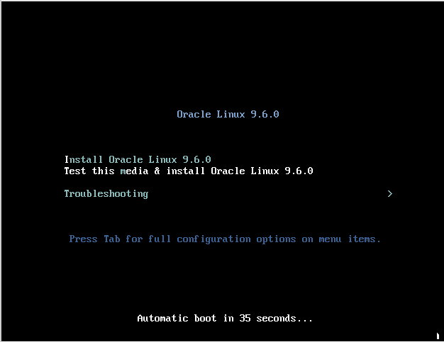

Before starting the installer, the system performs the required media and hardware initialization checks to detect storage and other devices and prepare the installation environment.

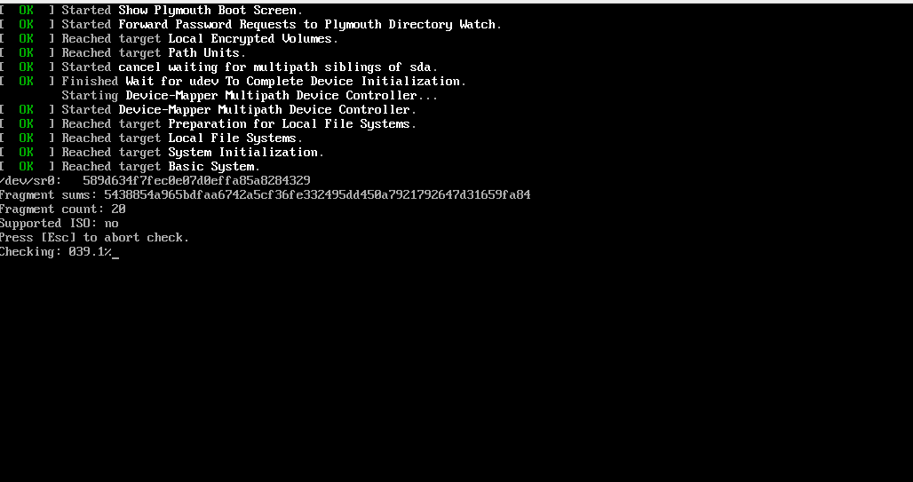

fter the Oracle Linux installer starts, configure the following settings:

- Select the preferred installation language.
- Partition the operating system disk and configure the required mount points. Adjust the partition sizes according to your environment. In this example, the **ext4** file system is used for the file systems, with swap configured separately.
- Select **Minimal Install** as the software installation profile.
- Configure the network settings and system hostname.
- Configure the root password.
- Start the installation.

Wait for the installation to complete, and then reboot the system.


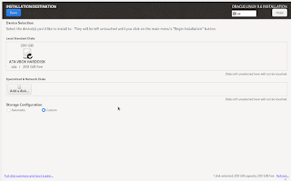
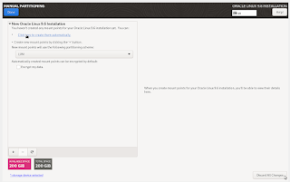
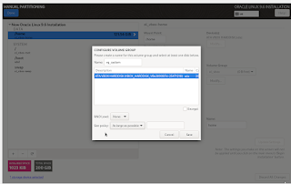
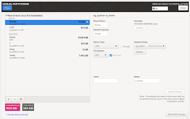
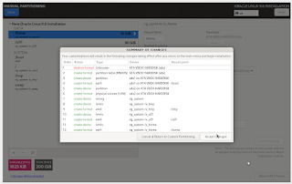
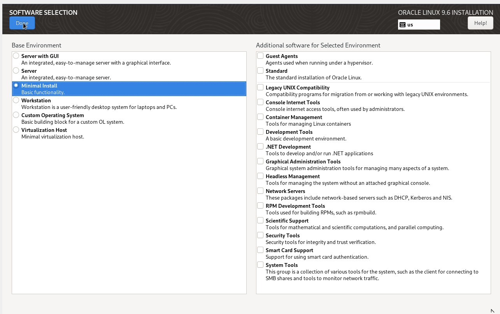
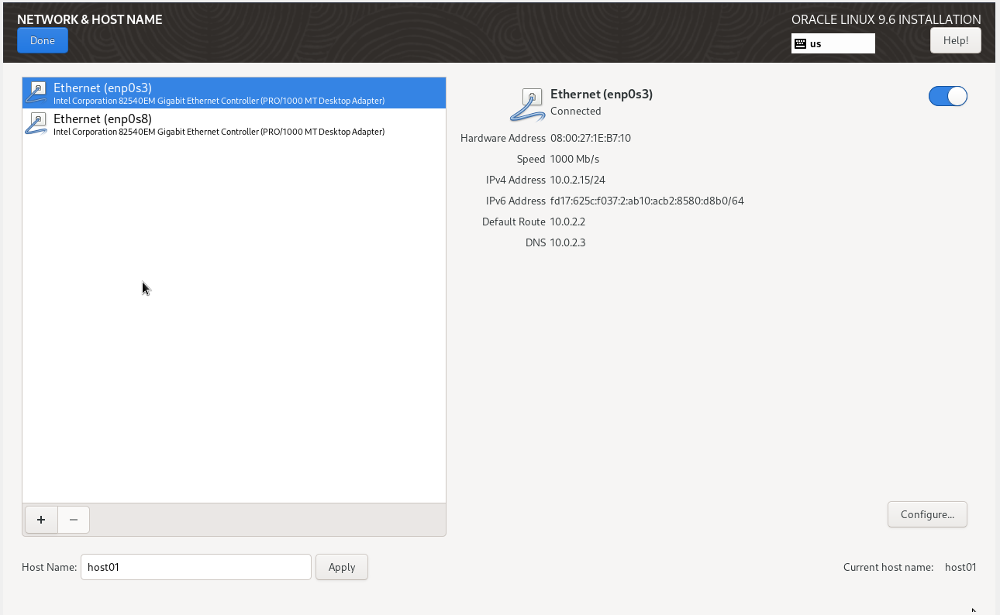
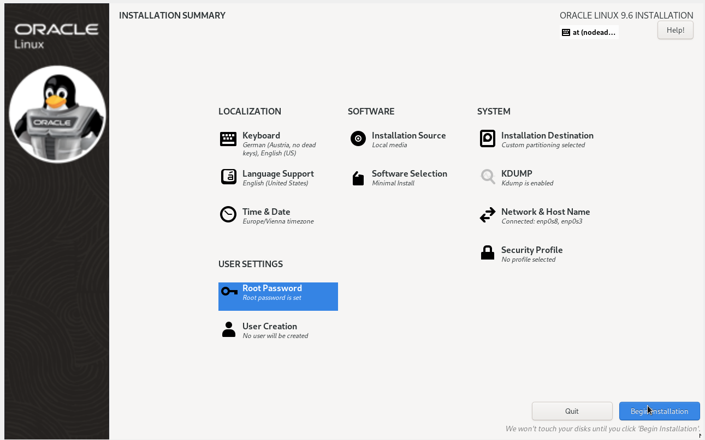
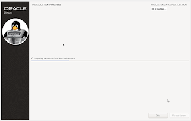

## Configure Root SSH Access

After the installation, password-based SSH login for the `root` user might not be permitted, depending on the option selected when configuring the root account during installation.

During installation, the **Allow root user to login with password** option can be enabled if password-based root SSH access is required.

If root password authentication is not enabled, the SSH configuration can contain:

```text
PermitRootLogin prohibit-password
```

This setting permits root login using SSH key authentication but prevents password-based SSH authentication.

If password-based root SSH access is required, modify the SSH configuration and set:

```text
PermitRootLogin yes
```

Restart the SSH service after modifying the configuration:

```bash
[root@server ~]# systemctl restart sshd
```

Alternatively, configure SSH key authentication for the `root` user.
