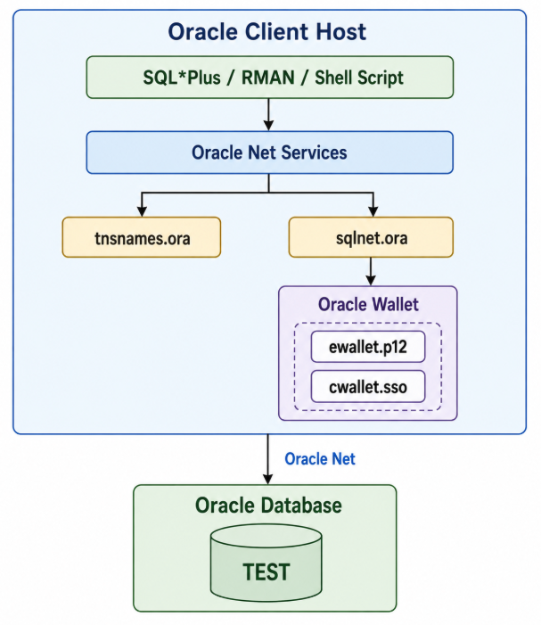

## Overview

Database administration scripts frequently require connections to Oracle Database.

Embedding database credentials directly in shell scripts is not recommended because passwords can be exposed through source code, configuration files, command history, process information, backups, or other operating system resources.

Oracle provides the **Secure External Password Store (SEPS)** to store database authentication credentials in a client-side Oracle wallet.

After the wallet is configured, database connections can be established without specifying the database username and password directly on the command line.

For example, instead of:

```bash
sqlplus sys/<password>@TEST as sysdba
```

the connection can use credentials stored in the Oracle wallet:

```bash
sqlplus /@TEST_sys as sysdba
```

This guide demonstrates how to:

- Review the Oracle Secure External Password Store architecture
- Understand the Oracle wallet files
- Create an auto-login Oracle wallet
- Configure Oracle Net to use the wallet
- Create a dedicated Oracle Net alias for the `SYS` credential
- Store the `SYS` credential in the wallet
- List and manage wallet credentials
- Connect as `SYSDBA` without specifying the `SYS` password
- Use the wallet from shell scripts
- Manage the wallet using a shell-based utility
- Review security considerations and recommended practices

## Oracle Secure External Password Store Architecture

The Secure External Password Store is a client-side Oracle wallet that stores database authentication credentials.

The basic architecture used in this guide is:



The Oracle Net alias identifies the target database, while the wallet contains the database username and password associated with that alias.

For example:

```text
TEST_sys
    |
    +-- Oracle Net alias
    |
    +-- Wallet credential
          |
          +-- Username: SYS
          +-- Password: ********
```

The connection can then be established using:

```bash
sqlplus /@TEST_sys as sysdba
```

The password does not need to be included in the command or shell script.

## Understanding the Oracle Wallet Files

An Oracle wallet can contain several types of security information depending on how the wallet is used.

For the Secure External Password Store configuration in this guide, the most important wallet files are:

```text
ewallet.p12
cwallet.sso
```

### `ewallet.p12`

The `ewallet.p12` file is the password-protected Oracle wallet.

The file uses the PKCS#12 format and contains the protected wallet data.

For example:

```text
/u01/app/oracle/wallet/ewallet.p12
```

Accessing or modifying the password-protected wallet can require the wallet password.

### `cwallet.sso`

The `cwallet.sso` file is the auto-login wallet.

For example:

```text
/u01/app/oracle/wallet/cwallet.sso
```

The auto-login wallet enables Oracle clients to access the wallet without requiring the wallet password each time the wallet is opened.

This capability is particularly useful for:

- Shell scripts
- RMAN backup scripts
- Monitoring scripts
- Scheduled jobs
- Database administration automation

The presence of an auto-login wallet does **not** mean that operating system security can be ignored.

Any operating system account that can access and use the wallet files may potentially be able to use the credentials stored in the wallet.

The wallet directory must therefore be protected using appropriate operating system permissions.

### Wallet Directory Structure

After creating the wallet, the directory is similar to:

```text
/u01/app/oracle/wallet/
├── cwallet.sso
└── ewallet.p12
```

Oracle documents `ewallet.p12` as the password-protected wallet and `cwallet.sso` as the auto-login or local auto-login wallet.

## Environment

The environment used in this guide consists of the following:

| Component | Configuration |
| --- | --- |
| Oracle Database | Oracle Database 19c |
| Database | `TEST` |
| Oracle Net Alias | `TEST_sys` |
| Wallet Credential | `SYS` |
| Administrative Privilege | `SYSDBA` |
| Wallet Location | `/u01/app/oracle/wallet` |
| Oracle Net Configuration | `$ORACLE_HOME/network/admin` |
| Operating System User | `oracle` |

Adjust the database names, Oracle Net aliases, Oracle home, and wallet locations according to your environment.

## Prerequisites

Before configuring the Secure External Password Store, verify the following:

- Oracle Database is available.
- Oracle Client or Oracle Database software is installed.
- `ORACLE_HOME` enviroment is configured.
- Oracle Net connectivity to the target database is working.
- A valid Oracle Net service alias exists for the target database.
- The operating system account creating the wallet can access the required Oracle utilities.

Verify `ORACLE_HOME`:

```bash
echo $ORACLE_HOME
```

Verify the required utilities:

```bash
[oracle@vm01 ~]$ which sqlplus mkstore orapki
/u01/app/oracle/product/19/dbhome_1/bin/sqlplus
/u01/app/oracle/product/19/dbhome_1/bin/mkstore
/u01/app/oracle/product/19/dbhome_1/bin/orapki
```

## Configuring the Oracle Net Alias

The wallet credential is associated with a database connect string.

For this guide, create a dedicated Oracle Net alias for the `SYS` wallet credential:

```text
TEST_sys
```

Edit:

```text
$ORACLE_HOME/network/admin/tnsnames.ora
```

Add the required Oracle Net configuration.

For example:

```
TEST_sys =
  (DESCRIPTION =
    (ADDRESS = (PROTOCOL = TCP)(HOST = vm01)(PORT = 1521))
    (CONNECT_DATA =
      (SERVER = DEDICATED)
      (SERVICE_NAME = test)
    )
  )
```

Each alias can identify the same database service while providing a distinct key for a wallet credential.

Verify Oracle Net connectivity:

```bash
[oracle@vm01 admin]$ tnsping TEST_sys

TNS Ping Utility for Linux: Version 19.0.0.0.0 - Production on 13-AUG-2026 20:38:37

Copyright (c) 1997, 2025, Oracle.  All rights reserved.

Used parameter files:
/u01/app/oracle/product/19/dbhome_1/network/admin/sqlnet.ora


Used TNSNAMES adapter to resolve the alias
Attempting to contact (DESCRIPTION = (ADDRESS = (PROTOCOL = TCP)(HOST = vm01)(PORT = 1521)) (CONNECT_DATA = (SERVER = DEDICATED) (SERVICE_NAME = test)))
OK (10 msec)
```

The connection alias must resolve successfully before continuing.

## Creating the Oracle Wallet

Create a directory for the Oracle wallet:

```bash
[oracle@vm01 ~]$ mkdir -p /u01/app/oracle/wallet
```

Restrict access to the directory:

```bash
[oracle@vm01 ~]$ chmod 700 /u01/app/oracle/wallet
```

Create an auto-login wallet:

```bash
[oracle@vm01 ~]$ orapki wallet create \
  -wallet /u01/app/oracle/wallet \
  -auto_login
Oracle PKI Tool Release 19.0.0.0.0 - Production
Version 19.4.0.0.0
Copyright (c) 2004, 2025, Oracle and/or its affiliates. All rights reserved.

Enter password:   
Enter password again:   
Operation is successfully completed.
```

After creating the wallet, verify the files:

```bash
[oracle@vm01 ~]$ ls -ltra /u01/app/oracle/wallet
total 16
drwxr-xr-x. 11 oracle oinstall 4096 Aug 13 20:39 ..
-rw-------.  1 oracle oinstall    0 Aug 13 20:40 ewallet.p12.lck
-rw-------.  1 oracle oinstall  225 Aug 13 20:40 ewallet.p12
-rw-------.  1 oracle oinstall    0 Aug 13 20:40 cwallet.sso.lck
drwx------.  2 oracle oinstall 4096 Aug 13 20:40 .
-rw-------.  1 oracle oinstall  270 Aug 13 20:40 cwallet.sso

```

The directory should contain files similar to:

```text
cwallet.sso
ewallet.p12
```

Verify the permissions and ensure that access is restricted to the appropriate operating system account.

## Configuring Oracle Net to Use the Wallet

Oracle Net must be configured with the location of the wallet.

Edit:

```text
$ORACLE_HOME/network/admin/sqlnet.ora
```

Configure the wallet location:

```text
WALLET_LOCATION =
  (SOURCE =
    (METHOD = FILE)
    (METHOD_DATA =
      (DIRECTORY = /u01/app/oracle/wallet)
    )
  )
```

Enable wallet credential override:

```text
SQLNET.WALLET_OVERRIDE = TRUE
```

The resulting configuration is similar to:

```text
WALLET_LOCATION =
  (SOURCE =
    (METHOD = FILE)
    (METHOD_DATA =
      (DIRECTORY = /u01/app/oracle/wallet)
    )
  )

SQLNET.WALLET_OVERRIDE = TRUE
```

`WALLET_LOCATION` instructs Oracle Net where the Oracle wallet is located.

`SQLNET.WALLET_OVERRIDE = TRUE` instructs the Oracle client to use password credentials stored in the wallet for connections using the following syntax:

```text
CONNECT /@db_connect_string
```

## Creating the SYS Wallet Credential

Create a credential for the `SYS` database account.

Use the Oracle Net alias created previously:

```text
TEST_sys
```

Create the credential:

```bash
[oracle@vm01 ~]$ mkstore \     
  -wrl /u01/app/oracle/wallet \
  -createCredential TEST_sys sys
Oracle Secret Store Tool Release 19.0.0.0.0 - Production
Version 19.4.0.0.0
Copyright (c) 2004, 2025, Oracle and/or its affiliates. All rights reserved.

Your secret/Password is missing in the command line 
Enter your secret/Password:   
Re-enter your secret/Password:   
Enter wallet password: 
```

Enter the `SYS` password when prompted.

The credential associates:

```text
Database Alias : TEST_sys
Username       : SYS
Password       : ********
```

The password is stored in the Oracle wallet rather than in the shell script or connection command.

## Listing Wallet Credentials

List the credentials stored in the wallet:

```bash
[oracle@vm01 ~]$ mkstore \
  -wrl /u01/app/oracle/wallet \
  -listCredential
Oracle Secret Store Tool Release 19.0.0.0.0 - Production
Version 19.4.0.0.0
Copyright (c) 2004, 2025, Oracle and/or its affiliates. All rights reserved.

Enter wallet password:   
List credential (index: connect_string username)
1: TEST_sys sys
```

The password itself is not displayed.

## Testing the SYSDBA Connection

After configuring the wallet and Oracle Net, test the database connection.

Connect using:

```bash
[oracle@vm01 ~]$ sqlplus /@TEST_sys as sysdba

SQL*Plus: Release 19.0.0.0.0 - Production on Thu Aug 13 20:44:12 2026
Version 19.30.0.0.0

Copyright (c) 1982, 2025, Oracle.  All rights reserved.


Connected to:
Oracle Database 19c Enterprise Edition Release 19.0.0.0.0 - Production
Version 19.30.0.0.0

SQL> 
```

No database username or password is specified on the command line.

Verify the connected user:

```sql
SQL> show user
USER is "SYS"
```

Verify the database:

```sql
SQL> r
  1  SELECT name,
  2         open_mode,
  3         database_role
  4* FROM v$database;

NAME      OPEN_MODE            DATABASE_ROLE
--------- -------------------- ----------------
TEST      READ WRITE           PRIMARY
```

The connection confirms that the `SYS` credentials were obtained from the Oracle wallet.

## Using the Wallet with Shell Scripts

The primary advantage of the Secure External Password Store is that database passwords do not need to be embedded directly in automation scripts.

Instead of:

```bash
sqlplus -s sys/<password>@TEST as sysdba
```

use:

```bash
sqlplus -s /@TEST_sys as sysdba
```

For example:

```bash
[oracle@vm01 ~]$ sqlplus -s /@TEST_sys as sysdba <<EOF
SET PAGESIZE 100
SET LINESIZE 200

SELECT name,
       open_mode,
       database_role
FROM v\$database;

EXIT;
EOF

NAME      OPEN_MODE            DATABASE_ROLE
--------- -------------------- ----------------
TEST      READ WRITE           PRIMARY
```

The script contains no database password.

The same principle can be applied to administrative scripts, monitoring scripts, and other automation that requires database authentication.

## Managing Oracle Wallet Credentials

Oracle provides the `mkstore` utility for managing credentials in the Secure External Password Store.

### List Credentials

```bash
mkstore \
  -wrl /u01/app/oracle/wallet \
  -listCredential
```

### Create a Credential

```bash
mkstore \
  -wrl /u01/app/oracle/wallet \
  -createCredential PROD_sys sys
```

### Modify a Credential

If the database password changes, update the wallet credential:

```bash
mkstore \
  -wrl /u01/app/oracle/wallet \
  -modifyCredential TEST_sys sys
```

Enter the new database password when prompted.

This enables the database password to be changed without modifying every shell script that uses:

```text
/@TEST_sys
```

### Delete a Credential

Delete an existing credential:

```bash
mkstore \
  -wrl /u01/app/oracle/wallet \
  -deleteCredential TEST_sys
```

Verify the remaining credentials:

```bash
mkstore \
  -wrl /u01/app/oracle/wallet \
  -listCredential
```

## Automating Oracle Wallet Management

The following shell script provides an interactive interface for creating an auto-login Oracle wallet and managing credentials stored in an existing wallet.

The script performs the following operations:

- Verifies that `ORACLE_HOME` is configured
- Creates an auto-login wallet
- Configures the wallet location in `sqlnet.ora`
- Configures `SQLNET.WALLET_OVERRIDE = TRUE`
- Lists existing credentials
- Creates new credentials
- Deletes credentials

### Oracle Wallet Management Script

```bash
#!/bin/bash

# display the header
display_header() {
    fixed_date="Thursday, December 09, 2024"
    
    
    echo "======================================================="
    echo ">>>>>>>>>>>> Script created by vm01 <<<<<<<<<"
    echo "======================================================="
    echo "                $fixed_date"
    echo "======================================================="
}

display_header

# ANSI color codes
RED='\033[0;31m'
GREEN='\033[0;32m'
YELLOW='\033[0;33m'
NC='\033[0m' # defaul color

print_section() {
    local message="$1"
    local color="$2"
    echo -e "${color}$message${NC}"
}

# check ORACLE_HOME
if [ -z "$ORACLE_HOME" ]; then
    print_section "ORACLE_HOME is not set. Please set it before continuing." "$RED"
    exit 1
else
    print_section "ORACLE_HOME is set to $ORACLE_HOME" "$GREEN"
fi

update_sqlnet() {
    local wallet_location="$1"
    local sqlnet_ora_path="$ORACLE_HOME/network/admin/sqlnet.ora"
    
    if grep -q "DIRECTORY = $wallet_location" "$sqlnet_ora_path"; then
        print_section "The wallet location is already configured in sqlnet.ora." "$GREEN"
    else
        echo "" >> "$sqlnet_ora_path"
        cat <<EOL >> "$sqlnet_ora_path"
WALLET_LOCATION =
  (SOURCE =
    (METHOD = FILE)
    (METHOD_DATA =
      (DIRECTORY = $wallet_location)
    )
  )
EOL
        print_section "Wallet location updated in sqlnet.ora." "$GREEN"
    fi
    
    if grep -q "SQLNET.WALLET_OVERRIDE = TRUE" "$sqlnet_ora_path"; then
        print_section "SQLNET.WALLET_OVERRIDE is already set to TRUE." "$GREEN"
    else
        echo "" >> "$sqlnet_ora_path"
        echo "SQLNET.WALLET_OVERRIDE = TRUE" >> "$sqlnet_ora_path"
        print_section "SQLNET.WALLET_OVERRIDE set to TRUE in sqlnet.ora." "$GREEN"
    fi
}

create_wallet() {
    read -p "Enter wallet location: " wallet_location
    read -sp "Enter wallet password: " wallet_password
    echo

    if orapki wallet create \
        -wallet "$wallet_location" \
        -auto_login \
        -pwd "$wallet_password" 2>/dev/null; then

        print_section "Wallet created with auto-login." "$GREEN"
        update_sqlnet "$wallet_location"
    else
        print_section "Failed to create wallet." "$RED"
    fi
}

manage_existing_wallet() {
    read -p "Enter wallet location: " wallet_location

    print_section "Managing the wallet at: $wallet_location" "$GREEN"

    while true; do
        echo -e "Options for managing the existing wallet:"
        echo -e "  1. List wallet credentials"
        echo -e "  2. Create user credential"
        echo -e "  3. Delete user credential"
        echo -e "  4. Return to main menu"
        echo -e "  5. Exit"

        read -p "Choose an option: " manage_option

        case $manage_option in
            1)
                if mkstore \
                    -wrl "$wallet_location" \
                    -listCredential 2>/dev/null; then

                    print_section "Credentials listed successfully." "$GREEN"
                else
                    print_section "Failed to list credentials." "$RED"
                fi
                ;;

            2)
                echo -e "Enter the database alias, username, and password (example: PROD_sys sys password)."

                read -p "Enter database alias (e.g., PROD_sys): " db_alias
                read -p "Enter username: " username
                read -sp "Enter password: " password
                echo

                if mkstore \
                    -wrl "$wallet_location" \
                    -createCredential "$db_alias" "$username" "$password" 2>/dev/null; then

                    print_section "User credential created." "$GREEN"
                else
                    print_section "Failed to create user credential." "$RED"
                fi
                ;;

            3)
                echo -e "Enter the database alias to delete (example: Use 'PROD_sys' to delete the credential associated with it)."

                read -p "Enter database alias to delete: " delete_alias

                if mkstore \
                    -wrl "$wallet_location" \
                    -deleteCredential "$delete_alias" 2>/dev/null; then

                    print_section "Credential $delete_alias deleted." "$GREEN"
                else
                    print_section "Failed to delete credential." "$RED"
                fi
                ;;

            4)
                break
                ;;

            5)
                print_section "Exiting script." "$YELLOW"
                exit 0
                ;;

            *)
                print_section "Invalid option selected." "$RED"
                ;;
        esac
    done
}

# main script
while true; do
    echo -e "\nMain Menu:"
    echo -e "  1. Create a new auto-login wallet"
    echo -e "  2. Manage an existing wallet"
    echo -e "  3. Exit"

    read -p "Choose an option (1, 2, or 3): " option

    case $option in
        1)
            create_wallet
            ;;

        2)
            manage_existing_wallet
            ;;

        3)
            print_section "Exiting script." "$YELLOW"
            exit 0
            ;;

        *)
            print_section "Invalid option selected." "$RED"
            ;;
    esac
done
```

## Running the Wallet Management Script

Make the script executable:

```bash
chmod 700 wallet_manager.sh
```

Run the script:

```bash
.[oracle@mbiho ~]$ ./oracle_wallet.sh 
=======================================================
>>>>>>>>>>>> Script created by MBIHO <<<<<<<<<
=======================================================
                Thursday, December 09, 2024
=======================================================
ORACLE_HOME is set to /u01/app/oracle/product/19/dbhome_1

Main Menu:
  1. Create a new auto-login wallet
  2. Manage an existing wallet
  3. Exit
Choose an option (1, 2, or 3): 2
Enter wallet location: /u01/app/oracle/wallet
Managing the wallet at: /u01/app/oracle/wallet
Options for managing the existing wallet:
  1. List wallet credentials
  2. Create user credential
  3. Delete user credential
  4. Return to main menu
  5. Exit
Choose an option: 1
Oracle Secret Store Tool Release 19.0.0.0.0 - Production
Version 19.4.0.0.0
Copyright (c) 2004, 2025, Oracle and/or its affiliates. All rights reserved.

Enter wallet password:   
List credential (index: connect_string username)
1: TEST_sys sys
Credentials listed successfully.
```

## Verifying the Complete Configuration

Verify the wallet files:

```bash
[oracle@vm01 ~]$ ls -la /u01/app/oracle/wallet
total 16
drwx------.  2 oracle oinstall 4096 Aug 13 20:40 .
drwxr-xr-x. 11 oracle oinstall 4096 Aug 13 20:39 ..
-rw-------.  1 oracle oinstall  651 Aug 13 20:42 cwallet.sso
-rw-------.  1 oracle oinstall    0 Aug 13 20:40 cwallet.sso.lck
-rw-------.  1 oracle oinstall  606 Aug 13 20:42 ewallet.p12
-rw-------.  1 oracle oinstall    0 Aug 13 20:40 ewallet.p12.lck
```

Verify the Oracle Net configuration:

```bash
[oracle@vm01 ~]$ cat $ORACLE_HOME/network/admin/sqlnet.ora
# sqlnet.ora Network Configuration File: /u01/app/oracle/product/19/dbhome_1/network/admin/sqlnet.ora
# Generated by Oracle configuration tools.

WALLET_LOCATION =
  (SOURCE =
    (METHOD = FILE)
    (METHOD_DATA =
      (DIRECTORY = /u01/app/oracle/wallet)
    )
  )

SQLNET.WALLET_OVERRIDE = TRUE

NAMES.DIRECTORY_PATH= (TNSNAMES, ONAMES, HOSTNAME)
```

Verify the database alias:

```bash
oracle@vm01 ~]$ tnsping TEST_sys

TNS Ping Utility for Linux: Version 19.0.0.0.0 - Production on 13-AUG-2026 20:51:28

Copyright (c) 1997, 2025, Oracle.  All rights reserved.

Used parameter files:
/u01/app/oracle/product/19/dbhome_1/network/admin/sqlnet.ora


Used TNSNAMES adapter to resolve the alias
Attempting to contact (DESCRIPTION = (ADDRESS = (PROTOCOL = TCP)(HOST = vm01)(PORT = 1521)) (CONNECT_DATA = (SERVER = DEDICATED) (SERVICE_NAME = test)))
OK (0 msec)
```

List the wallet credentials:

```bash
[oracle@vm01 ~]$ mkstore \
  -wrl /u01/app/oracle/wallet \
  -listCredential
Oracle Secret Store Tool Release 19.0.0.0.0 - Production
Version 19.4.0.0.0
Copyright (c) 2004, 2025, Oracle and/or its affiliates. All rights reserved.

Enter wallet password:   
List credential (index: connect_string username)
1: TEST_sys sys
```

Finally, test the passwordless administrative connection:

```bash
oracle@vm01 ~]$ sqlplus /@TEST_sys as sysdba

SQL*Plus: Release 19.0.0.0.0 - Production on Thu Aug 13 20:52:07 2026
Version 19.30.0.0.0

Copyright (c) 1982, 2025, Oracle.  All rights reserved.


Connected to:
Oracle Database 19c Enterprise Edition Release 19.0.0.0.0 - Production
Version 19.30.0.0.0

SQL> 
```

Verify the session:

```sql
SQL> show user
USER is "SYS"
```

Verify the administrative privilege:

```sql
SQL> SELECT sys_context('USERENV','ISDBA') FROM dual;

SYS_CONTEXT('USERENV','ISDBA')
--------------------------------------------------------------------------------
TRUE
```

## Security Considerations

An auto-login wallet removes the requirement to provide the wallet password when an Oracle client accesses the stored credentials.

For this reason, filesystem protection of the wallet is important.

Restrict access to the wallet directory:

```bash
chmod 700 /u01/app/oracle/wallet
```

Review the wallet files:

```bash
ls -la /u01/app/oracle/wallet
```

Only the operating system accounts that require access to the stored database credentials should have access to the wallet.

For administrative credentials such as `SYS`, apply particularly restrictive permissions because access to the wallet can provide access to highly privileged database credentials.

Where possible, use dedicated database accounts with only the privileges required by the automation instead of using `SYS` for general-purpose scripts.

## Final Verification

Verify the complete Secure External Password Store configuration.

Confirm that:

- `ORACLE_HOME` is configured correctly.
- The Oracle wallet is stored in a protected filesystem location.
- `ewallet.p12` exists.
- `cwallet.sso` exists for the auto-login wallet.
- The wallet directory has restrictive operating system permissions.
- `WALLET_LOCATION` points to the correct wallet directory.
- `SQLNET.WALLET_OVERRIDE = TRUE` is configured.
- The `TEST_sys` Oracle Net alias resolves successfully.
- The wallet contains the `TEST_sys` credential.
- The wallet credential uses the `SYS` database account.
- `sqlplus /@TEST_sys as sysdba` connects successfully.
- Shell scripts do not contain the `SYS` database password.

## Conclusion

Oracle Secure External Password Store provides a method for storing database username and password credentials in a client-side Oracle wallet.

Using an auto-login wallet allows SQL*Plus, RMAN, shell scripts, scheduled jobs, and other Oracle clients to connect without embedding database passwords directly in commands or scripts.

For the configuration demonstrated in this guide, the `SYS` credential is associated with the `TEST_sys` Oracle Net alias and can be used for an administrative connection with:

```bash
sqlplus /@TEST_sys as sysdba
```

The wallet therefore separates the database password from the scripts that require database access while allowing automated administrative connections.