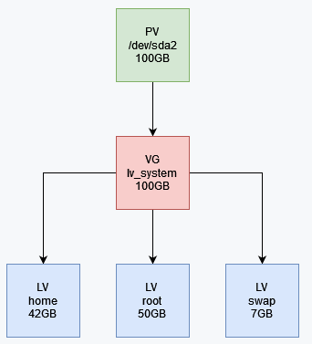

This guide describes how to extend an existing LVM logical volume by adding a new physical disk to an Oracle Linux system.

The procedure includes creating a physical volume, extending the existing volume group, increasing the size of the logical volume, and expanding the filesystem.

## What is LVM?

LVM (**Logical Volume Manager**) is a Linux storage management system that adds an abstraction layer between physical disks and logical storage volumes. It allows you to resize storage dynamically and combine multiple disks into a single storage pool.

This makes it easier to add or adjust disk space without restructuring the entire system.

## Key Components of LVM

**Physical Volume (PV):**  
A physical disk or partition used by LVM as the underlying storage.

**Volume Group (VG):**  
A storage pool created by combining one or more physical volumes.

**Logical Volume (LV):**  
A flexible logical partition created from a volume group. Logical volumes can be resized without being tied directly to a single physical disk.

## Verify the Existing LVM Configuration
Before extending the logical volume, verify the current disk layout and LVM configuration.

Run the following commands:

```console
[root@oracle7 ~]# lsblk
NAME               MAJ:MIN RM  SIZE RO TYPE MOUNTPOINT
sr0                 11:0    1 1024M  0 rom
sda                  8:0    0  100G  0 disk
├─sda2               8:2    0   99G  0 part
│ ├─lv_system-swap 252:1    0    7G  0 lvm  [SWAP]
│ ├─lv_system-home 252:2    0   42G  0 lvm  /home
│ └─lv_system-root 252:0    0   50G  0 lvm  /
└─sda1               8:1    0    1G  0 part /boot

[root@oracle7 ~]# pvs
  PV         VG        Fmt  Attr PSize   PFree
  /dev/sda2  lv_system lvm2 a--  <99.00g 4.00m

[root@oracle7 ~]# vgs
  VG        #PV #LV #SN Attr   VSize   VFree
  lv_system   1   3   0 wz--n- <99.00g 4.00m

[root@oracle7 ~]# lvs
  LV   VG        Attr       LSize  Pool Origin Data%  Meta%  Move Log Cpy%Sync Convert
  home lv_system -wi-ao---- 41.99g
  root lv_system -wi-ao---- 50.00g
  swap lv_system -wi-ao----  7.00g

[root@oracle7 ~]# df -hT
Filesystem                 Type      Size  Used Avail Use% Mounted on
devtmpfs                   devtmpfs  6.9G     0  6.9G   0% /dev
tmpfs                      tmpfs     6.9G     0  6.9G   0% /dev/shm
tmpfs                      tmpfs     6.9G  8.6M  6.9G   1% /run
tmpfs                      tmpfs     6.9G     0  6.9G   0% /sys/fs/cgroup
/dev/mapper/lv_system-root xfs        50G  2.3G   48G   5% /
/dev/mapper/lv_system-home xfs        42G   33M   42G   1% /home
/dev/sda1                  xfs      1014M  184M  831M  19% /boot
tmpfs                      tmpfs     1.4G     0  1.4G   0% /run/user/0
```

<p align="center"><em>Figure 1: Current LVM layout before extending the volume group.</em></p>

## Current Storage Layout

At this point, the system contains one LVM physical volume that belongs to the `lv_system` volume group.

Inside `lv_system`, there are three logical volumes:

- `home` — approximately **42 GB**
- `root` — **50 GB**
- `swap` — **7 GB**

The goal is to add another disk to the system and use part of that additional capacity to extend the `root` logical volume.

## Extending the LVM

### 1. Identify the New Disk

After attaching the new disk to the virtual machine, verify that the operating system detects it.

Run the following command:

```console
[root@oracle7 ~]# lsblk
NAME               MAJ:MIN RM  SIZE RO TYPE MOUNTPOINT
sda                  8:16   0  100G  0 disk
├─sda2               8:18   0   99G  0 part
│ ├─lv_system-swap 252:1    0    7G  0 lvm  [SWAP]
│ ├─lv_system-home 252:2    0   42G  0 lvm  /home
│ └─lv_system-root 252:0    0   50G  0 lvm  /
└─sda1               8:17   0    1G  0 part /boot
sr0                 11:0    1 1024M  0 rom
sdb                  8:0    0   50G  0 disk <<< NEW DISK
```

The new disk is `/dev/sdb`, and it has not yet been partitioned.

### 2. Partition the New Disk

Create a partition on the new disk.

In this example, the entire 50 GB disk is allocated to a single partition.

Run the following command:

```console
[root@oracle7 ~]# fdisk /dev/sdb
Welcome to fdisk (util-linux 2.23.2).

Changes will remain in memory only, until you decide to write them.
Be careful before using the write command.

Device does not contain a recognized partition table
Building a new DOS disklabel with disk identifier 0x3b915756.

Command (m for help): n
Partition type:
   p   primary (0 primary, 0 extended, 4 free)
   e   extended
Select (default p): p
Partition number (1-4, default 1): (PRESS ENTER)
First sector (2048-104857599, default 2048): (PRESS ENTER)
Using default value 2048
Last sector, +sectors or +size{K,M,G} (2048-104857599, default 104857599):
Using default value 104857599
Partition 1 of type Linux and of size 50 GiB is set

Command (m for help): w
The partition table has been altered!

Calling ioctl() to re-read partition table.
Syncing disks.
```

### 3. Verify the New Partition

Verify that the new partition has been created successfully.

Run the following command:

```console
[root@oracle7 ~]# lsblk
NAME               MAJ:MIN RM  SIZE RO TYPE MOUNTPOINT
sda                  8:16   0  100G  0 disk
├─sda2               8:18   0   99G  0 part
│ ├─lv_system-swap 252:1    0    7G  0 lvm  [SWAP]
│ ├─lv_system-home 252:2    0   42G  0 lvm  /home
│ └─lv_system-root 252:0    0   50G  0 lvm  /
└─sda1               8:17   0    1G  0 part /boot
sr0                 11:0    1 1024M  0 rom
sdb                  8:0    0   50G  0 disk
└─sdb1               8:1    0   50G  0 part
```

The new partition is now available as `/dev/sdb1`.

### 4. Create the Physical Volume

Initialize the new partition as an LVM physical volume.

Run the following command:

```console
[root@oracle7 ~]# pvcreate /dev/sdb1
  Physical volume "/dev/sdb1" successfully created.

[root@oracle7 ~]# pvs
  PV         VG        Fmt  Attr PSize   PFree
  /dev/sdb1            lvm2 ---  <50.00g <50.00g
  /dev/sda2  lv_system lvm2 a--  <99.00g   4.00m
```

### 5. Extend the Volume Group

Verify the existing volume group.

Run the following command:

```console
[root@oracle7 ~]# vgs
  VG        #PV #LV #SN Attr   VSize   VFree
  lv_system   1   3   0 wz--n- <99.00g 4.00m
```

Add the new physical volume to the existing volume group.

Run the following command:

```console
[root@oracle7 ~]# vgextend lv_system /dev/sdb1
  Volume group "lv_system" successfully extended
```

Verify that the volume group has been extended.

Run the following command:

```console
[root@oracle7 ~]# vgs
  VG        #PV #LV #SN Attr   VSize   VFree
  lv_system   2   3   0 wz--n- 148.99g 50.00g
```

The volume group now contains approximately **50 GB** of available free space.

### 6. Extend the Logical Volume

IVerify the current logical volume sizes.

Run the following command:

```console
[root@oracle7 ~]# lvs
  LV   VG        Attr       LSize  Pool Origin Data%  Meta%  Move Log Cpy%Sync Convert
  home lv_system -wi-ao---- 41.99g
  root lv_system -wi-ao---- 50.00g
  swap lv_system -wi-ao----  7.00g
```

Extend the `root` logical volume by **10 GB**.

Run the following command:

```console
[root@oracle7 ~]# lvextend -L +10G /dev/lv_system/root
  Size of logical volume lv_system/root changed from 50.00 GiB (12800 extents) to 60.00 GiB (15360 extents).
  Logical volume lv_system/root successfully resized.
```

Verify the new logical volume size.

Run the following command:

```console
[root@oracle7 ~]# lvs
  LV   VG        Attr       LSize  Pool Origin Data%  Meta%  Move Log Cpy%Sync Convert
  home lv_system -wi-ao---- 41.99g
  root lv_system -wi-ao---- 60.00g
  swap lv_system -wi-ao----  7.00g
```

Although the logical volume has been extended, the filesystem still reports the original size.

Verify the filesystem.

Run the following command:

```console
[root@oracle7 ~]# df -h
Filesystem                  Size  Used Avail Use% Mounted on
devtmpfs                    6.9G     0  6.9G   0% /dev
tmpfs                       6.9G     0  6.9G   0% /dev/shm
tmpfs                       6.9G  8.6M  6.9G   1% /run
tmpfs                       6.9G     0  6.9G   0% /sys/fs/cgroup
/dev/mapper/lv_system-root   50G  2.3G   48G   5% /
/dev/mapper/lv_system-home   42G   33M   42G   1% /home
/dev/sda1                  1014M  184M  831M  19% /boot
tmpfs                       1.4G     0  1.4G   0% /run/user/0
```

### 7. Extend the Filesystem

Grow the XFS filesystem to use the additional space allocated to the logical volume.

Run the following command:

```console
[root@oracle7 ~]# xfs_growfs /dev/lv_system/root
meta-data=/dev/mapper/lv_system-root isize=256    agcount=4, agsize=3276800 blks
         =                       sectsz=512   attr=2, projid32bit=1
         =                       crc=0        finobt=0 spinodes=0
data     =                       bsize=4096   blocks=13107200, imaxpct=25
         =                       sunit=0      swidth=0 blks
naming   =version 2              bsize=4096   ascii-ci=0 ftype=1
log      =internal               bsize=4096   blocks=6400, version=2
         =                       sectsz=512   sunit=0 blks, lazy-count=1
realtime =none                   extsz=4096   blocks=0, rtextents=0
data blocks changed from 13107200 to 15728640
```

> If the logical volume uses an **ext4** filesystem instead of **XFS**, use the following command:

```console
resize2fs /dev/lv_system/root
```

### 8. Verify the Filesystem

Verify that the filesystem now reflects the new logical volume size.

Run the following command::

```console
[root@oracle7 ~]# df -h
Filesystem                  Size  Used Avail Use% Mounted on
devtmpfs                    6.9G     0  6.9G   0% /dev
tmpfs                       6.9G     0  6.9G   0% /dev/shm
tmpfs                       6.9G  8.6M  6.9G   1% /run
tmpfs                       6.9G     0  6.9G   0% /sys/fs/cgroup
/dev/mapper/lv_system-root   60G  2.3G   58G   4% /
/dev/mapper/lv_system-home   42G   33M   42G   1% /home
/dev/sda1                  1014M  184M  831M  19% /boot
tmpfs                       1.4G     0  1.4G   0% /run/user/0
```

The `root` filesystem has successfully increased from **50 GB** to **60 GB**.
