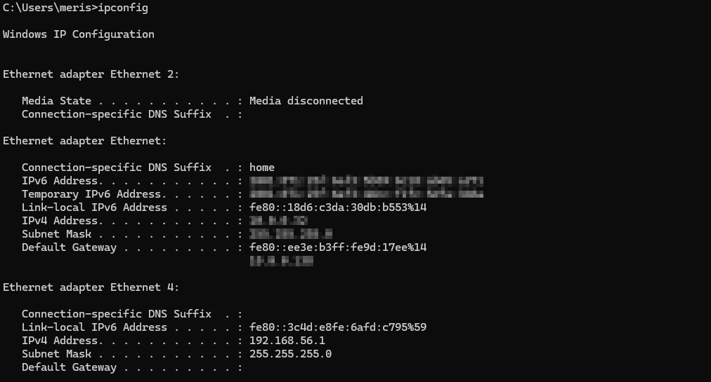
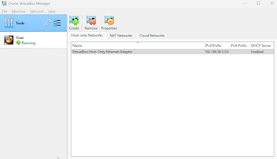
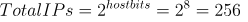
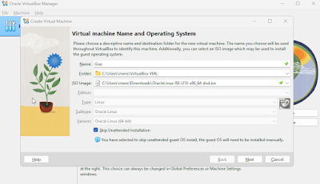
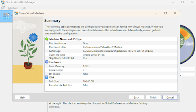
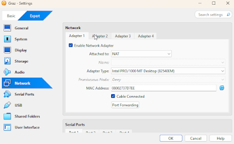
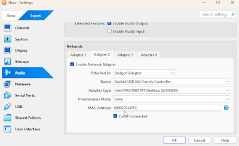

This guide describes how to configure a static IP address for an Oracle Linux virtual machine running in Oracle VirtualBox.

The procedure includes identifying the available network range, configuring VirtualBox networking, assigning a static IP address, and verifying the configuration using `nmap`.

## Verify the Host Network Configuration

The following `ipconfig` output identifies the physical network adapter and the VirtualBox Host-Only adapter.



The Host-Only adapter can also be viewed in **Oracle VirtualBox**.

**Oracle VirtualBox → File → Tools → Network Manager**



Alternatively, use PowerShell.

Run the following command:

```powershell
PS C:\Users\meris> Get-NetAdapter | Select-Object Name, InterfaceDescription, Status

Name       InterfaceDescription                                      Status
----       --------------------                                      ------
Ethernet   Realtek USB GbE Family Controller                         Up
Ethernet 3 Cisco AnyConnect Virtual Miniport Adapter for Windows x64 Disabled
Ethernet 2 Intel(R) I211 Gigabit Network Connection                  Disconnected
Ethernet 4 VirtualBox Host-Only Ethernet Adapter                     Up
```

## Identify Available IP Addresses

Use `nmap` to identify active hosts on the Host-Only network before assigning a static IP address.

Run the following command:

```powershell
C:\Users\meris>nmap -sn 192.168.56.0/24
Starting Nmap 7.97 ( https://nmap.org ) at 2025-06-08 19:04 +0200
Nmap scan report for 192.168.56.1
Host is up.
Nmap done: 256 IP addresses (1 host up) scanned in 36.98 seconds
```

On a newly created Host-Only network, the gateway (`192.168.56.1`) is typically the only active host.

## Understand the Network Address Range

The Host-Only network uses the subnet `192.168.56.0/24`.

This notation is known as **CIDR (Classless Inter-Domain Routing)** and defines both the network address and subnet size.

### CIDR Components

* `192.168.56.0` – This is the network address, the starting point of the subnet.
* `/24` – This tells us how many bits are used for the network portion of the IP address. In this case, it is 24 out of 32 bits.

### Available Host Addresses

Every IPv4 address is 32 bits long. The `/24` means 24 of those bits are used for the network, leaving the rest for hosts (devices like computers or virtual machines).

To find the number of bits available for hosts:

Host bits = 32 - 24 = 8 bits



Two IP addresses in every subnet are reserved. The first address (ending in .0) identifies the network itself, while the last address (ending in .255) is reserved for broadcast traffic. This leaves 254 usable IP addresses that can be assigned to hosts within the subnet.

For the `192.168.56.0/24` subnet, usable host addresses range from `192.168.56.2` through `192.168.56.254`.

The address `192.168.56.1` is assigned to the VirtualBox Host-Only adapter and acts as the gateway.

## Configure VirtualBox Networking







### VirtualBox Networking Simplified: NAT vs Host-Only

VirtualBox supports multiple networking modes.

- **NAT** provides outbound internet access for the virtual machine.
- **Host-Only Adapter** creates a private network between the host and the virtual machine.

For this configuration, configure two network adapters.

| Adapter | Purpose |
|---------|----------|
| Adapter 1 | NAT (Internet access) |
| Adapter 2 | Host-Only Adapter (Static IP and host communication) |

This example uses Oracle Linux 8.

If you are configuring another operating system, configure the static IP address using the operating system's network configuration tools.

## Verify the Linux Network Configuration

Verify that both network interfaces are configured correctly.

Run the following command:

```bash
[root@server-graz ~]# ip a
1: lo:  mtu 65536 qdisc noqueue state UNKNOWN group default qlen 1000
    link/loopback 00:00:00:00:00:00 brd 00:00:00:00:00:00
    inet 127.0.0.1/8 scope host lo
       valid_lft forever preferred_lft forever
    inet6 ::1/128 scope host
       valid_lft forever preferred_lft forever
2: enp0s3:  mtu 1500 qdisc fq_codel state UP group default qlen 1000
    link/ether 08:00:27:37:d7:ee brd ff:ff:ff:ff:ff:ff
    inet 10.0.2.15/24 brd 10.0.2.255 scope global dynamic noprefixroute enp0s3
       valid_lft 79580sec preferred_lft 79580sec
    inet6 fd17:625c:f037:2:a00:27ff:fe37:d7ee/64 scope global dynamic noprefixroute
       valid_lft 86311sec preferred_lft 14311sec
    inet6 fe80::a00:27ff:fe37:d7ee/64 scope link noprefixroute
       valid_lft forever preferred_lft forever
3: enp0s8:  mtu 1500 qdisc fq_codel state UP group default qlen 1000
    link/ether 08:00:27:93:47:fc brd ff:ff:ff:ff:ff:ff
    inet 192.168.56.10/24 brd 192.168.56.255 scope global noprefixroute enp0s8
       valid_lft forever preferred_lft forever
    inet6 fe80::a00:27ff:fe93:47fc/64 scope link noprefixroute
       valid_lft forever preferred_lft forever
```

The example shows:

- `enp0s3` configured for NAT.
- `enp0s8` configured for the Host-Only network with the static IP address `192.168.56.10`.

## Verify the Configuration

Verify that the virtual machine responds on the Host-Only network.

Run the following command:

```bash
nmap -sn 192.168.56.0/24
Starting Nmap 7.97 ( https://nmap.org ) at 2025-06-08 22:30 +0200
Nmap scan report for 192.168.56.10
Host is up (0.00s latency).
MAC Address: 08:00:27:93:47:FC (Oracle VirtualBox virtual NIC)
Nmap scan report for 192.168.56.100
Host is up (0.00s latency).
MAC Address: 08:00:27:C3:68:92 (Oracle VirtualBox virtual NIC)
Nmap scan report for 192.168.56.1
Host is up.
Nmap done: 256 IP addresses (3 hosts up) scanned in 48.06 seconds
```

The output shows the VirtualBox Host-Only adapter (`192.168.56.1`) together with the two active virtual machines, confirming that the static IP configuration is functioning correctly.